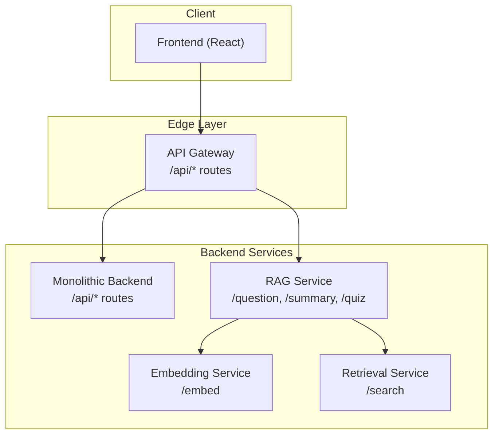
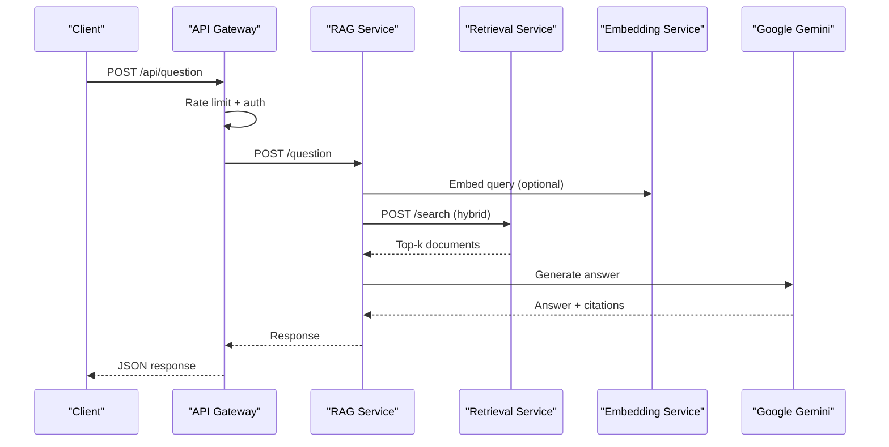
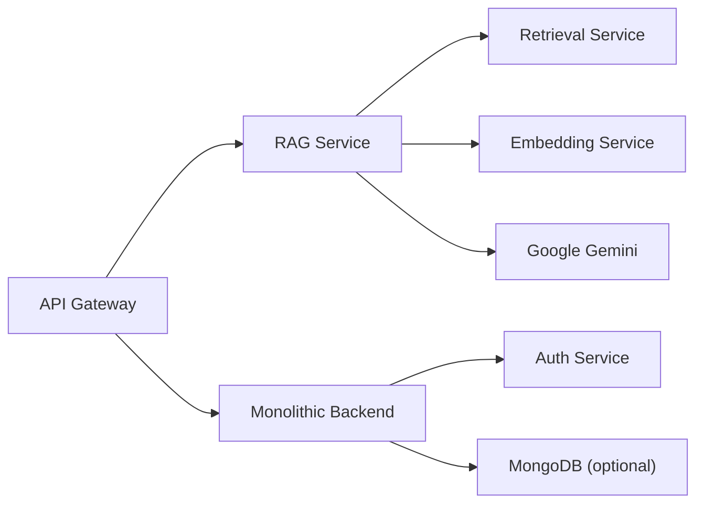

# API Reference

<cite>
**Referenced Files in This Document**
- [backend_api.py](file://backend_api.py)
- [services/api-gateway/main.py](file://services/api-gateway/main.py)
- [services/rag-service/main.py](file://services/rag-service/main.py)
- [services/embedding-service/main.py](file://services/embedding-service/main.py)
- [services/retrieval-service/main.py](file://services/retrieval-service/main.py)
- [auth/api_routes.py](file://auth/api_routes.py)
- [auth/user_routes.py](file://auth/user_routes.py)
- [auth/admin_routes.py](file://auth/admin_routes.py)
- [config.py](file://config.py)
- [README.md](file://README.md)
</cite>

## Table of Contents
1. [Introduction](#introduction)
2. [Project Structure](#project-structure)
3. [Core Components](#core-components)
4. [Architecture Overview](#architecture-overview)
5. [Detailed Component Analysis](#detailed-component-analysis)
6. [Dependency Analysis](#dependency-analysis)
7. [Performance Considerations](#performance-considerations)
8. [Troubleshooting Guide](#troubleshooting-guide)
9. [Conclusion](#conclusion)
10. [Appendices](#appendices)

## Introduction
This document provides comprehensive API documentation for MinerAI’s REST endpoints and microservices. It covers:
- REST endpoints for question answering, chat, quiz, summary, uploads, and related operations
- Authentication and authorization requirements
- Request/response schemas, parameters, and error codes
- Microservices architecture, API gateway routing, and external integrations (notably Google Gemini)
- Client implementation guidelines and integration examples

## Project Structure
MinerAI exposes two primary API surfaces:
- A monolithic FastAPI backend at the root path serving most endpoints
- A production-ready API gateway that proxies select endpoints to downstream microservices

**Diagram sources**
- [services/api-gateway/main.py:192-238](file://services/api-gateway/main.py#L192-L238)
- [services/rag-service/main.py:219-271](file://services/rag-service/main.py#L219-L271)
- [services/embedding-service/main.py:99-154](file://services/embedding-service/main.py#L99-L154)
- [services/retrieval-service/main.py:207-250](file://services/retrieval-service/main.py#L207-L250)
- [backend_api.py:447-1222](file://backend_api.py#L447-L1222)

**Section sources**
- [README.md:79-110](file://README.md#L79-L110)
- [services/api-gateway/main.py:192-238](file://services/api-gateway/main.py#L192-L238)
- [services/rag-service/main.py:219-271](file://services/rag-service/main.py#L219-L271)
- [services/embedding-service/main.py:99-154](file://services/embedding-service/main.py#L99-L154)
- [services/retrieval-service/main.py:207-250](file://services/retrieval-service/main.py#L207-L250)
- [backend_api.py:447-1222](file://backend_api.py#L447-L1222)

## Core Components
- API Gateway: Central routing, rate limiting, authentication, and health checks; proxies selected endpoints to microservices
- Monolithic Backend: Provides user management, chat history, question/summary/quiz endpoints, uploads, and system stats
- RAG Service: Orchestrates retrieval, reranking, and LLM generation via Google Gemini
- Embedding Service: Generates and caches embeddings
- Retrieval Service: Vector/BM25/hybrid search with caching and persistence

Key environment and configuration:
- Google Gemini API key configuration and fallbacks
- Rate limiting thresholds
- Hybrid retrieval weights and reranking settings

**Section sources**
- [config.py:34-44](file://config.py#L34-L44)
- [config.py:132-133](file://config.py#L132-L133)
- [config.py:77-87](file://config.py#L77-L87)
- [services/api-gateway/main.py:95-121](file://services/api-gateway/main.py#L95-L121)
- [services/rag-service/main.py:148-167](file://services/rag-service/main.py#L148-L167)

## Architecture Overview
High-level flow for the primary RAG endpoints:

**Diagram sources**
- [services/api-gateway/main.py:192-206](file://services/api-gateway/main.py#L192-L206)
- [services/rag-service/main.py:133-199](file://services/rag-service/main.py#L133-L199)
- [services/retrieval-service/main.py:207-250](file://services/retrieval-service/main.py#L207-L250)
- [services/embedding-service/main.py:99-154](file://services/embedding-service/main.py#L99-L154)

## Detailed Component Analysis

### Authentication and Authorization
- JWT-based authentication via Authorization header (Bearer token)
- Global dependency enforces token verification for protected endpoints
- Admin-only endpoints require role=admin

Endpoints:
- POST /api/auth/register
- POST /api/auth/login
- GET /api/auth/me
- POST /api/auth/change-password

Additional user/admin endpoints:
- GET /api/user/my-questions
- POST /api/user/my-questions
- DELETE /api/user/my-questions/{q_id}
- GET /api/admin/questions
- POST /api/admin/questions
- POST /api/admin/generate-questions
- PUT /api/admin/questions/{question_id}
- DELETE /api/admin/questions/{question_id}

Security notes:
- Token verification performed centrally; unauthorized responses return 401
- Admin endpoints enforce role checks

**Section sources**
- [auth/api_routes.py:58-75](file://auth/api_routes.py#L58-L75)
- [auth/api_routes.py:81-137](file://auth/api_routes.py#L81-L137)
- [auth/user_routes.py:9-61](file://auth/user_routes.py#L9-L61)
- [auth/admin_routes.py:8-147](file://auth/admin_routes.py#L8-L147)

### Monolithic Backend Endpoints

#### Question Answering
- Method: POST
- Path: /api/question
- Purpose: Non-streaming QA with optional context and metadata filtering
- Request schema:
  - question: string
  - session_id: optional string
  - use_context: boolean
  - max_context_turns: integer
  - metadata_filter: optional object
- Response schema:
  - answer: string
  - sources: array of objects with content and metadata
  - citations: array of objects
  - session_id: string
  - response_time: number
- Notes:
  - Enforces readiness; returns 503 if pipeline not ready
  - Applies security filters based on user ownership
  - Handles rate limit fallback messaging

Streaming variant:
- Method: GET
- Path: /api/question/stream
- Returns Server-Sent Events with events: token, citations, done, error

**Section sources**
- [backend_api.py:447-504](file://backend_api.py#L447-L504)
- [backend_api.py:585-662](file://backend_api.py#L585-L662)

#### Chat
- Method: POST
- Path: /api/chat
- Purpose: Bridge endpoint for frontend chat UI
- Request schema:
  - thread_id: string
  - messages: array of message items
  - metadata_filter: optional object
- Response schema:
  - text: string
  - citations: array of objects
- Notes:
  - Extracts last message text
  - Applies security and context filters

**Section sources**
- [backend_api.py:514-582](file://backend_api.py#L514-L582)

#### Summary
- Method: POST
- Path: /api/summary
- Purpose: Structured summary generation
- Request schema:
  - topic: optional string
  - session_id: optional string
  - metadata_filter: optional object
- Response schema:
  - summary: string
  - sources: array of objects
  - citations: array of objects
  - response_time: number

**Section sources**
- [backend_api.py:664-699](file://backend_api.py#L664-L699)

#### Flashcards
- Method: POST
- Path: /api/flashcards
- Purpose: Automatic flashcard generation
- Request schema:
  - topic: string
  - count: integer
  - metadata_filter: optional object
- Response schema:
  - flashcards: array of objects

**Section sources**
- [backend_api.py:701-725](file://backend_api.py#L701-L725)

#### Quiz
- Method: POST
- Path: /api/quiz
- Purpose: Interactive quiz generation
- Request schema:
  - topic: optional string
  - num_questions: integer (3–10)
  - session_id: optional string
- Response schema:
  - quiz_id: string
  - questions: array of objects
  - sources: array of objects
  - total_questions: integer

Additional quiz endpoints:
- POST /api/quiz/custom-practice: Custom practice from personal question bank
- POST /api/quiz/answer: Submit answer and evaluate
- GET /api/quiz/{quiz_id}/results: Retrieve quiz results and persist scores

**Section sources**
- [backend_api.py:748-797](file://backend_api.py#L748-L797)
- [backend_api.py:800-855](file://backend_api.py#L800-L855)
- [backend_api.py:857-961](file://backend_api.py#L857-L961)

#### Upload and Document Management
- POST /api/upload
  - Form field: file (PDF, PPTX, DOCX, TXT)
  - Response: success, message, chunks_added, file_path
- GET /api/documents
  - Lists uploaded documents visible to the user
- DELETE /api/documents/{filename}
  - Removes file and cleans up vector store

Security:
- Requires JWT; validates ownership and permissions

**Section sources**
- [backend_api.py:1112-1222](file://backend_api.py#L1112-L1222)
- [backend_api.py:1224-1298](file://backend_api.py#L1224-L1298)
- [backend_api.py:1300-1363](file://backend_api.py#L1300-L1363)

#### Sessions and History
- POST /api/session: Create session
- GET /api/session/{session_id}: Get session info
- DELETE /api/session/{session_id}: Delete session
- GET /api/history/{session_id}: Get recent messages
- DELETE /api/history/{session_id}: Clear history

**Section sources**
- [backend_api.py:1027-1110](file://backend_api.py#L1027-L1110)

#### System Statistics
- GET /api/system/statistics: System-wide stats (documents, chunks, models, sessions)
- GET /api/system-stats: Legacy stats endpoint

**Section sources**
- [backend_api.py:1365-1435](file://backend_api.py#L1365-L1435)
- [backend_api.py:1438-1502](file://backend_api.py#L1438-L1502)

### API Gateway Endpoints

#### Proxy Endpoints
- POST /api/question → RAG Service /question
- POST /api/summary → RAG Service /summary
- POST /api/quiz → RAG Service /quiz

Each proxy:
- Enforces rate limiting (default 15/min/IP)
- Verifies JWT via Auth Service
- Proxies request body to target service
- Returns JSON response or 503 on service unavailability

#### Health and Metrics
- GET /health: Checks gateway and dependent services
- GET /metrics: Prometheus metrics

**Section sources**
- [services/api-gateway/main.py:95-121](file://services/api-gateway/main.py#L95-L121)
- [services/api-gateway/main.py:126-151](file://services/api-gateway/main.py#L126-L151)
- [services/api-gateway/main.py:156-186](file://services/api-gateway/main.py#L156-L186)
- [services/api-gateway/main.py:192-238](file://services/api-gateway/main.py#L192-L238)

### RAG Service Endpoints

#### Core RAG Operations
- POST /question: Orchestrates retrieval, reranking, and LLM generation
- POST /summary: Summarization query
- POST /quiz: Starts async quiz generation task
- GET /quiz/{task_id}: Poll for quiz result

Response schemas:
- QuestionResponse: answer, sources, citations, response_time, from_cache
- Quiz endpoints: task_id/status/result for async processing

External integrations:
- Google Gemini for generation
- Retrieval Service for hybrid search
- Embedding Service for embeddings
- Translation Service for language detection/translation

**Section sources**
- [services/rag-service/main.py:50-62](file://services/rag-service/main.py#L50-L62)
- [services/rag-service/main.py:219-271](file://services/rag-service/main.py#L219-L271)

### Embedding Service Endpoints
- POST /embed: Batch embeddings with caching
- POST /embed_single: Single embedding with caching

Features:
- Caching with TTL
- Batch processing
- GPU acceleration if available

**Section sources**
- [services/embedding-service/main.py:99-154](file://services/embedding-service/main.py#L99-L154)
- [services/embedding-service/main.py:156-180](file://services/embedding-service/main.py#L156-L180)

### Retrieval Service Endpoints
- POST /search: Vector, BM25, or hybrid search with caching

Parameters:
- query: string
- k: integer
- method: "vector" | "bm25" | "hybrid"
- vector_weight, bm25_weight: numeric

**Section sources**
- [services/retrieval-service/main.py:207-250](file://services/retrieval-service/main.py#L207-L250)

## Dependency Analysis

**Diagram sources**
- [services/api-gateway/main.py:138-147](file://services/api-gateway/main.py#L138-L147)
- [services/rag-service/main.py:148-167](file://services/rag-service/main.py#L148-L167)
- [services/retrieval-service/main.py:133-145](file://services/retrieval-service/main.py#L133-L145)
- [services/embedding-service/main.py:37-39](file://services/embedding-service/main.py#L37-L39)
- [backend_api.py:24-57](file://backend_api.py#L24-L57)

**Section sources**
- [services/api-gateway/main.py:138-147](file://services/api-gateway/main.py#L138-L147)
- [services/rag-service/main.py:148-167](file://services/rag-service/main.py#L148-L167)
- [services/retrieval-service/main.py:133-145](file://services/retrieval-service/main.py#L133-L145)
- [services/embedding-service/main.py:37-39](file://services/embedding-service/main.py#L37-L39)
- [backend_api.py:24-57](file://backend_api.py#L24-L57)

## Performance Considerations
- Rate limiting: Gateway enforces 15 requests per minute per IP; RAG backend enforces 15 requests per minute for free tier Gemini limits
- Caching: Redis used for embeddings, retrieval results, and RAG query results
- Asynchronous processing: Quiz generation uses Celery tasks
- Hybrid search: Vector (70%) + BM25 (30%) with reciprocal rank fusion
- GPU acceleration: Embedding service supports GPU if available

Recommendations:
- Use streaming endpoints for long-running responses
- Apply metadata filters to reduce retrieval scope
- Monitor gateway health and Prometheus metrics

**Section sources**
- [services/api-gateway/main.py:95-121](file://services/api-gateway/main.py#L95-L121)
- [services/rag-service/main.py:72-87](file://services/rag-service/main.py#L72-L87)
- [services/retrieval-service/main.py:74-95](file://services/retrieval-service/main.py#L74-L95)
- [config.py:77-87](file://config.py#L77-L87)
- [config.py:104-110](file://config.py#L104-L110)

## Troubleshooting Guide
Common errors and resolutions:
- 401 Unauthorized: Missing or invalid Bearer token; verify JWT and Auth Service availability
- 403 Forbidden: Access denied; ensure ownership for chat history and document operations
- 400 Bad Request: Invalid request payload; check schemas and required fields
- 429 Too Many Requests: Exceeded rate limits; wait and retry
- 503 Service Unavailable: Gateway or downstream service unreachable; check /health and service logs
- Gemini rate limit fallback: System responds with guidance when exceeding free tier limits

Operational checks:
- Health endpoints: /health on gateway and services
- Metrics: /metrics for Prometheus scraping
- Logs: Inspect backend logs for exceptions and retries

**Section sources**
- [services/api-gateway/main.py:110-121](file://services/api-gateway/main.py#L110-L121)
- [services/api-gateway/main.py:156-186](file://services/api-gateway/main.py#L156-L186)
- [backend_api.py:457-513](file://backend_api.py#L457-L513)
- [backend_api.py:577-581](file://backend_api.py#L577-L581)

## Conclusion
MinerAI’s API combines a robust monolithic backend with a production-grade API gateway and modular microservices. The system integrates Google Gemini for generation, ChromaDB for vector storage, and Redis for caching, delivering scalable RAG capabilities with strong security and observability.

## Appendices

### Authentication Requirements
- All protected endpoints require Authorization: Bearer <JWT>
- Token verified centrally; unauthorized responses return 401
- Admin endpoints additionally require role=admin

**Section sources**
- [auth/api_routes.py:58-75](file://auth/api_routes.py#L58-L75)
- [auth/admin_routes.py:8-12](file://auth/admin_routes.py#L8-L12)

### Client Implementation Guidelines
- Use Authorization header for authenticated requests
- For uploads, send multipart/form-data with field “file”
- For streaming, consume Server-Sent Events from /api/question/stream
- Respect rate limits; implement exponential backoff on 429
- Use health and metrics endpoints for monitoring

**Section sources**
- [backend_api.py:1112-1222](file://backend_api.py#L1112-L1222)
- [backend_api.py:585-662](file://backend_api.py#L585-L662)
- [services/api-gateway/main.py:95-121](file://services/api-gateway/main.py#L95-L121)

### Environment Variables
- GOOGLE_API_KEY or GEMINI_API_KEY/GEMINI_API_KEYS
- MONGODB_URI (optional)
- REDIS_URL (gateway and services)
- Service-specific ports and timeouts

**Section sources**
- [config.py:34-44](file://config.py#L34-L44)
- [config.py:138-160](file://config.py#L138-L160)
- [services/api-gateway/main.py:21-25](file://services/api-gateway/main.py#L21-L25)
- [services/rag-service/main.py:21-26](file://services/rag-service/main.py#L21-L26)