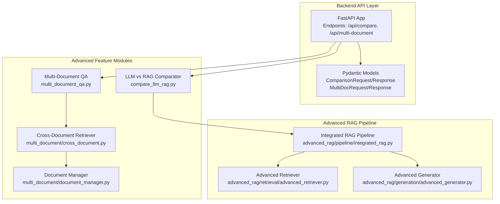
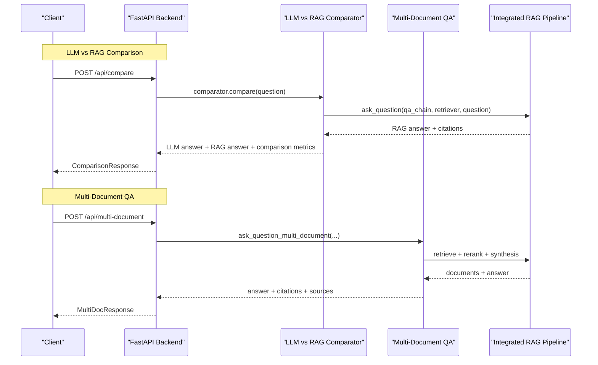
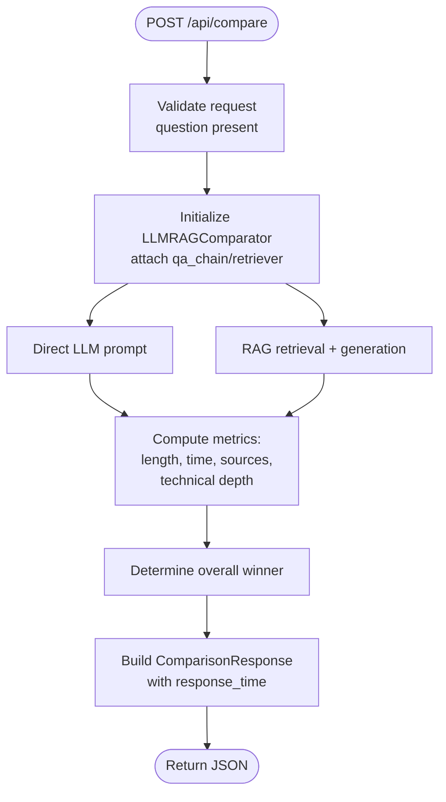
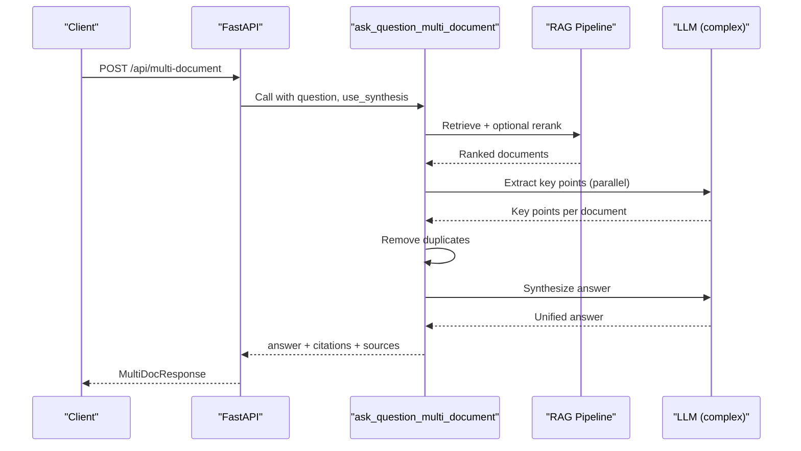
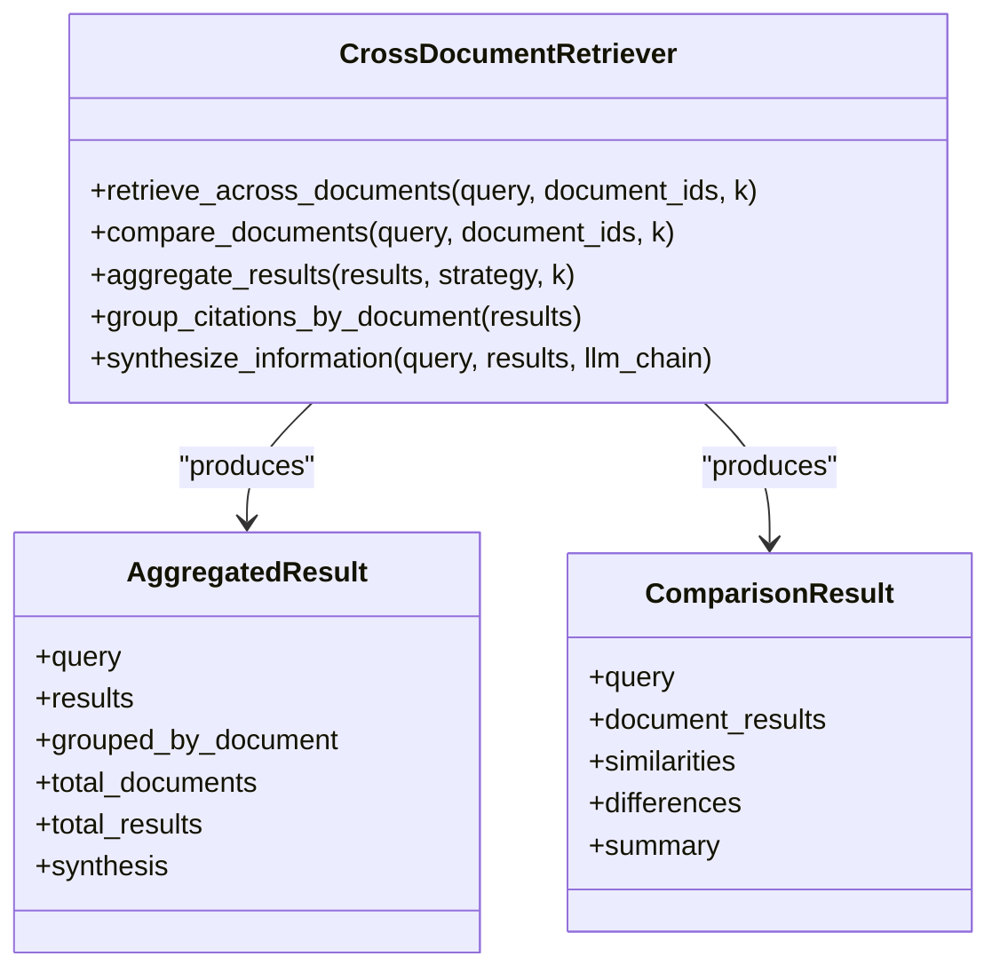
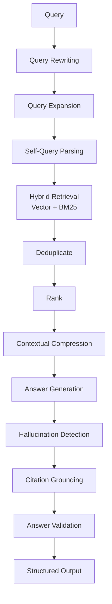
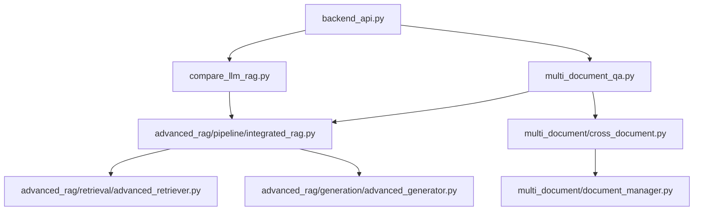

# Advanced Features API

<cite>
**Referenced Files in This Document**
- [backend_api.py](file://backend_api.py)
- [compare_llm_rag.py](file://compare_llm_rag.py)
- [multi_document_qa.py](file://multi_document_qa.py)
- [cross_document.py](file://multi_document/cross_document.py)
- [document_manager.py](file://multi_document/document_manager.py)
- [integrated_rag.py](file://advanced_rag/pipeline/integrated_rag.py)
- [advanced_retriever.py](file://advanced_rag/retrieval/advanced_retriever.py)
- [advanced_generator.py](file://advanced_rag/generation/advanced_generator.py)
</cite>

## Table of Contents
1. [Introduction](#introduction)
2. [Project Structure](#project-structure)
3. [Core Components](#core-components)
4. [Architecture Overview](#architecture-overview)
5. [Detailed Component Analysis](#detailed-component-analysis)
6. [Dependency Analysis](#dependency-analysis)
7. [Performance Considerations](#performance-considerations)
8. [Troubleshooting Guide](#troubleshooting-guide)
9. [Conclusion](#conclusion)

## Introduction
This document provides comprehensive API documentation for MinerAI's advanced features focused on comparative analysis and multi-document reasoning. It covers:
- LLM vs RAG comparison endpoint for side-by-side evaluation
- Multi-document question answering with cross-document synthesis
- Advanced retrieval patterns and result synthesis
- Request/response formats, performance metrics, and practical use cases

The goal is to enable developers and integrators to leverage these endpoints effectively for research, educational, and analytical workloads requiring comparative reasoning and cross-source synthesis.

## Project Structure
The advanced features are exposed via FastAPI endpoints in the backend and implemented using modular components:
- Backend API: Defines endpoints, request/response models, and orchestrates advanced features
- LLM vs RAG Comparator: Implements side-by-side comparison logic
- Multi-Document QA: Performs cross-document extraction, deduplication, and synthesis
- Multi-Document Module: Provides cross-document retrieval and comparison utilities
- Advanced RAG Pipeline: Production-ready pipeline with advanced retrieval, generation, and evaluation

**Diagram sources**
- [backend_api.py:963-1025](file://backend_api.py#L963-L1025)
- [compare_llm_rag.py:11-42](file://compare_llm_rag.py#L11-L42)
- [multi_document_qa.py:305-399](file://multi_document_qa.py#L305-L399)
- [cross_document.py:51-137](file://multi_document/cross_document.py#L51-L137)
- [document_manager.py:21-122](file://multi_document/document_manager.py#L21-L122)
- [integrated_rag.py:14-82](file://advanced_rag/pipeline/integrated_rag.py#L14-L82)
- [advanced_retriever.py:340-441](file://advanced_rag/retrieval/advanced_retriever.py#L340-L441)
- [advanced_generator.py:397-538](file://advanced_rag/generation/advanced_generator.py#L397-L538)

**Section sources**
- [backend_api.py:963-1025](file://backend_api.py#L963-L1025)
- [compare_llm_rag.py:11-42](file://compare_llm_rag.py#L11-L42)
- [multi_document_qa.py:305-399](file://multi_document_qa.py#L305-L399)
- [cross_document.py:51-137](file://multi_document/cross_document.py#L51-L137)
- [document_manager.py:21-122](file://multi_document/document_manager.py#L21-L122)
- [integrated_rag.py:14-82](file://advanced_rag/pipeline/integrated_rag.py#L14-L82)
- [advanced_retriever.py:340-441](file://advanced_rag/retrieval/advanced_retriever.py#L340-L441)
- [advanced_generator.py:397-538](file://advanced_rag/generation/advanced_generator.py#L397-L538)

## Core Components
This section outlines the primary components powering the advanced features and their roles in comparative analysis and multi-document reasoning.

- LLM vs RAG Comparator
  - Purpose: Compare direct LLM responses with RAG responses on identical questions
  - Key capabilities: Direct LLM prompting, RAG retrieval + generation, comparative metrics (length, time, sources, technical depth)
  - Output: Structured comparison metrics and winner determination

- Multi-Document QA
  - Purpose: Extract key points from multiple documents, deduplicate, and synthesize a unified answer
  - Key capabilities: Parallel key-point extraction, duplicate removal, synthesis with inline citations
  - Output: Unified answer, formatted citations, and source metadata

- Cross-Document Retriever
  - Purpose: Retrieve and compare information across multiple documents, group citations, and synthesize
  - Key capabilities: Retrieval across document sets, similarity/difference analysis, aggregation strategies
  - Output: Aggregated results, grouped citations, and synthesized answers

- Advanced RAG Pipeline
  - Purpose: Production-ready pipeline integrating advanced retrieval, generation, and evaluation
  - Key capabilities: Query expansion, rewriting, contextual compression, hallucination detection, citation grounding, answer validation
  - Output: Structured answers with citations, metrics, and validation metadata

**Section sources**
- [compare_llm_rag.py:11-227](file://compare_llm_rag.py#L11-L227)
- [multi_document_qa.py:71-279](file://multi_document_qa.py#L71-L279)
- [cross_document.py:51-186](file://multi_document/cross_document.py#L51-L186)
- [integrated_rag.py:14-240](file://advanced_rag/pipeline/integrated_rag.py#L14-L240)
- [advanced_retriever.py:12-173](file://advanced_rag/retrieval/advanced_retriever.py#L12-L173)
- [advanced_generator.py:12-144](file://advanced_rag/generation/advanced_generator.py#L12-L144)

## Architecture Overview
The advanced features are integrated into the FastAPI backend with robust request/response modeling and asynchronous execution to prevent blocking.

**Diagram sources**
- [backend_api.py:963-1025](file://backend_api.py#L963-L1025)
- [compare_llm_rag.py:139-166](file://compare_llm_rag.py#L139-L166)
- [multi_document_qa.py:305-399](file://multi_document_qa.py#L305-L399)
- [integrated_rag.py:133-240](file://advanced_rag/pipeline/integrated_rag.py#L133-L240)

**Section sources**
- [backend_api.py:963-1025](file://backend_api.py#L963-L1025)
- [compare_llm_rag.py:139-166](file://compare_llm_rag.py#L139-L166)
- [multi_document_qa.py:305-399](file://multi_document_qa.py#L305-L399)
- [integrated_rag.py:133-240](file://advanced_rag/pipeline/integrated_rag.py#L133-L240)

## Detailed Component Analysis

### LLM vs RAG Comparison Endpoint
- Endpoint: POST /api/compare
- Purpose: Compare direct LLM response versus RAG response for a given question
- Request Model: ComparisonRequest
  - Fields: question (required), session_id (optional)
- Response Model: ComparisonResponse
  - Fields: llm_result (object), rag_result (object), comparison (object), response_time (float)
- Processing Logic:
  - Initializes LLMRAGComparator with shared qa_chain and retriever
  - Executes direct LLM prompting and RAG retrieval + generation
  - Computes comparative metrics: length difference, time difference, source counts, technical depth
  - Determines overall winner based on comparative advantages
- Performance Metrics:
  - response_time: Total wall-clock time for comparison
  - Per-mode metrics: llm_result.time, rag_result.time, rag_result.sources.length
- Use Cases:
  - Educational evaluation: Demonstrating RAG's grounding benefits
  - Research analysis: Comparing reasoning depth and citation accuracy
  - System tuning: Identifying optimal prompts and retrieval parameters

**Diagram sources**
- [backend_api.py:963-989](file://backend_api.py#L963-L989)
- [compare_llm_rag.py:139-227](file://compare_llm_rag.py#L139-L227)

**Section sources**
- [backend_api.py:963-989](file://backend_api.py#L963-L989)
- [compare_llm_rag.py:11-227](file://compare_llm_rag.py#L11-L227)

### Multi-Document Question Answering Endpoint
- Endpoint: POST /api/multi-document
- Purpose: Answer questions using information from multiple documents with synthesis
- Request Model: MultiDocRequest
  - Fields: question (required), use_synthesis (boolean, default true), session_id (optional)
- Response Model: MultiDocResponse
  - Fields: answer (string), sources (array), citations (array), num_sources (integer), response_time (float)
- Processing Logic:
  - Uses ask_question_multi_document with qa_chain and retriever
  - Applies retrieval, optional reranking, grouping by source, parallel key-point extraction, duplicate removal, and synthesis
  - Formats citations with filename, page/slide, and relevance scores
- Performance Metrics:
  - response_time: End-to-end processing time
  - num_sources: Number of distinct documents used
- Use Cases:
  - Cross-book comparisons: Synthesizing definitions across textbooks
  - Research literature review: Consolidating findings from multiple papers
  - Policy analysis: Comparing clauses across multiple documents

**Diagram sources**
- [backend_api.py:991-1025](file://backend_api.py#L991-L1025)
- [multi_document_qa.py:305-399](file://multi_document_qa.py#L305-L399)
- [integrated_rag.py:262-325](file://advanced_rag/pipeline/integrated_rag.py#L262-L325)

**Section sources**
- [backend_api.py:991-1025](file://backend_api.py#L991-L1025)
- [multi_document_qa.py:305-399](file://multi_document_qa.py#L305-L399)
- [integrated_rag.py:262-325](file://advanced_rag/pipeline/integrated_rag.py#L262-L325)

### Cross-Document Retrieval and Comparison
- Module: multi_document/cross_document.py
- Capabilities:
  - retrieve_across_documents: Retrieve relevant content across multiple documents
  - compare_documents: Compare content across documents, analyze similarities and differences
  - aggregate_results: Apply strategies (top_k, diverse, balanced) to combine results
  - group_citations_by_document: Group retrieval results by source document
  - synthesize_information: Synthesize information from multiple sources using LLM
- Use Cases:
  - Comparative analysis: Highlighting agreements and contradictions across documents
  - Evidence aggregation: Building comprehensive summaries from heterogeneous sources
  - Document routing: Supporting intelligent routing decisions based on cross-document insights

**Diagram sources**
- [cross_document.py:51-186](file://multi_document/cross_document.py#L51-L186)
- [cross_document.py:30-49](file://multi_document/cross_document.py#L30-L49)

**Section sources**
- [cross_document.py:51-186](file://multi_document/cross_document.py#L51-L186)
- [cross_document.py:264-364](file://multi_document/cross_document.py#L264-L364)

### Advanced Retrieval Patterns and Generation
- Advanced Retriever (HybridRetriever):
  - Query rewriting and expansion
  - Self-query parsing for structured filters
  - Hybrid vector + BM25 retrieval with deduplication and ranking
  - Contextual compression for efficient generation
- Advanced Generator:
  - Hallucination detection using semantic embeddings
  - Citation grounding with similarity-based mapping
  - Answer validation with relevance, completeness, and clarity checks
  - Context filtering using MMR for diversity and relevance balance

**Diagram sources**
- [advanced_retriever.py:340-441](file://advanced_rag/retrieval/advanced_retriever.py#L340-L441)
- [advanced_generator.py:397-538](file://advanced_rag/generation/advanced_generator.py#L397-L538)
- [integrated_rag.py:133-240](file://advanced_rag/pipeline/integrated_rag.py#L133-L240)

**Section sources**
- [advanced_retriever.py:12-173](file://advanced_rag/retrieval/advanced_retriever.py#L12-L173)
- [advanced_retriever.py:340-441](file://advanced_rag/retrieval/advanced_retriever.py#L340-L441)
- [advanced_generator.py:12-144](file://advanced_rag/generation/advanced_generator.py#L12-L144)
- [advanced_generator.py:397-538](file://advanced_rag/generation/advanced_generator.py#L397-L538)
- [integrated_rag.py:133-240](file://advanced_rag/pipeline/integrated_rag.py#L133-L240)

## Dependency Analysis
The advanced features depend on the integrated RAG pipeline and supporting modules. The following diagram illustrates key dependencies:

**Diagram sources**
- [backend_api.py:46-52](file://backend_api.py#L46-L52)
- [compare_llm_rag.py:6-7](file://compare_llm_rag.py#L6-L7)
- [multi_document_qa.py:8-9](file://multi_document_qa.py#L8-L9)
- [cross_document.py:13-16](file://multi_document/cross_document.py#L13-L16)
- [document_manager.py:17-18](file://multi_document/document_manager.py#L17-L18)
- [integrated_rag.py:86-96](file://advanced_rag/pipeline/integrated_rag.py#L86-L96)
- [advanced_retriever.py:8-9](file://advanced_rag/retrieval/advanced_retriever.py#L8-L9)
- [advanced_generator.py:6-9](file://advanced_rag/generation/advanced_generator.py#L6-L9)

**Section sources**
- [backend_api.py:46-52](file://backend_api.py#L46-L52)
- [compare_llm_rag.py:6-7](file://compare_llm_rag.py#L6-L7)
- [multi_document_qa.py:8-9](file://multi_document_qa.py#L8-L9)
- [cross_document.py:13-16](file://multi_document/cross_document.py#L13-L16)
- [document_manager.py:17-18](file://multi_document/document_manager.py#L17-L18)
- [integrated_rag.py:86-96](file://advanced_rag/pipeline/integrated_rag.py#L86-L96)
- [advanced_retriever.py:8-9](file://advanced_rag/retrieval/advanced_retriever.py#L8-L9)
- [advanced_generator.py:6-9](file://advanced_rag/generation/advanced_generator.py#L6-L9)

## Performance Considerations
- Asynchronous Execution
  - Both endpoints execute heavy operations in thread pools to avoid blocking the event loop
  - Use asyncio.to_thread for LLM calls and multi-document processing
- Parallel Processing
  - Multi-document QA extracts key points in parallel per document to reduce latency
  - Thread pool limits prevent resource exhaustion
- Retrieval Efficiency
  - Hybrid retrieval with deduplication and ranking reduces irrelevant context
  - Contextual compression minimizes token usage for generation
- API Key Management
  - Built-in key rotation and quota handling for LLM calls
  - Graceful fallback when quotas are exceeded
- Caching and Persistence
  - Vector store persistence and document caching improve subsequent queries
  - Session-based metrics tracking supports performance monitoring

[No sources needed since this section provides general guidance]

## Troubleshooting Guide
- Advanced Features Not Available
  - Symptom: 501 Not Implemented for /api/compare or /api/multi-document
  - Cause: Missing imports for advanced modules
  - Resolution: Ensure compare_llm_rag.py and multi_document_qa.py are importable
- Rate Limit Exceeded
  - Symptom: API responses indicate rate limiting during streaming or multi-document processing
  - Cause: LLM provider quota limits
  - Resolution: Retry later or adjust API key configuration; the system automatically rotates keys
- RAG Pipeline Not Ready
  - Symptom: 503 Service Unavailable on advanced endpoints
  - Cause: Vector store or pipeline initialization in progress
  - Resolution: Wait for loading completion or check /health endpoint
- Empty Citations or Sources
  - Symptom: Responses lack citations despite RAG being enabled
  - Cause: Low relevance scores or insufficient documents
  - Resolution: Adjust retrieval parameters or expand document corpus
- Authentication Issues
  - Symptom: 401/403 errors on endpoints
  - Cause: Missing or invalid Authorization header
  - Resolution: Provide valid JWT token in Authorization header

**Section sources**
- [backend_api.py:968-969](file://backend_api.py#L968-L969)
- [backend_api.py:1121-1122](file://backend_api.py#L1121-L1122)
- [multi_document_qa.py:42-56](file://multi_document_qa.py#L42-L56)
- [integrated_rag.py:480-489](file://advanced_rag/pipeline/integrated_rag.py#L480-L489)

## Conclusion
MinerAI's advanced features provide powerful comparative analysis and multi-document reasoning capabilities through:
- A dedicated LLM vs RAG comparison endpoint enabling systematic evaluation of reasoning depth and citation accuracy
- A multi-document QA endpoint supporting cross-source synthesis with duplicate removal and inline citations
- A production-ready RAG pipeline incorporating advanced retrieval, generation, and validation mechanisms

These endpoints are designed for robust performance, scalability, and ease of integration, supporting diverse use cases from educational evaluation to research synthesis and policy analysis.