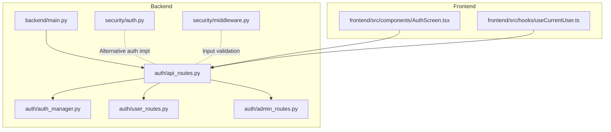
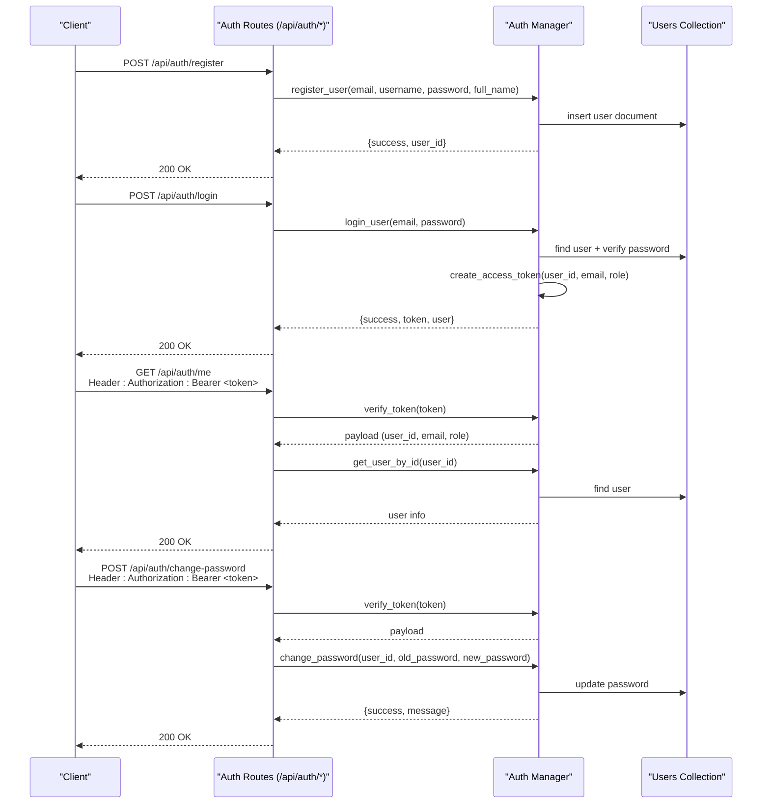
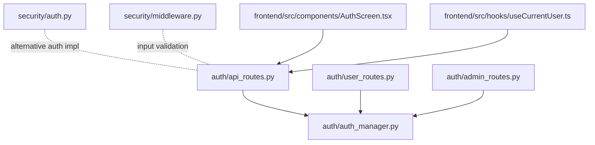

# Authentication Endpoints

<cite>
**Referenced Files in This Document**
- [auth/api_routes.py](file://auth/api_routes.py)
- [auth/auth_manager.py](file://auth/auth_manager.py)
- [auth/user_routes.py](file://auth/user_routes.py)
- [auth/admin_routes.py](file://auth/admin_routes.py)
- [security/auth.py](file://security/auth.py)
- [security/middleware.py](file://security/middleware.py)
- [frontend/src/components/AuthScreen.tsx](file://frontend/src/components/AuthScreen.tsx)
- [frontend/src/hooks/useCurrentUser.ts](file://frontend/src/hooks/useCurrentUser.ts)
- [backend/main.py](file://backend/main.py)
- [tests/integration/test_api_auth.py](file://tests/integration/test_api_auth.py)
</cite>

## Table of Contents
1. [Introduction](#introduction)
2. [Project Structure](#project-structure)
3. [Core Components](#core-components)
4. [Architecture Overview](#architecture-overview)
5. [Detailed Component Analysis](#detailed-component-analysis)
6. [Dependency Analysis](#dependency-analysis)
7. [Performance Considerations](#performance-considerations)
8. [Troubleshooting Guide](#troubleshooting-guide)
9. [Conclusion](#conclusion)
10. [Appendices](#appendices)

## Introduction
This document provides comprehensive API documentation for the authentication system, covering user registration, login, user profile retrieval, password change, and admin management endpoints. It explains JWT token handling, session management, role-based access control (RBAC), and security considerations. It also includes request/response schemas, authentication flow diagrams, and client-side integration examples for both backend and frontend components.

## Project Structure
The authentication system spans backend FastAPI routes, an authentication manager, admin and user-specific routers, security middleware, and frontend integration components. The backend entrypoint wires the routers into the main application.

**Diagram sources**
- [backend/main.py:11-41](file://backend/main.py#L11-L41)
- [auth/api_routes.py:15-15](file://auth/api_routes.py#L15-L15)
- [auth/auth_manager.py:58-58](file://auth/auth_manager.py#L58-L58)
- [auth/user_routes.py:7-7](file://auth/user_routes.py#L7-L7)
- [auth/admin_routes.py:6-6](file://auth/admin_routes.py#L6-L6)
- [security/auth.py:29-29](file://security/auth.py#L29-L29)
- [security/middleware.py:20-20](file://security/middleware.py#L20-L20)
- [frontend/src/components/AuthScreen.tsx:8-8](file://frontend/src/components/AuthScreen.tsx#L8-L8)
- [frontend/src/hooks/useCurrentUser.ts:54-54](file://frontend/src/hooks/useCurrentUser.ts#L54-L54)

**Section sources**
- [backend/main.py:11-41](file://backend/main.py#L11-L41)
- [auth/api_routes.py:15-15](file://auth/api_routes.py#L15-L15)
- [auth/auth_manager.py:58-58](file://auth/auth_manager.py#L58-L58)
- [auth/user_routes.py:7-7](file://auth/user_routes.py#L7-L7)
- [auth/admin_routes.py:6-6](file://auth/admin_routes.py#L6-L6)
- [security/auth.py:29-29](file://security/auth.py#L29-L29)
- [security/middleware.py:20-20](file://security/middleware.py#L20-L20)
- [frontend/src/components/AuthScreen.tsx:8-8](file://frontend/src/components/AuthScreen.tsx#L8-L8)
- [frontend/src/hooks/useCurrentUser.ts:54-54](file://frontend/src/hooks/useCurrentUser.ts#L54-L54)

## Core Components
- Authentication routes: registration, login, profile, password change, and protected endpoints.
- Authentication manager: JWT token creation/verification, password hashing, user lookup, and optional MongoDB/local storage fallback.
- Admin routes: admin-only endpoints for managing questions and generating AI-derived questions.
- User routes: user-specific endpoints for managing personal questions.
- Security middleware: input validation, sanitization, and security headers.
- Frontend integration: authentication UI and current user hook for client-side state.

**Section sources**
- [auth/api_routes.py:81-137](file://auth/api_routes.py#L81-L137)
- [auth/auth_manager.py:101-125](file://auth/auth_manager.py#L101-L125)
- [auth/admin_routes.py:8-12](file://auth/admin_routes.py#L8-L12)
- [auth/user_routes.py:9-21](file://auth/user_routes.py#L9-L21)
- [security/middleware.py:49-98](file://security/middleware.py#L49-L98)
- [frontend/src/components/AuthScreen.tsx:17-72](file://frontend/src/components/AuthScreen.tsx#L17-L72)
- [frontend/src/hooks/useCurrentUser.ts:21-52](file://frontend/src/hooks/useCurrentUser.ts#L21-L52)

## Architecture Overview
The authentication flow uses bearer tokens. Clients send Authorization: Bearer <token> headers for protected endpoints. The dependency get_current_user verifies the token and injects the decoded payload (user_id, email, role) into route handlers. Admin endpoints additionally enforce role checks.

**Diagram sources**
- [auth/api_routes.py:81-137](file://auth/api_routes.py#L81-L137)
- [auth/auth_manager.py:126-217](file://auth/auth_manager.py#L126-L217)
- [auth/auth_manager.py:349-384](file://auth/auth_manager.py#L349-L384)

## Detailed Component Analysis

### Authentication Endpoints

#### POST /api/auth/register
- Purpose: Register a new user.
- Request body:
  - email: string
  - username: string
  - password: string
  - full_name: string
- Response:
  - success: boolean
  - message: string
  - user_id: string (on success)
- Behavior:
  - Validates password length.
  - Hashes password using bcrypt.
  - Stores user in MongoDB or local JSON fallback.
  - Returns success with user_id on success.

**Section sources**
- [auth/api_routes.py:81-94](file://auth/api_routes.py#L81-L94)
- [auth/auth_manager.py:126-172](file://auth/auth_manager.py#L126-L172)

#### POST /api/auth/login
- Purpose: Authenticate user and issue JWT.
- Request body:
  - email: string
  - password: string
- Response:
  - success: boolean
  - message: string
  - token: string
  - user: object containing user info
- Behavior:
  - Finds user by email.
  - Verifies password.
  - Updates last_login.
  - Creates access token with user_id, email, role, exp, iat.
  - Returns token and user info.

**Section sources**
- [auth/api_routes.py:97-108](file://auth/api_routes.py#L97-L108)
- [auth/auth_manager.py:174-217](file://auth/auth_manager.py#L174-L217)

#### GET /api/auth/me
- Purpose: Retrieve current user profile.
- Headers:
  - Authorization: Bearer <token>
- Response:
  - User object without sensitive fields.
- Behavior:
  - Uses get_current_user dependency to verify token and extract user_id.
  - Fetches user from storage and returns sanitized info.

**Section sources**
- [auth/api_routes.py:111-119](file://auth/api_routes.py#L111-L119)
- [auth/api_routes.py:58-75](file://auth/api_routes.py#L58-L75)
- [auth/auth_manager.py:219-241](file://auth/auth_manager.py#L219-L241)

#### POST /api/auth/change-password
- Purpose: Change user password.
- Headers:
  - Authorization: Bearer <token>
- Request body:
  - old_password: string
  - new_password: string
- Response:
  - success: boolean
  - message: string
- Behavior:
  - Verifies token via get_current_user.
  - Validates new password length.
  - Checks old password against stored hash.
  - Updates password in storage.

**Section sources**
- [auth/api_routes.py:122-137](file://auth/api_routes.py#L122-L137)
- [auth/auth_manager.py:349-384](file://auth/auth_manager.py#L349-L384)

### Admin Management Endpoints

#### GET /api/admin/questions
- Purpose: Retrieve all system questions (admin-only).
- Headers:
  - Authorization: Bearer <token>
- Response:
  - success: boolean
  - questions: array
  - count: number
- Behavior:
  - Enforces admin role via get_current_admin.

**Section sources**
- [auth/admin_routes.py:14-29](file://auth/admin_routes.py#L14-L29)
- [auth/admin_routes.py:8-12](file://auth/admin_routes.py#L8-L12)

#### POST /api/admin/questions
- Purpose: Add a static question (admin-only).
- Headers:
  - Authorization: Bearer <token>
- Request body:
  - Question object (with optional id, created_by, created_at).
- Response:
  - success: boolean
  - message: string
  - id: string

**Section sources**
- [auth/admin_routes.py:31-51](file://auth/admin_routes.py#L31-L51)
- [auth/admin_routes.py:8-12](file://auth/admin_routes.py#L8-L12)

#### POST /api/admin/generate-questions
- Purpose: Generate AI-derived questions and save to DB (admin-only).
- Headers:
  - Authorization: Bearer <token>
- Request body:
  - topic: string
  - folder_topic: string
  - num_questions: number
- Response:
  - success: boolean
  - message: string
  - questions_added: number

**Section sources**
- [auth/admin_routes.py:53-106](file://auth/admin_routes.py#L53-L106)
- [auth/admin_routes.py:8-12](file://auth/admin_routes.py#L8-L12)

#### PUT /api/admin/questions/{question_id}
- Purpose: Update a question (admin-only).
- Headers:
  - Authorization: Bearer <token>
- Request body:
  - Question object.
- Response:
  - success: boolean
  - message: string

**Section sources**
- [auth/admin_routes.py:108-129](file://auth/admin_routes.py#L108-L129)
- [auth/admin_routes.py:8-12](file://auth/admin_routes.py#L8-L12)

#### DELETE /api/admin/questions/{question_id}
- Purpose: Delete a question (admin-only).
- Headers:
  - Authorization: Bearer <token>
- Response:
  - success: boolean
  - message: string

**Section sources**
- [auth/admin_routes.py:132-147](file://auth/admin_routes.py#L132-L147)
- [auth/admin_routes.py:8-12](file://auth/admin_routes.py#L8-L12)

### User-Specific Endpoints

#### GET /api/user/my-questions
- Purpose: Retrieve user’s personal questions.
- Headers:
  - Authorization: Bearer <token>
- Response:
  - success: boolean
  - questions: array
  - count: number
- Behavior:
  - Requires MongoDB; otherwise returns 500.

**Section sources**
- [auth/user_routes.py:9-21](file://auth/user_routes.py#L9-L21)

#### POST /api/user/my-questions
- Purpose: Add a personal question.
- Headers:
  - Authorization: Bearer <token>
- Request body:
  - Question object.
- Response:
  - success: boolean
  - message: string
  - id: string

**Section sources**
- [auth/user_routes.py:23-43](file://auth/user_routes.py#L23-L43)

#### DELETE /api/user/my-questions/{q_id}
- Purpose: Delete a personal question.
- Headers:
  - Authorization: Bearer <token>
- Response:
  - success: boolean
  - message: string

**Section sources**
- [auth/user_routes.py:45-61](file://auth/user_routes.py#L45-L61)

### JWT Token Handling and Session Management
- Token creation:
  - Payload includes user_id, email, role, exp, iat.
  - Algorithm HS256 with SECRET_KEY from environment.
- Token verification:
  - Decodes token and checks expiration.
  - Returns None for expired or invalid tokens.
- Session management:
  - Alternative implementation in security/auth.py supports session storage in MongoDB with expiry and invalidation.
  - Provides logout by invalidating sessions.

**Section sources**
- [auth/auth_manager.py:101-125](file://auth/auth_manager.py#L101-L125)
- [auth/auth_manager.py:219-241](file://auth/auth_manager.py#L219-L241)
- [security/auth.py:236-303](file://security/auth.py#L236-L303)

### Role-Based Access Control (RBAC)
- Roles:
  - admin, user, guest.
- Admin enforcement:
  - get_current_admin dependency checks role == "admin".
- Protected endpoints:
  - Admin-only endpoints require admin role.
  - User-only endpoints rely on verified token.

**Section sources**
- [auth/admin_routes.py:8-12](file://auth/admin_routes.py#L8-L12)
- [security/auth.py:321-344](file://security/auth.py#L321-L344)

### Security Considerations
- Input validation and sanitization:
  - SecurityMiddleware validates and sanitizes inputs, detects SQL injection and XSS patterns.
- Email and username validation:
  - Email format and username constraints enforced.
- Password policies:
  - Minimum length and complexity checks (in security/auth.py).
- Environment configuration:
  - JWT_SECRET_KEY and MONGODB_URI must be configured securely.

**Section sources**
- [security/middleware.py:49-98](file://security/middleware.py#L49-L98)
- [security/middleware.py:126-150](file://security/middleware.py#L126-L150)
- [security/auth.py:88-110](file://security/auth.py#L88-L110)
- [auth/auth_manager.py:21-34](file://auth/auth_manager.py#L21-L34)

### Client-Side Integration Examples

#### Frontend Authentication UI
- AuthScreen component:
  - Switches between login and register modes.
  - Submits to /api/auth/login or /api/auth/register.
  - On successful login, stores minerai_token and minerai_user in localStorage.
  - Displays localized error messages.

**Section sources**
- [frontend/src/components/AuthScreen.tsx:17-72](file://frontend/src/components/AuthScreen.tsx#L17-L72)

#### Frontend Current User Hook
- useCurrentUser:
  - Reads minerai_user from localStorage if present.
  - Falls back to decoding minerai_token to extract user info.
  - Listens to storage events for cross-tab synchronization.

**Section sources**
- [frontend/src/hooks/useCurrentUser.ts:21-52](file://frontend/src/hooks/useCurrentUser.ts#L21-L52)

## Dependency Analysis
The authentication routes depend on the Auth Manager for token handling and user persistence. Admin and user routes depend on the same manager and enforce role checks. The frontend integrates via fetch calls and localStorage.

**Diagram sources**
- [auth/api_routes.py:12-13](file://auth/api_routes.py#L12-L13)
- [auth/auth_manager.py:58-58](file://auth/auth_manager.py#L58-L58)
- [auth/user_routes.py:3-3](file://auth/user_routes.py#L3-L3)
- [auth/admin_routes.py:3-3](file://auth/admin_routes.py#L3-L3)
- [security/auth.py:29-29](file://security/auth.py#L29-L29)
- [security/middleware.py:20-20](file://security/middleware.py#L20-L20)
- [frontend/src/components/AuthScreen.tsx:8-8](file://frontend/src/components/AuthScreen.tsx#L8-L8)
- [frontend/src/hooks/useCurrentUser.ts:54-54](file://frontend/src/hooks/useCurrentUser.ts#L54-L54)

**Section sources**
- [auth/api_routes.py:12-13](file://auth/api_routes.py#L12-L13)
- [auth/auth_manager.py:58-58](file://auth/auth_manager.py#L58-L58)
- [auth/user_routes.py:3-3](file://auth/user_routes.py#L3-L3)
- [auth/admin_routes.py:3-3](file://auth/admin_routes.py#L3-L3)
- [security/auth.py:29-29](file://security/auth.py#L29-L29)
- [security/middleware.py:20-20](file://security/middleware.py#L20-L20)
- [frontend/src/components/AuthScreen.tsx:8-8](file://frontend/src/components/AuthScreen.tsx#L8-L8)
- [frontend/src/hooks/useCurrentUser.ts:54-54](file://frontend/src/hooks/useCurrentUser.ts#L54-L54)

## Performance Considerations
- Token lifetime: Access tokens expire after 24 hours.
- Storage fallback: Local JSON storage is used when MongoDB is unavailable; consider performance implications for large datasets.
- Rate limiting: Configure API rate limits at deployment level.
- Caching: Enable embedding and vector DB caches to reduce latency.

[No sources needed since this section provides general guidance]

## Troubleshooting Guide
- Missing JWT_SECRET_KEY:
  - Warning indicates insecure default; configure JWT_SECRET_KEY in environment.
- Missing MONGODB_URI:
  - AuthManager falls back to local JSON storage; ensure MongoDB is configured for production.
- 401 Unauthorized:
  - Missing or invalid Authorization header; ensure Bearer token is included.
- 403 Forbidden:
  - Admin-only endpoints require role=admin.
- 422 Unprocessable Entity:
  - Invalid JSON or missing required fields; verify request schema.

**Section sources**
- [auth/auth_manager.py:21-34](file://auth/auth_manager.py#L21-L34)
- [auth/api_routes.py:58-75](file://auth/api_routes.py#L58-L75)
- [auth/admin_routes.py:8-12](file://auth/admin_routes.py#L8-L12)
- [tests/integration/test_api_auth.py:358-385](file://tests/integration/test_api_auth.py#L358-L385)

## Conclusion
The authentication system provides robust JWT-based authentication with role-based access control, secure password handling, and flexible storage backends. Admin and user-specific endpoints extend functionality while maintaining security through validated inputs and strict authorization checks. Client-side integration is straightforward via localStorage and simple fetch calls.

[No sources needed since this section summarizes without analyzing specific files]

## Appendices

### API Reference Summary

- POST /api/auth/register
  - Request: email, username, password, full_name
  - Response: success, message, user_id

- POST /api/auth/login
  - Request: email, password
  - Response: success, message, token, user

- GET /api/auth/me
  - Headers: Authorization: Bearer <token>
  - Response: user object

- POST /api/auth/change-password
  - Headers: Authorization: Bearer <token>
  - Request: old_password, new_password
  - Response: success, message

- GET /api/admin/questions
  - Headers: Authorization: Bearer <token>
  - Response: success, questions, count

- POST /api/admin/questions
  - Headers: Authorization: Bearer <token>
  - Request: question object
  - Response: success, message, id

- POST /api/admin/generate-questions
  - Headers: Authorization: Bearer <token>
  - Request: topic, folder_topic, num_questions
  - Response: success, message, questions_added

- PUT /api/admin/questions/{question_id}
  - Headers: Authorization: Bearer <token>
  - Request: question object
  - Response: success, message

- DELETE /api/admin/questions/{question_id}
  - Headers: Authorization: Bearer <token>
  - Response: success, message

- GET /api/user/my-questions
  - Headers: Authorization: Bearer <token>
  - Response: success, questions, count

- POST /api/user/my-questions
  - Headers: Authorization: Bearer <token>
  - Request: question object
  - Response: success, message, id

- DELETE /api/user/my-questions/{q_id}
  - Headers: Authorization: Bearer <token>
  - Response: success, message

**Section sources**
- [auth/api_routes.py:81-137](file://auth/api_routes.py#L81-L137)
- [auth/admin_routes.py:14-147](file://auth/admin_routes.py#L14-L147)
- [auth/user_routes.py:9-61](file://auth/user_routes.py#L9-L61)