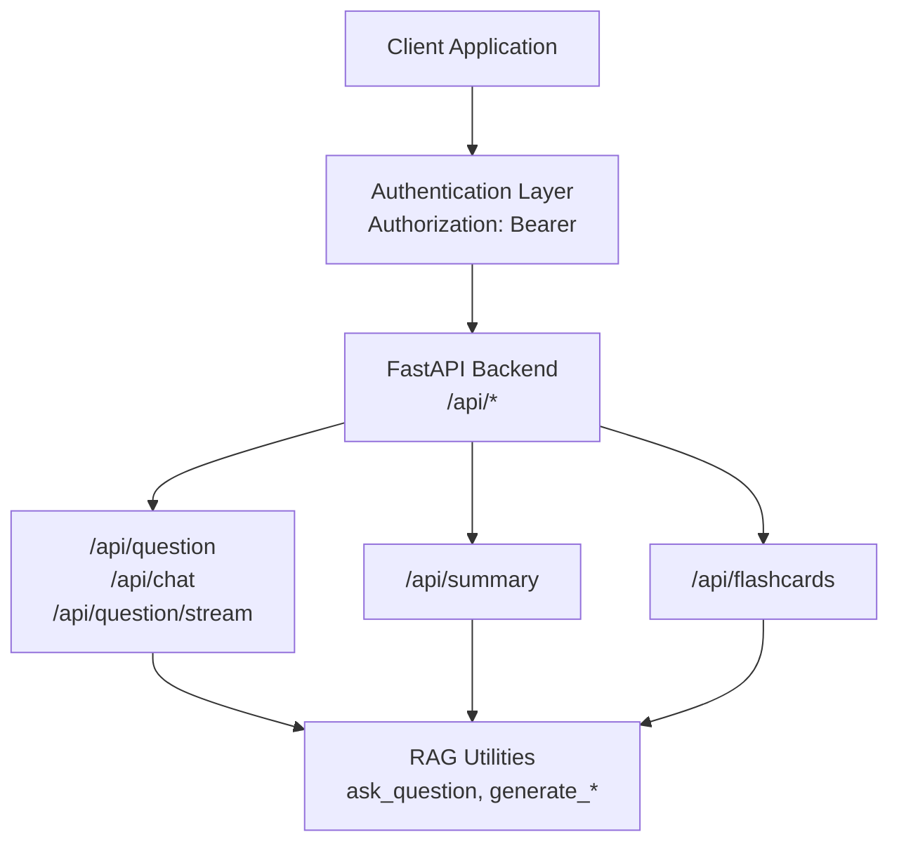
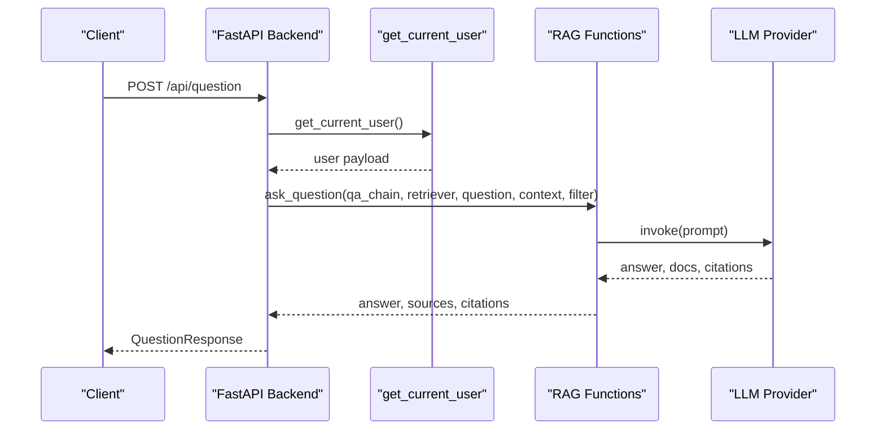
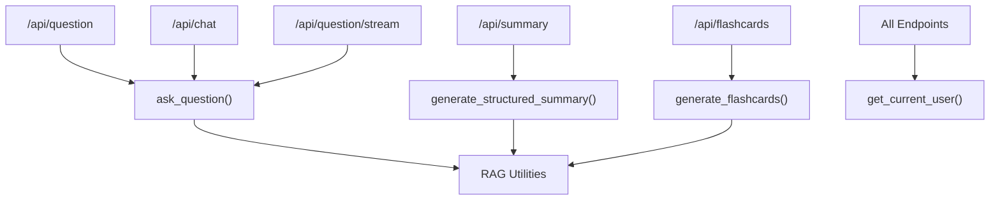

# Core Endpoints

<cite>
**Referenced Files in This Document**
- [backend_api.py](file://backend_api.py)
- [auth/api_routes.py](file://auth/api_routes.py)
- [rag.py](file://rag.py)
- [educational_engine/streaming_handler.py](file://educational_engine/streaming_handler.py)
- [frontend/src/components/SummaryNotesTab.tsx](file://frontend/src/components/SummaryNotesTab.tsx)
</cite>

## Table of Contents
1. [Introduction](#introduction)
2. [Project Structure](#project-structure)
3. [Core Components](#core-components)
4. [Architecture Overview](#architecture-overview)
5. [Detailed Component Analysis](#detailed-component-analysis)
6. [Dependency Analysis](#dependency-analysis)
7. [Performance Considerations](#performance-considerations)
8. [Troubleshooting Guide](#troubleshooting-guide)
9. [Conclusion](#conclusion)
10. [Appendices](#appendices)

## Introduction
This document provides comprehensive API documentation for MinerAI’s core endpoints focused on question answering, chat, streaming responses, document summarization, and flashcard generation. It covers HTTP methods, request/response schemas, authentication requirements, error handling, and client integration examples. It also documents the Pydantic models used by the endpoints and outlines best practices for client implementation.

## Project Structure
MinerAI exposes a FastAPI backend with authentication and routing for RAG features. The relevant endpoints are defined in the backend API module and rely on shared RAG utilities and authentication helpers.

**Diagram sources**
- [backend_api.py:447-725](file://backend_api.py#L447-L725)
- [auth/api_routes.py:58-75](file://auth/api_routes.py#L58-L75)
- [rag.py:1641-2376](file://rag.py#L1641-L2376)

**Section sources**
- [backend_api.py:447-725](file://backend_api.py#L447-L725)
- [auth/api_routes.py:58-75](file://auth/api_routes.py#L58-L75)

## Core Components
This section summarizes the primary endpoints, their purpose, and the models they use.

- Question Answering
  - Endpoint: POST /api/question
  - Purpose: Non-streaming question answering using RAG
  - Request Model: QuestionRequest
  - Response Model: QuestionResponse
- Chat
  - Endpoint: POST /api/chat
  - Purpose: Chat bridge endpoint for frontend
  - Request Model: ChatRequest
  - Response Model: ChatResponse
- Streaming Responses
  - Endpoint: POST /api/question/stream
  - Purpose: Server-Sent Events streaming of answer tokens
  - Request Model: QuestionRequest
  - Response: text/event-stream
- Document Summarization
  - Endpoint: POST /api/summary
  - Purpose: Structured summary generation
  - Request Model: SummaryRequest
  - Response Model: SummaryResponse
- Flashcard Generation
  - Endpoint: POST /api/flashcards
  - Purpose: Automatic flashcard generation
  - Request Model: FlashcardRequest
  - Response Model: FlashcardResponse

Authentication
- All endpoints require Authorization: Bearer <token> header.
- Token validation is performed via get_current_user dependency.

**Section sources**
- [backend_api.py:447-725](file://backend_api.py#L447-L725)
- [auth/api_routes.py:58-75](file://auth/api_routes.py#L58-L75)

## Architecture Overview
The endpoints integrate with the RAG pipeline and authentication layer. Requests are validated, optionally filtered by metadata and user permissions, executed asynchronously, and streamed when applicable.

**Diagram sources**
- [backend_api.py:447-514](file://backend_api.py#L447-L514)
- [auth/api_routes.py:58-75](file://auth/api_routes.py#L58-L75)
- [rag.py:1641-1660](file://rag.py#L1641-L1660)

## Detailed Component Analysis

### Question Answering (/api/question)
- Method: POST
- Path: /api/question
- Authentication: Required (Authorization: Bearer <token>)
- Request Schema: QuestionRequest
  - question: string (required)
  - session_id: string (optional)
  - use_context: boolean (default: true)
  - max_context_turns: integer (default: 5)
  - metadata_filter: object (optional)
- Response Schema: QuestionResponse
  - answer: string
  - sources: array of objects
  - citations: array of objects
  - session_id: string
  - response_time: number
- Behavior
  - Waits for RAG pipeline readiness if not ready.
  - Builds conversation context if enabled.
  - Applies user-specific security filter combined with optional metadata filter.
  - Executes ask_question and returns structured response.
- Error Handling
  - Returns 503 if pipeline is still loading.
  - Special handling for API rate limit scenario returns a user-friendly message.
- Usage Example (Client)
  - Send POST with JSON body containing question and optional filters.
  - Read answer, sources, citations, and response_time from response.

**Section sources**
- [backend_api.py:447-514](file://backend_api.py#L447-L514)
- [backend_api.py:146-151](file://backend_api.py#L146-L151)
- [backend_api.py:170-176](file://backend_api.py#L170-L176)
- [auth/api_routes.py:58-75](file://auth/api_routes.py#L58-L75)

### Chat (/api/chat)
- Method: POST
- Path: /api/chat
- Authentication: Required (Authorization: Bearer <token>)
- Request Schema: ChatRequest
  - thread_id: string (required)
  - messages: array of ChatMessageItem (required)
  - metadata_filter: object (optional)
- Response Schema: ChatResponse
  - text: string
  - citations: array of objects
- Behavior
  - Validates presence of messages and last message text.
  - Uses conversation context if available.
  - Applies security and metadata filters.
  - Calls ask_question and returns assistant reply with citations.
- Error Handling
  - Returns 400 for invalid requests.
  - Returns 503 if pipeline is loading.
  - Special handling for API rate limit returns a user-friendly message.
- Usage Example (Client)
  - Send POST with messages array ending in the user’s latest message.
  - Use thread_id to maintain conversation continuity.

**Section sources**
- [backend_api.py:515-582](file://backend_api.py#L515-L582)
- [backend_api.py:160-163](file://backend_api.py#L160-L163)
- [backend_api.py:165-167](file://backend_api.py#L165-L167)

### Streaming Responses (/api/question/stream)
- Method: POST
- Path: /api/question/stream
- Authentication: Required (Authorization: Bearer <token>)
- Request Schema: QuestionRequest
- Response: text/event-stream
  - Events:
    - token: emits answer chunks
    - citations: emits final citations
    - done: signals completion with session_id
    - error: emitted on exceptions
- Behavior
  - Streams answer in ~80-character chunks with ~15ms intervals.
  - Emits citations and done event upon completion.
  - Applies security and metadata filters.
- Error Handling
  - Emits error event on exceptions.
  - Special handling for API rate limit streams a user-friendly message.
- Usage Example (Client)
  - Use EventSource or fetch + ReadableStream to consume events.
  - Accumulate token events until done; then render citations.

**Section sources**
- [backend_api.py:585-662](file://backend_api.py#L585-L662)
- [backend_api.py:146-151](file://backend_api.py#L146-L151)

### Document Summarization (/api/summary)
- Method: POST
- Path: /api/summary
- Authentication: Required (Authorization: Bearer <token>)
- Request Schema: SummaryRequest
  - topic: string (optional)
  - session_id: string (optional)
  - metadata_filter: object (optional)
- Response Schema: SummaryResponse
  - summary: string
  - sources: array of objects
  - citations: array of objects
  - response_time: number
- Behavior
  - Generates a structured summary using generate_structured_summary.
  - Applies security and metadata filters.
- Error Handling
  - Returns 500 on internal errors.
- Usage Example (Client)
  - Send POST with optional topic; render summary and sources.

**Section sources**
- [backend_api.py:664-699](file://backend_api.py#L664-L699)
- [backend_api.py:177-186](file://backend_api.py#L177-L186)

### Flashcard Generation (/api/flashcards)
- Method: POST
- Path: /api/flashcards
- Authentication: Required (Authorization: Bearer <token>)
- Request Schema: FlashcardRequest
  - topic: string (required)
  - count: integer (default: 5)
  - metadata_filter: object (optional)
- Response Schema: FlashcardResponse
  - flashcards: array of objects
- Behavior
  - Generates flashcards using generate_flashcards.
  - Applies security and metadata filters.
- Error Handling
  - Returns 500 on internal errors.
- Usage Example (Client)
  - Send POST with topic and desired count; render flashcards.

**Section sources**
- [backend_api.py:701-725](file://backend_api.py#L701-L725)
- [backend_api.py:188-194](file://backend_api.py#L188-L194)

### Authentication and Security Filters
- Authentication
  - All endpoints depend on get_current_user which validates Authorization header and decodes JWT.
- Metadata and Security Filtering
  - Endpoints combine user-specific allowed filenames with optional metadata_filter.
  - Security filter ensures users only access permitted documents.

**Section sources**
- [auth/api_routes.py:58-75](file://auth/api_routes.py#L58-L75)
- [backend_api.py:427-445](file://backend_api.py#L427-L445)
- [backend_api.py:470-478](file://backend_api.py#L470-L478)
- [backend_api.py:544-552](file://backend_api.py#L544-L552)
- [backend_api.py:675-683](file://backend_api.py#L675-L683)
- [backend_api.py:710-718](file://backend_api.py#L710-L718)

### Client Implementation Guidelines
- General
  - Set Content-Type: application/json for JSON bodies.
  - Include Authorization: Bearer <token> header for protected endpoints.
- Question Answering
  - Send POST /api/question with QuestionRequest payload.
  - Use session_id to maintain continuity across requests.
- Chat
  - Send POST /api/chat with ChatRequest payload.
  - Use thread_id consistently for conversation continuity.
- Streaming
  - Use EventSource or fetch + ReadableStream to consume text/event-stream.
  - Accumulate token events; render citations on citations event; finalize on done.
- Summarization
  - Send POST /api/summary with SummaryRequest payload.
  - Render summary and sources.
- Flashcards
  - Send POST /api/flashcards with FlashcardRequest payload.
  - Render generated flashcards.

**Section sources**
- [frontend/src/components/SummaryNotesTab.tsx:44-64](file://frontend/src/components/SummaryNotesTab.tsx#L44-L64)
- [frontend/src/components/SummaryNotesTab.tsx:74-89](file://frontend/src/components/SummaryNotesTab.tsx#L74-L89)

## Dependency Analysis
The endpoints depend on shared RAG utilities and authentication. The following diagram shows key dependencies.

**Diagram sources**
- [backend_api.py:447-725](file://backend_api.py#L447-L725)
- [auth/api_routes.py:58-75](file://auth/api_routes.py#L58-L75)
- [rag.py:1641-2376](file://rag.py#L1641-L2376)

**Section sources**
- [backend_api.py:447-725](file://backend_api.py#L447-L725)
- [auth/api_routes.py:58-75](file://auth/api_routes.py#L58-L75)
- [rag.py:1641-2376](file://rag.py#L1641-L2376)

## Performance Considerations
- Streaming
  - Streaming endpoints emit ~80-character chunks with ~15ms intervals to improve perceived responsiveness.
- Asynchronous Execution
  - Long-running operations are offloaded to threads to avoid blocking the event loop.
- Rate Limit Handling
  - Special handling exists for API rate limits; clients should retry after a cooling period.

**Section sources**
- [backend_api.py:621-628](file://backend_api.py#L621-L628)
- [backend_api.py:506-513](file://backend_api.py#L506-L513)
- [backend_api.py:577-581](file://backend_api.py#L577-L581)

## Troubleshooting Guide
Common Issues and Resolutions
- Authentication Failure
  - Symptom: 401 Not authenticated or invalid/expired token.
  - Resolution: Ensure Authorization: Bearer <valid_token> header is present and unexpired.
- Pipeline Not Ready
  - Symptom: 503 Service Unavailable during initial load.
  - Resolution: Retry after the system indicates readiness or wait for background initialization.
- Empty Messages
  - Symptom: 400 Bad Request for chat endpoint.
  - Resolution: Ensure the messages array is not empty and the last message contains text.
- Rate Limit Exceeded
  - Symptom: User-friendly message indicating rate limit for free tier.
  - Resolution: Wait for the cooling period before retrying.
- Internal Errors
  - Symptom: 500 Internal Server Error for summarization or flashcards.
  - Resolution: Inspect server logs; verify metadata filters and document availability.

**Section sources**
- [auth/api_routes.py:58-75](file://auth/api_routes.py#L58-L75)
- [backend_api.py:450-460](file://backend_api.py#L450-L460)
- [backend_api.py:517-526](file://backend_api.py#L517-L526)
- [backend_api.py:528-535](file://backend_api.py#L528-L535)
- [backend_api.py:698-699](file://backend_api.py#L698-L699)
- [backend_api.py:724-725](file://backend_api.py#L724-L725)

## Conclusion
MinerAI’s core endpoints provide robust, authenticated access to question answering, chat, streaming responses, summarization, and flashcard generation. Clients should adhere to the documented schemas, handle streaming events properly, and implement retry logic for rate-limited scenarios. The authentication and filtering mechanisms ensure secure access to user-specific content.

## Appendices

### Request and Response Schemas

- QuestionRequest
  - question: string (required)
  - session_id: string (optional)
  - use_context: boolean (default: true)
  - max_context_turns: integer (default: 5)
  - metadata_filter: object (optional)
- QuestionResponse
  - answer: string
  - sources: array of objects
  - citations: array of objects
  - session_id: string
  - response_time: number
- ChatRequest
  - thread_id: string (required)
  - messages: array of ChatMessageItem (required)
  - metadata_filter: object (optional)
- ChatResponse
  - text: string
  - citations: array of objects
- SummaryRequest
  - topic: string (optional)
  - session_id: string (optional)
  - metadata_filter: object (optional)
- SummaryResponse
  - summary: string
  - sources: array of objects
  - citations: array of objects
  - response_time: number
- FlashcardRequest
  - topic: string (required)
  - count: integer (default: 5)
  - metadata_filter: object (optional)
- FlashcardResponse
  - flashcards: array of objects

**Section sources**
- [backend_api.py:146-194](file://backend_api.py#L146-L194)

### Endpoint Reference

- POST /api/question
  - Description: Non-streaming question answering
  - Auth: Required
  - Request: QuestionRequest
  - Response: QuestionResponse
- POST /api/chat
  - Description: Chat endpoint
  - Auth: Required
  - Request: ChatRequest
  - Response: ChatResponse
- POST /api/question/stream
  - Description: Streaming answer tokens
  - Auth: Required
  - Request: QuestionRequest
  - Response: text/event-stream
- POST /api/summary
  - Description: Structured summary
  - Auth: Required
  - Request: SummaryRequest
  - Response: SummaryResponse
- POST /api/flashcards
  - Description: Flashcards generation
  - Auth: Required
  - Request: FlashcardRequest
  - Response: FlashcardResponse

**Section sources**
- [backend_api.py:447-725](file://backend_api.py#L447-L725)