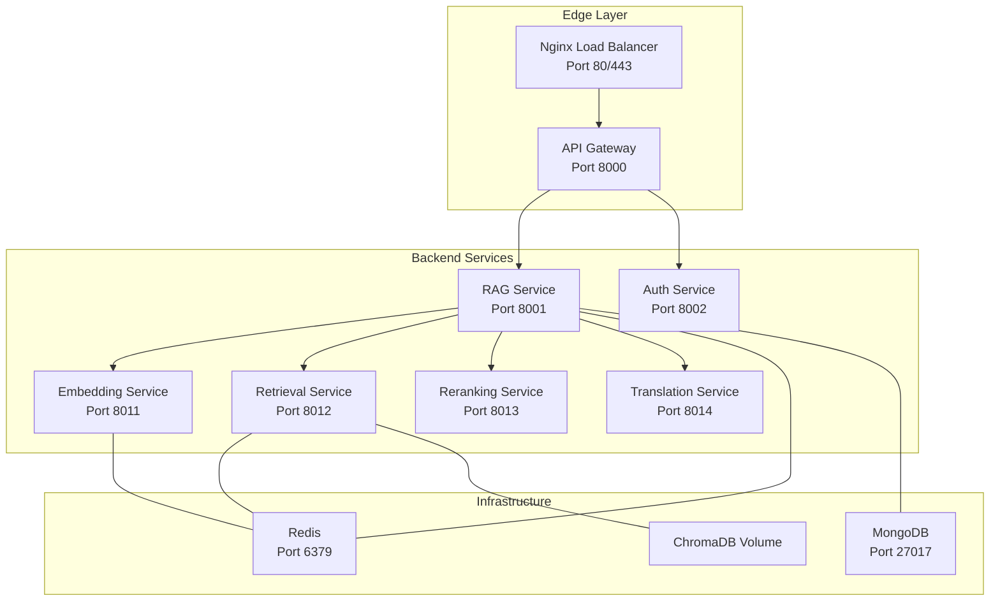
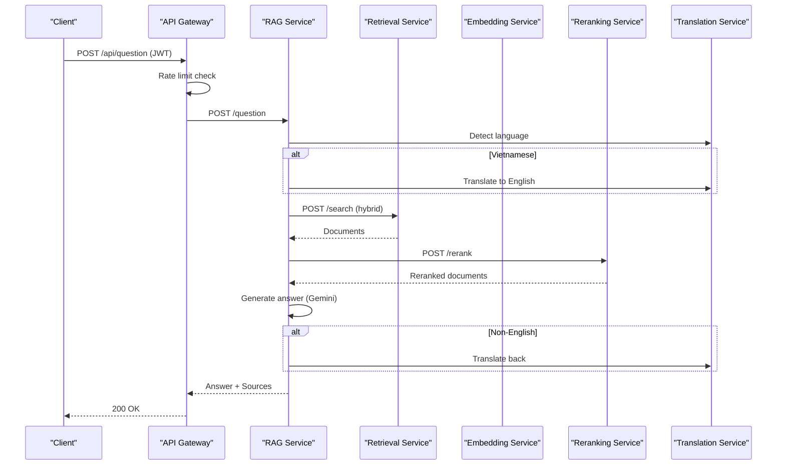
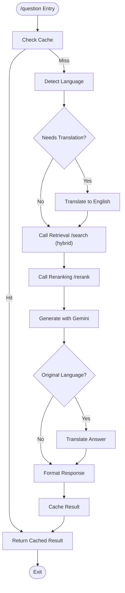
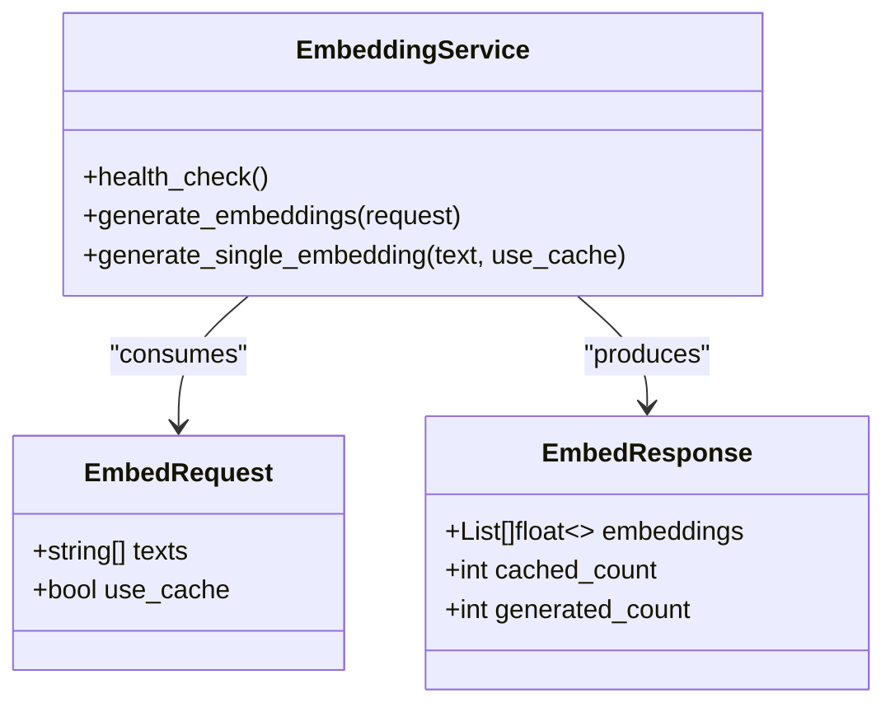
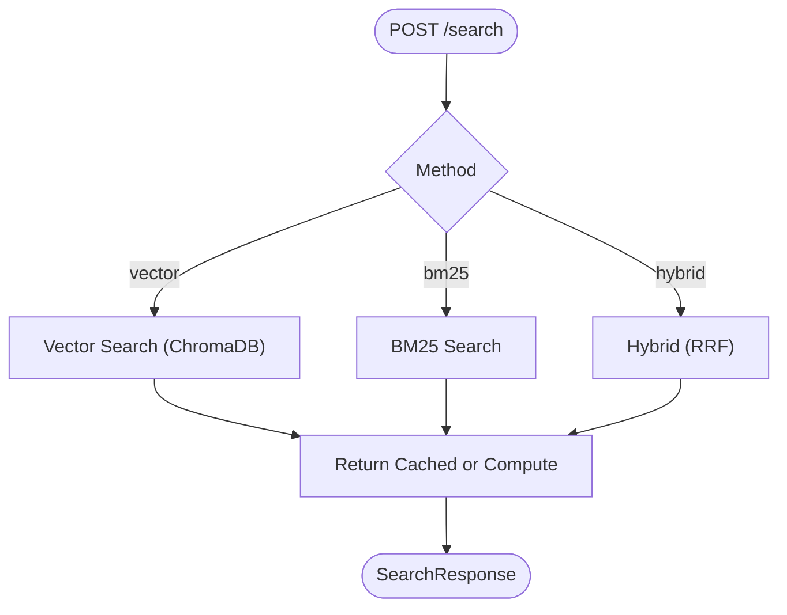
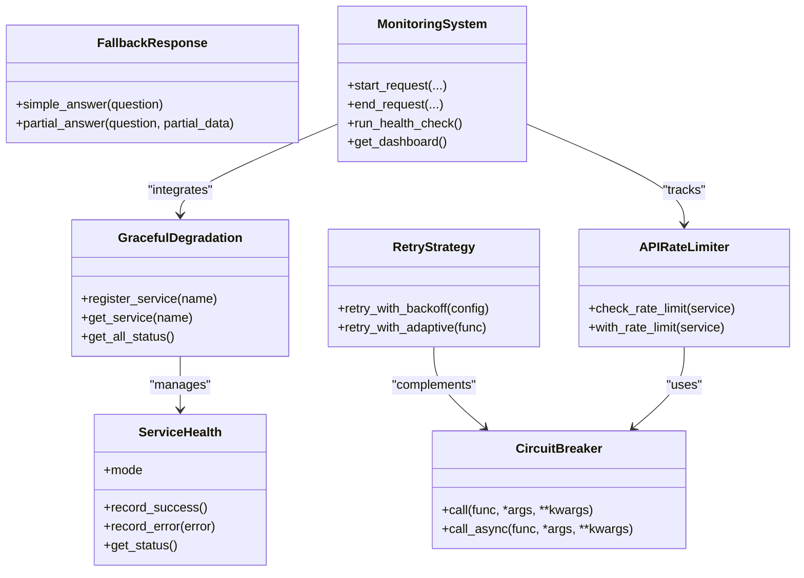
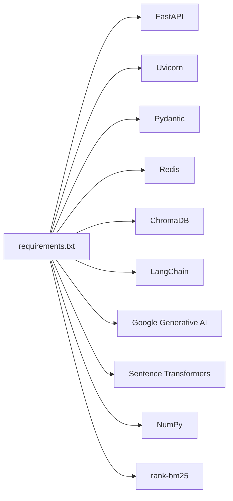

# Microservices API

<cite>
**Referenced Files in This Document**
- [services/api-gateway/main.py](file://services/api-gateway/main.py)
- [services/rag-service/main.py](file://services/rag-service/main.py)
- [services/embedding-service/main.py](file://services/embedding-service/main.py)
- [services/retrieval-service/main.py](file://services/retrieval-service/main.py)
- [docker-compose.production.yml](file://docker-compose.production.yml)
- [requirements.txt](file://requirements.txt)
- [reliability/retry_strategy.py](file://reliability/retry_strategy.py)
- [reliability/rate_limiter.py](file://reliability/rate_limiter.py)
- [reliability/graceful_degradation.py](file://reliability/graceful_degradation.py)
- [reliability/monitoring.py](file://reliability/monitoring.py)
</cite>

## Table of Contents
1. [Introduction](#introduction)
2. [Project Structure](#project-structure)
3. [Core Components](#core-components)
4. [Architecture Overview](#architecture-overview)
5. [Detailed Component Analysis](#detailed-component-analysis)
6. [Dependency Analysis](#dependency-analysis)
7. [Performance Considerations](#performance-considerations)
8. [Troubleshooting Guide](#troubleshooting-guide)
9. [Conclusion](#conclusion)

## Introduction
This document provides comprehensive API documentation for MinerAI’s microservices architecture. It covers the API Gateway routing, RAG service endpoints, embedding service operations, and retrieval service queries. It also documents inter-service communication patterns, service discovery, load balancing, and fault tolerance mechanisms. The goal is to enable developers and operators to integrate, deploy, and maintain the distributed system effectively.

## Project Structure
MinerAI is organized as a set of independent FastAPI microservices behind a centralized API Gateway. Services communicate via HTTP and Redis-backed caching. A production-grade Docker Compose deployment orchestrates load balancing, health checks, and observability.

**Diagram sources**
- [docker-compose.production.yml:7-359](file://docker-compose.production.yml#L7-L359)
- [services/api-gateway/main.py:44-269](file://services/api-gateway/main.py#L44-L269)
- [services/rag-service/main.py:31-299](file://services/rag-service/main.py#L31-L299)
- [services/embedding-service/main.py:28-204](file://services/embedding-service/main.py#L28-L204)
- [services/retrieval-service/main.py:28-275](file://services/retrieval-service/main.py#L28-L275)

**Section sources**
- [docker-compose.production.yml:7-359](file://docker-compose.production.yml#L7-L359)
- [services/api-gateway/main.py:44-269](file://services/api-gateway/main.py#L44-L269)

## Core Components
- API Gateway: Centralized ingress with routing, authentication, rate limiting, and health checks.
- RAG Service: Orchestrates the RAG pipeline, integrates with embedding, retrieval, reranking, and translation services, and exposes question/summary/quiz endpoints.
- Embedding Service: Generates and caches embeddings with batching and optional GPU acceleration.
- Retrieval Service: Provides vector/BM25/hybrid search with reciprocal rank fusion and Redis caching.
- Supporting Reliability Modules: Retry with exponential backoff, adaptive retry, circuit breaker, rate limiting, graceful degradation, and monitoring/alerting.

**Section sources**
- [services/api-gateway/main.py:192-238](file://services/api-gateway/main.py#L192-L238)
- [services/rag-service/main.py:219-271](file://services/rag-service/main.py#L219-L271)
- [services/embedding-service/main.py:99-180](file://services/embedding-service/main.py#L99-L180)
- [services/retrieval-service/main.py:207-250](file://services/retrieval-service/main.py#L207-L250)
- [reliability/retry_strategy.py:86-194](file://reliability/retry_strategy.py#L86-L194)
- [reliability/rate_limiter.py:278-324](file://reliability/rate_limiter.py#L278-L324)
- [reliability/graceful_degradation.py:158-200](file://reliability/graceful_degradation.py#L158-L200)
- [reliability/monitoring.py:335-373](file://reliability/monitoring.py#L335-L373)

## Architecture Overview
The system follows a service mesh pattern:
- API Gateway routes requests to the RAG service and enforces auth and rate limits.
- RAG service orchestrates downstream services: Embedding, Retrieval, Reranking, and Translation.
- Redis is used for caching and coordination; ChromaDB stores vector embeddings; MongoDB stores user and auxiliary data.
- Docker Compose manages service discovery, health checks, and scaling.

**Diagram sources**
- [services/api-gateway/main.py:192-238](file://services/api-gateway/main.py#L192-L238)
- [services/rag-service/main.py:118-175](file://services/rag-service/main.py#L118-L175)
- [services/retrieval-service/main.py:207-250](file://services/retrieval-service/main.py#L207-L250)

**Section sources**
- [docker-compose.production.yml:7-359](file://docker-compose.production.yml#L7-L359)
- [services/rag-service/main.py:93-199](file://services/rag-service/main.py#L93-L199)

## Detailed Component Analysis

### API Gateway
- Purpose: Single entry point for clients; handles CORS, rate limiting, JWT verification, and proxying to downstream services.
- Health Check: Probes Redis and RAG service health.
- Metrics: Exposes Prometheus metrics for request counts and durations.
- Routes:
  - POST /api/question → RAG /question
  - POST /api/summary → RAG /summary
  - POST /api/quiz → RAG /quiz

Key behaviors:
- Rate limiting: 15 requests per minute per IP using Redis.
- Authentication: Verifies JWT by calling the Auth service.
- Resilience: On Redis failure, allows requests (fail-open); on downstream unavailability, returns 503.

**Section sources**
- [services/api-gateway/main.py:69-121](file://services/api-gateway/main.py#L69-L121)
- [services/api-gateway/main.py:126-151](file://services/api-gateway/main.py#L126-L151)
- [services/api-gateway/main.py:156-186](file://services/api-gateway/main.py#L156-L186)
- [services/api-gateway/main.py:192-238](file://services/api-gateway/main.py#L192-L238)

### RAG Service
- Purpose: Orchestrates the RAG pipeline with caching, translation, hybrid retrieval, reranking, and LLM generation.
- Endpoints:
  - GET /health
  - POST /question (QuestionRequest) → QuestionResponse
  - POST /summary (topic)
  - POST /quiz (topic, num_questions) → task_id
  - GET /quiz/{task_id} → result or progress
- Internal pipeline:
  - Cache lookup by question hash.
  - Language detection and translation (optional).
  - Hybrid search via Retrieval service.
  - Rerank via Reranking service.
  - LLM answer generation (Gemini).
  - Optional translation back.
  - Cache result with TTL.

**Diagram sources**
- [services/rag-service/main.py:93-199](file://services/rag-service/main.py#L93-L199)

**Section sources**
- [services/rag-service/main.py:205-271](file://services/rag-service/main.py#L205-L271)
- [services/rag-service/main.py:93-199](file://services/rag-service/main.py#L93-L199)

### Embedding Service
- Purpose: Generates embeddings with caching and batching.
- Endpoints:
  - GET /health
  - POST /embed (EmbedRequest) → EmbedResponse
  - POST /embed_single (text, use_cache)
- Features:
  - Caching with MD5-based keys and 7-day TTL.
  - Batch processing with configurable batch size.
  - Optional GPU acceleration.

**Diagram sources**
- [services/embedding-service/main.py:48-56](file://services/embedding-service/main.py#L48-L56)
- [services/embedding-service/main.py:99-180](file://services/embedding-service/main.py#L99-L180)

**Section sources**
- [services/embedding-service/main.py:89-180](file://services/embedding-service/main.py#L89-L180)

### Retrieval Service
- Purpose: Performs vector search, BM25 keyword search, and hybrid fusion with reciprocal rank.
- Endpoints:
  - GET /health
  - POST /search (SearchRequest) → SearchResponse
- Features:
  - Vector search via ChromaDB.
  - BM25 search with preloaded index.
  - Hybrid fusion with configurable weights.
  - Redis caching for search results.

**Diagram sources**
- [services/retrieval-service/main.py:207-250](file://services/retrieval-service/main.py#L207-L250)

**Section sources**
- [services/retrieval-service/main.py:197-250](file://services/retrieval-service/main.py#L197-L250)

### Inter-Service Communication Patterns
- HTTP/JSON: All internal service calls use synchronous HTTP with timeouts configured.
- Redis: Used for caching and coordination (e.g., embedding cache, search cache, task queues).
- Docker Compose: Services discover each other via service names and ports; Nginx load balances the API Gateway.

**Section sources**
- [docker-compose.production.yml:7-359](file://docker-compose.production.yml#L7-L359)
- [services/rag-service/main.py:40-44](file://services/rag-service/main.py#L40-L44)
- [services/embedding-service/main.py:35](file://services/embedding-service/main.py#L35)
- [services/retrieval-service/main.py:35-39](file://services/retrieval-service/main.py#L35-L39)

### Fault Tolerance Mechanisms
- Graceful Degradation: Tracks service modes (FULL, DEGRADED, MINIMAL, OFFLINE) and applies fallback responses when offline.
- Retry with Exponential Backoff: Configurable attempts with jitter and retry budget to avoid thundering herds.
- Adaptive Retry: Adjusts max attempts based on observed success rate.
- Circuit Breaker: Opens after threshold failures and periodically attempts recovery.
- Rate Limiting: Sliding window and token bucket to protect upstream APIs (e.g., Gemini).
- Monitoring & Alerts: Request tracing, performance metrics, slow request detection, and quota warnings.

**Diagram sources**
- [reliability/graceful_degradation.py:74-99](file://reliability/graceful_degradation.py#L74-L99)
- [reliability/retry_strategy.py:86-194](file://reliability/retry_strategy.py#L86-L194)
- [reliability/rate_limiter.py:99-181](file://reliability/rate_limiter.py#L99-L181)
- [reliability/monitoring.py:261-333](file://reliability/monitoring.py#L261-L333)

**Section sources**
- [reliability/graceful_degradation.py:158-200](file://reliability/graceful_degradation.py#L158-L200)
- [reliability/retry_strategy.py:242-303](file://reliability/retry_strategy.py#L242-L303)
- [reliability/rate_limiter.py:278-324](file://reliability/rate_limiter.py#L278-L324)
- [reliability/monitoring.py:335-373](file://reliability/monitoring.py#L335-L373)

## Dependency Analysis
External dependencies include FastAPI, Uvicorn, Pydantic, Redis, ChromaDB, LangChain, and Google Generative AI. These are declared in requirements and used across services.

**Diagram sources**
- [requirements.txt:1-43](file://requirements.txt#L1-L43)

**Section sources**
- [requirements.txt:1-43](file://requirements.txt#L1-L43)

## Performance Considerations
- Embedding batching reduces overhead; tune BATCH_SIZE for throughput vs latency.
- Hybrid retrieval improves recall; adjust vector_weight and bm25_weight for domain needs.
- Redis caching significantly reduces latency for repeated queries; monitor cache hit ratios.
- Gemini quotas and circuit breaker prevent overload; use rate limiting wrappers around external calls.
- GPU acceleration can be enabled via USE_GPU; ensure CUDA availability in production.

[No sources needed since this section provides general guidance]

## Troubleshooting Guide
Common operational issues and remedies:
- Gateway health degraded: Check Redis connectivity and RAG service availability.
- Rate limit exceeded: Client should back off or reduce request frequency.
- Embedding/Retrieval slow: Verify Redis and ChromaDB health; scale replicas.
- RAG pipeline errors: Inspect downstream service logs; confirm Google API key and quotas.
- Circuit breaker open: Allow recovery window; inspect upstream stability.

**Section sources**
- [services/api-gateway/main.py:156-186](file://services/api-gateway/main.py#L156-L186)
- [services/rag-service/main.py:205-217](file://services/rag-service/main.py#L205-L217)
- [reliability/rate_limiter.py:116-181](file://reliability/rate_limiter.py#L116-L181)

## Conclusion
MinerAI’s microservices architecture delivers a robust, scalable, and observable RAG system. The API Gateway centralizes routing and resilience, while specialized services handle embeddings, retrieval, reranking, and translation. Built-in reliability modules ensure graceful operation under stress, and Docker Compose simplifies deployment and scaling.