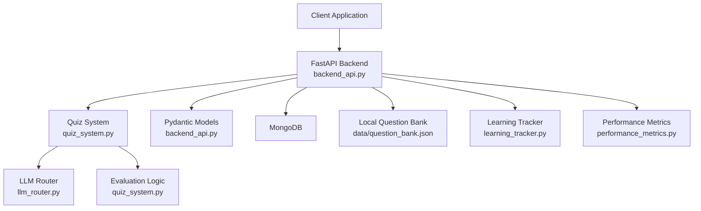
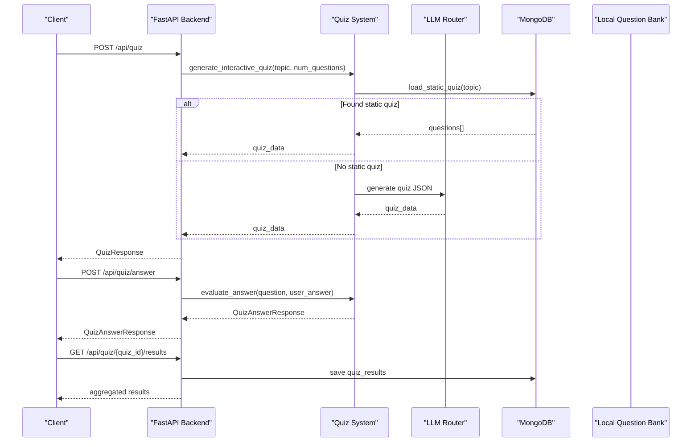
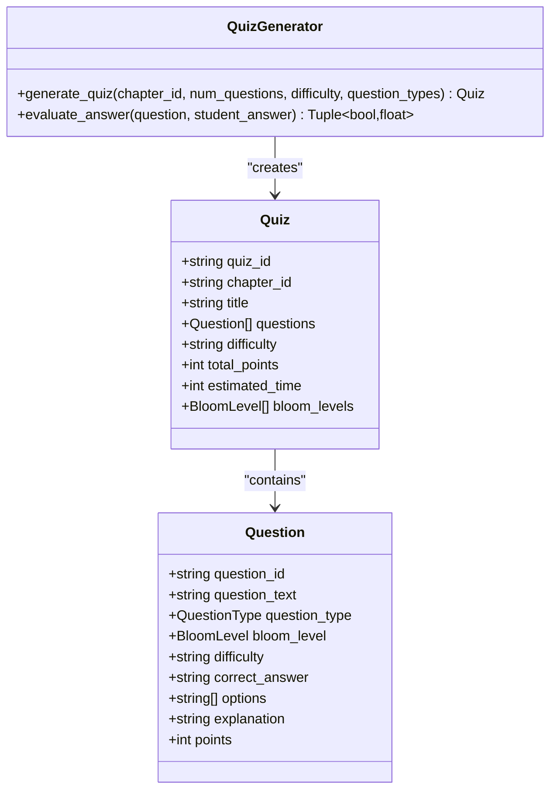
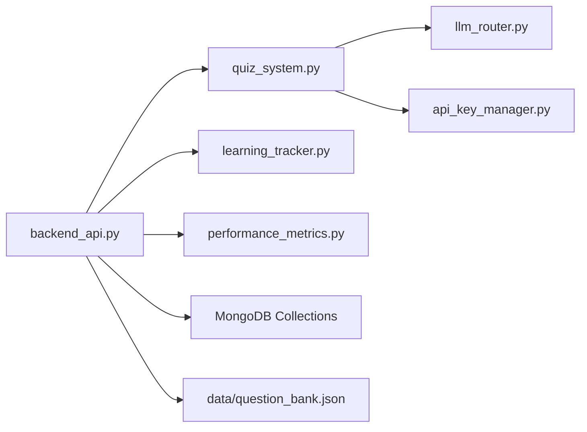

# Quiz & Assessment Endpoints

<cite>
**Referenced Files in This Document**
- [backend_api.py](file://backend_api.py)
- [quiz_system.py](file://quiz_system.py)
- [quiz_generator.py](file://quiz_generator.py)
- [test_quiz_endpoint.py](file://test_quiz_endpoint.py)
- [question_bank.json](file://data/question_bank.json)
- [learning_tracker.py](file://learning_tracker.py)
- [performance_metrics.py](file://performance_metrics.py)
</cite>

## Table of Contents
1. [Introduction](#introduction)
2. [Project Structure](#project-structure)
3. [Core Components](#core-components)
4. [Architecture Overview](#architecture-overview)
5. [Detailed Component Analysis](#detailed-component-analysis)
6. [Dependency Analysis](#dependency-analysis)
7. [Performance Considerations](#performance-considerations)
8. [Troubleshooting Guide](#troubleshooting-guide)
9. [Conclusion](#conclusion)

## Introduction
This document provides comprehensive API documentation for quiz and assessment endpoints, focusing on:
- Interactive quiz generation: POST /api/quiz
- Custom practice quizzes: POST /api/quiz/custom-practice
- Quiz answer evaluation: POST /api/quiz/answer
- Topic-based quiz topics: GET /api/quiz/topics
- Results aggregation and persistence: GET /api/quiz/{quiz_id}/results

It covers request/response models, scoring mechanisms, evaluation criteria, and integration with performance tracking and learning analytics.

## Project Structure
The quiz and assessment functionality spans several modules:
- FastAPI backend with Pydantic models and endpoints
- Quiz generation and evaluation logic
- Static question bank and MongoDB-backed question storage
- Learning progress tracking and performance metrics

**Diagram sources**
- [backend_api.py:367-961](file://backend_api.py#L367-L961)
- [quiz_system.py:11-482](file://quiz_system.py#L11-L482)

**Section sources**
- [backend_api.py:144-251](file://backend_api.py#L144-L251)
- [quiz_system.py:11-51](file://quiz_system.py#L11-L51)

## Core Components
- QuizRequest: Defines quiz generation parameters (topic, num_questions, session_id)
- QuizResponse: Encapsulates generated quiz data and metadata
- QuizAnswerRequest: Captures user answer submission for a specific quiz item
- QuizAnswerResponse: Evaluation result with scoring and feedback
- Topic listing endpoint returns available quiz topics

Key behaviors:
- Quiz generation prioritizes static question bank when available, falling back to LLM-generated content
- Answer evaluation supports multiple-choice and short-answer with automated scoring
- Results are persisted and integrated with learning analytics

**Section sources**
- [backend_api.py:196-220](file://backend_api.py#L196-L220)
- [backend_api.py:727-794](file://backend_api.py#L727-L794)
- [backend_api.py:799-850](file://backend_api.py#L799-L850)
- [backend_api.py:857-892](file://backend_api.py#L857-L892)
- [backend_api.py:894-961](file://backend_api.py#L894-L961)

## Architecture Overview
The quiz workflow integrates retrieval, generation, and evaluation:

**Diagram sources**
- [backend_api.py:748-794](file://backend_api.py#L748-L794)
- [backend_api.py:857-892](file://backend_api.py#L857-L892)
- [backend_api.py:894-961](file://backend_api.py#L894-L961)
- [quiz_system.py:11-51](file://quiz_system.py#L11-L51)
- [quiz_system.py:284-447](file://quiz_system.py#L284-L447)

## Detailed Component Analysis

### Quiz Generation Endpoint: POST /api/quiz
Purpose:
- Generate an interactive quiz based on a topic and number of questions
- Prefer static questions from MongoDB or local JSON, otherwise generate via LLM

Request model:
- QuizRequest
  - topic: Optional[str]
  - num_questions: int (3–10)
  - session_id: Optional[str]

Response model:
- QuizResponse
  - quiz_id: str
  - questions: List[Dict]
  - sources: List[Dict]
  - total_questions: int

Behavior:
- Applies security filters based on user permissions
- Generates a unique quiz_id and stores quiz data in session
- Logs interaction for analytics

Example workflow:
- Client sends POST with topic and num_questions
- Backend loads static questions if available; otherwise invokes LLM
- Returns quiz with questions and sources

**Section sources**
- [backend_api.py:748-794](file://backend_api.py#L748-L794)
- [backend_api.py:196-206](file://backend_api.py#L196-L206)
- [backend_api.py:201-206](file://backend_api.py#L201-L206)

### Custom Practice Quiz Endpoint: POST /api/quiz/custom-practice
Purpose:
- Generate a quiz from a user’s personal question collection stored in MongoDB

Request model:
- QuizRequest (same as above)

Behavior:
- Requires MongoDB connectivity
- Filters user’s questions by topic (case-insensitive regex)
- Randomly shuffles and limits to num_questions
- Creates quiz_id and stores in session

**Section sources**
- [backend_api.py:799-850](file://backend_api.py#L799-L850)

### Quiz Answer Evaluation Endpoint: POST /api/quiz/answer
Purpose:
- Submit a user’s answer to a specific quiz item and receive immediate evaluation

Request model:
- QuizAnswerRequest
  - quiz_id: str
  - question_index: int
  - user_answer: str

Response model:
- QuizAnswerResponse
  - is_correct: bool
  - score: float (0.0–1.0)
  - feedback: str
  - correct_answer: str
  - explanation: Optional[str]
  - source_reference: Optional[str]
  - missing_points: Optional[List[str]]

Behavior:
- Locates the quiz session by quiz_id
- Retrieves the target question
- Evaluates answer using quiz_system.evaluate_answer
- Stores result in session for later aggregation

Scoring and evaluation criteria:
- Multiple-choice: exact uppercase match against correct_answer
- Short-answer: keyword overlap scoring; fallback to keyword matching if LLM unavailable

**Section sources**
- [backend_api.py:857-892](file://backend_api.py#L857-L892)
- [backend_api.py:207-219](file://backend_api.py#L207-L219)
- [quiz_system.py:284-447](file://quiz_system.py#L284-L447)

### Topic-Based Quiz Topics Endpoint: GET /api/quiz/topics
Purpose:
- Retrieve available quiz topics and question counts

Behavior:
- If MongoDB is available, aggregates topics from the questions collection
- Otherwise, returns a static list of topics

**Section sources**
- [backend_api.py:727-746](file://backend_api.py#L727-L746)

### Results Aggregation and Persistence: GET /api/quiz/{quiz_id}/results
Purpose:
- Aggregate quiz results and persist them to MongoDB

Behavior:
- Locates session by quiz_id
- Calculates total_score, max_score, percentage, and letter grade
- Saves results to quiz_results collection (avoiding duplicates)
- Updates learning tracker with topic mastery

**Section sources**
- [backend_api.py:894-961](file://backend_api.py#L894-L961)

### Quiz Generation Internals
The quiz system supports two modes:
- Static quiz loading from MongoDB or local JSON
- LLM-generated quiz via a structured prompt

Key functions:
- load_static_quiz(topic, num_questions): Loads from MongoDB or question_bank.json
- generate_interactive_quiz(retriever, topic, num_questions, ...): Orchestrates retrieval, prompt construction, and LLM invocation
- create_fallback_quiz(docs, num_questions, topic): Offline fallback using internal knowledge base

**Section sources**
- [quiz_system.py:11-51](file://quiz_system.py#L11-L51)
- [quiz_system.py:52-282](file://quiz_system.py#L52-L282)

### Answer Evaluation Internals
- evaluate_answer(question_data, user_answer): Dispatches to multiple-choice or short-answer evaluation
- evaluate_multiple_choice: Exact uppercase match
- evaluate_short_answer: Uses LLM for scoring with keyword fallback
- evaluate_by_keywords: Basic keyword overlap scoring

Scoring:
- Multiple-choice: 1.0 if correct, 0.0 otherwise
- Short-answer: LLM-derived score (0.0–1.0); fallback uses keyword overlap ratio

**Section sources**
- [quiz_system.py:284-447](file://quiz_system.py#L284-L447)

### Legacy Quiz Generator (Code-Level Model)
The legacy quiz generator defines data structures and evaluation logic for a different quiz format.

**Diagram sources**
- [quiz_generator.py:30-55](file://quiz_generator.py#L30-L55)
- [quiz_generator.py:57-155](file://quiz_generator.py#L57-L155)
- [quiz_generator.py:292-329](file://quiz_generator.py#L292-L329)

## Dependency Analysis
- FastAPI endpoints depend on quiz_system for generation and evaluation
- quiz_system depends on LLM router and API key manager for external calls
- Results persistence relies on MongoDB collections for quiz results and user interactions
- Learning tracker consumes quiz results to update topic mastery and weak areas
- Performance metrics tracks system-wide performance for monitoring

**Diagram sources**
- [backend_api.py:40-43](file://backend_api.py#L40-L43)
- [quiz_system.py:6-7](file://quiz_system.py#L6-L7)

**Section sources**
- [backend_api.py:40-43](file://backend_api.py#L40-L43)
- [quiz_system.py:6-7](file://quiz_system.py#L6-L7)

## Performance Considerations
- Quiz generation may involve external LLM calls; the system rotates API keys and retries on quota errors
- Short-answer evaluation falls back to keyword matching when LLM scoring is unavailable
- Results aggregation computes scores client-side and persists to MongoDB to minimize repeated computation
- Session-based storage avoids heavy database writes during quiz-taking

[No sources needed since this section provides general guidance]

## Troubleshooting Guide
Common issues and resolutions:
- Quiz generation fails due to API rate limits: The system detects rate limit conditions and returns a user-friendly message
- No static questions found: The endpoint falls back to LLM generation or offline knowledge base
- Missing MongoDB: Custom practice quiz requires MongoDB; the endpoint returns an error if unavailable
- Invalid quiz_id or question_index: Submission endpoint validates quiz existence and question indices

**Section sources**
- [backend_api.py:506-513](file://backend_api.py#L506-L513)
- [backend_api.py:809-811](file://backend_api.py#L809-L811)
- [backend_api.py:870-877](file://backend_api.py#L870-L877)

## Conclusion
The quiz and assessment endpoints provide a robust, extensible framework for generating interactive quizzes, evaluating answers, and aggregating results. They integrate seamlessly with MongoDB-backed question banks, LLM-powered generation, and learning analytics for continuous improvement of the educational experience.