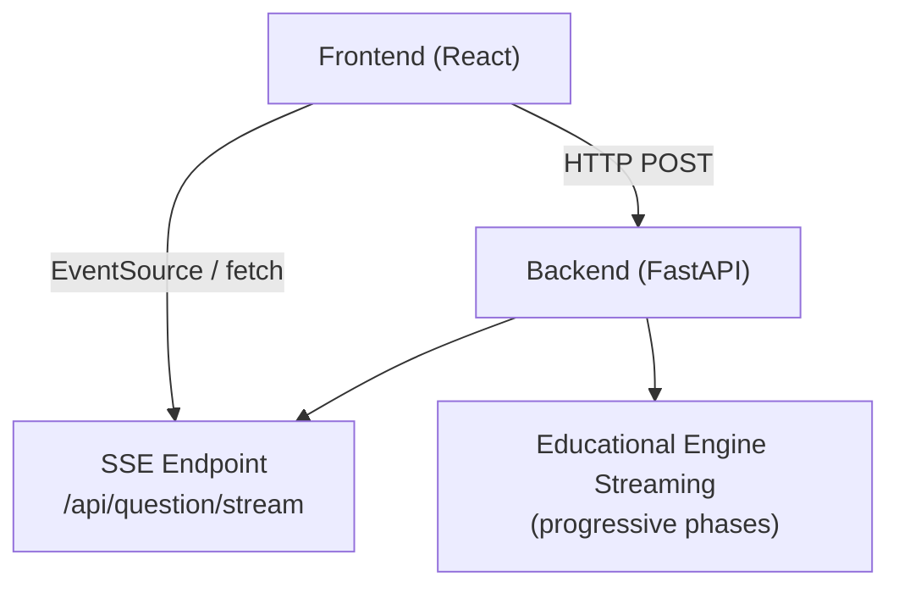
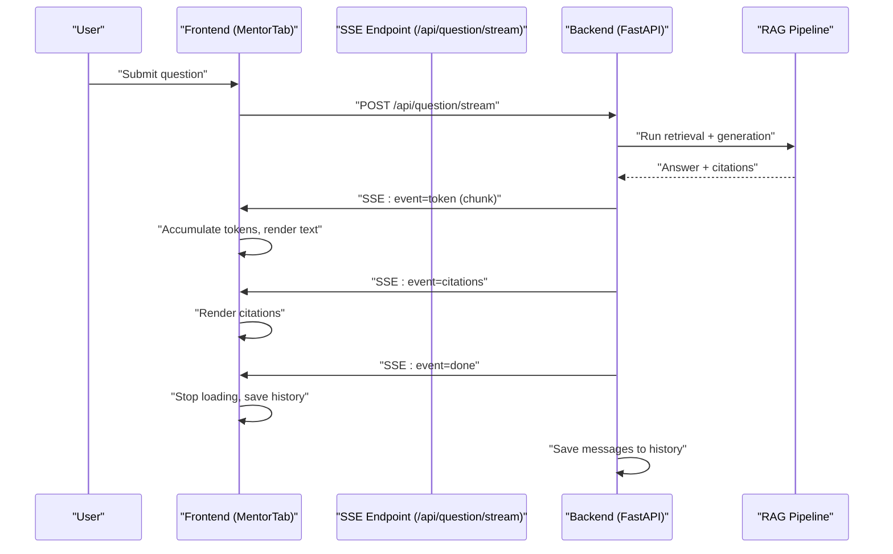
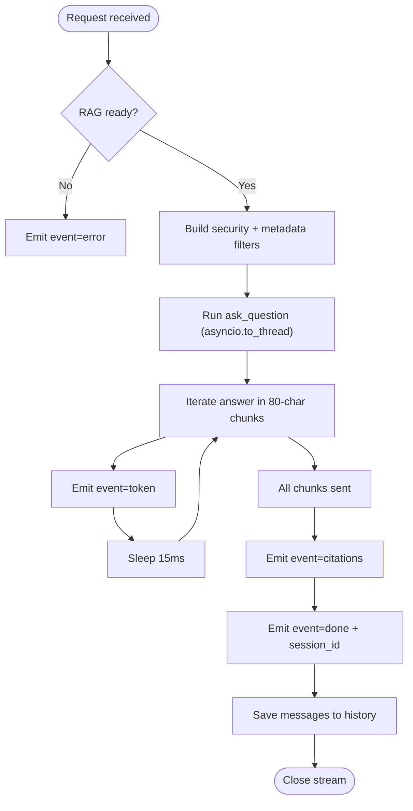
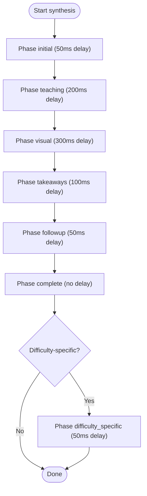
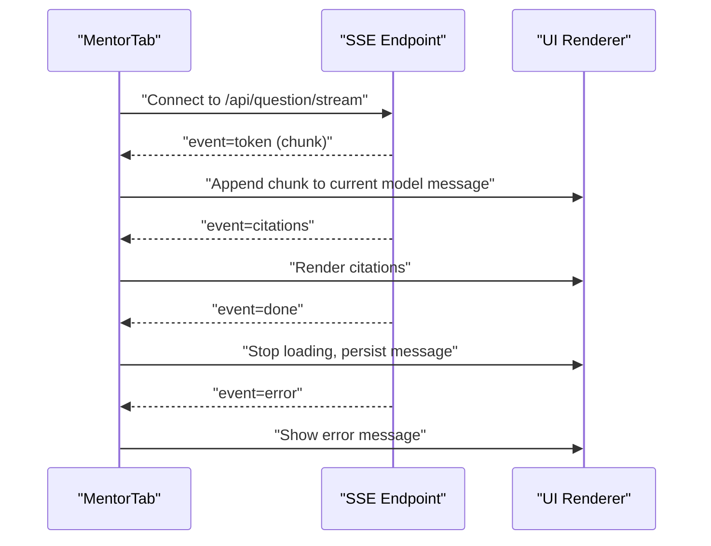

# Real-time & Streaming

<cite>
**Referenced Files in This Document**
- [backend_api.py](file://backend_api.py)
- [streaming_handler.py](file://educational_engine/streaming_handler.py)
- [MentorTab.tsx](file://frontend/src/components/MentorTab.tsx)
- [App.tsx](file://frontend/src/App.tsx)
- [package-lock.json](file://frontend/package-lock.json)
</cite>

## Table of Contents
1. [Introduction](#introduction)
2. [Project Structure](#project-structure)
3. [Core Components](#core-components)
4. [Architecture Overview](#architecture-overview)
5. [Detailed Component Analysis](#detailed-component-analysis)
6. [Dependency Analysis](#dependency-analysis)
7. [Performance Considerations](#performance-considerations)
8. [Troubleshooting Guide](#troubleshooting-guide)
9. [Conclusion](#conclusion)

## Introduction
This document explains MinerAI’s real-time and streaming capabilities with a focus on:
- Server-Sent Events (SSE) for progressive text streaming via /api/question/stream
- Event types: token, citations, done, error
- Message formats and semantics
- Connection management and client-side rendering patterns
- Practical examples for progressive text rendering, citation display, and error handling

It also covers the educational engine’s progressive streaming for structured pedagogical responses, which complements the RAG streaming described above.

## Project Structure
MinerAI’s streaming spans backend endpoints and frontend components:
- Backend exposes SSE endpoints and educational synthesis streaming
- Frontend renders streamed tokens progressively and displays citations and loading states

**Diagram sources**
- [backend_api.py:585-662](file://backend_api.py#L585-L662)
- [streaming_handler.py:36-123](file://educational_engine/streaming_handler.py#L36-L123)
- [MentorTab.tsx:49-128](file://frontend/src/components/MentorTab.tsx#L49-L128)

**Section sources**
- [backend_api.py:585-662](file://backend_api.py#L585-L662)
- [streaming_handler.py:1-193](file://educational_engine/streaming_handler.py#L1-L193)
- [MentorTab.tsx:1-411](file://frontend/src/components/MentorTab.tsx#L1-L411)

## Core Components
- SSE streaming endpoint: /api/question/stream emits events token, citations, done, error
- Progressive streaming handler: educational_engine/streaming_handler.py streams pedagogical phases
- Frontend streaming consumer: MentorTab.tsx handles SSE and renders progressive UI

Key responsibilities:
- Backend: orchestrates RAG, chunks answer, emits SSE events, manages context/session
- Frontend: connects to SSE, accumulates tokens, renders citations, updates UI state

**Section sources**
- [backend_api.py:585-662](file://backend_api.py#L585-L662)
- [streaming_handler.py:23-123](file://educational_engine/streaming_handler.py#L23-L123)
- [MentorTab.tsx:49-128](file://frontend/src/components/MentorTab.tsx#L49-L128)

## Architecture Overview
End-to-end flow for streaming QA via SSE:

**Diagram sources**
- [backend_api.py:585-662](file://backend_api.py#L585-L662)
- [MentorTab.tsx:49-128](file://frontend/src/components/MentorTab.tsx#L49-L128)

## Detailed Component Analysis

### SSE Streaming Endpoint (/api/question/stream)
- Media type: text/event-stream
- Events emitted:
  - token: carries a text chunk
  - citations: carries the final citations list
  - done: signals completion and includes session_id
  - error: emitted on exceptions
- Behavior:
  - Streams answer in ~80-character chunks with ~15ms pauses between chunks
  - Emits citations after streaming completes
  - On API rate limit, streams a friendly message as tokens then emits done
  - Respects security filters derived from user permissions

**Diagram sources**
- [backend_api.py:585-662](file://backend_api.py#L585-L662)

**Section sources**
- [backend_api.py:585-662](file://backend_api.py#L585-L662)

### Progressive Educational Streaming (NDJSON)
The educational engine streams pedagogical content in phases:
- initial: essential answer
- teaching: analogies/examples
- visual: visual explanation
- takeaways: key concepts/takeaways
- followup: suggestions
- complete: citations/sources
- difficulty_specific: difficulty-adapted content (optional)

Delays are tuned to minimize perceived latency while enriching content progressively.

**Diagram sources**
- [streaming_handler.py:23-167](file://educational_engine/streaming_handler.py#L23-L167)

**Section sources**
- [streaming_handler.py:23-167](file://educational_engine/streaming_handler.py#L23-L167)

### Frontend Streaming Consumer (MentorTab)
- Sends POST to /api/chat for non-streaming chat
- For streaming, the MentorTab pattern demonstrates:
  - Maintaining a loading state during streaming
  - Accumulating tokens into a live message
  - Rendering citations when received
  - Handling error messages gracefully
  - Managing chat threads and message history

**Diagram sources**
- [MentorTab.tsx:49-128](file://frontend/src/components/MentorTab.tsx#L49-L128)

**Section sources**
- [MentorTab.tsx:49-128](file://frontend/src/components/MentorTab.tsx#L49-L128)

### Client-Side Implementation Patterns
- Progressive text rendering:
  - Accumulate incoming token events into a buffer
  - Debounce or throttle DOM updates for smoothness
  - Render markdown-like structures (headings, lists, blockquotes) as they arrive
- Citation display:
  - Store citations separately and render them below the message body
  - Use indices to map numbered citations to sources
- Error handling:
  - Catch network or SSE errors
  - Show user-friendly messages and offer retry
- Connection management:
  - Use EventSource for SSE or fetch with ReadableStream for modern browsers
  - Respect keep-alive and reconnection strategies
  - Close streams on unmount or navigation

[No sources needed since this section provides general guidance]

## Dependency Analysis
External libraries relevant to streaming:
- ws (WebSocket library)
- web-streams-polyfill (ReadableStream polyfill)
- node-fetch (for fetch-based SSE consumption)

These support robust streaming behavior across environments.

**Section sources**
- [package-lock.json:4256-4275](file://frontend/package-lock.json#L4256-L4275)
- [package-lock.json:4247-4254](file://frontend/package-lock.json#L4247-L4254)
- [package-lock.json:3074-3090](file://frontend/package-lock.json#L3074-L3090)

## Performance Considerations
- SSE chunk size and pacing:
  - 80-character chunks with 15ms intervals balance responsiveness and throughput
- Non-blocking execution:
  - Long-running RAG tasks run in thread pools to avoid blocking the event loop
- Progressive enrichment:
  - Educational streaming phases reduce perceived latency by delivering essential content first
- Browser compatibility:
  - Use EventSource for SSE or fetch with ReadableStream; polyfills assist older environments

[No sources needed since this section provides general guidance]

## Troubleshooting Guide
Common issues and resolutions:
- Rate limit errors:
  - The backend emits a friendly message as token chunks, then done
  - Client should surface a user-friendly message and suggest retry
- Network interruptions:
  - Reconnect SSE and resume from last received token if applicable
- Empty or missing citations:
  - Ensure the backend emits the citations event after streaming completes
  - Frontend should guard against undefined citation arrays
- Streaming not rendering:
  - Verify SSE headers and media type
  - Confirm client-side event parsing and DOM update logic

**Section sources**
- [backend_api.py:642-653](file://backend_api.py#L642-L653)
- [MentorTab.tsx:115-127](file://frontend/src/components/MentorTab.tsx#L115-L127)

## Conclusion
MinerAI’s streaming architecture combines efficient SSE delivery with progressive UI updates to provide a responsive, informative chat experience. The backend streams answer chunks and citations, while the frontend renders them progressively and handles errors gracefully. The educational engine further enhances the experience by delivering pedagogical content in well-timed phases.