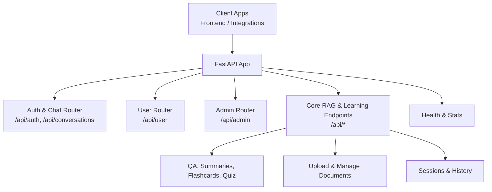
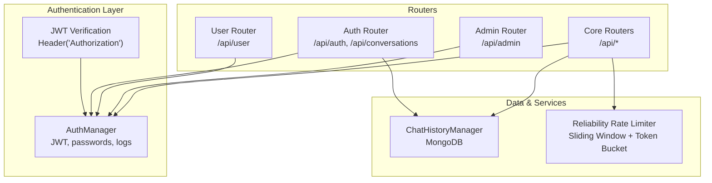
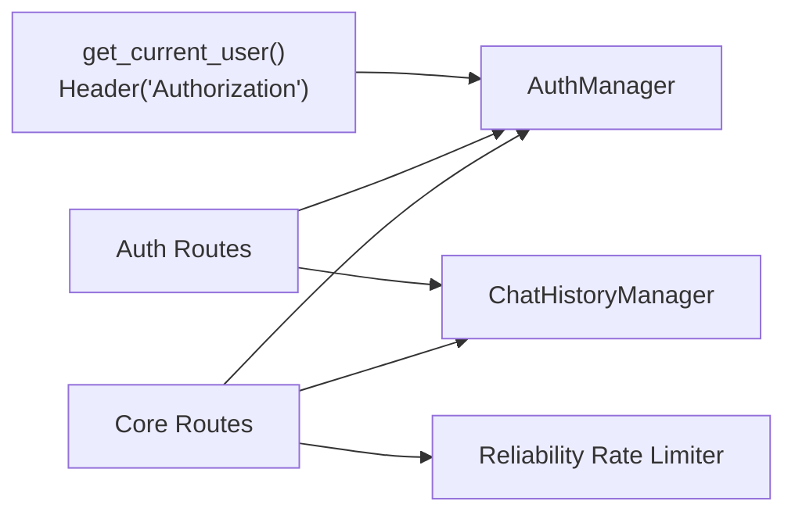

# API Endpoints

<cite>
**Referenced Files in This Document**
- [backend_api.py](file://backend_api.py)
- [backend/main.py](file://backend/main.py)
- [auth/api_routes.py](file://auth/api_routes.py)
- [auth/user_routes.py](file://auth/user_routes.py)
- [auth/admin_routes.py](file://auth/admin_routes.py)
- [auth/auth_manager.py](file://auth/auth_manager.py)
- [auth/chat_history_manager.py](file://auth/chat_history_manager.py)
- [reliability/rate_limiter.py](file://reliability/rate_limiter.py)
- [security/rate_limiter.py](file://security/rate_limiter.py)
</cite>

## Table of Contents
1. [Introduction](#introduction)
2. [Project Structure](#project-structure)
3. [Core Components](#core-components)
4. [Architecture Overview](#architecture-overview)
5. [Detailed Component Analysis](#detailed-component-analysis)
6. [Dependency Analysis](#dependency-analysis)
7. [Performance Considerations](#performance-considerations)
8. [Troubleshooting Guide](#troubleshooting-guide)
9. [Conclusion](#conclusion)
10. [Appendices](#appendices)

## Introduction
This document provides comprehensive API documentation for the backend REST endpoints. It covers HTTP methods, URL patterns, request/response schemas, authentication requirements, validation rules, error handling, rate limiting policies, and practical usage examples. Endpoints are categorized by functionality: authentication, chat/conversations, quiz, document processing, and system administration. Security considerations and performance characteristics are included, along with guidance for integrating with the frontend and understanding streaming responses.

## Project Structure
The backend exposes a unified FastAPI application that aggregates:
- Authentication and chat history endpoints under a base path
- User and admin endpoints under dedicated prefixes
- Core RAG and learning endpoints for question answering, summarization, flashcards, quizzes, and document operations
- System health and statistics endpoints

**Diagram sources**
- [backend_api.py:116-119](file://backend_api.py#L116-L119)
- [backend/main.py:19-41](file://backend/main.py#L19-L41)

**Section sources**
- [backend_api.py:116-119](file://backend_api.py#L116-L119)
- [backend/main.py:19-41](file://backend/main.py#L19-L41)

## Core Components
- Authentication and user management: JWT-based, with registration, login, profile, and password change
- Chat and conversation history: CRUD operations for conversations and messages with ownership checks
- Quiz system: interactive quiz generation, submission, and scoring
- Document processing: upload, list, and delete documents; vector store updates
- System endpoints: health, statistics, and session management
- Rate limiting: built-in sliding window and token bucket strategies for external API quotas

**Section sources**
- [auth/api_routes.py:58-75](file://auth/api_routes.py#L58-L75)
- [auth/auth_manager.py:101-125](file://auth/auth_manager.py#L101-L125)
- [auth/chat_history_manager.py:38-111](file://auth/chat_history_manager.py#L38-L111)
- [backend_api.py:447-582](file://backend_api.py#L447-L582)
- [backend_api.py:748-892](file://backend_api.py#L748-L892)
- [backend_api.py:1112-1298](file://backend_api.py#L1112-L1298)
- [reliability/rate_limiter.py:183-275](file://reliability/rate_limiter.py#L183-L275)

## Architecture Overview
The API is organized around routers and shared managers:
- JWT verification middleware enforces authentication on protected endpoints
- AuthManager handles user credentials, tokens, and interaction logging
- ChatHistoryManager persists conversations and messages
- Reliability rate limiter controls external API quotas and applies circuit breaking

**Diagram sources**
- [auth/api_routes.py:58-75](file://auth/api_routes.py#L58-L75)
- [auth/auth_manager.py:58-125](file://auth/auth_manager.py#L58-L125)
- [auth/chat_history_manager.py:21-37](file://auth/chat_history_manager.py#L21-L37)
- [backend_api.py:116-119](file://backend_api.py#L116-L119)
- [reliability/rate_limiter.py:183-275](file://reliability/rate_limiter.py#L183-L275)

## Detailed Component Analysis

### Authentication Endpoints
- Base Path: /api
- Authentication: Requires Authorization header with Bearer token for protected routes

Endpoints:
- POST /api/auth/register
  - Purpose: Register a new user
  - Auth: None
  - Request: email, username, password, full_name
  - Response: success flag and user info
  - Validation: Password length >= 6; unique email/username
  - Errors: 400 on validation or duplicate; 500 on storage errors

- POST /api/auth/login
  - Purpose: Authenticate user and issue JWT
  - Auth: None
  - Request: email, password
  - Response: token and user profile
  - Errors: 401 on invalid credentials; 500 on storage errors

- GET /api/auth/me
  - Purpose: Fetch current user profile
  - Auth: Required
  - Response: user object (without sensitive fields)
  - Errors: 404 if user not found; 401 on invalid/expired token

- POST /api/auth/change-password
  - Purpose: Change password
  - Auth: Required
  - Request: old_password, new_password
  - Validation: new password length >= 6
  - Errors: 400 on validation or mismatch; 500 on storage errors

- GET /api/user/weak-topics
  - Purpose: Weak topics based on interaction logs
  - Auth: Required
  - Response: array of topic names
  - Errors: 200 with empty array if no data

- GET /api/user/completed-topics
  - Purpose: Topics user has practiced/quizzed
  - Auth: Required
  - Response: array of topic names
  - Errors: 200 with empty array if no data

- GET /api/user/stats
  - Purpose: User conversation statistics
  - Auth: Required
  - Response: counts and averages
  - Errors: 501 if conversation history not available

**Section sources**
- [auth/api_routes.py:81-137](file://auth/api_routes.py#L81-L137)
- [auth/api_routes.py:111-120](file://auth/api_routes.py#L111-L120)
- [auth/api_routes.py:122-137](file://auth/api_routes.py#L122-L137)
- [auth/api_routes.py:144-160](file://auth/api_routes.py#L144-L160)
- [backend_api.py:343-351](file://backend_api.py#L343-L351)
- [auth/auth_manager.py:101-125](file://auth/auth_manager.py#L101-L125)
- [auth/auth_manager.py:298-347](file://auth/auth_manager.py#L298-L347)

### Chat and Conversations
- Base Path: /api
- Authentication: Required for all endpoints

Endpoints:
- POST /api/conversations
  - Purpose: Create a new conversation
  - Request: title (optional)
  - Response: conversation_id and success flag
  - Errors: 500 on storage errors

- GET /api/conversations
  - Purpose: List user conversations
  - Query: limit, skip
  - Response: array of conversations and count
  - Errors: 200 even if empty

- GET /api/conversations/{conversation_id}
  - Purpose: Retrieve a single conversation
  - Response: conversation details
  - Ownership: 403 if not owned by user

- GET /api/conversations/{conversation_id}/messages
  - Purpose: Retrieve messages in a conversation
  - Query: limit
  - Response: array of messages and count
  - Ownership: 403 if not owned by user

- POST /api/conversations/{conversation_id}/messages
  - Purpose: Add a message to a conversation
  - Request: role ("user" or "assistant"), content, metadata
  - Response: message_id and success flag
  - Ownership: 403 if not owned by user

- PUT /api/conversations/{conversation_id}/title
  - Purpose: Update conversation title
  - Request: title
  - Response: success message
  - Errors: 400 on update failure; 403 if not owned

- DELETE /api/conversations/{conversation_id}
  - Purpose: Delete a conversation
  - Response: success message
  - Errors: 400 on delete failure; 403 if not owned

- GET /api/conversations/search
  - Purpose: Search conversations by title
  - Query: q (search term), limit
  - Response: array of matching conversations

**Section sources**
- [auth/api_routes.py:167-321](file://auth/api_routes.py#L167-L321)
- [auth/chat_history_manager.py:38-248](file://auth/chat_history_manager.py#L38-L248)

### Quiz Endpoints
- Base Path: /api
- Authentication: Required for user actions; quiz generation may be public depending on topic selection

Endpoints:
- GET /api/quiz/topics
  - Purpose: List available quiz topics
  - Response: array of topic objects with counts
  - Errors: 200 with defaults if MongoDB unavailable

- POST /api/quiz
  - Purpose: Generate an interactive quiz
  - Request: topic (optional), num_questions (3–10), session_id (optional)
  - Response: quiz_id, questions, sources, total_questions
  - Errors: 500 on generation errors

- POST /api/quiz/custom-practice
  - Purpose: Generate quiz from personal question bank
  - Request: topic (optional), num_questions
  - Response: quiz_id, questions, total_questions
  - Errors: 404 if no personal questions; 500 on storage errors

- POST /api/quiz/answer
  - Purpose: Submit an answer and receive evaluation
  - Request: quiz_id, question_index, user_answer
  - Response: correctness, score, feedback, correct answer, optional explanation/source
  - Errors: 404 if quiz not found; 400 on invalid index; 500 on evaluation errors

- GET /api/quiz/{quiz_id}/results
  - Purpose: Retrieve quiz results and persist scores
  - Response: results, score summary, counts
  - Errors: 404 if quiz not found; 400 if no answers; 500 on persistence errors

**Section sources**
- [backend_api.py:727-746](file://backend_api.py#L727-L746)
- [backend_api.py:748-797](file://backend_api.py#L748-L797)
- [backend_api.py:800-855](file://backend_api.py#L800-L855)
- [backend_api.py:857-892](file://backend_api.py#L857-L892)
- [backend_api.py:894-961](file://backend_api.py#L894-L961)

### Document Processing Endpoints
- Base Path: /api
- Authentication: Required for all endpoints

Endpoints:
- POST /api/upload
  - Purpose: Upload and process documents (PDF, PPTX, DOCX, TXT)
  - Request: multipart/form-data with file
  - Response: success flag, chunks added, file path
  - Validation: Only allowed extensions; user-scoped filenames
  - Errors: 400 on unsupported type; 500 on processing errors; 503 if pipeline not ready

- GET /api/documents
  - Purpose: List uploaded documents visible to the user
  - Response: array of document descriptors (type, title, size, category)
  - Errors: 200 with empty array if none

- DELETE /api/documents/{filename}
  - Purpose: Delete a document and remove chunks from vector store
  - Response: success message
  - Errors: 403 if not permitted; 500 on deletion errors

**Section sources**
- [backend_api.py:1112-1222](file://backend_api.py#L1112-L1222)
- [backend_api.py:1224-1298](file://backend_api.py#L1224-L1298)
- [backend_api.py:1300-1363](file://backend_api.py#L1300-L1363)

### Core RAG and Learning Endpoints
- Base Path: /api
- Authentication: Required for most endpoints; some may be public depending on configuration

Endpoints:
- GET /
  - Purpose: Root health and endpoint catalog
  - Response: status, version, feature flags, grouped endpoint URLs

- GET /health
  - Purpose: System readiness and resource status
  - Response: health status, pipeline readiness, session counts, loading progress

- POST /api/question
  - Purpose: Non-streaming question answering via RAG
  - Request: question, session_id (optional), use_context (boolean), max_context_turns, metadata_filter (optional)
  - Response: answer, sources, citations, session_id, response_time
  - Errors: 503 if pipeline loading; special handling for rate-limited external API

- POST /api/chat
  - Purpose: Bridge endpoint for frontend chat
  - Request: thread_id, messages (last item text used), metadata_filter (optional)
  - Response: text, citations
  - Errors: 400 on missing messages; 503 if pipeline loading; special handling for rate-limited external API

- POST /api/question/stream
  - Purpose: Streaming response using Server-Sent Events
  - Request: same as POST /api/question
  - Response: SSE stream with events: token, citations, done, error
  - Headers: Cache-Control, X-Accel-Buffering disabled
  - Errors: 503 if pipeline loading; special handling for rate-limited external API

- POST /api/summary
  - Purpose: Structured summary generation
  - Request: topic (optional), session_id (optional), metadata_filter (optional)
  - Response: summary, sources, citations, response_time

- POST /api/flashcards
  - Purpose: Generate flashcards
  - Request: topic, count (default 5), metadata_filter (optional)
  - Response: array of flashcards

- POST /api/compare
  - Purpose: Compare LLM vs RAG outputs (advanced feature)
  - Response: llm_result, rag_result, comparison, response_time
  - Errors: 501 if feature not available

- POST /api/multi-document
  - Purpose: Multi-document question answering (advanced feature)
  - Request: question, use_synthesis (boolean), session_id (optional)
  - Response: answer, sources, citations, num_sources, response_time
  - Errors: 501 if feature not available

- POST /api/session
  - Purpose: Create a new session
  - Response: session_id, message_count, created_at

- GET /api/session/{session_id}
  - Purpose: Get session info
  - Response: session_id, message_count, created_at
  - Errors: 404 if not found

- DELETE /api/session/{session_id}
  - Purpose: Delete a session and clear history
  - Response: success message

- GET /api/history/{session_id}
  - Purpose: Get recent conversation history
  - Query: limit
  - Response: messages, total_count
  - Errors: 501 if history not available

- DELETE /api/history/{session_id}
  - Purpose: Clear conversation history
  - Response: success message
  - Errors: 501 if history not available

- GET /api/system/statistics
  - Purpose: System-wide statistics and configuration
  - Response: data_stats, model_stats, session_stats, api_key_stats, pipeline_config, system_status

- GET /api/system-stats
  - Purpose: Legacy statistics dashboard
  - Response: session/activity metrics

- POST /api/reset-offline
  - Purpose: Reload API keys and reset offline mode
  - Response: success flag, key availability, message

**Section sources**
- [backend_api.py:369-425](file://backend_api.py#L369-L425)
- [backend_api.py:447-582](file://backend_api.py#L447-L582)
- [backend_api.py:585-662](file://backend_api.py#L585-L662)
- [backend_api.py:664-725](file://backend_api.py#L664-L725)
- [backend_api.py:701-725](file://backend_api.py#L701-L725)
- [backend_api.py:963-1025](file://backend_api.py#L963-L1025)
- [backend_api.py:991-1025](file://backend_api.py#L991-L1025)
- [backend_api.py:1027-1110](file://backend_api.py#L1027-L1110)
- [backend_api.py:1112-1298](file://backend_api.py#L1112-L1298)
- [backend_api.py:1365-1435](file://backend_api.py#L1365-L1435)
- [backend_api.py:1438-1502](file://backend_api.py#L1438-L1502)
- [backend_api.py:1504-1537](file://backend_api.py#L1504-L1537)

### Admin Endpoints
- Base Path: /api/admin
- Authentication: Admin required

Endpoints:
- GET /api/admin/questions
  - Purpose: List all system questions
  - Response: array of questions and count
  - Errors: 500 if MongoDB unavailable

- POST /api/admin/questions
  - Purpose: Add a static question
  - Request: question object
  - Response: success message and id
  - Errors: 500 if MongoDB unavailable

- POST /api/admin/generate-questions
  - Purpose: Generate questions via AI and insert into DB
  - Request: topic, folder_topic, num_questions
  - Response: success message and count
  - Errors: 500 if generation fails

- PUT /api/admin/questions/{question_id}
  - Purpose: Update a question
  - Request: question object
  - Response: success message
  - Errors: 404 if not found; 500 on update errors

- DELETE /api/admin/questions/{question_id}
  - Purpose: Delete a question
  - Response: success message
  - Errors: 404 if not found; 500 on delete errors

**Section sources**
- [auth/admin_routes.py:14-147](file://auth/admin_routes.py#L14-L147)

### User Endpoints
- Base Path: /api/user
- Authentication: Required

Endpoints:
- GET /api/user/my-questions
  - Purpose: List user’s personal questions
  - Response: array of questions and count
  - Errors: 500 if MongoDB unavailable

- POST /api/user/my-questions
  - Purpose: Add a personal question
  - Request: question object
  - Response: success message and id
  - Errors: 500 if MongoDB unavailable

- DELETE /api/user/my-questions/{q_id}
  - Purpose: Delete a personal question
  - Response: success message
  - Errors: 404 if not found; 500 on delete errors

**Section sources**
- [auth/user_routes.py:9-60](file://auth/user_routes.py#L9-L60)

## Dependency Analysis
Key dependencies and relationships:
- JWT verification depends on AuthManager for token decoding and user lookup
- Chat endpoints depend on ChatHistoryManager for persistence and ownership checks
- RAG endpoints depend on global pipeline state and rely on reliability rate limiter for external API quotas
- Document endpoints depend on filesystem and vector store updates

**Diagram sources**
- [auth/api_routes.py:58-75](file://auth/api_routes.py#L58-L75)
- [auth/auth_manager.py:58-125](file://auth/auth_manager.py#L58-L125)
- [auth/chat_history_manager.py:21-37](file://auth/chat_history_manager.py#L21-L37)
- [backend_api.py:116-119](file://backend_api.py#L116-L119)
- [reliability/rate_limiter.py:183-275](file://reliability/rate_limiter.py#L183-L275)

**Section sources**
- [auth/api_routes.py:58-75](file://auth/api_routes.py#L58-L75)
- [auth/auth_manager.py:58-125](file://auth/auth_manager.py#L58-L125)
- [auth/chat_history_manager.py:21-37](file://auth/chat_history_manager.py#L21-L37)
- [backend_api.py:116-119](file://backend_api.py#L116-L119)
- [reliability/rate_limiter.py:183-275](file://reliability/rate_limiter.py#L183-L275)

## Performance Considerations
- Streaming responses: SSE tokens are emitted in ~80-character chunks with small delays to improve perceived performance
- Background loading: RAG pipeline initializes asynchronously; endpoints return 503 during loading
- Thread pool usage: Long-running operations (RAG, summarization, flashcards) run in threads to avoid blocking the event loop
- Rate limiting: Built-in sliding window and token bucket strategies protect external API quotas; circuit breaker prevents cascading failures
- Caching: Internal session storage and metrics tracking reduce repeated computation

[No sources needed since this section provides general guidance]

## Troubleshooting Guide
Common issues and resolutions:
- Authentication failures
  - Symptom: 401 Unauthorized on protected endpoints
  - Cause: Missing or invalid Authorization header
  - Resolution: Ensure Bearer token is present and valid

- Access denied to resources
  - Symptom: 403 Forbidden on conversations
  - Cause: Attempting to access another user’s conversation
  - Resolution: Verify ownership before accessing

- Pipeline not ready
  - Symptom: 503 Service Unavailable on RAG endpoints
  - Cause: Background initialization still in progress
  - Resolution: Retry after system indicates readiness

- Rate limit exceeded
  - Symptom: Special handling for external API quota limits
  - Cause: Free tier limits reached (e.g., Gemini)
  - Resolution: Wait for cooldown or reduce request frequency

- MongoDB unavailability
  - Symptom: 500 errors on user/admin endpoints
  - Cause: Missing or unreachable MongoDB URI
  - Resolution: Set MONGODB_URI or use local JSON fallback

**Section sources**
- [auth/api_routes.py:60-74](file://auth/api_routes.py#L60-L74)
- [auth/api_routes.py:213-218](file://auth/api_routes.py#L213-L218)
- [backend_api.py:450-460](file://backend_api.py#L450-L460)
- [backend_api.py:506-513](file://backend_api.py#L506-L513)
- [auth/auth_manager.py:62-87](file://auth/auth_manager.py#L62-L87)

## Conclusion
The backend provides a robust set of REST endpoints covering authentication, chat, quiz, document processing, and system administration. Strong authentication, ownership checks, and rate limiting policies ensure secure and reliable operation. Streaming responses and asynchronous initialization improve user experience and system resilience.

[No sources needed since this section summarizes without analyzing specific files]

## Appendices

### Authentication Requirements
- All protected endpoints require Authorization: Bearer <JWT>
- JWT secret and expiration are configurable; defaults are provided for development

**Section sources**
- [auth/api_routes.py:58-75](file://auth/api_routes.py#L58-L75)
- [auth/auth_manager.py:101-125](file://auth/auth_manager.py#L101-L125)

### Request/Response Schemas
- Pydantic models define request/response shapes for all endpoints
- Examples include QuestionRequest, ChatRequest, QuizRequest, SessionResponse, and many others

**Section sources**
- [backend_api.py:146-251](file://backend_api.py#L146-L251)

### Error Codes and Handling
- Standard HTTP codes: 200, 400, 401, 403, 404, 500, 501, 503
- Protected endpoints return 401 for missing/invalid tokens
- Ownership checks return 403 for unauthorized access
- Feature availability returns 501 when capabilities are disabled

**Section sources**
- [auth/api_routes.py:91-94](file://auth/api_routes.py#L91-L94)
- [auth/api_routes.py:105-108](file://auth/api_routes.py#L105-L108)
- [auth/api_routes.py:116-119](file://auth/api_routes.py#L116-L119)
- [backend_api.py:968-969](file://backend_api.py#L968-L969)
- [backend_api.py:996-997](file://backend_api.py#L996-L997)

### Rate Limiting Policies
- Built-in sliding window and token bucket strategies
- External API quotas (e.g., Gemini) enforced with circuit breaker
- Configurable limits per service; status exposed via system statistics

**Section sources**
- [reliability/rate_limiter.py:183-275](file://reliability/rate_limiter.py#L183-L275)
- [security/rate_limiter.py:21-150](file://security/rate_limiter.py#L21-L150)

### Practical Usage Examples
- Register a user
  - curl -X POST http://localhost:8000/api/auth/register -H "Content-Type: application/json" -d '{"email":"user@example.com","username":"user","password":"pass123","full_name":"User Name"}'

- Login and obtain token
  - curl -X POST http://localhost:8000/api/auth/login -H "Content-Type: application/json" -d '{"email":"user@example.com","password":"pass123"}'

- Ask a question (non-streaming)
  - curl -X POST http://localhost:8000/api/question -H "Authorization: Bearer YOUR_JWT" -H "Content-Type: application/json" -d '{"question":"What is RAG?"}'

- Stream a response
  - curl -N -X POST http://localhost:8000/api/question/stream -H "Authorization: Bearer YOUR_JWT" -H "Content-Type: application/json" -d '{"question":"Explain transformers"}'

- Upload a document
  - curl -X POST http://localhost:8000/api/upload -H "Authorization: Bearer YOUR_JWT" -F "file=@document.pdf"

- Create a quiz
  - curl -X POST http://localhost:8000/api/quiz -H "Authorization: Bearer YOUR_JWT" -H "Content-Type: application/json" -d '{"topic":"apriori","num_questions":5}'

- Submit an answer
  - curl -X POST http://localhost:8000/api/quiz/answer -H "Authorization: Bearer YOUR_JWT" -H "Content-Type: application/json" -d '{"quiz_id":"YOUR_QUIZ_ID","question_index":0,"user_answer":"Option A"}'

- Get quiz results
  - curl -X GET http://localhost:8000/api/quiz/YOUR_QUIZ_ID/results -H "Authorization: Bearer YOUR_JWT"

- Admin operations (requires admin role)
  - curl -X POST http://localhost:8000/api/admin/questions -H "Authorization: Bearer ADMIN_JWT" -H "Content-Type: application/json" -d '{"question":"Sample Q","topic":"apriori"}'

**Section sources**
- [auth/api_routes.py:81-108](file://auth/api_routes.py#L81-L108)
- [backend_api.py:447-582](file://backend_api.py#L447-L582)
- [backend_api.py:585-662](file://backend_api.py#L585-L662)
- [backend_api.py:1112-1222](file://backend_api.py#L1112-L1222)
- [backend_api.py:748-892](file://backend_api.py#L748-L892)
- [auth/admin_routes.py:31-51](file://auth/admin_routes.py#L31-L51)

### WebSocket Endpoints
- No native WebSocket endpoints are implemented in the backend
- Streaming responses are provided via Server-Sent Events on POST /api/question/stream
- Frontend can consume SSE using EventSource or fetch with ReadableStream

**Section sources**
- [backend_api.py:585-662](file://backend_api.py#L585-L662)