# Authentication System

<cite>
**Referenced Files in This Document**
- [auth_manager.py](file://auth/auth_manager.py)
- [api_routes.py](file://auth/api_routes.py)
- [chat_history_manager.py](file://auth/chat_history_manager.py)
- [user_routes.py](file://auth/user_routes.py)
- [admin_routes.py](file://auth/admin_routes.py)
- [auth.py](file://security/auth.py)
- [middleware.py](file://security/middleware.py)
- [main.py](file://backend/main.py)
- [config.py](file://config.py)
- [test_auth.py](file://tests/unit/test_auth.py)
</cite>

## Table of Contents
1. [Introduction](#introduction)
2. [Project Structure](#project-structure)
3. [Core Components](#core-components)
4. [Architecture Overview](#architecture-overview)
5. [Detailed Component Analysis](#detailed-component-analysis)
6. [Dependency Analysis](#dependency-analysis)
7. [Performance Considerations](#performance-considerations)
8. [Troubleshooting Guide](#troubleshooting-guide)
9. [Conclusion](#conclusion)
10. [Appendices](#appendices)

## Introduction
This document explains the authentication and authorization system implemented in the codebase. It covers JWT token lifecycle, user registration and login, role-based access control (RBAC), session management, user profile handling, password hashing, and security measures. It also documents the authentication middleware, user data handling, MongoDB integration, chat history management, and administrative functions. Practical examples include authentication decorators, protected endpoints, and common security mitigations.

## Project Structure
The authentication system spans several modules:
- Authentication core: JWT token management, password hashing, user CRUD, and MongoDB integration
- API routes: FastAPI endpoints for authentication, user profile, and chat history
- Chat history management: Conversation and message persistence
- Security middleware: Input validation, sanitization, and protective headers
- Administrative functions: Admin-only endpoints for question bank management
- Backend entry point: FastAPI app initialization and routing

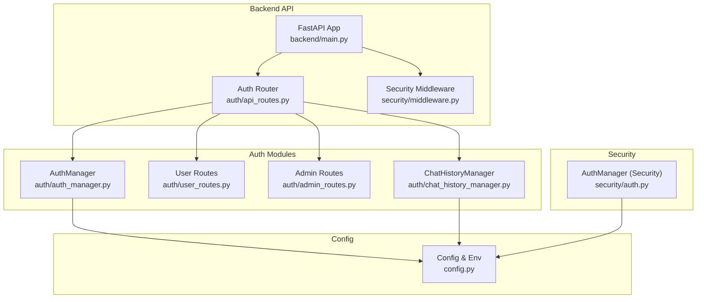

**Diagram sources**
- [main.py:11-51](file://backend/main.py#L11-L51)
- [api_routes.py:15-15](file://auth/api_routes.py#L15-L15)
- [auth_manager.py:58-393](file://auth/auth_manager.py#L58-L393)
- [chat_history_manager.py:21-274](file://auth/chat_history_manager.py#L21-L274)
- [user_routes.py:7-61](file://auth/user_routes.py#L7-L61)
- [admin_routes.py:6-148](file://auth/admin_routes.py#L6-L148)
- [middleware.py:20-320](file://security/middleware.py#L20-L320)
- [config.py:46-46](file://config.py#L46-L46)

**Section sources**
- [main.py:11-51](file://backend/main.py#L11-L51)
- [api_routes.py:15-15](file://auth/api_routes.py#L15-L15)
- [auth_manager.py:58-393](file://auth/auth_manager.py#L58-L393)
- [chat_history_manager.py:21-274](file://auth/chat_history_manager.py#L21-L274)
- [user_routes.py:7-61](file://auth/user_routes.py#L7-L61)
- [admin_routes.py:6-148](file://auth/admin_routes.py#L6-L148)
- [middleware.py:20-320](file://security/middleware.py#L20-L320)
- [config.py:46-46](file://config.py#L46-L46)

## Core Components
- AuthManager (authentication core): Handles JWT creation/verification, password hashing/verification, user registration/login, profile updates, and MongoDB-backed user/log storage
- API routes: Exposes endpoints for registration, login, protected user info, password change, and chat history operations
- ChatHistoryManager: Manages conversations and messages with MongoDB persistence
- Security middleware: Provides input validation/sanitization and protective headers
- Admin routes: RBAC-enforced endpoints for managing static questions
- User routes: Personal question bank endpoints with MongoDB requirement

Key capabilities:
- JWT-based authentication with HS256 signing
- bcrypt password hashing
- Role-based access control (user/admin)
- MongoDB-backed user storage with JSON fallback capability
- Interaction logging and weak topic calculation for learning analytics
- Protected endpoints via dependency injection

**Section sources**
- [auth_manager.py:58-393](file://auth/auth_manager.py#L58-L393)
- [api_routes.py:58-75](file://auth/api_routes.py#L58-L75)
- [chat_history_manager.py:21-274](file://auth/chat_history_manager.py#L21-L274)
- [middleware.py:20-320](file://security/middleware.py#L20-L320)
- [admin_routes.py:8-12](file://auth/admin_routes.py#L8-L12)
- [user_routes.py:12-13](file://auth/user_routes.py#L12-L13)

## Architecture Overview
The system integrates FastAPI with MongoDB for persistent user and chat data. Authentication relies on JWT tokens validated by the AuthManager. Protected endpoints depend on a JWT verification function that extracts the token from the Authorization header and verifies it against the configured secret.

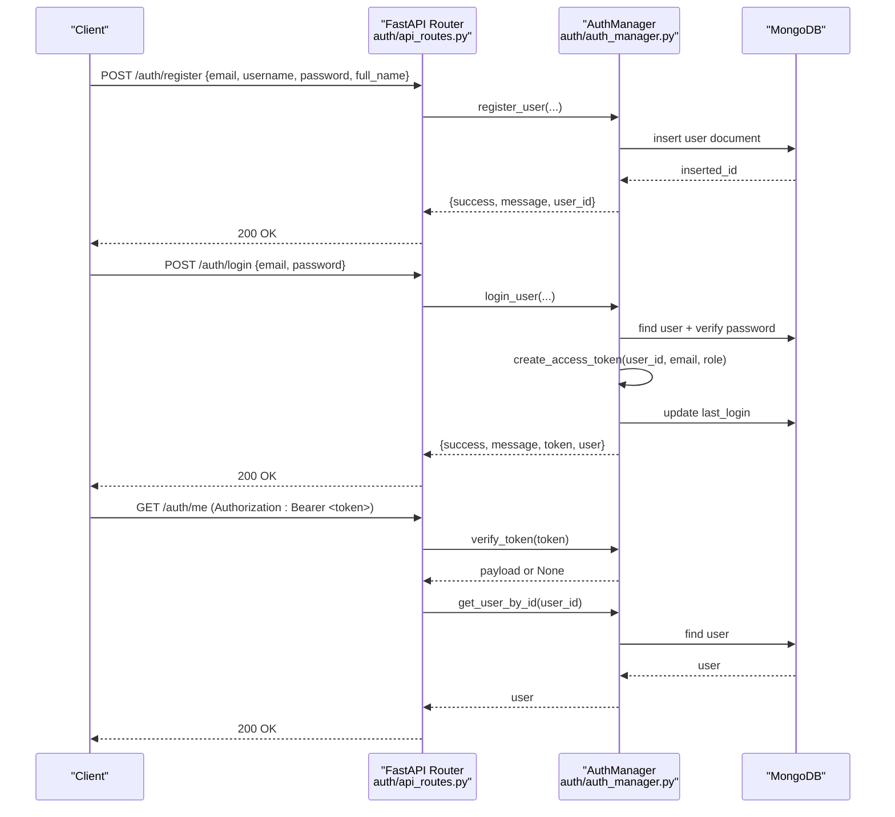

**Diagram sources**
- [api_routes.py:81-120](file://auth/api_routes.py#L81-L120)
- [auth_manager.py:126-218](file://auth/auth_manager.py#L126-L218)

**Section sources**
- [api_routes.py:58-75](file://auth/api_routes.py#L58-L75)
- [auth_manager.py:101-125](file://auth/auth_manager.py#L101-L125)
- [auth_manager.py:174-218](file://auth/auth_manager.py#L174-L218)

## Detailed Component Analysis

### JWT Token Management
- Secret key and algorithm are loaded from environment variables with a safe default and a runtime warning if unset
- Access tokens include user_id, email, role, exp, and iat claims
- Token verification decodes HS256 tokens and handles expiration and invalid token errors
- Token lifetime is configured to 24 hours

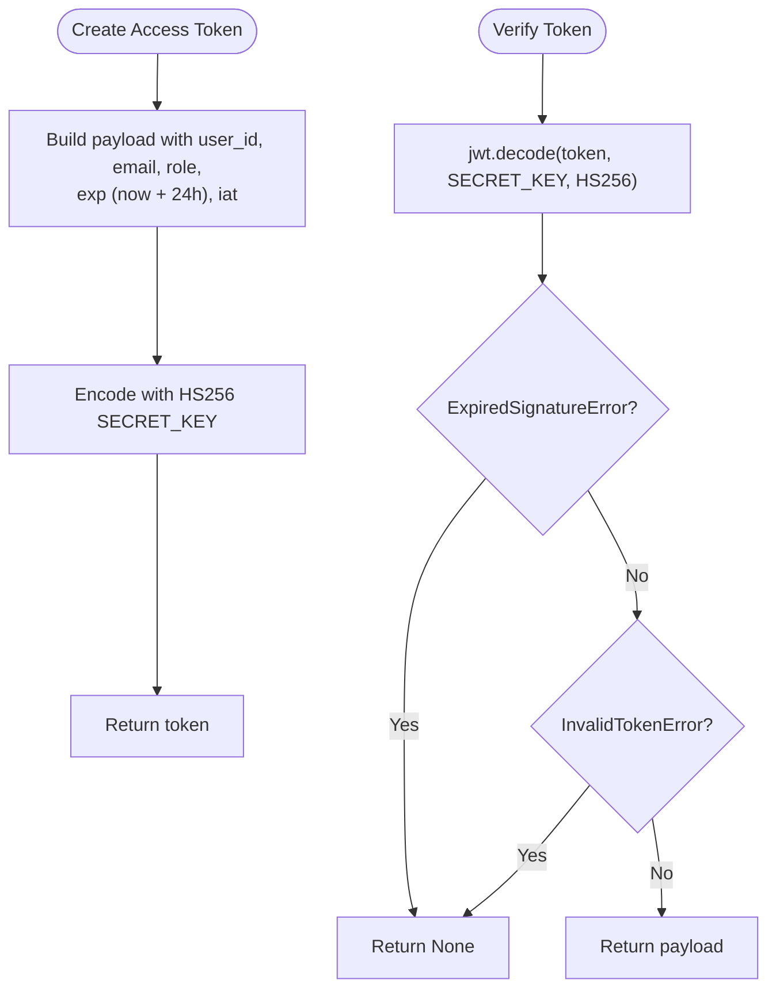

**Diagram sources**
- [auth_manager.py:21-34](file://auth/auth_manager.py#L21-L34)
- [auth_manager.py:101-125](file://auth/auth_manager.py#L101-L125)

**Section sources**
- [auth_manager.py:21-34](file://auth/auth_manager.py#L21-L34)
- [auth_manager.py:101-125](file://auth/auth_manager.py#L101-L125)

### User Registration and Login
- Registration validates password length, hashes the password with bcrypt, and creates a user document with default profile and settings
- Login verifies credentials, updates last_login, and issues a JWT token
- Both operations support MongoDB and a JSON-local fallback

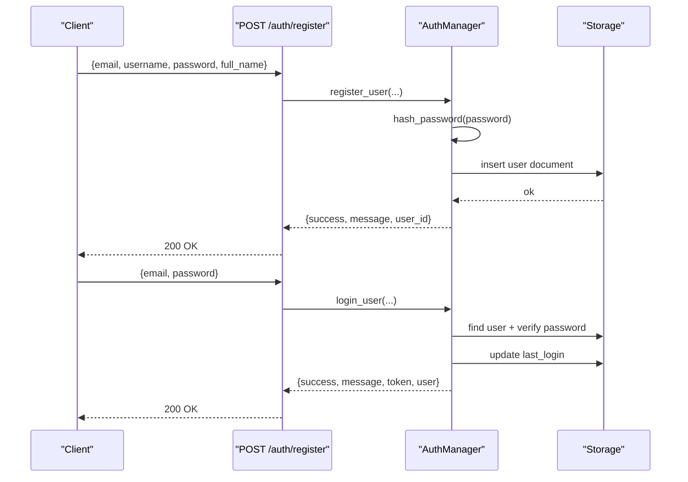

**Diagram sources**
- [api_routes.py:81-109](file://auth/api_routes.py#L81-L109)
- [auth_manager.py:126-218](file://auth/auth_manager.py#L126-L218)

**Section sources**
- [auth_manager.py:126-173](file://auth/auth_manager.py#L126-L173)
- [auth_manager.py:174-218](file://auth/auth_manager.py#L174-L218)

### Role-Based Access Control (RBAC)
- Users have roles: user and admin
- Admin-only endpoints enforce role checks via a dedicated dependency that raises 403 for non-admins
- The dependency extracts the current user payload and compares the role field

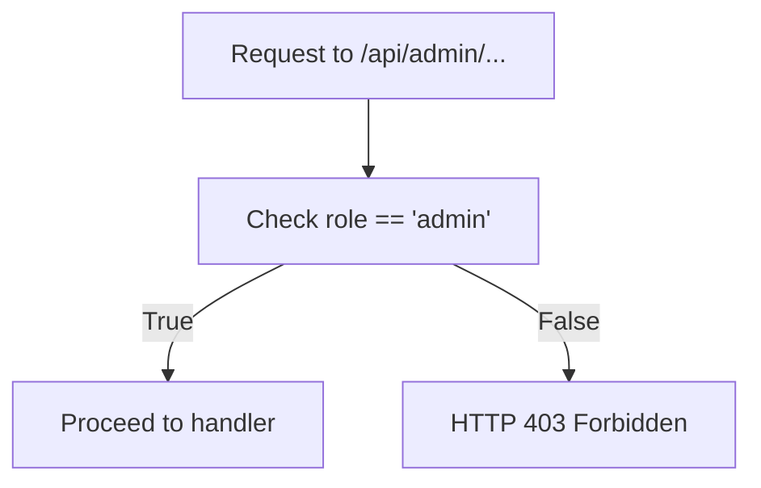

**Diagram sources**
- [admin_routes.py:8-12](file://auth/admin_routes.py#L8-L12)

**Section sources**
- [admin_routes.py:8-12](file://auth/admin_routes.py#L8-L12)

### Session Management
- The system maintains JWT tokens and supports session-like behavior by storing active sessions in MongoDB
- Sessions include token, user_id, timestamps, and activity status
- Token verification checks both signature validity and session existence/activity
- Logout invalidates the session by setting is_active to false

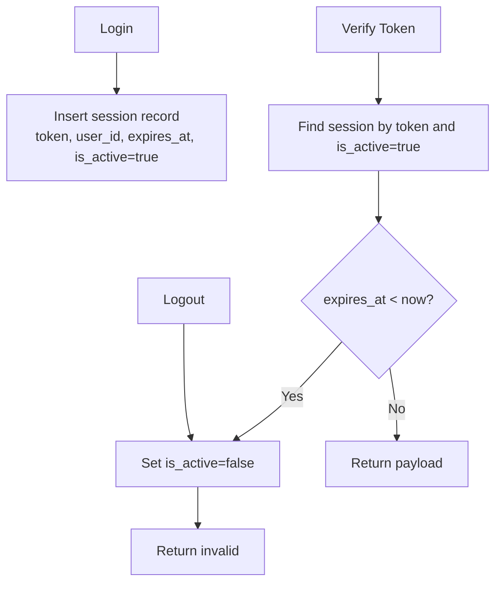

**Diagram sources**
- [auth.py:249-261](file://security/auth.py#L249-L261)
- [auth.py:262-292](file://security/auth.py#L262-L292)
- [auth.py:293-303](file://security/auth.py#L293-L303)

**Section sources**
- [auth.py:249-303](file://security/auth.py#L249-L303)

### Authentication Middleware and Security Measures
- Input validation and sanitization: checks for SQL injection and XSS patterns, limits input length, escapes HTML
- Security headers: X-Content-Type-Options, X-Frame-Options, Strict-Transport-Security, Content-Security-Policy, Referrer-Policy, Permissions-Policy
- Username/email validation helpers
- Decorators for Streamlit pages to enforce authentication and roles

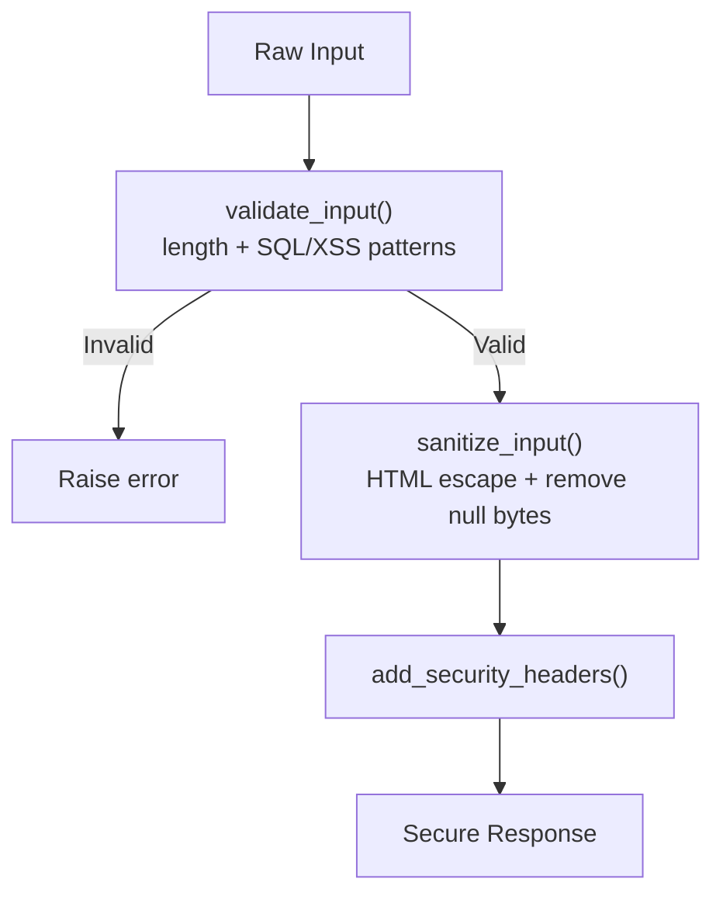

**Diagram sources**
- [middleware.py:70-99](file://security/middleware.py#L70-L99)
- [middleware.py:109-124](file://security/middleware.py#L109-L124)

**Section sources**
- [middleware.py:20-320](file://security/middleware.py#L20-L320)

### User Profile Management
- Profile updates exclude system fields (password, email, username) and persist to MongoDB
- Local mode currently does not support profile updates
- User info retrieval excludes sensitive fields and normalizes identifiers

**Section sources**
- [auth_manager.py:243-263](file://auth/auth_manager.py#L243-L263)
- [auth_manager.py:219-241](file://auth/auth_manager.py#L219-L241)

### Password Hashing
- bcrypt is used for password hashing and verification
- Unit tests confirm correct hashing behavior and verification outcomes

**Section sources**
- [auth_manager.py:88-99](file://auth/auth_manager.py#L88-L99)
- [test_auth.py:16-51](file://tests/unit/test_auth.py#L16-L51)

### Protected Endpoints and Authentication Decorators
- Authentication dependency extracts Bearer token from Authorization header and verifies it
- Protected endpoints use Depends(get_current_user) to inject the verified payload
- Examples include /auth/me, /auth/change-password, and chat history endpoints

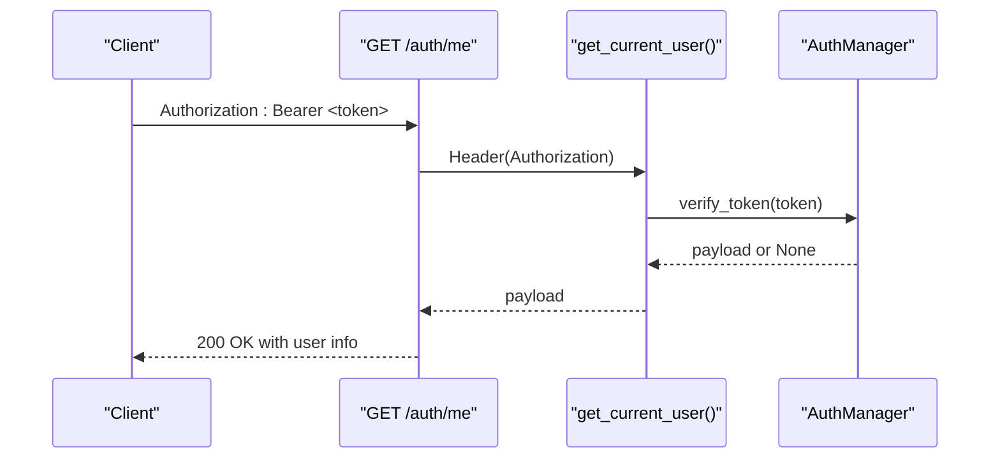

**Diagram sources**
- [api_routes.py:58-75](file://auth/api_routes.py#L58-L75)
- [auth_manager.py:116-125](file://auth/auth_manager.py#L116-L125)

**Section sources**
- [api_routes.py:58-75](file://auth/api_routes.py#L58-L75)
- [api_routes.py:111-119](file://auth/api_routes.py#L111-L119)

### Chat History Management
- Conversations and messages are stored in MongoDB with indexes for performance
- Operations include creating conversations, adding messages, listing conversations, retrieving messages, updating titles, deleting conversations, searching, and computing statistics
- Ownership checks ensure users can only access their own conversations

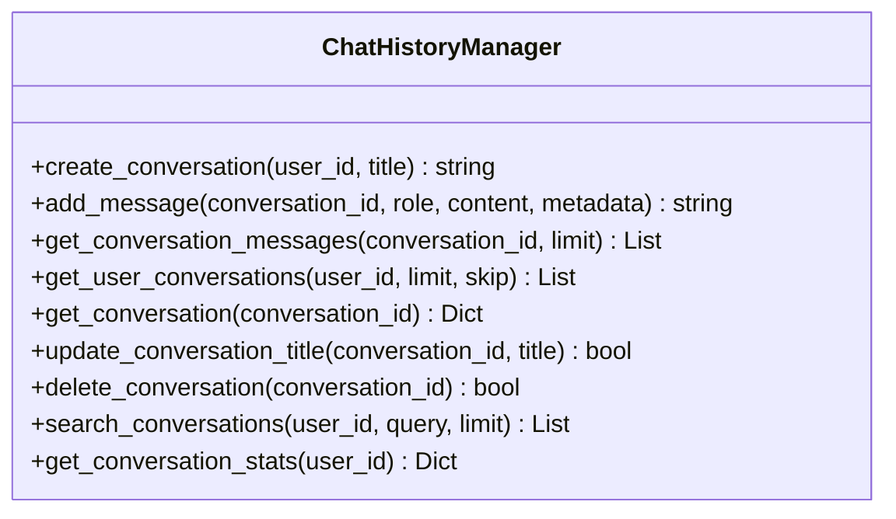

**Diagram sources**
- [chat_history_manager.py:21-274](file://auth/chat_history_manager.py#L21-L274)

**Section sources**
- [chat_history_manager.py:38-111](file://auth/chat_history_manager.py#L38-L111)
- [chat_history_manager.py:112-173](file://auth/chat_history_manager.py#L112-L173)
- [chat_history_manager.py:175-222](file://auth/chat_history_manager.py#L175-L222)
- [chat_history_manager.py:223-248](file://auth/chat_history_manager.py#L223-L248)
- [chat_history_manager.py:250-269](file://auth/chat_history_manager.py#L250-L269)

### Administrative Functions and Question Bank Management
- Admin-only endpoints manage static questions: list, add, update, delete, and AI-generated bulk generation
- Ownership and uniqueness checks are enforced for question IDs
- Admin dependency ensures only admins can access these endpoints

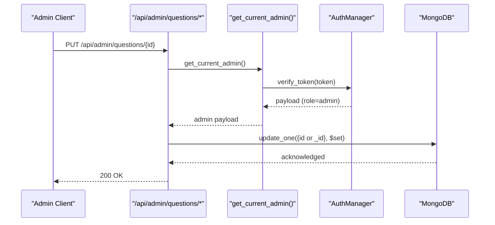

**Diagram sources**
- [admin_routes.py:108-130](file://auth/admin_routes.py#L108-L130)
- [admin_routes.py:8-12](file://auth/admin_routes.py#L8-L12)

**Section sources**
- [admin_routes.py:14-148](file://auth/admin_routes.py#L14-L148)

### User Data Handling and Learning Analytics
- Weak topics are computed from interaction logs by counting chapter/topic occurrences over a rolling window
- Completed topics are derived from quiz-generated actions
- Interaction logs capture user queries, retrieved chunks, and deduplicated chapter metadata

**Section sources**
- [auth_manager.py:265-296](file://auth/auth_manager.py#L265-L296)
- [auth_manager.py:298-325](file://auth/auth_manager.py#L298-L325)
- [auth_manager.py:327-347](file://auth/auth_manager.py#L327-L347)

## Dependency Analysis
- FastAPI app initialization includes the auth router and applies CORS middleware
- Auth routes depend on AuthManager for token verification and user operations
- Chat history endpoints depend on ChatHistoryManager for conversation/message persistence
- Admin and user routes depend on AuthManager for MongoDB access and role checks
- Security middleware is available for input validation and protective headers

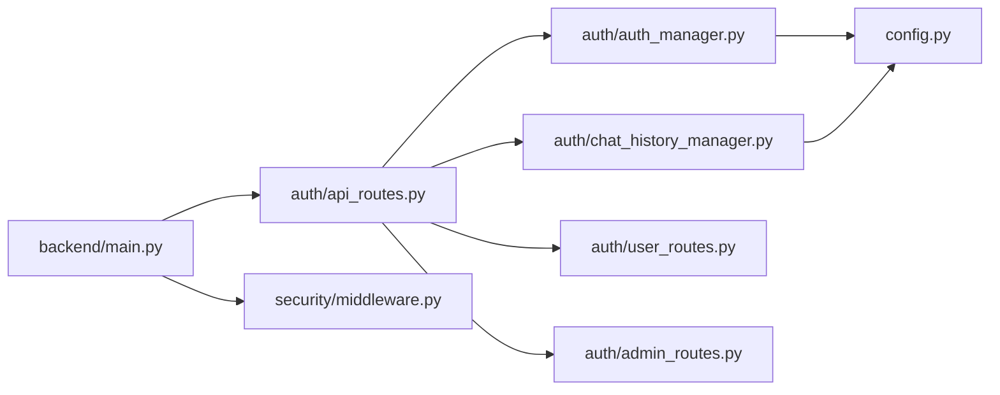

**Diagram sources**
- [main.py:19-41](file://backend/main.py#L19-L41)
- [api_routes.py:12-13](file://auth/api_routes.py#L12-L13)
- [auth_manager.py:61-87](file://auth/auth_manager.py#L61-L87)
- [chat_history_manager.py:24-36](file://auth/chat_history_manager.py#L24-L36)
- [config.py:46-46](file://config.py#L46-L46)

**Section sources**
- [main.py:19-41](file://backend/main.py#L19-L41)
- [api_routes.py:12-13](file://auth/api_routes.py#L12-L13)
- [auth_manager.py:61-87](file://auth/auth_manager.py#L61-L87)
- [chat_history_manager.py:24-36](file://auth/chat_history_manager.py#L24-L36)
- [config.py:46-46](file://config.py#L46-L46)

## Performance Considerations
- JWT verification is O(1) with minimal overhead
- MongoDB indexes on user and session collections improve lookup performance
- Chat history operations use capped queries with sorting and limits
- Consider implementing token refresh mechanisms and session cleanup jobs for long-running deployments
- Use HTTPS and secure cookies in production to protect tokens

## Troubleshooting Guide
Common issues and resolutions:
- Missing or invalid Authorization header: Ensure clients send "Authorization: Bearer <token>" and that the token is unexpired and valid
- MongoDB connectivity failures: Verify MONGODB_URI environment variable and network access
- JWT_SECRET_KEY warnings: Set JWT_SECRET_KEY in environment variables before deployment
- Admin access denied: Confirm user role is admin in the token payload
- JSON fallback limitations: Some operations (e.g., profile updates) are not supported in local mode

**Section sources**
- [api_routes.py:58-75](file://auth/api_routes.py#L58-L75)
- [auth_manager.py:22-31](file://auth/auth_manager.py#L22-L31)
- [admin_routes.py:8-12](file://auth/admin_routes.py#L8-L12)
- [auth_manager.py:245-246](file://auth/auth_manager.py#L245-L246)

## Conclusion
The authentication system provides a robust foundation for user management, JWT-based authentication, and RBAC enforcement. It integrates with MongoDB for persistent storage and offers comprehensive chat history management. Security measures include input validation, sanitization, protective headers, and role-based protections. For production, ensure proper environment configuration, implement token refresh strategies, and monitor session lifetimes.

## Appendices
- Example protected endpoint usage: GET /auth/me with Authorization header
- Example admin endpoint usage: PUT /api/admin/questions/{id} with admin role
- Example chat history endpoint usage: POST /conversations with Authorization header