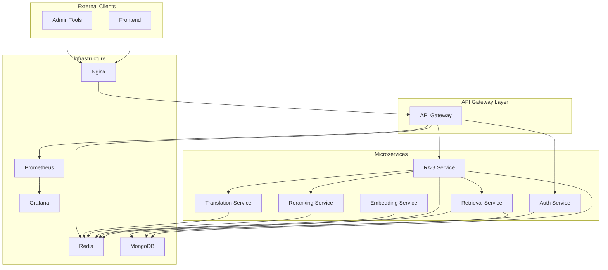
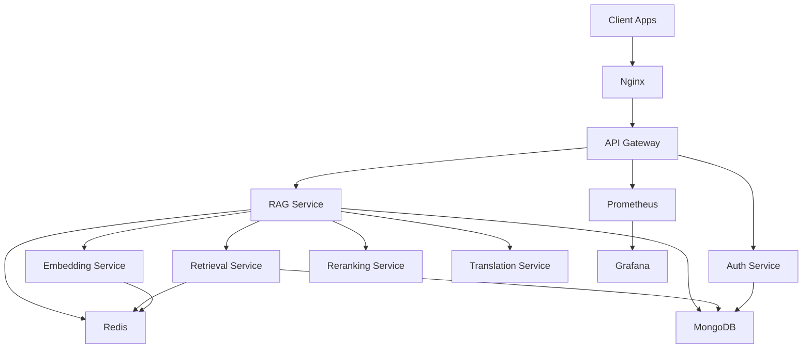
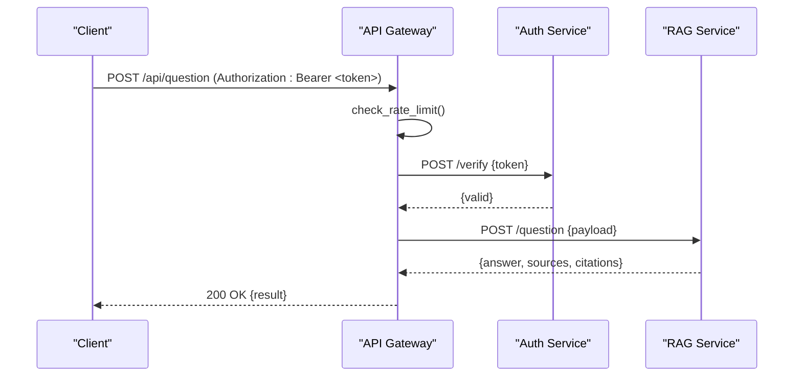
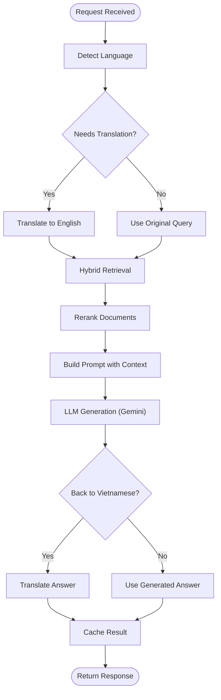
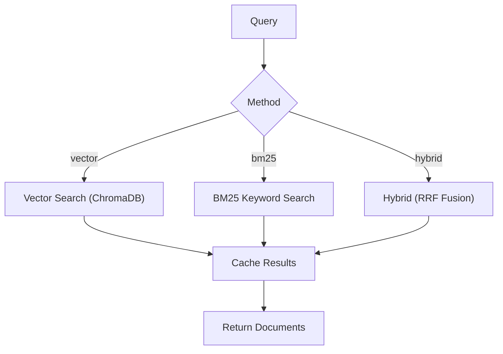
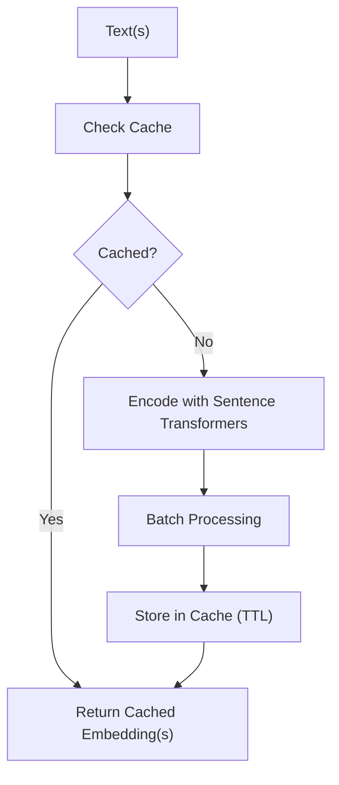
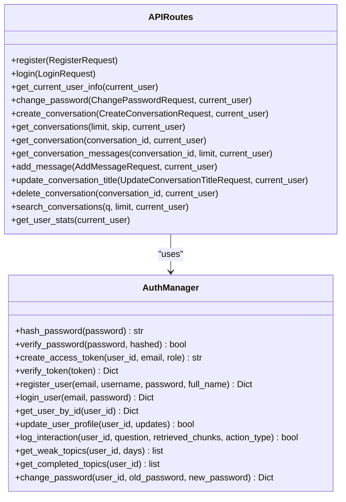
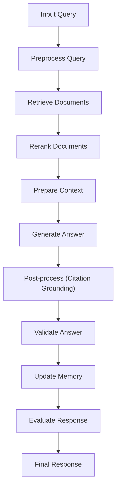
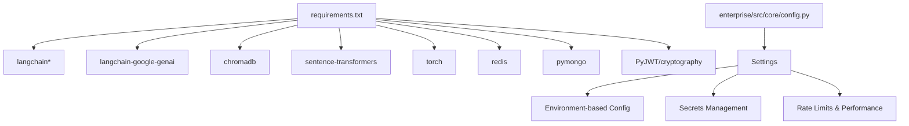
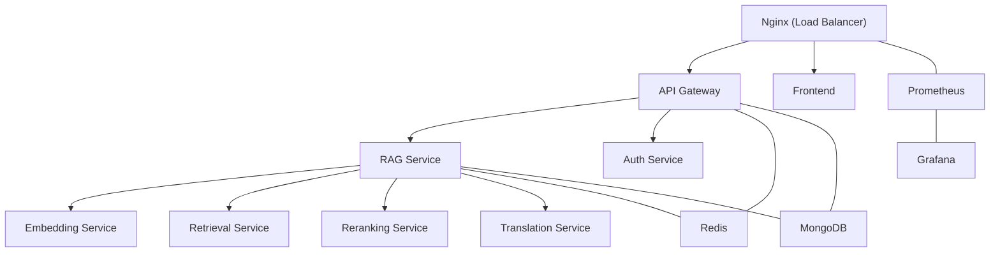

# Backend Architecture

<cite>
**Referenced Files in This Document**
- [backend/main.py](file://backend/main.py)
- [services/api-gateway/main.py](file://services/api-gateway/main.py)
- [services/rag-service/main.py](file://services/rag-service/main.py)
- [services/embedding-service/main.py](file://services/embedding-service/main.py)
- [services/retrieval-service/main.py](file://services/retrieval-service/main.py)
- [auth/auth_manager.py](file://auth/auth_manager.py)
- [auth/api_routes.py](file://auth/api_routes.py)
- [advanced_rag/pipeline/integrated_rag.py](file://advanced_rag/pipeline/integrated_rag.py)
- [docker-compose.production.yml](file://docker-compose.production.yml)
- [requirements.txt](file://requirements.txt)
- [enterprise/src/core/config.py](file://enterprise/src/core/config.py)
</cite>

## Table of Contents
1. [Introduction](#introduction)
2. [Project Structure](#project-structure)
3. [Core Components](#core-components)
4. [Architecture Overview](#architecture-overview)
5. [Detailed Component Analysis](#detailed-component-analysis)
6. [Dependency Analysis](#dependency-analysis)
7. [Performance Considerations](#performance-considerations)
8. [Troubleshooting Guide](#troubleshooting-guide)
9. [Conclusion](#conclusion)
10. [Appendices](#appendices)

## Introduction
This document describes the backend architecture of the MinerAI system, a FastAPI-based microservices platform integrating Retrieval-Augmented Generation (RAG). It covers the API gateway implementation, microservices design pattern, layered architecture, component interactions, data flows, authentication system, and service coordination mechanisms. It also outlines infrastructure requirements, scalability considerations, and deployment topology, including integrations with Google Gemini API and ChromaDB.

## Project Structure
The backend follows a modular FastAPI architecture with a dedicated API gateway and multiple specialized microservices:
- API Gateway: Centralized ingress handling routing, authentication, rate limiting, and observability.
- RAG Service: Orchestrates the RAG pipeline, integrates with retrieval, reranking, translation, and LLMs.
- Retrieval Service: Provides vector and keyword search with hybrid fusion and caching.
- Embedding Service: Generates and caches embeddings with batching and GPU support.
- Auth Module: Manages user registration, login, JWT tokens, and chat history.
- Advanced RAG Pipeline: A production-ready pipeline combining ingestion, retrieval, reranking, generation, memory, and evaluation.
- Infrastructure: Docker Compose defines the production topology with Nginx, Redis, MongoDB, and monitoring stacks.

**Diagram sources**
- [docker-compose.production.yml:1-359](file://docker-compose.production.yml#L1-L359)
- [services/api-gateway/main.py:1-269](file://services/api-gateway/main.py#L1-L269)
- [services/rag-service/main.py:1-299](file://services/rag-service/main.py#L1-L299)
- [services/retrieval-service/main.py:1-275](file://services/retrieval-service/main.py#L1-L275)
- [services/embedding-service/main.py:1-204](file://services/embedding-service/main.py#L1-L204)
- [auth/api_routes.py:1-352](file://auth/api_routes.py#L1-L352)

**Section sources**
- [docker-compose.production.yml:1-359](file://docker-compose.production.yml#L1-L359)
- [backend/main.py:1-69](file://backend/main.py#L1-L69)

## Core Components
- API Gateway: Handles CORS, rate limiting, JWT verification via Auth Service, Prometheus metrics, and proxies requests to downstream services.
- RAG Service: Orchestrates the RAG pipeline, performs caching, translates queries and answers, and coordinates with Retrieval, Reranking, and Translation services.
- Retrieval Service: Implements vector search, BM25 keyword search, reciprocal rank fusion (RRF), and caching.
- Embedding Service: Encodes texts into vectors with caching, batching, and optional GPU acceleration.
- Auth Module: Provides user management, JWT lifecycle, and chat history APIs.
- Advanced RAG Pipeline: A comprehensive pipeline integrating ingestion, retrieval, reranking, generation, memory, and evaluation.

**Section sources**
- [services/api-gateway/main.py:1-269](file://services/api-gateway/main.py#L1-L269)
- [services/rag-service/main.py:1-299](file://services/rag-service/main.py#L1-L299)
- [services/retrieval-service/main.py:1-275](file://services/retrieval-service/main.py#L1-L275)
- [services/embedding-service/main.py:1-204](file://services/embedding-service/main.py#L1-L204)
- [auth/auth_manager.py:1-393](file://auth/auth_manager.py#L1-L393)
- [auth/api_routes.py:1-352](file://auth/api_routes.py#L1-L352)
- [advanced_rag/pipeline/integrated_rag.py:1-569](file://advanced_rag/pipeline/integrated_rag.py#L1-L569)

## Architecture Overview
The system employs a FastAPI microservices architecture behind an API Gateway. The gateway enforces authentication and rate limits, while downstream services collaborate to deliver RAG capabilities. Redis and MongoDB provide caching and persistence. Prometheus and Grafana enable observability.

**Diagram sources**
- [docker-compose.production.yml:1-359](file://docker-compose.production.yml#L1-L359)
- [services/api-gateway/main.py:1-269](file://services/api-gateway/main.py#L1-L269)
- [services/rag-service/main.py:1-299](file://services/rag-service/main.py#L1-L299)

## Detailed Component Analysis

### API Gateway
The API Gateway centralizes ingress traffic, enforcing CORS, rate limiting, and JWT verification by delegating to the Auth Service. It exposes proxy endpoints for question answering, summarization, and quiz generation, and provides health and metrics endpoints.

**Diagram sources**
- [services/api-gateway/main.py:126-151](file://services/api-gateway/main.py#L126-L151)
- [services/api-gateway/main.py:192-206](file://services/api-gateway/main.py#L192-L206)

Key behaviors:
- Rate limiting per IP with fail-open on Redis errors.
- JWT verification via Auth Service.
- Proxy endpoints for question, summary, and quiz.
- Health checks for Redis and downstream services.
- Prometheus metrics exposure.

**Section sources**
- [services/api-gateway/main.py:1-269](file://services/api-gateway/main.py#L1-L269)

### RAG Service
The RAG Service orchestrates the end-to-end pipeline: query preprocessing, language detection and translation, hybrid retrieval, reranking, LLM generation, and result caching. It coordinates with Retrieval, Reranking, and Translation services and integrates with Google Gemini.

**Diagram sources**
- [services/rag-service/main.py:93-199](file://services/rag-service/main.py#L93-L199)

Operational highlights:
- Caching with Redis keys for queries and retrieval results.
- Async HTTP client for inter-service communication.
- Celery worker for asynchronous quiz generation tasks.
- Google Gemini integration for answer generation.

**Section sources**
- [services/rag-service/main.py:1-299](file://services/rag-service/main.py#L1-L299)

### Retrieval Service
Implements vector search using ChromaDB, BM25 keyword search, and hybrid fusion via Reciprocal Rank Fusion (RRF). Results are cached in Redis for performance.

**Diagram sources**
- [services/retrieval-service/main.py:155-191](file://services/retrieval-service/main.py#L155-L191)

**Section sources**
- [services/retrieval-service/main.py:1-275](file://services/retrieval-service/main.py#L1-L275)

### Embedding Service
Encodes texts into embeddings with caching, batching, and optional GPU acceleration. Supports single and batch embedding endpoints.

**Diagram sources**
- [services/embedding-service/main.py:109-154](file://services/embedding-service/main.py#L109-L154)

**Section sources**
- [services/embedding-service/main.py:1-204](file://services/embedding-service/main.py#L1-L204)

### Authentication System
The Auth module manages user registration, login, JWT lifecycle, and chat history. It supports MongoDB with a JSON fallback and provides protected routes for user data and conversation management.

**Diagram sources**
- [auth/auth_manager.py:58-393](file://auth/auth_manager.py#L58-L393)
- [auth/api_routes.py:1-352](file://auth/api_routes.py#L1-L352)

**Section sources**
- [auth/auth_manager.py:1-393](file://auth/auth_manager.py#L1-L393)
- [auth/api_routes.py:1-352](file://auth/api_routes.py#L1-L352)

### Advanced RAG Pipeline
A production-ready pipeline integrating ingestion, retrieval, reranking, generation, memory, and evaluation. It demonstrates advanced techniques such as query rewriting, contextual compression, hallucination detection, and citation grounding.

**Diagram sources**
- [advanced_rag/pipeline/integrated_rag.py:133-240](file://advanced_rag/pipeline/integrated_rag.py#L133-L240)

**Section sources**
- [advanced_rag/pipeline/integrated_rag.py:1-569](file://advanced_rag/pipeline/integrated_rag.py#L1-L569)

## Dependency Analysis
External dependencies include LangChain, ChromaDB, Redis, MongoDB, and Google Gemini. The enterprise configuration module centralizes environment-specific settings and validation.

**Diagram sources**
- [requirements.txt:1-43](file://requirements.txt#L1-L43)
- [enterprise/src/core/config.py:1-200](file://enterprise/src/core/config.py#L1-L200)

**Section sources**
- [requirements.txt:1-43](file://requirements.txt#L1-L43)
- [enterprise/src/core/config.py:1-200](file://enterprise/src/core/config.py#L1-L200)

## Performance Considerations
- Caching: Redis caches embeddings, retrieval results, and RAG responses to reduce latency and cost.
- Batching: Embedding Service batches encodings to improve throughput.
- Asynchronous Processing: Celery workers handle long-running tasks like quiz generation.
- GPU Acceleration: Optional GPU usage in Embedding Service for faster encoding.
- Hybrid Retrieval: Combines vector and keyword search with RRF fusion for robustness.
- Observability: Prometheus metrics and Grafana dashboards for monitoring.

[No sources needed since this section provides general guidance]

## Troubleshooting Guide
Common issues and diagnostics:
- Gateway Health: Use the health endpoint to verify Redis and downstream service availability.
- Rate Limiting: Excessive requests trigger 429 responses; inspect gateway logs and Redis counters.
- Auth Failures: Missing or invalid Authorization header leads to 401; verify token validity with the Auth Service.
- Service Connectivity: Inter-service timeouts indicate downstream service unavailability; check service health endpoints.
- Redis/Mongo Issues: Fail-open behavior may bypass rate limiting or caching; monitor service health and logs.

**Section sources**
- [services/api-gateway/main.py:156-181](file://services/api-gateway/main.py#L156-L181)
- [services/api-gateway/main.py:95-121](file://services/api-gateway/main.py#L95-L121)
- [services/api-gateway/main.py:126-151](file://services/api-gateway/main.py#L126-L151)

## Conclusion
The MinerAI backend leverages a FastAPI microservices architecture with an API Gateway for centralized control, robust caching, and coordinated orchestration among specialized services. The system integrates Google Gemini and ChromaDB, supports Redis and MongoDB for persistence and caching, and provides comprehensive observability. The design emphasizes scalability, resilience, and maintainability through modular components, asynchronous processing, and enterprise-grade configuration management.

[No sources needed since this section summarizes without analyzing specific files]

## Appendices

### Deployment Topology
Production deployment uses Docker Compose with Nginx as the load balancer, exposing services on dedicated ports and mounting persistent volumes for ChromaDB and Redis data.

**Diagram sources**
- [docker-compose.production.yml:1-359](file://docker-compose.production.yml#L1-L359)

**Section sources**
- [docker-compose.production.yml:1-359](file://docker-compose.production.yml#L1-L359)