# Core Backend Components

<cite>
**Referenced Files in This Document**
- [backend/main.py](file://backend/main.py)
- [config.py](file://config.py)
- [run_backend.py](file://run_backend.py)
- [requirements.txt](file://requirements.txt)
- [auth/api_routes.py](file://auth/api_routes.py)
- [auth/admin_routes.py](file://auth/admin_routes.py)
- [auth/user_routes.py](file://auth/user_routes.py)
- [services/rag-service/main.py](file://services/rag-service/main.py)
</cite>

## Table of Contents
1. [Introduction](#introduction)
2. [Project Structure](#project-structure)
3. [Core Components](#core-components)
4. [Architecture Overview](#architecture-overview)
5. [Detailed Component Analysis](#detailed-component-analysis)
6. [Dependency Analysis](#dependency-analysis)
7. [Performance Considerations](#performance-considerations)
8. [Troubleshooting Guide](#troubleshooting-guide)
9. [Conclusion](#conclusion)

## Introduction
This document explains the core backend components of the MinerAI system with a focus on the FastAPI application structure, main entry point configuration, and core service initialization. It covers the application lifecycle (startup/shutdown), global configuration via centralized settings, session and authentication patterns, Pydantic models for request/response validation, CORS configuration, error handling strategies, endpoint registration, dependency injection patterns, background tasks, and performance considerations including concurrency and memory management.

## Project Structure
The backend is organized around a central FastAPI application entry point and modular routing for authentication and user/conversation management. Supporting services are split into specialized microservice modules (e.g., RAG service). Centralized configuration is provided via a single configuration module that validates and exports runtime settings.

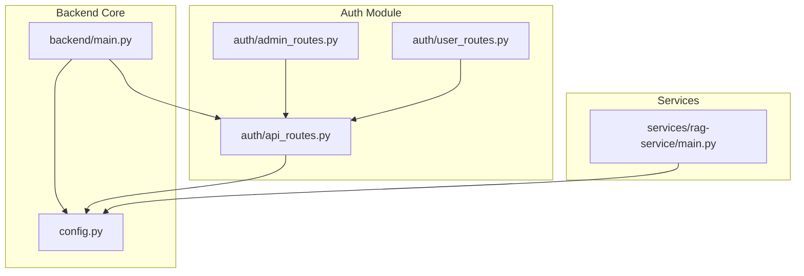

**Diagram sources**
- [backend/main.py:1-69](file://backend/main.py#L1-L69)
- [config.py:1-218](file://config.py#L1-L218)
- [auth/api_routes.py:1-352](file://auth/api_routes.py#L1-L352)
- [auth/admin_routes.py:1-148](file://auth/admin_routes.py#L1-L148)
- [auth/user_routes.py:1-61](file://auth/user_routes.py#L1-L61)
- [services/rag-service/main.py:1-299](file://services/rag-service/main.py#L1-L299)

**Section sources**
- [backend/main.py:1-69](file://backend/main.py#L1-L69)
- [config.py:1-218](file://config.py#L1-L218)
- [auth/api_routes.py:1-352](file://auth/api_routes.py#L1-L352)
- [auth/admin_routes.py:1-148](file://auth/admin_routes.py#L1-L148)
- [auth/user_routes.py:1-61](file://auth/user_routes.py#L1-L61)
- [services/rag-service/main.py:1-299](file://services/rag-service/main.py#L1-L299)

## Core Components
- FastAPI Application Initialization
  - The main application initializes FastAPI with title, description, and version, adds CORS middleware allowing all origins/headers/methods, includes the API router, and registers startup/shutdown event handlers.
  - The application can be run directly via Uvicorn with reload enabled for development.

- Centralized Configuration
  - Central configuration module defines paths, API keys, model settings, chunking/retrieval parameters, performance tuning, logging, rate limiting, and validation helpers.
  - A validation routine checks environment variables and parameter ranges at import time.

- Auth and Chat History Routes
  - Authentication endpoints (register, login, change password) and user info retrieval.
  - Chat history CRUD endpoints with ownership checks and pagination support.
  - Dependency injection pattern for JWT verification and current user extraction.
  - Admin endpoints for managing system questions and generating questions via AI.
  - User-specific question management endpoints.

- RAG Service Orchestration
  - Dedicated FastAPI service orchestrating the RAG pipeline with Redis caching, async HTTP clients, and Celery-backed background tasks.
  - Endpoints for question answering, summarization, and quiz generation with progress tracking.

**Section sources**
- [backend/main.py:25-50](file://backend/main.py#L25-L50)
- [config.py:138-163](file://config.py#L138-L163)
- [auth/api_routes.py:58-75](file://auth/api_routes.py#L58-L75)
- [auth/admin_routes.py:8-12](file://auth/admin_routes.py#L8-L12)
- [services/rag-service/main.py:31-44](file://services/rag-service/main.py#L31-L44)

## Architecture Overview
The backend follows a layered architecture:
- Entry point initializes the FastAPI app, middleware, routers, and lifecycle hooks.
- Auth module encapsulates authentication, user profiles, and chat history management.
- Services module hosts specialized microservices (e.g., RAG service) that expose their own APIs and integrate with shared configuration and external systems.

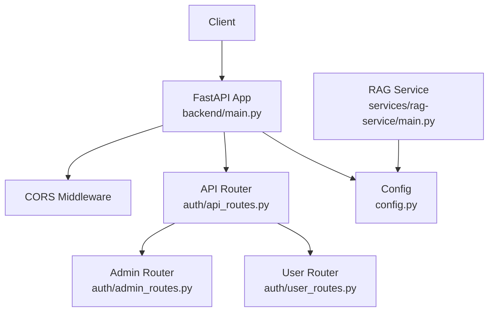

**Diagram sources**
- [backend/main.py:31-41](file://backend/main.py#L31-L41)
- [auth/api_routes.py:15-15](file://auth/api_routes.py#L15-L15)
- [auth/admin_routes.py:6-6](file://auth/admin_routes.py#L6-L6)
- [auth/user_routes.py:7-7](file://auth/user_routes.py#L7-L7)
- [config.py:1-218](file://config.py#L1-L218)
- [services/rag-service/main.py:1-299](file://services/rag-service/main.py#L1-L299)

## Detailed Component Analysis

### FastAPI Application Initialization and Lifecycle
- Application creation sets up the API metadata and middleware stack.
- CORS is configured broadly to allow development flexibility; production deployments should restrict origins.
- Router inclusion wires the auth routes into the main application.
- Startup and shutdown hooks delegate to core initialization and cleanup routines.

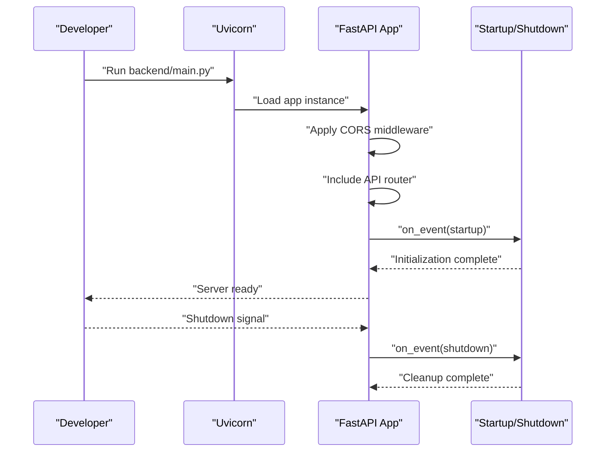

**Diagram sources**
- [backend/main.py:25-50](file://backend/main.py#L25-L50)

**Section sources**
- [backend/main.py:25-50](file://backend/main.py#L25-L50)

### Centralized Configuration Management
- Paths and cache/log directories are defined and created on demand.
- Environment variables are loaded and normalized for API keys.
- Validation ensures required keys and safe parameter ranges are present.
- Exported constants are used across modules for consistent behavior.

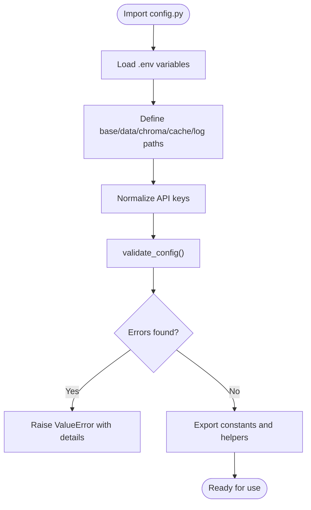

**Diagram sources**
- [config.py:11-163](file://config.py#L11-L163)

**Section sources**
- [config.py:11-163](file://config.py#L11-L163)

### Authentication and Session Handling
- JWT-based authentication with a dependency that extracts and verifies tokens from Authorization headers.
- Current user dependency returns decoded payload for protected endpoints.
- Session timeout and UI settings are centrally managed.

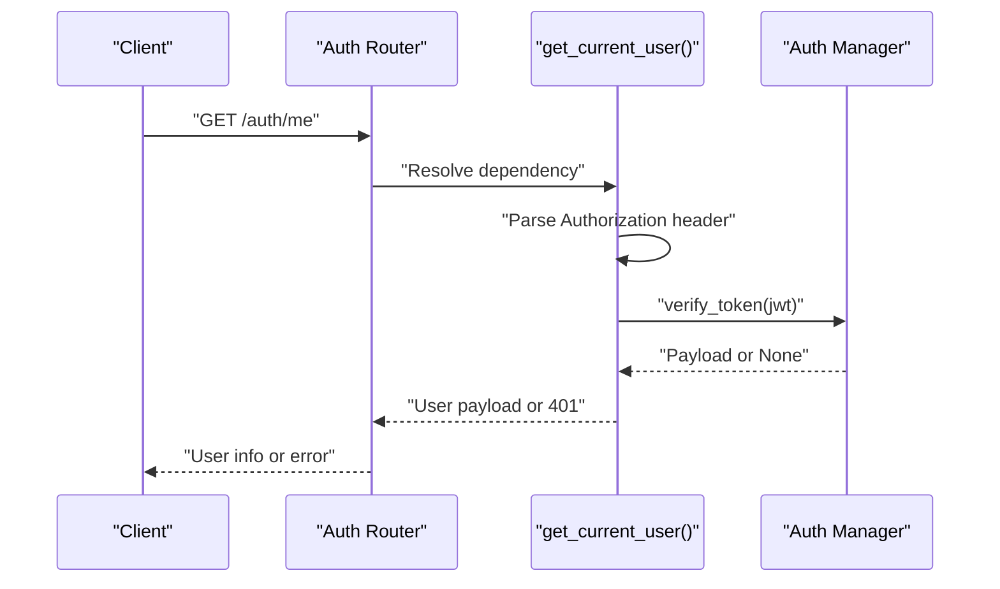

**Diagram sources**
- [auth/api_routes.py:58-75](file://auth/api_routes.py#L58-L75)

**Section sources**
- [auth/api_routes.py:58-75](file://auth/api_routes.py#L58-L75)
- [config.py:118-118](file://config.py#L118-L118)

### Endpoint Registration and Dependency Injection Patterns
- API routes are grouped under dedicated routers and mounted into the main application.
- Dependencies inject current user context and enforce access control.
- Admin-only endpoints validate roles and handle MongoDB operations.

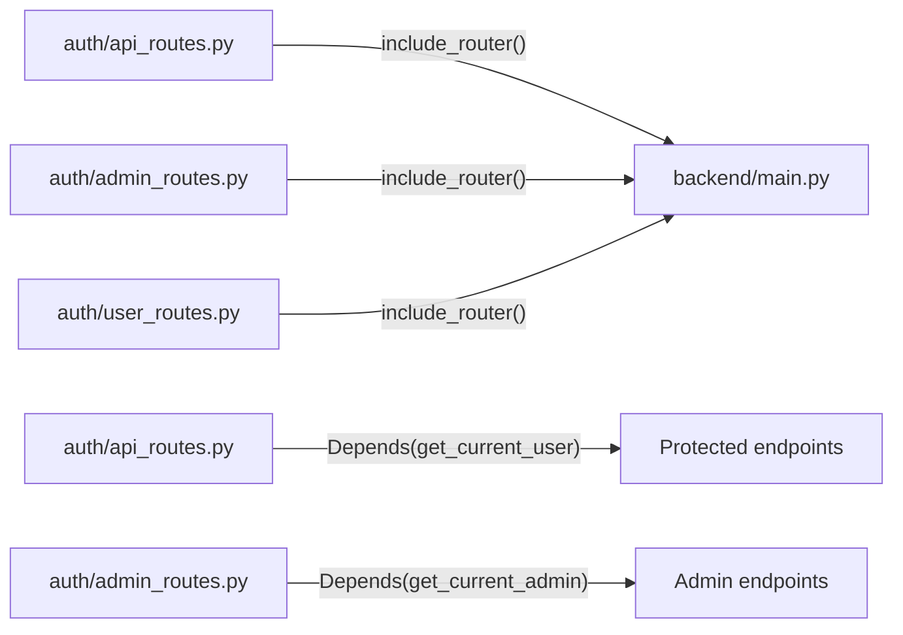

**Diagram sources**
- [auth/api_routes.py:15-15](file://auth/api_routes.py#L15-L15)
- [auth/admin_routes.py:6-6](file://auth/admin_routes.py#L6-L6)
- [auth/user_routes.py:7-7](file://auth/user_routes.py#L7-L7)
- [backend/main.py:19-41](file://backend/main.py#L19-L41)

**Section sources**
- [auth/api_routes.py:15-15](file://auth/api_routes.py#L15-L15)
- [auth/admin_routes.py:6-6](file://auth/admin_routes.py#L6-L6)
- [auth/user_routes.py:7-7](file://auth/user_routes.py#L7-L7)
- [backend/main.py:19-41](file://backend/main.py#L19-L41)

### Pydantic Models and Request/Response Validation
- Authentication and chat history endpoints define Pydantic models for request bodies and responses.
- Models enforce field types and optional fields, enabling automatic validation and serialization.

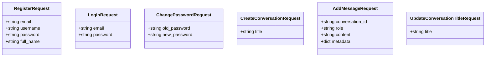

**Diagram sources**
- [auth/api_routes.py:22-52](file://auth/api_routes.py#L22-L52)

**Section sources**
- [auth/api_routes.py:22-52](file://auth/api_routes.py#L22-L52)

### Error Handling Strategies
- Centralized HTTP exceptions are raised for invalid credentials, missing resources, and permission denials.
- Validation errors are surfaced during configuration import to fail fast.
- Service-level endpoints wrap pipeline execution in try/catch blocks to return structured error responses.

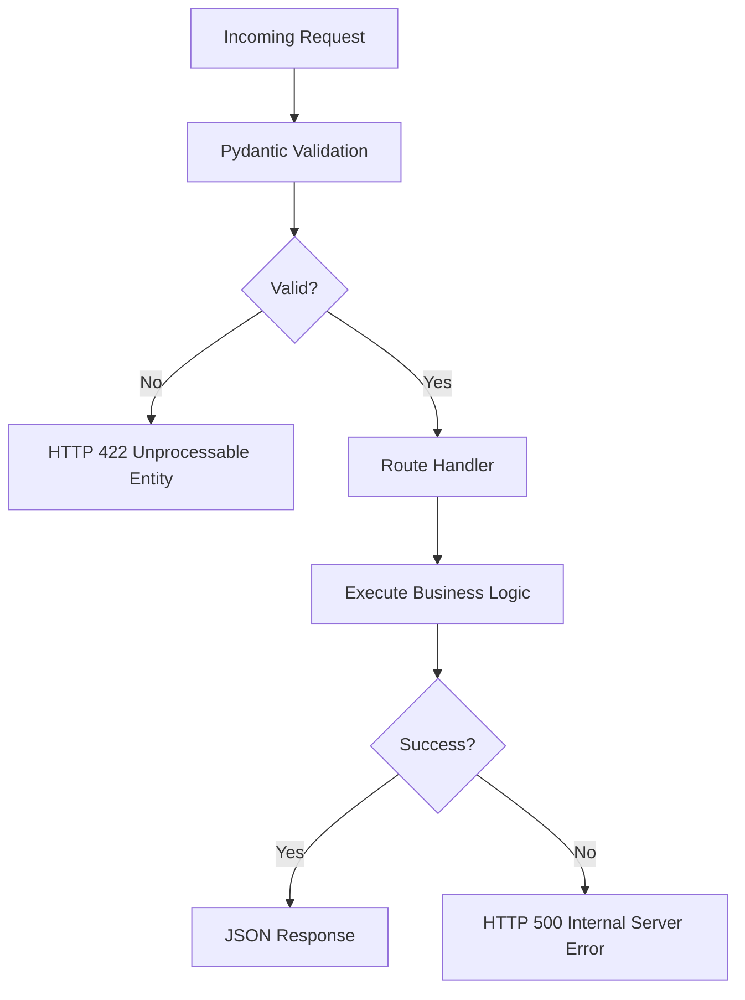

**Diagram sources**
- [auth/api_routes.py:91-94](file://auth/api_routes.py#L91-L94)
- [services/rag-service/main.py:224-228](file://services/rag-service/main.py#L224-L228)

**Section sources**
- [auth/api_routes.py:91-94](file://auth/api_routes.py#L91-L94)
- [services/rag-service/main.py:224-228](file://services/rag-service/main.py#L224-L228)

### CORS Configuration
- CORS middleware is applied with broad allowances for origins, headers, and methods to simplify development and testing.
- Production deployments should tighten allowed origins and headers.

**Section sources**
- [backend/main.py:32-38](file://backend/main.py#L32-L38)

### Background Task Management
- The RAG service demonstrates background task management using Celery for long-running operations (e.g., quiz generation) while exposing progress polling endpoints.

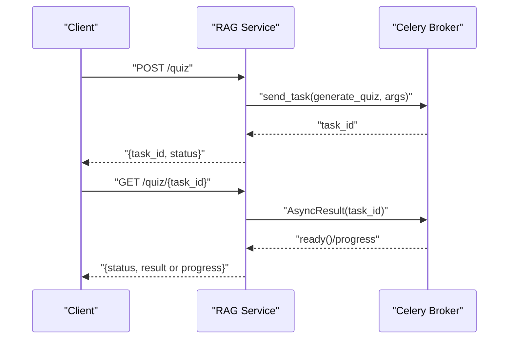

**Diagram sources**
- [services/rag-service/main.py:244-271](file://services/rag-service/main.py#L244-L271)

**Section sources**
- [services/rag-service/main.py:244-271](file://services/rag-service/main.py#L244-L271)

### RAG Pipeline Orchestration
- The RAG service coordinates language detection, translation, retrieval, reranking, and LLM generation.
- Redis caching stores query results with TTL; async HTTP client communicates with downstream services.

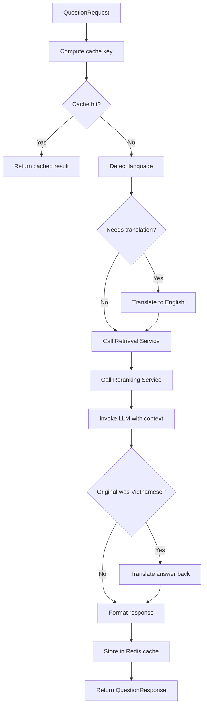

**Diagram sources**
- [services/rag-service/main.py:93-199](file://services/rag-service/main.py#L93-L199)

**Section sources**
- [services/rag-service/main.py:93-199](file://services/rag-service/main.py#L93-L199)

## Dependency Analysis
- Runtime dependencies include FastAPI, Uvicorn, Pydantic, and optional Redis for caching.
- The backend main module depends on the auth router and core startup/shutdown handlers.
- The auth module depends on the configuration module for environment-driven settings.
- The RAG service depends on Redis, HTTPX, and Celery for distributed task execution.

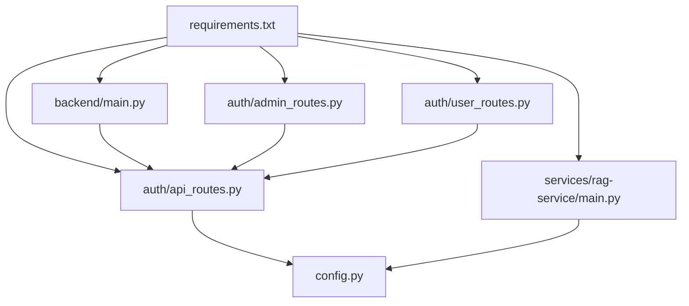

**Diagram sources**
- [requirements.txt:22-43](file://requirements.txt#L22-L43)
- [backend/main.py:19-20](file://backend/main.py#L19-L20)
- [auth/api_routes.py:12-13](file://auth/api_routes.py#L12-L13)
- [services/rag-service/main.py:11-16](file://services/rag-service/main.py#L11-L16)

**Section sources**
- [requirements.txt:22-43](file://requirements.txt#L22-L43)
- [backend/main.py:19-20](file://backend/main.py#L19-L20)
- [auth/api_routes.py:12-13](file://auth/api_routes.py#L12-L13)
- [services/rag-service/main.py:11-16](file://services/rag-service/main.py#L11-L16)

## Performance Considerations
- Concurrency and async processing
  - The RAG service uses an async HTTP client and Celery for background tasks to avoid blocking the main thread.
  - Central configuration enables async processing and limits max concurrent tasks to balance throughput and resource usage.

- Caching
  - Redis caching reduces repeated computation for identical queries; cache keys are derived from hashed inputs.
  - Separate caches exist for embeddings, BM25 indices, and vector store documents.

- Batch processing
  - Embedding and vector DB batch sizes are configurable to optimize throughput.

- Memory management
  - Large language model invocations and document reranking can be memory-intensive; consider adjusting top-k and batch sizes according to available resources.

- Logging and observability
  - Centralized logging configuration supports rotating logs and configurable levels.

**Section sources**
- [services/rag-service/main.py:40-44](file://services/rag-service/main.py#L40-L44)
- [config.py:104-110](file://config.py#L104-L110)
- [config.py:100-102](file://config.py#L100-L102)
- [config.py:123-127](file://config.py#L123-L127)

## Troubleshooting Guide
- Configuration validation failures
  - Ensure required environment variables (API keys, data directories) are present and parameters meet validation criteria.

- CORS issues
  - Broad CORS settings are convenient for development; lock down allowed origins in production.

- Authentication errors
  - Verify Authorization headers include a valid JWT; confirm token expiration and signing configuration.

- Service connectivity
  - Confirm downstream services (retrieval, reranking, translation) are reachable and healthy; check service URLs and network policies.

- Logging and diagnostics
  - Review centralized log files and levels to identify bottlenecks or recurring errors.

**Section sources**
- [config.py:138-163](file://config.py#L138-L163)
- [backend/main.py:32-38](file://backend/main.py#L32-L38)
- [auth/api_routes.py:58-75](file://auth/api_routes.py#L58-L75)
- [services/rag-service/main.py:205-217](file://services/rag-service/main.py#L205-L217)
- [config.py:123-127](file://config.py#L123-L127)

## Conclusion
The MinerAI backend leverages FastAPI for a clean, type-safe API foundation, with centralized configuration ensuring consistent behavior across modules. The auth module enforces secure access via JWT dependencies, while the RAG service orchestrates complex workflows asynchronously and efficiently. Proper configuration, robust error handling, and thoughtful performance tuning enable scalable operation under concurrent workloads.