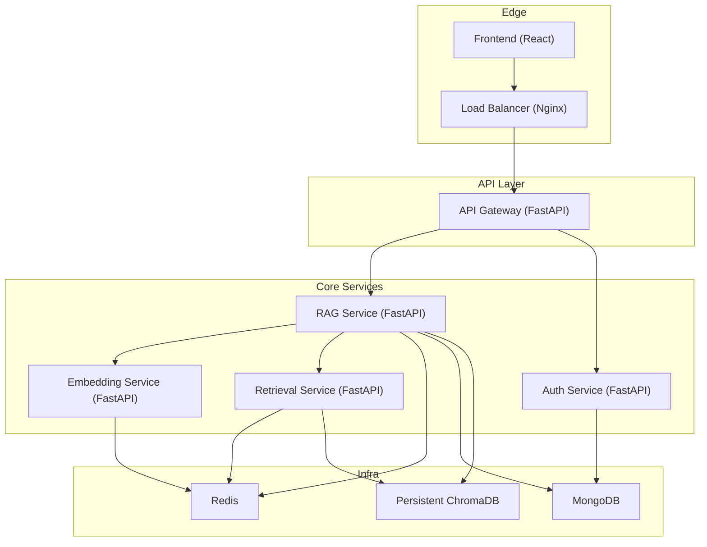
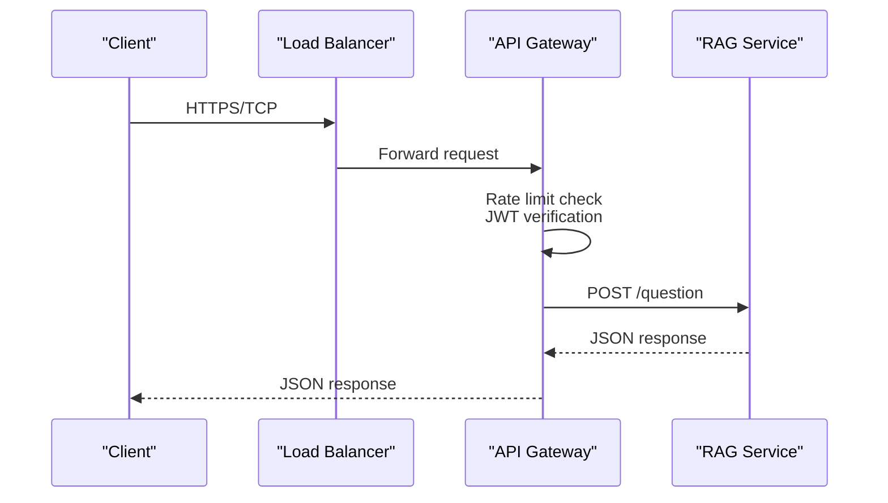
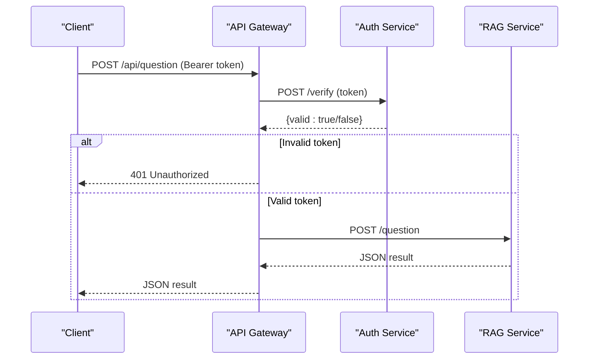
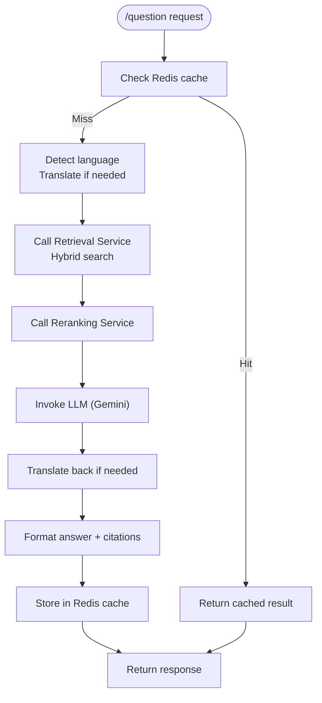
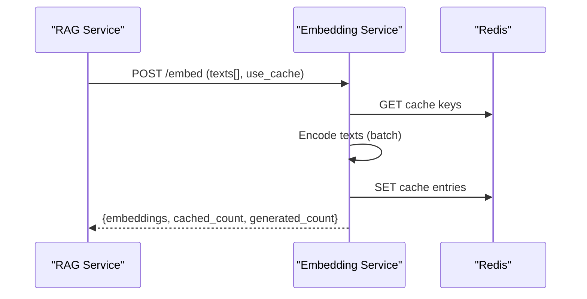
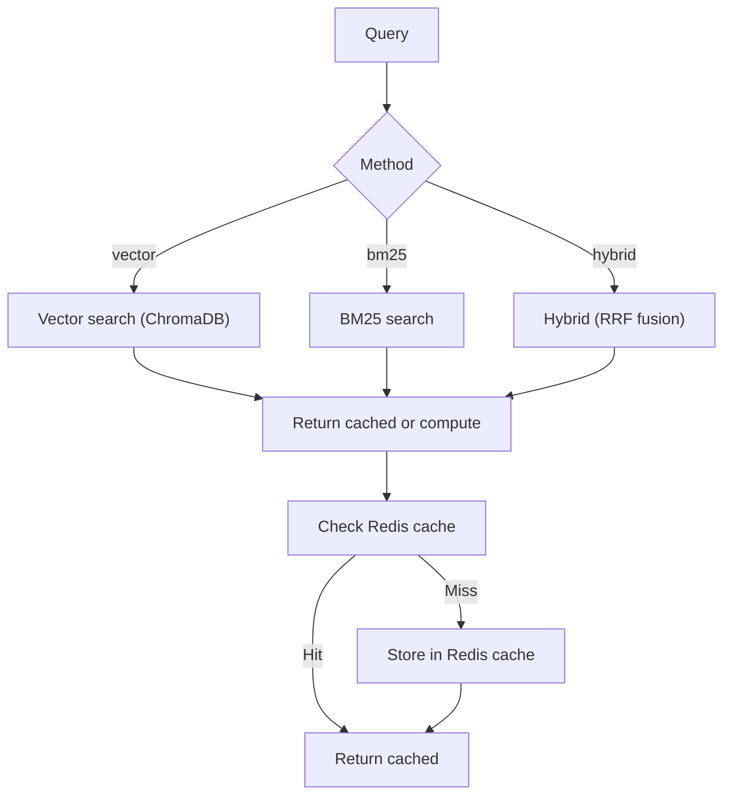
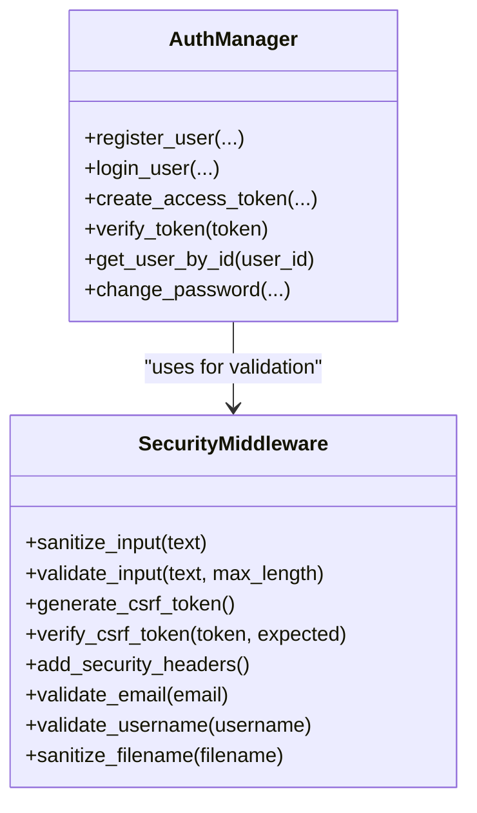
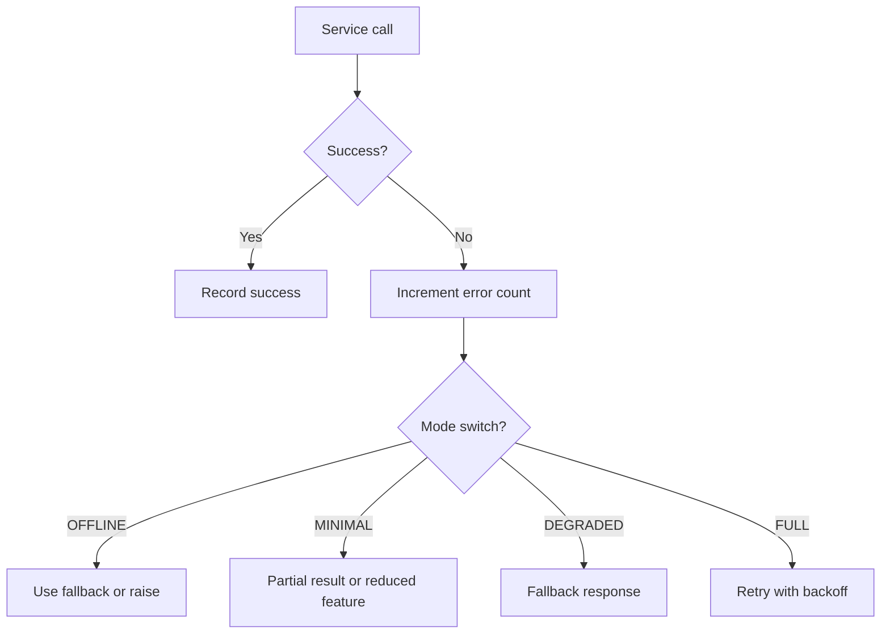
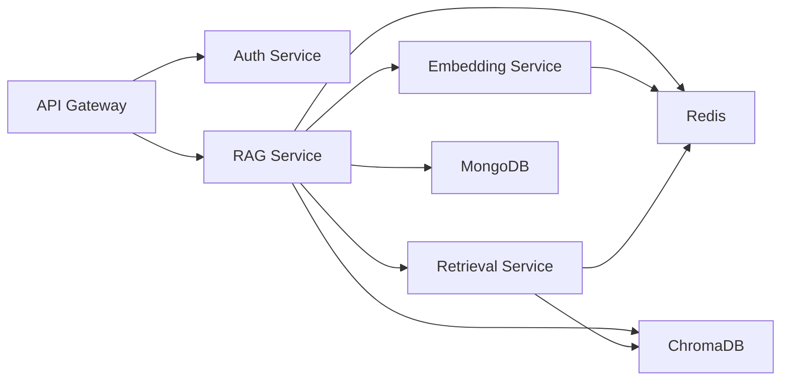

# Microservices Architecture

<cite>
**Referenced Files in This Document**
- [services/api-gateway/main.py](file://services/api-gateway/main.py)
- [services/rag-service/main.py](file://services/rag-service/main.py)
- [services/embedding-service/main.py](file://services/embedding-service/main.py)
- [services/retrieval-service/main.py](file://services/retrieval-service/main.py)
- [docker-compose.production.yml](file://docker-compose.production.yml)
- [reliability/graceful_degradation.py](file://reliability/graceful_degradation.py)
- [reliability/monitoring.py](file://reliability/monitoring.py)
- [reliability/retry_strategy.py](file://reliability/retry_strategy.py)
- [security/auth.py](file://security/auth.py)
- [security/middleware.py](file://security/middleware.py)
- [auth/auth_manager.py](file://auth/auth_manager.py)
- [backend/main.py](file://backend/main.py)
- [requirements.txt](file://requirements.txt)
</cite>

## Table of Contents
1. [Introduction](#introduction)
2. [Project Structure](#project-structure)
3. [Core Components](#core-components)
4. [Architecture Overview](#architecture-overview)
5. [Detailed Component Analysis](#detailed-component-analysis)
6. [Dependency Analysis](#dependency-analysis)
7. [Performance Considerations](#performance-considerations)
8. [Troubleshooting Guide](#troubleshooting-guide)
9. [Conclusion](#conclusion)
10. [Appendices](#appendices)

## Introduction
This document presents a comprehensive microservices architecture design for a Retrieval-Augmented Generation (RAG) system. It explains the API gateway implementation, service routing and discovery mechanisms, inter-service communication patterns, and load balancing strategies. It also documents each microservice’s responsibilities, data exchange protocols, and fault tolerance mechanisms, including graceful degradation, circuit breaker patterns, and monitoring integration. Practical examples illustrate service-to-service requests, error propagation, and operational observability. Finally, it covers deployment considerations, scaling strategies, and cross-cutting concerns such as authentication and logging.

## Project Structure
The system is composed of:
- API Gateway: Centralized ingress and proxy for downstream services.
- Core Services: RAG orchestration, embedding generation, retrieval, and auxiliary services.
- Infrastructure: Container orchestration with Docker Compose, load balancer, Redis, and MongoDB.
- Reliability: Graceful degradation, retry strategies, and monitoring/alerting.
- Security: Authentication, authorization, and input validation.

**Diagram sources**
- [docker-compose.production.yml:7-196](file://docker-compose.production.yml#L7-L196)
- [services/api-gateway/main.py:192-238](file://services/api-gateway/main.py#L192-L238)
- [services/rag-service/main.py:21-26](file://services/rag-service/main.py#L21-L26)
- [services/embedding-service/main.py:20-23](file://services/embedding-service/main.py#L20-L23)
- [services/retrieval-service/main.py:22-23](file://services/retrieval-service/main.py#L22-L23)

**Section sources**
- [docker-compose.production.yml:1-359](file://docker-compose.production.yml#L1-L359)
- [backend/main.py:1-69](file://backend/main.py#L1-L69)

## Core Components
- API Gateway
  - Responsibilities: Authentication, rate limiting, request routing, health checks, Prometheus metrics exposure.
  - Routing: Proxies requests to RAG Service endpoints (/api/question, /api/summary, /api/quiz).
  - Inter-service Communication: Async HTTP client to downstream services; Redis-backed rate limiting; JWT verification via Auth Service.
  - Fault Tolerance: Fail-open behavior for Redis failures; upstream HTTP error mapping to 503.

- RAG Service
  - Responsibilities: Orchestrates the RAG pipeline, caches results, coordinates with embedding, retrieval, reranking, and translation services.
  - Inter-service Communication: Async HTTP calls to Retrieval, Embedding, and Translation services; Celery for asynchronous tasks; Redis for caching.
  - Fault Tolerance: Centralized pipeline with caching; graceful degradation utilities available for future integration.

- Embedding Service
  - Responsibilities: Generates vector embeddings with caching, batching, and optional GPU acceleration.
  - Inter-service Communication: HTTP endpoint for batch/single embedding generation; Redis cache.
  - Fault Tolerance: Local model loading with device selection; Redis cache fallback.

- Retrieval Service
  - Responsibilities: Hybrid search combining vector and BM25 with Reciprocal Rank Fusion (RRF); persistent ChromaDB and BM25 index.
  - Inter-service Communication: HTTP endpoints for vector/bm25/hybrid search; Redis cache; persistent ChromaDB.
  - Fault Tolerance: Graceful degradation patterns applicable; Redis cache fallback.

- Auth Service
  - Responsibilities: User registration, login, JWT issuance/verification, session management, RBAC, and password hashing.
  - Inter-service Communication: Verified by API Gateway; MongoDB-backed user/session storage.

**Section sources**
- [services/api-gateway/main.py:192-238](file://services/api-gateway/main.py#L192-L238)
- [services/rag-service/main.py:93-199](file://services/rag-service/main.py#L93-L199)
- [services/embedding-service/main.py:99-180](file://services/embedding-service/main.py#L99-L180)
- [services/retrieval-service/main.py:207-250](file://services/retrieval-service/main.py#L207-L250)
- [auth/auth_manager.py:58-217](file://auth/auth_manager.py#L58-L217)

## Architecture Overview
The system employs a centralized API Gateway for ingress, with internal services communicating via HTTP and shared infrastructure (Redis, MongoDB, ChromaDB). Docker Compose orchestrates services, exposes health checks, and defines resource limits. A load balancer distributes traffic to the API Gateway.

**Diagram sources**
- [docker-compose.production.yml:7-21](file://docker-compose.production.yml#L7-L21)
- [services/api-gateway/main.py:192-206](file://services/api-gateway/main.py#L192-L206)
- [services/rag-service/main.py:219-228](file://services/rag-service/main.py#L219-L228)

**Section sources**
- [docker-compose.production.yml:61-65](file://docker-compose.production.yml#L61-L65)
- [services/api-gateway/main.py:156-181](file://services/api-gateway/main.py#L156-L181)

## Detailed Component Analysis

### API Gateway Implementation
- Authentication and Authorization
  - Validates JWT Authorization header; forwards verification to Auth Service.
  - On failure, returns 401; on unavailability, returns 503.
- Rate Limiting
  - Redis-backed sliding-window limiter (per-client IP).
  - On Redis failure, allows requests (fail-open) to preserve availability.
- Health Checks
  - Aggregates health status for Redis and downstream services.
- Metrics
  - Exposes Prometheus metrics for request counts and durations.

**Diagram sources**
- [services/api-gateway/main.py:126-151](file://services/api-gateway/main.py#L126-L151)
- [services/api-gateway/main.py:192-206](file://services/api-gateway/main.py#L192-L206)

**Section sources**
- [services/api-gateway/main.py:95-121](file://services/api-gateway/main.py#L95-L121)
- [services/api-gateway/main.py:126-151](file://services/api-gateway/main.py#L126-L151)
- [services/api-gateway/main.py:156-186](file://services/api-gateway/main.py#L156-L186)

### RAG Service Orchestration
- Responsibilities
  - Endpoints: /question, /summary, /quiz (async via Celery).
  - Caching: Redis-based query result caching with TTL.
- Inter-service Communication
  - Retrieval: Hybrid search (vector + BM25) with RRF fusion.
  - Embedding: Delegated to Embedding Service.
  - Translation: Detect language and translate if needed.
  - LLM: Uses Gemini via LangChain.
- Fault Tolerance
  - Caching reduces downstream dependency failures.
  - Graceful degradation utilities available for future integration.

**Diagram sources**
- [services/rag-service/main.py:93-199](file://services/rag-service/main.py#L93-L199)

**Section sources**
- [services/rag-service/main.py:219-271](file://services/rag-service/main.py#L219-L271)

### Embedding Service
- Responsibilities
  - Batch embedding generation with caching and optional GPU acceleration.
  - Single embedding endpoint with cache lookup.
- Inter-service Communication
  - HTTP endpoints for batch and single embedding requests.
  - Redis cache with TTL.

**Diagram sources**
- [services/embedding-service/main.py:99-154](file://services/embedding-service/main.py#L99-L154)

**Section sources**
- [services/embedding-service/main.py:99-180](file://services/embedding-service/main.py#L99-L180)

### Retrieval Service
- Responsibilities
  - Vector search (ChromaDB), BM25 search, and hybrid fusion with RRF.
  - Redis caching for search results.
- Inter-service Communication
  - HTTP endpoints for vector/bm25/hybrid search.
  - Persistent ChromaDB and BM25 index.

**Diagram sources**
- [services/retrieval-service/main.py:155-191](file://services/retrieval-service/main.py#L155-L191)
- [services/retrieval-service/main.py:207-250](file://services/retrieval-service/main.py#L207-L250)

**Section sources**
- [services/retrieval-service/main.py:101-191](file://services/retrieval-service/main.py#L101-L191)
- [services/retrieval-service/main.py:207-250](file://services/retrieval-service/main.py#L207-L250)

### Authentication and Authorization
- Auth Manager
  - JWT token issuance/verification, password hashing (bcrypt), session management, role-based access control (RBAC).
  - MongoDB-backed user and session storage with fallback to local JSON.
- Security Middleware
  - Input validation/sanitization, CSRF token generation/verification, security headers, XSS/SQL injection detection, filename sanitization.

**Diagram sources**
- [auth/auth_manager.py:58-217](file://auth/auth_manager.py#L58-L217)
- [security/middleware.py:20-171](file://security/middleware.py#L20-L171)

**Section sources**
- [auth/auth_manager.py:58-217](file://auth/auth_manager.py#L58-L217)
- [security/middleware.py:20-171](file://security/middleware.py#L20-L171)

### Reliability Patterns
- Graceful Degradation
  - Service mode tracking (FULL, DEGRADED, MINIMAL, OFFLINE), fallback responses, partial results, and timeout handling.
- Retry Strategy
  - Exponential backoff with jitter, retry budget, adaptive retry based on success rate.
- Monitoring and Alerting
  - Request tracing, performance metrics aggregation, quota tracking, and alert thresholds.

**Diagram sources**
- [reliability/graceful_degradation.py:18-71](file://reliability/graceful_degradation.py#L18-L71)
- [reliability/retry_strategy.py:64-84](file://reliability/retry_strategy.py#L64-L84)

**Section sources**
- [reliability/graceful_degradation.py:158-209](file://reliability/graceful_degradation.py#L158-L209)
- [reliability/retry_strategy.py:86-194](file://reliability/retry_strategy.py#L86-L194)
- [reliability/monitoring.py:270-298](file://reliability/monitoring.py#L270-L298)

## Dependency Analysis
- External Dependencies
  - Core libraries include FastAPI, Uvicorn, Pydantic, Redis, ChromaDB, LangChain, Google Generative AI, MongoDB, NumPy, Rank-BM25, Sentence Transformers, and Torch.
- Internal Coupling
  - API Gateway depends on Auth Service and downstream services.
  - RAG Service depends on Embedding, Retrieval, Reranking, Translation, Redis, MongoDB, and ChromaDB.
  - Embedding and Retrieval Services depend on Redis and ChromaDB respectively.

**Diagram sources**
- [requirements.txt:1-43](file://requirements.txt#L1-L43)
- [services/rag-service/main.py:21-26](file://services/rag-service/main.py#L21-L26)

**Section sources**
- [requirements.txt:1-43](file://requirements.txt#L1-L43)

## Performance Considerations
- Caching
  - Redis caches embeddings, retrieval results, and RAG pipeline outputs to reduce latency and downstream load.
- Asynchronous Processing
  - RAG Service uses async HTTP clients and Celery workers for long-running tasks (e.g., quiz generation).
- Resource Limits
  - Docker Compose sets CPU/memory limits for services and runs multiple Celery workers for concurrency.
- Model and Hardware
  - Embedding Service supports GPU acceleration when available; batching improves throughput.

[No sources needed since this section provides general guidance]

## Troubleshooting Guide
- API Gateway
  - Health check failures indicate Redis or downstream service issues; verify service endpoints and connectivity.
  - Rate limiting errors suggest per-IP throttling; adjust limits or client-side backoff.
- RAG Service
  - Downstream service unavailability leads to 503; confirm service health and network connectivity.
  - Cache misses increase latency; ensure Redis is healthy and reachable.
- Embedding/Retrieval Services
  - ChromaDB persistence and BM25 index must be present; verify paths and initialization.
- Authentication
  - Token verification failures imply invalid/expired tokens or Auth Service downtime; check JWT secret and service health.
- Reliability
  - Use graceful degradation fallbacks and retry budgets to mitigate transient failures.
  - Monitor slow requests and error rates via built-in tracing and alerting.

**Section sources**
- [services/api-gateway/main.py:156-186](file://services/api-gateway/main.py#L156-L186)
- [services/rag-service/main.py:219-228](file://services/rag-service/main.py#L219-L228)
- [services/retrieval-service/main.py:197-205](file://services/retrieval-service/main.py#L197-L205)
- [auth/auth_manager.py:116-124](file://auth/auth_manager.py#L116-L124)

## Conclusion
The microservices architecture leverages a robust API Gateway, modular services, and shared infrastructure to deliver a scalable and observable RAG system. Built-in reliability patterns (graceful degradation, retry strategies, monitoring) and security controls (authentication, authorization, input validation) provide resilience and safety. Docker Compose enables straightforward deployment and scaling, while Redis, MongoDB, and ChromaDB underpin performance and persistence.

[No sources needed since this section summarizes without analyzing specific files]

## Appendices

### Deployment Considerations
- Load Balancing
  - Nginx load balances traffic to the API Gateway; configure SSL termination and health checks.
- Scaling
  - Run multiple instances of RAG and Celery workers; scale horizontally as needed.
- Environment Variables
  - Set service URLs, Redis/MongoDB URIs, and API keys via Docker Compose environment blocks.
- Health Checks
  - Enable container health checks for early failure detection and auto-restart.

**Section sources**
- [docker-compose.production.yml:61-65](file://docker-compose.production.yml#L61-L65)
- [docker-compose.production.yml:97-101](file://docker-compose.production.yml#L97-L101)
- [docker-compose.production.yml:240-241](file://docker-compose.production.yml#L240-L241)

### Cross-Cutting Concerns
- Authentication
  - JWT-based authentication with RBAC; token verification performed by API Gateway and Auth Service.
- Logging
  - Centralized logging recommended; integrate structured logs with monitoring stack.
- Observability
  - Prometheus metrics exposed by API Gateway; extend with service-specific metrics and distributed tracing.

**Section sources**
- [services/api-gateway/main.py:183-186](file://services/api-gateway/main.py#L183-L186)
- [reliability/monitoring.py:309-328](file://reliability/monitoring.py#L309-L328)