# RAG Pipeline Integration

<cite>
**Referenced Files in This Document**
- [advanced_rag/pipeline/integrated_rag.py](file://advanced_rag/pipeline/integrated_rag.py)
- [services/rag-service/main.py](file://services/rag-service/main.py)
- [services/embedding-service/main.py](file://services/embedding-service/main.py)
- [services/retrieval-service/main.py](file://services/retrieval-service/main.py)
- [services/api-gateway/main.py](file://services/api-gateway/main.py)
- [advanced_rag/retrieval/advanced_retriever.py](file://advanced_rag/retrieval/advanced_retriever.py)
- [advanced_rag/ingestion/semantic_chunker.py](file://advanced_rag/ingestion/semantic_chunker.py)
- [reliability/integrated_rag.py](file://reliability/integrated_rag.py)
- [reliability/cache_manager.py](file://reliability/cache_manager.py)
- [reliability/monitoring.py](file://reliability/monitoring.py)
- [reliability/graceful_degradation.py](file://reliability/graceful_degradation.py)
- [reliability/rate_limiter.py](file://reliability/rate_limiter.py)
- [educational_engine/learning_context_manager.py](file://educational_engine/learning_context_manager.py)
</cite>

## Table of Contents
1. [Introduction](#introduction)
2. [Project Structure](#project-structure)
3. [Core Components](#core-components)
4. [Architecture Overview](#architecture-overview)
5. [Detailed Component Analysis](#detailed-component-analysis)
6. [Dependency Analysis](#dependency-analysis)
7. [Performance Considerations](#performance-considerations)
8. [Troubleshooting Guide](#troubleshooting-guide)
9. [Conclusion](#conclusion)

## Introduction
This document describes the RAG pipeline integration within the backend, focusing on the production-grade orchestration, vector database integration with ChromaDB, embedding generation workflows, and retrieval ranking mechanisms. It explains the service coordination between the API gateway and the RAG service, data flow patterns, and performance optimization strategies. It also covers hybrid retrieval, context management, citation handling, infrastructure requirements, memory management, concurrent query processing, scalability considerations, caching strategies, and monitoring integration.

## Project Structure
The system is organized as a microservices architecture with dedicated services for API gateway, RAG orchestration, retrieval, embeddings, and reliability features. The advanced RAG pipeline resides under the advanced_rag module and integrates with LangChain-compatible components.

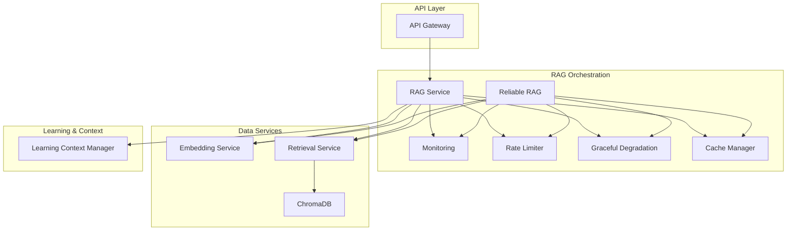

**Diagram sources**
- [services/api-gateway/main.py:192-238](file://services/api-gateway/main.py#L192-L238)
- [services/rag-service/main.py:93-199](file://services/rag-service/main.py#L93-L199)
- [services/embedding-service/main.py:99-154](file://services/embedding-service/main.py#L99-L154)
- [services/retrieval-service/main.py:207-250](file://services/retrieval-service/main.py#L207-L250)
- [reliability/integrated_rag.py:207-273](file://reliability/integrated_rag.py#L207-L273)
- [reliability/cache_manager.py:76-191](file://reliability/cache_manager.py#L76-L191)
- [reliability/monitoring.py:261-328](file://reliability/monitoring.py#L261-L328)
- [reliability/graceful_degradation.py:158-208](file://reliability/graceful_degradation.py#L158-L208)
- [reliability/rate_limiter.py:183-271](file://reliability/rate_limiter.py#L183-L271)
- [educational_engine/learning_context_manager.py:23-83](file://educational_engine/learning_context_manager.py#L23-L83)

**Section sources**
- [services/api-gateway/main.py:192-238](file://services/api-gateway/main.py#L192-L238)
- [services/rag-service/main.py:93-199](file://services/rag-service/main.py#L93-L199)
- [services/embedding-service/main.py:99-154](file://services/embedding-service/main.py#L99-L154)
- [services/retrieval-service/main.py:207-250](file://services/retrieval-service/main.py#L207-L250)
- [reliability/integrated_rag.py:207-273](file://reliability/integrated_rag.py#L207-L273)
- [reliability/cache_manager.py:76-191](file://reliability/cache_manager.py#L76-L191)
- [reliability/monitoring.py:261-328](file://reliability/monitoring.py#L261-L328)
- [reliability/graceful_degradation.py:158-208](file://reliability/graceful_degradation.py#L158-L208)
- [reliability/rate_limiter.py:183-271](file://reliability/rate_limiter.py#L183-L271)
- [educational_engine/learning_context_manager.py:23-83](file://educational_engine/learning_context_manager.py#L23-L83)

## Core Components
- API Gateway: Routes requests, enforces rate limits, authenticates via external service, and exposes Prometheus metrics.
- RAG Service: Orchestrates the end-to-end pipeline with caching, async processing, and optional translation.
- Embedding Service: Generates embeddings with batching, GPU acceleration, and Redis caching.
- Retrieval Service: Provides vector search, BM25 search, and hybrid fusion with ChromaDB persistence.
- Reliability Suite: Includes cache manager, monitoring, graceful degradation, rate limiting, and API key rotation.
- Advanced RAG Pipeline: Integrates ingestion, retrieval, reranking, generation, memory, and evaluation.
- Learning Context Manager: Tracks user learning state and personalizes responses.

**Section sources**
- [services/api-gateway/main.py:95-121](file://services/api-gateway/main.py#L95-L121)
- [services/rag-service/main.py:93-199](file://services/rag-service/main.py#L93-L199)
- [services/embedding-service/main.py:99-154](file://services/embedding-service/main.py#L99-L154)
- [services/retrieval-service/main.py:207-250](file://services/retrieval-service/main.py#L207-L250)
- [reliability/cache_manager.py:76-191](file://reliability/cache_manager.py#L76-L191)
- [reliability/monitoring.py:261-328](file://reliability/monitoring.py#L261-L328)
- [reliability/graceful_degradation.py:158-208](file://reliability/graceful_degradation.py#L158-L208)
- [reliability/rate_limiter.py:183-271](file://reliability/rate_limiter.py#L183-L271)
- [advanced_rag/pipeline/integrated_rag.py:14-131](file://advanced_rag/pipeline/integrated_rag.py#L14-L131)
- [educational_engine/learning_context_manager.py:41-83](file://educational_engine/learning_context_manager.py#L41-L83)

## Architecture Overview
The RAG pipeline follows a modular, service-oriented design:
- API Gateway receives client requests and proxies them to the RAG Service.
- RAG Service performs language detection/translation, orchestrates retrieval and reranking, invokes the LLM for generation, and caches results.
- Retrieval Service supports vector search (ChromaDB), BM25 indexing, and hybrid fusion with Reciprocal Rank Fusion (RRF).
- Embedding Service generates and caches embeddings with batching and GPU acceleration.
- Reliability features ensure robustness, observability, and graceful degradation.

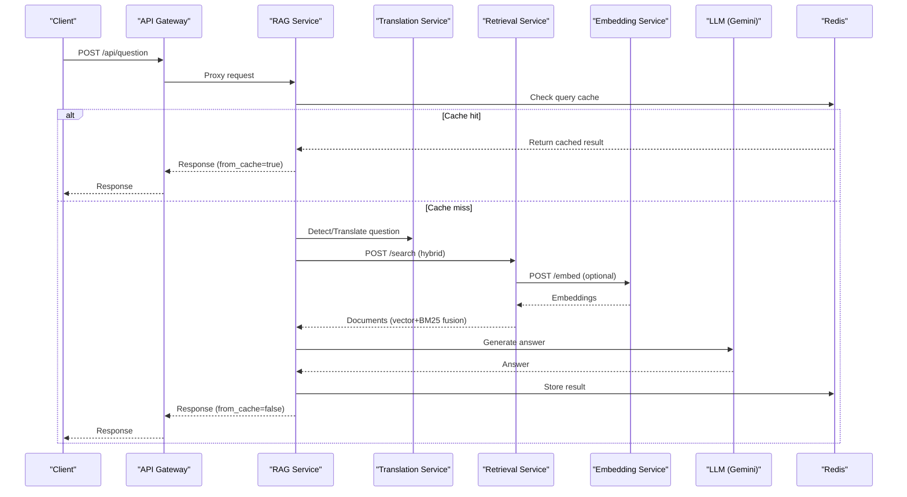

**Diagram sources**
- [services/api-gateway/main.py:192-238](file://services/api-gateway/main.py#L192-L238)
- [services/rag-service/main.py:93-199](file://services/rag-service/main.py#L93-L199)
- [services/retrieval-service/main.py:207-250](file://services/retrieval-service/main.py#L207-L250)
- [services/embedding-service/main.py:99-154](file://services/embedding-service/main.py#L99-L154)

## Detailed Component Analysis

### API Gateway
- Responsibilities: CORS, rate limiting, authentication via external service, health checks, Prometheus metrics exposure, and proxy routing to RAG Service.
- Observability: Records request counts and durations via Prometheus metrics.

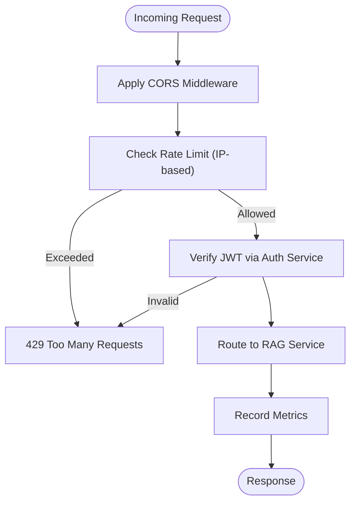

**Diagram sources**
- [services/api-gateway/main.py:69-121](file://services/api-gateway/main.py#L69-L121)
- [services/api-gateway/main.py:192-238](file://services/api-gateway/main.py#L192-L238)

**Section sources**
- [services/api-gateway/main.py:69-121](file://services/api-gateway/main.py#L69-L121)
- [services/api-gateway/main.py:192-238](file://services/api-gateway/main.py#L192-L238)

### RAG Service
- Responsibilities: End-to-end orchestration, caching, async processing, optional translation, and quiz generation via Celery.
- Data Flow: Query preprocessing → language detection/translation → hybrid retrieval → reranking → LLM generation → translation back → caching → response.

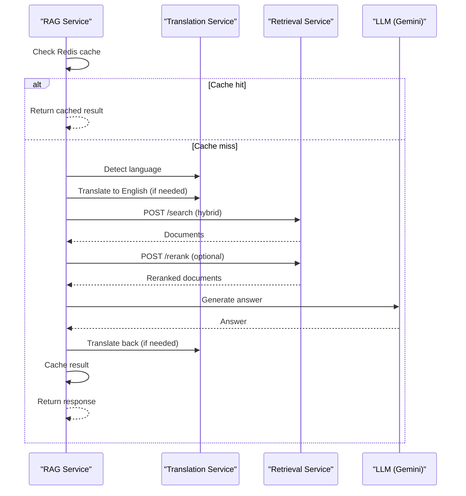

**Diagram sources**
- [services/rag-service/main.py:93-199](file://services/rag-service/main.py#L93-L199)

**Section sources**
- [services/rag-service/main.py:93-199](file://services/rag-service/main.py#L93-L199)

### Embedding Service
- Responsibilities: Generate embeddings with batching, GPU acceleration, and Redis caching; supports single and batch endpoints.
- Performance: Batch processing reduces overhead; TTL-based caching minimizes recomputation.

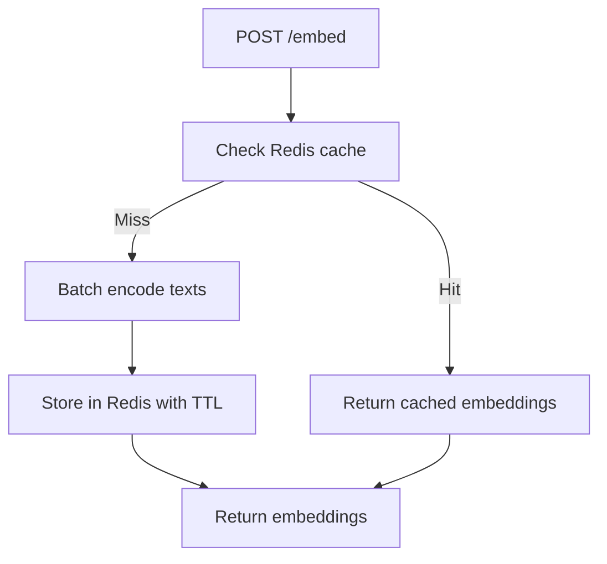

**Diagram sources**
- [services/embedding-service/main.py:99-154](file://services/embedding-service/main.py#L99-L154)

**Section sources**
- [services/embedding-service/main.py:99-154](file://services/embedding-service/main.py#L99-L154)

### Retrieval Service (Hybrid + ChromaDB)
- Responsibilities: Vector search using ChromaDB, BM25 keyword search, hybrid fusion via RRF, and Redis caching.
- Infrastructure: Persistent ChromaDB collection; optional BM25 index persisted separately.

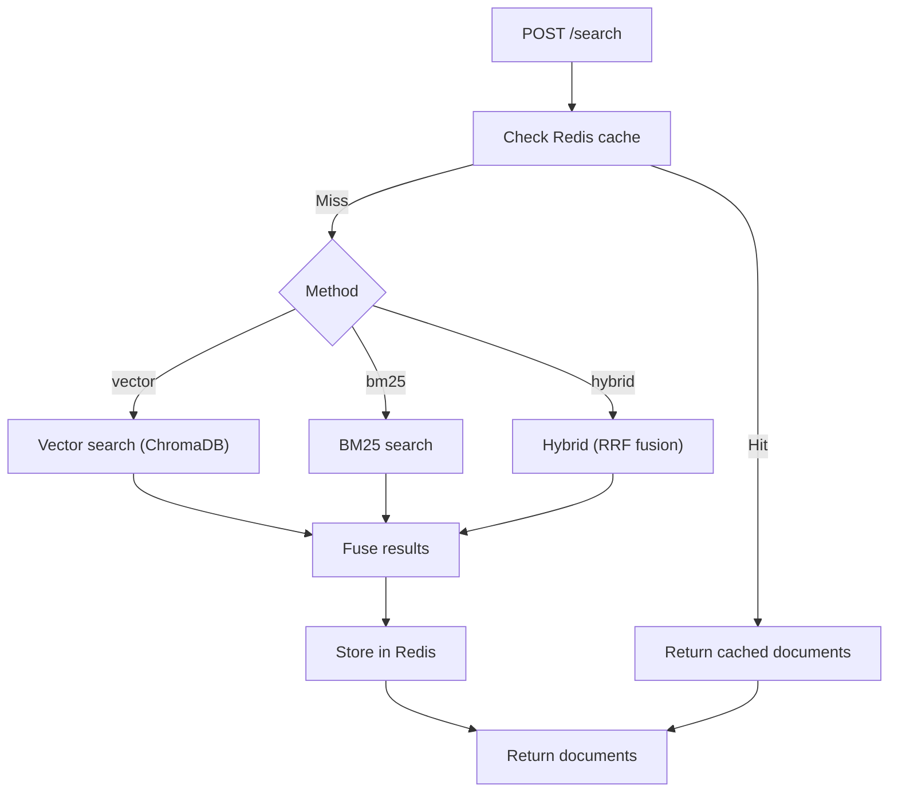

**Diagram sources**
- [services/retrieval-service/main.py:207-250](file://services/retrieval-service/main.py#L207-L250)

**Section sources**
- [services/retrieval-service/main.py:207-250](file://services/retrieval-service/main.py#L207-L250)

### Advanced RAG Pipeline (Integrated)
- Responsibilities: Full pipeline with ingestion, retrieval, reranking, generation, memory, and evaluation.
- Retrieval: Query rewriting, expansion, contextual compression, and deduplication; hybrid retrieval with RRF-style fusion.
- Generation: Context filtering, hallucination detection, citation grounding, and answer validation.
- Memory: Conversation memory and feedback learning.

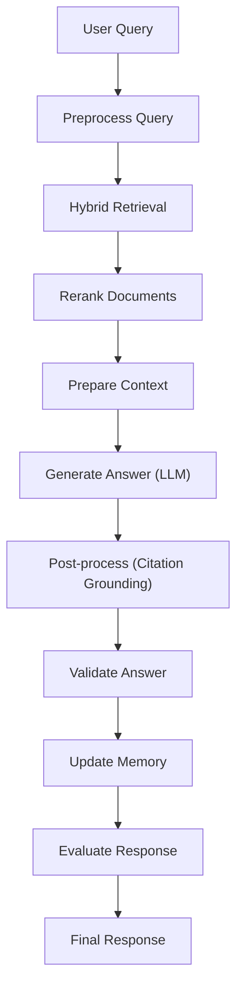

**Diagram sources**
- [advanced_rag/pipeline/integrated_rag.py:133-240](file://advanced_rag/pipeline/integrated_rag.py#L133-L240)

**Section sources**
- [advanced_rag/pipeline/integrated_rag.py:133-240](file://advanced_rag/pipeline/integrated_rag.py#L133-L240)

### Advanced Retrieval Components
- Query Expansion/Rewrite: Enhance recall and clarity using LLMs and heuristics.
- Contextual Compression: Reduce context size while preserving relevance.
- Self-Query Parsing: Convert NLQ to structured filters for metadata-aware retrieval.
- Hybrid Retrieval: Combine vector and BM25 with deduplication and ranking.

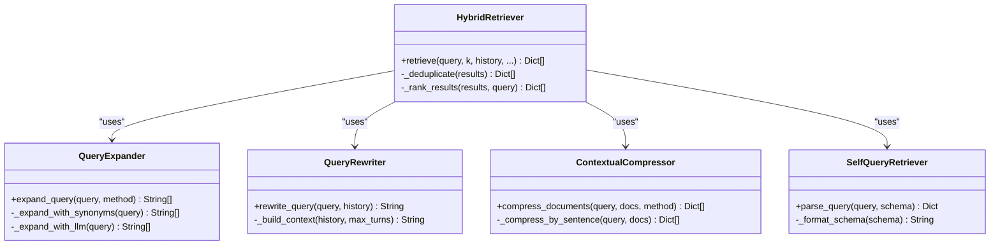

**Diagram sources**
- [advanced_rag/retrieval/advanced_retriever.py:12-471](file://advanced_rag/retrieval/advanced_retriever.py#L12-L471)

**Section sources**
- [advanced_rag/retrieval/advanced_retriever.py:12-471](file://advanced_rag/retrieval/advanced_retriever.py#L12-L471)

### Ingestion and Semantic Chunking
- AdvancedSemanticChunker: Sentence-level splitting, similarity-based grouping, metadata enrichment, overlap handling.
- DuplicateDetector: Detect and merge near-duplicate chunks.
- HierarchicalChunker: Preserve document hierarchy during chunking.

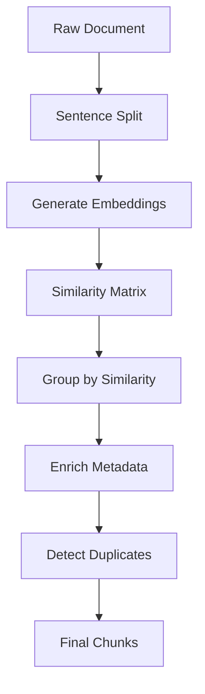

**Diagram sources**
- [advanced_rag/ingestion/semantic_chunker.py:35-152](file://advanced_rag/ingestion/semantic_chunker.py#L35-L152)

**Section sources**
- [advanced_rag/ingestion/semantic_chunker.py:35-152](file://advanced_rag/ingestion/semantic_chunker.py#L35-L152)

### Reliability Suite
- Cache Manager: Multi-layer cache (in-memory + Redis), TTL management, specialized caches for embeddings and responses.
- Monitoring: Request tracing, performance metrics, error tracking, alerting thresholds.
- Graceful Degradation: Fallback responses, partial results, circuit breakers, progressive timeouts.
- Rate Limiter: Token bucket, sliding window, circuit breaker, quota monitoring.

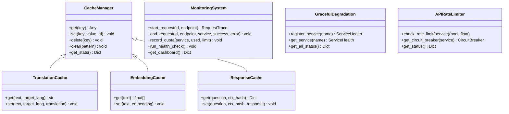

**Diagram sources**
- [reliability/cache_manager.py:76-328](file://reliability/cache_manager.py#L76-L328)
- [reliability/monitoring.py:261-372](file://reliability/monitoring.py#L261-L372)
- [reliability/graceful_degradation.py:74-208](file://reliability/graceful_degradation.py#L74-L208)
- [reliability/rate_limiter.py:183-323](file://reliability/rate_limiter.py#L183-L323)

**Section sources**
- [reliability/cache_manager.py:76-328](file://reliability/cache_manager.py#L76-L328)
- [reliability/monitoring.py:261-372](file://reliability/monitoring.py#L261-L372)
- [reliability/graceful_degradation.py:74-208](file://reliability/graceful_degradation.py#L74-L208)
- [reliability/rate_limiter.py:183-323](file://reliability/rate_limiter.py#L183-L323)

### Educational Learning Context Management
- Tracks user learning profile, patterns, weak/strong areas, recommended difficulty, and personalization hints.
- Stores and retrieves data from MongoDB collections with indexes for performance.

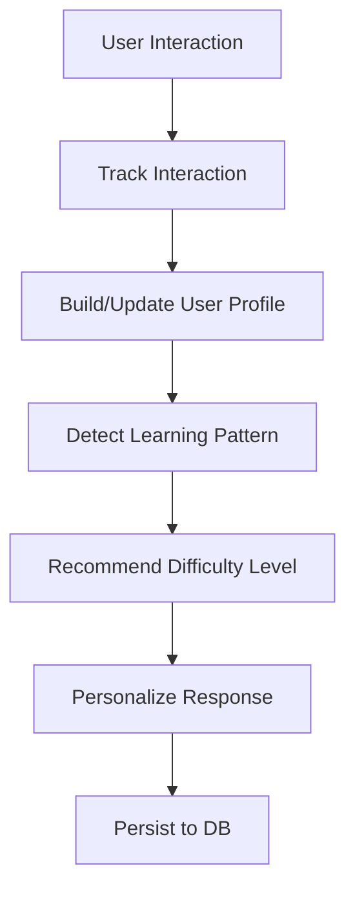

**Diagram sources**
- [educational_engine/learning_context_manager.py:85-177](file://educational_engine/learning_context_manager.py#L85-L177)

**Section sources**
- [educational_engine/learning_context_manager.py:85-177](file://educational_engine/learning_context_manager.py#L85-L177)

## Dependency Analysis
The system exhibits loose coupling among services with explicit dependencies:
- API Gateway depends on RAG Service endpoints.
- RAG Service depends on Embedding Service, Retrieval Service, and Translation Service.
- Retrieval Service depends on ChromaDB and optionally BM25 index.
- Reliability components are injected into RAG Service and Reliable RAG.

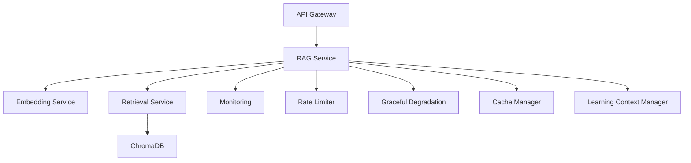

**Diagram sources**
- [services/api-gateway/main.py:192-238](file://services/api-gateway/main.py#L192-L238)
- [services/rag-service/main.py:93-199](file://services/rag-service/main.py#L93-L199)
- [services/retrieval-service/main.py:207-250](file://services/retrieval-service/main.py#L207-L250)
- [reliability/monitoring.py:261-328](file://reliability/monitoring.py#L261-L328)
- [reliability/rate_limiter.py:183-271](file://reliability/rate_limiter.py#L183-L271)
- [reliability/graceful_degradation.py:158-208](file://reliability/graceful_degradation.py#L158-L208)
- [reliability/cache_manager.py:76-191](file://reliability/cache_manager.py#L76-L191)
- [educational_engine/learning_context_manager.py:23-83](file://educational_engine/learning_context_manager.py#L23-L83)

**Section sources**
- [services/api-gateway/main.py:192-238](file://services/api-gateway/main.py#L192-L238)
- [services/rag-service/main.py:93-199](file://services/rag-service/main.py#L93-L199)
- [services/retrieval-service/main.py:207-250](file://services/retrieval-service/main.py#L207-L250)
- [reliability/monitoring.py:261-328](file://reliability/monitoring.py#L261-L328)
- [reliability/rate_limiter.py:183-271](file://reliability/rate_limiter.py#L183-L271)
- [reliability/graceful_degradation.py:158-208](file://reliability/graceful_degradation.py#L158-L208)
- [reliability/cache_manager.py:76-191](file://reliability/cache_manager.py#L76-L191)
- [educational_engine/learning_context_manager.py:23-83](file://educational_engine/learning_context_manager.py#L23-L83)

## Performance Considerations
- Embedding Generation
  - Batch processing reduces latency and improves throughput.
  - GPU acceleration enabled when available.
  - Embedding caching with extended TTL reduces repeated computation.
- Retrieval
  - Hybrid fusion with RRF balances lexical and semantic matching.
  - BM25 index and ChromaDB vector index improve recall and speed.
  - Retrieval caching with moderate TTL prevents hot-path thrashing.
- Generation
  - Context filtering and compression reduce token usage and cost.
  - Citation grounding ensures verifiable answers.
- Caching
  - Multi-layer cache (in-memory + Redis) with TTL controls.
  - Specialized caches for embeddings and responses.
- Concurrency
  - Async processing in RAG Service and Retrieval Service.
  - Celery for long-running tasks (e.g., quiz generation).
- Reliability
  - Circuit breakers prevent cascading failures.
  - Graceful degradation provides fallback responses.
  - Rate limiting protects upstream services.

[No sources needed since this section provides general guidance]

## Troubleshooting Guide
- Health Checks
  - API Gateway health endpoint checks Redis and downstream services.
  - Retrieval Service health reports ChromaDB and BM25 document counts.
- Monitoring
  - Use Prometheus metrics for request volume, latency, and error rates.
  - Dashboard aggregates recent traces, slow requests, and active alerts.
- Graceful Degradation
  - Fallback responses are returned when primary functions fail.
  - Progressive timeouts and partial result gathering improve resilience.
- Rate Limiting
  - Excessive requests trigger rate-limit exceptions; circuit breakers protect upstream.
- Cache Issues
  - Redis connectivity failures fall back to in-memory cache.
  - Clear cache keys or patterns to resolve stale data.

**Section sources**
- [services/api-gateway/main.py:156-181](file://services/api-gateway/main.py#L156-L181)
- [services/retrieval-service/main.py:197-205](file://services/retrieval-service/main.py#L197-L205)
- [reliability/monitoring.py:299-328](file://reliability/monitoring.py#L299-L328)
- [reliability/graceful_degradation.py:158-208](file://reliability/graceful_degradation.py#L158-L208)
- [reliability/rate_limiter.py:183-271](file://reliability/rate_limiter.py#L183-L271)
- [reliability/cache_manager.py:162-173](file://reliability/cache_manager.py#L162-L173)

## Conclusion
The RAG pipeline integration leverages a robust microservices architecture with clear separation of concerns. The API Gateway provides secure and observable ingress, the RAG Service orchestrates retrieval and generation with caching and translation, and the Retrieval and Embedding Services deliver scalable vector and keyword search. The reliability suite ensures graceful operation under stress, while the advanced RAG pipeline and learning context manager enhance accuracy and personalization. Together, these components form a production-ready system capable of handling concurrent queries, managing memory efficiently, and scaling horizontally.