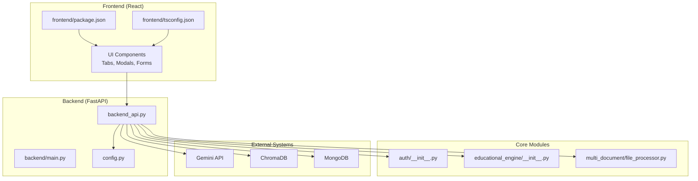
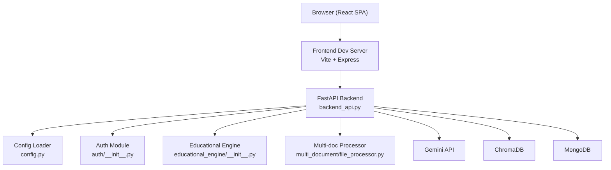
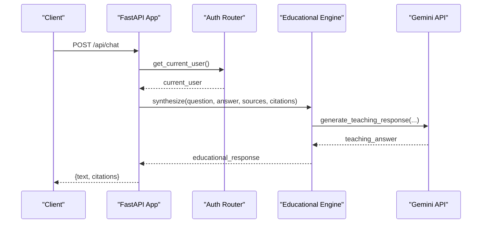
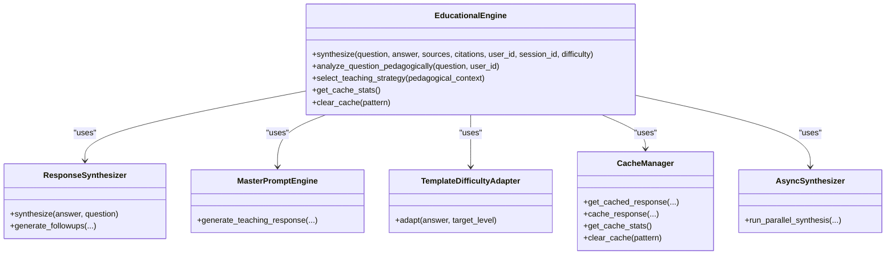
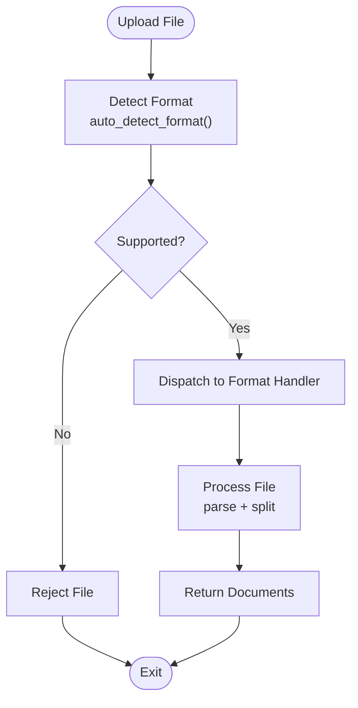
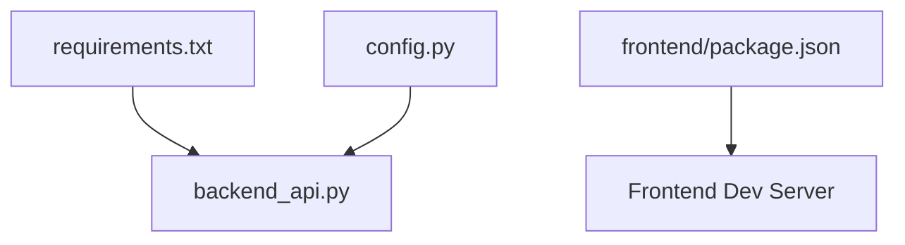

# Contributing & Development

<cite>
**Referenced Files in This Document**
- [README.md](file://README.md)
- [requirements.txt](file://requirements.txt)
- [config.py](file://config.py)
- [backend_api.py](file://backend_api.py)
- [backend/main.py](file://backend/main.py)
- [pytest.ini](file://pytest.ini)
- [run_tests.py](file://run_tests.py)
- [START_FULLSTACK.bat](file://START_FULLSTACK.bat)
- [frontend/package.json](file://frontend/package.json)
- [frontend/tsconfig.json](file://frontend/tsconfig.json)
- [docs/current_rag_architecture.md](file://docs/current_rag_architecture.md)
- [docs/giao_dien_he_thystem.md](file://docs/giao_dien_he_thystem.md)
- [educational_engine/__init__.py](file://educational_engine/__init__.py)
- [auth/__init__.py](file://auth/__init__.py)
- [multi_document/file_processor.py](file://multi_document/file_processor.py)
</cite>

## Table of Contents
1. [Introduction](#introduction)
2. [Project Structure](#project-structure)
3. [Core Components](#core-components)
4. [Architecture Overview](#architecture-overview)
5. [Detailed Component Analysis](#detailed-component-analysis)
6. [Dependency Analysis](#dependency-analysis)
7. [Performance Considerations](#performance-considerations)
8. [Troubleshooting Guide](#troubleshooting-guide)
9. [Contribution Workflow](#contribution-workflow)
10. [Development Environment Setup](#development-environment-setup)
11. [Testing Procedures](#testing-procedures)
12. [Deployment Processes](#deployment-processes)
13. [Extensibility Guidelines](#extensibility-guidelines)
14. [Best Practices](#best-practices)
15. [Conclusion](#conclusion)

## Introduction
This document provides comprehensive contributing and development guidance for MinerAI, a full-stack Retrieval-Augmented Generation (RAG) learning assistant. It covers development guidelines, code standards, branching strategies, code review processes, project structure, extension points, plugin architecture, contribution workflow, environment setup, testing, deployment, and best practices for extending the system with new features such as additional LLM providers, teaching strategies, or document formats.

## Project Structure
MinerAI follows a modular, layered structure:
- Backend: FastAPI application with centralized configuration and API endpoints
- Frontend: React SPA with TypeScript, Vite, and Tailwind CSS
- Educational Engine: Modular synthesis and pedagogical components
- Authentication and Chat History: JWT-based auth and session management
- Multi-document Processing: Extensible file processors for various formats
- Services: Microservice-style modules for specialized capabilities
- Tests: PyTest-based unit and integration suites with coverage reporting

**Diagram sources**
- [backend/main.py:1-69](file://backend/main.py#L1-L69)
- [backend_api.py:1-120](file://backend_api.py#L1-L120)
- [config.py:1-218](file://config.py#L1-L218)
- [auth/__init__.py:1-22](file://auth/__init__.py#L1-L22)
- [educational_engine/__init__.py:1-381](file://educational_engine/__init__.py#L1-L381)
- [multi_document/file_processor.py:52-359](file://multi_document/file_processor.py#L52-L359)
- [frontend/package.json:1-36](file://frontend/package.json#L1-L36)
- [frontend/tsconfig.json:1-26](file://frontend/tsconfig.json#L1-L26)

**Section sources**
- [README.md:114-141](file://README.md#L114-L141)
- [backend/main.py:1-69](file://backend/main.py#L1-L69)
- [backend_api.py:1-120](file://backend_api.py#L1-L120)
- [config.py:1-218](file://config.py#L1-L218)
- [educational_engine/__init__.py:1-381](file://educational_engine/__init__.py#L1-L381)
- [auth/__init__.py:1-22](file://auth/__init__.py#L1-L22)
- [multi_document/file_processor.py:52-359](file://multi_document/file_processor.py#L52-L359)
- [frontend/package.json:1-36](file://frontend/package.json#L1-L36)
- [frontend/tsconfig.json:1-26](file://frontend/tsconfig.json#L1-L26)

## Core Components
- Centralized Configuration: Environment-driven settings, paths, model parameters, caching, logging, and rate limiting
- Backend API: FastAPI application exposing chat, QA, summaries, quizzes, comparisons, and multi-document features
- Educational Engine: Modular synthesis, difficulty adaptation, caching, async orchestration, and pedagogical reasoning
- Authentication and Chat History: JWT-based routes, user sessions, and conversation persistence
- Multi-document Processing: Extensible file processors supporting PDF, DOCX, PPTX, TXT, and CSV
- Frontend SPA: React components, routing, theming, and integration with backend APIs

Key responsibilities:
- Configuration management and validation
- API lifecycle (startup/shutdown), CORS, and route registration
- Educational synthesis and adaptive delivery
- Secure user interactions and session tracking
- Robust document ingestion and chunking

**Section sources**
- [config.py:138-163](file://config.py#L138-L163)
- [backend_api.py:255-332](file://backend_api.py#L255-L332)
- [educational_engine/__init__.py:52-266](file://educational_engine/__init__.py#L52-L266)
- [auth/__init__.py:11-21](file://auth/__init__.py#L11-L21)
- [multi_document/file_processor.py:52-90](file://multi_document/file_processor.py#L52-L90)

## Architecture Overview
MinerAI integrates a frontend SPA with a FastAPI backend. The backend orchestrates RAG pipelines, educational synthesis, and user services, while the frontend renders interactive UIs and manages user sessions.

**Diagram sources**
- [backend_api.py:63-120](file://backend_api.py#L63-L120)
- [config.py:1-218](file://config.py#L1-L218)
- [auth/__init__.py:11-21](file://auth/__init__.py#L11-L21)
- [educational_engine/__init__.py:52-266](file://educational_engine/__init__.py#L52-L266)
- [multi_document/file_processor.py:52-90](file://multi_document/file_processor.py#L52-L90)

**Section sources**
- [docs/current_rag_architecture.md:1-114](file://docs/current_rag_architecture.md#L1-L114)
- [docs/giao_dien_he_thystem.md:1-236](file://docs/giao_dien_he_thystem.md#L1-L236)
- [backend_api.py:63-120](file://backend_api.py#L63-L120)

## Detailed Component Analysis

### Backend API and Lifecycle
The backend initializes FastAPI, registers routers, sets up CORS, and manages startup/shutdown events. It exposes endpoints for chat, QA, summaries, quizzes, comparisons, and multi-document queries.

**Diagram sources**
- [backend_api.py:514-582](file://backend_api.py#L514-L582)
- [educational_engine/__init__.py:81-266](file://educational_engine/__init__.py#L81-L266)

**Section sources**
- [backend_api.py:255-332](file://backend_api.py#L255-L332)
- [backend_api.py:514-582](file://backend_api.py#L514-L582)
- [educational_engine/__init__.py:52-266](file://educational_engine/__init__.py#L52-L266)

### Educational Engine Orchestration
The Educational Engine coordinates synthesis, visual generation, optimization, difficulty adaptation, and caching. It supports async execution and pedagogical reasoning without LLM calls.

**Diagram sources**
- [educational_engine/__init__.py:52-381](file://educational_engine/__init__.py#L52-L381)

**Section sources**
- [educational_engine/__init__.py:52-381](file://educational_engine/__init__.py#L52-L381)

### Multi-Document File Processing
The file processor supports auto-format detection and handlers for PDF, DOCX, PPTX, TXT, and CSV. It validates formats and returns structured documents for ingestion.

**Diagram sources**
- [multi_document/file_processor.py:52-90](file://multi_document/file_processor.py#L52-L90)
- [multi_document/file_processor.py:338-351](file://multi_document/file_processor.py#L338-L351)

**Section sources**
- [multi_document/file_processor.py:52-90](file://multi_document/file_processor.py#L52-L90)
- [multi_document/file_processor.py:338-351](file://multi_document/file_processor.py#L338-L351)

### Frontend SPA Integration
The frontend is configured with Vite and TypeScript, enabling modern development workflows. It integrates with backend APIs for authentication, chat, document upload, and quiz systems.

**Diagram sources**
- [frontend/tsconfig.json:1-26](file://frontend/tsconfig.json#L1-L26)
- [frontend/package.json:1-36](file://frontend/package.json#L1-L36)

**Section sources**
- [frontend/tsconfig.json:1-26](file://frontend/tsconfig.json#L1-L26)
- [frontend/package.json:1-36](file://frontend/package.json#L1-L36)

## Dependency Analysis
- Backend dependencies include FastAPI, Uvicorn, Pydantic, LangChain, ChromaDB, Gemini SDK, and optional MongoDB and Redis for caching
- Frontend dependencies include React, Vite, Tailwind, and Express for development server
- Tests leverage PyTest with markers for unit, integration, and coverage thresholds

**Diagram sources**
- [requirements.txt:1-43](file://requirements.txt#L1-L43)
- [backend_api.py:1-120](file://backend_api.py#L1-L120)
- [config.py:1-218](file://config.py#L1-L218)
- [frontend/package.json:1-36](file://frontend/package.json#L1-L36)

**Section sources**
- [requirements.txt:1-43](file://requirements.txt#L1-L43)
- [backend_api.py:1-120](file://backend_api.py#L1-L120)
- [config.py:1-218](file://config.py#L1-L218)
- [frontend/package.json:1-36](file://frontend/package.json#L1-L36)

## Performance Considerations
- Asynchronous execution and thread pooling prevent blocking the event loop during heavy operations
- Caching layers for embeddings, BM25 indices, and vector stores reduce latency
- Streaming responses improve perceived performance for long-running tasks
- Rate limiting and retries mitigate external API constraints

Recommendations:
- Monitor response times and adjust batch sizes and concurrency limits
- Use Redis for distributed caching in production deployments
- Implement circuit breakers for external LLM calls

**Section sources**
- [config.py:99-111](file://config.py#L99-L111)
- [backend_api.py:313-327](file://backend_api.py#L313-L327)

## Troubleshooting Guide
Common issues and resolutions:
- Backend not starting: Verify port availability and environment variables; check logs and restart
- Frontend not connecting: Confirm backend health endpoint and CORS configuration
- Rate limit exceeded: Implement backoff and retry strategies; consider API key rotation
- Vector store loading delays: Pre-warm LLM instances and optimize chunk sizes

**Section sources**
- [README.md:275-298](file://README.md#L275-L298)
- [backend_api.py:408-425](file://backend_api.py#L408-L425)

## Contribution Workflow
Follow these steps to contribute:
1. Fork the repository
2. Create a feature branch (use descriptive names)
3. Commit changes with clear, concise messages
4. Push to your branch
5. Open a Pull Request with a detailed description and acceptance criteria

Branching strategy:
- Develop features on topic branches
- Keep main stable and deployable
- Rebase feature branches onto main before merging

Code review process:
- Request reviewers based on component ownership
- Address feedback promptly and update PR accordingly
- Ensure tests pass and coverage remains acceptable

**Section sources**
- [README.md:351-358](file://README.md#L351-L358)

## Development Environment Setup
Prerequisites:
- Python 3.10+, Node.js, npm
- Optional: MongoDB, Redis, Docker

Steps:
1. Clone the repository
2. Install Python dependencies
3. Install frontend dependencies
4. Configure environment variables (.env)
5. Start backend and frontend using provided scripts

Verification:
- Backend health endpoint should return healthy status
- Frontend should render without console errors
- Tests should pass with coverage thresholds met

**Section sources**
- [README.md:30-76](file://README.md#L30-L76)
- [START_FULLSTACK.bat:1-30](file://START_FULLSTACK.bat#L1-L30)

## Testing Procedures
Testing framework:
- PyTest with strict markers and coverage reporting
- Separate unit and integration test suites
- Custom test runner aggregates results and generates coverage reports

Execution:
- Run individual test groups or the comprehensive suite
- Use markers to filter tests by category
- Review coverage reports and address missing coverage

**Section sources**
- [pytest.ini:1-48](file://pytest.ini#L1-L48)
- [run_tests.py:1-105](file://run_tests.py#L1-L105)

## Deployment Processes
Backend (Docker):
- Use the provided Dockerfile to containerize the FastAPI service
- Expose port 8000 and mount volumes for persistent data if needed

Frontend:
- Build the React app using Vite
- Deploy the static build to a CDN or hosting platform

CI/CD:
- Automate linting, testing, and building
- Publish containers and artifacts on successful merges

**Section sources**
- [README.md:306-327](file://README.md#L306-L327)

## Extensibility Guidelines
Extend MinerAI by adding:
- New LLM providers: Implement provider-specific adapters and integrate via configuration
- Teaching strategies: Add pedagogical analyzers and strategy selectors in the educational engine
- Document formats: Extend the file processor with new format handlers and validators
- Plugins: Encapsulate functionality behind well-defined interfaces and register them in central modules

Guidelines:
- Maintain backward compatibility where possible
- Add configuration options for new features
- Provide clear error handling and logging
- Include tests for new functionality

**Section sources**
- [educational_engine/__init__.py:290-344](file://educational_engine/__init__.py#L290-L344)
- [multi_document/file_processor.py:52-90](file://multi_document/file_processor.py#L52-L90)
- [config.py:179-217](file://config.py#L179-L217)

## Best Practices
- Naming conventions: Use descriptive names for modules, functions, and variables; maintain consistent casing
- Code organization: Group related functionality into cohesive modules; avoid monolithic files
- Error handling: Centralize error handling and logging; provide meaningful error messages
- Security: Enforce authentication and authorization; sanitize inputs; rotate API keys
- Documentation: Keep README and inline comments up to date; document configuration options
- Performance: Prefer async patterns; leverage caching; monitor resource usage

**Section sources**
- [config.py:138-163](file://config.py#L138-L163)
- [backend_api.py:255-332](file://backend_api.py#L255-L332)

## Conclusion
This guide consolidates MinerAI’s development and contribution practices, architecture, and extension points. By following the outlined workflows, standards, and best practices, contributors can efficiently add new features, maintain system stability, and deliver high-quality enhancements aligned with the project’s educational goals.