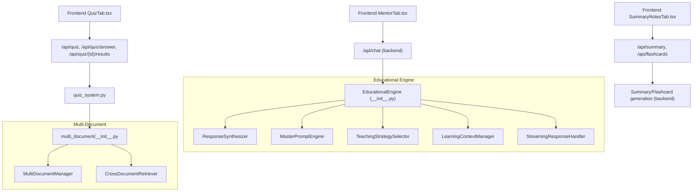
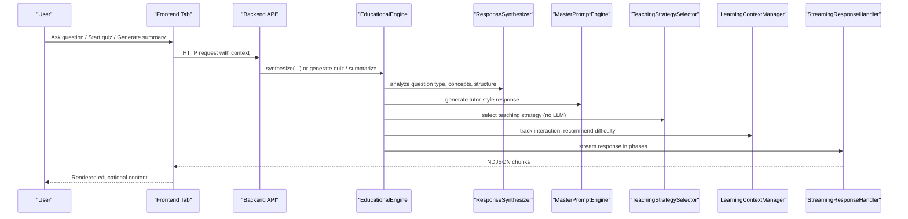
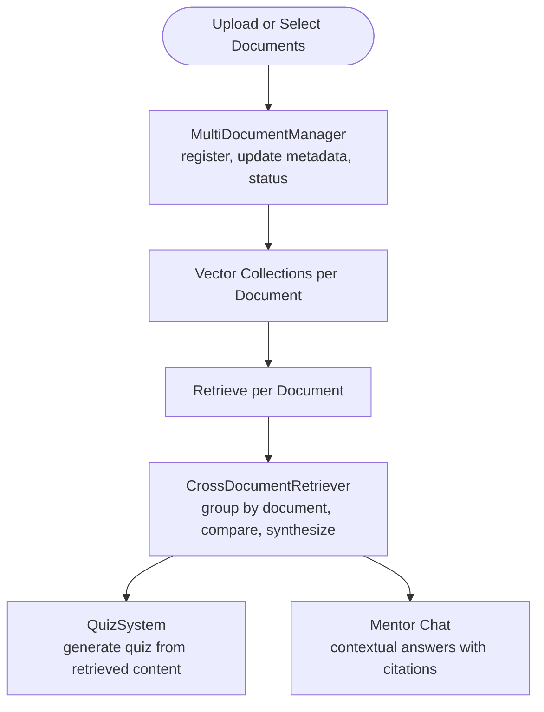
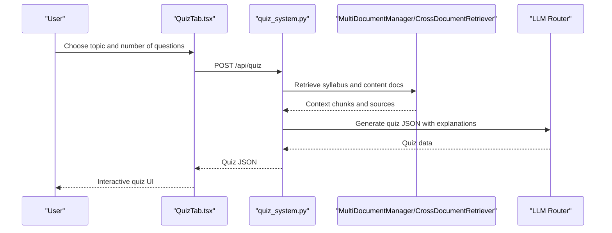
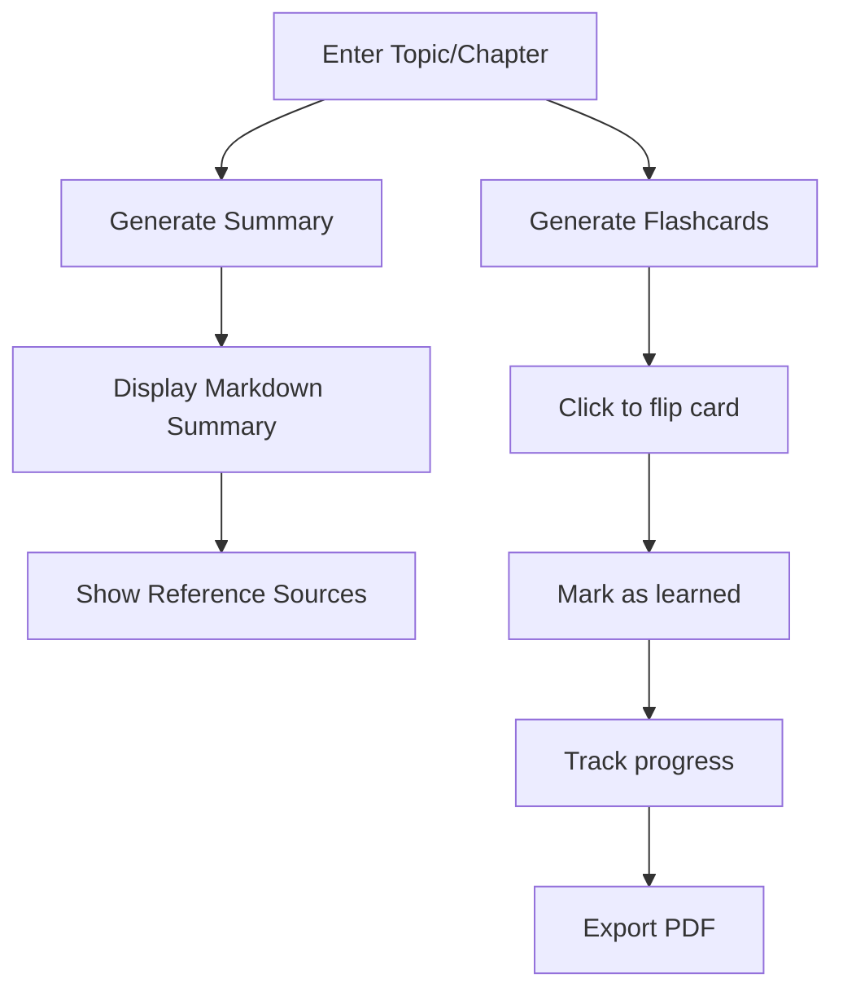
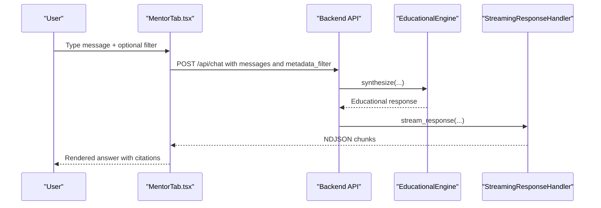
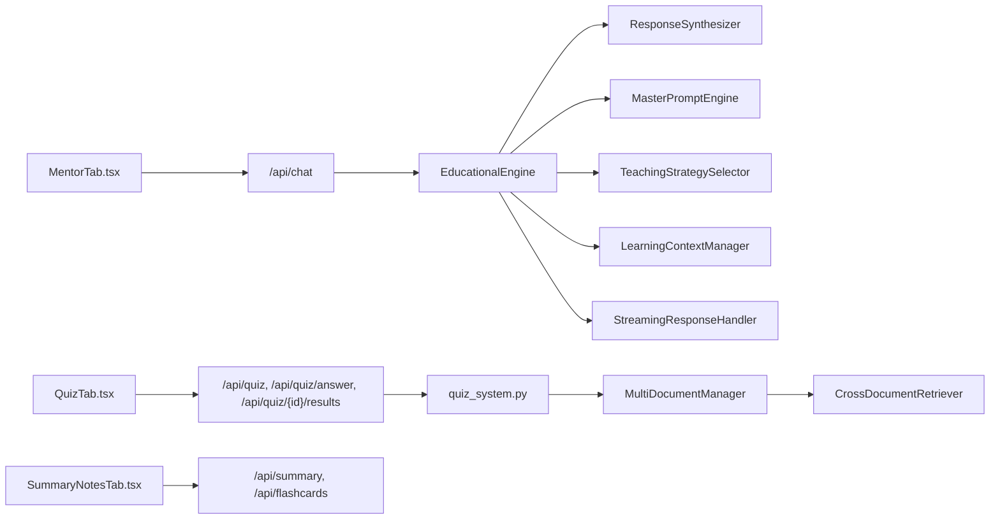

# Core Features

<cite>
**Referenced Files in This Document**
- [educational_engine/__init__.py](file://educational_engine/__init__.py)
- [educational_engine/response_synthesizer.py](file://educational_engine/response_synthesizer.py)
- [educational_engine/master_prompt_engine.py](file://educational_engine/master_prompt_engine.py)
- [educational_engine/teaching_strategy_selector.py](file://educational_engine/teaching_strategy_selector.py)
- [educational_engine/learning_context_manager.py](file://educational_engine/learning_context_manager.py)
- [educational_engine/streaming_handler.py](file://educational_engine/streaming_handler.py)
- [multi_document/__init__.py](file://multi_document/__init__.py)
- [multi_document/document_manager.py](file://multi_document/document_manager.py)
- [multi_document/cross_document.py](file://multi_document/cross_document.py)
- [quiz_generator.py](file://quiz_generator.py)
- [quiz_system.py](file://quiz_system.py)
- [frontend/src/components/MentorTab.tsx](file://frontend/src/components/MentorTab.tsx)
- [frontend/src/components/QuizTab.tsx](file://frontend/src/components/QuizTab.tsx)
- [frontend/src/components/SummaryNotesTab.tsx](file://frontend/src/components/SummaryNotesTab.tsx)
</cite>

## Table of Contents
1. [Introduction](#introduction)
2. [Project Structure](#project-structure)
3. [Core Components](#core-components)
4. [Architecture Overview](#architecture-overview)
5. [Detailed Component Analysis](#detailed-component-analysis)
6. [Dependency Analysis](#dependency-analysis)
7. [Performance Considerations](#performance-considerations)
8. [Troubleshooting Guide](#troubleshooting-guide)
9. [Conclusion](#conclusion)

## Introduction
This document explains MinerAI’s core educational features: an intelligent Q&A system with context-aware responses and citations, multi-document processing, interactive quiz generation, and summarization. It also covers the educational AI engine’s adaptive learning approach, teaching strategy selection, and personalized content delivery. The goal is to help both technical and non-technical readers understand how the system works, how to use it effectively, and how the components integrate.

## Project Structure
MinerAI organizes its educational capabilities across several focused modules:
- Educational engine: orchestrates synthesis, pedagogical reasoning, difficulty adaptation, and streaming delivery
- Multi-document system: manages uploads, metadata, retrieval across multiple sources, and cross-document comparison
- Quiz system: generates interactive quizzes aligned with course content and evaluates answers
- Frontend tabs: provide user workflows for mentor chat, quiz practice, and summary/flashcard generation

**Diagram sources**
- [educational_engine/__init__.py:52-266](file://educational_engine/__init__.py#L52-L266)
- [educational_engine/response_synthesizer.py:22-257](file://educational_engine/response_synthesizer.py#L22-L257)
- [educational_engine/master_prompt_engine.py:49-435](file://educational_engine/master_prompt_engine.py#L49-L435)
- [educational_engine/teaching_strategy_selector.py:26-152](file://educational_engine/teaching_strategy_selector.py#L26-L152)
- [educational_engine/learning_context_manager.py:23-114](file://educational_engine/learning_context_manager.py#L23-L114)
- [educational_engine/streaming_handler.py:23-123](file://educational_engine/streaming_handler.py#L23-L123)
- [multi_document/__init__.py:1-34](file://multi_document/__init__.py#L1-L34)
- [multi_document/document_manager.py:21-110](file://multi_document/document_manager.py#L21-L110)
- [multi_document/cross_document.py:51-137](file://multi_document/cross_document.py#L51-L137)
- [quiz_system.py:52-232](file://quiz_system.py#L52-L232)
- [frontend/src/components/MentorTab.tsx:49-128](file://frontend/src/components/MentorTab.tsx#L49-L128)
- [frontend/src/components/QuizTab.tsx:201-252](file://frontend/src/components/QuizTab.tsx#L201-L252)
- [frontend/src/components/SummaryNotesTab.tsx:36-94](file://frontend/src/components/SummaryNotesTab.tsx#L36-L94)

**Section sources**
- [educational_engine/__init__.py:1-381](file://educational_engine/__init__.py#L1-L381)
- [multi_document/__init__.py:1-34](file://multi_document/__init__.py#L1-L34)
- [quiz_generator.py:57-155](file://quiz_generator.py#L57-L155)
- [quiz_system.py:52-232](file://quiz_system.py#L52-L232)
- [frontend/src/components/MentorTab.tsx:1-411](file://frontend/src/components/MentorTab.tsx#L1-L411)
- [frontend/src/components/QuizTab.tsx:1-800](file://frontend/src/components/QuizTab.tsx#L1-L800)
- [frontend/src/components/SummaryNotesTab.tsx:1-414](file://frontend/src/components/SummaryNotesTab.tsx#L1-L414)

## Core Components
- EducationalEngine: central orchestrator that synthesizes answers into educational, context-aware responses with difficulty adaptation, visual aids, and streaming delivery
- ResponseSynthesizer: detects question type, extracts key concepts, structures answers, and generates simplified explanations and follow-ups
- MasterPromptEngine: produces tutor-like, seven-step teaching responses in a single LLM call
- TeachingStrategySelector: routes to optimal teaching strategies based on pedagogical context (no LLM)
- LearningContextManager: tracks user learning profiles, weak/strong areas, and recommends difficulty and next concepts
- StreamingResponseHandler: progressive rendering to reduce perceived latency
- MultiDocumentManager and CrossDocumentRetriever: manage documents, metadata, and retrieve across multiple sources
- QuizSystem: generates quizzes from course content and evaluates answers
- Frontend tabs: provide user workflows for mentor chat, quiz practice, and summary/flashcards

**Section sources**
- [educational_engine/__init__.py:52-266](file://educational_engine/__init__.py#L52-L266)
- [educational_engine/response_synthesizer.py:22-257](file://educational_engine/response_synthesizer.py#L22-L257)
- [educational_engine/master_prompt_engine.py:49-435](file://educational_engine/master_prompt_engine.py#L49-L435)
- [educational_engine/teaching_strategy_selector.py:26-152](file://educational_engine/teaching_strategy_selector.py#L26-L152)
- [educational_engine/learning_context_manager.py:23-114](file://educational_engine/learning_context_manager.py#L23-L114)
- [educational_engine/streaming_handler.py:23-123](file://educational_engine/streaming_handler.py#L23-L123)
- [multi_document/document_manager.py:21-110](file://multi_document/document_manager.py#L21-L110)
- [multi_document/cross_document.py:51-137](file://multi_document/cross_document.py#L51-L137)
- [quiz_system.py:52-232](file://quiz_system.py#L52-L232)
- [frontend/src/components/MentorTab.tsx:49-128](file://frontend/src/components/MentorTab.tsx#L49-L128)
- [frontend/src/components/QuizTab.tsx:201-252](file://frontend/src/components/QuizTab.tsx#L201-L252)
- [frontend/src/components/SummaryNotesTab.tsx:36-94](file://frontend/src/components/SummaryNotesTab.tsx#L36-L94)

## Architecture Overview
The system integrates frontend interactions with backend educational processing and multi-document retrieval. The mentor chat, quiz, and summary tabs trigger backend APIs that leverage the educational engine and multi-document modules.

**Diagram sources**
- [educational_engine/__init__.py:81-266](file://educational_engine/__init__.py#L81-L266)
- [educational_engine/response_synthesizer.py:225-257](file://educational_engine/response_synthesizer.py#L225-L257)
- [educational_engine/master_prompt_engine.py:412-435](file://educational_engine/master_prompt_engine.py#L412-L435)
- [educational_engine/teaching_strategy_selector.py:85-152](file://educational_engine/teaching_strategy_selector.py#L85-L152)
- [educational_engine/learning_context_manager.py:85-114](file://educational_engine/learning_context_manager.py#L85-L114)
- [educational_engine/streaming_handler.py:36-123](file://educational_engine/streaming_handler.py#L36-L123)
- [frontend/src/components/MentorTab.tsx:89-128](file://frontend/src/components/MentorTab.tsx#L89-L128)
- [frontend/src/components/QuizTab.tsx:225-252](file://frontend/src/components/QuizTab.tsx#L225-L252)
- [frontend/src/components/SummaryNotesTab.tsx:47-94](file://frontend/src/components/SummaryNotesTab.tsx#L47-L94)

## Detailed Component Analysis

### Intelligent Q&A System with Context-Aware Responses and Citations
- Question analysis: ResponseSynthesizer detects question type, extracts key concepts, and structures the answer
- Pedagogical synthesis: MasterPromptEngine creates a tutor-like, seven-step response in one LLM call
- Strategy selection: TeachingStrategySelector chooses the best approach based on question type, user level, and confusion risk (no LLM)
- Personalization: LearningContextManager builds user profiles, tracks interactions, and recommends difficulty and next concepts
- Streaming delivery: StreamingResponseHandler progressively renders answer, teaching elements, visuals, takeaways, and follow-ups

```mermaid
classDiagram
class EducationalEngine {
+synthesize(question, answer, sources, citations, user_id, session_id, difficulty_preference) dict
+analyze_question_pedagogically(question, user_id) dict
+select_teaching_strategy(pedagogical_context) dict
+get_cache_stats() dict
+clear_cache(pattern) int
}
class ResponseSynthesizer {
+detect_question_type(question) str
+extract_key_concepts(answer, count) str[]
+structure_by_type(answer, question_type) Dict
+generate_simplified_explanation(answer, concepts) str
+generate_key_takeaways(answer, concepts) str[]
+synthesize(answer, question) Dict
+generate_followups(question, answer, key_concepts, user_history) str[]
}
class MasterPromptEngine {
+generate_ai_tutor_response(question, answer, pedagogical_context, strategy_context, learner_level) Dict
+generate_teaching_response(answer, question_type, main_concept, concepts) Dict
}
class TeachingStrategySelector {
+select_strategy(pedagogical_context) Dict
}
class LearningContextManager {
+build_user_profile(user_id) Dict
+track_interaction(user_id, question, question_type, concepts, difficulty_used, timestamp) void
+recommend_difficulty_level(user_id) str
+get_remedial_content_for_concept(user_id, concept) Dict
+calculate_mastery_level(user_id, concept) str
+suggest_next_concept(user_id, limit) Dict[]
}
class StreamingResponseHandler {
+stream_response(synthesized, request_id) AsyncGenerator~str~
+stream_response_with_difficulty(synthesized, target_difficulty, request_id) AsyncGenerator~str~
}
EducationalEngine --> ResponseSynthesizer : "uses"
EducationalEngine --> MasterPromptEngine : "uses"
EducationalEngine --> TeachingStrategySelector : "uses"
EducationalEngine --> LearningContextManager : "uses"
EducationalEngine --> StreamingResponseHandler : "uses"
```

**Diagram sources**
- [educational_engine/__init__.py:52-266](file://educational_engine/__init__.py#L52-L266)
- [educational_engine/response_synthesizer.py:22-257](file://educational_engine/response_synthesizer.py#L22-L257)
- [educational_engine/master_prompt_engine.py:49-435](file://educational_engine/master_prompt_engine.py#L49-L435)
- [educational_engine/teaching_strategy_selector.py:26-152](file://educational_engine/teaching_strategy_selector.py#L26-L152)
- [educational_engine/learning_context_manager.py:23-114](file://educational_engine/learning_context_manager.py#L23-L114)
- [educational_engine/streaming_handler.py:23-123](file://educational_engine/streaming_handler.py#L23-L123)

**Section sources**
- [educational_engine/__init__.py:81-266](file://educational_engine/__init__.py#L81-L266)
- [educational_engine/response_synthesizer.py:46-257](file://educational_engine/response_synthesizer.py#L46-L257)
- [educational_engine/master_prompt_engine.py:72-435](file://educational_engine/master_prompt_engine.py#L72-L435)
- [educational_engine/teaching_strategy_selector.py:85-152](file://educational_engine/teaching_strategy_selector.py#L85-L152)
- [educational_engine/learning_context_manager.py:85-114](file://educational_engine/learning_context_manager.py#L85-L114)
- [educational_engine/streaming_handler.py:36-123](file://educational_engine/streaming_handler.py#L36-L123)

### Multi-Document Processing
- Document management: upload, metadata tracking, CRUD operations, and statistics
- Cross-document retrieval: aggregate results across multiple documents, compare content, group citations, and synthesize information
- Integration: quiz system leverages multi-document retrieval to generate quizzes grounded in course materials

**Diagram sources**
- [multi_document/document_manager.py:55-110](file://multi_document/document_manager.py#L55-L110)
- [multi_document/cross_document.py:67-137](file://multi_document/cross_document.py#L67-L137)
- [quiz_system.py:64-135](file://quiz_system.py#L64-L135)
- [frontend/src/components/MentorTab.tsx:89-128](file://frontend/src/components/MentorTab.tsx#L89-L128)

**Section sources**
- [multi_document/document_manager.py:55-110](file://multi_document/document_manager.py#L55-L110)
- [multi_document/cross_document.py:67-137](file://multi_document/cross_document.py#L67-L137)
- [quiz_system.py:64-135](file://quiz_system.py#L64-L135)

### Interactive Quiz Generation
- Static quiz bank: loads pre-defined questions from MongoDB or JSON
- Dynamic quiz generation: retrieves course content via multi-document system, constructs prompts, and generates multiple-choice quizzes with explanations and source references
- Evaluation: grades MCQs automatically and short-answer questions with keyword matching fallback

**Diagram sources**
- [frontend/src/components/QuizTab.tsx:201-252](file://frontend/src/components/QuizTab.tsx#L201-L252)
- [quiz_system.py:52-232](file://quiz_system.py#L52-L232)
- [multi_document/document_manager.py:55-110](file://multi_document/document_manager.py#L55-L110)
- [multi_document/cross_document.py:67-137](file://multi_document/cross_document.py#L67-L137)

**Section sources**
- [quiz_generator.py:57-155](file://quiz_generator.py#L57-L155)
- [quiz_system.py:52-232](file://quiz_system.py#L52-L232)
- [frontend/src/components/QuizTab.tsx:201-252](file://frontend/src/components/QuizTab.tsx#L201-L252)

### Summarization and Flashcards
- Summary generation: creates structured summaries for chapters or topics and lists reference sources
- Flashcards: auto-generates smart flashcards with categories, flips to reveal answers, and tracks learned progress
- Export: supports printing/export to PDF

**Diagram sources**
- [frontend/src/components/SummaryNotesTab.tsx:36-94](file://frontend/src/components/SummaryNotesTab.tsx#L36-L94)
- [frontend/src/components/SummaryNotesTab.tsx:212-262](file://frontend/src/components/SummaryNotesTab.tsx#L212-L262)
- [frontend/src/components/SummaryNotesTab.tsx:267-399](file://frontend/src/components/SummaryNotesTab.tsx#L267-L399)

**Section sources**
- [frontend/src/components/SummaryNotesTab.tsx:36-94](file://frontend/src/components/SummaryNotesTab.tsx#L36-L94)
- [frontend/src/components/SummaryNotesTab.tsx:212-262](file://frontend/src/components/SummaryNotesTab.tsx#L212-L262)
- [frontend/src/components/SummaryNotesTab.tsx:267-399](file://frontend/src/components/SummaryNotesTab.tsx#L267-L399)

### Mentor Chat Workflow
- Users send messages with optional document filters
- Backend calls EducationalEngine to produce a contextual, pedagogically adapted response
- StreamingResponseHandler delivers NDJSON chunks for progressive rendering
- Responses include citations and friendly formatting

**Diagram sources**
- [frontend/src/components/MentorTab.tsx:49-128](file://frontend/src/components/MentorTab.tsx#L49-L128)
- [educational_engine/__init__.py:81-266](file://educational_engine/__init__.py#L81-L266)
- [educational_engine/streaming_handler.py:36-123](file://educational_engine/streaming_handler.py#L36-L123)

**Section sources**
- [frontend/src/components/MentorTab.tsx:49-128](file://frontend/src/components/MentorTab.tsx#L49-L128)
- [educational_engine/__init__.py:81-266](file://educational_engine/__init__.py#L81-L266)
- [educational_engine/streaming_handler.py:36-123](file://educational_engine/streaming_handler.py#L36-L123)

## Dependency Analysis
- EducationalEngine depends on ResponseSynthesizer, MasterPromptEngine, TeachingStrategySelector, LearningContextManager, and StreamingResponseHandler
- Multi-document modules depend on document manager and cross-document retriever
- QuizSystem integrates with multi-document retrieval and LLM routing
- Frontend tabs communicate with backend APIs and render streaming responses

**Diagram sources**
- [educational_engine/__init__.py:52-266](file://educational_engine/__init__.py#L52-L266)
- [educational_engine/response_synthesizer.py:22-257](file://educational_engine/response_synthesizer.py#L22-L257)
- [educational_engine/master_prompt_engine.py:49-435](file://educational_engine/master_prompt_engine.py#L49-L435)
- [educational_engine/teaching_strategy_selector.py:26-152](file://educational_engine/teaching_strategy_selector.py#L26-L152)
- [educational_engine/learning_context_manager.py:23-114](file://educational_engine/learning_context_manager.py#L23-L114)
- [educational_engine/streaming_handler.py:23-123](file://educational_engine/streaming_handler.py#L23-L123)
- [multi_document/document_manager.py:21-110](file://multi_document/document_manager.py#L21-L110)
- [multi_document/cross_document.py:51-137](file://multi_document/cross_document.py#L51-L137)
- [quiz_system.py:52-232](file://quiz_system.py#L52-L232)
- [frontend/src/components/MentorTab.tsx:49-128](file://frontend/src/components/MentorTab.tsx#L49-L128)
- [frontend/src/components/QuizTab.tsx:201-252](file://frontend/src/components/QuizTab.tsx#L201-L252)
- [frontend/src/components/SummaryNotesTab.tsx:36-94](file://frontend/src/components/SummaryNotesTab.tsx#L36-L94)

**Section sources**
- [educational_engine/__init__.py:52-266](file://educational_engine/__init__.py#L52-L266)
- [multi_document/__init__.py:13-31](file://multi_document/__init__.py#L13-L31)
- [quiz_system.py:52-232](file://quiz_system.py#L52-L232)
- [frontend/src/components/MentorTab.tsx:49-128](file://frontend/src/components/MentorTab.tsx#L49-L128)
- [frontend/src/components/QuizTab.tsx:201-252](file://frontend/src/components/QuizTab.tsx#L201-L252)
- [frontend/src/components/SummaryNotesTab.tsx:36-94](file://frontend/src/components/SummaryNotesTab.tsx#L36-L94)

## Performance Considerations
- Single-call teaching synthesis: MasterPromptEngine consolidates pedagogical steps into one LLM invocation to reduce latency
- Template-based difficulty adaptation: Reduces repeated LLM calls for generating beginner/intermediate/advanced versions
- Asynchronous synthesis: Parallel visual and optimization tasks improve throughput
- Streaming response handler: Progressive rendering reduces perceived latency and improves UX
- Caching: EducationalEngine optionally caches responses to reduce repeated computation

[No sources needed since this section provides general guidance]

## Troubleshooting Guide
- LLM failures: MasterPromptEngine and quiz system include fallbacks and error handling; verify API keys and quotas
- Streaming issues: Ensure NDJSON streaming is enabled and frontend consumes chunks properly
- Multi-document retrieval: Confirm document IDs, vector collections, and metadata filters
- Quiz evaluation: Short-answer evaluation falls back to keyword matching if LLM evaluation fails

**Section sources**
- [educational_engine/master_prompt_engine.py:105-131](file://educational_engine/master_prompt_engine.py#L105-L131)
- [educational_engine/streaming_handler.py:170-193](file://educational_engine/streaming_handler.py#L170-L193)
- [multi_document/cross_document.py:414-423](file://multi_document/cross_document.py#L414-L423)
- [quiz_system.py:353-404](file://quiz_system.py#L353-L404)

## Conclusion
MinerAI’s educational features combine context-aware Q&A, adaptive pedagogy, multi-source processing, and interactive learning tools. The EducationalEngine orchestrates synthesis, strategy selection, and streaming delivery, while the multi-document system enables robust retrieval and quiz generation. The frontend tabs provide intuitive workflows for mentor chat, quizzes, and study aids, delivering a cohesive, personalized learning experience.