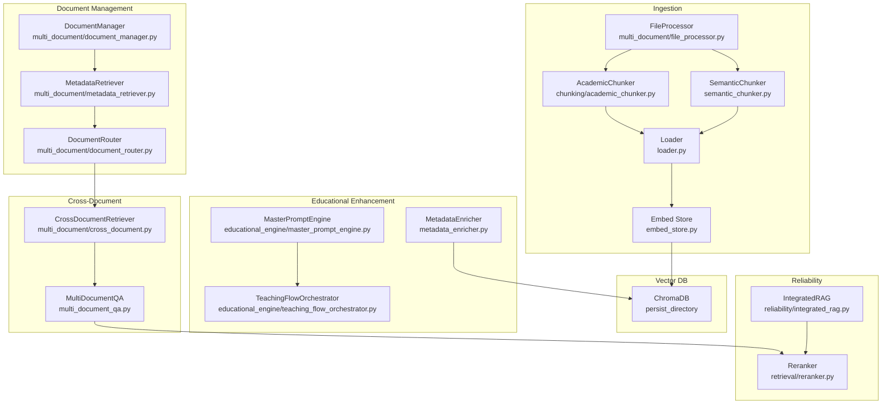
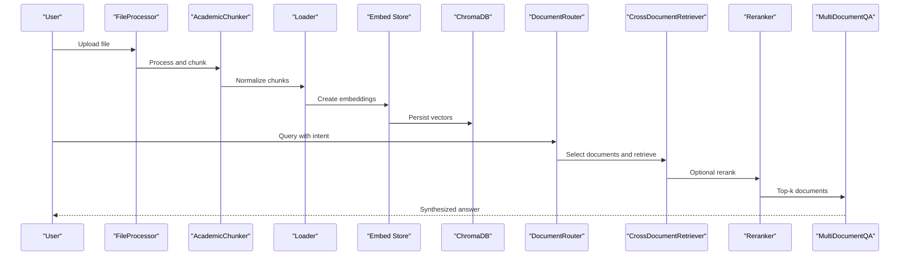
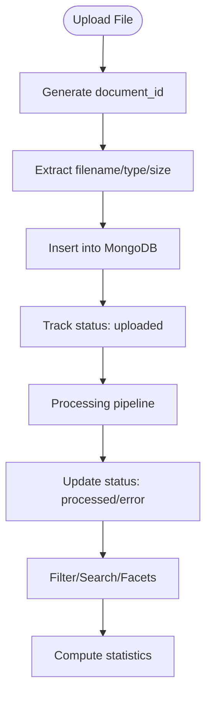
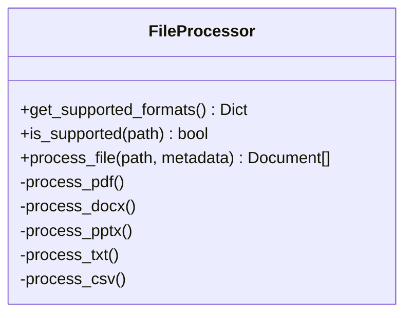
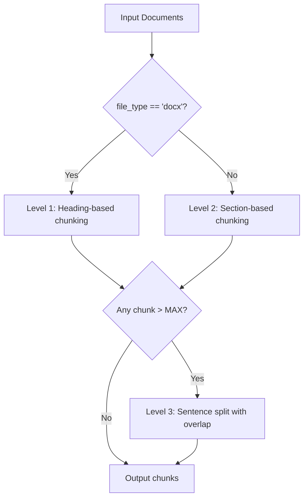
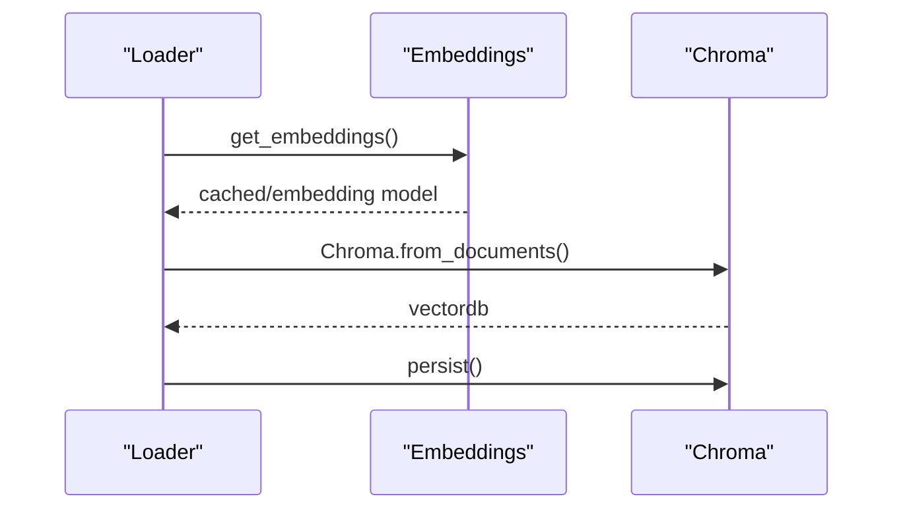
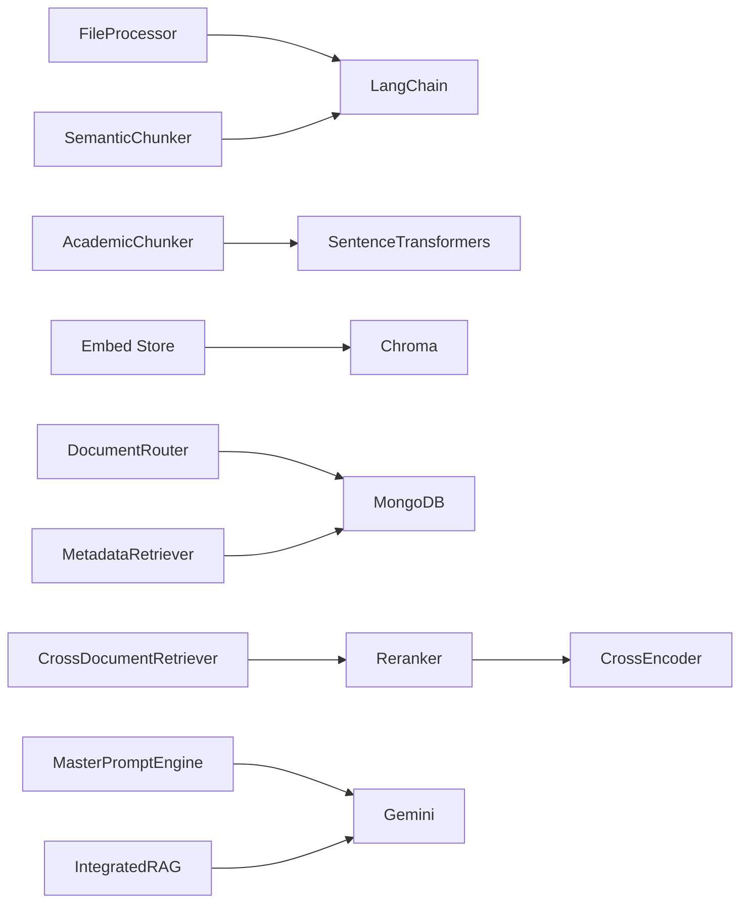

# Document Processing & Summarization

<cite>
**Referenced Files in This Document**
- [multi_document/document_manager.py](file://multi_document/document_manager.py)
- [multi_document/file_processor.py](file://multi_document/file_processor.py)
- [chunking/academic_chunker.py](file://chunking/academic_chunker.py)
- [semantic_chunker.py](file://semantic_chunker.py)
- [advanced_rag/ingestion/semantic_chunker.py](file://advanced_rag/ingestion/semantic_chunker.py)
- [multi_document/cross_document.py](file://multi_document/cross_document.py)
- [multi_document/metadata_retriever.py](file://multi_document/metadata_retriever.py)
- [multi_document/document_router.py](file://multi_document/document_router.py)
- [metadata_enricher.py](file://metadata_enricher.py)
- [embed_store.py](file://embed_store.py)
- [loader.py](file://loader.py)
- [multi_document_qa.py](file://multi_document_qa.py)
- [config.py](file://config.py)
- [educational_engine/master_prompt_engine.py](file://educational_engine/master_prompt_engine.py)
- [educational_engine/teaching_flow_orchestrator.py](file://educational_engine/teaching_flow_orchestrator.py)
- [reliability/integrated_rag.py](file://reliability/integrated_rag.py)
- [retrieval/reranker.py](file://retrieval/reranker.py)
</cite>

## Table of Contents
1. [Introduction](#introduction)
2. [Project Structure](#project-structure)
3. [Core Components](#core-components)
4. [Architecture Overview](#architecture-overview)
5. [Detailed Component Analysis](#detailed-component-analysis)
6. [Dependency Analysis](#dependency-analysis)
7. [Performance Considerations](#performance-considerations)
8. [Troubleshooting Guide](#troubleshooting-guide)
9. [Conclusion](#conclusion)

## Introduction
This document describes the Document Processing and Summarization system designed for multi-document retrieval-augmented generation (RAG). It covers:
- Multi-document management and upload
- Multi-format file processing (PDF, DOCX, PPTX, TXT, CSV)
- Academic-focused semantic chunking strategies
- Metadata enrichment and educational context
- Cross-document question answering and synthesis
- Integration with vector databases (Chroma) and hybrid retrieval with reranking
- Educational summarization pipeline with pedagogical reasoning

## Project Structure
The system is organized into cohesive modules:
- Multi-document orchestration: document lifecycle, metadata filtering, routing, and cross-document retrieval
- Content ingestion: file parsing, chunking, and vector storage
- Educational enhancement: metadata enrichment and AI tutor-style responses
- Reliability: caching, rate limiting, retries, and graceful degradation
- Retrieval optimization: hybrid search and cross-encoder reranking

**Diagram sources**
- [multi_document/file_processor.py:37-336](file://multi_document/file_processor.py#L37-L336)
- [chunking/academic_chunker.py:291-323](file://chunking/academic_chunker.py#L291-L323)
- [semantic_chunker.py:20-65](file://semantic_chunker.py#L20-L65)
- [loader.py:396-438](file://loader.py#L396-L438)
- [embed_store.py:39-66](file://embed_store.py#L39-L66)
- [multi_document/document_manager.py:21-51](file://multi_document/document_manager.py#L21-L51)
- [multi_document/metadata_retriever.py:17-48](file://multi_document/metadata_retriever.py#L17-L48)
- [multi_document/document_router.py:30-70](file://multi_document/document_router.py#L30-L70)
- [multi_document/cross_document.py:51-66](file://multi_document/cross_document.py#L51-L66)
- [multi_document_qa.py:71-79](file://multi_document_qa.py#L71-L79)
- [metadata_enricher.py:10-22](file://metadata_enricher.py#L10-L22)
- [educational_engine/master_prompt_engine.py:49-71](file://educational_engine/master_prompt_engine.py#L49-L71)
- [educational_engine/teaching_flow_orchestrator.py:35-41](file://educational_engine/teaching_flow_orchestrator.py#L35-L41)
- [reliability/integrated_rag.py:33-41](file://reliability/integrated_rag.py#L33-L41)
- [retrieval/reranker.py:140-150](file://retrieval/reranker.py#L140-L150)

**Section sources**
- [multi_document/__init__.py:1-34](file://multi_document/__init__.py#L1-L34)

## Core Components
- MultiDocumentManager: MongoDB-backed document registry with upload, CRUD, filtering, and statistics
- FileProcessor: Multi-format ingestion supporting PDF, DOCX, PPTX, TXT, CSV with metadata enrichment
- AcademicChunker: Three-tier chunking (heading-based, section-based, sentence-boundary splitting) with academic focus
- SemanticChunker (alternative): LangChain-based semantic chunking with special block preservation
- Loader: Standardized document loading and chunking pipeline
- Embed Store: Vector DB creation/loading with Chroma and persistent document cache
- MetadataRetriever: Metadata-based filtering and faceted search
- DocumentRouter: Intent-aware document selection and routing
- CrossDocumentRetriever: Cross-source retrieval, comparison, aggregation, and synthesis
- MultiDocumentQA: Parallel key-point extraction and multi-source synthesis
- MetadataEnricher: Educational metadata augmentation for vector chunks
- MasterPromptEngine and TeachingFlowOrchestrator: Pedagogical reasoning and 7-step teaching flow
- IntegratedRAG: Production-grade reliability with caching, rate limiting, retries, and graceful degradation
- Reranker: Cross-encoder reranking with hybrid blending

**Section sources**
- [multi_document/document_manager.py:21-378](file://multi_document/document_manager.py#L21-L378)
- [multi_document/file_processor.py:37-336](file://multi_document/file_processor.py#L37-L336)
- [chunking/academic_chunker.py:150-323](file://chunking/academic_chunker.py#L150-L323)
- [semantic_chunker.py:20-65](file://semantic_chunker.py#L20-L65)
- [loader.py:380-438](file://loader.py#L380-L438)
- [embed_store.py:39-80](file://embed_store.py#L39-L80)
- [multi_document/metadata_retriever.py:17-296](file://multi_document/metadata_retriever.py#L17-L296)
- [multi_document/document_router.py:30-366](file://multi_document/document_router.py#L30-L366)
- [multi_document/cross_document.py:51-429](file://multi_document/cross_document.py#L51-L429)
- [multi_document_qa.py:71-279](file://multi_document_qa.py#L71-L279)
- [metadata_enricher.py:10-221](file://metadata_enricher.py#L10-L221)
- [educational_engine/master_prompt_engine.py:49-131](file://educational_engine/master_prompt_engine.py#L49-L131)
- [educational_engine/teaching_flow_orchestrator.py:35-127](file://educational_engine/teaching_flow_orchestrator.py#L35-L127)
- [reliability/integrated_rag.py:33-284](file://reliability/integrated_rag.py#L33-L284)
- [retrieval/reranker.py:140-286](file://retrieval/reranker.py#L140-L286)

## Architecture Overview
The system follows a modular pipeline:
- Ingestion: Files are parsed, chunked, and embedded
- Storage: Documents and embeddings are persisted in Chroma
- Retrieval: Hybrid search with vector and BM25, optionally reranked
- Synthesis: Cross-document comparison and multi-source synthesis
- Education: Metadata enrichment and pedagogical response generation

**Diagram sources**
- [multi_document/file_processor.py:92-127](file://multi_document/file_processor.py#L92-L127)
- [chunking/academic_chunker.py:291-323](file://chunking/academic_chunker.py#L291-L323)
- [loader.py:380-438](file://loader.py#L380-L438)
- [embed_store.py:39-66](file://embed_store.py#L39-L66)
- [multi_document/document_router.py:124-162](file://multi_document/document_router.py#L124-L162)
- [multi_document/cross_document.py:67-137](file://multi_document/cross_document.py#L67-L137)
- [retrieval/reranker.py:214-274](file://retrieval/reranker.py#L214-L274)
- [multi_document_qa.py:232-279](file://multi_document_qa.py#L232-L279)

## Detailed Component Analysis

### Multi-Document Management Workflow
- Upload: Generates unique IDs, extracts metadata (filename, type, size), and initializes processing status
- CRUD: Retrieve, list with sorting/filters, update metadata/status, delete
- Filtering: By subject/chapter/source/file_type/date range; supports faceted search
- Statistics: Per-status counts, file-type distribution, total chunks and size

**Diagram sources**
- [multi_document/document_manager.py:55-110](file://multi_document/document_manager.py#L55-L110)
- [multi_document/document_manager.py:111-156](file://multi_document/document_manager.py#L111-L156)
- [multi_document/document_manager.py:236-278](file://multi_document/document_manager.py#L236-L278)

**Section sources**
- [multi_document/document_manager.py:21-378](file://multi_document/document_manager.py#L21-L378)

### File Format Support and Processing
- Supported formats: PDF, DOCX, PPTX, TXT, CSV
- Auto-detection via extension and MIME type
- Format-specific processors:
  - PDF: page-based documents with standardized metadata
  - DOCX: headings, paragraphs, bullet lists, tables with semantic-aware rendering
  - PPTX: slide-based documents with page numbering
  - TXT: character/line counting with encoding resilience
  - CSV: row/column metadata with sampling for performance

**Diagram sources**
- [multi_document/file_processor.py:37-127](file://multi_document/file_processor.py#L37-L127)

**Section sources**
- [multi_document/file_processor.py:37-336](file://multi_document/file_processor.py#L37-L336)

### Academic-Focused Chunking Strategies
Three-tier chunking prioritization:
- Level 1 (DOCX): Heading-based grouping; preserves section boundaries; merges small chunks; splits large chunks by sentence boundaries
- Level 2 (PDF/PPTX): Section-based (page/slide); injects section labels at chunk start; sentence-based splitting for oversized sections
- Level 3 (Fallback): Sentence-boundary splitting with overlap to maintain context

**Diagram sources**
- [chunking/academic_chunker.py:150-233](file://chunking/academic_chunker.py#L150-L233)
- [chunking/academic_chunker.py:236-288](file://chunking/academic_chunker.py#L236-L288)
- [chunking/academic_chunker.py:291-323](file://chunking/academic_chunker.py#L291-L323)

**Section sources**
- [chunking/academic_chunker.py:1-335](file://chunking/academic_chunker.py#L1-L335)

### Alternative Semantic Chunking
LangChain-based semantic chunking with:
- Sentence boundary detection
- Special block preservation (tables, code, formulas, headings)
- Post-processing: merge small, split large chunks
- Metadata enrichment for chunked documents

**Section sources**
- [semantic_chunker.py:20-342](file://semantic_chunker.py#L20-L342)

### Advanced Semantic Chunking (Hierarchical/Duplicate Detection)
- Hierarchical chunking preserving document structure
- Duplicate detection and merging with similarity thresholds
- Metadata enrichment including key phrases, section types, and content indicators

**Section sources**
- [advanced_rag/ingestion/semantic_chunker.py:12-452](file://advanced_rag/ingestion/semantic_chunker.py#L12-L452)

### Vector Storage and Embedding Pipeline
- Embedding model selection and caching
- Chroma vector store creation and persistence
- Documents cache for BM25 and downstream use

**Diagram sources**
- [embed_store.py:24-66](file://embed_store.py#L24-L66)
- [loader.py:396-438](file://loader.py#L396-L438)

**Section sources**
- [embed_store.py:24-110](file://embed_store.py#L24-L110)
- [loader.py:380-438](file://loader.py#L380-L438)
- [config.py:55-62](file://config.py#L55-L62)

### Metadata Enrichment and Educational Context
- Enriches chunks with educational metadata: chapter/topic, Bloom’s level, difficulty, assessment type, keywords
- Prerequisite linking and importance scoring
- Integrates with vector stores for enhanced retrieval and synthesis

**Section sources**
- [metadata_enricher.py:10-221](file://metadata_enricher.py#L10-L221)

### Cross-Document Retrieval and Synthesis
- Retrieves across multiple documents, aggregates results, and groups citations
- Compares documents for similarities/differences
- Synthesizes answers from multiple sources with citation formatting

```mermaid
sequenceDiagram
participant Q as "Query"
participant DR as "DocumentRouter"
participant CD as "CrossDocumentRetriever"
participant RER as "Reranker"
participant MDQA as "MultiDocumentQA"
Q->>DR : Analyze intent and select docs
DR-->>CD : Document IDs
CD->>RER : Optional rerank
RER-->>CD : Ranked docs
CD->>MDQA : Top-k documents
MDQA-->>Q : Synthesized answer with citations
```

**Diagram sources**
- [multi_document/document_router.py:294-317](file://multi_document/document_router.py#L294-L317)
- [multi_document/cross_document.py:67-137](file://multi_document/cross_document.py#L67-L137)
- [retrieval/reranker.py:214-274](file://retrieval/reranker.py#L214-L274)
- [multi_document_qa.py:232-279](file://multi_document_qa.py#L232-L279)

**Section sources**
- [multi_document/cross_document.py:51-429](file://multi_document/cross_document.py#L51-L429)
- [multi_document_qa.py:71-279](file://multi_document_qa.py#L71-L279)

### Educational Summarization Pipeline
- MasterPromptEngine: Pedagogical reasoning and 7-step teaching flow orchestration
- TeachingFlowOrchestrator: Structured tutor-like responses with quality criteria
- Integrates with vector DB and retrieval for contextual, high-quality summaries

**Section sources**
- [educational_engine/master_prompt_engine.py:49-131](file://educational_engine/master_prompt_engine.py#L49-L131)
- [educational_engine/teaching_flow_orchestrator.py:35-127](file://educational_engine/teaching_flow_orchestrator.py#L35-L127)

### Reliability and Production Readiness
- Rate limiting, retry with exponential backoff, caching, and graceful degradation
- Timeout handling and fallback responses
- Monitoring and tracing for observability

**Section sources**
- [reliability/integrated_rag.py:33-284](file://reliability/integrated_rag.py#L33-L284)

## Dependency Analysis
Key internal and external dependencies:
- LangChain ecosystem for document loaders, splitters, embeddings, and vector stores
- Chroma for vector persistence
- SentenceTransformers and CrossEncoder for embeddings and reranking
- MongoDB for document metadata and indexing
- Google Generative AI for LLM tasks and translation

**Diagram sources**
- [multi_document/file_processor.py:15-18](file://multi_document/file_processor.py#L15-L18)
- [chunking/academic_chunker.py:58-64](file://chunking/academic_chunker.py#L58-L64)
- [semantic_chunker.py:14-16](file://semantic_chunker.py#L14-L16)
- [embed_store.py:13-14](file://embed_store.py#L13-L14)
- [multi_document/document_manager.py:17-18](file://multi_document/document_manager.py#L17-L18)
- [multi_document/cross_document.py:64-65](file://multi_document/cross_document.py#L64-L65)
- [reliability/integrated_rag.py:16-18](file://reliability/integrated_rag.py#L16-L18)
- [educational_engine/master_prompt_engine.py:27-28](file://educational_engine/master_prompt_engine.py#L27-L28)

**Section sources**
- [config.py:55-62](file://config.py#L55-L62)
- [retrieval/reranker.py:39-56](file://retrieval/reranker.py#L39-L56)

## Performance Considerations
- Chunk sizing: Academic chunker enforces minimum/maximum chunk sizes and sentence-boundary splitting to balance context and embedding density
- Hybrid retrieval: Vector weight (0.7) and BM25 weight (0.3) tuned for academic content
- Reranking: Cross-encoder reranking with threshold filtering reduces irrelevant context
- Caching: Embedding, BM25, and response caches reduce latency and API costs
- Asynchronous processing and batch sizes configured for throughput
- Rate limiting and graceful degradation ensure stability under load

[No sources needed since this section provides general guidance]

## Troubleshooting Guide
- Missing dependencies: DOCX and CSV support require optional packages; ImportError messages guide installation
- Embedding initialization: Singleton embedding model prevents repeated heavy loads
- MongoDB connectivity: Indexes improve query performance; verify connection URI and credentials
- Reranker model availability: Falls back to heuristic scoring if cross-encoder models fail to load
- API key management: Rotation and quota handling ensure continuity; monitor failures and adjust pools

**Section sources**
- [multi_document/file_processor.py:21-35](file://multi_document/file_processor.py#L21-L35)
- [embed_store.py:24-37](file://embed_store.py#L24-L37)
- [multi_document/document_manager.py:41-53](file://multi_document/document_manager.py#L41-L53)
- [retrieval/reranker.py:39-56](file://retrieval/reranker.py#L39-L56)
- [reliability/integrated_rag.py:19-28](file://reliability/integrated_rag.py#L19-L28)

## Conclusion
The Document Processing and Summarization system integrates robust ingestion, academic-aware chunking, metadata enrichment, and cross-document synthesis with production-grade reliability. It leverages vector databases and hybrid retrieval with reranking to deliver accurate, contextually rich answers suitable for educational environments. The modular design enables extensibility, maintainability, and scalability across diverse document formats and use cases.