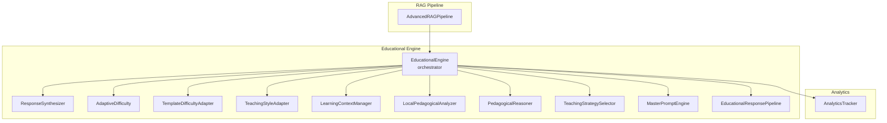
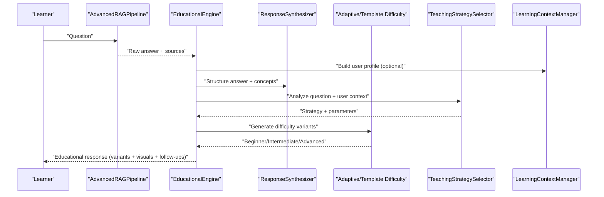
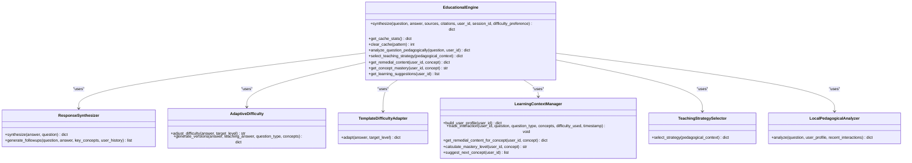
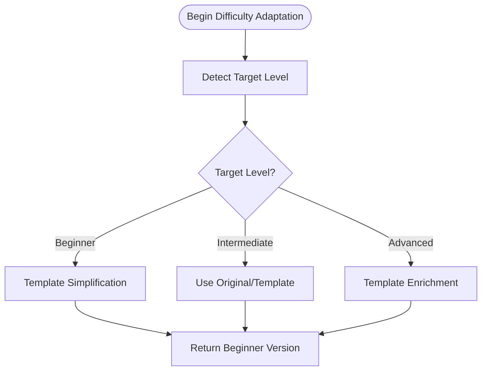
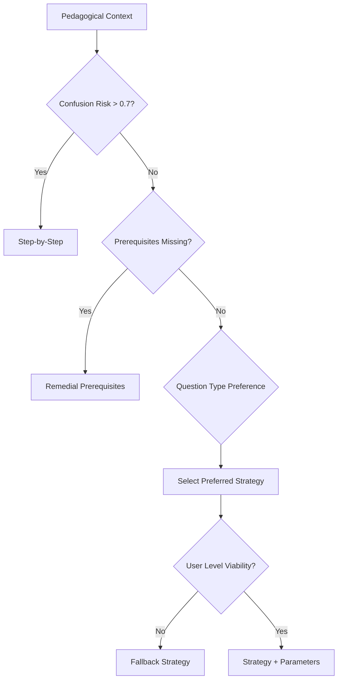
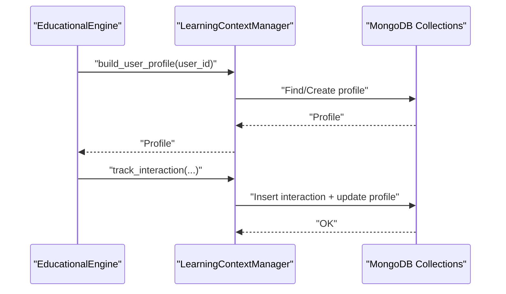
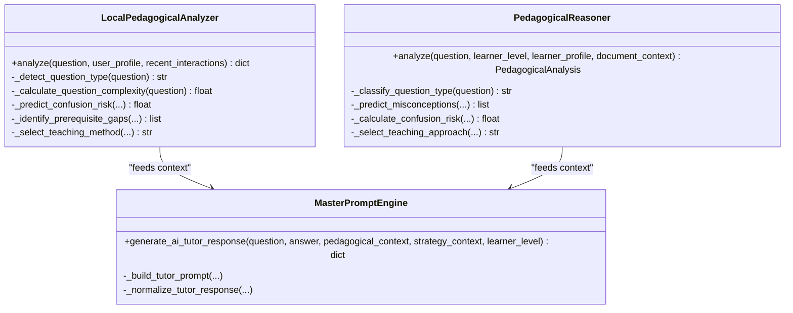
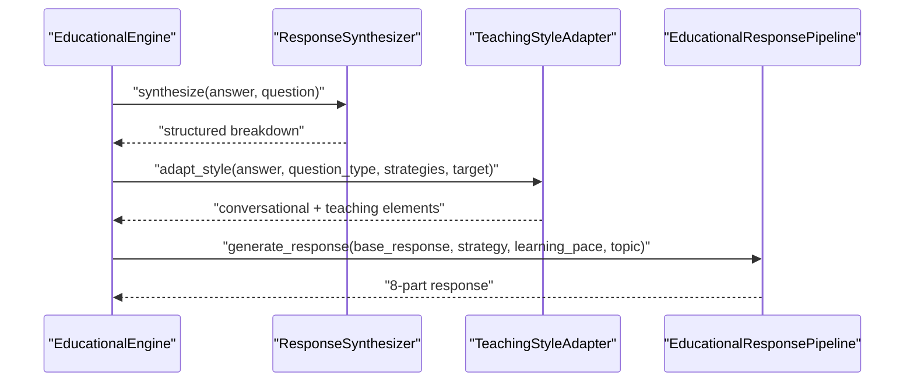
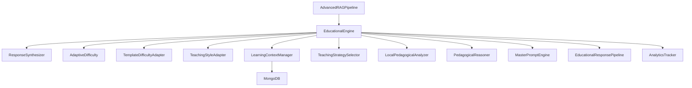
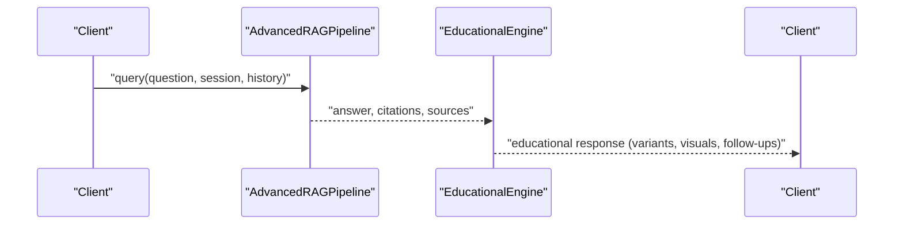

# Educational AI Engine

<cite>
**Referenced Files in This Document**
- [educational_engine/__init__.py](file://educational_engine/__init__.py)
- [educational_engine/response_synthesizer.py](file://educational_engine/response_synthesizer.py)
- [educational_engine/adaptive_difficulty.py](file://educational_engine/adaptive_difficulty.py)
- [educational_engine/template_difficulty_adapter.py](file://educational_engine/template_difficulty_adapter.py)
- [educational_engine/teaching_style_adapter.py](file://educational_engine/teaching_style_adapter.py)
- [educational_engine/learning_context_manager.py](file://educational_engine/learning_context_manager.py)
- [educational_engine/pedagogical_reasoner.py](file://educational_engine/pedagogical_reasoner.py)
- [educational_engine/local_pedagogical_analyzer.py](file://educational_engine/local_pedagogical_analyzer.py)
- [educational_engine/teaching_strategy_selector.py](file://educational_engine/teaching_strategy_selector.py)
- [educational_engine/master_prompt_engine.py](file://educational_engine/master_prompt_engine.py)
- [educational_engine/response_synthesizer.py](file://educational_engine/response_synthesizer.py)
- [educational_response_pipeline.py](file://educational_response_pipeline.py)
- [advanced_rag/pipeline/integrated_rag.py](file://advanced_rag/pipeline/integrated_rag.py)
- [analytics.py](file://analytics.py)
- [docs/current_rag_architecture.md](file://docs/current_rag_architecture.md)
- [README.md](file://README.md)
</cite>

## Table of Contents
1. [Introduction](#introduction)
2. [Project Structure](#project-structure)
3. [Core Components](#core-components)
4. [Architecture Overview](#architecture-overview)
5. [Detailed Component Analysis](#detailed-component-analysis)
6. [Dependency Analysis](#dependency-analysis)
7. [Performance Considerations](#performance-considerations)
8. [Troubleshooting Guide](#troubleshooting-guide)
9. [Conclusion](#conclusion)
10. [Appendices](#appendices)

## Introduction
This document describes the Educational AI Engine, a production-grade system that transforms raw retrieval-augmented generation (RAG) answers into adaptive, pedagogically rich, and personalized educational responses. It integrates:
- Adaptive learning: difficulty adjustment, teaching strategy selection, and learning context management
- Pedagogical reasoning: question classification, confusion risk prediction, and prerequisite gap detection
- Personalized content delivery: conversational explanations, visual aids, and follow-up suggestions
- Integration with the RAG pipeline and real-time learning analytics

The system emphasizes performance optimization, user-centric personalization, and scalable delivery across diverse learning styles and contexts.

## Project Structure
The Educational AI Engine resides primarily under the educational_engine package and orchestrates with the broader RAG pipeline and analytics subsystems.

**Diagram sources**
- [educational_engine/__init__.py:52-381](file://educational_engine/__init__.py#L52-L381)
- [educational_engine/response_synthesizer.py:22-301](file://educational_engine/response_synthesizer.py#L22-L301)
- [educational_engine/adaptive_difficulty.py:19-291](file://educational_engine/adaptive_difficulty.py#L19-L291)
- [educational_engine/template_difficulty_adapter.py:19-259](file://educational_engine/template_difficulty_adapter.py#L19-L259)
- [educational_engine/teaching_style_adapter.py:22-312](file://educational_engine/teaching_style_adapter.py#L22-L312)
- [educational_engine/learning_context_manager.py:23-629](file://educational_engine/learning_context_manager.py#L23-L629)
- [educational_engine/local_pedagogical_analyzer.py:24-558](file://educational_engine/local_pedagogical_analyzer.py#L24-L558)
- [educational_engine/pedagogical_reasoner.py:67-637](file://educational_engine/pedagogical_reasoner.py#L67-L637)
- [educational_engine/teaching_strategy_selector.py:26-424](file://educational_engine/teaching_strategy_selector.py#L26-L424)
- [educational_engine/master_prompt_engine.py:49-501](file://educational_engine/master_prompt_engine.py#L49-L501)
- [educational_response_pipeline.py:67-398](file://educational_response_pipeline.py#L67-L398)
- [advanced_rag/pipeline/integrated_rag.py:14-569](file://advanced_rag/pipeline/integrated_rag.py#L14-L569)
- [analytics.py:12-94](file://analytics.py#L12-L94)

**Section sources**
- [README.md:114-141](file://README.md#L114-L141)
- [docs/current_rag_architecture.md:1-114](file://docs/current_rag_architecture.md#L1-L114)

## Core Components
- EducationalEngine: Orchestrates synthesis, caching, async execution, and pedagogical strategy selection. It builds user profiles, selects teaching strategies, and compiles a rich educational response with difficulty variants, visuals, and follow-ups.
- ResponseSynthesizer: Parses questions, extracts key concepts, structures answers, and generates simplified explanations and takeaways.
- AdaptiveDifficulty: Generates beginner/intermediate/advanced versions using LLMs.
- TemplateDifficultyAdapter: Rule-based difficulty adaptation replacing LLM calls with regex/vocabulary mapping for speed.
- TeachingStyleAdapter: Converts academic answers into conversational, engaging formats with analogies, examples, and storytelling.
- LearningContextManager: Tracks user learning profiles, patterns, weak/strong areas, and mastery levels; supports remediation and next-concept suggestions.
- LocalPedagogicalAnalyzer: Performs fast, rule-based pedagogical analysis (question type, complexity, intent, confusion risk, prerequisites).
- PedagogicalReasoner: Advanced domain-knowledge reasoning for misconceptions, prerequisites, and teaching flow (no LLM).
- TeachingStrategySelector: Routes to optimal teaching strategy based on pedagogical context and user level.
- MasterPromptEngine: Generates AI tutor-style responses in a single LLM call with structured steps and pedagogical guidance.
- EducationalResponsePipeline: Produces 8-part educational responses aligned with selected strategies.

**Section sources**
- [educational_engine/__init__.py:52-381](file://educational_engine/__init__.py#L52-L381)
- [educational_engine/response_synthesizer.py:22-301](file://educational_engine/response_synthesizer.py#L22-L301)
- [educational_engine/adaptive_difficulty.py:19-291](file://educational_engine/adaptive_difficulty.py#L19-L291)
- [educational_engine/template_difficulty_adapter.py:19-259](file://educational_engine/template_difficulty_adapter.py#L19-L259)
- [educational_engine/teaching_style_adapter.py:22-312](file://educational_engine/teaching_style_adapter.py#L22-L312)
- [educational_engine/learning_context_manager.py:23-629](file://educational_engine/learning_context_manager.py#L23-L629)
- [educational_engine/local_pedagogical_analyzer.py:24-558](file://educational_engine/local_pedagogical_analyzer.py#L24-L558)
- [educational_engine/pedagogical_reasoner.py:67-637](file://educational_engine/pedagogical_reasoner.py#L67-L637)
- [educational_engine/teaching_strategy_selector.py:26-424](file://educational_engine/teaching_strategy_selector.py#L26-L424)
- [educational_engine/master_prompt_engine.py:49-501](file://educational_engine/master_prompt_engine.py#L49-L501)
- [educational_response_pipeline.py:67-398](file://educational_response_pipeline.py#L67-L398)

## Architecture Overview
The Educational AI Engine sits atop the RAG pipeline, transforming retrieved answers into adaptive, contextual, and personalized educational content. It leverages caching, async orchestration, and rule-based components to reduce latency while maintaining pedagogical quality.

**Diagram sources**
- [advanced_rag/pipeline/integrated_rag.py:133-240](file://advanced_rag/pipeline/integrated_rag.py#L133-L240)
- [educational_engine/__init__.py:81-266](file://educational_engine/__init__.py#L81-L266)
- [educational_engine/response_synthesizer.py:225-257](file://educational_engine/response_synthesizer.py#L225-L257)
- [educational_engine/teaching_strategy_selector.py:85-152](file://educational_engine/teaching_strategy_selector.py#L85-L152)
- [educational_engine/adaptive_difficulty.py:199-242](file://educational_engine/adaptive_difficulty.py#L199-L242)
- [educational_engine/template_difficulty_adapter.py:60-80](file://educational_engine/template_difficulty_adapter.py#L60-L80)
- [educational_engine/learning_context_manager.py:41-115](file://educational_engine/learning_context_manager.py#L41-L115)

## Detailed Component Analysis

### EducationalEngine Orchestration
- Responsibilities:
  - Cache lookup and stats
  - User profile building and interaction tracking
  - Synthesis of answer structure and key concepts
  - Master prompt generation of conversational teaching response
  - Parallel visual and optimization synthesis
  - Template-based difficulty adaptation
  - Follow-up suggestion generation
  - Compilation of educational response with metadata
- Performance features:
  - Multi-layer caching
  - Async synthesis fallback
  - Template-based difficulty adapter
  - Streaming handler integration (external)

**Diagram sources**
- [educational_engine/__init__.py:52-381](file://educational_engine/__init__.py#L52-L381)
- [educational_engine/response_synthesizer.py:22-301](file://educational_engine/response_synthesizer.py#L22-L301)
- [educational_engine/adaptive_difficulty.py:19-291](file://educational_engine/adaptive_difficulty.py#L19-L291)
- [educational_engine/template_difficulty_adapter.py:19-259](file://educational_engine/template_difficulty_adapter.py#L19-L259)
- [educational_engine/learning_context_manager.py:23-629](file://educational_engine/learning_context_manager.py#L23-L629)
- [educational_engine/teaching_strategy_selector.py:26-424](file://educational_engine/teaching_strategy_selector.py#L26-L424)
- [educational_engine/local_pedagogical_analyzer.py:24-558](file://educational_engine/local_pedagogical_analyzer.py#L24-L558)

**Section sources**
- [educational_engine/__init__.py:81-266](file://educational_engine/__init__.py#L81-L266)

### Adaptive Difficulty System
- Approaches:
  - LLM-based versions: beginner, intermediate, advanced
  - Template-based adaptation: vocabulary simplification, technical depth, complexity notes, edge cases, research context
- Detection:
  - User-level inference from question history and quiz scores
- Outputs:
  - Difficulty variants and descriptions tailored to learning goals

**Diagram sources**
- [educational_engine/adaptive_difficulty.py:199-242](file://educational_engine/adaptive_difficulty.py#L199-L242)
- [educational_engine/template_difficulty_adapter.py:60-131](file://educational_engine/template_difficulty_adapter.py#L60-L131)

**Section sources**
- [educational_engine/adaptive_difficulty.py:19-291](file://educational_engine/adaptive_difficulty.py#L19-L291)
- [educational_engine/template_difficulty_adapter.py:19-259](file://educational_engine/template_difficulty_adapter.py#L19-L259)

### Teaching Strategy Selection
- Pedagogical analysis:
  - Question type, complexity, learning intent, confusion risk, prerequisite gaps
- Routing logic:
  - High confusion risk → step-by-step
  - Missing prerequisites → remediation scaffolding
  - Question-type preferences and user-level viability
- Strategy parameters:
  - Number of examples, analogies, math, steps, visuals, depth level
- Confidence calculation:
  - Based on clarity, confidence score, and signal consistency

**Diagram sources**
- [educational_engine/teaching_strategy_selector.py:154-206](file://educational_engine/teaching_strategy_selector.py#L154-L206)
- [educational_engine/teaching_strategy_selector.py:239-310](file://educational_engine/teaching_strategy_selector.py#L239-L310)
- [educational_engine/teaching_strategy_selector.py:381-400](file://educational_engine/teaching_strategy_selector.py#L381-L400)

**Section sources**
- [educational_engine/teaching_strategy_selector.py:26-424](file://educational_engine/teaching_strategy_selector.py#L26-L424)
- [educational_engine/local_pedagogical_analyzer.py:119-216](file://educational_engine/local_pedagogical_analyzer.py#L119-L216)

### Learning Context Management
- User profile construction:
  - Learning level, topics explored, favorites, weak/strong areas, engagement, metadata
- Interaction tracking:
  - Question type, concepts, difficulty used, timestamps
- Learning pattern detection:
  - Frequency, consistency, intensity, favorite question types
- Remediation and mastery:
  - Missing prerequisites, remedial content, mastery level calculation
- Next concept suggestions:
  - Based on prerequisites, weak areas, and interests

**Diagram sources**
- [educational_engine/learning_context_manager.py:41-115](file://educational_engine/learning_context_manager.py#L41-L115)
- [educational_engine/learning_context_manager.py:434-472](file://educational_engine/learning_context_manager.py#L434-L472)

**Section sources**
- [educational_engine/learning_context_manager.py:23-629](file://educational_engine/learning_context_manager.py#L23-L629)

### Pedagogical Reasoning and Master Prompt Engine
- LocalPedagogicalAnalyzer:
  - Regex-based question type detection, learning intent, complexity estimation
  - Confusion risk prediction, prerequisite gap identification, teaching method recommendation
  - Confidence scoring and adaptation rules
- PedagogicalReasoner:
  - Domain-knowledge reasoning for misconceptions, prerequisites, pitfalls, and teaching flow
- MasterPromptEngine:
  - AI tutor-style response generation in a single LLM call with structured steps
  - Conversational tone, analogies, examples, and strategy-aligned parameters

**Diagram sources**
- [educational_engine/local_pedagogical_analyzer.py:119-216](file://educational_engine/local_pedagogical_analyzer.py#L119-L216)
- [educational_engine/pedagogical_reasoner.py:188-270](file://educational_engine/pedagogical_reasoner.py#L188-L270)
- [educational_engine/master_prompt_engine.py:72-131](file://educational_engine/master_prompt_engine.py#L72-L131)

**Section sources**
- [educational_engine/local_pedagogical_analyzer.py:24-558](file://educational_engine/local_pedagogical_analyzer.py#L24-L558)
- [educational_engine/pedagogical_reasoner.py:67-637](file://educational_engine/pedagogical_reasoner.py#L67-L637)
- [educational_engine/master_prompt_engine.py:49-501](file://educational_engine/master_prompt_engine.py#L49-L501)

### Personalized Content Delivery and Response Synthesis
- ResponseSynthesizer:
  - Question type detection, key concept extraction, answer structuring, simplified explanation, takeaways, prerequisites, related concepts, follow-up generation
- TeachingStyleAdapter:
  - Analogy generation, real-world examples, step-by-step breakdowns, comparisons, metaphor injection, engagement estimation, and conversational formatting
- EducationalResponsePipeline:
  - 8-part educational response generation aligned with selected strategies (summary, conceptual explanation, example, implementation, mistakes, learning path, practice hint, mastery check)

**Diagram sources**
- [educational_engine/response_synthesizer.py:225-301](file://educational_engine/response_synthesizer.py#L225-L301)
- [educational_engine/teaching_style_adapter.py:222-278](file://educational_engine/teaching_style_adapter.py#L222-L278)
- [educational_response_pipeline.py:80-138](file://educational_response_pipeline.py#L80-L138)

**Section sources**
- [educational_engine/response_synthesizer.py:22-301](file://educational_engine/response_synthesizer.py#L22-L301)
- [educational_engine/teaching_style_adapter.py:22-312](file://educational_engine/teaching_style_adapter.py#L22-L312)
- [educational_response_pipeline.py:67-398](file://educational_response_pipeline.py#L67-L398)

## Dependency Analysis
- Internal dependencies:
  - EducationalEngine composes ResponseSynthesizer, Adaptive/Template Difficulty, TeachingStyleAdapter, LearningContextManager, TeachingStrategySelector, LocalPedagogicalAnalyzer, and MasterPromptEngine.
  - TeachingStrategySelector depends on routing matrices and scoring heuristics.
  - LocalPedagogicalAnalyzer and PedagogicalReasoner provide complementary pedagogical insights.
- External integrations:
  - RAG pipeline supplies raw answers and sources for synthesis.
  - AnalyticsTracker logs interactions and feedback for continuous improvement.
  - MongoDB stores user profiles and interaction histories.

**Diagram sources**
- [educational_engine/__init__.py:25-51](file://educational_engine/__init__.py#L25-L51)
- [educational_engine/teaching_strategy_selector.py:29-66](file://educational_engine/teaching_strategy_selector.py#L29-L66)
- [educational_engine/local_pedagogical_analyzer.py:114-118](file://educational_engine/local_pedagogical_analyzer.py#L114-L118)
- [educational_engine/learning_context_manager.py:28-40](file://educational_engine/learning_context_manager.py#L28-L40)
- [advanced_rag/pipeline/integrated_rag.py:14-82](file://advanced_rag/pipeline/integrated_rag.py#L14-L82)
- [analytics.py:12-18](file://analytics.py#L12-L18)

**Section sources**
- [educational_engine/__init__.py:25-51](file://educational_engine/__init__.py#L25-L51)
- [educational_engine/teaching_strategy_selector.py:29-66](file://educational_engine/teaching_strategy_selector.py#L29-L66)
- [educational_engine/local_pedagogical_analyzer.py:114-118](file://educational_engine/local_pedagogical_analyzer.py#L114-L118)
- [educational_engine/learning_context_manager.py:28-40](file://educational_engine/learning_context_manager.py#L28-L40)
- [advanced_rag/pipeline/integrated_rag.py:84-132](file://advanced_rag/pipeline/integrated_rag.py#L84-L132)
- [analytics.py:12-18](file://analytics.py#L12-L18)

## Performance Considerations
- Latency optimizations:
  - Template-based difficulty adaptation reduces LLM calls and improves throughput.
  - Async synthesis enables parallel visual and optimization generation.
  - Caching accelerates repeated queries per user.
- Throughput improvements:
  - Single LLM call for AI tutor-style responses via MasterPromptEngine.
  - Rule-based pedagogical analysis avoids expensive model calls.
- Scalability:
  - Modular components enable independent scaling and testing.
  - Streaming handler integration supports progressive rendering.

[No sources needed since this section provides general guidance]

## Troubleshooting Guide
- Caching issues:
  - Verify cache availability and statistics via EducationalEngine cache APIs.
  - Clear cache selectively using patterns for targeted resets.
- LLM failures:
  - Fallback responses ensure minimal degradation when model calls fail.
  - Review logging and error messages for prompt parsing or invocation errors.
- Context and profile inconsistencies:
  - Confirm MongoDB connectivity and collection indexing.
  - Validate user_id/session_id propagation through the pipeline.
- Analytics logging:
  - Ensure analytics log file path exists and is writable.
  - Use statistics aggregation to monitor usage trends and ratings.

**Section sources**
- [educational_engine/__init__.py:268-289](file://educational_engine/__init__.py#L268-L289)
- [educational_engine/master_prompt_engine.py:121-131](file://educational_engine/master_prompt_engine.py#L121-L131)
- [educational_engine/learning_context_manager.py:28-40](file://educational_engine/learning_context_manager.py#L28-L40)
- [analytics.py:15-53](file://analytics.py#L15-L53)

## Conclusion
The Educational AI Engine delivers a robust, adaptive, and efficient educational response system. By combining rule-based reasoning, template-driven adaptations, and strategic pedagogical routing, it personalizes content for diverse learners while integrating seamlessly with the RAG pipeline and real-time analytics. Its modular design and performance optimizations position it for scalable deployment and continuous improvement.

[No sources needed since this section summarizes without analyzing specific files]

## Appendices

### Integration with RAG Pipeline
- The RAG pipeline retrieves and reranks relevant documents, then generates a grounded answer with citations. EducationalEngine consumes this answer to produce adaptive, structured, and personalized educational content.

**Diagram sources**
- [advanced_rag/pipeline/integrated_rag.py:133-240](file://advanced_rag/pipeline/integrated_rag.py#L133-L240)
- [educational_engine/__init__.py:81-266](file://educational_engine/__init__.py#L81-L266)

**Section sources**
- [docs/current_rag_architecture.md:1-114](file://docs/current_rag_architecture.md#L1-L114)
- [advanced_rag/pipeline/integrated_rag.py:14-569](file://advanced_rag/pipeline/integrated_rag.py#L14-L569)

### Example Workflows
- Adaptive difficulty adaptation:
  - Input: raw answer, target level
  - Output: beginner/intermediate/advanced variants
- Teaching strategy selection:
  - Input: pedagogical context, user profile
  - Output: primary strategy, fallback, parameters, reasoning, confidence
- Personalized remediation:
  - Input: user_id, concept
  - Output: missing prerequisites, suggested learning path, analogies/examples

**Section sources**
- [educational_engine/adaptive_difficulty.py:199-242](file://educational_engine/adaptive_difficulty.py#L199-L242)
- [educational_engine/template_difficulty_adapter.py:60-80](file://educational_engine/template_difficulty_adapter.py#L60-L80)
- [educational_engine/teaching_strategy_selector.py:85-152](file://educational_engine/teaching_strategy_selector.py#L85-L152)
- [educational_engine/learning_context_manager.py:434-472](file://educational_engine/learning_context_manager.py#L434-L472)