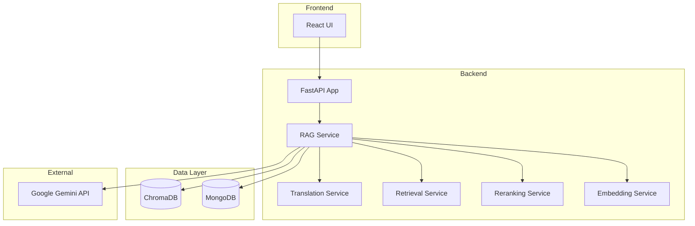
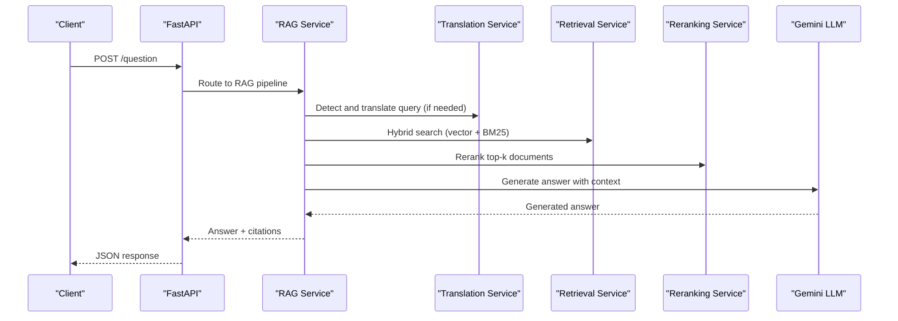
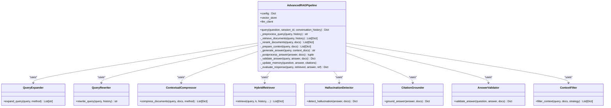
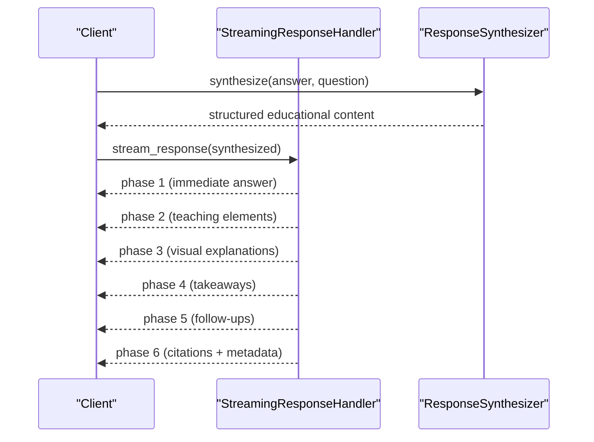
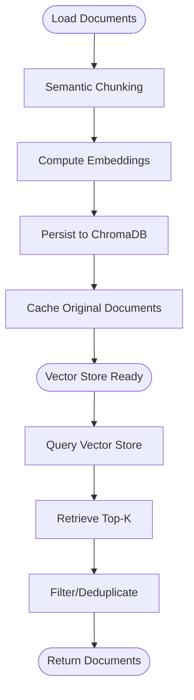
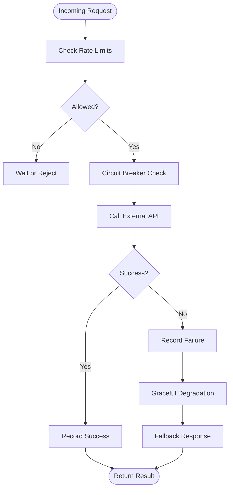
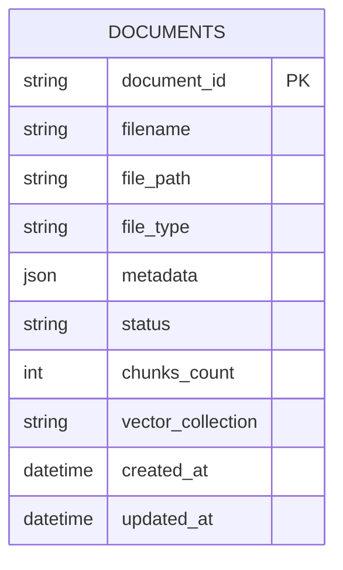
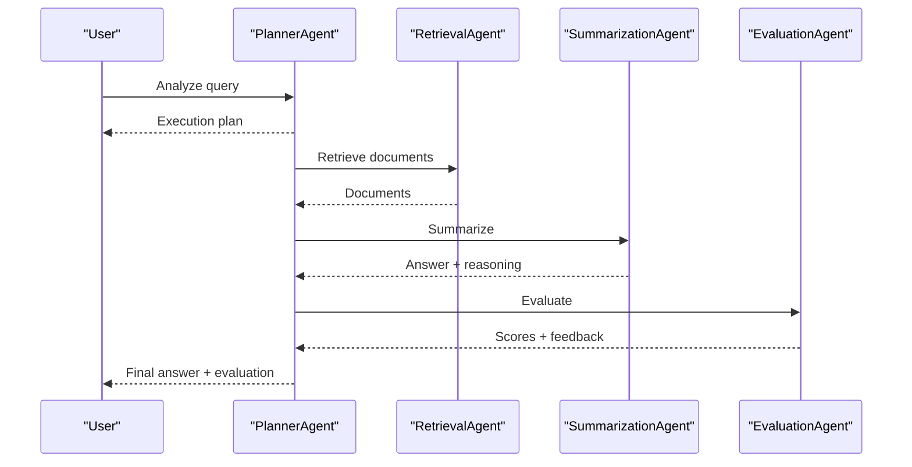
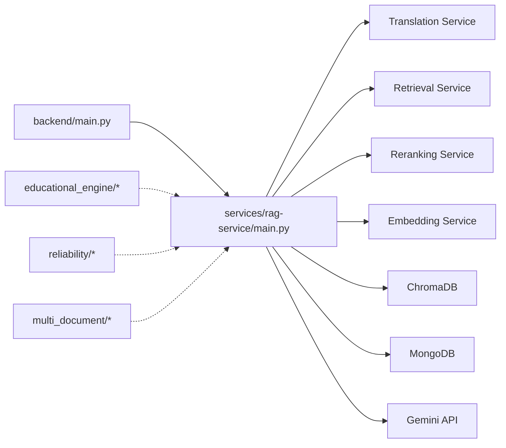

# Intelligent Q&A System

<cite>
**Referenced Files in This Document**
- [README.md](file://README.md)
- [backend/main.py](file://backend/main.py)
- [services/rag-service/main.py](file://services/rag-service/main.py)
- [advanced_rag/pipeline/integrated_rag.py](file://advanced_rag/pipeline/integrated_rag.py)
- [advanced_rag/retrieval/advanced_retriever.py](file://advanced_rag/retrieval/advanced_retriever.py)
- [advanced_rag/generation/advanced_generator.py](file://advanced_rag/generation/advanced_generator.py)
- [educational_engine/streaming_handler.py](file://educational_engine/streaming_handler.py)
- [educational_engine/response_synthesizer.py](file://educational_engine/response_synthesizer.py)
- [reliability/graceful_degradation.py](file://reliability/graceful_degradation.py)
- [reliability/rate_limiter.py](file://reliability/rate_limiter.py)
- [embed_store.py](file://embed_store.py)
- [multi_document/document_manager.py](file://multi_document/document_manager.py)
- [intelligent_assistant/agentic_rag.py](file://intelligent_assistant/agentic_rag.py)
- [docs/current_rag_architecture.md](file://docs/current_rag_architecture.md)
- [config.py](file://config.py)
</cite>

## Table of Contents
1. [Introduction](#introduction)
2. [Project Structure](#project-structure)
3. [Core Components](#core-components)
4. [Architecture Overview](#architecture-overview)
5. [Detailed Component Analysis](#detailed-component-analysis)
6. [Dependency Analysis](#dependency-analysis)
7. [Performance Considerations](#performance-considerations)
8. [Troubleshooting Guide](#troubleshooting-guide)
9. [Conclusion](#conclusion)

## Introduction
This document describes the Intelligent Q&A System built with a production-ready Retrieval-Augmented Generation (RAG) pipeline integrating Google Gemini APIs. The system supports context-aware question answering, detailed citation generation, streaming responses, multi-document management, and robust reliability features including graceful degradation and circuit breakers for API quota limits. It combines vector search, BM25, cross-encoder reranking, and educational response synthesis to deliver accurate, traceable, and pedagogically effective answers.

## Project Structure
The system is organized into modular components:
- Backend API: FastAPI application orchestrating services
- RAG pipeline: Advanced retrieval, reranking, generation, and memory
- Educational engine: Streaming handler and response synthesizer for pedagogical delivery
- Reliability: Rate limiting, circuit breakers, and graceful degradation
- Vector database: Chroma-backed embedding store
- Multi-document management: MongoDB-backed document lifecycle
- Services: Microservice-style orchestration for translation, retrieval, reranking, and embedding

**Diagram sources**
- [backend/main.py:11-51](file://backend/main.py#L11-L51)
- [services/rag-service/main.py:31-44](file://services/rag-service/main.py#L31-L44)
- [embed_store.py:39-80](file://embed_store.py#L39-L80)
- [multi_document/document_manager.py:26-50](file://multi_document/document_manager.py#L26-L50)

**Section sources**
- [README.md:114-141](file://README.md#L114-L141)
- [docs/current_rag_architecture.md:1-114](file://docs/current_rag_architecture.md#L1-L114)

## Core Components
- RAG Pipeline: End-to-end orchestration with semantic chunking, hybrid retrieval, reranking, generation, and memory
- Advanced Retrieval: Query expansion, rewriting, contextual compression, and hybrid search (vector + BM25)
- Generation Enhancements: Hallucination detection, citation grounding, answer validation, and context filtering
- Streaming Engine: Progressive response delivery with multi-phase rendering
- Reliability: Token bucket, sliding window, and circuit breaker for API quotas and fault tolerance
- Vector Store: Chroma-backed persistence with embeddings and cached documents
- Multi-Document Management: MongoDB-backed document lifecycle and metadata
- Agentic RAG: Planner, Retrieval, Summarization, and Evaluation agents for complex workflows

**Section sources**
- [advanced_rag/pipeline/integrated_rag.py:14-132](file://advanced_rag/pipeline/integrated_rag.py#L14-L132)
- [advanced_rag/retrieval/advanced_retriever.py:12-486](file://advanced_rag/retrieval/advanced_retriever.py#L12-L486)
- [advanced_rag/generation/advanced_generator.py:12-559](file://advanced_rag/generation/advanced_generator.py#L12-L559)
- [educational_engine/streaming_handler.py:23-193](file://educational_engine/streaming_handler.py#L23-L193)
- [reliability/rate_limiter.py:27-324](file://reliability/rate_limiter.py#L27-L324)
- [embed_store.py:39-110](file://embed_store.py#L39-L110)
- [multi_document/document_manager.py:21-396](file://multi_document/document_manager.py#L21-L396)
- [intelligent_assistant/agentic_rag.py:52-669](file://intelligent_assistant/agentic_rag.py#L52-L669)

## Architecture Overview
The system integrates multiple stages:
1. Query preprocessing and translation
2. Hybrid retrieval (vector + BM25) with query expansion and compression
3. Reranking and filtering
4. LLM generation with citation grounding
5. Response synthesis and streaming
6. Reliability controls and fallbacks

**Diagram sources**
- [services/rag-service/main.py:219-228](file://services/rag-service/main.py#L219-L228)
- [services/rag-service/main.py:133-199](file://services/rag-service/main.py#L133-L199)

**Section sources**
- [docs/current_rag_architecture.md:3-47](file://docs/current_rag_architecture.md#L3-L47)
- [services/rag-service/main.py:93-199](file://services/rag-service/main.py#L93-L199)

## Detailed Component Analysis

### RAG Pipeline Architecture
The pipeline coordinates ingestion, retrieval, reranking, generation, memory, and evaluation. It supports configurable features such as semantic chunking, query expansion, compression, and hallucination detection.

**Diagram sources**
- [advanced_rag/pipeline/integrated_rag.py:14-132](file://advanced_rag/pipeline/integrated_rag.py#L14-L132)
- [advanced_rag/retrieval/advanced_retriever.py:12-486](file://advanced_rag/retrieval/advanced_retriever.py#L12-L486)
- [advanced_rag/generation/advanced_generator.py:12-559](file://advanced_rag/generation/advanced_generator.py#L12-L559)

**Section sources**
- [advanced_rag/pipeline/integrated_rag.py:133-240](file://advanced_rag/pipeline/integrated_rag.py#L133-L240)
- [advanced_rag/retrieval/advanced_retriever.py:340-441](file://advanced_rag/retrieval/advanced_retriever.py#L340-L441)
- [advanced_rag/generation/advanced_generator.py:397-538](file://advanced_rag/generation/advanced_generator.py#L397-L538)

### Streaming Response System
The streaming handler delivers progressive content across five phases, reducing perceived latency and improving user experience. It supports difficulty-specific variants and emits structured JSON for each phase.

**Diagram sources**
- [educational_engine/streaming_handler.py:36-123](file://educational_engine/streaming_handler.py#L36-L123)
- [educational_engine/response_synthesizer.py:225-257](file://educational_engine/response_synthesizer.py#L225-L257)

**Section sources**
- [educational_engine/streaming_handler.py:23-193](file://educational_engine/streaming_handler.py#L23-L193)
- [educational_engine/response_synthesizer.py:22-301](file://educational_engine/response_synthesizer.py#L22-L301)

### Vector Database Operations and Semantic Search
The vector store uses ChromaDB with HuggingFace embeddings. It supports persistent storage, loading existing stores, and caching of original documents for BM25 indexing.

**Diagram sources**
- [embed_store.py:39-110](file://embed_store.py#L39-L110)

**Section sources**
- [embed_store.py:24-110](file://embed_store.py#L24-L110)
- [docs/current_rag_architecture.md:62-81](file://docs/current_rag_architecture.md#L62-L81)

### Reliability: Rate Limiting and Circuit Breakers
The system implements token bucket and sliding window rate limiting, plus circuit breakers to protect external API calls. It also provides graceful degradation strategies with fallback responses and partial results.

**Diagram sources**
- [reliability/rate_limiter.py:116-180](file://reliability/rate_limiter.py#L116-L180)
- [reliability/graceful_degradation.py:158-209](file://reliability/graceful_degradation.py#L158-L209)

**Section sources**
- [reliability/rate_limiter.py:27-324](file://reliability/rate_limiter.py#L27-L324)
- [reliability/graceful_degradation.py:74-329](file://reliability/graceful_degradation.py#L74-L329)

### Multi-Document Management
The system tracks documents in MongoDB with metadata, status, and statistics. It supports filtering, searching, and maintaining indexes for efficient operations.

**Diagram sources**
- [multi_document/document_manager.py:21-50](file://multi_document/document_manager.py#L21-L50)

**Section sources**
- [multi_document/document_manager.py:21-396](file://multi_document/document_manager.py#L21-L396)

### Agentic RAG Workflow
The agentic system composes specialized agents to plan, retrieve, summarize, and evaluate answers. It supports simple, complex, and multi-step strategies based on query analysis.

**Diagram sources**
- [intelligent_assistant/agentic_rag.py:58-182](file://intelligent_assistant/agentic_rag.py#L58-L182)
- [intelligent_assistant/agentic_rag.py:227-281](file://intelligent_assistant/agentic_rag.py#L227-L281)
- [intelligent_assistant/agentic_rag.py:289-422](file://intelligent_assistant/agentic_rag.py#L289-L422)
- [intelligent_assistant/agentic_rag.py:430-556](file://intelligent_assistant/agentic_rag.py#L430-L556)

**Section sources**
- [intelligent_assistant/agentic_rag.py:52-669](file://intelligent_assistant/agentic_rag.py#L52-L669)

## Dependency Analysis
The system exhibits clear separation of concerns:
- Backend FastAPI app registers routers and manages startup/shutdown
- RAG Service orchestrates microservices and applies caching and retries
- Retrieval and reranking services encapsulate domain logic
- Educational engine handles presentation and synthesis
- Reliability modules centralize rate limiting and fault tolerance
- Vector and document managers provide persistence abstractions

**Diagram sources**
- [backend/main.py:19-51](file://backend/main.py#L19-L51)
- [services/rag-service/main.py:21-44](file://services/rag-service/main.py#L21-L44)

**Section sources**
- [backend/main.py:11-69](file://backend/main.py#L11-L69)
- [services/rag-service/main.py:31-299](file://services/rag-service/main.py#L31-L299)

## Performance Considerations
- Embedding and BM25 caching reduce repeated computation
- Asynchronous processing and batching improve throughput
- Sliding window and token bucket rate limiting prevent quota exhaustion
- Circuit breakers and graceful degradation maintain availability under failure
- Streaming reduces perceived latency and improves UX

[No sources needed since this section provides general guidance]

## Troubleshooting Guide
Common issues and remedies:
- API quota limits: Use rate limiting and circuit breakers; monitor status endpoints
- Translation overhead: Disable translation to conserve quota; fallback to search-only mode
- Service unavailability: Graceful degradation provides fallback responses and partial results
- Vector store persistence: Ensure ChromaDB directory and cached documents exist
- MongoDB connectivity: Verify URIs and indexes; check statistics and filters

**Section sources**
- [reliability/rate_limiter.py:247-271](file://reliability/rate_limiter.py#L247-L271)
- [reliability/graceful_degradation.py:102-155](file://reliability/graceful_degradation.py#L102-L155)
- [embed_store.py:68-100](file://embed_store.py#L68-L100)
- [multi_document/document_manager.py:375-396](file://multi_document/document_manager.py#L375-L396)

## Conclusion
The Intelligent Q&A System delivers a robust, scalable RAG solution with Google Gemini integration. Its modular architecture, advanced retrieval and generation features, streaming presentation, and reliability controls provide a strong foundation for educational and research applications. The system’s design supports extensibility, maintainability, and operational resilience.