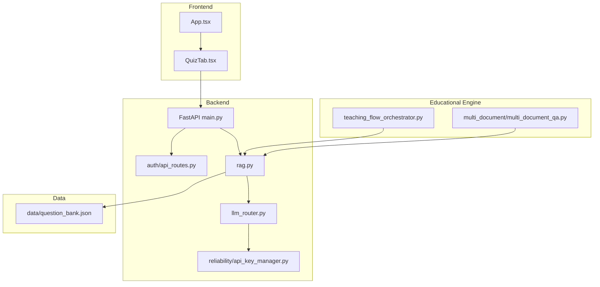
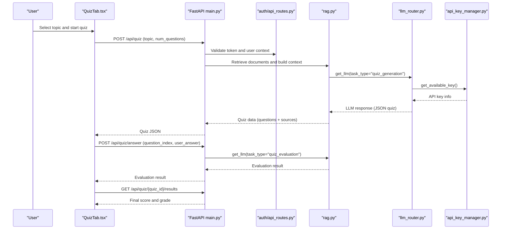
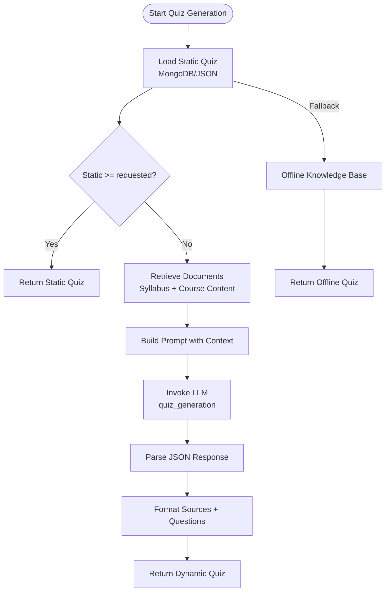
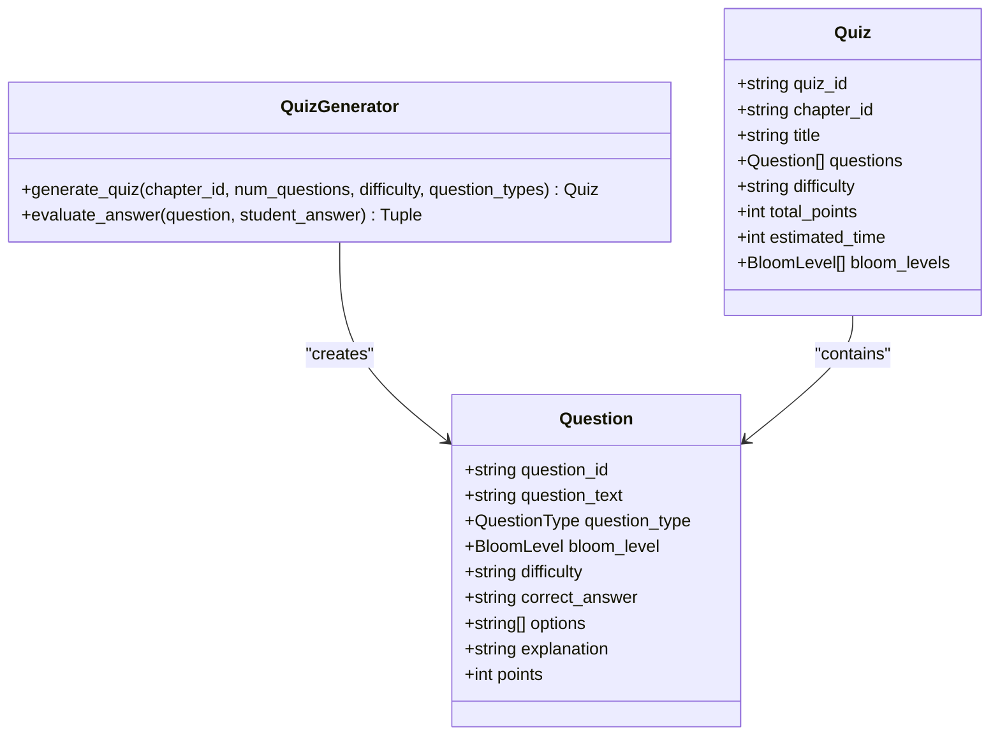
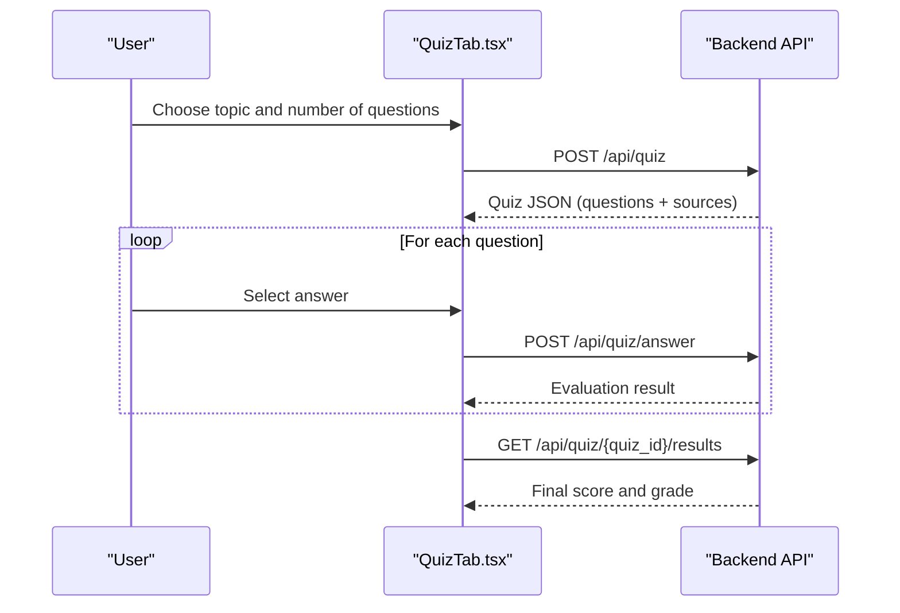
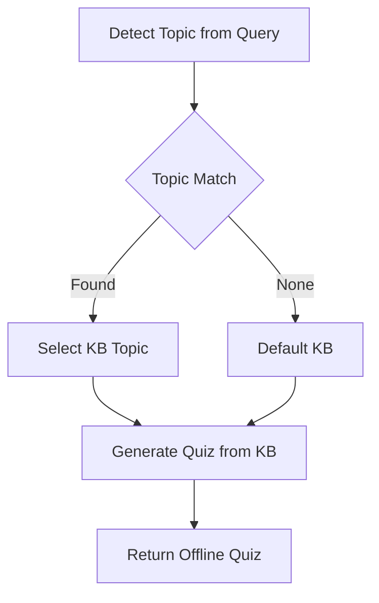
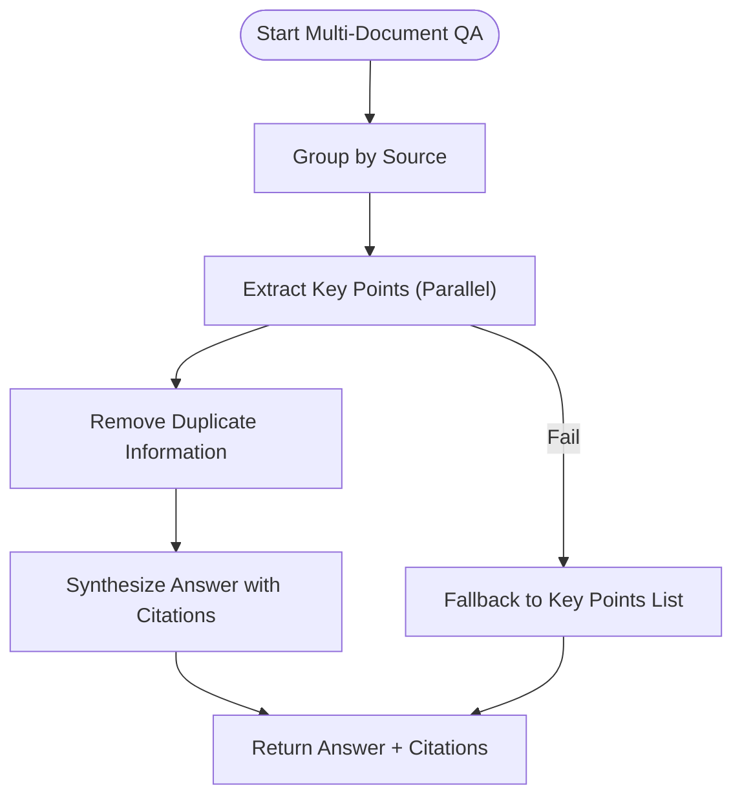
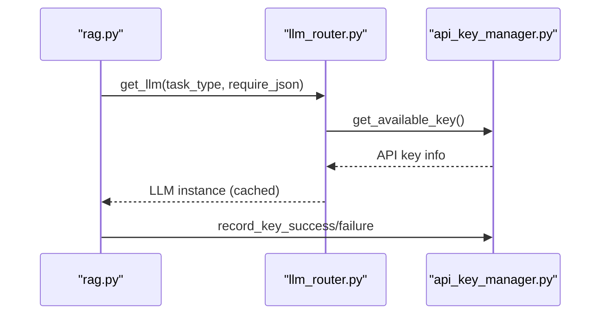
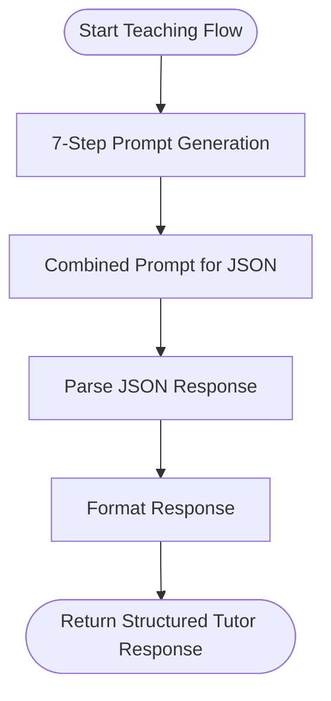
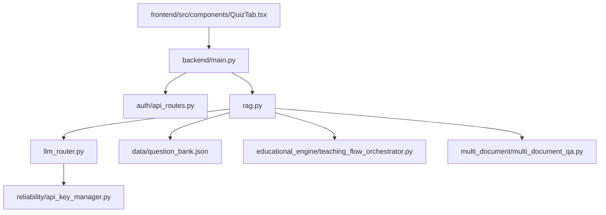

# Interactive Quiz System

<cite>
**Referenced Files in This Document**
- [quiz_system.py](file://quiz_system.py)
- [quiz_generator.py](file://quiz_generator.py)
- [frontend/src/components/QuizTab.tsx](file://frontend/src/components/QuizTab.tsx)
- [backend/main.py](file://backend/main.py)
- [data/question_bank.json](file://data/question_bank.json)
- [auth/api_routes.py](file://auth/api_routes.py)
- [reliability/api_key_manager.py](file://reliability/api_key_manager.py)
- [educational_engine/teaching_flow_orchestrator.py](file://educational_engine/teaching_flow_orchestrator.py)
- [multi_document/multi_document_qa.py](file://multi_document/multi_document_qa.py)
- [llm_router.py](file://llm_router.py)
- [rag.py](file://rag.py)
- [frontend/src/App.tsx](file://frontend/src/App.tsx)
</cite>

## Table of Contents
1. [Introduction](#introduction)
2. [Project Structure](#project-structure)
3. [Core Components](#core-components)
4. [Architecture Overview](#architecture-overview)
5. [Detailed Component Analysis](#detailed-component-analysis)
6. [Dependency Analysis](#dependency-analysis)
7. [Performance Considerations](#performance-considerations)
8. [Troubleshooting Guide](#troubleshooting-guide)
9. [Conclusion](#conclusion)
10. [Appendices](#appendices)

## Introduction
This document describes the Interactive Quiz System, focusing on the auto-generated quiz creation process, question categorization by topic, and assessment evaluation mechanisms. It explains the end-to-end workflow from topic selection to question delivery, covering multiple question types and difficulty levels. It also documents the integration with the offline knowledge base for quiz fallback, multi-document question answering capabilities, and real-time quiz administration. Examples illustrate quiz creation, typical student interaction patterns, and performance tracking.

## Project Structure
The system comprises:
- Backend API exposing quiz endpoints and integrating with retrieval and LLM routing
- Frontend React application enabling topic selection, quiz delivery, and real-time evaluation
- Educational engine components supporting pedagogical orchestration and multi-document QA
- Reliability layer managing API keys and fallback strategies
- Offline knowledge base for quiz fallback and offline explanations

**Diagram sources**
- [frontend/src/components/QuizTab.tsx:1-800](file://frontend/src/components/QuizTab.tsx#L1-800)
- [frontend/src/App.tsx:1-311](file://frontend/src/App.tsx#L1-311)
- [backend/main.py:1-69](file://backend/main.py#L1-69)
- [auth/api_routes.py:1-352](file://auth/api_routes.py#L1-352)
- [rag.py:1-800](file://rag.py#L1-800)
- [llm_router.py:1-143](file://llm_router.py#L1-143)
- [reliability/api_key_manager.py:1-357](file://reliability/api_key_manager.py#L1-357)
- [educational_engine/teaching_flow_orchestrator.py:1-511](file://educational_engine/teaching_flow_orchestrator.py#L1-511)
- [multi_document/multi_document_qa.py:1-440](file://multi_document/multi_document_qa.py#L1-440)
- [data/question_bank.json:1-69](file://data/question_bank.json#L1-69)

**Section sources**
- [frontend/src/components/QuizTab.tsx:1-800](file://frontend/src/components/QuizTab.tsx#L1-800)
- [frontend/src/App.tsx:1-311](file://frontend/src/App.tsx#L1-311)
- [backend/main.py:1-69](file://backend/main.py#L1-69)
- [auth/api_routes.py:1-352](file://auth/api_routes.py#L1-352)
- [rag.py:1-800](file://rag.py#L1-800)
- [llm_router.py:1-143](file://llm_router.py#L1-143)
- [reliability/api_key_manager.py:1-357](file://reliability/api_key_manager.py#L1-357)
- [educational_engine/teaching_flow_orchestrator.py:1-511](file://educational_engine/teaching_flow_orchestrator.py#L1-511)
- [multi_document/multi_document_qa.py:1-440](file://multi_document/multi_document_qa.py#L1-440)
- [data/question_bank.json:1-69](file://data/question_bank.json#L1-69)

## Core Components
- Quiz Generation and Evaluation
  - Static quiz loading from MongoDB or local JSON bank
  - Dynamic quiz generation via retrieval augmented prompts and LLMs
  - Evaluation of multiple-choice and short-answer responses with fallbacks
  - Offline knowledge base fallback for quiz generation and explanations
- Frontend Quiz Experience
  - Topic selection, question delivery, real-time evaluation, and results
  - Personalized weak-topic suggestions and library modal for curated quizzes
- Backend API and Routing
  - FastAPI endpoints for quiz lifecycle and user personalization
  - LLM routing with caching and fallback strategies
  - API key rotation and quota management for resilience
- Educational Engine and Multi-Document QA
  - Pedagogical orchestration for tutor-style responses
  - Multi-document QA with key-point extraction and synthesis

**Section sources**
- [quiz_system.py:11-482](file://quiz_system.py#L11-482)
- [quiz_generator.py:1-362](file://quiz_generator.py#L1-362)
- [frontend/src/components/QuizTab.tsx:1-800](file://frontend/src/components/QuizTab.tsx#L1-800)
- [backend/main.py:1-69](file://backend/main.py#L1-69)
- [auth/api_routes.py:144-161](file://auth/api_routes.py#L144-161)
- [llm_router.py:54-143](file://llm_router.py#L54-143)
- [reliability/api_key_manager.py:37-357](file://reliability/api_key_manager.py#L37-357)
- [educational_engine/teaching_flow_orchestrator.py:35-416](file://educational_engine/teaching_flow_orchestrator.py#L35-416)
- [multi_document/multi_document_qa.py:71-280](file://multi_document/multi_document_qa.py#L71-280)
- [rag.py:25-366](file://rag.py#L25-366)

## Architecture Overview
The system integrates frontend, backend, retrieval, and LLM components to deliver personalized quizzes. The frontend triggers quiz creation, retrieves questions, evaluates answers, and displays results. The backend orchestrates retrieval, LLM invocation, and fallbacks. Reliability components manage API keys and model fallbacks. Educational engine components support multi-document QA and pedagogical synthesis.

**Diagram sources**
- [frontend/src/components/QuizTab.tsx:201-315](file://frontend/src/components/QuizTab.tsx#L201-315)
- [backend/main.py:1-69](file://backend/main.py#L1-69)
- [auth/api_routes.py:58-75](file://auth/api_routes.py#L58-75)
- [rag.py:1075-1197](file://rag.py#L1075-1197)
- [llm_router.py:54-143](file://llm_router.py#L54-143)
- [reliability/api_key_manager.py:132-210](file://reliability/api_key_manager.py#L132-210)

## Detailed Component Analysis

### Quiz Generation and Evaluation Pipeline
The quiz generation pipeline prioritizes static questions from MongoDB or the local JSON bank. If insufficient static questions are available, it retrieves course materials and constructs a prompt for the LLM to generate multiple-choice quizzes aligned with syllabus requirements and textbook content. The evaluation pipeline supports multiple-choice correctness checks and short-answer scoring with keyword-based fallbacks.

**Diagram sources**
- [quiz_system.py:11-282](file://quiz_system.py#L11-282)
- [rag.py:25-366](file://rag.py#L25-366)

**Section sources**
- [quiz_system.py:11-282](file://quiz_system.py#L11-282)
- [rag.py:25-366](file://rag.py#L25-366)

### Question Types and Difficulty Levels
The system supports multiple question types and difficulty levels:
- Question types: multiple choice, short answer, true/false, essay
- Difficulty levels: easy, medium, hard
- Bloom’s taxonomy integration for cognitive levels
- Point weighting and time estimation per question

**Diagram sources**
- [quiz_generator.py:30-155](file://quiz_generator.py#L30-155)

**Section sources**
- [quiz_generator.py:12-291](file://quiz_generator.py#L12-291)

### Frontend Quiz Interaction Patterns
The frontend provides:
- Topic selection with icons and descriptions
- Personalized weak-topic suggestions and completed-topic indicators
- Library modal for curated quizzes
- Real-time timer, progress tracking, and navigation
- Submission flow with individual question evaluation and final score computation

**Diagram sources**
- [frontend/src/components/QuizTab.tsx:201-315](file://frontend/src/components/QuizTab.tsx#L201-315)

**Section sources**
- [frontend/src/components/QuizTab.tsx:116-654](file://frontend/src/components/QuizTab.tsx#L116-654)

### Offline Knowledge Base Integration
The offline knowledge base provides:
- Static quiz questions categorized by topic
- Offline explanations for common data mining topics
- Fallback quiz generation when LLM APIs are unavailable

**Diagram sources**
- [rag.py:472-504](file://rag.py#L472-504)
- [rag.py:912-936](file://rag.py#L912-936)

**Section sources**
- [rag.py:25-366](file://rag.py#L25-366)
- [rag.py:472-504](file://rag.py#L472-504)
- [rag.py:912-936](file://rag.py#L912-936)
- [data/question_bank.json:1-69](file://data/question_bank.json#L1-69)

### Multi-Document Question Answering
Multi-document QA extracts key points from multiple sources, removes duplicates, and synthesizes a coherent answer with inline citations. It supports fallbacks when synthesis fails.

**Diagram sources**
- [multi_document/multi_document_qa.py:79-279](file://multi_document/multi_document_qa.py#L79-279)

**Section sources**
- [multi_document/multi_document_qa.py:71-280](file://multi_document/multi_document_qa.py#L71-280)

### LLM Routing and Reliability
The LLM router caches instances, checks Ollama availability, and falls back to Gemini when needed. The API key manager rotates keys, tracks quotas, and applies cooldowns for overloaded or quota-limited responses.

**Diagram sources**
- [llm_router.py:54-143](file://llm_router.py#L54-143)
- [reliability/api_key_manager.py:132-210](file://reliability/api_key_manager.py#L132-210)

**Section sources**
- [llm_router.py:1-143](file://llm_router.py#L1-143)
- [reliability/api_key_manager.py:37-357](file://reliability/api_key_manager.py#L37-357)

### Pedagogical Orchestration
The teaching flow orchestrator structures tutor responses across seven steps: intuitive explanation, real-world example, technical explanation, mechanism breakdown, common mistakes, quick summary, and understanding check. It adapts prompts based on learner level and question type.

**Diagram sources**
- [educational_engine/teaching_flow_orchestrator.py:193-330](file://educational_engine/teaching_flow_orchestrator.py#L193-330)
- [educational_engine/teaching_flow_orchestrator.py:332-416](file://educational_engine/teaching_flow_orchestrator.py#L332-416)

**Section sources**
- [educational_engine/teaching_flow_orchestrator.py:1-511](file://educational_engine/teaching_flow_orchestrator.py#L1-511)

## Dependency Analysis
The system exhibits clear layering:
- Frontend depends on backend endpoints and user authentication
- Backend depends on authentication, retrieval, and LLM routing
- Retrieval and LLM components depend on reliability for API key management
- Educational engine components integrate with retrieval for multi-document QA and explanations

**Diagram sources**
- [frontend/src/components/QuizTab.tsx:1-800](file://frontend/src/components/QuizTab.tsx#L1-800)
- [backend/main.py:1-69](file://backend/main.py#L1-69)
- [auth/api_routes.py:1-352](file://auth/api_routes.py#L1-352)
- [rag.py:1-800](file://rag.py#L1-800)
- [llm_router.py:1-143](file://llm_router.py#L1-143)
- [reliability/api_key_manager.py:1-357](file://reliability/api_key_manager.py#L1-357)
- [educational_engine/teaching_flow_orchestrator.py:1-511](file://educational_engine/teaching_flow_orchestrator.py#L1-511)
- [multi_document/multi_document_qa.py:1-440](file://multi_document/multi_document_qa.py#L1-440)
- [data/question_bank.json:1-69](file://data/question_bank.json#L1-69)

**Section sources**
- [frontend/src/components/QuizTab.tsx:1-800](file://frontend/src/components/QuizTab.tsx#L1-800)
- [backend/main.py:1-69](file://backend/main.py#L1-69)
- [auth/api_routes.py:1-352](file://auth/api_routes.py#L1-352)
- [rag.py:1-800](file://rag.py#L1-800)
- [llm_router.py:1-143](file://llm_router.py#L1-143)
- [reliability/api_key_manager.py:1-357](file://reliability/api_key_manager.py#L1-357)
- [educational_engine/teaching_flow_orchestrator.py:1-511](file://educational_engine/teaching_flow_orchestrator.py#L1-511)
- [multi_document/multi_document_qa.py:1-440](file://multi_document/multi_document_qa.py#L1-440)
- [data/question_bank.json:1-69](file://data/question_bank.json#L1-69)

## Performance Considerations
- LLM caching reduces repeated initialization overhead
- Parallel key point extraction in multi-document QA minimizes latency
- API key rotation and fallbacks improve resilience under rate limits
- Static quiz fallback avoids LLM calls when sufficient offline questions exist
- Frontend timers and batched evaluations reduce network overhead during quiz sessions

[No sources needed since this section provides general guidance]

## Troubleshooting Guide
Common issues and resolutions:
- No API keys available: The system switches to offline mode and uses the offline knowledge base for quiz generation and explanations.
- Rate limit/quota exceeded: The API key manager marks keys unhealthy and applies cooldowns; the system retries with alternate keys or falls back to simpler models.
- LLM response parsing failures: The system strips markdown code blocks and falls back to offline quiz generation.
- Short-answer evaluation failures: The system performs keyword-based scoring when LLM evaluation is unavailable.

**Section sources**
- [reliability/api_key_manager.py:178-210](file://reliability/api_key_manager.py#L178-210)
- [quiz_system.py:227-232](file://quiz_system.py#L227-232)
- [quiz_system.py:381-404](file://quiz_system.py#L381-404)
- [rag.py:939-998](file://rag.py#L939-998)

## Conclusion
The Interactive Quiz System combines robust retrieval, reliable LLM routing, and a resilient offline fallback to deliver personalized, curriculum-aligned quizzes. The frontend enables seamless topic selection and real-time evaluation, while backend services ensure reliability and scalability. The educational engine and multi-document QA components enhance the learning experience with structured explanations and synthesized answers.

[No sources needed since this section summarizes without analyzing specific files]

## Appendices

### Example Workflows

#### Quiz Creation Workflow
- User selects a topic and number of questions
- Backend loads static questions; if insufficient, retrieves documents and generates dynamic quiz
- Quiz is returned to the frontend for display and evaluation

**Section sources**
- [frontend/src/components/QuizTab.tsx:201-252](file://frontend/src/components/QuizTab.tsx#L201-252)
- [quiz_system.py:52-232](file://quiz_system.py#L52-232)

#### Student Interaction Patterns
- Browse topics and weak areas
- Navigate questions with progress and timer
- Submit answers individually and receive immediate feedback
- View final score and grade

**Section sources**
- [frontend/src/components/QuizTab.tsx:348-654](file://frontend/src/components/QuizTab.tsx#L348-654)
- [frontend/src/components/QuizTab.tsx:266-315](file://frontend/src/components/QuizTab.tsx#L266-315)

#### Performance Tracking
- Quiz scoring aggregates per-question scores into total and percentage
- Grading converts percentages into letter grades

**Section sources**
- [quiz_system.py:449-482](file://quiz_system.py#L449-482)