# Data Lifecycle & Security

<cite>
**Referenced Files in This Document**
- [metadata_enricher.py](file://metadata_enricher.py)
- [export_utils.py](file://export_utils.py)
- [rebuild_vectorstore.py](file://rebuild_vectorstore.py)
- [security/security_logger.py](file://security/security_logger.py)
- [security/encryption.py](file://security/encryption.py)
- [security/middleware.py](file://security/middleware.py)
- [security/rate_limiter.py](file://security/rate_limiter.py)
- [embed_store.py](file://embed_store.py)
- [loader.py](file://loader.py)
- [config.py](file://config.py)
- [auth/auth_manager.py](file://auth/auth_manager.py)
- [docker-compose.production.yml](file://docker-compose.production.yml)
- [enterprise/src/core/config.py](file://enterprise/src/core/config.py)
</cite>

## Table of Contents
1. [Introduction](#introduction)
2. [Project Structure](#project-structure)
3. [Core Components](#core-components)
4. [Architecture Overview](#architecture-overview)
5. [Detailed Component Analysis](#detailed-component-analysis)
6. [Dependency Analysis](#dependency-analysis)
7. [Performance Considerations](#performance-considerations)
8. [Troubleshooting Guide](#troubleshooting-guide)
9. [Conclusion](#conclusion)
10. [Appendices](#appendices)

## Introduction
This document describes data lifecycle management and security practices in MinerAI. It covers metadata enrichment processes, data export utilities, and vector store rebuilding procedures. It also explains data retention policies, backup and recovery mechanisms, and security considerations for sensitive educational data. Procedures for data anonymization, access controls, audit logging, compliance requirements, data migration, system maintenance, and disaster recovery planning are documented to ensure robust and secure operation of the system.

## Project Structure
MinerAI organizes data lifecycle and security concerns across several modules:
- Data ingestion and chunking: loader and embed_store
- Metadata enrichment: metadata_enricher
- Vector store persistence and rebuild: embed_store and rebuild_vectorstore
- Security: encryption, security_logger, middleware, rate_limiter
- Access control and auditing: auth_manager
- Configuration and deployment: config, enterprise config, docker-compose

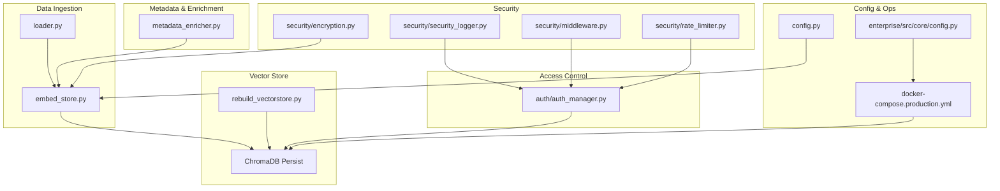

**Diagram sources**
- [loader.py:1-445](file://loader.py#L1-L445)
- [embed_store.py:1-110](file://embed_store.py#L1-L110)
- [metadata_enricher.py:1-268](file://metadata_enricher.py#L1-L268)
- [rebuild_vectorstore.py:1-55](file://rebuild_vectorstore.py#L1-L55)
- [security/encryption.py:1-368](file://security/encryption.py#L1-L368)
- [security/security_logger.py:1-395](file://security/security_logger.py#L1-L395)
- [security/middleware.py:1-320](file://security/middleware.py#L1-L320)
- [security/rate_limiter.py:1-256](file://security/rate_limiter.py#L1-L256)
- [auth/auth_manager.py:1-393](file://auth/auth_manager.py#L1-L393)
- [config.py:1-218](file://config.py#L1-L218)
- [enterprise/src/core/config.py:1-200](file://enterprise/src/core/config.py#L1-L200)
- [docker-compose.production.yml:1-359](file://docker-compose.production.yml#L1-L359)

**Section sources**
- [loader.py:1-445](file://loader.py#L1-L445)
- [embed_store.py:1-110](file://embed_store.py#L1-L110)
- [metadata_enricher.py:1-268](file://metadata_enricher.py#L1-L268)
- [rebuild_vectorstore.py:1-55](file://rebuild_vectorstore.py#L1-L55)
- [security/encryption.py:1-368](file://security/encryption.py#L1-L368)
- [security/security_logger.py:1-395](file://security/security_logger.py#L1-L395)
- [security/middleware.py:1-320](file://security/middleware.py#L1-L320)
- [security/rate_limiter.py:1-256](file://security/rate_limiter.py#L1-L256)
- [auth/auth_manager.py:1-393](file://auth/auth_manager.py#L1-L393)
- [config.py:1-218](file://config.py#L1-L218)
- [enterprise/src/core/config.py:1-200](file://enterprise/src/core/config.py#L1-L200)
- [docker-compose.production.yml:1-359](file://docker-compose.production.yml#L1-L359)

## Core Components
- Metadata Enricher: Adds educational metadata to chunks (difficulty, Bloom’s level, teaching strategy, importance, keywords, prerequisites).
- Export Utilities: Provides exports to Markdown and TXT formats for conversations.
- Vector Store Rebuilder: Backs up and recreates ChromaDB vector store from source documents.
- Encryption Manager: Symmetric encryption and hashing for sensitive data.
- Security Logger: Structured security event logging with suspicious activity detection.
- Security Middleware: Input validation, sanitization, CSRF protection, and security headers.
- Rate Limiter: Sliding window rate limiting with configurable thresholds.
- Auth Manager: JWT-based authentication, password hashing, user profiles, and interaction logging.
- Configuration: Centralized settings for models, chunking, caching, logging, and rate limiting.
- Enterprise Configuration: Pydantic-based settings for production-grade deployments.
- Docker Compose: Multi-service orchestration including Redis, MongoDB, and API gateway.

**Section sources**
- [metadata_enricher.py:10-268](file://metadata_enricher.py#L10-L268)
- [export_utils.py:1-66](file://export_utils.py#L1-L66)
- [rebuild_vectorstore.py:1-55](file://rebuild_vectorstore.py#L1-L55)
- [security/encryption.py:26-368](file://security/encryption.py#L26-L368)
- [security/security_logger.py:39-395](file://security/security_logger.py#L39-L395)
- [security/middleware.py:20-320](file://security/middleware.py#L20-L320)
- [security/rate_limiter.py:21-256](file://security/rate_limiter.py#L21-L256)
- [auth/auth_manager.py:58-393](file://auth/auth_manager.py#L58-L393)
- [config.py:1-218](file://config.py#L1-L218)
- [enterprise/src/core/config.py:18-200](file://enterprise/src/core/config.py#L18-L200)
- [docker-compose.production.yml:1-359](file://docker-compose.production.yml#L1-L359)

## Architecture Overview
The system ingests documents, creates embeddings, persists them in ChromaDB, enriches metadata for educational context, and secures operations with encryption, rate limiting, and audit logging. Authentication integrates with MongoDB for user management and interaction logging.

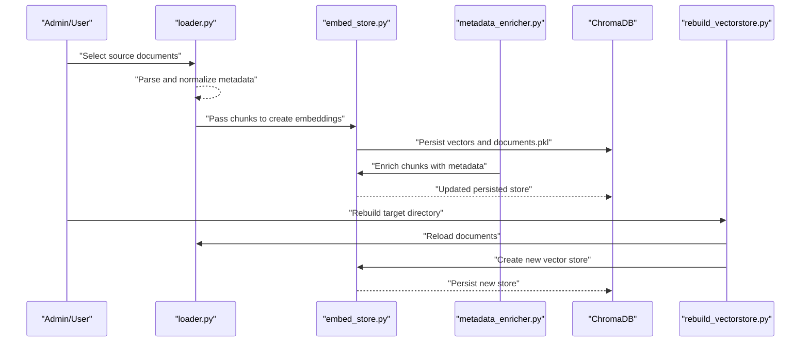

**Diagram sources**
- [loader.py:396-445](file://loader.py#L396-L445)
- [embed_store.py:39-110](file://embed_store.py#L39-L110)
- [metadata_enricher.py:187-220](file://metadata_enricher.py#L187-L220)
- [rebuild_vectorstore.py:33-55](file://rebuild_vectorstore.py#L33-L55)

## Detailed Component Analysis

### Metadata Enrichment
Purpose: Enhance chunks with educational metadata to improve pedagogical relevance and retrieval quality.

Key capabilities:
- Loads course knowledge graph and derives chapter/topic metadata.
- Computes difficulty, Bloom’s taxonomy level, importance, teaching strategy, prerequisites, and keywords.
- Enriches batches of chunks and supports demo enrichment.

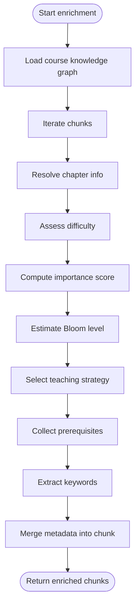

**Diagram sources**
- [metadata_enricher.py:32-89](file://metadata_enricher.py#L32-L89)
- [metadata_enricher.py:187-220](file://metadata_enricher.py#L187-L220)

**Section sources**
- [metadata_enricher.py:10-268](file://metadata_enricher.py#L10-L268)

### Data Export Utilities
Purpose: Provide standardized exports of conversation history for user review and archiving.

Capabilities:
- Export to Markdown with role-based sections.
- Export to plain TXT with timestamps and roles.
- Formatting helper for UI display.

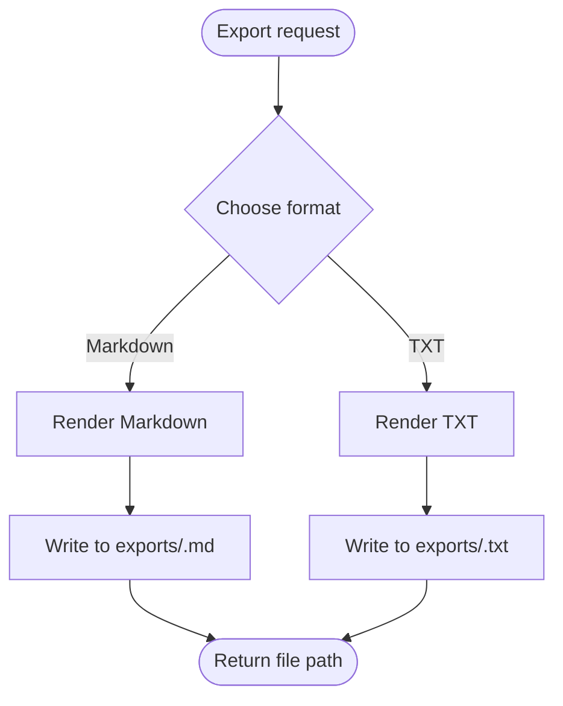

**Diagram sources**
- [export_utils.py:11-31](file://export_utils.py#L11-L31)
- [export_utils.py:34-55](file://export_utils.py#L34-L55)

**Section sources**
- [export_utils.py:1-66](file://export_utils.py#L1-L66)

### Vector Store Rebuilding
Purpose: Safely back up and rebuild the ChromaDB vector store during maintenance or upgrades.

Process:
- Backup existing directory to a “_backup” sibling.
- Delete old directory; handle permission locks by renaming.
- Reload documents from data/, create embeddings, persist to target directory.

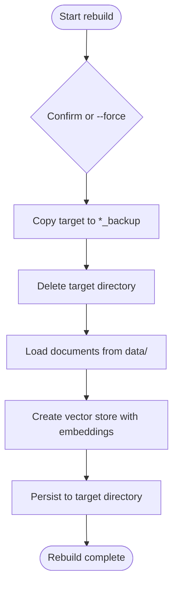

**Diagram sources**
- [rebuild_vectorstore.py:12-55](file://rebuild_vectorstore.py#L12-L55)
- [embed_store.py:39-66](file://embed_store.py#L39-L66)
- [loader.py:396-445](file://loader.py#L396-L445)

**Section sources**
- [rebuild_vectorstore.py:1-55](file://rebuild_vectorstore.py#L1-L55)
- [embed_store.py:1-110](file://embed_store.py#L1-L110)
- [loader.py:1-445](file://loader.py#L1-L445)

### Security Logging and Audit Trail
Purpose: Maintain a structured, auditable record of security events with suspicious activity detection.

Key features:
- Enumerated event types (login, logout, registration, data access/modification, rate limit exceeded, encryption/authentication errors).
- JSON-formatted logs with timestamps, user identity, IP, and severity.
- Suspicious activity detection and alerting thresholds.
- Statistics aggregation and recent event retrieval.

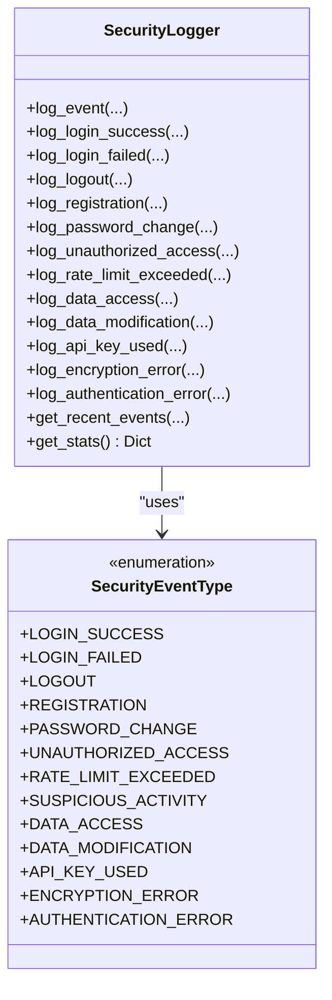

**Diagram sources**
- [security/security_logger.py:22-395](file://security/security_logger.py#L22-L395)

**Section sources**
- [security/security_logger.py:1-395](file://security/security_logger.py#L1-L395)

### Encryption and Data Protection
Purpose: Protect sensitive data at rest and in transit using symmetric encryption and hashing.

Highlights:
- Fernet-based symmetric encryption with environment-managed keys.
- PBKDF2-derived keys from passwords.
- Encryption/decryption of conversation histories, individual fields, and dictionaries.
- Hashing and verification utilities.

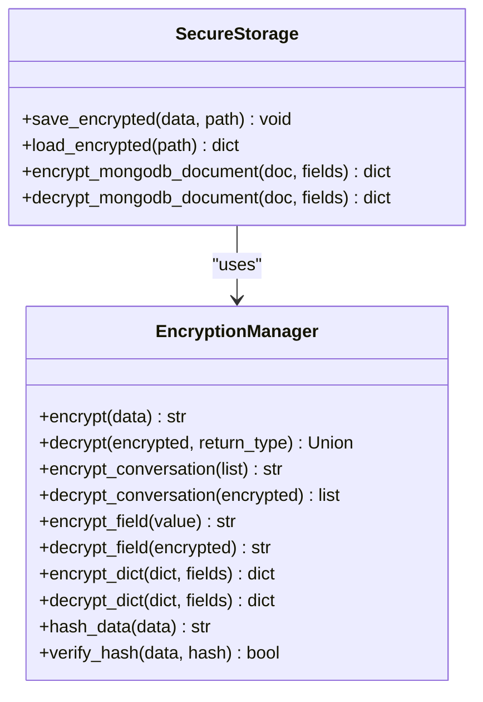

**Diagram sources**
- [security/encryption.py:26-307](file://security/encryption.py#L26-L307)

**Section sources**
- [security/encryption.py:1-368](file://security/encryption.py#L1-L368)

### Security Middleware and Input Sanitization
Purpose: Prevent common attacks and sanitize inputs across the platform.

Capabilities:
- SQL injection and XSS pattern detection.
- HTML escaping and null-byte removal.
- CSRF token generation and verification.
- Security headers for CSP, HSTS, frame options, etc.
- Email and username validation.
- Filename sanitization and allowed extension checks.

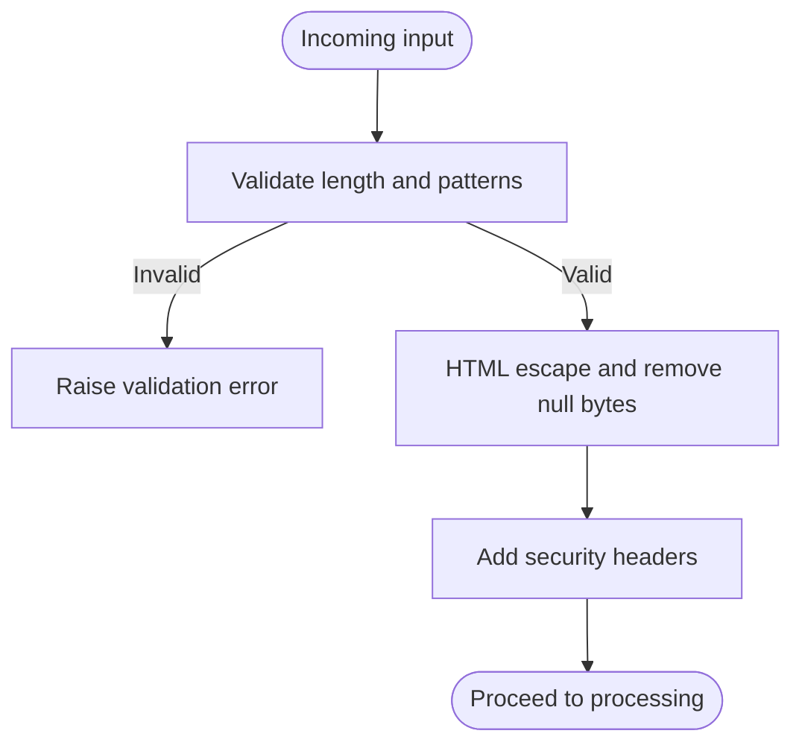

**Diagram sources**
- [security/middleware.py:49-124](file://security/middleware.py#L49-L124)

**Section sources**
- [security/middleware.py:1-320](file://security/middleware.py#L1-L320)

### Rate Limiting
Purpose: Protect APIs from abuse with sliding window rate limiting.

Behavior:
- Tracks requests per minute, hour, and day.
- Blocks clients exceeding thresholds with escalating durations.
- Provides remaining requests and statistics.

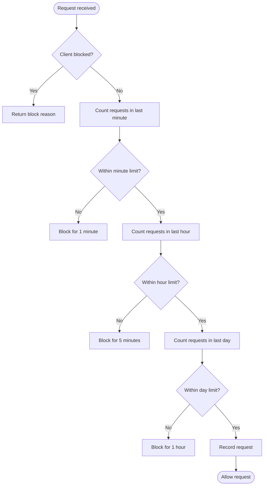

**Diagram sources**
- [security/rate_limiter.py:81-126](file://security/rate_limiter.py#L81-L126)

**Section sources**
- [security/rate_limiter.py:1-256](file://security/rate_limiter.py#L1-L256)

### Access Controls and Authentication
Purpose: Manage user identities, enforce authorization, and maintain interaction logs.

Features:
- JWT-based access tokens with expiration.
- Password hashing using bcrypt.
- Fallback to local JSON storage when MongoDB is unavailable.
- Interaction logging for pedagogical analytics.
- Weak topic and completed topic discovery from logs.

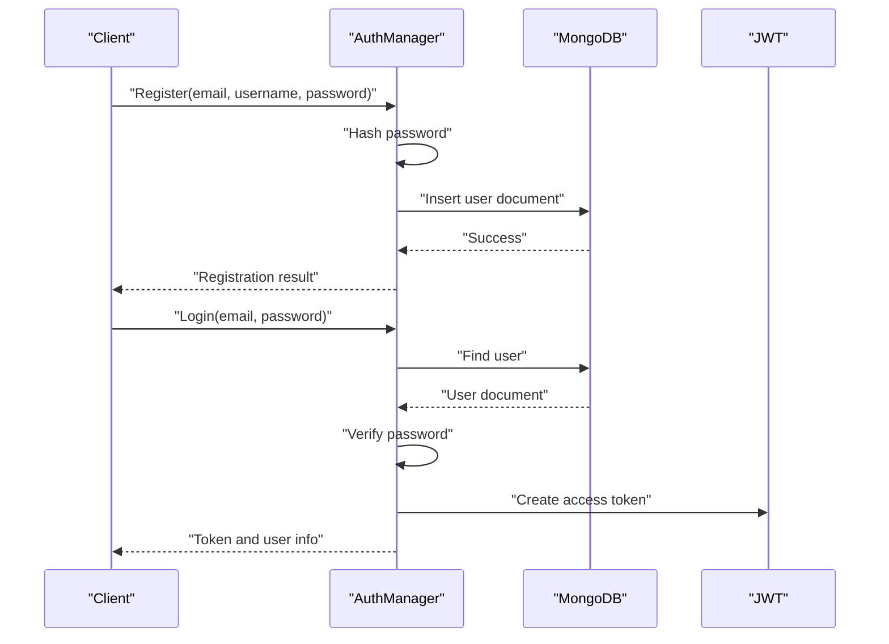

**Diagram sources**
- [auth/auth_manager.py:126-217](file://auth/auth_manager.py#L126-L217)

**Section sources**
- [auth/auth_manager.py:1-393](file://auth/auth_manager.py#L1-L393)

### Configuration and Deployment
Purpose: Centralize configuration and define production-grade deployment topology.

Highlights:
- Centralized settings for models, chunking, caching, logging, and rate limiting.
- Enterprise configuration with Pydantic validation and environment-specific overrides.
- Docker Compose orchestrates API gateway, frontend, services, Redis, MongoDB, and monitoring.

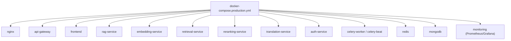

**Diagram sources**
- [docker-compose.production.yml:1-359](file://docker-compose.production.yml#L1-L359)
- [config.py:1-218](file://config.py#L1-L218)
- [enterprise/src/core/config.py:1-200](file://enterprise/src/core/config.py#L1-L200)

**Section sources**
- [config.py:1-218](file://config.py#L1-L218)
- [enterprise/src/core/config.py:1-200](file://enterprise/src/core/config.py#L1-L200)
- [docker-compose.production.yml:1-359](file://docker-compose.production.yml#L1-L359)

## Dependency Analysis
- Loader depends on LangChain document loaders and configuration for embedding model selection.
- Embed store depends on loader outputs and persists to ChromaDB with documents.pkl for BM25 indexing.
- Metadata enricher depends on course knowledge graph and enriches chunk metadata prior to persistence.
- Security components are standalone but integrate with auth and API layers.
- Enterprise configuration complements development config for production deployments.

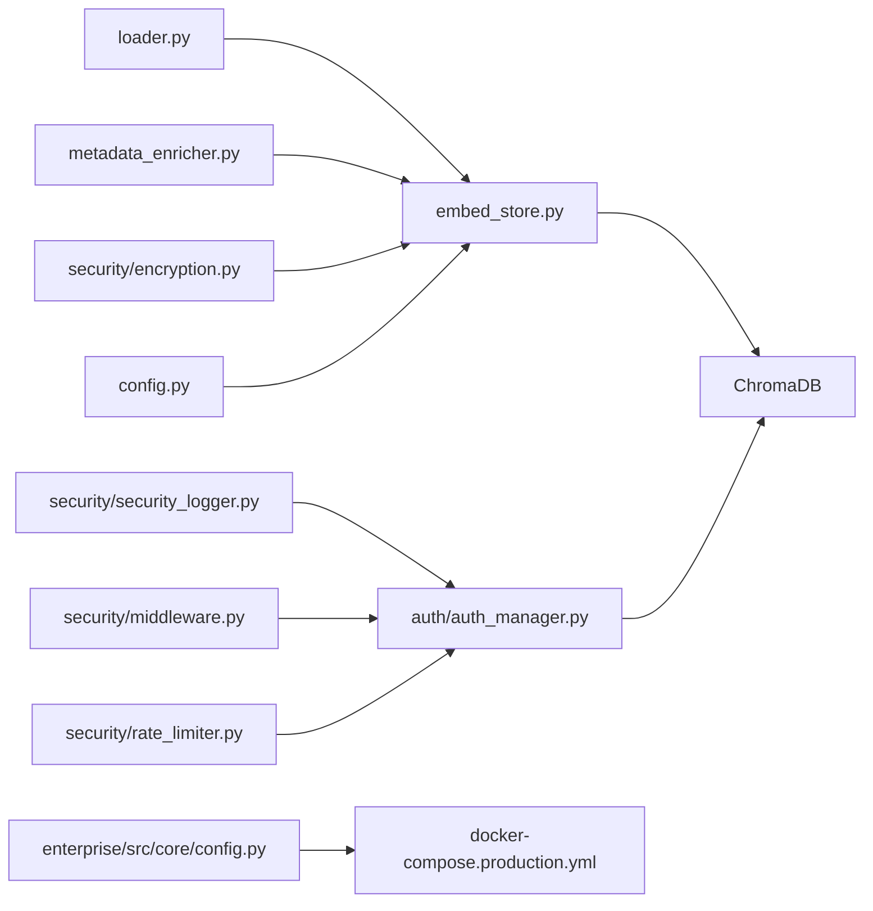

**Diagram sources**
- [loader.py:1-445](file://loader.py#L1-L445)
- [embed_store.py:1-110](file://embed_store.py#L1-L110)
- [metadata_enricher.py:1-268](file://metadata_enricher.py#L1-L268)
- [auth/auth_manager.py:1-393](file://auth/auth_manager.py#L1-L393)
- [security/security_logger.py:1-395](file://security/security_logger.py#L1-L395)
- [security/encryption.py:1-368](file://security/encryption.py#L1-L368)
- [security/middleware.py:1-320](file://security/middleware.py#L1-L320)
- [security/rate_limiter.py:1-256](file://security/rate_limiter.py#L1-L256)
- [config.py:1-218](file://config.py#L1-L218)
- [enterprise/src/core/config.py:1-200](file://enterprise/src/core/config.py#L1-L200)
- [docker-compose.production.yml:1-359](file://docker-compose.production.yml#L1-L359)

**Section sources**
- [loader.py:1-445](file://loader.py#L1-L445)
- [embed_store.py:1-110](file://embed_store.py#L1-L110)
- [metadata_enricher.py:1-268](file://metadata_enricher.py#L1-L268)
- [auth/auth_manager.py:1-393](file://auth/auth_manager.py#L1-L393)
- [security/security_logger.py:1-395](file://security/security_logger.py#L1-L395)
- [security/encryption.py:1-368](file://security/encryption.py#L1-L368)
- [security/middleware.py:1-320](file://security/middleware.py#L1-L320)
- [security/rate_limiter.py:1-256](file://security/rate_limiter.py#L1-L256)
- [config.py:1-218](file://config.py#L1-L218)
- [enterprise/src/core/config.py:1-200](file://enterprise/src/core/config.py#L1-L200)
- [docker-compose.production.yml:1-359](file://docker-compose.production.yml#L1-L359)

## Performance Considerations
- Embedding caching and batch sizes reduce latency and resource usage.
- Hybrid retrieval and optional reranking balance recall and precision.
- Rate limiting prevents overload and ensures fair usage.
- Vector store persistence and BM25 documents.pkl enable fast reloads.
- Containerized deployment with resource limits and health checks improves stability.

[No sources needed since this section provides general guidance]

## Troubleshooting Guide
Common issues and resolutions:
- Vector store rebuild fails due to locked files: rename target directory and retry after stopping backend.
- Permission denied on deletion: ensure backend is stopped; the rebuild script handles renaming to avoid data loss.
- Security logger not capturing events: verify log directory creation and file permissions.
- Encryption key missing: set ENCRYPTION_KEY in environment; the manager can generate a new key for development.
- Rate limit exceeded: adjust thresholds or wait for cooldown windows.
- Authentication failures: confirm JWT secret, MongoDB connectivity, and user credentials.

**Section sources**
- [rebuild_vectorstore.py:19-31](file://rebuild_vectorstore.py#L19-L31)
- [security/security_logger.py:50-52](file://security/security_logger.py#L50-L52)
- [security/encryption.py:38-53](file://security/encryption.py#L38-L53)
- [security/rate_limiter.py:81-126](file://security/rate_limiter.py#L81-L126)
- [auth/auth_manager.py:61-87](file://auth/auth_manager.py#L61-L87)

## Conclusion
MinerAI implements a comprehensive data lifecycle and security framework. Documents are ingested, enriched with pedagogical metadata, embedded, and persisted in ChromaDB. Security is enforced through encryption, rate limiting, input sanitization, audit logging, and robust authentication. Configuration and deployment artifacts support scalable, production-ready operations with clear procedures for maintenance, migration, and disaster recovery.

[No sources needed since this section summarizes without analyzing specific files]

## Appendices

### Data Retention Policies
- Logs: Managed by centralized logging configuration with rotation and retention limits.
- Conversations: Exportable via export utilities; consider retention periods aligned with institutional policy.
- Vector store: Rebuilds preserve BM25 documents.pkl; backups are maintained during rebuilds.

**Section sources**
- [config.py:122-127](file://config.py#L122-L127)
- [export_utils.py:11-31](file://export_utils.py#L11-L31)
- [rebuild_vectorstore.py:12-18](file://rebuild_vectorstore.py#L12-L18)

### Backup and Recovery Mechanisms
- Vector store backup: Automatic backup to a sibling “_backup” directory during rebuild.
- Persistence: ChromaDB persists vectors; documents.pkl stored alongside for BM25.
- Disaster recovery: Restore from backup directory; redeploy services via Docker Compose.

**Section sources**
- [rebuild_vectorstore.py:12-18](file://rebuild_vectorstore.py#L12-L18)
- [embed_store.py:61-64](file://embed_store.py#L61-L64)

### Security Considerations for Sensitive Educational Data
- Encryption: Use EncryptionManager for sensitive fields and conversation histories.
- Logging: SecurityLogger records security events with structured JSON for auditability.
- Input validation: SecurityMiddleware protects against SQL injection and XSS.
- Access control: AuthManager enforces JWT-based authentication and password hashing.
- Rate limiting: RateLimiter mitigates abuse and protects system resources.

**Section sources**
- [security/encryption.py:26-176](file://security/encryption.py#L26-L176)
- [security/security_logger.py:94-137](file://security/security_logger.py#L94-L137)
- [security/middleware.py:49-98](file://security/middleware.py#L49-L98)
- [auth/auth_manager.py:88-125](file://auth/auth_manager.py#L88-L125)
- [security/rate_limiter.py:81-126](file://security/rate_limiter.py#L81-L126)

### Data Anonymization Techniques
- Export utilities produce human-readable formats suitable for sharing without personal identifiers.
- Consider removing or hashing personally identifiable information before publishing exports.

**Section sources**
- [export_utils.py:11-31](file://export_utils.py#L11-L31)

### Access Controls and Compliance Requirements
- Authentication: JWT tokens with configurable expiration; bcrypt password hashing.
- Authorization: Role-based access via user roles; MongoDB indexes for uniqueness.
- Auditing: SecurityLogger maintains audit trails; AuthManager logs interactions for analytics.
- Compliance: Centralized configuration supports environment-specific settings; enterprise config validates inputs.

**Section sources**
- [auth/auth_manager.py:101-125](file://auth/auth_manager.py#L101-L125)
- [auth/auth_manager.py:174-217](file://auth/auth_manager.py#L174-L217)
- [security/security_logger.py:296-357](file://security/security_logger.py#L296-L357)
- [config.py:138-160](file://config.py#L138-L160)
- [enterprise/src/core/config.py:136-148](file://enterprise/src/core/config.py#L136-L148)

### Procedures for Data Migration, Maintenance, and Disaster Recovery
- Migration: Rebuild vector store to new target directory; ensure backup exists; restart services.
- Maintenance: Use rebuild script with confirmation or force flag; monitor logs and statistics.
- Disaster recovery: Restore from “_backup” directory; validate vector counts and document loads.

**Section sources**
- [rebuild_vectorstore.py:46-55](file://rebuild_vectorstore.py#L46-L55)
- [embed_store.py:68-100](file://embed_store.py#L68-L100)