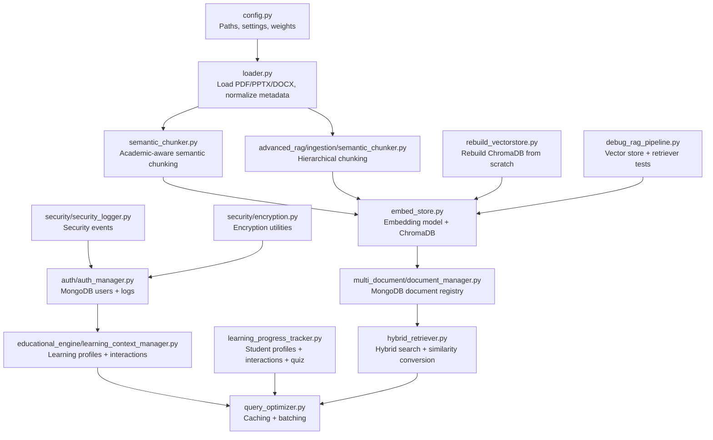
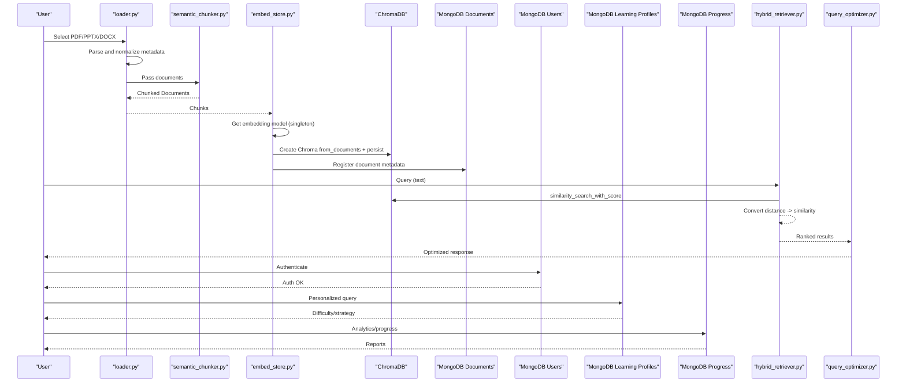
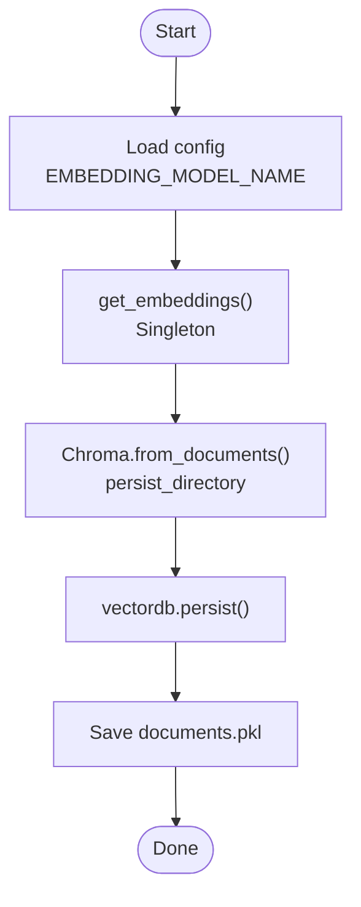
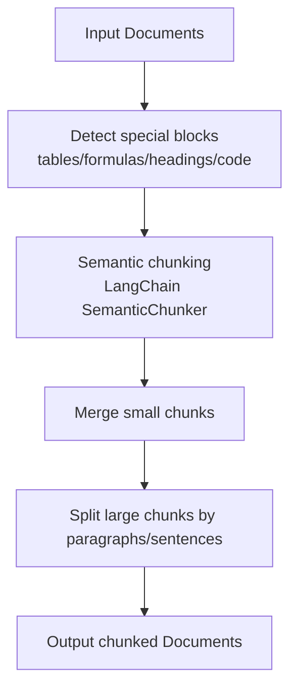
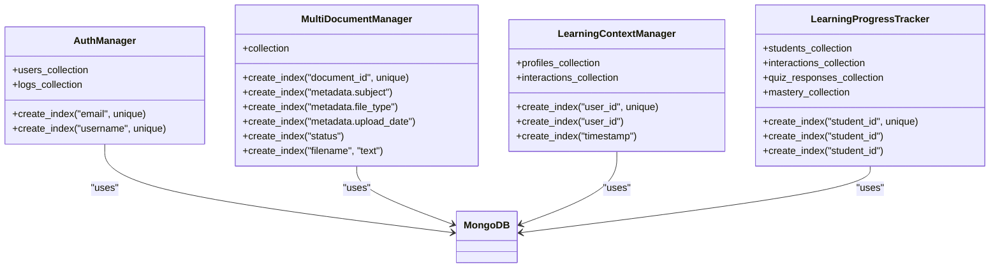
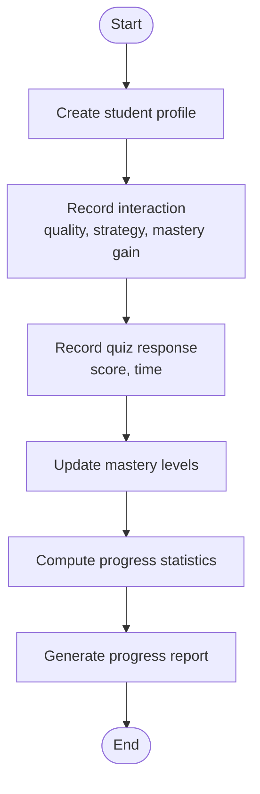
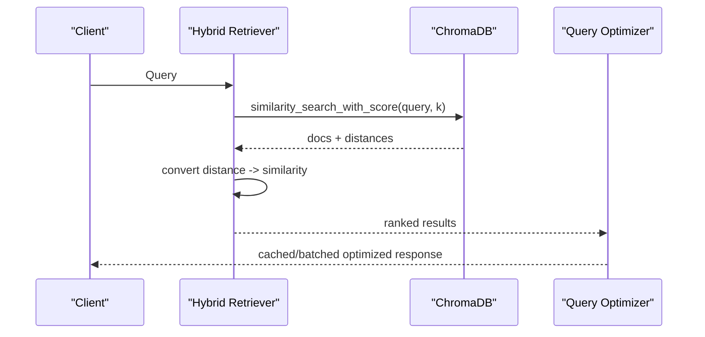
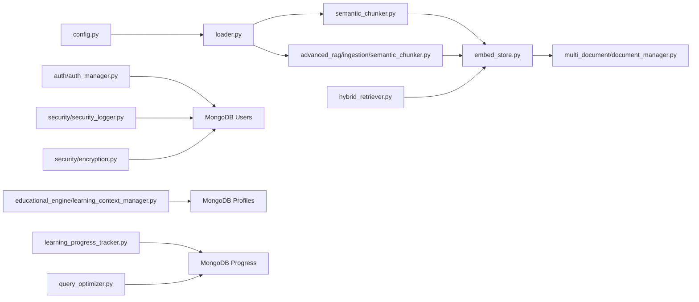

# Data Management

<cite>
**Referenced Files in This Document**
- [config.py](file://config.py)
- [loader.py](file://loader.py)
- [semantic_chunker.py](file://semantic_chunker.py)
- [advanced_rag/ingestion/semantic_chunker.py](file://advanced_rag/ingestion/semantic_chunker.py)
- [embed_store.py](file://embed_store.py)
- [rebuild_vectorstore.py](file://rebuild_vectorstore.py)
- [multi_document/document_manager.py](file://multi_document/document_manager.py)
- [educational_engine/learning_context_manager.py](file://educational_engine/learning_context_manager.py)
- [learning_progress_tracker.py](file://learning_progress_tracker.py)
- [auth/auth_manager.py](file://auth/auth_manager.py)
- [security/security_logger.py](file://security/security_logger.py)
- [security/encryption.py](file://security/encryption.py)
- [debug_rag_pipeline.py](file://debug_rag_pipeline.py)
- [hybrid_retriever.py](file://hybrid_retriever.py)
- [query_optimizer.py](file://query_optimizer.py)
</cite>

## Table of Contents
1. [Introduction](#introduction)
2. [Project Structure](#project-structure)
3. [Core Components](#core-components)
4. [Architecture Overview](#architecture-overview)
5. [Detailed Component Analysis](#detailed-component-analysis)
6. [Dependency Analysis](#dependency-analysis)
7. [Performance Considerations](#performance-considerations)
8. [Troubleshooting Guide](#troubleshooting-guide)
9. [Conclusion](#conclusion)
10. [Appendices](#appendices)

## Introduction
This document provides comprehensive data management documentation for MinerAI. It covers vector database operations with ChromaDB, chunking and embedding processes, user data management with MongoDB, and learning progress tracking. It explains the end-to-end data flow from document ingestion through vector storage, query processing, and response generation. It also includes database schema designs, indexing strategies, performance optimization techniques, data lifecycle management, backup procedures, and data security considerations.

## Project Structure
MinerAI organizes data management across several modules:
- Configuration and paths for data, cache, logs, and vector stores
- Document loaders and chunking strategies
- Vector store creation and persistence with ChromaDB
- Multi-document management with MongoDB
- Learning context and progress tracking with MongoDB
- Authentication and audit logging with MongoDB and security utilities
- Query optimization and caching for analytics and recommendations

**Diagram sources**
- [config.py:17-218](file://config.py#L17-L218)
- [loader.py:1-445](file://loader.py#L1-L445)
- [semantic_chunker.py:1-411](file://semantic_chunker.py#L1-L411)
- [advanced_rag/ingestion/semantic_chunker.py:1-334](file://advanced_rag/ingestion/semantic_chunker.py#L1-L334)
- [embed_store.py:1-70](file://embed_store.py#L1-L70)
- [rebuild_vectorstore.py:1-55](file://rebuild_vectorstore.py#L1-L55)
- [multi_document/document_manager.py:1-396](file://multi_document/document_manager.py#L1-L396)
- [auth/auth_manager.py:58-82](file://auth/auth_manager.py#L58-L82)
- [educational_engine/learning_context_manager.py:23-40](file://educational_engine/learning_context_manager.py#L23-L40)
- [learning_progress_tracker.py:58-107](file://learning_progress_tracker.py#L58-L107)
- [security/security_logger.py:1-235](file://security/security_logger.py#L1-L235)
- [security/encryption.py:208-243](file://security/encryption.py#L208-L243)
- [debug_rag_pipeline.py:234-304](file://debug_rag_pipeline.py#L234-L304)
- [hybrid_retriever.py:71-97](file://hybrid_retriever.py#L71-L97)
- [query_optimizer.py:61-282](file://query_optimizer.py#L61-L282)

**Section sources**
- [config.py:17-218](file://config.py#L17-L218)
- [loader.py:1-445](file://loader.py#L1-L445)
- [semantic_chunker.py:1-411](file://semantic_chunker.py#L1-L411)
- [advanced_rag/ingestion/semantic_chunker.py:1-334](file://advanced_rag/ingestion/semantic_chunker.py#L1-L334)
- [embed_store.py:1-70](file://embed_store.py#L1-L70)
- [rebuild_vectorstore.py:1-55](file://rebuild_vectorstore.py#L1-L55)
- [multi_document/document_manager.py:1-396](file://multi_document/document_manager.py#L1-L396)
- [auth/auth_manager.py:58-82](file://auth/auth_manager.py#L58-L82)
- [educational_engine/learning_context_manager.py:23-40](file://educational_engine/learning_context_manager.py#L23-L40)
- [learning_progress_tracker.py:58-107](file://learning_progress_tracker.py#L58-L107)
- [security/security_logger.py:1-235](file://security/security_logger.py#L1-L235)
- [security/encryption.py:208-243](file://security/encryption.py#L208-L243)
- [debug_rag_pipeline.py:234-304](file://debug_rag_pipeline.py#L234-L304)
- [hybrid_retriever.py:71-97](file://hybrid_retriever.py#L71-L97)
- [query_optimizer.py:61-282](file://query_optimizer.py#L61-L282)

## Core Components
- Configuration and paths: centralizes paths, API keys, model settings, chunking, retrieval weights, caching, and logging.
- Document loaders: support PDF, PPTX, and DOCX parsing with normalized metadata and chunking.
- Chunking: academic-aware semantic chunking preserves tables, formulas, headings, and code blocks; hierarchical chunking supports structured documents.
- Embedding and vector store: singleton embedding model initialization and ChromaDB creation/persistence; documents saved for BM25 alongside vectors.
- Multi-document management: MongoDB-backed document registry with indexing for subject, file type, upload date, and text search.
- Learning context and progress: MongoDB collections for user profiles, interactions, and student progress with indexes; analytics via query optimizer.
- Authentication and security: MongoDB-backed users and logs; security logger and encryption utilities.
- Query processing: hybrid retriever converts Chroma distances to similarities; debug pipeline validates vector store and retriever; query optimizer caches and batches analytics.

**Section sources**
- [config.py:17-218](file://config.py#L17-L218)
- [loader.py:1-445](file://loader.py#L1-L445)
- [semantic_chunker.py:20-296](file://semantic_chunker.py#L20-L296)
- [advanced_rag/ingestion/semantic_chunker.py:12-334](file://advanced_rag/ingestion/semantic_chunker.py#L12-L334)
- [embed_store.py:24-70](file://embed_store.py#L24-L70)
- [multi_document/document_manager.py:26-54](file://multi_document/document_manager.py#L26-L54)
- [educational_engine/learning_context_manager.py:28-40](file://educational_engine/learning_context_manager.py#L28-L40)
- [learning_progress_tracker.py:58-107](file://learning_progress_tracker.py#L58-L107)
- [auth/auth_manager.py:61-82](file://auth/auth_manager.py#L61-L82)
- [security/security_logger.py:22-235](file://security/security_logger.py#L22-L235)
- [security/encryption.py:208-243](file://security/encryption.py#L208-L243)
- [debug_rag_pipeline.py:234-304](file://debug_rag_pipeline.py#L234-L304)
- [hybrid_retriever.py:71-97](file://hybrid_retriever.py#L71-L97)
- [query_optimizer.py:61-282](file://query_optimizer.py#L61-L282)

## Architecture Overview
The data lifecycle spans ingestion, chunking, embedding, vector storage, and retrieval with analytics and personalization.

**Diagram sources**
- [loader.py:380-445](file://loader.py#L380-L445)
- [semantic_chunker.py:265-296](file://semantic_chunker.py#L265-L296)
- [embed_store.py:24-70](file://embed_store.py#L24-L70)
- [multi_document/document_manager.py:55-110](file://multi_document/document_manager.py#L55-L110)
- [hybrid_retriever.py:87-97](file://hybrid_retriever.py#L87-L97)
- [query_optimizer.py:61-282](file://query_optimizer.py#L61-L282)
- [auth/auth_manager.py:61-82](file://auth/auth_manager.py#L61-L82)
- [educational_engine/learning_context_manager.py:41-83](file://educational_engine/learning_context_manager.py#L41-L83)
- [learning_progress_tracker.py:109-195](file://learning_progress_tracker.py#L109-L195)

## Detailed Component Analysis

### Vector Database Operations with ChromaDB
- Embedding model initialization is centralized as a singleton to ensure consistent model usage across the system.
- ChromaDB is created from pre-chunked documents and persisted to disk. A companion pickle file stores raw documents for BM25 indexing.
- Vector store creation supports batch persistence and counts vectors post-creation.
- Rebuild script backs up and replaces the target Chroma directory, re-ingesting documents and rebuilding the vector store.

**Diagram sources**
- [embed_store.py:24-70](file://embed_store.py#L24-L70)
- [config.py:55-56](file://config.py#L55-L56)

**Section sources**
- [embed_store.py:24-70](file://embed_store.py#L24-L70)
- [config.py:55-56](file://config.py#L55-L56)
- [rebuild_vectorstore.py:33-55](file://rebuild_vectorstore.py#L33-L55)
- [debug_rag_pipeline.py:234-258](file://debug_rag_pipeline.py#L234-L258)

### Chunking and Embedding Processes
- Academic-aware semantic chunking preserves special content blocks (tables, formulas, headings, code) and splits text using sentence boundaries and semantic breakpoints.
- A hierarchical chunker supports structured documents by preserving section hierarchy and metadata.
- Chunking integrates with loaders to produce normalized chunks with metadata for downstream embedding and vectorization.

**Diagram sources**
- [semantic_chunker.py:66-263](file://semantic_chunker.py#L66-L263)
- [advanced_rag/ingestion/semantic_chunker.py:12-334](file://advanced_rag/ingestion/semantic_chunker.py#L12-L334)

**Section sources**
- [semantic_chunker.py:20-296](file://semantic_chunker.py#L20-L296)
- [advanced_rag/ingestion/semantic_chunker.py:12-334](file://advanced_rag/ingestion/semantic_chunker.py#L12-L334)
- [loader.py:380-445](file://loader.py#L380-L445)

### User Data Management with MongoDB
- Authentication manager connects to MongoDB, creates unique indexes on emails and usernames, and stores user records and interaction logs.
- Multi-document manager registers uploaded documents, maintains metadata, and exposes indexes for efficient filtering and text search.
- Learning context manager builds user profiles, tracks interactions, detects learning patterns, recommends difficulty levels, and suggests remediation content.
- Learning progress tracker manages student profiles, interactions, quiz responses, and mastery levels with indexes for student_id and timestamps.

**Diagram sources**
- [auth/auth_manager.py:61-82](file://auth/auth_manager.py#L61-L82)
- [multi_document/document_manager.py:41-54](file://multi_document/document_manager.py#L41-L54)
- [educational_engine/learning_context_manager.py:36-40](file://educational_engine/learning_context_manager.py#L36-L40)
- [learning_progress_tracker.py:97-101](file://learning_progress_tracker.py#L97-L101)

**Section sources**
- [auth/auth_manager.py:61-82](file://auth/auth_manager.py#L61-L82)
- [multi_document/document_manager.py:41-54](file://multi_document/document_manager.py#L41-L54)
- [educational_engine/learning_context_manager.py:36-40](file://educational_engine/learning_context_manager.py#L36-L40)
- [learning_progress_tracker.py:97-101](file://learning_progress_tracker.py#L97-L101)

### Learning Progress Tracking
- Student profiles, interaction records, quiz responses, and mastery levels are tracked with robust indexing for performance.
- The system calculates statistics such as total interactions, quiz success rate, average response quality, and overall mastery.
- Weak and strong areas are derived from mastery thresholds to inform recommendations.

**Diagram sources**
- [learning_progress_tracker.py:109-195](file://learning_progress_tracker.py#L109-L195)
- [learning_progress_tracker.py:289-337](file://learning_progress_tracker.py#L289-L337)

**Section sources**
- [learning_progress_tracker.py:109-195](file://learning_progress_tracker.py#L109-L195)
- [learning_progress_tracker.py:289-337](file://learning_progress_tracker.py#L289-L337)

### Query Processing and Response Generation
- Hybrid retriever performs vector search and converts Chroma distances to similarity scores for ranking.
- Debug pipeline validates vector store creation, similarity search, and retriever behavior.
- Query optimizer caches results, batches analytics queries, and optimizes recommendation retrieval.

**Diagram sources**
- [hybrid_retriever.py:87-97](file://hybrid_retriever.py#L87-L97)
- [debug_rag_pipeline.py:261-300](file://debug_rag_pipeline.py#L261-L300)
- [query_optimizer.py:61-282](file://query_optimizer.py#L61-L282)

**Section sources**
- [hybrid_retriever.py:87-97](file://hybrid_retriever.py#L87-L97)
- [debug_rag_pipeline.py:261-300](file://debug_rag_pipeline.py#L261-L300)
- [query_optimizer.py:61-282](file://query_optimizer.py#L61-L282)

## Dependency Analysis
- Configuration drives chunking, retrieval weights, and caching behavior.
- Loader depends on chunking modules and emits normalized chunks.
- Embedding store depends on configuration for model selection and persists ChromaDB.
- MongoDB managers depend on environment variables for connectivity and create indexes for performance.
- Security utilities integrate with authentication and logging.

**Diagram sources**
- [config.py:17-218](file://config.py#L17-L218)
- [loader.py:380-445](file://loader.py#L380-L445)
- [semantic_chunker.py:20-296](file://semantic_chunker.py#L20-L296)
- [advanced_rag/ingestion/semantic_chunker.py:12-334](file://advanced_rag/ingestion/semantic_chunker.py#L12-L334)
- [embed_store.py:24-70](file://embed_store.py#L24-L70)
- [multi_document/document_manager.py:26-54](file://multi_document/document_manager.py#L26-L54)
- [auth/auth_manager.py:61-82](file://auth/auth_manager.py#L61-L82)
- [educational_engine/learning_context_manager.py:28-40](file://educational_engine/learning_context_manager.py#L28-L40)
- [learning_progress_tracker.py:58-107](file://learning_progress_tracker.py#L58-L107)
- [hybrid_retriever.py:71-97](file://hybrid_retriever.py#L71-L97)
- [query_optimizer.py:61-282](file://query_optimizer.py#L61-L282)
- [security/security_logger.py:22-235](file://security/security_logger.py#L22-L235)
- [security/encryption.py:208-243](file://security/encryption.py#L208-L243)

**Section sources**
- [config.py:17-218](file://config.py#L17-L218)
- [loader.py:380-445](file://loader.py#L380-L445)
- [semantic_chunker.py:20-296](file://semantic_chunker.py#L20-L296)
- [advanced_rag/ingestion/semantic_chunker.py:12-334](file://advanced_rag/ingestion/semantic_chunker.py#L12-L334)
- [embed_store.py:24-70](file://embed_store.py#L24-L70)
- [multi_document/document_manager.py:26-54](file://multi_document/document_manager.py#L26-L54)
- [auth/auth_manager.py:61-82](file://auth/auth_manager.py#L61-L82)
- [educational_engine/learning_context_manager.py:28-40](file://educational_engine/learning_context_manager.py#L28-L40)
- [learning_progress_tracker.py:58-107](file://learning_progress_tracker.py#L58-L107)
- [hybrid_retriever.py:71-97](file://hybrid_retriever.py#L71-L97)
- [query_optimizer.py:61-282](file://query_optimizer.py#L61-L282)
- [security/security_logger.py:22-235](file://security/security_logger.py#L22-L235)
- [security/encryption.py:208-243](file://security/encryption.py#L208-L243)

## Performance Considerations
- Caching: Enable embedding cache, BM25 cache, and vector DB cache to reduce repeated computation and IO.
- Batch processing: Configure embedding and vector DB batch sizes to improve throughput.
- Indexing: Create appropriate MongoDB indexes for frequent queries (unique user identifiers, timestamps, text search).
- Hybrid retrieval: Tune vector and BM25 weights and thresholds to balance recall and precision.
- Async processing: Enable concurrent tasks to handle bursts efficiently.
- Logging and monitoring: Use structured logs and security event logging to track performance and anomalies.

[No sources needed since this section provides general guidance]

## Troubleshooting Guide
- Vector store validation: Use the debug pipeline to verify vector store creation and retriever behavior.
- Rebuilding vector store: Run the rebuild script to back up and recreate ChromaDB from scratch.
- Authentication failures: Confirm MongoDB connectivity and index creation for users and logs.
- Security logging: Review security logs for rate limit events, unauthorized access, and encryption errors.
- Query optimization: Monitor cache hit rates and query execution times; adjust batching and TTL settings.

**Section sources**
- [debug_rag_pipeline.py:234-304](file://debug_rag_pipeline.py#L234-L304)
- [rebuild_vectorstore.py:12-55](file://rebuild_vectorstore.py#L12-L55)
- [auth/auth_manager.py:61-82](file://auth/auth_manager.py#L61-L82)
- [security/security_logger.py:196-235](file://security/security_logger.py#L196-L235)
- [query_optimizer.py:61-282](file://query_optimizer.py#L61-L282)

## Conclusion
MinerAI’s data management architecture integrates robust ingestion, chunking, embedding, and vector storage with MongoDB-backed user and progress tracking. The system emphasizes performance through caching, indexing, and hybrid retrieval, while ensuring security via encryption and audit logging. The documented flows and configurations provide a blueprint for reliable, scalable data operations across the MinerAI platform.

[No sources needed since this section summarizes without analyzing specific files]

## Appendices

### Database Schema Designs and Indexes
- Multi-document collection schema
  - Fields: document_id (unique), filename, file_path, file_type, metadata (subject, chapter, source, upload_date), status, chunks_count, vector_collection, created_at, updated_at
  - Indexes: unique on document_id, compound on metadata.subject, metadata.file_type, metadata.upload_date, status, text index on filename
- Users collection schema
  - Fields: user-specific fields plus audit fields
  - Indexes: unique on email, unique on username
- Learning profiles collection schema
  - Fields: user_id (unique), created_at, last_updated, learning_level, topics_explored, weak_areas, strong_areas, total_interactions, metadata
  - Indexes: unique on user_id, additional indexes on user_id and timestamp
- Progress collections schema
  - Students: student_id (unique), name, email, major, created_at, last_active, preferred_strategy, learning_pace, current_chapter, overall_mastery, total_interactions
  - Interactions: student_id, interaction_id, timestamp, chapter_id, topic, query, strategy_used, response_quality, mastery_gain
  - Quiz responses: student_id, quiz_id, chapter_id, question, student_answer, correct_answer, score, attempted_at, time_taken, is_correct
  - Mastery: student_id, chapter_id, mastery value
  - Indexes: unique on student_id for students; indexes on student_id for interactions and quiz responses

**Section sources**
- [multi_document/document_manager.py:41-54](file://multi_document/document_manager.py#L41-L54)
- [auth/auth_manager.py:78-81](file://auth/auth_manager.py#L78-L81)
- [educational_engine/learning_context_manager.py:36-40](file://educational_engine/learning_context_manager.py#L36-L40)
- [learning_progress_tracker.py:97-101](file://learning_progress_tracker.py#L97-L101)

### Data Lifecycle Management
- Ingestion: Load PDF/PPTX/DOCX, normalize metadata, chunk using academic-aware strategies.
- Processing: Compute embeddings and persist to ChromaDB; store document registry in MongoDB.
- Retrieval: Hybrid search combining vector similarity and BM25; convert distances to similarities; cache and batch queries.
- Analytics: Track user interactions and progress; compute statistics and recommendations.

**Section sources**
- [loader.py:380-445](file://loader.py#L380-L445)
- [semantic_chunker.py:265-296](file://semantic_chunker.py#L265-L296)
- [embed_store.py:24-70](file://embed_store.py#L24-L70)
- [multi_document/document_manager.py:55-110](file://multi_document/document_manager.py#L55-L110)
- [hybrid_retriever.py:87-97](file://hybrid_retriever.py#L87-L97)
- [query_optimizer.py:61-282](file://query_optimizer.py#L61-L282)

### Backup Procedures
- Rebuild script backs up the target Chroma directory, deletes the old directory, and rebuilds the vector store from ingested documents.

**Section sources**
- [rebuild_vectorstore.py:12-55](file://rebuild_vectorstore.py#L12-L55)

### Data Security Considerations
- Encryption utilities provide encryption/decryption and hashing for sensitive data.
- Security logger captures authentication, rate limit, and data access/modification events.
- Authentication manager enforces unique constraints on user credentials and stores logs.

**Section sources**
- [security/encryption.py:208-243](file://security/encryption.py#L208-L243)
- [security/security_logger.py:22-235](file://security/security_logger.py#L22-L235)
- [auth/auth_manager.py:78-81](file://auth/auth_manager.py#L78-L81)