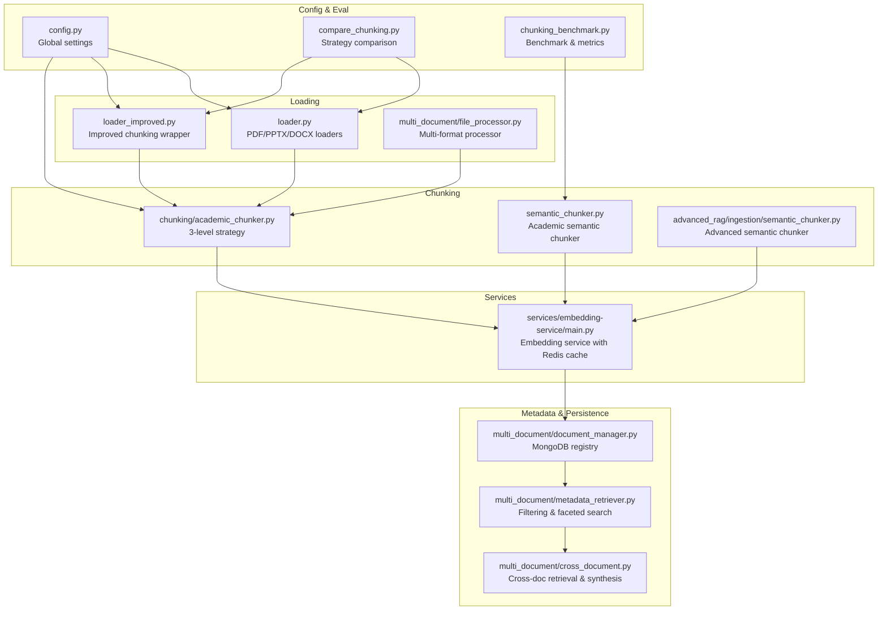
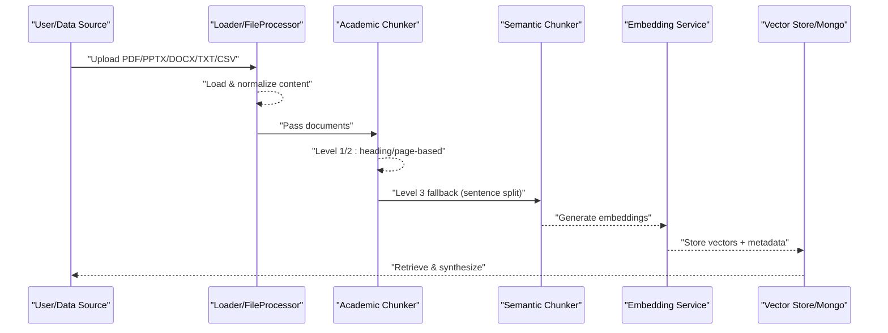
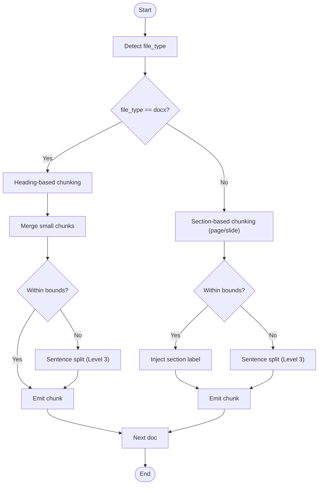
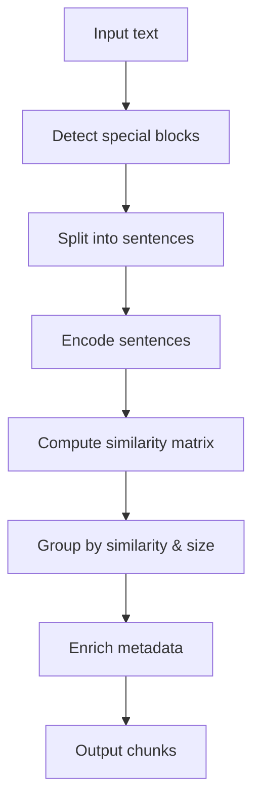
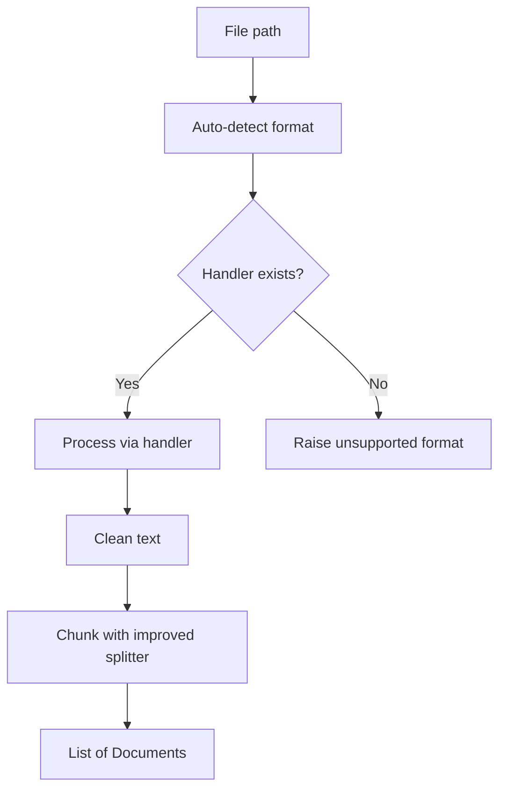
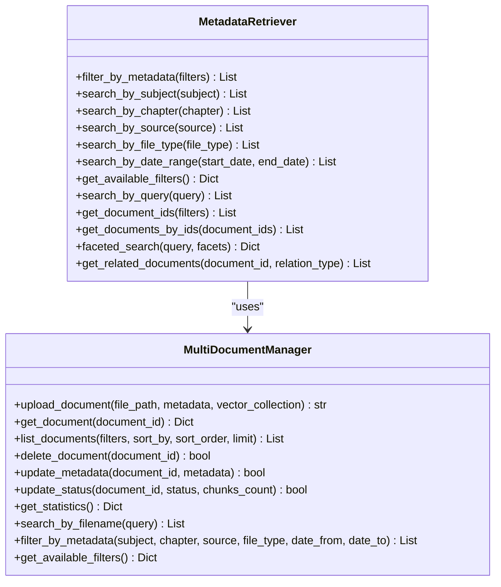
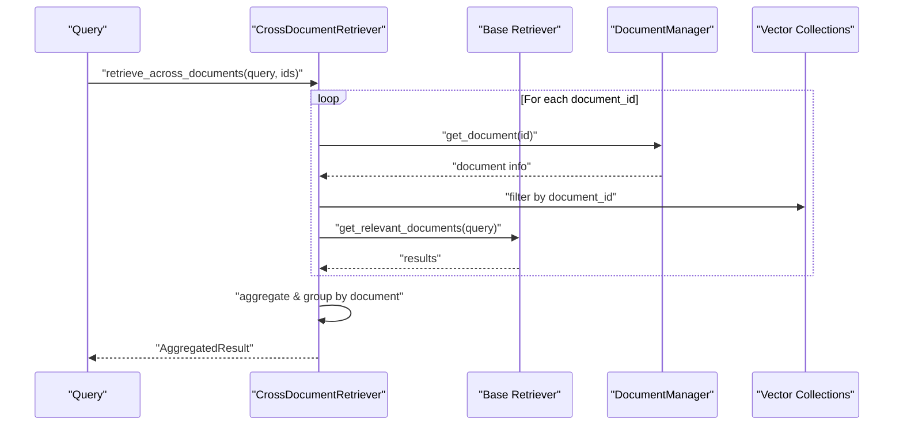
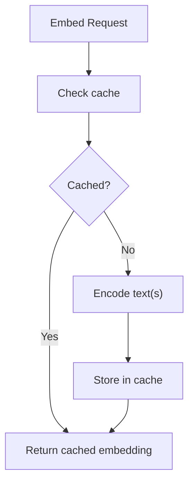
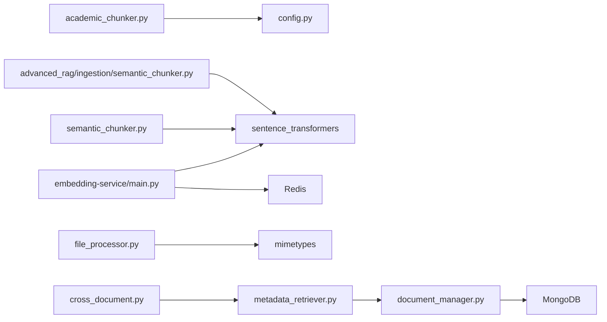

# Document Processing

<cite>
**Referenced Files in This Document**
- [academic_chunker.py](file://chunking/academic_chunker.py)
- [semantic_chunker.py](file://semantic_chunker.py)
- [loader.py](file://loader.py)
- [loader_improved.py](file://loader_improved.py)
- [file_processor.py](file://multi_document/file_processor.py)
- [document_manager.py](file://multi_document/document_manager.py)
- [metadata_retriever.py](file://multi_document/metadata_retriever.py)
- [cross_document.py](file://multi_document/cross_document.py)
- [config.py](file://config.py)
- [compare_chunking.py](file://compare_chunking.py)
- [chunking_benchmark.py](file://chunking_benchmark.py)
- [main.py](file://services/embedding-service/main.py)
</cite>

## Table of Contents
1. [Introduction](#introduction)
2. [Project Structure](#project-structure)
3. [Core Components](#core-components)
4. [Architecture Overview](#architecture-overview)
5. [Detailed Component Analysis](#detailed-component-analysis)
6. [Dependency Analysis](#dependency-analysis)
7. [Performance Considerations](#performance-considerations)
8. [Troubleshooting Guide](#troubleshooting-guide)
9. [Conclusion](#conclusion)
10. [Appendices](#appendices)

## Introduction
This document explains MinerAI’s document processing capabilities with a focus on:
- Semantic chunking algorithms
- Academic chunking strategies
- Document loading mechanisms
- The end-to-end pipeline from raw documents to vector-ready chunks
- Integration between strategies, metadata preservation, and preprocessing workflows
- Performance considerations, chunk size optimization, and quality assessment metrics

It consolidates the practical implementations present in the repository to help both developers and educators configure, tune, and evaluate the chunking and ingestion pipeline effectively.

## Project Structure
MinerAI organizes document processing across several modules:
- Loading: native loaders for PDF, PPTX, DOCX and a multi-format processor
- Chunking: academic-aware three-level strategy and advanced semantic chunkers
- Metadata: enrichment, persistence, and retrieval
- Services: embedding generation with caching
- Evaluation: comparative benchmarking and quality metrics

**Diagram sources**
- [loader.py:1-445](file://loader.py#L1-L445)
- [loader_improved.py:1-285](file://loader_improved.py#L1-L285)
- [file_processor.py:1-360](file://multi_document/file_processor.py#L1-L360)
- [academic_chunker.py:1-335](file://chunking/academic_chunker.py#L1-L335)
- [semantic_chunker.py:1-411](file://semantic_chunker.py#L1-L411)
- [document_manager.py:1-396](file://multi_document/document_manager.py#L1-L396)
- [metadata_retriever.py:1-316](file://multi_document/metadata_retriever.py#L1-L316)
- [cross_document.py:1-433](file://multi_document/cross_document.py#L1-L433)
- [main.py:1-203](file://services/embedding-service/main.py#L1-L203)
- [config.py:1-218](file://config.py#L1-L218)
- [compare_chunking.py:1-36](file://compare_chunking.py#L1-L36)
- [chunking_benchmark.py:76-281](file://chunking_benchmark.py#L76-L281)

**Section sources**
- [loader.py:1-445](file://loader.py#L1-L445)
- [loader_improved.py:1-285](file://loader_improved.py#L1-L285)
- [file_processor.py:1-360](file://multi_document/file_processor.py#L1-L360)
- [academic_chunker.py:1-335](file://chunking/academic_chunker.py#L1-L335)
- [semantic_chunker.py:1-411](file://semantic_chunker.py#L1-L411)
- [document_manager.py:1-396](file://multi_document/document_manager.py#L1-L396)
- [metadata_retriever.py:1-316](file://multi_document/metadata_retriever.py#L1-L316)
- [cross_document.py:1-433](file://multi_document/cross_document.py#L1-L433)
- [config.py:1-218](file://config.py#L1-L218)
- [compare_chunking.py:1-36](file://compare_chunking.py#L1-L36)
- [chunking_benchmark.py:76-281](file://chunking_benchmark.py#L76-L281)
- [main.py:1-203](file://services/embedding-service/main.py#L1-L203)

## Core Components
- Academic three-level chunker: heading-based for DOCX, section-based for PDF/PPTX, and sentence-boundary fallback for oversized segments. It preserves section labels and metadata for downstream retrieval.
- Academic semantic chunker: sentence-aware splitting with special block preservation (tables, formulas, code, headings) and configurable thresholds.
- Improved loader: standardized document loading and chunking with enhanced separators and content-type detection.
- Multi-format file processor: generic processor supporting PDF, DOCX, PPTX, TXT, CSV with automatic format detection and metadata enrichment.
- Document manager and metadata retriever: persistent registry and faceted search across documents.
- Cross-document retriever: aggregation, comparison, and synthesis across multiple sources.
- Embedding service: production-ready embedding generation with caching and batching.
- Configuration and evaluation: centralized settings and comparative benchmarks.

**Section sources**
- [academic_chunker.py:150-323](file://chunking/academic_chunker.py#L150-L323)
- [semantic_chunker.py:20-296](file://semantic_chunker.py#L20-L296)
- [loader_improved.py:120-208](file://loader_improved.py#L120-L208)
- [file_processor.py:37-330](file://multi_document/file_processor.py#L37-L330)
- [document_manager.py:21-372](file://multi_document/document_manager.py#L21-L372)
- [metadata_retriever.py:17-296](file://multi_document/metadata_retriever.py#L17-L296)
- [cross_document.py:51-433](file://multi_document/cross_document.py#L51-L433)
- [main.py:1-203](file://services/embedding-service/main.py#L1-L203)
- [config.py:65-111](file://config.py#L65-L111)
- [compare_chunking.py:1-36](file://compare_chunking.py#L1-L36)
- [chunking_benchmark.py:76-281](file://chunking_benchmark.py#L76-L281)

## Architecture Overview
The pipeline transforms raw documents into vector-ready chunks with metadata, enabling robust retrieval and synthesis.

**Diagram sources**
- [loader.py:396-438](file://loader.py#L396-L438)
- [loader_improved.py:210-248](file://loader_improved.py#L210-L248)
- [file_processor.py:92-127](file://multi_document/file_processor.py#L92-L127)
- [academic_chunker.py:292-322](file://chunking/academic_chunker.py#L292-L322)
- [semantic_chunker.py:213-296](file://semantic_chunker.py#L213-L296)
- [main.py:120-180](file://services/embedding-service/main.py#L120-L180)

## Detailed Component Analysis

### Academic Three-Level Chunker
- Level 1 (DOCX): Uses section boundaries from the DOCX parser; merges small sections and splits oversized ones using sentence boundaries while preserving headings.
- Level 2 (PDF/PPTX): Treats each page/slide as a section; injects “Page N” or “Slide N” labels at the start of content to aid retrieval.
- Level 3 (Fallback): Splits oversized segments into sentence-aligned chunks with overlap to maintain continuity.
- Metadata: chunk_id, document_name/source_file/source, section_title/page_number/chunk_index, file_type, created_at, embedding_model.

**Diagram sources**
- [academic_chunker.py:150-323](file://chunking/academic_chunker.py#L150-L323)

**Section sources**
- [academic_chunker.py:150-323](file://chunking/academic_chunker.py#L150-L323)

### Academic Semantic Chunker
- Sentence-aware splitting with academic-aware punctuation handling.
- Special block preservation: tables, formulas, code, headings.
- Configurable thresholds for chunk size and similarity boundaries.
- Emits chunks with enriched metadata including statistics and content-type indicators.

**Diagram sources**
- [semantic_chunker.py:35-71](file://semantic_chunker.py#L35-L71)
- [semantic_chunker.py:131-263](file://semantic_chunker.py#L131-L263)

**Section sources**
- [semantic_chunker.py:20-296](file://semantic_chunker.py#L20-L296)

### Improved Loader and Multi-Format Processor
- Standardizes loading for PDF, PPTX, DOCX, TXT, CSV with consistent metadata.
- Enhanced separators and content-type detection to improve chunk boundaries.
- Cleaner text normalization and chunk filtering to reduce noise.

**Diagram sources**
- [file_processor.py:60-127](file://multi_document/file_processor.py#L60-L127)
- [loader_improved.py:120-208](file://loader_improved.py#L120-L208)

**Section sources**
- [file_processor.py:37-330](file://multi_document/file_processor.py#L37-L330)
- [loader_improved.py:120-208](file://loader_improved.py#L120-L208)

### Document Management and Metadata Retrieval
- Registers documents with MongoDB, tracks status, and supports faceted filtering.
- Provides metadata-driven retrieval and search across subjects, chapters, sources, and file types.

**Diagram sources**
- [document_manager.py:21-372](file://multi_document/document_manager.py#L21-L372)
- [metadata_retriever.py:17-296](file://multi_document/metadata_retriever.py#L17-L296)

**Section sources**
- [document_manager.py:21-372](file://multi_document/document_manager.py#L21-L372)
- [metadata_retriever.py:17-296](file://multi_document/metadata_retriever.py#L17-L296)

### Cross-Document Retrieval and Synthesis
- Aggregates results across multiple documents, compares similarities/differences, and synthesizes answers from multiple sources.

**Diagram sources**
- [cross_document.py:67-137](file://multi_document/cross_document.py#L67-L137)
- [document_manager.py:111-122](file://multi_document/document_manager.py#L111-L122)

**Section sources**
- [cross_document.py:51-433](file://multi_document/cross_document.py#L51-L433)

### Embedding Service and Caching
- Generates embeddings with batching and caches results in Redis for reuse.
- Supports GPU acceleration and configurable batch sizes.

**Diagram sources**
- [main.py:61-180](file://services/embedding-service/main.py#L61-L180)

**Section sources**
- [main.py:1-203](file://services/embedding-service/main.py#L1-203)

## Dependency Analysis
- Academic chunker depends on configuration for embedding model name and chunk size bounds.
- Semantic chunkers rely on sentence transformers and configurable thresholds.
- File processors depend on optional libraries (DOCX, pandas) and MIME detection.
- Document manager relies on MongoDB; metadata retriever builds on it.
- Cross-document retriever depends on base retriever and document manager.
- Embedding service depends on Redis and SentenceTransformer.

**Diagram sources**
- [academic_chunker.py:58-64](file://chunking/academic_chunker.py#L58-L64)
- [semantic_chunker.py:53-62](file://semantic_chunker.py#L53-L62)
- [file_processor.py:16-18](file://multi_document/file_processor.py#L16-L18)
- [document_manager.py:34-36](file://multi_document/document_manager.py#L34-L36)
- [metadata_retriever.py:14](file://multi_document/metadata_retriever.py#L14)
- [cross_document.py:56-66](file://multi_document/cross_document.py#L56-L66)
- [main.py:15](file://services/embedding-service/main.py#L15)

**Section sources**
- [config.py:55-62](file://config.py#L55-L62)
- [semantic_chunker.py:53-62](file://semantic_chunker.py#L53-L62)
- [file_processor.py:16-35](file://multi_document/file_processor.py#L16-L35)
- [document_manager.py:34-36](file://multi_document/document_manager.py#L34-L36)
- [metadata_retriever.py:14](file://multi_document/metadata_retriever.py#L14)
- [cross_document.py:56-66](file://multi_document/cross_document.py#L56-L66)
- [main.py:15](file://services/embedding-service/main.py#L15)

## Performance Considerations
- Chunk size and overlap: Academic chunker uses 150–1200 characters with 100-character overlap; improved loader increases to 1200/250 for better context retention.
- Separator precedence: Improved loader prioritizes natural boundaries (paragraph breaks, sentence endings) to minimize mid-sentence splits.
- Embedding model: Academic chunker defers model initialization until needed; embedding service caches and batches to reduce latency.
- Content-type handling: Detecting algorithms, tables, and heavy formulas allows specialized treatment and reduces fragmentation.
- Benchmarking: Comparative scripts quantify speed, quality, and boundary preservation to guide strategy selection.

**Section sources**
- [academic_chunker.py:47-49](file://chunking/academic_chunker.py#L47-L49)
- [loader_improved.py:133-149](file://loader_improved.py#L133-L149)
- [compare_chunking.py:1-36](file://compare_chunking.py#L1-L36)
- [chunking_benchmark.py:76-281](file://chunking_benchmark.py#L76-L281)
- [main.py:120-180](file://services/embedding-service/main.py#L120-L180)

## Troubleshooting Guide
- Missing optional dependencies:
  - DOCX support requires python-docx; CSV support requires pandas. The multi-format processor prints warnings and disables handlers accordingly.
- PDF/PPTX parsing:
  - Empty or unreadable presentations/pages yield zero documents; verify file integrity and permissions.
- Embedding service:
  - Ensure Redis is reachable and GPU availability matches configuration; check batch size and device selection.
- MongoDB:
  - Confirm connection URI and indexes; verify unique constraints and text indexes for efficient queries.
- Chunk quality:
  - Use benchmark scripts to compare strategies and adjust chunk size/overlap thresholds.

**Section sources**
- [file_processor.py:21-35](file://multi_document/file_processor.py#L21-L35)
- [file_processor.py:83-85](file://multi_document/file_processor.py#L83-L85)
- [main.py:20-43](file://services/embedding-service/main.py#L20-L43)
- [document_manager.py:41-53](file://multi_document/document_manager.py#L41-L53)
- [chunking_benchmark.py:76-281](file://chunking_benchmark.py#L76-L281)

## Conclusion
MinerAI’s document processing pipeline combines academic-aware chunking, robust metadata handling, and scalable embedding generation. The three-level academic chunker ensures contextual integrity, while semantic chunkers add flexibility for complex content. Multi-format loaders and processors streamline ingestion, and MongoDB-backed metadata enables powerful retrieval and synthesis across documents. Benchmarks and configuration centralization support continuous optimization for performance and quality.

## Appendices

### Configuration Reference
- Embedding model name and dimension
- Chunking parameters (size, overlap, semantic flag)
- Retrieval weights and reranking settings
- Caching and async processing toggles
- Logging and rate limiting

**Section sources**
- [config.py:55-111](file://config.py#L55-L111)

### Quality Assessment Metrics
- Chunk count, average length, standard deviation, min/max
- Broken sentence percentage
- Speed comparisons (time per chunk)
- Recommendations for strategy selection

**Section sources**
- [chunking_benchmark.py:76-281](file://chunking_benchmark.py#L76-L281)
- [compare_chunking.py:1-36](file://compare_chunking.py#L1-L36)