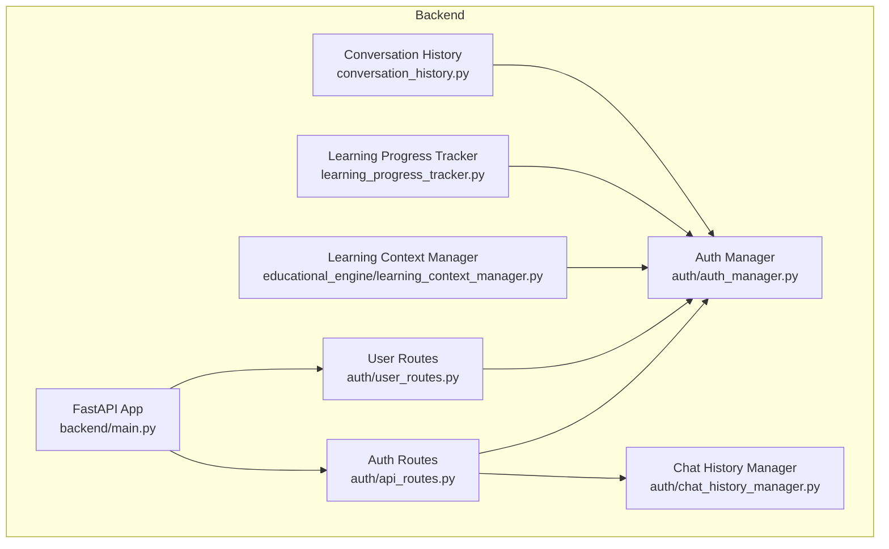
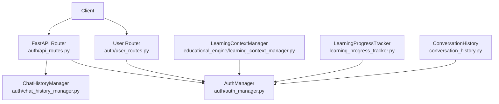
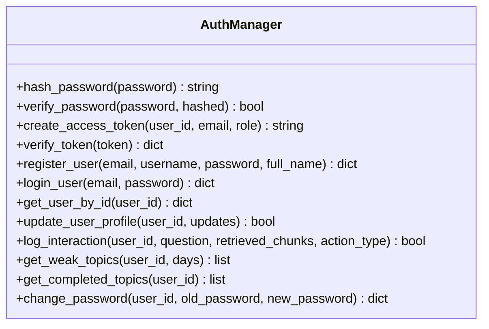
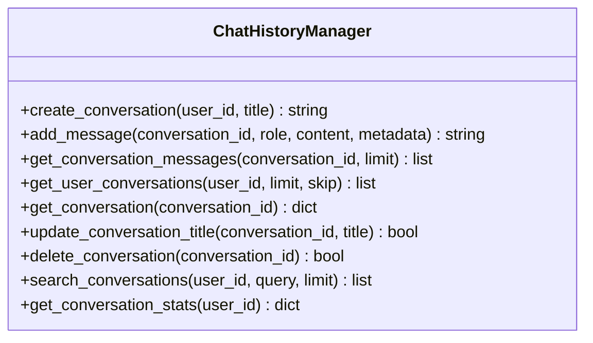
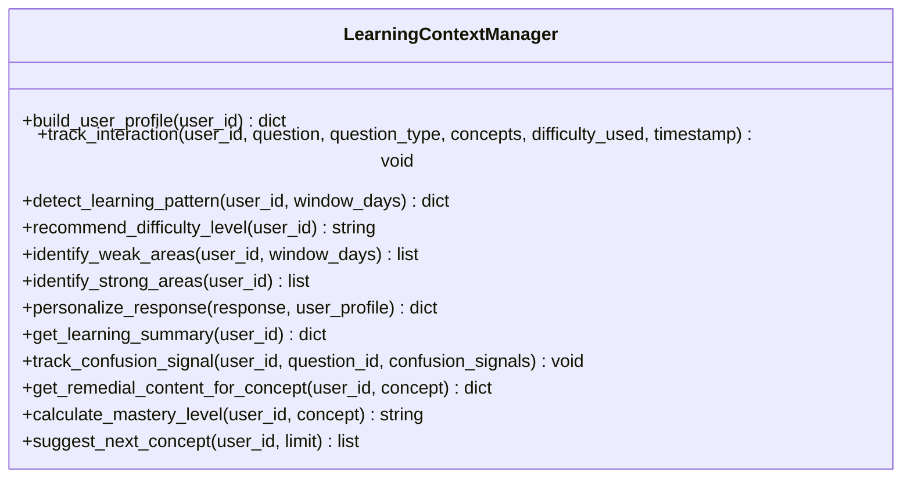
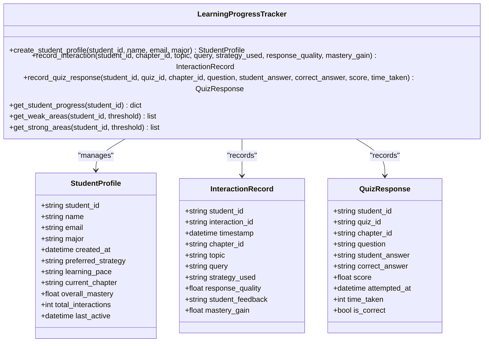
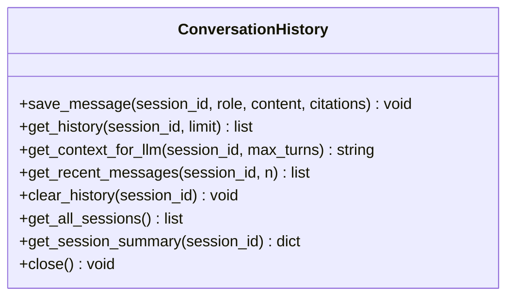
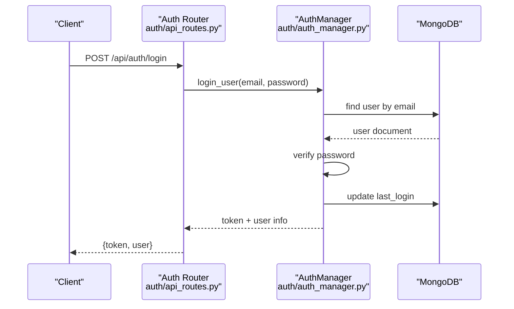
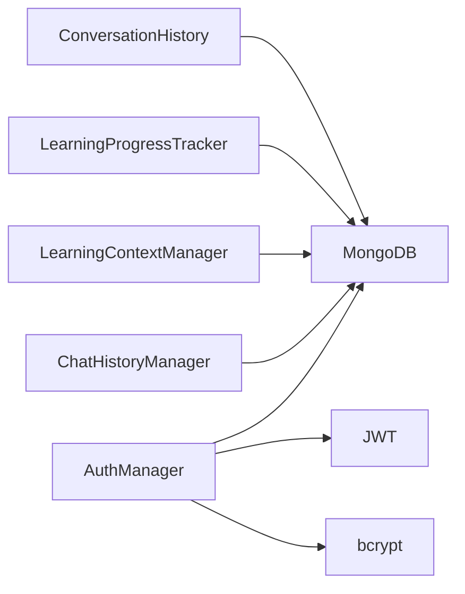

# User Data Management

<cite>
**Referenced Files in This Document**
- [auth_manager.py](file://auth/auth_manager.py)
- [chat_history_manager.py](file://auth/chat_history_manager.py)
- [api_routes.py](file://auth/api_routes.py)
- [user_routes.py](file://auth/user_routes.py)
- [learning_context_manager.py](file://educational_engine/learning_context_manager.py)
- [learning_progress_tracker.py](file://learning_progress_tracker.py)
- [conversation_history.py](file://conversation_history.py)
- [config.py](file://config.py)
- [main.py](file://backend/main.py)
</cite>

## Table of Contents
1. [Introduction](#introduction)
2. [Project Structure](#project-structure)
3. [Core Components](#core-components)
4. [Architecture Overview](#architecture-overview)
5. [Detailed Component Analysis](#detailed-component-analysis)
6. [Dependency Analysis](#dependency-analysis)
7. [Performance Considerations](#performance-considerations)
8. [Troubleshooting Guide](#troubleshooting-guide)
9. [Conclusion](#conclusion)

## Introduction
This document describes the user data management subsystems in MinerAI, focusing on:
- MongoDB schema design for user profiles, chat history, and learning progress
- Chat history manager functionality and persistence strategies
- Learning analytics data collection and progress tracking
- Authentication and session management
- Preference storage and progress monitoring
- Data validation rules, indexing strategies, and lifecycle management

## Project Structure
MinerAI organizes user data management across several modules:
- Authentication and user profile management
- Chat history persistence and retrieval
- Learning context and progress tracking
- Configuration and backend entrypoint

**Diagram sources**
- [main.py:25-41](file://backend/main.py#L25-L41)
- [api_routes.py:15-15](file://auth/api_routes.py#L15-L15)
- [user_routes.py:7-7](file://auth/user_routes.py#L7-L7)
- [auth_manager.py:58-82](file://auth/auth_manager.py#L58-L82)
- [chat_history_manager.py:21-37](file://auth/chat_history_manager.py#L21-L37)
- [learning_context_manager.py:23-40](file://educational_engine/learning_context_manager.py#L23-L40)
- [learning_progress_tracker.py:58-108](file://learning_progress_tracker.py#L58-L108)
- [conversation_history.py:10-43](file://conversation_history.py#L10-L43)

**Section sources**
- [main.py:11-69](file://backend/main.py#L11-L69)
- [config.py:46-46](file://config.py#L46-L46)

## Core Components
- Authentication and user profile management: handles registration, login, JWT token creation/verification, password hashing, and user profile updates. It also logs interactions and computes weak/completed topics for learning analytics.
- Chat history manager: persists conversations and messages, supports CRUD operations, pagination, search, and statistics.
- Learning context manager: maintains user learning profiles, tracks interactions, detects learning patterns, and recommends difficulty and next concepts.
- Learning progress tracker: records student-system interactions and quiz responses, computes mastery and progress statistics.
- Conversation history: manages session-based chat history with optional MongoDB or local JSON fallback and trimming strategies.
- API routes: expose endpoints for authentication, chat history, user stats, and personal question bank.

**Section sources**
- [auth_manager.py:58-393](file://auth/auth_manager.py#L58-L393)
- [chat_history_manager.py:21-274](file://auth/chat_history_manager.py#L21-L274)
- [learning_context_manager.py:23-40](file://educational_engine/learning_context_manager.py#L23-L40)
- [learning_progress_tracker.py:58-463](file://learning_progress_tracker.py#L58-L463)
- [conversation_history.py:10-302](file://conversation_history.py#L10-L302)
- [api_routes.py:15-352](file://auth/api_routes.py#L15-L352)

## Architecture Overview
The user data management architecture integrates authentication, chat persistence, and learning analytics into a cohesive system with MongoDB as the primary datastore and JSON fallback for offline scenarios.

**Diagram sources**
- [api_routes.py:15-15](file://auth/api_routes.py#L15-L15)
- [user_routes.py:7-7](file://auth/user_routes.py#L7-L7)
- [auth_manager.py:58-82](file://auth/auth_manager.py#L58-L82)
- [chat_history_manager.py:21-37](file://auth/chat_history_manager.py#L21-L37)
- [learning_context_manager.py:23-40](file://educational_engine/learning_context_manager.py#L23-L40)
- [learning_progress_tracker.py:58-108](file://learning_progress_tracker.py#L58-L108)
- [conversation_history.py:10-43](file://conversation_history.py#L10-L43)

## Detailed Component Analysis

### Authentication and User Profile Management
- Responsibilities:
  - Registration with validation and password hashing
  - Login with JWT token issuance and last login update
  - Token verification for protected endpoints
  - User profile retrieval and updates
  - Interaction logging for analytics
  - Weak topics and completed topics computation
  - Password change with validation
- Data persistence:
  - MongoDB users collection with unique indexes on email and username
  - Optional JSON fallback for user storage when MongoDB is unavailable
- Security:
  - Bcrypt password hashing
  - HS256 JWT with configurable secret and expiration
  - Access controlled via Authorization header bearer tokens

**Diagram sources**
- [auth_manager.py:58-393](file://auth/auth_manager.py#L58-L393)

**Section sources**
- [auth_manager.py:58-393](file://auth/auth_manager.py#L58-L393)
- [api_routes.py:58-138](file://auth/api_routes.py#L58-L138)

### Chat History Management
- Responsibilities:
  - Create conversations with metadata and timestamps
  - Add messages with roles and optional metadata
  - Retrieve conversation messages with pagination
  - List user conversations with last message preview
  - Update conversation title and soft-delete conversations
  - Search conversations by title
  - Compute user conversation statistics
- Persistence:
  - MongoDB conversations and messages collections
  - Indexes on user_id, created_at, conversation_id, and created_at
- Ownership and permissions:
  - All operations validate conversation ownership before acting

**Diagram sources**
- [chat_history_manager.py:21-274](file://auth/chat_history_manager.py#L21-L274)

**Section sources**
- [chat_history_manager.py:21-274](file://auth/chat_history_manager.py#L21-L274)
- [api_routes.py:167-352](file://auth/api_routes.py#L167-L352)

### Learning Context and Analytics
- Responsibilities:
  - Build or retrieve user learning profiles with topics, strengths, weaknesses, and engagement metrics
  - Track interactions and update profiles accordingly
  - Detect learning patterns over time windows
  - Recommend difficulty levels and next concepts
  - Calculate mastery levels and mark weak areas
  - Provide learning summaries and recommendations
- Persistence:
  - MongoDB collections for user profiles and interactions
  - Indexes on user_id and timestamp for performance

**Diagram sources**
- [learning_context_manager.py:23-629](file://educational_engine/learning_context_manager.py#L23-L629)

**Section sources**
- [learning_context_manager.py:23-629](file://educational_engine/learning_context_manager.py#L23-L629)

### Learning Progress Tracking
- Responsibilities:
  - Create student profiles and record interactions and quiz responses
  - Update mastery levels per chapter and student
  - Compute progress statistics and weak/strong areas
  - Support both MongoDB and in-memory modes
- Persistence:
  - MongoDB collections for student profiles, interactions, quiz responses, and mastery levels
  - Indexes on student_id for efficient queries

**Diagram sources**
- [learning_progress_tracker.py:58-463](file://learning_progress_tracker.py#L58-L463)

**Section sources**
- [learning_progress_tracker.py:58-463](file://learning_progress_tracker.py#L58-L463)

### Conversation History (Session-based)
- Responsibilities:
  - Save messages with roles and citations
  - Retrieve histories with limits and context formatting
  - Trim histories to a maximum number of turns
  - Clear session histories and summarize sessions
  - Fallback to local JSON storage when MongoDB is unavailable
- Persistence:
  - MongoDB conversations collection with automatic trimming
  - Local JSON file fallback with configurable max history

**Diagram sources**
- [conversation_history.py:10-302](file://conversation_history.py#L10-L302)

**Section sources**
- [conversation_history.py:10-302](file://conversation_history.py#L10-L302)

### API Endpoints and Authentication Flow
- Authentication endpoints:
  - Register, login, get current user, change password
  - Protected routes via Authorization header bearer tokens
- Chat history endpoints:
  - Create, list, get, add message, update title, delete, search, and stats
  - Ownership checks enforced on all operations
- User analytics endpoints:
  - Weak topics and completed topics derived from interaction logs

**Diagram sources**
- [api_routes.py:97-109](file://auth/api_routes.py#L97-L109)
- [auth_manager.py:174-218](file://auth/auth_manager.py#L174-L218)

**Section sources**
- [api_routes.py:58-138](file://auth/api_routes.py#L58-L138)
- [api_routes.py:167-352](file://auth/api_routes.py#L167-L352)

## Dependency Analysis
- External dependencies:
  - MongoDB via PyMongo for persistent storage
  - JWT library for token handling
  - Bcrypt for secure password hashing
  - Python dotenv for environment configuration
- Internal dependencies:
  - API routers depend on AuthManager and ChatHistoryManager
  - LearningContextManager depends on AuthManager for user identity
  - LearningProgressTracker optionally depends on MongoDB
  - ConversationHistory supports both MongoDB and JSON fallback

**Diagram sources**
- [auth_manager.py:58-393](file://auth/auth_manager.py#L58-L393)
- [chat_history_manager.py:21-274](file://auth/chat_history_manager.py#L21-L274)
- [learning_context_manager.py:23-629](file://educational_engine/learning_context_manager.py#L23-L629)
- [learning_progress_tracker.py:58-108](file://learning_progress_tracker.py#L58-L108)
- [conversation_history.py:10-43](file://conversation_history.py#L10-L43)

**Section sources**
- [auth_manager.py:58-393](file://auth/auth_manager.py#L58-L393)
- [chat_history_manager.py:21-37](file://auth/chat_history_manager.py#L21-L37)
- [learning_context_manager.py:23-40](file://educational_engine/learning_context_manager.py#L23-L40)
- [learning_progress_tracker.py:58-108](file://learning_progress_tracker.py#L58-L108)
- [conversation_history.py:10-43](file://conversation_history.py#L10-L43)

## Performance Considerations
- Indexing strategies:
  - Users: unique indexes on email and username
  - Conversations: indexes on user_id and created_at
  - Messages: indexes on conversation_id and created_at
  - Learning profiles and interactions: indexes on user_id and timestamp
- Query patterns:
  - Pagination via limit/skip and sort by updated_at/created_at
  - Regex-based search for conversation titles
  - Aggregation-style counts for statistics
- Fallback behavior:
  - JSON storage when MongoDB is unavailable prevents downtime
- Resource constraints:
  - Configurable max history for session-based chat
  - Automatic trimming to keep collections lean

**Section sources**
- [auth_manager.py:78-80](file://auth/auth_manager.py#L78-L80)
- [chat_history_manager.py:32-36](file://auth/chat_history_manager.py#L32-L36)
- [learning_context_manager.py:36-40](file://educational_engine/learning_context_manager.py#L36-L40)
- [conversation_history.py:22-42](file://conversation_history.py#L22-L42)
- [config.py:117-118](file://config.py#L117-L118)

## Troubleshooting Guide
- Authentication issues:
  - Missing JWT_SECRET_KEY triggers a warning and uses an insecure default; set a strong secret in production.
  - MongoDB connectivity failures fall back to JSON storage; verify MONGODB_URI and network access.
- Chat history errors:
  - Ownership validation denies access to unauthorized operations; ensure the current user owns the target conversation.
  - Message addition increments conversation counters and auto-updates titles for first user messages.
- Learning analytics:
  - Weak topics computed from interaction logs; ensure logs are populated and recent activity exists.
  - Completed topics derived from quiz-generated actions; verify action types and logging.
- Session and history:
  - ConversationHistory trims older messages automatically; adjust max_history as needed.
  - JSON fallback preserves recent messages and caps growth.

**Section sources**
- [auth_manager.py:21-34](file://auth/auth_manager.py#L21-L34)
- [auth_manager.py:85-87](file://auth/auth_manager.py#L85-L87)
- [api_routes.py:216-223](file://auth/api_routes.py#L216-L223)
- [conversation_history.py:202-231](file://conversation_history.py#L202-L231)

## Conclusion
MinerAI’s user data management system combines robust authentication, resilient chat history persistence, and comprehensive learning analytics. It leverages MongoDB for scalable data storage with sensible indexing and gracefully falls back to JSON when needed. The modular design ensures clear separation of concerns while enabling seamless integration across authentication, chat, and learning components.