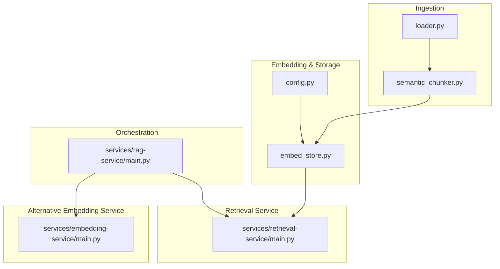
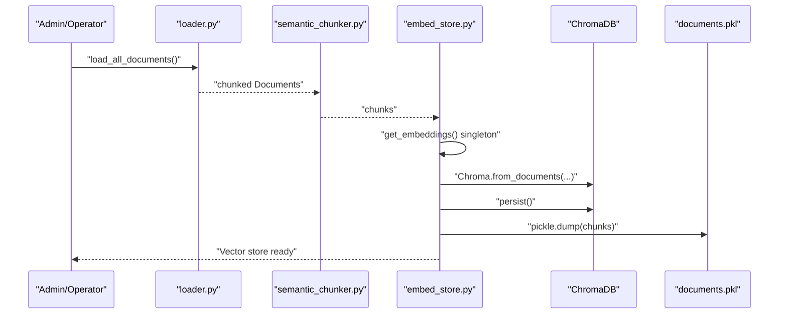
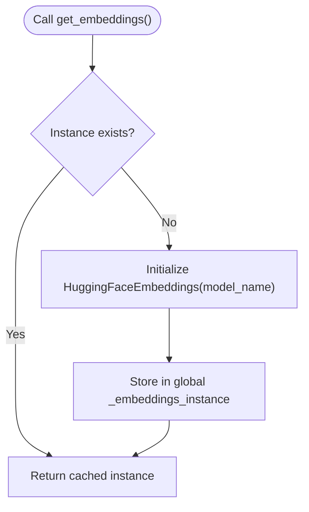
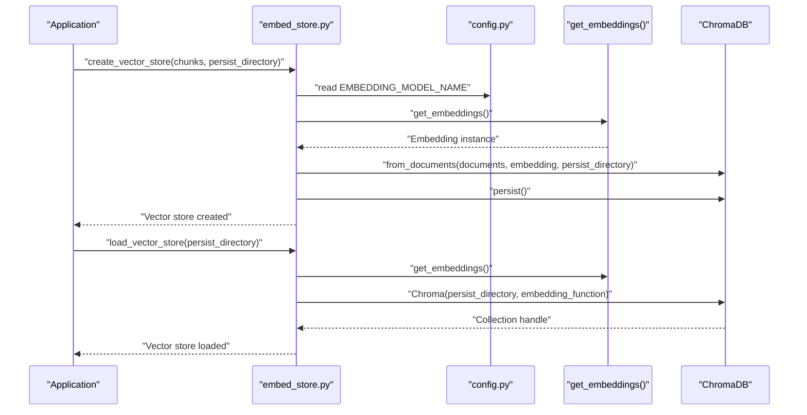
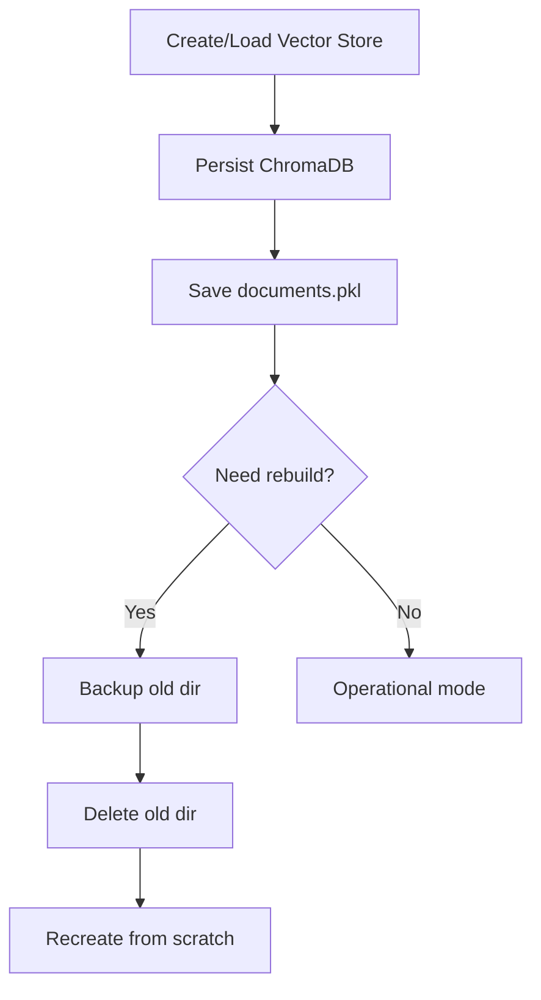
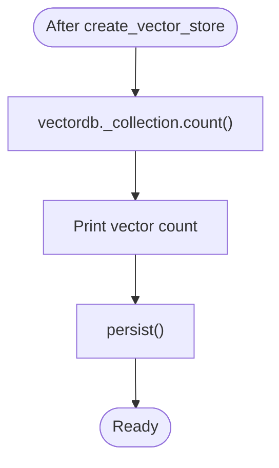
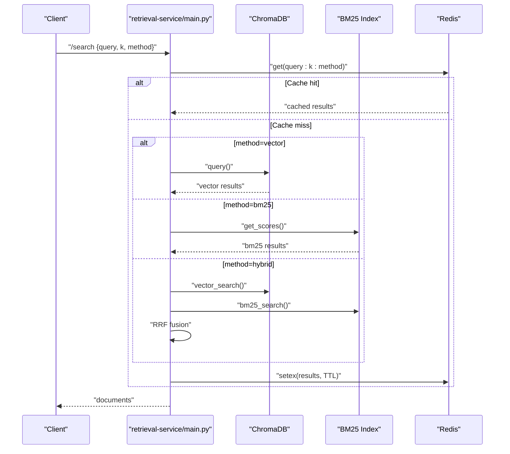
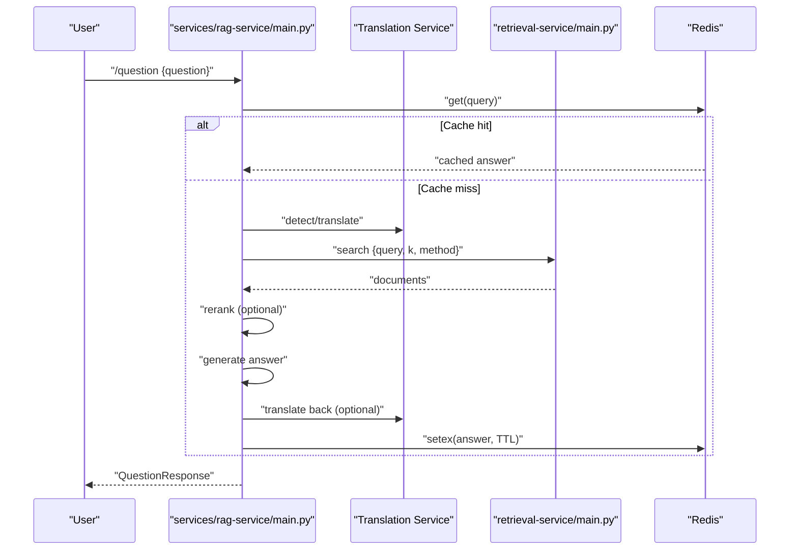
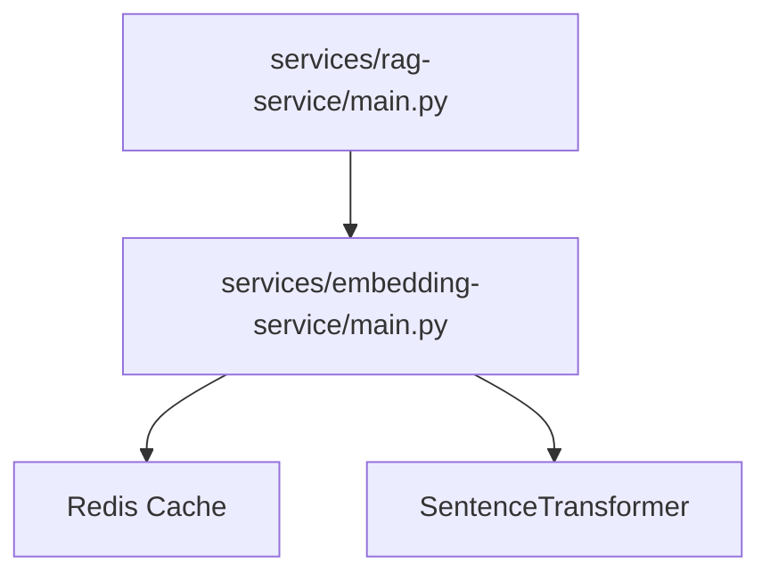
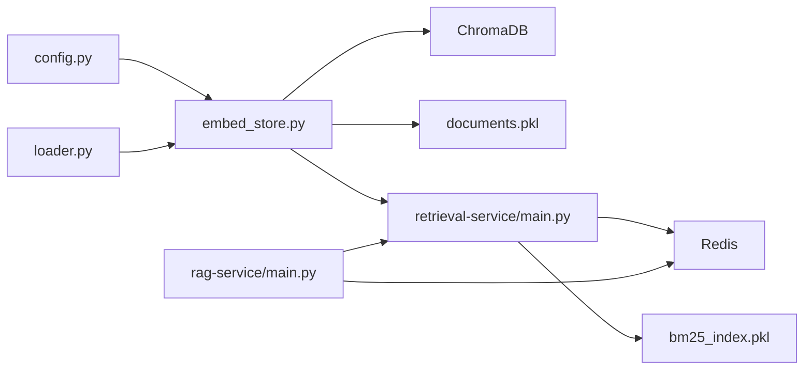

# Vector Database Operations

<cite>
**Referenced Files in This Document**
- [embed_store.py](file://embed_store.py)
- [rebuild_vectorstore.py](file://rebuild_vectorstore.py)
- [config.py](file://config.py)
- [loader.py](file://loader.py)
- [semantic_chunker.py](file://semantic_chunker.py)
- [services/retrieval-service/main.py](file://services/retrieval-service/main.py)
- [services/embedding-service/main.py](file://services/embedding-service/main.py)
- [services/rag-service/main.py](file://services/rag-service/main.py)
- [advanced_rag/pipeline/integrated_rag.py](file://advanced_rag/pipeline/integrated_rag.py)
- [retrieval/enhanced_reranker.py](file://retrieval/enhanced_reranker.py)
</cite>

## Table of Contents
1. [Introduction](#introduction)
2. [Project Structure](#project-structure)
3. [Core Components](#core-components)
4. [Architecture Overview](#architecture-overview)
5. [Detailed Component Analysis](#detailed-component-analysis)
6. [Dependency Analysis](#dependency-analysis)
7. [Performance Considerations](#performance-considerations)
8. [Troubleshooting Guide](#troubleshooting-guide)
9. [Conclusion](#conclusion)

## Introduction
This document explains vector database operations in MinerAI with a focus on ChromaDB integration, embedding model management, and hybrid retrieval. It covers the singleton pattern for embedding models, persistent storage strategies, and lifecycle management of vector stores. It also documents the create_vector_store and load_vector_store functions, persistence mechanisms, performance optimization techniques, vector count management, collection operations, and maintenance procedures.

## Project Structure
MinerAI organizes vector database operations across ingestion, storage, retrieval, and orchestration services:
- Ingestion and chunking: loader and semantic_chunker prepare documents for embedding.
- Embedding and storage: embed_store integrates HuggingFace embeddings with ChromaDB and persists both vectors and original documents.
- Retrieval: retrieval-service performs vector/BM25/hybrid search and caches results.
- Orchestration: rag-service coordinates the end-to-end pipeline and caches results.
- Alternative embedding service: embedding-service provides a dedicated microservice with caching and batching.

**Diagram sources**
- [embed_store.py:1-110](file://embed_store.py#L1-L110)
- [loader.py:1-445](file://loader.py#L1-L445)
- [semantic_chunker.py:1-411](file://semantic_chunker.py#L1-L411)
- [config.py:1-218](file://config.py#L1-L218)
- [services/retrieval-service/main.py:1-275](file://services/retrieval-service/main.py#L1-L275)
- [services/rag-service/main.py:1-299](file://services/rag-service/main.py#L1-L299)
- [services/embedding-service/main.py:1-204](file://services/embedding-service/main.py#L1-L204)

**Section sources**
- [embed_store.py:1-110](file://embed_store.py#L1-L110)
- [loader.py:1-445](file://loader.py#L1-L445)
- [semantic_chunker.py:1-411](file://semantic_chunker.py#L1-L411)
- [config.py:1-218](file://config.py#L1-L218)
- [services/retrieval-service/main.py:1-275](file://services/retrieval-service/main.py#L1-L275)
- [services/rag-service/main.py:1-299](file://services/rag-service/main.py#L1-L299)
- [services/embedding-service/main.py:1-204](file://services/embedding-service/main.py#L1-L204)

## Core Components
- Embedding model singleton: Ensures a single, cached embedding model instance across the application.
- Vector store creation and loading: Creates ChromaDB collections from chunked documents and loads existing stores.
- Persistence: ChromaDB persistent storage plus auxiliary document pickling for BM25.
- Retrieval service: Vector search, BM25 search, and reciprocal rank fusion (RRF) hybrid search.
- Orchestration: RAG pipeline with caching, optional reranking, and result caching.

**Section sources**
- [embed_store.py:24-80](file://embed_store.py#L24-L80)
- [embed_store.py:39-80](file://embed_store.py#L39-L80)
- [services/retrieval-service/main.py:101-192](file://services/retrieval-service/main.py#L101-L192)
- [services/rag-service/main.py:93-199](file://services/rag-service/main.py#L93-L199)

## Architecture Overview
The system supports two primary workflows:
- Offline ingestion and indexing: loader and semantic_chunker produce chunks; embed_store creates and persists ChromaDB vectors and documents.
- Online retrieval and RAG: retrieval-service serves vector/BM25/hybrid search; rag-service orchestrates the pipeline and caches results.

**Diagram sources**
- [loader.py:396-438](file://loader.py#L396-L438)
- [semantic_chunker.py:265-296](file://semantic_chunker.py#L265-L296)
- [embed_store.py:24-66](file://embed_store.py#L24-L66)

## Detailed Component Analysis

### Embedding Model Singleton Pattern
- Purpose: Avoid reloading the embedding model across the application.
- Implementation: Global variable holds a cached instance; model is initialized once and reused.
- Configuration: Uses EMBEDDING_MODEL_NAME from config.py to ensure system-wide consistency.

**Diagram sources**
- [embed_store.py:24-37](file://embed_store.py#L24-L37)
- [config.py:55](file://config.py#L55)

**Section sources**
- [embed_store.py:24-37](file://embed_store.py#L24-L37)
- [config.py:55](file://config.py#L55)

### Vector Store Creation and Loading
- create_vector_store:
  - Accepts chunked documents and a persist_directory.
  - Initializes the embedding model via the singleton.
  - Creates a Chroma collection from documents and persists to disk.
  - Persists original chunks to documents.pkl for BM25 indexing.
- load_vector_store:
  - Loads an existing Chroma collection using the cached embedding model.
  - Returns a Chroma client instance for querying.

**Diagram sources**
- [embed_store.py:39-80](file://embed_store.py#L39-L80)
- [config.py:55](file://config.py#L55)

**Section sources**
- [embed_store.py:39-80](file://embed_store.py#L39-L80)
- [config.py:55](file://config.py#L55)

### Persistence Mechanisms
- ChromaDB persistence: Chroma.from_documents(...) writes to disk automatically; persist() ensures durability.
- Original documents persistence: documents.pkl stores raw chunks for BM25 indexing and recovery.
- Backup and rebuild: rebuild_vectorstore.py backs up and recreates the target directory safely.

**Diagram sources**
- [embed_store.py:51-66](file://embed_store.py#L51-L66)
- [rebuild_vectorstore.py:12-54](file://rebuild_vectorstore.py#L12-L54)

**Section sources**
- [embed_store.py:51-66](file://embed_store.py#L51-L66)
- [rebuild_vectorstore.py:12-54](file://rebuild_vectorstore.py#L12-L54)

### Vector Count Management and Collection Operations
- Vector count: After creation, the number of vectors is printed using the collection’s count.
- Collection operations: Retrieval service queries the "documents" collection and reports counts.

**Diagram sources**
- [embed_store.py:58](file://embed_store.py#L58)
- [services/retrieval-service/main.py:202](file://services/retrieval-service/main.py#L202)

**Section sources**
- [embed_store.py:58](file://embed_store.py#L58)
- [services/retrieval-service/main.py:202](file://services/retrieval-service/main.py#L202)

### Retrieval Service: Vector, BM25, and Hybrid Search
- Vector search: Queries the ChromaDB collection with configurable k.
- BM25 search: Loads a precomputed BM25 index and documents from pickle.
- Hybrid search: Reciprocal Rank Fusion (RRF) combines vector and BM25 scores.
- Caching: Results are cached in Redis with a TTL.

**Diagram sources**
- [services/retrieval-service/main.py:101-192](file://services/retrieval-service/main.py#L101-L192)

**Section sources**
- [services/retrieval-service/main.py:101-192](file://services/retrieval-service/main.py#L101-L192)

### RAG Orchestration and Caching
- The RAG service coordinates language detection, retrieval, optional reranking, LLM generation, and translation.
- Results are cached in Redis with a TTL to reduce latency and cost.

**Diagram sources**
- [services/rag-service/main.py:93-199](file://services/rag-service/main.py#L93-L199)

**Section sources**
- [services/rag-service/main.py:93-199](file://services/rag-service/main.py#L93-L199)

### Alternative Embedding Microservice
- Provides a dedicated embedding service with Redis caching, batching, and GPU support.
- Can be used by the RAG service to offload embedding generation.

**Diagram sources**
- [services/rag-service/main.py:21-26](file://services/rag-service/main.py#L21-L26)
- [services/embedding-service/main.py:1-204](file://services/embedding-service/main.py#L1-L204)

**Section sources**
- [services/rag-service/main.py:21-26](file://services/rag-service/main.py#L21-L26)
- [services/embedding-service/main.py:1-204](file://services/embedding-service/main.py#L1-L204)

## Dependency Analysis
- embed_store depends on:
  - config.py for EMBEDDING_MODEL_NAME
  - loader.py for chunked documents
  - ChromaDB for vector storage
  - pickle for documents.pkl
- retrieval-service depends on:
  - ChromaDB client
  - Pickled BM25 index and documents
  - Redis for caching
- rag-service depends on:
  - retrieval-service for documents
  - optional reranking service
  - translation service
  - Redis for caching

**Diagram sources**
- [config.py:55](file://config.py#L55)
- [embed_store.py:39-80](file://embed_store.py#L39-L80)
- [services/retrieval-service/main.py:38-52](file://services/retrieval-service/main.py#L38-L52)
- [services/rag-service/main.py:21-26](file://services/rag-service/main.py#L21-L26)

**Section sources**
- [config.py:55](file://config.py#L55)
- [embed_store.py:39-80](file://embed_store.py#L39-L80)
- [services/retrieval-service/main.py:38-52](file://services/retrieval-service/main.py#L38-L52)
- [services/rag-service/main.py:21-26](file://services/rag-service/main.py#L21-L26)

## Performance Considerations
- Embedding caching:
  - embed_store uses a singleton embedding model to avoid repeated initialization.
  - retrieval-service caches search results in Redis.
  - rag-service caches full query results in Redis.
- Batch processing:
  - config.py defines EMBEDDING_BATCH_SIZE and VECTOR_DB_BATCH_SIZE for throughput.
- GPU acceleration:
  - embedding-service optionally uses GPU if available.
- Lazy loading:
  - Enhanced reranker lazily loads the cross-encoder model to save memory.
- Hybrid search weights:
  - config.py controls VECTOR_WEIGHT and BM25_WEIGHT for balancing recall and precision.

**Section sources**
- [embed_store.py:24-37](file://embed_store.py#L24-L37)
- [services/retrieval-service/main.py:74-95](file://services/retrieval-service/main.py#L74-L95)
- [services/rag-service/main.py:67-87](file://services/rag-service/main.py#L67-L87)
- [services/embedding-service/main.py:38-42](file://services/embedding-service/main.py#L38-L42)
- [retrieval/enhanced_reranker.py:45-63](file://retrieval/enhanced_reranker.py#L45-L63)
- [config.py:109-110](file://config.py#L109-L110)

## Troubleshooting Guide
- Permission errors during rebuild:
  - rebuild_vectorstore.py handles PermissionError by renaming the directory and instructing the user to shut down the backend before deletion.
- Missing BM25 index:
  - retrieval-service checks for bm25_index.pkl and prints a warning if not found.
- Health checks:
  - retrieval-service exposes /health reporting Chroma and BM25 counts and Redis connectivity.
  - rag-service exposes /health reporting service readiness.
- Vector count verification:
  - embed_store prints the number of vectors after persisting.
  - backend_api references vectordb._collection.count() for dashboard metrics.

**Section sources**
- [rebuild_vectorstore.py:23-31](file://rebuild_vectorstore.py#L23-L31)
- [services/retrieval-service/main.py:42-52](file://services/retrieval-service/main.py#L42-L52)
- [services/retrieval-service/main.py:197-205](file://services/retrieval-service/main.py#L197-L205)
- [services/rag-service/main.py:205-217](file://services/rag-service/main.py#L205-L217)
- [embed_store.py:58](file://embed_store.py#L58)
- [backend_api.py:1495](file://backend_api.py#L1495)

## Conclusion
MinerAI implements robust vector database operations centered on ChromaDB, with a singleton embedding model, persistent storage, and hybrid retrieval. The system balances performance through caching, batching, and optional GPU acceleration while providing operational safety via rebuild scripts and health checks. The documented functions create_vector_store and load_vector_store, along with retrieval-service endpoints, form the backbone of ingestion and querying workflows.