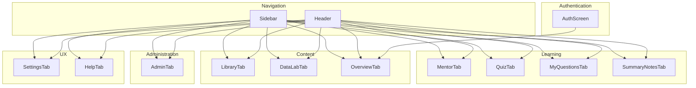
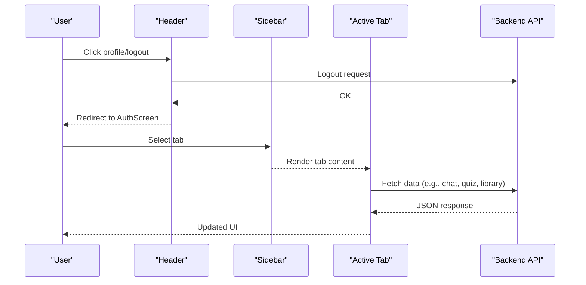
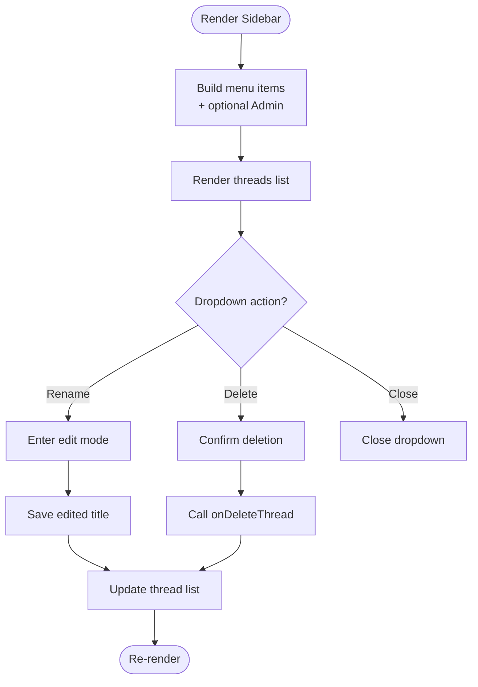
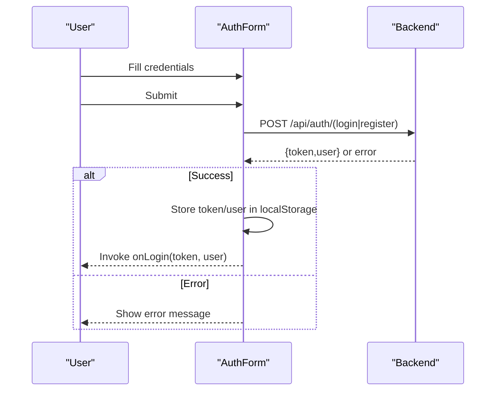
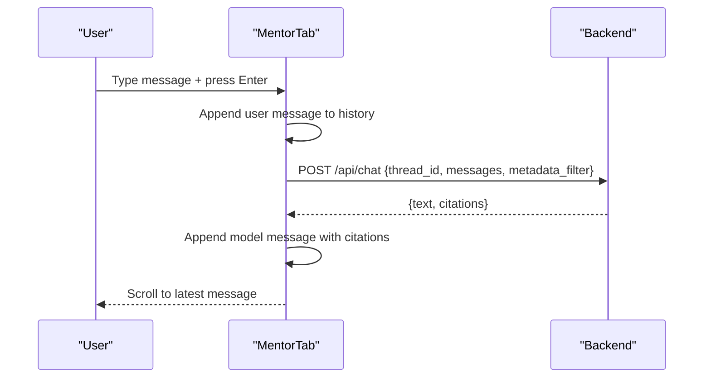
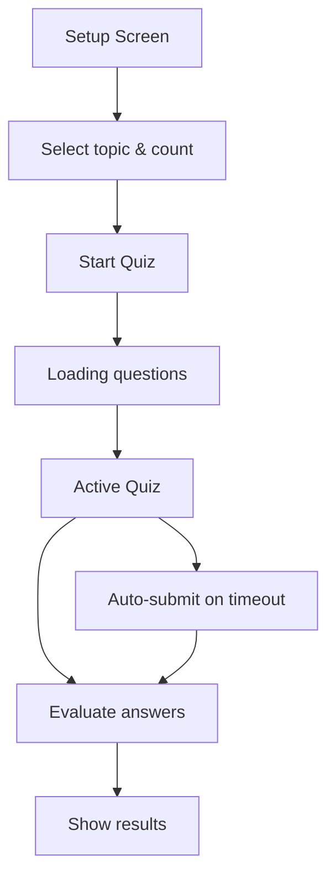
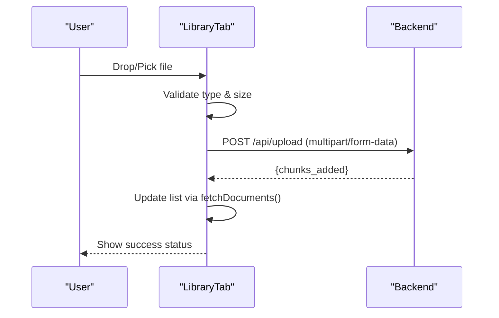
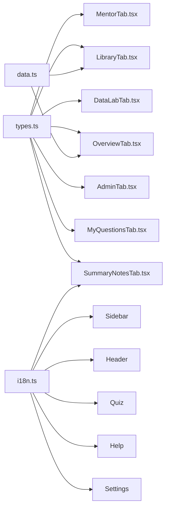

# Component Library

<cite>
**Referenced Files in This Document**
- [Sidebar.tsx](file://frontend/src/components/Sidebar.tsx)
- [Header.tsx](file://frontend/src/components/Header.tsx)
- [AuthScreen.tsx](file://frontend/src/components/AuthScreen.tsx)
- [MentorTab.tsx](file://frontend/src/components/MentorTab.tsx)
- [QuizTab.tsx](file://frontend/src/components/QuizTab.tsx)
- [LibraryTab.tsx](file://frontend/src/components/LibraryTab.tsx)
- [DataLabTab.tsx](file://frontend/src/components/DataLabTab.tsx)
- [OverviewTab.tsx](file://frontend/src/components/OverviewTab.tsx)
- [SettingsTab.tsx](file://frontend/src/components/SettingsTab.tsx)
- [HelpTab.tsx](file://frontend/src/components/HelpTab.tsx)
- [AdminTab.tsx](file://frontend/src/components/AdminTab.tsx)
- [MyQuestionsTab.tsx](file://frontend/src/components/MyQuestionsTab.tsx)
- [SummaryNotesTab.tsx](file://frontend/src/components/SummaryNotesTab.tsx)
- [types.ts](file://frontend/src/types.ts)
- [data.ts](file://frontend/src/data.ts)
</cite>

## Table of Contents
1. [Introduction](#introduction)
2. [Project Structure](#project-structure)
3. [Core Components](#core-components)
4. [Architecture Overview](#architecture-overview)
5. [Detailed Component Analysis](#detailed-component-analysis)
6. [Dependency Analysis](#dependency-analysis)
7. [Performance Considerations](#performance-considerations)
8. [Troubleshooting Guide](#troubleshooting-guide)
9. [Conclusion](#conclusion)
10. [Appendices](#appendices)

## Introduction
This document describes the MinerAI component library used in the frontend. It covers the props interface, state management, event handlers, integration patterns, styling approaches, reusability, lifecycle, performance, and accessibility for each major component. The goal is to enable developers to understand, extend, and maintain the UI components effectively.

## Project Structure
The component library resides under frontend/src/components and is composed of:
- Navigation and global UI: Sidebar, Header
- Authentication: AuthScreen
- Learning and practice: MentorTab, QuizTab, MyQuestionsTab, SummaryNotesTab
- Content and tools: LibraryTab, DataLabTab, OverviewTab
- Administration: AdminTab
- Settings and help: SettingsTab, HelpTab

**Diagram sources**
- [Sidebar.tsx:23-229](file://frontend/src/components/Sidebar.tsx#L23-L229)
- [Header.tsx:16-123](file://frontend/src/components/Header.tsx#L16-L123)
- [AuthScreen.tsx:8-211](file://frontend/src/components/AuthScreen.tsx#L8-L211)
- [MentorTab.tsx:28-411](file://frontend/src/components/MentorTab.tsx#L28-L411)
- [QuizTab.tsx:43-1014](file://frontend/src/components/QuizTab.tsx#L43-L1014)
- [LibraryTab.tsx:12-519](file://frontend/src/components/LibraryTab.tsx#L12-L519)
- [DataLabTab.tsx:11-344](file://frontend/src/components/DataLabTab.tsx#L11-L344)
- [OverviewTab.tsx:14-287](file://frontend/src/components/OverviewTab.tsx#L14-L287)
- [SettingsTab.tsx:8-163](file://frontend/src/components/SettingsTab.tsx#L8-L163)
- [HelpTab.tsx:8-121](file://frontend/src/components/HelpTab.tsx#L8-L121)
- [AdminTab.tsx:35-568](file://frontend/src/components/AdminTab.tsx#L35-L568)
- [MyQuestionsTab.tsx:19-418](file://frontend/src/components/MyQuestionsTab.tsx#L19-L418)
- [SummaryNotesTab.tsx:16-414](file://frontend/src/components/SummaryNotesTab.tsx#L16-L414)

**Section sources**
- [Sidebar.tsx:1-229](file://frontend/src/components/Sidebar.tsx#L1-L229)
- [Header.tsx:1-123](file://frontend/src/components/Header.tsx#L1-L123)
- [AuthScreen.tsx:1-211](file://frontend/src/components/AuthScreen.tsx#L1-L211)

## Core Components
This section outlines the primary building blocks and shared patterns across components.

- Props-driven design: All components receive props for localization, callbacks, and state containers to keep logic externalized.
- State management: Components manage minimal internal state (e.g., forms, UI flags) and rely on parent-provided setters for shared state (e.g., threads, messages).
- Event handlers: Clicks, submits, keyboard shortcuts, and timers are handled locally with clear separation of concerns.
- Styling: Tailwind classes define responsive layouts, themes, and interactive states. Icons from lucide-react provide consistent visuals.
- Accessibility: Focus management, ARIA-friendly labels, and keyboard navigation are considered in interactive elements.

**Section sources**
- [types.ts:1-57](file://frontend/src/types.ts#L1-L57)
- [data.ts:1-78](file://frontend/src/data.ts#L1-L78)

## Architecture Overview
The app follows a tab-centric layout with a persistent Sidebar and Header. Components communicate via:
- Parent-to-child props for configuration and data
- Callback props for actions (e.g., tab switching, logout)
- Local storage for tokens and persisted preferences
- API endpoints for server interactions

**Diagram sources**
- [Header.tsx:16-123](file://frontend/src/components/Header.tsx#L16-L123)
- [Sidebar.tsx:23-229](file://frontend/src/components/Sidebar.tsx#L23-L229)
- [MentorTab.tsx:28-411](file://frontend/src/components/MentorTab.tsx#L28-L411)
- [QuizTab.tsx:43-1014](file://frontend/src/components/QuizTab.tsx#L43-L1014)
- [LibraryTab.tsx:12-519](file://frontend/src/components/LibraryTab.tsx#L12-L519)

## Detailed Component Analysis

### Sidebar
- Purpose: Navigation hub and chat history manager.
- Props:
  - currentTab: string
  - onTabChange: (tab: string) => void
  - onNewAnalysis: () => void
  - t: I18nKey
  - threads: ChatThread[]
  - activeThreadId: string
  - onSelectThread: (id: string) => void
  - onDeleteThread: (id: string, e: React.MouseEvent) => void
  - onNewThread: () => void
  - lang: Lang
  - onLogout?: () => void
  - userRole?: string
  - onRenameThread: (id: string, newTitle: string) => void
- State:
  - openDropdownId: string | null
  - editingThreadId: string | null
  - editTitle: string
- Events:
  - Click handlers for tabs, threads, dropdown actions
  - Outside click detection to close dropdowns
- Composition:
  - Renders main navigation and chat history
  - Conditionally adds Admin menu item for admin role
- Styling:
  - Glass panel, rounded corners, subtle borders, scrollbar customization
- Accessibility:
  - Focus-safe dropdowns, keyboard-friendly buttons
- Lifecycle:
  - Adds and removes document click listeners for dropdowns

**Diagram sources**
- [Sidebar.tsx:23-229](file://frontend/src/components/Sidebar.tsx#L23-L229)

**Section sources**
- [Sidebar.tsx:7-21](file://frontend/src/components/Sidebar.tsx#L7-L21)
- [Sidebar.tsx:23-229](file://frontend/src/components/Sidebar.tsx#L23-L229)
- [types.ts:9-13](file://frontend/src/types.ts#L9-L13)

### Header
- Purpose: Top bar with branding, language toggle, notifications, and user profile.
- Props:
  - currentTab: string
  - onTabChange: (tab: string) => void
  - lang: Lang
  - onToggleLang: () => void
  - t: I18nKey
  - onLogout: () => void
- State:
  - showDropdown: boolean
- Events:
  - Click-outside to close profile dropdown
  - Navigate to Help tab
  - Trigger logout
- Composition:
  - Dynamic tab title based on currentTab
  - User avatar and details
- Styling:
  - Glass header, sticky positioning, subtle animations
- Accessibility:
  - Proper contrast, focus states, aria roles

**Section sources**
- [Header.tsx:7-14](file://frontend/src/components/Header.tsx#L7-L14)
- [Header.tsx:16-123](file://frontend/src/components/Header.tsx#L16-L123)

### AuthScreen
- Purpose: Login and registration form with validation and error reporting.
- Props:
  - onLogin: (token: string, userData: any) => void
- State:
  - isLogin: boolean
  - email, password, username, fullName
  - loading, error
- Events:
  - Form submission to /api/auth/login or /api/auth/register
  - Toggle between login and register modes
- Composition:
  - Conditional fields (username/full name for registration)
  - Success/error messaging
- Styling:
  - Centered card, gradient backgrounds, animated spinner
- Accessibility:
  - Required field indicators, disabled states during loading

**Diagram sources**
- [AuthScreen.tsx:8-211](file://frontend/src/components/AuthScreen.tsx#L8-L211)

**Section sources**
- [AuthScreen.tsx:4-6](file://frontend/src/components/AuthScreen.tsx#L4-L6)
- [AuthScreen.tsx:8-211](file://frontend/src/components/AuthScreen.tsx#L8-L211)

### MentorTab
- Purpose: Interactive AI mentor chat with document filtering and citations.
- Props:
  - t: I18nKey
  - lang: Lang
  - threads: ChatThread[]
  - setThreads: React.Dispatch<React.SetStateAction<ChatThread[]>>
  - activeThreadId: string
  - messageHistory: { [key: string]: ChatMessage[] }
  - setMessageHistory: React.Dispatch<React.SetStateAction<{ [key: string]: ChatMessage[] }>>
- State:
  - inputText: string
  - loading: boolean
  - selectedFilter: string
- Events:
  - Send message, copy code, clear chat
  - Keyboard shortcuts (Enter to send)
- Composition:
  - Messages area with Markdown-like rendering
  - Quick questions toolbar
  - Document filter selector
- Styling:
  - Animated transitions, citation badges, gradient accents
- Accessibility:
  - Timestamps, alt text for citations, readable fonts

**Diagram sources**
- [MentorTab.tsx:28-411](file://frontend/src/components/MentorTab.tsx#L28-L411)

**Section sources**
- [MentorTab.tsx:7-15](file://frontend/src/components/MentorTab.tsx#L7-L15)
- [MentorTab.tsx:28-411](file://frontend/src/components/MentorTab.tsx#L28-L411)
- [types.ts:1-7](file://frontend/src/types.ts#L1-L7)

### QuizTab
- Purpose: Adaptive quiz generator and evaluator with personalization.
- Props:
  - t: any
  - lang: Lang
- State:
  - quizState: "setup" | "loading" | "active" | "completed"
  - selectedTopic, numQuestions, quizId
  - questions[], sources[]
  - currentIdx, userAnswers{}, evaluations{}
  - timeLeft, timerActive
  - overallScore, loadingResults, errorMsg
  - weakTopics, completedTopics, isCustomTopic, customTopic
  - downloadedTopics, isLibraryModalOpen, libraryTopics
- Events:
  - Start quiz, select options, navigate questions, auto-submit on timeout
  - Load topics from library, persist to localStorage
- Composition:
  - Topic selection cards, progress bar, question rendering
  - Results screen with per-question evaluation
- Styling:
  - Gradient accents, card-based layout, responsive grids
- Accessibility:
  - Clear labels, focus management, ARIA live regions

**Diagram sources**
- [QuizTab.tsx:43-1014](file://frontend/src/components/QuizTab.tsx#L43-L1014)

**Section sources**
- [QuizTab.tsx:5-8](file://frontend/src/components/QuizTab.tsx#L5-L8)
- [QuizTab.tsx:43-1014](file://frontend/src/components/QuizTab.tsx#L43-L1014)

### LibraryTab
- Purpose: Document library with search, categorization, upload, and preview.
- Props:
  - onLoadDatasetToLab: (fileName, fileSize, fileContent) => void
  - t: I18nKey
- State:
  - searchQuery, activeCategory
  - selectedItem, showVideoModal, downloadSuccessItem
  - libraryItems[], isDeleting
  - isDragging, isUploading, uploadProgress, uploadStatus
- Events:
  - Drag-and-drop or file input upload
  - Delete documents (non-public)
  - Load dataset into DataLab
- Composition:
  - Category sidebar, resource cards, modals for video and dataset details
- Styling:
  - Responsive grid, hover effects, progress bars
- Accessibility:
  - Descriptive alt text, focusable modals

**Diagram sources**
- [LibraryTab.tsx:12-519](file://frontend/src/components/LibraryTab.tsx#L12-L519)

**Section sources**
- [LibraryTab.tsx:7-10](file://frontend/src/components/LibraryTab.tsx#L7-L10)
- [LibraryTab.tsx:12-519](file://frontend/src/components/LibraryTab.tsx#L12-L519)

### DataLabTab
- Purpose: Interactive data analysis lab with algorithm selection and visualization.
- Props:
  - t: I18nKey
  - lang: Lang
- State:
  - selectedFile, selectedAlgo
  - loading, analysisResult
  - consoleLogs[]
- Events:
  - Upload CSV/JSON/XLSX
  - Run analysis with selected algorithm
- Composition:
  - Upload area, algorithm cards, results panel, live console
- Styling:
  - Card-based layout, gradient accents, monospace console
- Accessibility:
  - Disabled states during loading, clear labels

**Section sources**
- [DataLabTab.tsx:6-9](file://frontend/src/components/DataLabTab.tsx#L6-L9)
- [DataLabTab.tsx:11-344](file://frontend/src/components/DataLabTab.tsx#L11-L344)

### OverviewTab
- Purpose: Dashboard overview with progress, activity charts, and quick actions.
- Props:
  - onNavigateToLibrary: () => void
  - onNavigateToMentor: () => void
  - onPlayLesson: (lessonName: string) => void
  - t: I18nKey
- State:
  - stats, weakTopics, timeRange
- Events:
  - Navigate to Library, Mentor, or play lessons
- Composition:
  - Progress card, activity chart, AI insight, recent lessons
- Styling:
  - Gradient cards, responsive grid, animated bars
- Accessibility:
  - Hover tooltips, clear CTAs

**Section sources**
- [OverviewTab.tsx:7-12](file://frontend/src/components/OverviewTab.tsx#L7-L12)
- [OverviewTab.tsx:14-287](file://frontend/src/components/OverviewTab.tsx#L14-L287)
- [data.ts:64-77](file://frontend/src/data.ts#L64-L77)

### SettingsTab
- Purpose: System and profile settings with security and diagnostics.
- Props:
  - t: I18nKey
- State:
  - None (static info)
- Composition:
  - Student profile, security info, AI model details, system diagnostics
- Styling:
  - Clean cards, bordered sections, iconography
- Accessibility:
  - Read-only inputs, clear labels

**Section sources**
- [SettingsTab.tsx:4-6](file://frontend/src/components/SettingsTab.tsx#L4-L6)
- [SettingsTab.tsx:8-163](file://frontend/src/components/SettingsTab.tsx#L8-L163)

### HelpTab
- Purpose: FAQ and quick tips for getting started.
- Props:
  - t: I18nKey
- State:
  - None (static content)
- Composition:
  - FAQ cards with icons, quick tips grid
- Styling:
  - Gradient accents, card hover effects
- Accessibility:
  - Readable typography, consistent spacing

**Section sources**
- [HelpTab.tsx:4-6](file://frontend/src/components/HelpTab.tsx#L4-L6)
- [HelpTab.tsx:8-121](file://frontend/src/components/HelpTab.tsx#L8-L121)

### AdminTab
- Purpose: Admin-only question bank management with AI generation and manual creation.
- Props:
  - t: any
  - lang: Lang
- State:
  - step: 1 | 2
  - selectedTopicGroup
  - questions[], topicGroups[]
  - loading, errorMsg, successMsg
  - isCreatingTopic, newTopicId, newTopicTitle, isPreset, selectedPreset
  - isAddModalOpen, newQuestion
  - genCount, isGenerating, genResult
- Events:
  - Create topic (preset or custom)
  - Generate AI questions
  - Add/delete questions
- Composition:
  - Step 1: Topic list and creation
  - Step 2: Question list and creation
- Styling:
  - Gradient panels, bordered cards, modal overlays
- Accessibility:
  - Modal focus traps, clear error/success messages

**Section sources**
- [AdminTab.tsx:5-8](file://frontend/src/components/AdminTab.tsx#L5-L8)
- [AdminTab.tsx:35-568](file://frontend/src/components/AdminTab.tsx#L35-L568)

### MyQuestionsTab
- Purpose: Personal question bank with exam creation and practice.
- Props:
  - t: any
  - lang: Lang
  - onStartCustomQuiz: (topic: string) => void
- State:
  - questions[]
  - loading, errorMsg
  - selectedExam, isCreateExamModalOpen, newExamName
  - isAddModalOpen, newQuestion
- Events:
  - Create exam, add questions, delete questions
  - Start custom quiz
- Composition:
  - Exam list, exam detail view, add-question modal
- Styling:
  - Card grid, bordered tables, modal dialogs
- Accessibility:
  - Read-only fields, radio button groups

**Section sources**
- [MyQuestionsTab.tsx:5-9](file://frontend/src/components/MyQuestionsTab.tsx#L5-L9)
- [MyQuestionsTab.tsx:19-418](file://frontend/src/components/MyQuestionsTab.tsx#L19-L418)

### SummaryNotesTab
- Purpose: Chapter summarization and smart flashcard generation.
- Props:
  - t: I18nKey
  - lang: string
- State:
  - activeSubTab: "summary" | "flashcards"
  - summaryTopic, summaryResult, isGeneratingSummary, summarySources[]
  - flashcardTopic, flashcardCount, flashcards[], isGeneratingFlashcards
  - flippedCards, learnedCards
- Events:
  - Generate summary, generate flashcards, flip cards, mark learned, print
- Composition:
  - Two sub-tabs: Summary and Flashcards
  - Print-friendly layout with CSS media queries
- Styling:
  - Sub-navigation, flip animations, print styles
- Accessibility:
  - Print media queries, readable typography

**Section sources**
- [SummaryNotesTab.tsx:5-8](file://frontend/src/components/SummaryNotesTab.tsx#L5-L8)
- [SummaryNotesTab.tsx:16-414](file://frontend/src/components/SummaryNotesTab.tsx#L16-L414)

## Dependency Analysis
- Internal dependencies:
  - Sidebar and Header depend on i18n keys and hooks for user context.
  - MentorTab depends on types for ChatMessage and ChatThread.
  - QuizTab depends on i18n and localStorage for persistence.
  - LibraryTab depends on types for LibraryItem and data defaults.
  - DataLabTab depends on types for DatasetFile, AnalysisResult, and algorithms.
  - OverviewTab depends on data defaults for progress.
  - AdminTab and MyQuestionsTab depend on API endpoints for CRUD operations.
  - SummaryNotesTab depends on API endpoints for summaries and flashcards.
- External dependencies:
  - lucide-react for icons
  - Tailwind CSS for styling
  - localStorage for tokens and preferences

**Diagram sources**
- [types.ts:1-57](file://frontend/src/types.ts#L1-L57)
- [data.ts:1-78](file://frontend/src/data.ts#L1-L78)
- [Sidebar.tsx:1-5](file://frontend/src/components/Sidebar.tsx#L1-L5)
- [Header.tsx:1-5](file://frontend/src/components/Header.tsx#L1-L5)
- [MentorTab.tsx:1-5](file://frontend/src/components/MentorTab.tsx#L1-L5)
- [QuizTab.tsx:1-3](file://frontend/src/components/QuizTab.tsx#L1-L3)
- [LibraryTab.tsx:1-5](file://frontend/src/components/LibraryTab.tsx#L1-L5)
- [DataLabTab.tsx:1-4](file://frontend/src/components/DataLabTab.tsx#L1-L4)
- [OverviewTab.tsx:1-5](file://frontend/src/components/OverviewTab.tsx#L1-L5)
- [HelpTab.tsx:1-2](file://frontend/src/components/HelpTab.tsx#L1-L2)
- [SettingsTab.tsx:1-2](file://frontend/src/components/SettingsTab.tsx#L1-L2)
- [SummaryNotesTab.tsx:1-3](file://frontend/src/components/SummaryNotesTab.tsx#L1-L3)

**Section sources**
- [types.ts:1-57](file://frontend/src/types.ts#L1-L57)
- [data.ts:1-78](file://frontend/src/data.ts#L1-L78)

## Performance Considerations
- Rendering:
  - Use virtualized lists or pagination for long histories and libraries when scaling.
  - Memoize derived data (e.g., grouped questions) to avoid recomputation.
- API:
  - Debounce search inputs in LibraryTab.
  - Batch updates for chat history to reduce re-renders.
- UX:
  - Disable buttons during async operations to prevent duplicate requests.
  - Lazy-load modals and heavy content (e.g., video previews).
- Storage:
  - Persist only essential data to localStorage; offload heavy state to server.

## Troubleshooting Guide
- Authentication:
  - Verify token presence in localStorage and Authorization header usage.
  - Handle JSON parse errors gracefully and show user-friendly messages.
- Chat:
  - Ensure activeThreadId exists in messageHistory before rendering.
  - Validate citations and fallback content for network failures.
- Quiz:
  - Confirm weak topics mapping and API responses for personalization.
  - Handle empty questions arrays and invalid quiz IDs.
- Library:
  - Validate file types and sizes before upload.
  - Show meaningful error messages for upload failures.
- DataLab:
  - Sanitize uploaded file content and handle FileReader errors.
  - Provide fallback UI when analysis fails.
- Admin/MyQuestions:
  - Confirm Bearer token for protected endpoints.
  - Handle confirmation prompts for destructive actions.

**Section sources**
- [AuthScreen.tsx:17-72](file://frontend/src/components/AuthScreen.tsx#L17-L72)
- [MentorTab.tsx:49-128](file://frontend/src/components/MentorTab.tsx#L49-L128)
- [QuizTab.tsx:201-315](file://frontend/src/components/QuizTab.tsx#L201-L315)
- [LibraryTab.tsx:150-222](file://frontend/src/components/LibraryTab.tsx#L150-L222)
- [DataLabTab.tsx:72-138](file://frontend/src/components/DataLabTab.tsx#L72-L138)
- [AdminTab.tsx:168-212](file://frontend/src/components/AdminTab.tsx#L168-L212)
- [MyQuestionsTab.tsx:115-132](file://frontend/src/components/MyQuestionsTab.tsx#L115-L132)

## Conclusion
The MinerAI component library is designed around clear props contracts, minimal internal state, and robust integration with backend APIs. Components emphasize accessibility, responsiveness, and user agency. Extending components involves adding props for new capabilities, managing additional state, and ensuring consistent styling and accessibility.

## Appendices
- Best practices:
  - Keep components pure where possible; move side effects to hooks or parent props.
  - Use TypeScript interfaces to enforce prop contracts.
  - Centralize theme tokens and reusable utilities.
  - Write small, focused components and compose them declaratively.
- Reusability patterns:
  - Extract common UI patterns (dialogs, cards, modals) into shared components.
  - Pass render props or children for flexible content injection.
  - Use composition over inheritance; prefer higher-order components for cross-cutting concerns.