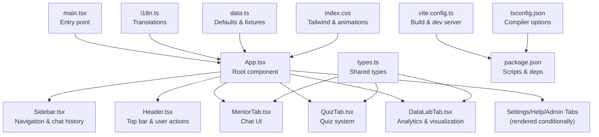
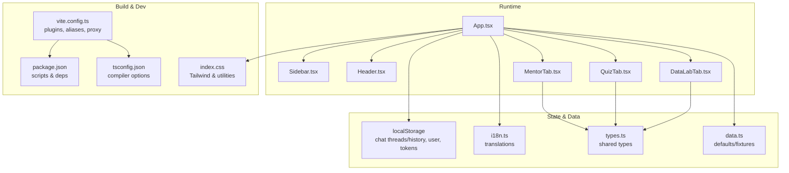
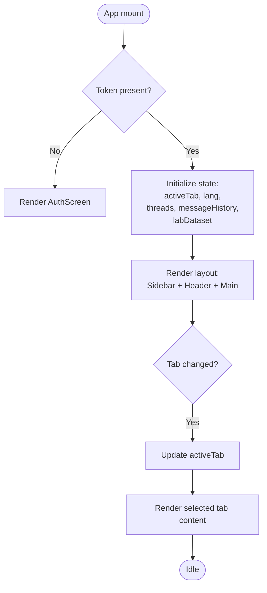
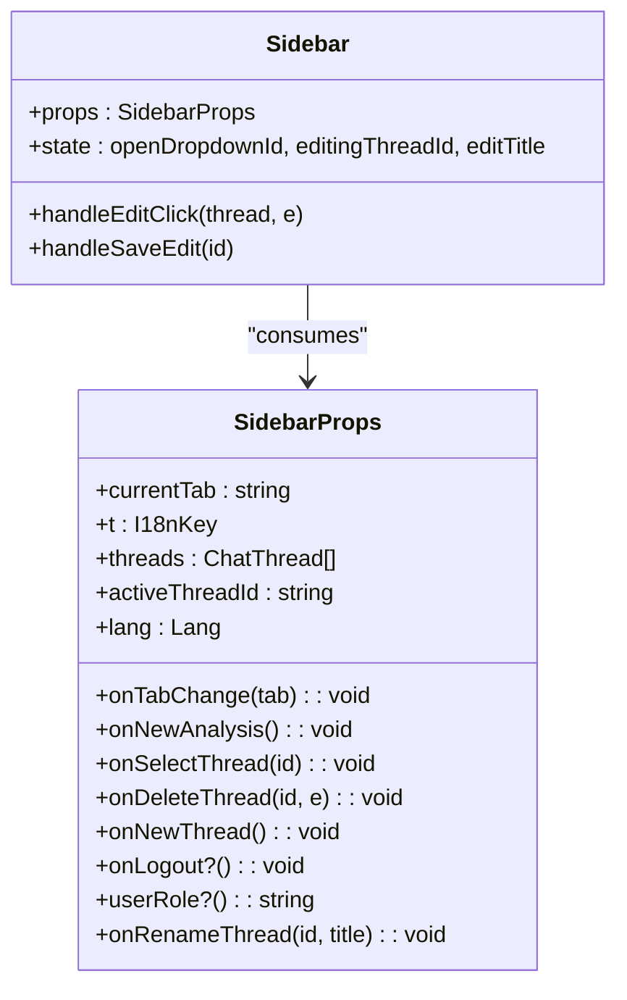
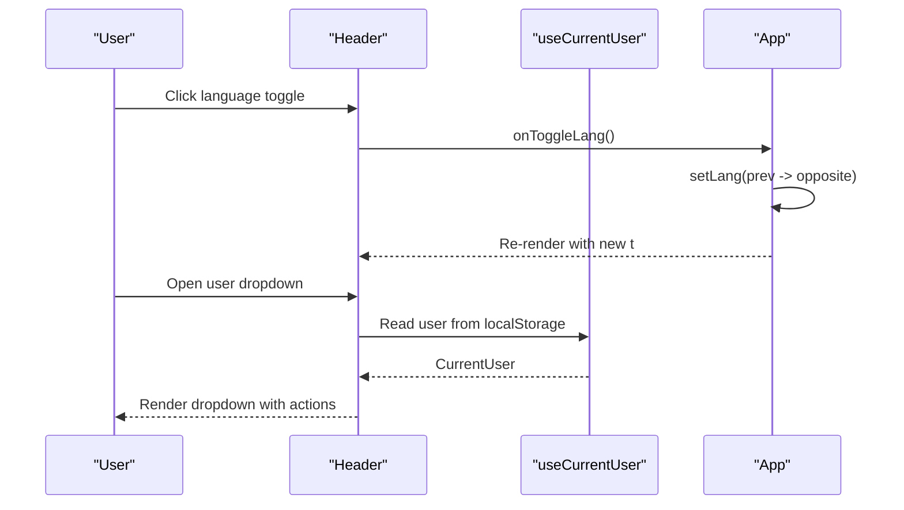
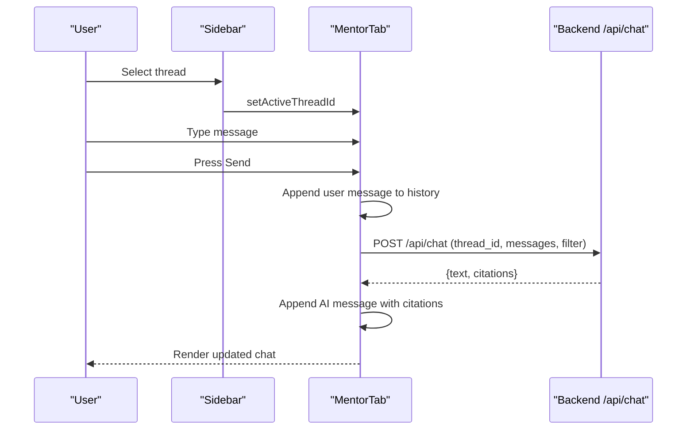
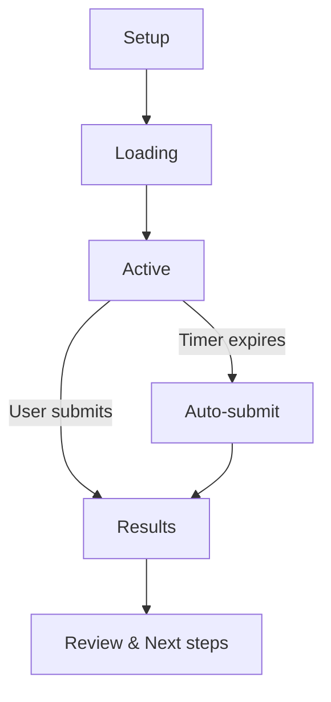
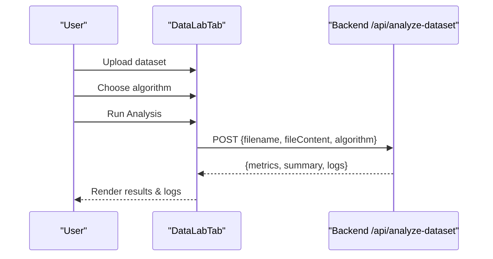
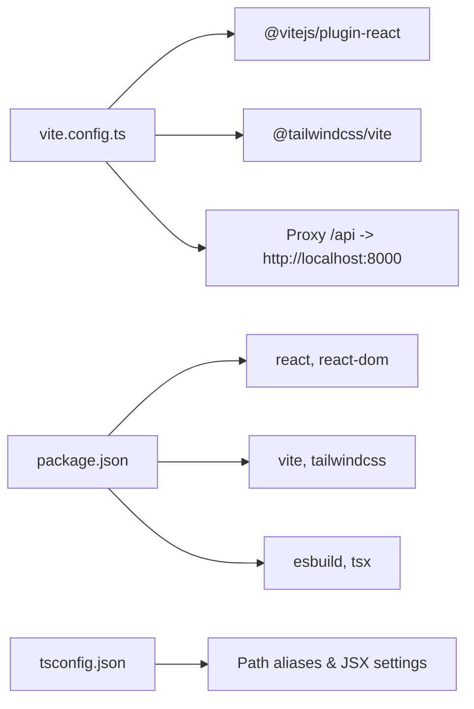

# Frontend Architecture

<cite>
**Referenced Files in This Document**
- [main.tsx](file://frontend/src/main.tsx)
- [App.tsx](file://frontend/src/App.tsx)
- [Sidebar.tsx](file://frontend/src/components/Sidebar.tsx)
- [Header.tsx](file://frontend/src/components/Header.tsx)
- [MentorTab.tsx](file://frontend/src/components/MentorTab.tsx)
- [QuizTab.tsx](file://frontend/src/components/QuizTab.tsx)
- [DataLabTab.tsx](file://frontend/src/components/DataLabTab.tsx)
- [useCurrentUser.ts](file://frontend/src/hooks/useCurrentUser.ts)
- [i18n.ts](file://frontend/src/i18n.ts)
- [types.ts](file://frontend/src/types.ts)
- [data.ts](file://frontend/src/data.ts)
- [index.css](file://frontend/src/index.css)
- [vite.config.ts](file://frontend/vite.config.ts)
- [package.json](file://frontend/package.json)
- [tsconfig.json](file://frontend/tsconfig.json)
</cite>

## Table of Contents
1. [Introduction](#introduction)
2. [Project Structure](#project-structure)
3. [Core Components](#core-components)
4. [Architecture Overview](#architecture-overview)
5. [Detailed Component Analysis](#detailed-component-analysis)
6. [Dependency Analysis](#dependency-analysis)
7. [Performance Considerations](#performance-considerations)
8. [Troubleshooting Guide](#troubleshooting-guide)
9. [Conclusion](#conclusion)

## Introduction
This document describes the MinerAI frontend architecture built with React 19 and Vite. It covers the application structure, component hierarchy, state management, routing, internationalization, styling, and integration with backend APIs. Special attention is given to educational UI patterns for the chat interface, quiz system, and data lab/analytics dashboard.

## Project Structure
The frontend is organized around a single-page application pattern with a root entry, global styles, and a modular component library. Build and dev tooling leverage Vite with Tailwind CSS and TypeScript.

**Diagram sources**
- [main.tsx:1-11](file://frontend/src/main.tsx#L1-L11)
- [App.tsx:1-311](file://frontend/src/App.tsx#L1-L311)
- [Sidebar.tsx:1-229](file://frontend/src/components/Sidebar.tsx#L1-L229)
- [Header.tsx:1-123](file://frontend/src/components/Header.tsx#L1-L123)
- [MentorTab.tsx:1-411](file://frontend/src/components/MentorTab.tsx#L1-L411)
- [QuizTab.tsx:1-800](file://frontend/src/components/QuizTab.tsx#L1-L800)
- [DataLabTab.tsx:1-344](file://frontend/src/components/DataLabTab.tsx#L1-L344)
- [i18n.ts:1-265](file://frontend/src/i18n.ts#L1-L265)
- [types.ts:1-57](file://frontend/src/types.ts#L1-L57)
- [data.ts:1-78](file://frontend/src/data.ts#L1-L78)
- [index.css:1-122](file://frontend/src/index.css#L1-L122)
- [vite.config.ts:1-29](file://frontend/vite.config.ts#L1-L29)
- [package.json:1-36](file://frontend/package.json#L1-L36)
- [tsconfig.json:1-27](file://frontend/tsconfig.json#L1-L27)

**Section sources**
- [main.tsx:1-11](file://frontend/src/main.tsx#L1-L11)
- [vite.config.ts:1-29](file://frontend/vite.config.ts#L1-L29)
- [package.json:1-36](file://frontend/package.json#L1-L36)
- [tsconfig.json:1-27](file://frontend/tsconfig.json#L1-L27)

## Core Components
- Root entry initializes strict mode and renders the App component.
- App orchestrates global state: authentication, active tab, language, chat threads/messages, and dataset for Data Lab.
- Sidebar provides navigation, chat thread list, and quick actions.
- Header displays current tab title, language toggle, notifications, and user dropdown.
- MentorTab implements the chat UI with message rendering, citations, quick questions, and document filtering.
- QuizTab manages quiz lifecycle: setup, loading, active, and results; integrates with backend endpoints for questions and scoring.
- DataLabTab handles dataset upload, algorithm selection, and visualization of analysis results.
- useCurrentUser hook reads user info from localStorage and syncs across browser tabs.
- i18n module centralizes translations for Vietnamese and English.
- Shared types define chat messages, threads, datasets, and analysis results.
- Defaults and fixtures provide initial data for libraries and chat history.

**Section sources**
- [App.tsx:19-311](file://frontend/src/App.tsx#L19-L311)
- [Sidebar.tsx:23-229](file://frontend/src/components/Sidebar.tsx#L23-L229)
- [Header.tsx:16-123](file://frontend/src/components/Header.tsx#L16-L123)
- [MentorTab.tsx:28-411](file://frontend/src/components/MentorTab.tsx#L28-L411)
- [QuizTab.tsx:43-800](file://frontend/src/components/QuizTab.tsx#L43-L800)
- [DataLabTab.tsx:11-344](file://frontend/src/components/DataLabTab.tsx#L11-L344)
- [useCurrentUser.ts:54-70](file://frontend/src/hooks/useCurrentUser.ts#L54-L70)
- [i18n.ts:5-265](file://frontend/src/i18n.ts#L5-L265)
- [types.ts:1-57](file://frontend/src/types.ts#L1-L57)
- [data.ts:1-78](file://frontend/src/data.ts#L1-L78)

## Architecture Overview
The frontend follows a centralized state pattern with React hooks and localStorage persistence for chat history and user preferences. Routing is handled via a simple tab-based switcher inside App. Internationalization is injected via a translation object. Styling leverages Tailwind CSS with custom animations and utilities.

**Diagram sources**
- [App.tsx:19-311](file://frontend/src/App.tsx#L19-L311)
- [Sidebar.tsx:23-229](file://frontend/src/components/Sidebar.tsx#L23-L229)
- [Header.tsx:16-123](file://frontend/src/components/Header.tsx#L16-L123)
- [MentorTab.tsx:28-411](file://frontend/src/components/MentorTab.tsx#L28-L411)
- [QuizTab.tsx:43-800](file://frontend/src/components/QuizTab.tsx#L43-L800)
- [DataLabTab.tsx:11-344](file://frontend/src/components/DataLabTab.tsx#L11-L344)
- [i18n.ts:5-265](file://frontend/src/i18n.ts#L5-L265)
- [types.ts:1-57](file://frontend/src/types.ts#L1-L57)
- [data.ts:1-78](file://frontend/src/data.ts#L1-L78)
- [vite.config.ts:6-29](file://frontend/vite.config.ts#L6-L29)
- [package.json:6-12](file://frontend/package.json#L6-L12)
- [tsconfig.json:18-24](file://frontend/tsconfig.json#L18-L24)
- [index.css:1-122](file://frontend/src/index.css#L1-L122)

## Detailed Component Analysis

### Application Shell and Global State
- Strict mode enabled at entry.
- App manages:
  - Authentication state via localStorage token.
  - Active tab switching.
  - Language state and translation injection.
  - Chat threads and message history with localStorage persistence.
  - Data Lab dataset state.
  - Quick quiz topic trigger.
- Conditional rendering routes to Overview, Mentor, Quiz, DataLab, Library, Summary Notes, Settings, Help, Admin, and My Questions tabs.

**Diagram sources**
- [App.tsx:20-311](file://frontend/src/App.tsx#L20-L311)

**Section sources**
- [main.tsx:1-11](file://frontend/src/main.tsx#L1-L11)
- [App.tsx:19-311](file://frontend/src/App.tsx#L19-L311)

### Sidebar Component
- Renders navigation items and admin-specific items when user role is admin.
- Displays chat thread list with rename/edit and delete actions.
- Provides quick actions: new analysis and new thread creation.

**Diagram sources**
- [Sidebar.tsx:7-229](file://frontend/src/components/Sidebar.tsx#L7-L229)

**Section sources**
- [Sidebar.tsx:23-229](file://frontend/src/components/Sidebar.tsx#L23-L229)

### Header Component
- Displays current tab title derived from language.
- Provides language toggle and user dropdown with help and logout actions.
- Uses useCurrentUser hook to show user info.

**Diagram sources**
- [Header.tsx:16-123](file://frontend/src/components/Header.tsx#L16-L123)
- [useCurrentUser.ts:54-70](file://frontend/src/hooks/useCurrentUser.ts#L54-L70)
- [App.tsx:192-194](file://frontend/src/App.tsx#L192-L194)

**Section sources**
- [Header.tsx:16-123](file://frontend/src/components/Header.tsx#L16-L123)
- [useCurrentUser.ts:54-70](file://frontend/src/hooks/useCurrentUser.ts#L54-L70)

### Chat Interface (MentorTab)
- Manages message composition, sending, and rendering.
- Integrates with backend chat endpoint, passing thread_id, messages, and optional metadata filter.
- Supports citations display and quick questions.
- Persists chat history per user key in localStorage.

**Diagram sources**
- [MentorTab.tsx:49-128](file://frontend/src/components/MentorTab.tsx#L49-L128)
- [App.tsx:95-165](file://frontend/src/App.tsx#L95-L165)

**Section sources**
- [MentorTab.tsx:28-411](file://frontend/src/components/MentorTab.tsx#L28-L411)
- [App.tsx:35-165](file://frontend/src/App.tsx#L35-L165)

### Quiz System (QuizTab)
- Supports predefined topics and a library modal to load admin-created quizzes.
- Personalized weak-topic suggestions fetched from backend.
- Lifecycle: setup → loading → active → completed.
- Integrates with multiple endpoints for questions, answers, and results.
- Timer-driven auto-submit when time expires.

**Diagram sources**
- [QuizTab.tsx:43-800](file://frontend/src/components/QuizTab.tsx#L43-L800)

**Section sources**
- [QuizTab.tsx:43-800](file://frontend/src/components/QuizTab.tsx#L43-L800)

### Data Lab & Analytics (DataLabTab)
- Handles dataset upload (CSV/JSON/XLSX), preview, and algorithm selection.
- Calls backend analysis endpoint and streams console-like logs.
- Renders metrics, charts, and summaries.

**Diagram sources**
- [DataLabTab.tsx:72-138](file://frontend/src/components/DataLabTab.tsx#L72-L138)

**Section sources**
- [DataLabTab.tsx:11-344](file://frontend/src/components/DataLabTab.tsx#L11-L344)

### Internationalization (i18n)
- Centralized translation object with keys for all UI strings.
- Lang type toggled in App; t is passed down to components.
- Keys cover sidebar, header, overview, mentor, library, datalab, settings, help, and footer.

**Section sources**
- [i18n.ts:5-265](file://frontend/src/i18n.ts#L5-L265)
- [App.tsx:22-23](file://frontend/src/App.tsx#L22-L23)

### Types and Defaults
- Strongly typed chat messages, threads, datasets, and analysis results.
- Default library items and chat history provide initial UX.

**Section sources**
- [types.ts:1-57](file://frontend/src/types.ts#L1-L57)
- [data.ts:1-78](file://frontend/src/data.ts#L1-L78)

## Dependency Analysis
- Build and dev dependencies include React 19, Vite, Tailwind CSS, TypeScript, and esbuild for SSR-like server packaging.
- Plugins: @vitejs/plugin-react and @tailwindcss/vite.
- Aliases configured for @/* path resolution.
- Proxy configured for /api to backend service.

**Diagram sources**
- [vite.config.ts:6-29](file://frontend/vite.config.ts#L6-L29)
- [package.json:13-36](file://frontend/package.json#L13-L36)
- [tsconfig.json:18-24](file://frontend/tsconfig.json#L18-L24)

**Section sources**
- [vite.config.ts:6-29](file://frontend/vite.config.ts#L6-L29)
- [package.json:13-36](file://frontend/package.json#L13-L36)
- [tsconfig.json:18-24](file://frontend/tsconfig.json#L18-L24)

## Performance Considerations
- Prefer memoization for expensive computations in components.
- Lazy-load heavy visualization libraries if needed.
- Debounce or throttle rapid UI updates (e.g., chat input).
- Use virtualized lists for long chat histories or quiz answer grids.
- Optimize Tailwind utilities to reduce CSS bundle size.
- Split bundles for admin-only tabs to avoid loading unnecessary code for regular users.

## Troubleshooting Guide
- Authentication issues: Verify minerai_token presence and validity; ensure onLogin persists token and triggers reload.
- Chat not persisting: Confirm localStorage keys for threads and history match user key; check useEffect persistence.
- Quiz errors: Inspect network requests to /api/quiz endpoints; validate Authorization header.
- Data Lab failures: Ensure uploaded file meets size/type limits; verify /api/analyze-dataset response shape.
- Styling anomalies: Check Tailwind layer directives and custom animations; ensure index.css is imported.

**Section sources**
- [App.tsx:201-211](file://frontend/src/App.tsx#L201-L211)
- [MentorTab.tsx:89-128](file://frontend/src/components/MentorTab.tsx#L89-L128)
- [QuizTab.tsx:225-252](file://frontend/src/components/QuizTab.tsx#L225-L252)
- [DataLabTab.tsx:97-138](file://frontend/src/components/DataLabTab.tsx#L97-L138)
- [index.css:1-122](file://frontend/src/index.css#L1-L122)

## Conclusion
The MinerAI frontend is a cohesive React 19 application structured around a central App shell, modular components, and a shared internationalization layer. State is managed locally with localStorage for chat and user data, while educational features integrate with backend endpoints for chat, quizzes, and analytics. The build system leverages Vite and Tailwind for fast iteration and consistent styling. The architecture supports scalability through component modularity and clear separation of concerns.