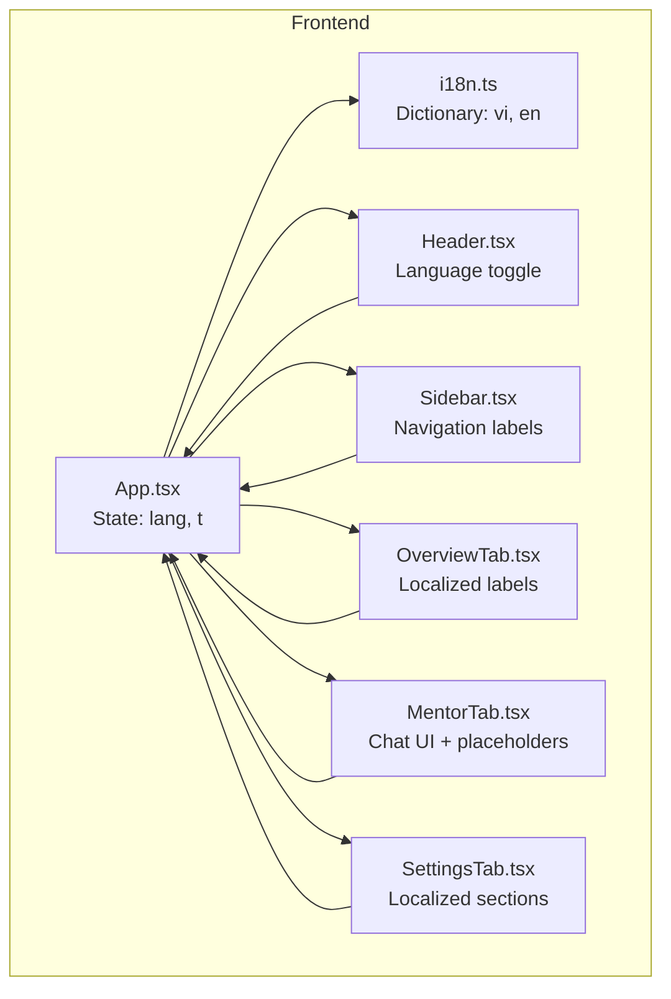
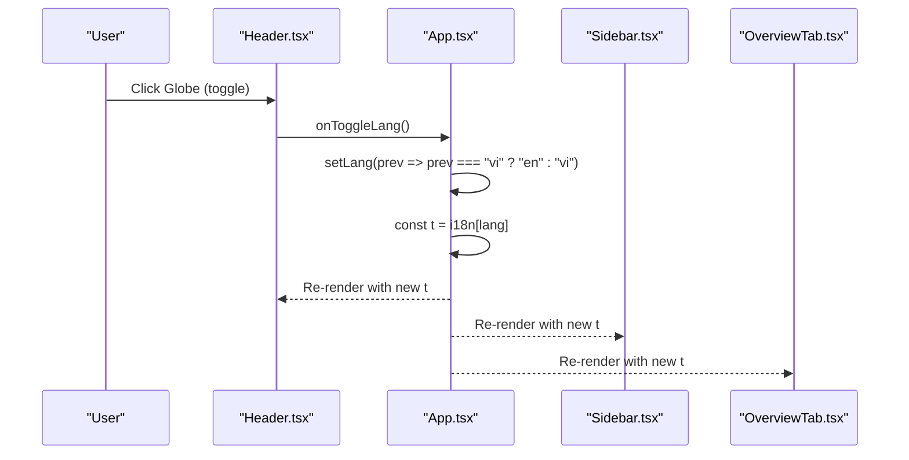
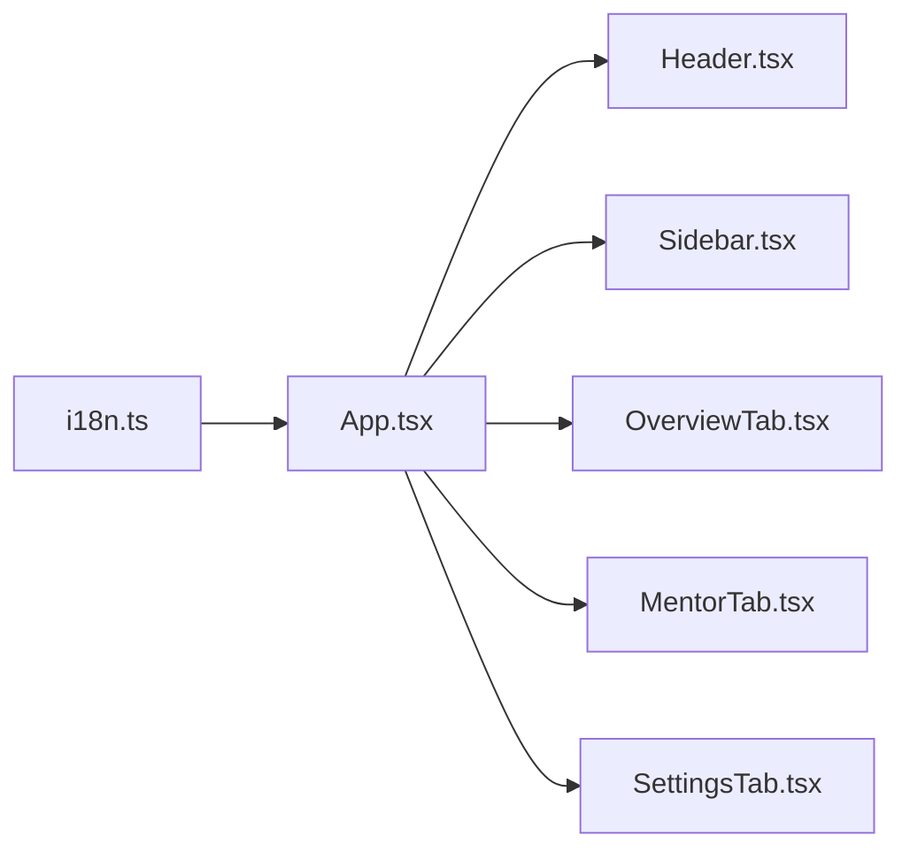

# Internationalization

<cite>
**Referenced Files in This Document**
- [i18n.ts](file://frontend/src/i18n.ts)
- [App.tsx](file://frontend/src/App.tsx)
- [Header.tsx](file://frontend/src/components/Header.tsx)
- [Sidebar.tsx](file://frontend/src/components/Sidebar.tsx)
- [OverviewTab.tsx](file://frontend/src/components/OverviewTab.tsx)
- [MentorTab.tsx](file://frontend/src/components/MentorTab.tsx)
- [SettingsTab.tsx](file://frontend/src/components/SettingsTab.tsx)
- [package.json](file://frontend/package.json)
</cite>

## Table of Contents
1. [Introduction](#introduction)
2. [Project Structure](#project-structure)
3. [Core Components](#core-components)
4. [Architecture Overview](#architecture-overview)
5. [Detailed Component Analysis](#detailed-component-analysis)
6. [Dependency Analysis](#dependency-analysis)
7. [Performance Considerations](#performance-considerations)
8. [Troubleshooting Guide](#troubleshooting-guide)
9. [Conclusion](#conclusion)

## Introduction
This document explains the internationalization (i18n) system in MinerAI’s frontend. It covers how language switching works, how translation keys are organized and accessed, and how locale-specific content is rendered across UI components. It also documents the current supported languages, the absence of pluralization and right-to-left language handling, and practical guidance for extending the system with lazy loading and advanced formatting.

## Project Structure
MinerAI’s i18n implementation is centralized in a single TypeScript module that exports a bilingual dictionary. The React application reads the current language from state and passes the active translation object down to components via props. Components render localized strings and locale-aware content such as timestamps and units.

**Diagram sources**
- [i18n.ts:1-265](file://frontend/src/i18n.ts#L1-L265)
- [App.tsx:19-311](file://frontend/src/App.tsx#L19-L311)
- [Header.tsx:16-123](file://frontend/src/components/Header.tsx#L16-L123)
- [Sidebar.tsx:23-229](file://frontend/src/components/Sidebar.tsx#L23-L229)
- [OverviewTab.tsx:14-287](file://frontend/src/components/OverviewTab.tsx#L14-L287)
- [MentorTab.tsx:28-411](file://frontend/src/components/MentorTab.tsx#L28-L411)
- [SettingsTab.tsx:8-163](file://frontend/src/components/SettingsTab.tsx#L8-L163)

**Section sources**
- [i18n.ts:1-265](file://frontend/src/i18n.ts#L1-L265)
- [App.tsx:19-311](file://frontend/src/App.tsx#L19-L311)

## Core Components
- i18n dictionary: A bilingual object keyed by language identifiers with nested keys for UI strings and structured values (e.g., arrays, nested objects).
- Language state: A single source of truth for the active language stored in the root component.
- Translation accessor: Components receive a translation object derived from the active language and render localized strings.
- Locale-sensitive rendering: Components use the active language to format dates/times and adapt labels.

Key implementation references:
- Dictionary definition and keys: [i18n.ts:1-265](file://frontend/src/i18n.ts#L1-L265)
- Root state and translation binding: [App.tsx:22-23](file://frontend/src/App.tsx#L22-L23)
- Language toggle handler: [App.tsx:192-194](file://frontend/src/App.tsx#L192-L194)
- Passing t to children: [App.tsx:216-298](file://frontend/src/App.tsx#L216-L298)

**Section sources**
- [i18n.ts:1-265](file://frontend/src/i18n.ts#L1-L265)
- [App.tsx:19-311](file://frontend/src/App.tsx#L19-L311)

## Architecture Overview
The i18n architecture follows a unidirectional data flow:
- App maintains language state and derives the translation object.
- Header exposes a language toggle that flips the language.
- All child components receive the translation object and render localized content.
- Some components adjust formatting based on the active language (e.g., date/time locales, unit labels).

**Diagram sources**
- [Header.tsx:56-64](file://frontend/src/components/Header.tsx#L56-L64)
- [App.tsx:192-194](file://frontend/src/App.tsx#L192-L194)
- [App.tsx:216-298](file://frontend/src/App.tsx#L216-L298)

## Detailed Component Analysis

### i18n Dictionary and Keys
- Supported languages: Vietnamese ("vi") and English ("en").
- Keys are grouped by UI areas (e.g., nav, headerTabs, overview, mentor, settings, help, footer).
- Values include plain strings, arrays (e.g., quick questions), and nested objects (e.g., statUnit).
- Type safety: A type alias constrains language identifiers and exposes a type derived from the Vietnamese dictionary.

Implementation highlights:
- Language union and dictionary shape: [i18n.ts:3-262](file://frontend/src/i18n.ts#L3-L262)
- Nested keys for structured content: [i18n.ts:10-42](file://frontend/src/i18n.ts#L10-L42), [i18n.ts:140-170](file://frontend/src/i18n.ts#L140-L170)

**Section sources**
- [i18n.ts:1-265](file://frontend/src/i18n.ts#L1-L265)

### Language Switching Mechanism
- State: App maintains a language state initialized to Vietnamese.
- Accessor: A computed translation object is derived from the active language.
- Toggle: Header triggers a function that flips the language between "vi" and "en".
- Propagation: The translation object is passed down to all components.

References:
- Language state and accessor: [App.tsx:22-23](file://frontend/src/App.tsx#L22-L23)
- Toggle handler: [App.tsx:192-194](file://frontend/src/App.tsx#L192-L194)
- Passing t to children: [App.tsx:216-298](file://frontend/src/App.tsx#L216-L298)
- Globe button and tooltip: [Header.tsx:56-64](file://frontend/src/components/Header.tsx#L56-L64)

**Section sources**
- [App.tsx:19-311](file://frontend/src/App.tsx#L19-L311)
- [Header.tsx:16-123](file://frontend/src/components/Header.tsx#L16-L123)

### Translation Key Management
- Centralized storage: All keys live in a single file for easy maintenance and review.
- Granular grouping: Keys are grouped by UI sections to simplify scanning and editing.
- Consistent naming: Keys reflect the UI area and purpose (e.g., nav.overview, statUnit.docs).

References:
- Navigation keys: [i18n.ts:10-18](file://frontend/src/i18n.ts#L10-L18)
- Statistic units: [i18n.ts:42](file://frontend/src/i18n.ts#L42)
- Quick questions: [i18n.ts:65-69](file://frontend/src/i18n.ts#L65-L69)

**Section sources**
- [i18n.ts:1-265](file://frontend/src/i18n.ts#L1-L265)

### Locale-Specific Content Rendering
- Timestamps: Components format time/date using locale-specific options when constructing timestamps.
- Unit labels: Components read unit labels from the translation object to match the active language.
- Conditional labels: Some labels are conditionally rendered based on the active language.

References:
- Timestamp formatting with locale: [App.tsx:115](file://frontend/src/App.tsx#L115)
- Stat unit selection: [OverviewTab.tsx:192-196](file://frontend/src/components/OverviewTab.tsx#L192-L196)
- Conditional labels: [Sidebar.tsx:59-60](file://frontend/src/components/Sidebar.tsx#L59-L60)

**Section sources**
- [App.tsx:95-133](file://frontend/src/App.tsx#L95-L133)
- [OverviewTab.tsx:18-40](file://frontend/src/components/OverviewTab.tsx#L18-L40)
- [Sidebar.tsx:55-67](file://frontend/src/components/Sidebar.tsx#L55-L67)

### UI Components Using Translations
- Header: Renders localized tab titles and logout text; includes the language toggle.
- Sidebar: Displays navigation items and chat history section titles using the translation object.
- OverviewTab: Shows localized labels for progress, insights, and recent lessons.
- MentorTab: Uses placeholders, warnings, and quick questions from the translation object.
- SettingsTab: Localizes section headers and informational text.

References:
- Header localization: [Header.tsx:32-41](file://frontend/src/components/Header.tsx#L32-L41), [Header.tsx:102-116](file://frontend/src/components/Header.tsx#L102-L116)
- Sidebar navigation: [Sidebar.tsx:55-63](file://frontend/src/components/Sidebar.tsx#L55-L63)
- Overview labels: [OverviewTab.tsx:178-205](file://frontend/src/components/OverviewTab.tsx#L178-L205)
- Mentor placeholders and warnings: [MentorTab.tsx:388-404](file://frontend/src/components/MentorTab.tsx#L388-L404)
- Settings localization: [SettingsTab.tsx:38-160](file://frontend/src/components/SettingsTab.tsx#L38-L160)

**Section sources**
- [Header.tsx:16-123](file://frontend/src/components/Header.tsx#L16-L123)
- [Sidebar.tsx:23-229](file://frontend/src/components/Sidebar.tsx#L23-L229)
- [OverviewTab.tsx:14-287](file://frontend/src/components/OverviewTab.tsx#L14-L287)
- [MentorTab.tsx:28-411](file://frontend/src/components/MentorTab.tsx#L28-L411)
- [SettingsTab.tsx:8-163](file://frontend/src/components/SettingsTab.tsx#L8-L163)

### Dynamic Language Switching Implementation
- Single source of truth: The App component holds the language state and recomputes the translation object on change.
- No external i18n library: The solution relies on a plain TypeScript object and React props.
- Immediate re-render: Changing the language triggers a re-render of all components receiving the translation object.

References:
- State initialization and accessor: [App.tsx:22-23](file://frontend/src/App.tsx#L22-L23)
- Toggle implementation: [App.tsx:192-194](file://frontend/src/App.tsx#L192-L194)

**Section sources**
- [App.tsx:19-311](file://frontend/src/App.tsx#L19-L311)

### Locale-Aware Formatting
- Date/time formatting: Components pass locale identifiers to formatting APIs when building timestamps.
- Units and labels: Components read localized unit strings from the translation object.

References:
- Locale-aware timestamp: [App.tsx:115](file://frontend/src/App.tsx#L115)
- Stat units: [i18n.ts:42](file://frontend/src/i18n.ts#L42)

**Section sources**
- [App.tsx:105-133](file://frontend/src/App.tsx#L105-L133)
- [i18n.ts:42](file://frontend/src/i18n.ts#L42)

### Right-to-Left Language Support Considerations
- Current state: There is no explicit RTL layout handling in the codebase.
- Implications: Components rely on standard left-to-right rendering; no directionality adjustments are applied.

[No sources needed since this section analyzes absence of RTL handling]

### Pluralization and Advanced Formatting
- Current state: The system does not implement pluralization or ICU-style message formatting.
- Workarounds: Numeric suffixes and conditional labels are used (e.g., statUnit, quickQuestions).
- Recommendation: Introduce a lightweight pluralization helper or an i18n library to support complex formatting.

[No sources needed since this section provides general guidance]

### Managing Language-Specific Layouts
- Current state: Layouts are shared across languages; there is no separate layout per language.
- Recommendation: Extract layout wrappers or theme toggles to enable language-specific layouts if needed.

[No sources needed since this section provides general guidance]

## Dependency Analysis
- App depends on i18n.ts for the translation object.
- Components depend on App for the translation object via props.
- Header and Sidebar depend on the language state to render the toggle and localized labels.
- MentorTab and OverviewTab depend on the translation object for placeholders, warnings, and labels.

**Diagram sources**
- [i18n.ts:1-265](file://frontend/src/i18n.ts#L1-L265)
- [App.tsx:19-311](file://frontend/src/App.tsx#L19-L311)
- [Header.tsx:16-123](file://frontend/src/components/Header.tsx#L16-L123)
- [Sidebar.tsx:23-229](file://frontend/src/components/Sidebar.tsx#L23-L229)
- [OverviewTab.tsx:14-287](file://frontend/src/components/OverviewTab.tsx#L14-L287)
- [MentorTab.tsx:28-411](file://frontend/src/components/MentorTab.tsx#L28-L411)
- [SettingsTab.tsx:8-163](file://frontend/src/components/SettingsTab.tsx#L8-L163)

**Section sources**
- [i18n.ts:1-265](file://frontend/src/i18n.ts#L1-L265)
- [App.tsx:19-311](file://frontend/src/App.tsx#L19-L311)

## Performance Considerations
- Bundle size: The entire dictionary is included in the main bundle. For large translation sets, consider splitting dictionaries by feature or route.
- Lazy loading: Load language bundles on demand when switching languages or entering specific sections.
- Caching: Cache frequently used translations in memory to avoid repeated lookups.
- Minification: Keep translation keys concise and avoid unnecessary duplication.

[No sources needed since this section provides general guidance]

## Troubleshooting Guide
- Missing translation key: If a key is absent, the component may render undefined or fallback text. Verify the key exists under the correct language branch.
- Incorrect language after reload: Ensure the language state persists across reloads if needed, or initialize from a persisted preference.
- Mixed-language strings: Confirm that all strings are retrieved from the translation object and not hardcoded.

[No sources needed since this section provides general guidance]

## Conclusion
MinerAI’s i18n system is intentionally simple and effective: a bilingual dictionary with a single source of truth for language state and a straightforward prop-passing pattern. It supports two languages, locale-aware formatting for timestamps and units, and dynamic switching without external libraries. Future enhancements could include pluralization, RTL support, and lazy-loading strategies for larger translation sets.