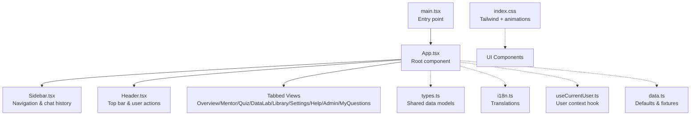
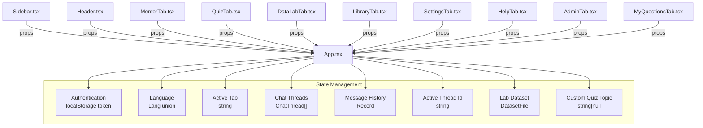
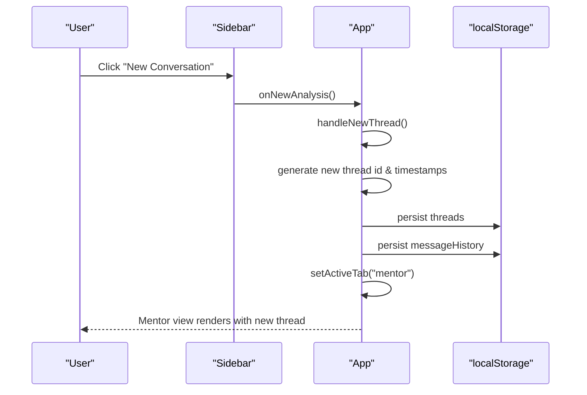
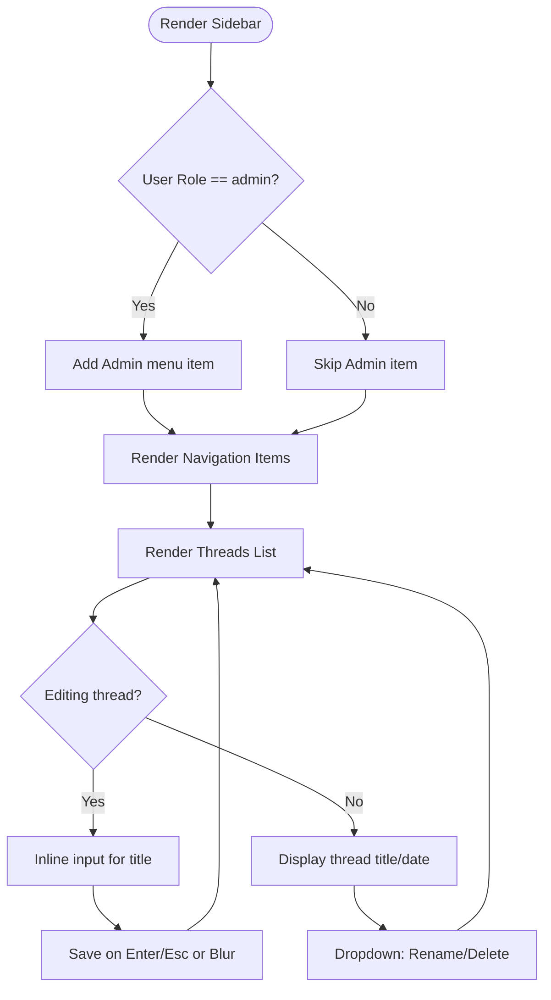
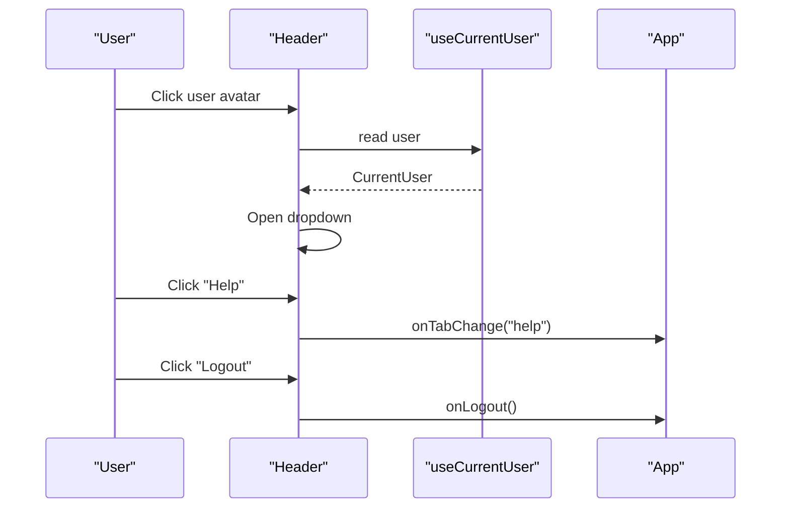
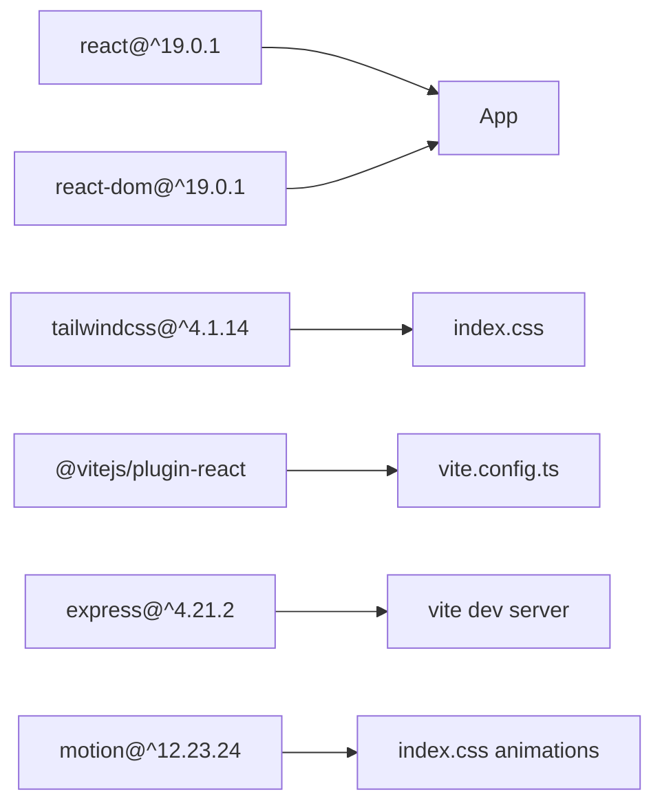

# React Application Structure

<cite>
**Referenced Files in This Document**
- [App.tsx](file://frontend/src/App.tsx)
- [main.tsx](file://frontend/src/main.tsx)
- [i18n.ts](file://frontend/src/i18n.ts)
- [types.ts](file://frontend/src/types.ts)
- [Sidebar.tsx](file://frontend/src/components/Sidebar.tsx)
- [Header.tsx](file://frontend/src/components/Header.tsx)
- [useCurrentUser.ts](file://frontend/src/hooks/useCurrentUser.ts)
- [index.css](file://frontend/src/index.css)
- [data.ts](file://frontend/src/data.ts)
- [vite.config.ts](file://frontend/vite.config.ts)
- [package.json](file://frontend/package.json)
- [tsconfig.json](file://frontend/tsconfig.json)
</cite>

## Table of Contents
1. [Introduction](#introduction)
2. [Project Structure](#project-structure)
3. [Core Components](#core-components)
4. [Architecture Overview](#architecture-overview)
5. [Detailed Component Analysis](#detailed-component-analysis)
6. [Dependency Analysis](#dependency-analysis)
7. [Performance Considerations](#performance-considerations)
8. [Troubleshooting Guide](#troubleshooting-guide)
9. [Conclusion](#conclusion)

## Introduction
This document explains the React 19 application structure for MinerAI, focusing on the main App component architecture, component hierarchy, state management patterns, routing via tab switching, chat state lifting, global state through React hooks, internationalization, theming, and responsive design. It also covers component composition, prop drilling strategies, state persistence, lifecycle management, and performance optimization techniques.

## Project Structure
The frontend is a React 19 application configured with Vite and Tailwind CSS. The entry point renders the root App component inside a StrictMode wrapper. Internationalization is centralized in a single translation module, while shared types define the shape of chat, library, and progress data. Styling leverages Tailwind utilities and custom CSS animations.

**Diagram sources**
- [main.tsx:1-11](file://frontend/src/main.tsx#L1-L11)
- [App.tsx:1-311](file://frontend/src/App.tsx#L1-L311)
- [Sidebar.tsx:1-229](file://frontend/src/components/Sidebar.tsx#L1-L229)
- [Header.tsx:1-123](file://frontend/src/components/Header.tsx#L1-L123)
- [i18n.ts:1-265](file://frontend/src/i18n.ts#L1-L265)
- [types.ts:1-57](file://frontend/src/types.ts#L1-L57)
- [useCurrentUser.ts:1-70](file://frontend/src/hooks/useCurrentUser.ts#L1-L70)
- [data.ts:1-78](file://frontend/src/data.ts#L1-L78)
- [index.css:1-122](file://frontend/src/index.css#L1-L122)

**Section sources**
- [main.tsx:1-11](file://frontend/src/main.tsx#L1-L11)
- [vite.config.ts:1-29](file://frontend/vite.config.ts#L1-L29)
- [package.json:1-36](file://frontend/package.json#L1-L36)
- [tsconfig.json:1-27](file://frontend/tsconfig.json#L1-L27)

## Core Components
- App: Central orchestrator managing authentication state, active tab, language, chat threads and message history, and rendering the tabbed UI. Implements state lifting for chat and persists data to localStorage keyed by user email.
- Sidebar: Renders navigation and chat thread list, supports create/rename/delete, and toggles active thread selection.
- Header: Displays current tab title, language toggle, notifications, and user dropdown with logout.
- Internationalization: Single i18n module exports translations for Vietnamese and English, typed via a Lang union and I18nKey.
- Shared types: Define ChatMessage, ChatThread, DatasetFile, and other domain models.
- User hook: Reads current user from localStorage or JWT payload fallback and listens to storage events.

**Section sources**
- [App.tsx:19-311](file://frontend/src/App.tsx#L19-L311)
- [Sidebar.tsx:23-229](file://frontend/src/components/Sidebar.tsx#L23-L229)
- [Header.tsx:16-123](file://frontend/src/components/Header.tsx#L16-L123)
- [i18n.ts:3-265](file://frontend/src/i18n.ts#L3-L265)
- [types.ts:1-57](file://frontend/src/types.ts#L1-L57)
- [useCurrentUser.ts:54-70](file://frontend/src/hooks/useCurrentUser.ts#L54-L70)

## Architecture Overview
MinerAI uses a flat, tab-based routing pattern where the active tab determines which view renders. State is lifted to the root App component for:
- Authentication and user session
- Active tab selection
- Language selection
- Chat threads and message history
- Selected dataset for Data Lab
- Custom quiz topic

**Diagram sources**
- [App.tsx:20-103](file://frontend/src/App.tsx#L20-L103)
- [Sidebar.tsx:7-21](file://frontend/src/components/Sidebar.tsx#L7-L21)
- [Header.tsx:7-14](file://frontend/src/components/Header.tsx#L7-L14)

## Detailed Component Analysis

### App Component
- Authentication: Initializes from localStorage and conditionally renders AuthScreen until login completes.
- Tab Routing: Uses a single activeTab state to render the appropriate tab content.
- Internationalization: Derives translation object from selected Lang.
- Chat State Lifting:
  - Maintains threads and messageHistory keyed by active user email.
  - Persists both structures to localStorage on updates.
  - Provides handlers to create, rename, delete, and select threads.
- Data Lab: Manages a dataset object and triggers navigation to Data Lab after loading.
- Custom Quiz: Stores a topic string to drive QuizTab rendering.
- Theme & Responsive: Leverages Tailwind utilities and CSS variables for responsive layout and glass-like UI.

**Diagram sources**
- [App.tsx:113-133](file://frontend/src/App.tsx#L113-L133)
- [Sidebar.tsx:83-89](file://frontend/src/components/Sidebar.tsx#L83-L89)

**Section sources**
- [App.tsx:19-311](file://frontend/src/App.tsx#L19-L311)

### Sidebar Component
- Props: Receives currentTab, onTabChange, onNewAnalysis, t, threads, activeThreadId, onSelectThread, onDeleteThread, onNewThread, lang, onLogout, userRole, onRenameThread.
- Behavior:
  - Renders navigation items and optional admin item based on user role.
  - Displays chat threads with inline editing, dropdown actions, and selection highlighting.
  - Handles clicks outside dropdowns to close menus.
- Composition: Uses Lucide icons and Tailwind utilities for responsive layout.

**Diagram sources**
- [Sidebar.tsx:55-224](file://frontend/src/components/Sidebar.tsx#L55-L224)

**Section sources**
- [Sidebar.tsx:23-229](file://frontend/src/components/Sidebar.tsx#L23-L229)

### Header Component
- Props: currentTab, onTabChange, lang, onToggleLang, t, onLogout.
- Behavior:
  - Computes dynamic tab title based on currentTab and language.
  - Provides language toggle button.
  - Displays user profile dropdown with Help and Logout actions.
  - Uses a click-outside handler to close dropdowns.
- Hook: Integrates useCurrentUser to display user info.

**Diagram sources**
- [Header.tsx:16-123](file://frontend/src/components/Header.tsx#L16-L123)
- [useCurrentUser.ts:54-70](file://frontend/src/hooks/useCurrentUser.ts#L54-L70)

**Section sources**
- [Header.tsx:16-123](file://frontend/src/components/Header.tsx#L16-L123)

### Internationalization (i18n)
- Defines a Lang union ("vi" | "en") and an i18n object containing nested keys for sidebar, header, overview, mentor, library, datalab, settings, help, and footer.
- Exposes a typed I18nKey for consumers.
- Used throughout components via t = i18n[lang].

**Section sources**
- [i18n.ts:3-265](file://frontend/src/i18n.ts#L3-L265)

### Shared Types
- ChatMessage: message entity with role, content, timestamp, optional citations.
- ChatThread: thread metadata with id, title, and date grouping.
- DatasetFile: dataset metadata for Data Lab.
- Additional domain types for library items, analysis results, and learning progress.

**Section sources**
- [types.ts:1-57](file://frontend/src/types.ts#L1-L57)

### State Persistence and Lifecycle
- Persistence:
  - Chat threads and message history are persisted to localStorage under keys derived from the current user email.
  - Restoration occurs on mount by reading stored values.
- Lifecycle:
  - Effects write to localStorage whenever threads or messageHistory change.
  - useCurrentUser listens to storage events to keep user info synchronized across browser tabs.

**Section sources**
- [App.tsx:95-111](file://frontend/src/App.tsx#L95-L111)
- [useCurrentUser.ts:57-66](file://frontend/src/hooks/useCurrentUser.ts#L57-L66)

### Theme and Responsive Design
- Tailwind CSS + custom animations:
  - Glass-like panels and headers using backdrop-filter and subtle borders.
  - Animations for transitions and hover effects.
  - Scrollbar customization for webkit browsers.
- Responsive layout:
  - Flexbox-based main container with fixed sidebar and scrollable content area.
  - Conditional footer rendering based on active tab.

**Section sources**
- [index.css:1-122](file://frontend/src/index.css#L1-L122)
- [App.tsx:213-309](file://frontend/src/App.tsx#L213-L309)

## Dependency Analysis
- Runtime dependencies include React 19, Tailwind CSS v4, Vite, Express, and motion for animations.
- Build toolchain integrates Vite with React plugin and Tailwind CSS plugin.
- TypeScript configuration enables JSX with react-jsx and path aliases.

**Diagram sources**
- [package.json:13-34](file://frontend/package.json#L13-L34)
- [vite.config.ts:6-28](file://frontend/vite.config.ts#L6-L28)
- [index.css:1-122](file://frontend/src/index.css#L1-L122)

**Section sources**
- [package.json:1-36](file://frontend/package.json#L1-L36)
- [vite.config.ts:1-29](file://frontend/vite.config.ts#L1-L29)
- [tsconfig.json:1-27](file://frontend/tsconfig.json#L1-L27)

## Performance Considerations
- State lifting reduces prop drilling for chat and improves predictability.
- LocalStorage persistence avoids re-fetching data on reload but consider debouncing writes for high-frequency updates.
- Memoization opportunities exist for computed tab titles and translation lookups; consider useMemo/useCallback for heavy computations.
- Lazy-load tab components if bundle size grows; currently rendered via conditional blocks.
- Optimize rendering of long chat histories by virtualizing lists.
- Use React 19 features (e.g., concurrent rendering primitives) to improve responsiveness.

## Troubleshooting Guide
- Authentication loop:
  - Ensure localStorage contains a valid token and user payload; App checks for token presence to decide rendering path.
- Chat not persisting:
  - Verify localStorage keys include the user-derived identifiers; confirm effects run on state changes.
- Language toggle not working:
  - Confirm lang state updates and t recomputes; ensure i18n keys exist for used phrases.
- User info not updating across tabs:
  - useCurrentUser listens to storage events; ensure no silent failures in localStorage parsing.
- Sidebar dropdowns not closing:
  - Check click-outside handler registration and cleanup in Sidebar.

**Section sources**
- [App.tsx:201-211](file://frontend/src/App.tsx#L201-L211)
- [App.tsx:105-111](file://frontend/src/App.tsx#L105-L111)
- [useCurrentUser.ts:57-66](file://frontend/src/hooks/useCurrentUser.ts#L57-L66)
- [Sidebar.tsx:32-40](file://frontend/src/components/Sidebar.tsx#L32-L40)

## Conclusion
MinerAI’s React 19 application employs a clean, tab-driven architecture with state lifted to the root App component. Internationalization and theming are centralized, while localStorage ensures continuity across sessions. The component hierarchy emphasizes composition via props and minimal prop drilling, with clear separation of concerns between navigation, content areas, and shared utilities. As the application evolves, consider lazy-loading, memoization, and virtualization to sustain performance.