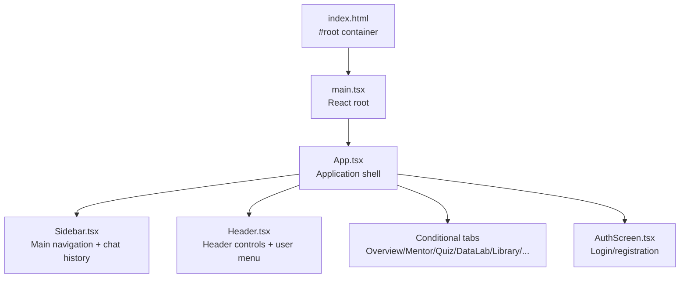
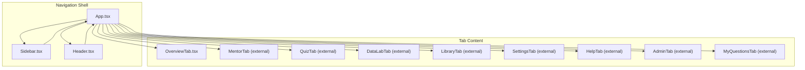
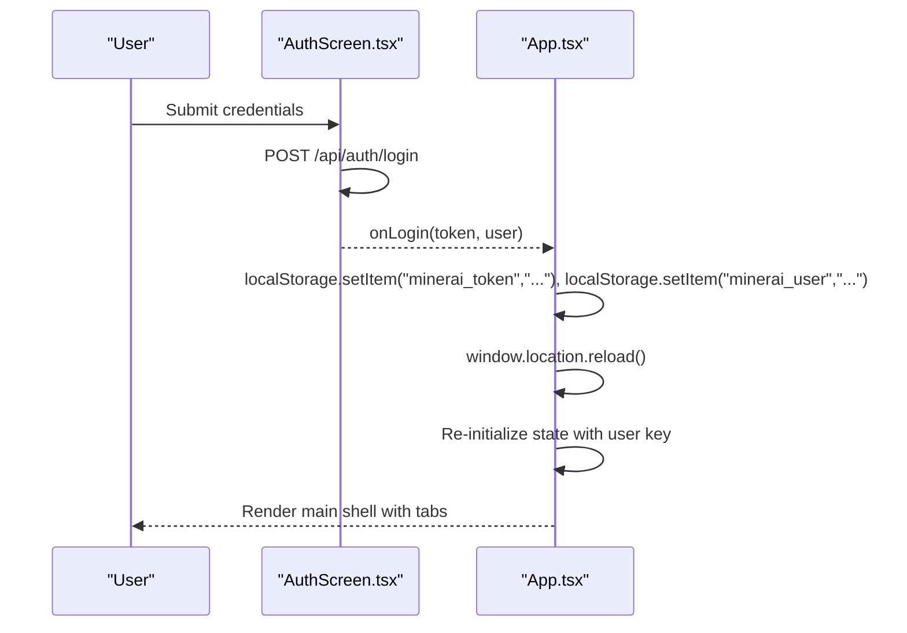
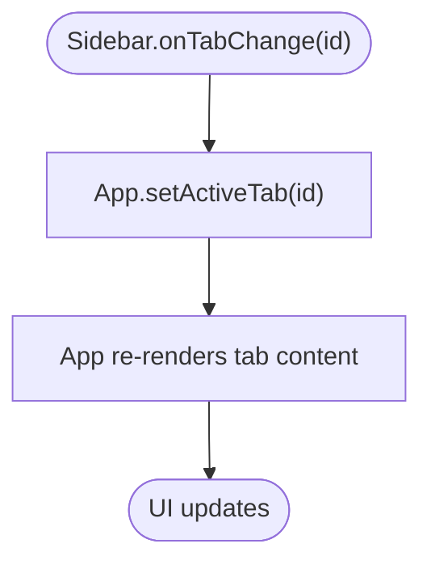
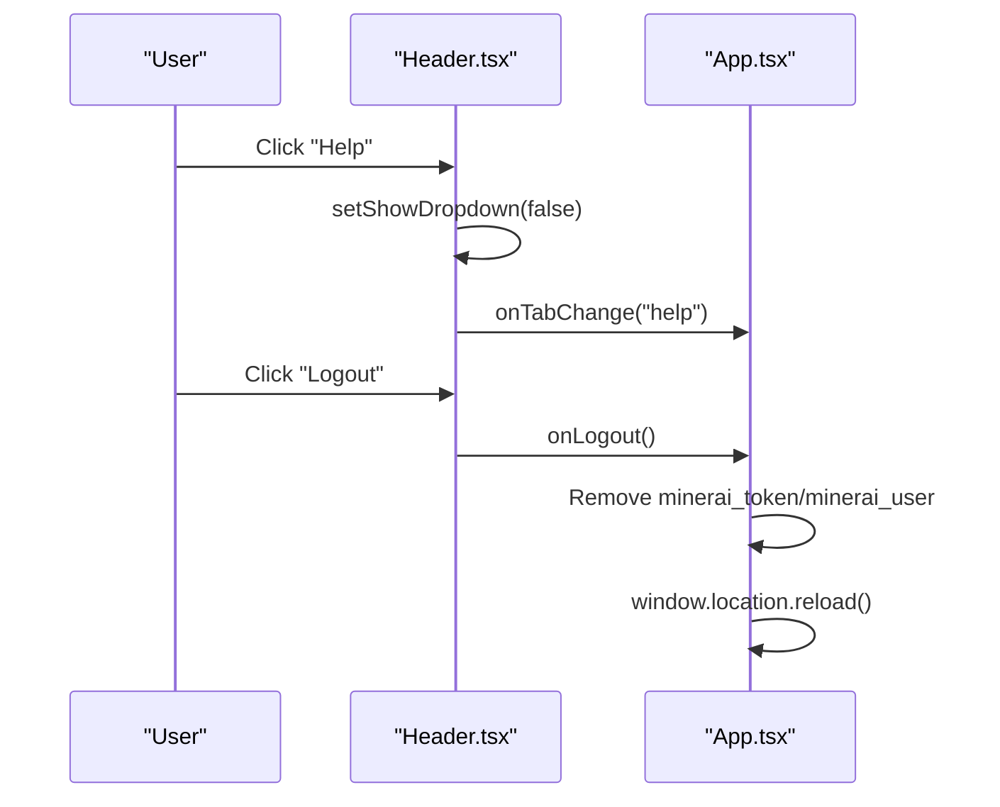
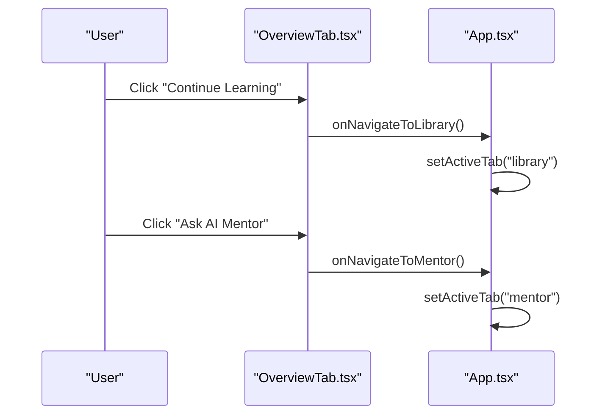
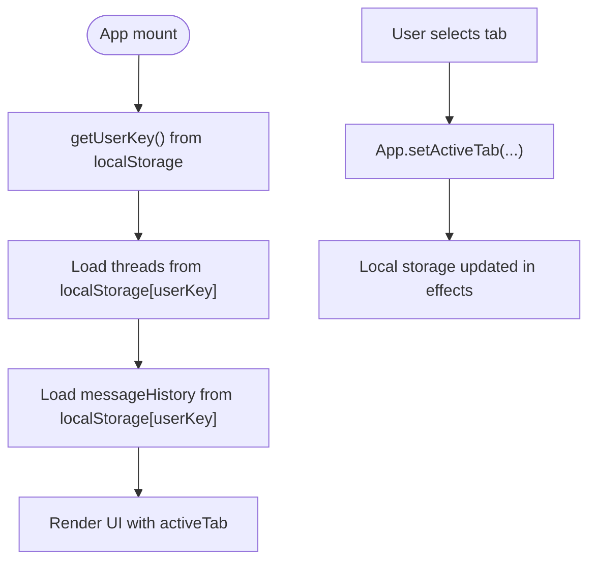
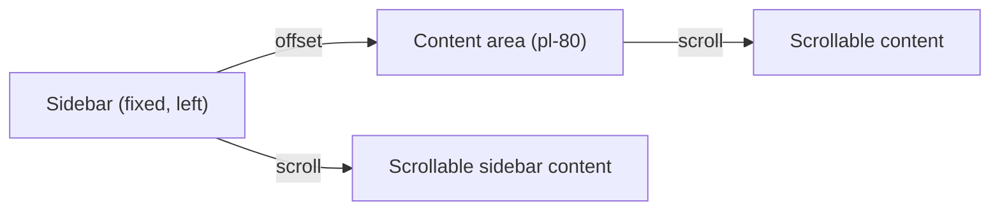
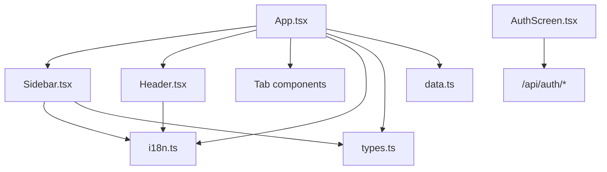

# Routing and Navigation

<cite>
**Referenced Files in This Document**
- [App.tsx](file://frontend/src/App.tsx)
- [Sidebar.tsx](file://frontend/src/components/Sidebar.tsx)
- [Header.tsx](file://frontend/src/components/Header.tsx)
- [OverviewTab.tsx](file://frontend/src/components/OverviewTab.tsx)
- [AuthScreen.tsx](file://frontend/src/components/AuthScreen.tsx)
- [i18n.ts](file://frontend/src/i18n.ts)
- [types.ts](file://frontend/src/types.ts)
- [data.ts](file://frontend/src/data.ts)
- [index.css](file://frontend/src/index.css)
- [index.html](file://frontend/index.html)
- [main.tsx](file://frontend/src/main.tsx)
</cite>

## Table of Contents
1. [Introduction](#introduction)
2. [Project Structure](#project-structure)
3. [Core Components](#core-components)
4. [Architecture Overview](#architecture-overview)
5. [Detailed Component Analysis](#detailed-component-analysis)
6. [Dependency Analysis](#dependency-analysis)
7. [Performance Considerations](#performance-considerations)
8. [Troubleshooting Guide](#troubleshooting-guide)
9. [Conclusion](#conclusion)

## Introduction
This document explains the routing and navigation system in MinerAI’s frontend. The application uses a tab-based navigation architecture with a persistent sidebar and header. Navigation is driven by React state, with programmatic triggers updating the active tab and managing chat thread contexts. Authentication state determines access and visibility of navigation items, while internationalization provides localized labels. The system emphasizes simplicity and responsiveness, with minimal external routing dependencies.

## Project Structure
The navigation system centers around the main application shell and three primary UI areas:
- Application shell orchestrating state and rendering
- Sidebar with main navigation and chat history
- Header with contextual actions and user controls
- Tabbed content areas rendered conditionally based on the active tab
- Authentication screen gating access to the application shell

**Diagram sources**
- [index.html:1-14](file://frontend/index.html#L1-L14)
- [main.tsx:1-11](file://frontend/src/main.tsx#L1-L11)
- [App.tsx:1-311](file://frontend/src/App.tsx#L1-L311)
- [Sidebar.tsx:1-229](file://frontend/src/components/Sidebar.tsx#L1-229)
- [Header.tsx:1-123](file://frontend/src/components/Header.tsx#L1-123)
- [AuthScreen.tsx:1-211](file://frontend/src/components/AuthScreen.tsx#L1-211)

**Section sources**
- [index.html:1-14](file://frontend/index.html#L1-L14)
- [main.tsx:1-11](file://frontend/src/main.tsx#L1-L11)
- [App.tsx:1-311](file://frontend/src/App.tsx#L1-L311)

## Core Components
- App shell manages:
  - Authentication state and redirection to AuthScreen
  - Active tab state and conditional rendering of tab components
  - Internationalization selection
  - Chat thread lifecycle (create, rename, delete, select)
  - Programmatic navigation triggers (e.g., start a new analysis)
- Sidebar provides:
  - Main navigation items mapped to tabs
  - Chat thread list with inline editing and actions
  - Role-aware visibility (admin-only items)
- Header provides:
  - Current tab awareness and navigation
  - Language toggle and logout action
  - User dropdown with contextual actions

**Section sources**
- [App.tsx:19-311](file://frontend/src/App.tsx#L19-L311)
- [Sidebar.tsx:1-229](file://frontend/src/components/Sidebar.tsx#L1-L229)
- [Header.tsx:1-123](file://frontend/src/components/Header.tsx#L1-L123)
- [i18n.ts:1-265](file://frontend/src/i18n.ts#L1-L265)

## Architecture Overview
The navigation architecture is state-driven and component-centric:
- State is held in App.tsx (active tab, language, chat threads, message history).
- Sidebar and Header receive callbacks to update state.
- Conditional rendering switches content based on active tab.
- Authentication state gates access to the application shell.

**Diagram sources**
- [App.tsx:1-311](file://frontend/src/App.tsx#L1-L311)
- [Sidebar.tsx:1-229](file://frontend/src/components/Sidebar.tsx#L1-L229)
- [Header.tsx:1-123](file://frontend/src/components/Header.tsx#L1-L123)
- [OverviewTab.tsx:1-287](file://frontend/src/components/OverviewTab.tsx#L1-L287)

## Detailed Component Analysis

### App Shell: State, Guards, and Programmatic Navigation
- Authentication guard:
  - Reads token from local storage to decide whether to render AuthScreen or the main shell.
  - On successful login, clears and reloads to reinitialize state with user-scoped keys.
- Active tab management:
  - Tracks current tab and updates it via callbacks from Sidebar and Header.
  - Provides programmatic navigation triggers (e.g., start a new analysis, navigate to specific tabs).
- Chat thread lifecycle:
  - Manages thread creation, deletion, renaming, and selection.
  - Persists threads and message histories per user key in local storage.
- Internationalization:
  - Switches language and passes localized labels to child components.

**Diagram sources**
- [AuthScreen.tsx:17-72](file://frontend/src/components/AuthScreen.tsx#L17-L72)
- [App.tsx:201-211](file://frontend/src/App.tsx#L201-L211)

**Section sources**
- [App.tsx:19-311](file://frontend/src/App.tsx#L19-L311)
- [AuthScreen.tsx:1-211](file://frontend/src/components/AuthScreen.tsx#L1-L211)

### Sidebar: Main Navigation and Chat History
- Navigation items:
  - Maps to tabs: overview, mentor, quiz, my_questions, summary_notes, datalab, library.
  - Conditionally adds admin item for admin users.
- Active state:
  - Highlights the current tab with visual indicators.
- Chat history:
  - Renders recent threads with date grouping.
  - Inline editing of thread titles.
  - Dropdown actions: rename and delete.
- Programmatic triggers:
  - New analysis button delegates to App’s handler to create a new thread and switch to mentor tab.

**Diagram sources**
- [Sidebar.tsx:101-126](file://frontend/src/components/Sidebar.tsx#L101-L126)
- [App.tsx:216-229](file://frontend/src/App.tsx#L216-L229)

**Section sources**
- [Sidebar.tsx:1-229](file://frontend/src/components/Sidebar.tsx#L1-L229)
- [types.ts:9-13](file://frontend/src/types.ts#L9-L13)

### Header: Contextual Controls and User Actions
- Current tab awareness:
  - Displays contextual title and supports navigation to help.
- User menu:
  - Opens a dropdown with help and logout actions.
  - Logout clears tokens and reloads to trigger authentication guard.
- Language toggle:
  - Switches language and updates localized labels.

**Diagram sources**
- [Header.tsx:91-118](file://frontend/src/components/Header.tsx#L91-L118)
- [App.tsx:245-249](file://frontend/src/App.tsx#L245-L249)

**Section sources**
- [Header.tsx:1-123](file://frontend/src/components/Header.tsx#L1-L123)
- [App.tsx:239-250](file://frontend/src/App.tsx#L239-L250)

### Tab Content Areas and Programmatic Triggers
- Overview tab:
  - Provides programmatic navigation to mentor and library.
  - Triggers lesson playback and custom quiz start.
- Other tabs:
  - Mentor, Quiz, DataLab, Library, Summary & Notes, Settings, Help, Admin, My Questions are conditionally rendered based on active tab and user role.

**Diagram sources**
- [OverviewTab.tsx:80-86](file://frontend/src/components/OverviewTab.tsx#L80-L86)
- [OverviewTab.tsx:118-122](file://frontend/src/components/OverviewTab.tsx#L118-L122)
- [OverviewTab.tsx:199-204](file://frontend/src/components/OverviewTab.tsx#L199-L204)
- [App.tsx:254-261](file://frontend/src/App.tsx#L254-L261)

**Section sources**
- [OverviewTab.tsx:1-287](file://frontend/src/components/OverviewTab.tsx#L1-L287)
- [App.tsx:252-299](file://frontend/src/App.tsx#L252-L299)

### Navigation State Persistence and Active Tab Management
- Local storage persistence:
  - Threads and message histories are persisted under keys derived from the current user’s email.
  - Ensures continuity across browser refreshes.
- Active tab state:
  - Controlled in App.tsx and propagated down to Sidebar and Header.
  - Used to highlight active items and conditionally render tab content.

**Diagram sources**
- [App.tsx:81-111](file://frontend/src/App.tsx#L81-L111)
- [App.tsx:216-229](file://frontend/src/App.tsx#L216-L229)

**Section sources**
- [App.tsx:81-111](file://frontend/src/App.tsx#L81-L111)
- [data.ts:46-62](file://frontend/src/data.ts#L46-L62)

### Responsive Navigation Patterns and Mobile-First Design
- Fixed sidebar:
  - Sidebar is fixed and positioned to the left, with a fixed width and scrollable content area.
- Content area:
  - Main content area is offset by the sidebar width and scrolls independently.
- Tailwind utilities:
  - Responsive utilities and layout classes ensure appropriate spacing and sizing across devices.
- Viewport meta tag:
  - Ensures proper scaling on mobile devices.

**Diagram sources**
- [App.tsx:236-237](file://frontend/src/App.tsx#L236-L237)
- [index.css:1-122](file://frontend/src/index.css#L1-L122)
- [index.html:4-6](file://frontend/index.html#L4-L6)

**Section sources**
- [App.tsx:214-237](file://frontend/src/App.tsx#L214-L237)
- [index.css:1-122](file://frontend/src/index.css#L1-L122)
- [index.html:4-6](file://frontend/index.html#L4-L6)

## Dependency Analysis
- App.tsx depends on:
  - Sidebar and Header for navigation callbacks
  - Tab components for conditional rendering
  - i18n for localized labels
  - types for data structures
  - data for defaults
- Sidebar depends on:
  - i18n for labels
  - types for thread and dataset structures
- Header depends on:
  - i18n for labels
  - useCurrentUser hook for user info
- AuthScreen depends on:
  - Backend authentication APIs

**Diagram sources**
- [App.tsx:1-311](file://frontend/src/App.tsx#L1-L311)
- [Sidebar.tsx:1-229](file://frontend/src/components/Sidebar.tsx#L1-L229)
- [Header.tsx:1-123](file://frontend/src/components/Header.tsx#L1-L123)
- [AuthScreen.tsx:1-211](file://frontend/src/components/AuthScreen.tsx#L1-L211)
- [i18n.ts:1-265](file://frontend/src/i18n.ts#L1-L265)
- [types.ts:1-57](file://frontend/src/types.ts#L1-L57)
- [data.ts:1-78](file://frontend/src/data.ts#L1-L78)

**Section sources**
- [App.tsx:1-311](file://frontend/src/App.tsx#L1-L311)
- [Sidebar.tsx:1-229](file://frontend/src/components/Sidebar.tsx#L1-L229)
- [Header.tsx:1-123](file://frontend/src/components/Header.tsx#L1-L123)
- [AuthScreen.tsx:1-211](file://frontend/src/components/AuthScreen.tsx#L1-L211)
- [i18n.ts:1-265](file://frontend/src/i18n.ts#L1-L265)
- [types.ts:1-57](file://frontend/src/types.ts#L1-L57)
- [data.ts:1-78](file://frontend/src/data.ts#L1-L78)

## Performance Considerations
- Minimal re-renders:
  - State is centralized in App.tsx; pass only necessary props to children to avoid unnecessary updates.
- Efficient chat persistence:
  - Persist only when threads or messageHistory change to reduce write frequency.
- Scrollable areas:
  - Use CSS overflow utilities to keep scrolling performant and avoid layout thrashing.
- Conditional rendering:
  - Tabs are rendered conditionally; ensure heavy components lazy-load if needed.

## Troubleshooting Guide
- Authentication loop after login:
  - Ensure token and user are written to localStorage before calling onLogin and that reload occurs.
  - Verify backend returns token and user on successful login.
- Active tab not updating:
  - Confirm onTabChange callbacks are invoked and setActiveTab is called with the intended tab id.
- Chat history not persisting:
  - Check that user key is parsed correctly and localStorage keys match the expected pattern.
- Sidebar item not highlighting:
  - Verify currentTab prop matches the item id and that isActive comparison is correct.

**Section sources**
- [AuthScreen.tsx:59-66](file://frontend/src/components/AuthScreen.tsx#L59-L66)
- [App.tsx:204-210](file://frontend/src/App.tsx#L204-L210)
- [App.tsx:81-93](file://frontend/src/App.tsx#L81-L93)
- [Sidebar.tsx:103-103](file://frontend/src/components/Sidebar.tsx#L103-L103)

## Conclusion
MinerAI’s navigation system is a straightforward, state-driven implementation centered on a tabbed interface. The App shell coordinates authentication, active tab state, and chat persistence, while Sidebar and Header provide cohesive navigation controls. Programmatic navigation is achieved through callback-driven updates, and internationalization ensures localized labels. The design favors simplicity and responsiveness, with a fixed sidebar and scrollable content areas optimized for desktop and mobile experiences.