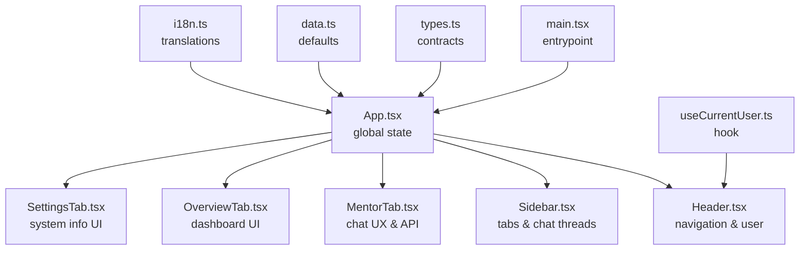
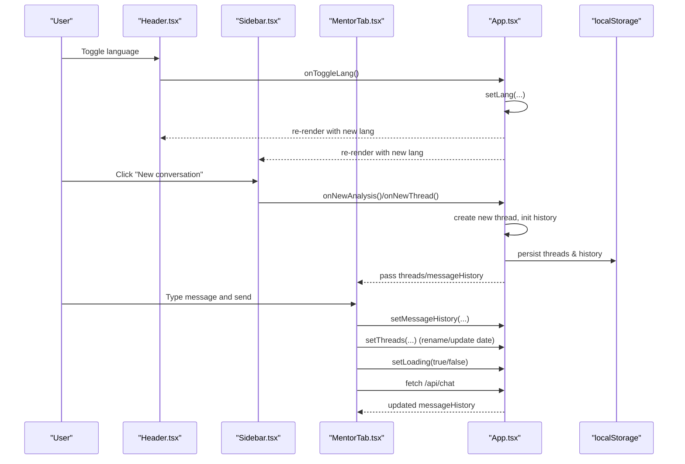
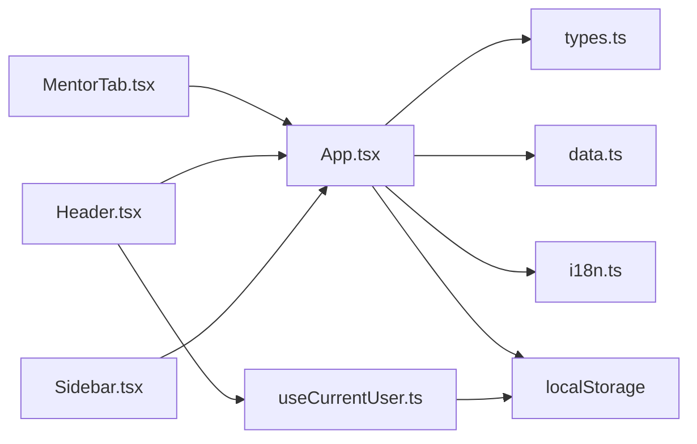

# State Management

<cite>
**Referenced Files in This Document**
- [App.tsx](file://frontend/src/App.tsx)
- [Sidebar.tsx](file://frontend/src/components/Sidebar.tsx)
- [Header.tsx](file://frontend/src/components/Header.tsx)
- [MentorTab.tsx](file://frontend/src/components/MentorTab.tsx)
- [OverviewTab.tsx](file://frontend/src/components/OverviewTab.tsx)
- [SettingsTab.tsx](file://frontend/src/components/SettingsTab.tsx)
- [useCurrentUser.ts](file://frontend/src/hooks/useCurrentUser.ts)
- [types.ts](file://frontend/src/types.ts)
- [data.ts](file://frontend/src/data.ts)
- [i18n.ts](file://frontend/src/i18n.ts)
- [main.tsx](file://frontend/src/main.tsx)
- [package.json](file://frontend/package.json)
</cite>

## Table of Contents
1. [Introduction](#introduction)
2. [Project Structure](#project-structure)
3. [Core Components](#core-components)
4. [Architecture Overview](#architecture-overview)
5. [Detailed Component Analysis](#detailed-component-analysis)
6. [Dependency Analysis](#dependency-analysis)
7. [Performance Considerations](#performance-considerations)
8. [Troubleshooting Guide](#troubleshooting-guide)
9. [Conclusion](#conclusion)

## Introduction
This document explains the state management patterns used in the MinerAI frontend. It covers the global state architecture, including authentication state, active tab management, chat thread state, and user preferences. It documents state lifting for chat functionality, localStorage integration for persistence, and synchronization across components. It also describes custom hooks, context-free state sharing via props, and strategies for updates, error handling, and performance optimization for large datasets.

## Project Structure
The frontend is a React application bootstrapped with Vite. State is primarily managed at the root level and lifted to child components as needed. Key areas:
- Root state container: App.tsx holds authentication, active tab, language, chat threads, and message history.
- UI composition: Header.tsx and Sidebar.tsx consume and mutate shared state via callbacks.
- Feature screens: MentorTab.tsx orchestrates chat messaging and persistence; OverviewTab.tsx and SettingsTab.tsx manage localized UI state.
- Hooks: useCurrentUser.ts encapsulates user identity resolution and synchronization across tabs.
- Types and defaults: types.ts defines data contracts; data.ts provides default values.

**Diagram sources**
- [main.tsx:1-11](file://frontend/src/main.tsx#L1-L11)
- [App.tsx:19-310](file://frontend/src/App.tsx#L19-L310)
- [Header.tsx:16-122](file://frontend/src/components/Header.tsx#L16-L122)
- [Sidebar.tsx:23-228](file://frontend/src/components/Sidebar.tsx#L23-L228)
- [MentorTab.tsx:28-410](file://frontend/src/components/MentorTab.tsx#L28-L410)
- [OverviewTab.tsx:14-286](file://frontend/src/components/OverviewTab.tsx#L14-L286)
- [SettingsTab.tsx:8-162](file://frontend/src/components/SettingsTab.tsx#L8-L162)
- [useCurrentUser.ts:54-69](file://frontend/src/hooks/useCurrentUser.ts#L54-L69)
- [types.ts:1-57](file://frontend/src/types.ts#L1-L57)
- [data.ts:1-78](file://frontend/src/data.ts#L1-L78)
- [i18n.ts:5-265](file://frontend/src/i18n.ts#L5-L265)

**Section sources**
- [main.tsx:1-11](file://frontend/src/main.tsx#L1-L11)
- [App.tsx:19-310](file://frontend/src/App.tsx#L19-L310)
- [types.ts:1-57](file://frontend/src/types.ts#L1-L57)
- [data.ts:1-78](file://frontend/src/data.ts#L1-L78)
- [i18n.ts:5-265](file://frontend/src/i18n.ts#L5-L265)

## Core Components
- Authentication state: Tracks login status via localStorage and exposes user role and identity to UI.
- Active tab state: Controls which screen is visible in the main content area.
- Language state: Switches UI text and date/time formatting.
- Chat threads and message history: Persisted per-user in localStorage and synchronized across components.
- User preferences: Language toggle and quick actions (e.g., new thread, clear chat).

These states are declared in App.tsx and passed down as props to child components. Updates occur through callback handlers defined in App.tsx, ensuring centralized control and predictable updates.

**Section sources**
- [App.tsx:20-23](file://frontend/src/App.tsx#L20-L23)
- [App.tsx:95-164](file://frontend/src/App.tsx#L95-L164)
- [Header.tsx:16-122](file://frontend/src/components/Header.tsx#L16-L122)
- [Sidebar.tsx:23-228](file://frontend/src/components/Sidebar.tsx#L23-L228)
- [MentorTab.tsx:28-410](file://frontend/src/components/MentorTab.tsx#L28-L410)

## Architecture Overview
The state architecture follows a single-source-of-truth pattern at the root App component. Child components receive state and callbacks via props, enabling unidirectional data flow. Local storage persists chat threads and message history keyed by the current user’s email, ensuring continuity across sessions.

**Diagram sources**
- [App.tsx:95-164](file://frontend/src/App.tsx#L95-L164)
- [Sidebar.tsx:136-142](file://frontend/src/components/Sidebar.tsx#L136-L142)
- [MentorTab.tsx:49-128](file://frontend/src/components/MentorTab.tsx#L49-L128)
- [Header.tsx:56-64](file://frontend/src/components/Header.tsx#L56-L64)

## Detailed Component Analysis

### Global State Container (App)
App.tsx declares and manages:
- Authentication: isAuthenticated derived from minerai_token.
- Active tab: activeTab for routing content.
- Language: lang with i18n translation object.
- Chat threads: threads array with id/title/dateGroup.
- Message history: messageHistory map keyed by thread id.
- Dataset lab state: labDataset for Data Lab.
- Custom quiz topic: customQuizTopic for MyQuestions integration.

Persistence:
- Threads and message history are persisted to localStorage under keys derived from the current user’s email.
- On mount, App reads existing data from localStorage; on change, it writes back.

State lifting for chat:
- Handlers in App.tsx update threads and messageHistory and coordinate activeThreadId.
- MentorTab receives these as props and invokes setters to mutate state.

User identity:
- getUserKey() extracts email from minerai_user; fallback to minerai_token payload if needed.

**Section sources**
- [App.tsx:20-23](file://frontend/src/App.tsx#L20-L23)
- [App.tsx:95-111](file://frontend/src/App.tsx#L95-L111)
- [App.tsx:113-164](file://frontend/src/App.tsx#L113-L164)
- [App.tsx:81-93](file://frontend/src/App.tsx#L81-L93)
- [data.ts:46-62](file://frontend/src/data.ts#L46-L62)

### Sidebar (Navigation and Thread List)
Responsibilities:
- Renders navigation items and highlights the active tab.
- Displays chat threads with rename/clear/delete actions.
- Provides “New conversation” button to trigger new thread creation.

State and callbacks:
- Receives threads, activeThreadId, and handlers for selection, deletion, renaming, and creation.
- Manages local dropdown/edit state for thread actions.

Interaction with App:
- Calls onNewThread, onSelectThread, onDeleteThread, onRenameThread provided by App.

**Section sources**
- [Sidebar.tsx:23-228](file://frontend/src/components/Sidebar.tsx#L23-L228)
- [App.tsx:113-164](file://frontend/src/App.tsx#L113-L164)

### Header (User and Language)
Responsibilities:
- Displays current tab title and language toggle.
- Shows user profile via useCurrentUser hook.
- Provides logout action.

Behavior:
- Uses lang to compute tab titles and toggles language via onToggleLang.
- Reads user info from localStorage via useCurrentUser.

**Section sources**
- [Header.tsx:16-122](file://frontend/src/components/Header.tsx#L16-L122)
- [useCurrentUser.ts:54-69](file://frontend/src/hooks/useCurrentUser.ts#L54-L69)

### MentorTab (Chat UX and API)
Responsibilities:
- Displays chat messages with markdown rendering and citations.
- Accepts user input, sends to backend, and updates messageHistory.
- Manages filters and quick questions.

State and effects:
- Maintains local inputText and loading state.
- Auto-scrolls to bottom when messages change.
- Persists updated messageHistory and threads to localStorage via callbacks from App.

API integration:
- Sends thread_id, messages, and optional metadata filter to /api/chat.
- Handles network errors and displays user-friendly messages.

**Section sources**
- [MentorTab.tsx:28-410](file://frontend/src/components/MentorTab.tsx#L28-L410)
- [App.tsx:95-111](file://frontend/src/App.tsx#L95-L111)

### OverviewTab (Dashboard UI)
Responsibilities:
- Displays learning progress, activity chart, and AI insights.
- Fetches system stats and weak topics from backend APIs.

Behavior:
- Uses defaultProgress for initial state and updates from API responses.
- Supports time range switching (week/month/year).

**Section sources**
- [OverviewTab.tsx:14-286](file://frontend/src/components/OverviewTab.tsx#L14-L286)

### SettingsTab (System Info)
Responsibilities:
- Presents system status, model info, knowledge base stats, and user profile details.

Behavior:
- Uses i18n to adapt labels and values based on current language.

**Section sources**
- [SettingsTab.tsx:8-162](file://frontend/src/components/SettingsTab.tsx#L8-L162)

### Custom Hook: useCurrentUser
Purpose:
- Resolves the current user from localStorage ("minerai_user" or decoded JWT payload from "minerai_token").
- Subscribes to storage events to synchronize user state across browser tabs.

Behavior:
- readUserFromStorage handles parsing and fallback logic.
- useEffect listens to "storage" events and refreshes state.

**Section sources**
- [useCurrentUser.ts:21-52](file://frontend/src/hooks/useCurrentUser.ts#L21-L52)
- [useCurrentUser.ts:57-66](file://frontend/src/hooks/useCurrentUser.ts#L57-L66)

### Data Contracts and Defaults
- types.ts defines ChatMessage, ChatThread, DatasetFile, and related structures.
- data.ts provides defaultChatHistory and defaultLibraryItems for initial UI state.

**Section sources**
- [types.ts:1-57](file://frontend/src/types.ts#L1-L57)
- [data.ts:46-62](file://frontend/src/data.ts#L46-L62)

### Localization (i18n)
- i18n.ts provides bilingual UI strings and computed labels for UI elements.
- App.tsx selects translation object based on lang and passes it to children.

**Section sources**
- [i18n.ts:5-265](file://frontend/src/i18n.ts#L5-L265)
- [App.tsx:20-23](file://frontend/src/App.tsx#L20-L23)

## Dependency Analysis
- App.tsx depends on:
  - types.ts for ChatMessage and ChatThread contracts.
  - data.ts for defaultChatHistory.
  - i18n.ts for translations.
  - localStorage for persistence.
- MentorTab.tsx depends on:
  - App.tsx callbacks to mutate threads and messageHistory.
  - i18n.ts for UI strings.
- Header.tsx and Sidebar.tsx depend on:
  - App.tsx callbacks for navigation and thread actions.
  - useCurrentUser.ts for user identity.
- useCurrentUser.ts depends on:
  - localStorage for minerai_user and minerai_token.
  - window.storage event for cross-tab sync.

**Diagram sources**
- [App.tsx:15-17](file://frontend/src/App.tsx#L15-L17)
- [types.ts:1-57](file://frontend/src/types.ts#L1-L57)
- [data.ts:1-2](file://frontend/src/data.ts#L1-L2)
- [i18n.ts:5-6](file://frontend/src/i18n.ts#L5-L6)
- [MentorTab.tsx:3-5](file://frontend/src/components/MentorTab.tsx#L3-L5)
- [Header.tsx:5](file://frontend/src/components/Header.tsx#L5)
- [Sidebar.tsx:3](file://frontend/src/components/Sidebar.tsx#L3)
- [useCurrentUser.ts:21-52](file://frontend/src/hooks/useCurrentUser.ts#L21-L52)

**Section sources**
- [App.tsx:15-17](file://frontend/src/App.tsx#L15-L17)
- [MentorTab.tsx:3-5](file://frontend/src/components/MentorTab.tsx#L3-L5)
- [Header.tsx:5](file://frontend/src/components/Header.tsx#L5)
- [Sidebar.tsx:3](file://frontend/src/components/Sidebar.tsx#L3)
- [useCurrentUser.ts:21-52](file://frontend/src/hooks/useCurrentUser.ts#L21-L52)

## Performance Considerations
- Avoid unnecessary re-renders:
  - Keep state granular but avoid over-splitting. App.tsx centralizes chat state to minimize prop drilling while still passing only required subsets to components.
- Efficient chat updates:
  - Use functional setState updates (as seen in App.tsx) to ensure latest state is used when updating messageHistory and threads.
- Virtualization for long lists:
  - For very large chat histories, consider virtualized lists to limit DOM nodes rendered at once.
- Debounced input:
  - For future enhancements, debounce user input in MentorTab to reduce frequent re-renders during typing.
- Memoization:
  - Use memoization for expensive computations in rendering (e.g., markdown parsing) to avoid recalculating on unrelated state changes.
- Persistence throttling:
  - Debounce localStorage writes for messageHistory and threads to avoid excessive I/O during rapid message bursts.

[No sources needed since this section provides general guidance]

## Troubleshooting Guide
Common issues and resolutions:
- Chat not persisting across sessions:
  - Verify minerai_user exists and contains a valid email; otherwise, App.tsx falls back to minerai_token payload.
  - Confirm localStorage keys match the user key pattern and are readable.
- Threads not updating after sending a message:
  - Ensure setMessageHistory and setThreads are invoked with the correct thread id and that App.tsx persists them to localStorage.
- Language toggle not reflected:
  - Confirm lang state is updated and propagated to children; verify i18n keys exist for the selected language.
- Cross-tab synchronization not working:
  - useCurrentUser.ts relies on the storage event; ensure the page is not blocked from firing storage events and that the same key is being updated consistently.

**Section sources**
- [App.tsx:81-93](file://frontend/src/App.tsx#L81-L93)
- [App.tsx:95-111](file://frontend/src/App.tsx#L95-L111)
- [useCurrentUser.ts:57-66](file://frontend/src/hooks/useCurrentUser.ts#L57-L66)

## Conclusion
MinerAI’s frontend employs a straightforward, centralized state model with explicit lifting and localStorage-backed persistence. App.tsx serves as the single source of truth for authentication, UI state, and chat data, while child components remain presentation-focused and declarative. The useCurrentUser hook ensures consistent user identity across tabs. For scalability, consider adding memoization, virtualization, and debounced persistence for large datasets and high-frequency updates.