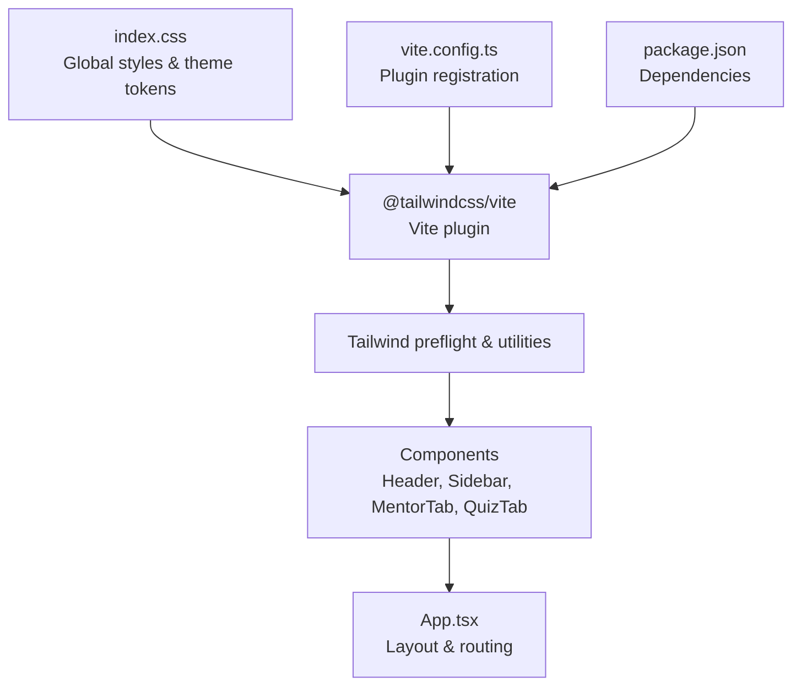
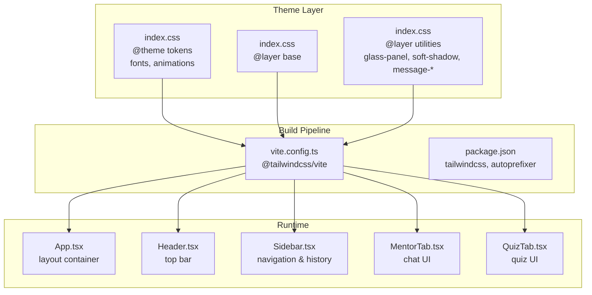
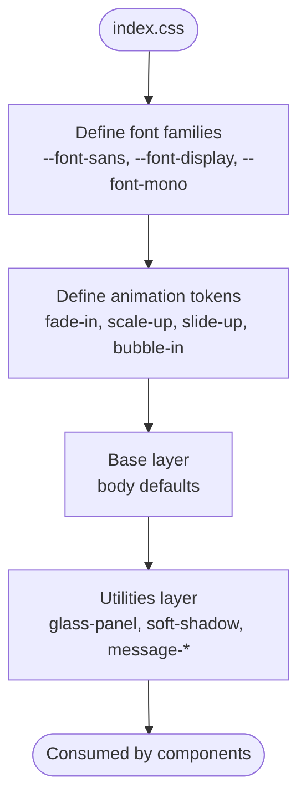
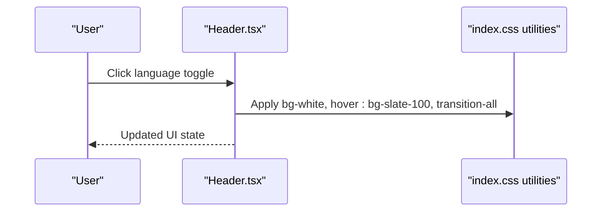
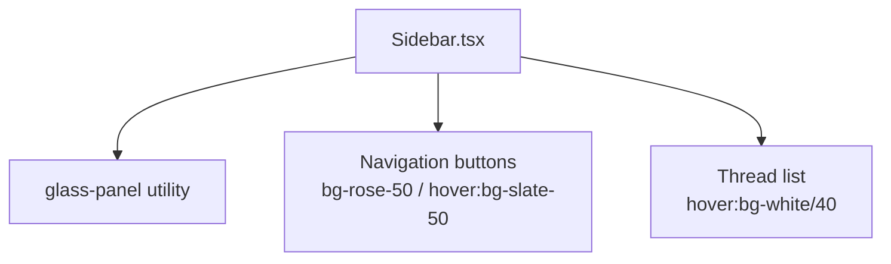
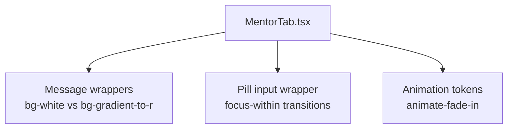
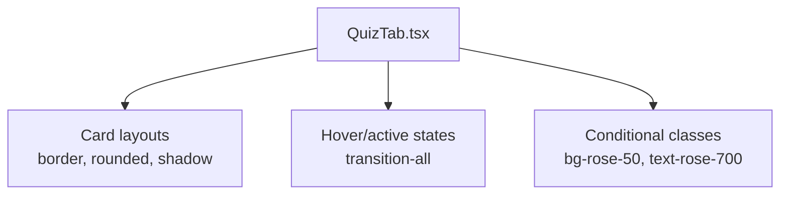
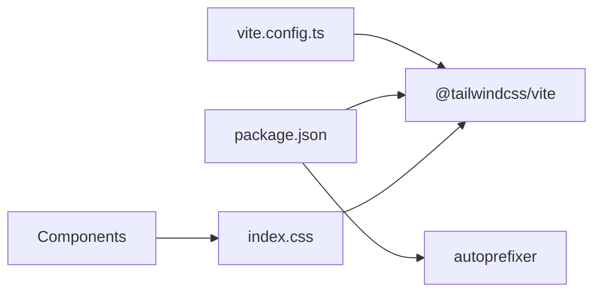

# Styling and Theming

<cite>
**Referenced Files in This Document**
- [index.css](file://frontend/src/index.css)
- [vite.config.ts](file://frontend/vite.config.ts)
- [package.json](file://frontend/package.json)
- [App.tsx](file://frontend/src/App.tsx)
- [Header.tsx](file://frontend/src/components/Header.tsx)
- [Sidebar.tsx](file://frontend/src/components/Sidebar.tsx)
- [MentorTab.tsx](file://frontend/src/components/MentorTab.tsx)
- [QuizTab.tsx](file://frontend/src/components/QuizTab.tsx)
- [types.ts](file://frontend/src/types.ts)
- [i18n.ts](file://frontend/src/i18n.ts)
</cite>

## Table of Contents
1. [Introduction](#introduction)
2. [Project Structure](#project-structure)
3. [Core Components](#core-components)
4. [Architecture Overview](#architecture-overview)
5. [Detailed Component Analysis](#detailed-component-analysis)
6. [Dependency Analysis](#dependency-analysis)
7. [Performance Considerations](#performance-considerations)
8. [Troubleshooting Guide](#troubleshooting-guide)
9. [Conclusion](#conclusion)

## Introduction
This document explains the styling and theming system in MinerAI’s frontend. It covers the CSS architecture, utility-first class usage, component-specific styling patterns, Tailwind CSS configuration, color scheme management, responsive design, light/dark mode considerations, typography and spacing systems, animations, accessibility-focused styling, and performance optimization strategies for CSS delivery and browser compatibility.

## Project Structure
MinerAI’s frontend uses a React + Vite + Tailwind CSS stack. Styles are authored in a single global stylesheet and consumed via utility-first Tailwind classes applied directly in components. The build pipeline integrates Tailwind via the official Vite plugin.

**Diagram sources**
- [index.css:1-122](file://frontend/src/index.css#L1-L122)
- [vite.config.ts:1-29](file://frontend/vite.config.ts#L1-L29)
- [package.json:13-35](file://frontend/package.json#L13-L35)

**Section sources**
- [index.css:1-122](file://frontend/src/index.css#L1-L122)
- [vite.config.ts:1-29](file://frontend/vite.config.ts#L1-L29)
- [package.json:13-35](file://frontend/package.json#L13-L35)

## Core Components
- Global theme tokens and animations are defined centrally in the global stylesheet.
- Utility-first Tailwind classes are applied directly in components to achieve layout, color, spacing, and interaction effects.
- Component-specific styles leverage shared utility classes and custom utility classes defined in the global stylesheet.

Key styling patterns observed:
- Base layer resets and body defaults in the base layer.
- Shared utility classes for glassmorphism, shadows, and message bubbles.
- Animation tokens and keyframes for entrance and hover effects.
- Responsive breakpoints and spacing scales via Tailwind utilities.

**Section sources**
- [index.css:32-122](file://frontend/src/index.css#L32-L122)
- [Header.tsx:44-123](file://frontend/src/components/Header.tsx#L44-L123)
- [Sidebar.tsx:70-229](file://frontend/src/components/Sidebar.tsx#L70-L229)
- [MentorTab.tsx:274-411](file://frontend/src/components/MentorTab.tsx#L274-L411)
- [QuizTab.tsx:348-1014](file://frontend/src/components/QuizTab.tsx#L348-L1014)

## Architecture Overview
The styling architecture follows a centralized theme definition with component-level composition:

**Diagram sources**
- [index.css:4-30](file://frontend/src/index.css#L4-L30)
- [index.css:32-102](file://frontend/src/index.css#L32-L102)
- [vite.config.ts:6-8](file://frontend/vite.config.ts#L6-L8)
- [package.json:29-29](file://frontend/package.json#L29-L29)
- [App.tsx:213-310](file://frontend/src/App.tsx#L213-L310)
- [Header.tsx:16-123](file://frontend/src/components/Header.tsx#L16-L123)
- [Sidebar.tsx:23-229](file://frontend/src/components/Sidebar.tsx#L23-L229)
- [MentorTab.tsx:27-411](file://frontend/src/components/MentorTab.tsx#L27-L411)
- [QuizTab.tsx:43-1014](file://frontend/src/components/QuizTab.tsx#L43-L1014)

## Detailed Component Analysis

### Global Theme Tokens and Animations
- Font families are defined as CSS variables for consistent typography across components.
- Animation tokens define reusable transitions and keyframes for entrance and hover states.
- Base layer sets body background, color, font family, and anti-aliasing.
- Utility layer defines reusable glass-like panels, soft shadows, message styles, and custom scrollbars.

**Diagram sources**
- [index.css:4-30](file://frontend/src/index.css#L4-L30)
- [index.css:32-102](file://frontend/src/index.css#L32-L102)

**Section sources**
- [index.css:4-30](file://frontend/src/index.css#L4-L30)
- [index.css:32-102](file://frontend/src/index.css#L32-L102)

### Header Component Styling
- Uses a glass header utility class for backdrop blur and border.
- Applies hover and transition utilities for interactive elements.
- Uses gradient backgrounds and subtle shadows for visual depth.

**Diagram sources**
- [Header.tsx:56-70](file://frontend/src/components/Header.tsx#L56-L70)
- [index.css:43-58](file://frontend/src/index.css#L43-L58)

**Section sources**
- [Header.tsx:44-123](file://frontend/src/components/Header.tsx#L44-L123)
- [index.css:43-58](file://frontend/src/index.css#L43-L58)

### Sidebar Component Styling
- Glass panel utility class for the sidebar background and blur effect.
- Navigation buttons use active/inactive states with color and shadow utilities.
- Thread list applies hover and selection states with transitions.

**Diagram sources**
- [Sidebar.tsx:70-128](file://frontend/src/components/Sidebar.tsx#L70-L128)
- [index.css:43-58](file://frontend/src/index.css#L43-L58)

**Section sources**
- [Sidebar.tsx:70-229](file://frontend/src/components/Sidebar.tsx#L70-L229)
- [index.css:43-58](file://frontend/src/index.css#L43-L58)

### MentorTab Styling Patterns
- Message containers use utility classes for rounded corners, borders, and shadows.
- User and bot messages differentiate with background and text color utilities.
- Input area uses a pill-shaped wrapper with focus-within transitions.
- Loading indicators and quick questions use utility-driven layouts.

**Diagram sources**
- [MentorTab.tsx:274-411](file://frontend/src/components/MentorTab.tsx#L274-L411)
- [index.css:73-101](file://frontend/src/index.css#L73-L101)

**Section sources**
- [MentorTab.tsx:274-411](file://frontend/src/components/MentorTab.tsx#L274-L411)
- [index.css:73-101](file://frontend/src/index.css#L73-L101)

### QuizTab Styling Patterns
- Card-based layouts use border, rounded, and shadow utilities for depth.
- Interactive elements apply hover and active states with transitions.
- Progress bars and timers use utility classes for color and layout.
- Evaluation screens rely on conditional classes for correctness feedback.

**Diagram sources**
- [QuizTab.tsx:348-1014](file://frontend/src/components/QuizTab.tsx#L348-L1014)

**Section sources**
- [QuizTab.tsx:348-1014](file://frontend/src/components/QuizTab.tsx#L348-L1014)

### Typography and Spacing Systems
- Typography scale leverages CSS variables for font families and consistent sizing.
- Spacing utilities are applied directly in components for padding, margin, and gaps.
- Responsive variants (sm, md, lg) are used to adapt layouts across screen sizes.

**Section sources**
- [index.css:4-7](file://frontend/src/index.css#L4-L7)
- [Header.tsx:48-50](file://frontend/src/components/Header.tsx#L48-L50)
- [Sidebar.tsx:93-94](file://frontend/src/components/Sidebar.tsx#L93-L94)
- [MentorTab.tsx:280-281](file://frontend/src/components/MentorTab.tsx#L280-L281)
- [QuizTab.tsx:692-703](file://frontend/src/components/QuizTab.tsx#L692-L703)

### Color Scheme Management
- A consistent brand palette is used: rose/violet gradients for primary actions and accents, slate-based grays for backgrounds and text.
- Utility classes apply stateful colors for active/inactive and hover states.
- Custom utility classes encapsulate glassmorphism and message-specific styles.

**Section sources**
- [Header.tsx:60-64](file://frontend/src/components/Header.tsx#L60-L64)
- [Sidebar.tsx:85-89](file://frontend/src/components/Sidebar.tsx#L85-L89)
- [MentorTab.tsx:294-303](file://frontend/src/components/MentorTab.tsx#L294-L303)
- [QuizTab.tsx:540-547](file://frontend/src/components/QuizTab.tsx#L540-L547)
- [index.css:43-101](file://frontend/src/index.css#L43-L101)

### Responsive Design Implementation
- Components use responsive variants (sm, md, lg) to adjust layout and spacing.
- Scrollable areas and navigation adapt to smaller screens with appropriate padding and gaps.
- Text sizing and line heights are tuned for readability across breakpoints.

**Section sources**
- [Header.tsx:48-50](file://frontend/src/components/Header.tsx#L48-L50)
- [Sidebar.tsx:93-94](file://frontend/src/components/Sidebar.tsx#L93-L94)
- [MentorTab.tsx:336-337](file://frontend/src/components/MentorTab.tsx#L336-L337)
- [QuizTab.tsx:687-688](file://frontend/src/components/QuizTab.tsx#L687-L688)

### Light/Dark Mode Considerations
- The global stylesheet defines a light-mode base with light backgrounds and dark text.
- No explicit dark-mode toggles are present in the current codebase; color utilities remain tied to light-mode palettes.
- To add dark mode, introduce a data-attribute on the root element and conditionally invert color utilities or add a separate dark variant layer.

**Section sources**
- [index.css:32-41](file://frontend/src/index.css#L32-L41)
- [App.tsx:214-214](file://frontend/src/App.tsx#L214-L214)

### Accessibility-Focused Styling
- Focus states are handled via focus-visible utilities and transitions for keyboard navigation.
- Sufficient color contrast is maintained using the established palette.
- Semantic HTML and clear text labels improve readability.

**Section sources**
- [MentorTab.tsx:389-390](file://frontend/src/components/MentorTab.tsx#L389-L390)
- [QuizTab.tsx:530-532](file://frontend/src/components/QuizTab.tsx#L530-L532)

### Animation Implementations
- Reusable animation tokens are defined in the theme and applied to components for entrance and hover effects.
- Message bubbles and input focus states use transitions for smooth interactions.

**Section sources**
- [index.css:9-29](file://frontend/src/index.css#L9-L29)
- [MentorTab.tsx:285-285](file://frontend/src/components/MentorTab.tsx#L285-L285)
- [index.css:88-101](file://frontend/src/index.css#L88-L101)

## Dependency Analysis
The styling pipeline depends on Tailwind CSS and the Vite plugin. Build-time dependencies include Tailwind and Autoprefixer.

**Diagram sources**
- [vite.config.ts:6-8](file://frontend/vite.config.ts#L6-L8)
- [package.json:29-29](file://frontend/package.json#L29-L29)
- [index.css:2-2](file://frontend/src/index.css#L2-L2)

**Section sources**
- [vite.config.ts:6-8](file://frontend/vite.config.ts#L6-L8)
- [package.json:29-29](file://frontend/package.json#L29-L29)
- [index.css:2-2](file://frontend/src/index.css#L2-L2)

## Performance Considerations
- Keep the global stylesheet minimal and scoped to essential tokens and utilities.
- Prefer Tailwind utilities over ad-hoc CSS to reduce CSS size and improve caching.
- Use lazy-loaded components to defer heavy UI rendering until needed.
- Enable CSS minification and source maps in production builds.
- Consider extracting critical above-the-fold styles for faster initial paint.

[No sources needed since this section provides general guidance]

## Troubleshooting Guide
- If animations do not appear, verify the presence of animation tokens and ensure the utility classes are applied consistently.
- If glass effects fail, confirm the backdrop filter utilities are present and supported by the target browsers.
- If hover states do not trigger, check for conflicting pointer-events or stacking contexts.

**Section sources**
- [index.css:9-29](file://frontend/src/index.css#L9-L29)
- [index.css:43-58](file://frontend/src/index.css#L43-L58)

## Conclusion
MinerAI’s styling system centers on a global theme definition and extensive use of utility-first Tailwind classes. The approach yields a consistent, maintainable, and responsive UI with clear component boundaries. Extending the system to support dark mode, further optimizing CSS delivery, and ensuring robust accessibility can be achieved incrementally while preserving the current architecture.