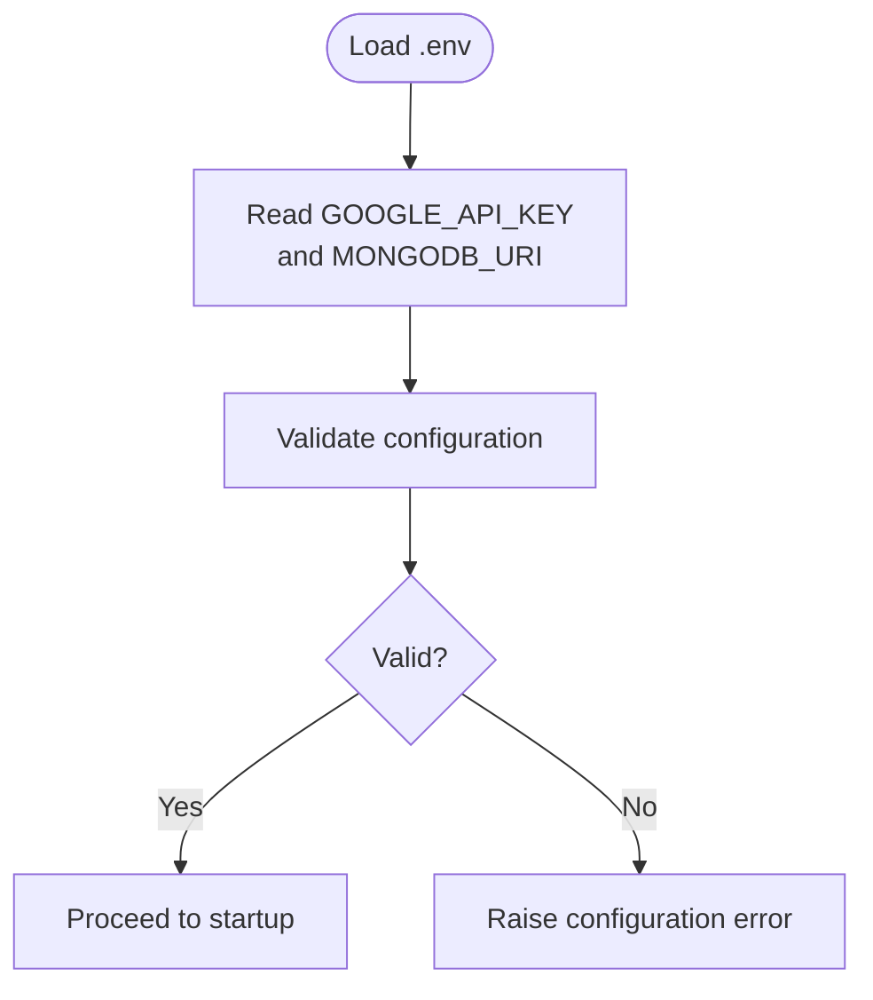
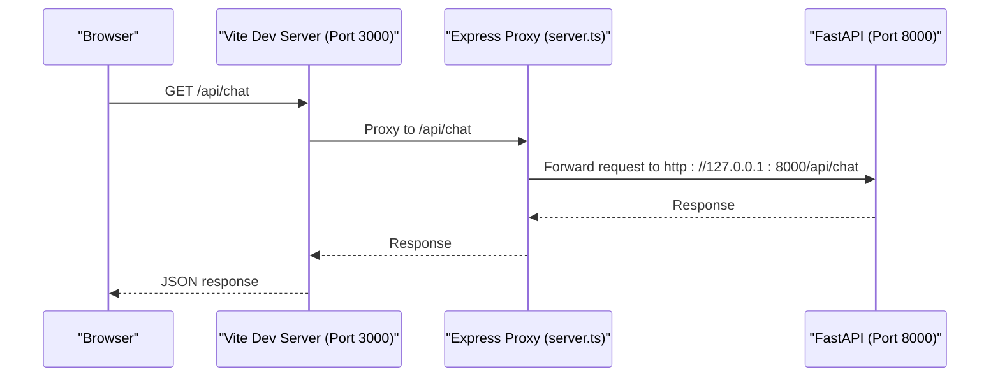
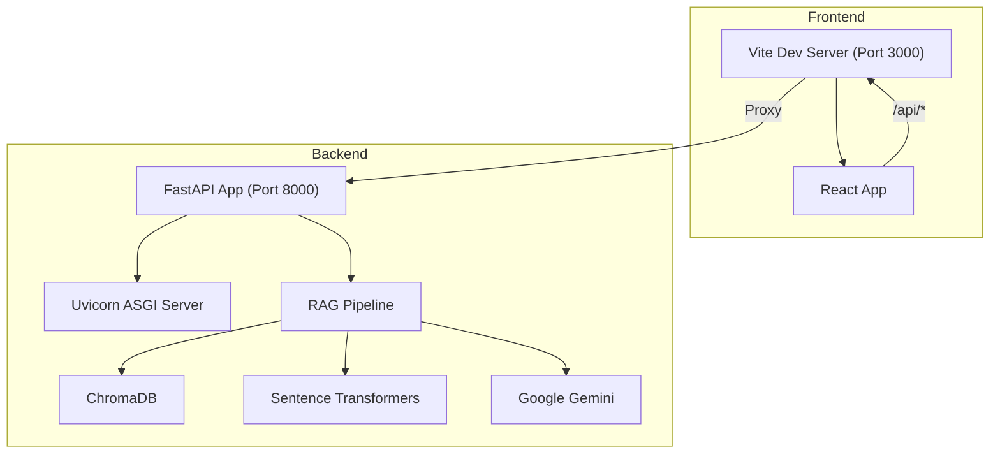

# Getting Started

<cite>
**Referenced Files in This Document**
- [README.md](file://README.md)
- [requirements.txt](file://requirements.txt)
- [frontend/package.json](file://frontend/package.json)
- [backend/main.py](file://backend/main.py)
- [config.py](file://config.py)
- [START_FULLSTACK.bat](file://START_FULLSTACK.bat)
- [START_BACKEND.bat](file://START_BACKEND.bat)
- [START_FRONTEND.bat](file://START_FRONTEND.bat)
- [frontend/vite.config.ts](file://frontend/vite.config.ts)
- [frontend/server.ts](file://frontend/server.ts)
- [backend_api.py](file://backend_api.py)
- [run_backend.py](file://run_backend.py)
- [frontend/README.md](file://frontend/README.md)
</cite>

## Table of Contents
1. [Introduction](#introduction)
2. [Prerequisites](#prerequisites)
3. [Installation](#installation)
4. [Environment Configuration](#environment-configuration)
5. [Start the Application](#start-the-application)
6. [Quick Start Workflow](#quick-start-workflow)
7. [Accessing Services](#accessing-services)
8. [Basic Usage Examples](#basic-usage-examples)
9. [Architecture Overview](#architecture-overview)
10. [Troubleshooting](#troubleshooting)
11. [Performance Considerations](#performance-considerations)
12. [Conclusion](#conclusion)

## Introduction
MinerAI is a full-stack Retrieval-Augmented Generation (RAG) learning assistant for Data Mining education. It features intelligent Q&A, document summarization, flashcards, quizzes, and a modern React frontend powered by a FastAPI backend. This guide walks you through installing prerequisites, setting up the environment, configuring the system, and starting both frontend and backend services.

## Prerequisites
Ensure your system meets the following requirements before installation:
- Python 3.10 or newer
- Node.js (for the frontend)
- Git (recommended for cloning the repository)
- A Google Gemini API key for LLM capabilities

These requirements are referenced in the project’s documentation and dependency files.

**Section sources**
- [README.md:30-46](file://README.md#L30-L46)
- [requirements.txt:22-26](file://requirements.txt#L22-L26)
- [frontend/package.json:13-24](file://frontend/package.json#L13-L24)

## Installation
Follow these steps to install the application:

1. Clone the repository and navigate into the project folder.
2. Install backend dependencies using pip with the provided requirements file.
3. Install frontend dependencies using npm inside the frontend directory.

The repository provides a concise installation procedure and dependency lists for both backend and frontend.

**Section sources**
- [README.md:34-46](file://README.md#L34-L46)
- [requirements.txt:1-43](file://requirements.txt#L1-L43)
- [frontend/package.json:6-12](file://frontend/package.json#L6-L12)

## Environment Configuration
Create a .env file at the project root with the following keys:
- GOOGLE_API_KEY: Your Google Gemini API key
- MONGODB_URI: Optional MongoDB connection string (if using MongoDB features)

The configuration module loads environment variables and validates required settings.

**Diagram sources**
- [config.py:11-163](file://config.py#L11-L163)

**Section sources**
- [README.md:48-54](file://README.md#L48-L54)
- [config.py:34-46](file://config.py#L34-L46)
- [config.py:138-160](file://config.py#L138-L160)

## Start the Application
You can start the full stack in two ways:

### Automated Startup (Recommended)
Run the provided batch script to launch both backend and frontend automatically. The script starts the backend in a new terminal window, waits briefly, then launches the frontend.

- Windows: Double-click START_FULLSTACK.bat

What the script does:
- Starts the backend via START_BACKEND_API.bat
- Waits briefly for the backend to initialize
- Starts the frontend via START_FRONTEND.bat

**Section sources**
- [START_FULLSTACK.bat:1-30](file://START_FULLSTACK.bat#L1-L30)
- [START_BACKEND.bat:1-6](file://START_BACKEND.bat#L1-L6)
- [START_FRONTEND.bat:1-26](file://START_FRONTEND.bat#L1-L26)

### Manual Startup
Start the backend and frontend manually in separate terminals.

Backend (Python + FastAPI):
- Option A: Use the dedicated backend runner script
  - Command: python run_backend.py
- Option B: Run the FastAPI app directly
  - Command: uvicorn backend_api:app --host 0.0.0.0 --port 8000

Frontend (React + Vite):
- Navigate to the frontend directory
- Install dependencies if needed
- Start the development server

Note: The backend listens on port 8000, and the frontend runs on port 3000 with Vite proxy configured to forward /api to the backend.

**Section sources**
- [run_backend.py:33-39](file://run_backend.py#L33-L39)
- [backend_api.py:63-67](file://backend_api.py#L63-L67)
- [frontend/vite.config.ts:20-25](file://frontend/vite.config.ts#L20-L25)
- [frontend/README.md:16-20](file://frontend/README.md#L16-L20)

## Quick Start Workflow
1. Install prerequisites and dependencies as described above.
2. Create the .env file with your API keys.
3. Launch the full stack using START_FULLSTACK.bat or start backend and frontend manually.
4. Access the frontend at http://localhost:3000 and the backend API at http://localhost:8000.
5. Explore the API documentation at http://localhost:8000/docs.

**Section sources**
- [README.md:30-76](file://README.md#L30-L76)
- [START_FULLSTACK.bat:24-26](file://START_FULLSTACK.bat#L24-L26)

## Accessing Services
- Frontend: http://localhost:3000
- Backend API: http://localhost:8000
- API Documentation: http://localhost:8000/docs

The frontend uses Vite’s proxy to forward API requests under /api to the backend on port 8000. The backend enables CORS for the frontend origin and additional origins from environment variables.

**Diagram sources**
- [frontend/vite.config.ts:20-25](file://frontend/vite.config.ts#L20-L25)
- [frontend/server.ts:227-284](file://frontend/server.ts#L227-L284)
- [backend_api.py:97-114](file://backend_api.py#L97-L114)

**Section sources**
- [README.md:71-75](file://README.md#L71-L75)
- [frontend/vite.config.ts:20-25](file://frontend/vite.config.ts#L20-L25)
- [frontend/server.ts:227-284](file://frontend/server.ts#L227-L284)
- [backend_api.py:97-114](file://backend_api.py#L97-L114)

## Basic Usage Examples
- Ask a question: Send a POST request to /api/question or /api/chat with a structured message payload. The backend will query the RAG pipeline and return an answer with citations.
- Summarize content: POST to /api/summary with optional topic filters.
- Generate flashcards: POST to /api/flashcards with a topic and count.
- Create a quiz: POST to /api/quiz with topic and number of questions.
- Compare LLM vs RAG: POST to /api/compare with a question (if advanced features are enabled).

These endpoints are documented in the backend API and exposed via the FastAPI app.

**Section sources**
- [backend_api.py:447-504](file://backend_api.py#L447-L504)
- [backend_api.py:664-699](file://backend_api.py#L664-L699)
- [backend_api.py:701-725](file://backend_api.py#L701-L725)
- [backend_api.py:748-797](file://backend_api.py#L748-L797)
- [backend_api.py:369-406](file://backend_api.py#L369-L406)

## Architecture Overview
MinerAI follows a classic full-stack architecture:
- Frontend: React + Vite (development server with proxy)
- Backend: FastAPI + Uvicorn (REST API)
- Data and models: ChromaDB vector store, sentence-transformers embeddings, Google Gemini LLM
- Optional: MongoDB for user and quiz data

**Diagram sources**
- [README.md:79-110](file://README.md#L79-L110)
- [backend/main.py:25-68](file://backend/main.py#L25-L68)
- [backend_api.py:63-67](file://backend_api.py#L63-L67)
- [config.py:55-59](file://config.py#L55-L59)

## Troubleshooting
Common issues and resolutions:

- Backend does not start on port 8000:
  - Check for conflicting processes using netstat or equivalent.
  - Terminate the process if necessary, then restart the backend.

- Frontend cannot connect to backend:
  - Verify the backend is running and reachable.
  - Confirm Vite proxy is configured to forward /api to http://localhost:8000.

- CORS errors:
  - The backend enables CORS for the frontend origin and additional origins from environment variables.
  - Ensure your frontend runs on the expected origin.

- Port conflicts:
  - Change the backend port in the backend runner or FastAPI configuration if needed.
  - Adjust the frontend proxy target accordingly.

- Missing environment variables:
  - Ensure GOOGLE_API_KEY is set in .env.
  - Optionally set MONGODB_URI for MongoDB features.

**Section sources**
- [README.md:275-303](file://README.md#L275-L303)
- [frontend/vite.config.ts:20-25](file://frontend/vite.config.ts#L20-L25)
- [backend_api.py:97-114](file://backend_api.py#L97-L114)
- [config.py:34-46](file://config.py#L34-L46)

## Performance Considerations
- Backend startup includes loading the vector store and initializing the RAG pipeline, which may take approximately 15 seconds.
- Typical response times:
  - Question answering: 30–60 seconds
  - Summary generation: 30–45 seconds
  - Stats queries: under 1 second
- Memory usage is around 500 MB.

These estimates help manage expectations during initial load and peak usage.

**Section sources**
- [README.md:219-233](file://README.md#L219-L233)

## Conclusion
You are now ready to run MinerAI locally. After installing prerequisites, creating the .env file, and launching the backend and frontend, explore the Q&A, summarization, flashcards, and quiz features. Use the API documentation at http://localhost:8000/docs to learn more about available endpoints and their payloads.