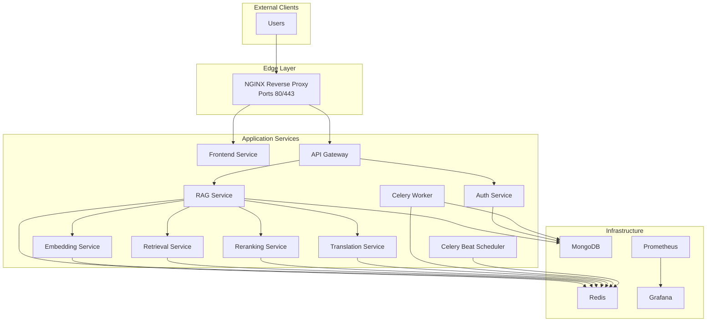
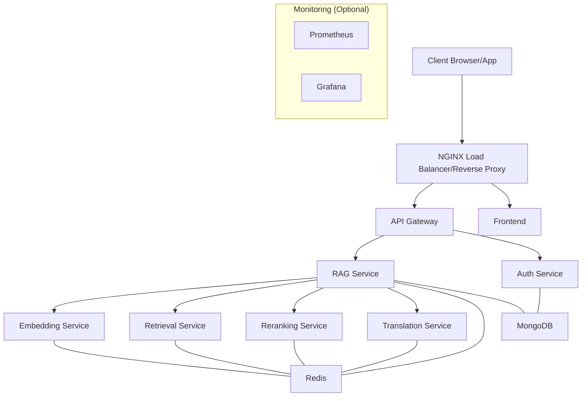
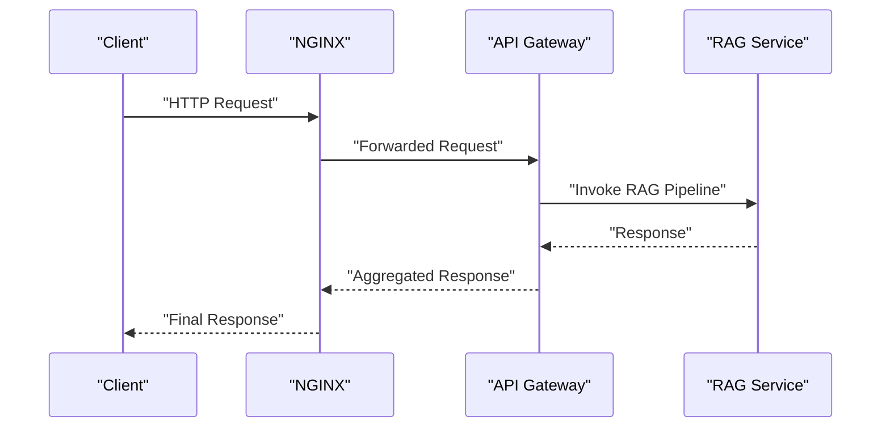
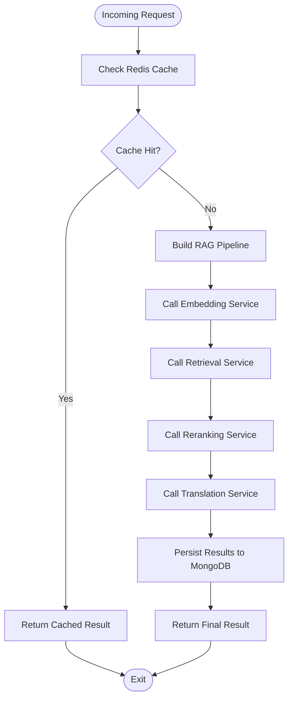
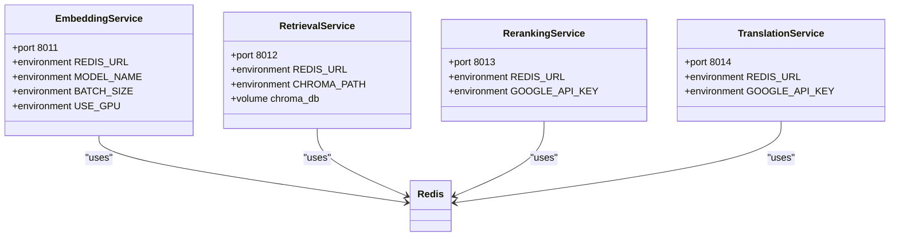
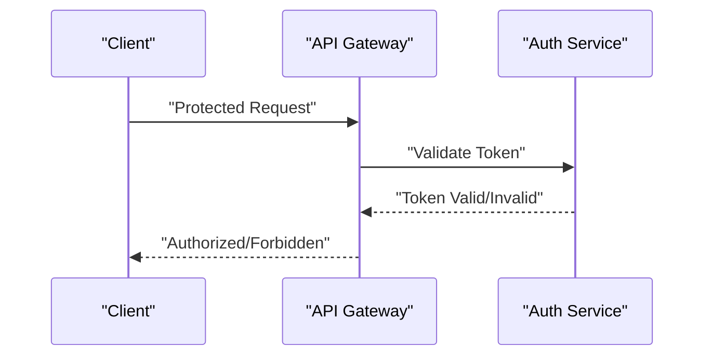
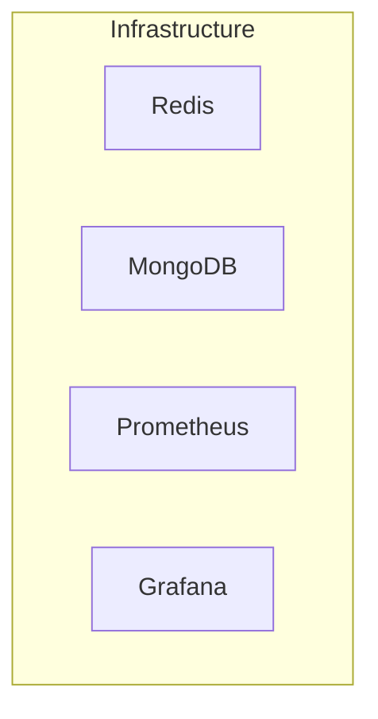
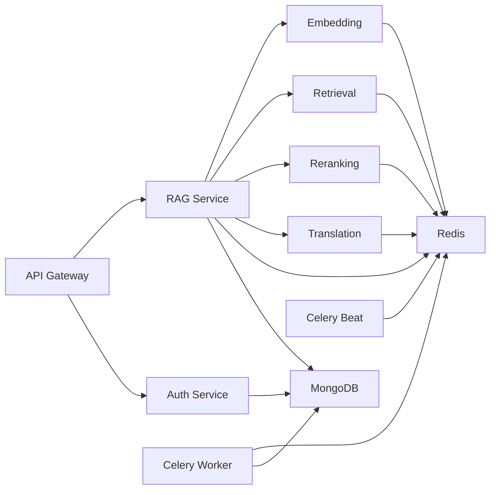

# Containerization & Docker

<cite>
**Referenced Files in This Document**
- [docker-compose.production.yml](file://docker-compose.production.yml)
- [requirements.txt](file://requirements.txt)
- [backend/main.py](file://backend/main.py)
- [frontend/package.json](file://frontend/package.json)
</cite>

## Table of Contents
1. [Introduction](#introduction)
2. [Project Structure](#project-structure)
3. [Core Components](#core-components)
4. [Architecture Overview](#architecture-overview)
5. [Detailed Component Analysis](#detailed-component-analysis)
6. [Dependency Analysis](#dependency-analysis)
7. [Performance Considerations](#performance-considerations)
8. [Troubleshooting Guide](#troubleshooting-guide)
9. [Conclusion](#conclusion)
10. [Appendices](#appendices)

## Introduction
This document provides comprehensive Docker containerization guidance for MinerAI, focusing on the production-grade Docker Compose configuration, container orchestration strategies, and multi-service deployment architecture. It explains container networking, volume mounting, environment variable management, service dependencies, security configurations, resource limits, health checks, build processes, image optimization, deployment workflows, scaling, load balancing, and inter-service communication patterns. The content is derived from the repository’s production compose file and supporting service configurations.

## Project Structure
MinerAI adopts a microservices architecture orchestrated via Docker Compose. The stack includes:
- A reverse proxy/load balancer (NGINX)
- A React-based frontend
- An API gateway
- Multiple specialized services (RAG, Embedding, Retrieval, Reranking, Translation, Auth)
- Background task workers (Celery) with scheduler
- Supporting infrastructure (Redis, MongoDB, Prometheus/Grafana for observability)

**Diagram sources**
- [docker-compose.production.yml:1-359](file://docker-compose.production.yml#L1-L359)

**Section sources**
- [docker-compose.production.yml:1-359](file://docker-compose.production.yml#L1-L359)

## Core Components
This section outlines the primary containers and their roles in the production deployment.

- NGINX Load Balancer/Reverse Proxy
  - Exposes ports 80 and 443
  - Mounts custom NGINX configuration and SSL certificates
  - Depends on API Gateway and Frontend
  - Networks: rag-network

- Frontend
  - Built from the frontend directory using a production Dockerfile
  - Environment variables include API base URL pointing to the API Gateway
  - Networks: rag-network

- API Gateway
  - Exposes port 8000
  - Environment variables for Redis, MongoDB, and downstream service URLs
  - Health check probes the internal health endpoint
  - Depends on Redis, MongoDB, and RAG service
  - Networks: rag-network

- RAG Service
  - Exposes port 8001
  - Environment variables for Redis, MongoDB, and service URLs for Embedding, Retrieval, Reranking, and Translation
  - Persistent volume mounted for Chroma vector database
  - Resource limits configured (CPU and memory)
  - Depends on Redis, MongoDB, Embedding, Retrieval, Reranking, and Translation
  - Networks: rag-network

- Embedding Service
  - Exposes port 8011
  - Environment variables for model selection, batch size, and GPU toggle
  - Depends on Redis
  - Networks: rag-network

- Retrieval Service
  - Exposes port 8012
  - Environment variables for Redis and Chroma path
  - Persistent volume mounted for Chroma vector database
  - Depends on Redis
  - Networks: rag-network

- Reranking Service
  - Exposes port 8013
  - Environment variables for Redis and external API key
  - Depends on Redis
  - Networks: rag-network

- Translation Service
  - Exposes port 8014
  - Environment variables for Redis and external API key
  - Depends on Redis
  - Networks: rag-network

- Auth Service
  - Exposes port 8002
  - Environment variables for MongoDB and JWT configuration
  - Depends on MongoDB
  - Networks: rag-network

- Celery Worker
  - Reuses the RAG service image and runs a Celery worker process
  - Environment variables for Redis, MongoDB, and external API keys
  - Persistent volume for Chroma data
  - Depends on Redis and MongoDB
  - Networks: rag-network
  - Replicas configured for horizontal scaling

- Celery Beat Scheduler
  - Reuses the RAG service image and runs a Celery beat process
  - Environment variables for Redis
  - Depends on Redis
  - Networks: rag-network

- Redis
  - Uses official Redis image with custom configuration
  - Exposes port 6379
  - Persists data to a named volume
  - Health checks via redis-cli ping
  - Networks: rag-network

- MongoDB
  - Includes optional monitoring stack services (Prometheus and Grafana) with commented-out configuration in the compose file
  - Exposes port 27017
  - Persists data to a named volume
  - Networks: rag-network

**Section sources**
- [docker-compose.production.yml:1-359](file://docker-compose.production.yml#L1-L359)

## Architecture Overview
The production architecture follows a reverse-proxy fronting the API Gateway and Frontend, while the API Gateway orchestrates requests to specialized microservices. Redis and MongoDB serve as shared infrastructure backbones. Observability is optionally included via Prometheus and Grafana.

**Diagram sources**
- [docker-compose.production.yml:1-359](file://docker-compose.production.yml#L1-L359)

## Detailed Component Analysis

### API Gateway Service
- Purpose: Centralized entry point for client requests, routing to downstream services.
- Networking: Listens on port 8000; communicates with RAG and Auth services.
- Dependencies: Redis and MongoDB for caching and persistence; RAG service for core logic.
- Health Checks: Probes the internal health endpoint on a regular schedule.
- Environment Variables: Configure environment mode, Redis URL, MongoDB URI, and downstream service URLs.

**Diagram sources**
- [docker-compose.production.yml:41-65](file://docker-compose.production.yml#L41-L65)

**Section sources**
- [docker-compose.production.yml:41-65](file://docker-compose.production.yml#L41-L65)

### RAG Service
- Purpose: Orchestrates embeddings, retrieval, reranking, and translation.
- Networking: Exposes port 8001; integrates with Embedding, Retrieval, Reranking, and Translation services.
- Storage: Persistent volume for Chroma vector database.
- Resource Limits: CPU and memory caps configured for predictable performance.
- Dependencies: Redis for caching, MongoDB for persistence, and external services for embeddings and transformations.

**Diagram sources**
- [docker-compose.production.yml:70-102](file://docker-compose.production.yml#L70-L102)

**Section sources**
- [docker-compose.production.yml:70-102](file://docker-compose.production.yml#L70-L102)

### Embedding, Retrieval, Reranking, and Translation Services
- Purpose: Specialized microservices for embeddings, vector retrieval, re-ranking, and translation.
- Networking: Each exposes a dedicated port and communicates via Redis and environment-configured URLs.
- Persistence: Retrieval and RAG services mount Chroma data volumes for durability.
- Scalability: Designed to be independently scalable behind the API Gateway.

**Diagram sources**
- [docker-compose.production.yml:106-195](file://docker-compose.production.yml#L106-L195)

**Section sources**
- [docker-compose.production.yml:106-195](file://docker-compose.production.yml#L106-L195)

### Auth Service
- Purpose: Handles authentication and authorization using JWT.
- Networking: Exposes port 8002; integrates with MongoDB for user data.
- Security: Configured with MongoDB URI and JWT secret/algorithm.

**Diagram sources**
- [docker-compose.production.yml:200-216](file://docker-compose.production.yml#L200-L216)

**Section sources**
- [docker-compose.production.yml:200-216](file://docker-compose.production.yml#L200-L216)

### Infrastructure Services
- Redis
  - Custom configuration mounted
  - Health checks enabled
  - Named volume for persistence
- MongoDB
  - Optional monitoring stack present in the compose file (Prometheus and Grafana)
  - Named volume for persistence

**Diagram sources**
- [docker-compose.production.yml:264-359](file://docker-compose.production.yml#L264-L359)

**Section sources**
- [docker-compose.production.yml:264-359](file://docker-compose.production.yml#L264-L359)

## Dependency Analysis
- Service-to-Service Dependencies
  - API Gateway depends on Redis, MongoDB, and RAG service.
  - RAG service depends on Redis, MongoDB, Embedding, Retrieval, Reranking, and Translation services.
  - Embedding, Retrieval, Reranking, Translation, and Auth services depend on Redis (and MongoDB for Auth).
  - Celery Worker and Beat depend on Redis and MongoDB.
- Network Isolation
  - All services join a single user-defined bridge network for service discovery and DNS resolution.
- Volume Management
  - Redis persists data via a named volume.
  - MongoDB persists data via a named volume.
  - Retrieval and RAG services mount Chroma vector database directories for persistence.
- Environment Variable Management
  - Production environment variables are centralized in the compose file for each service.
  - External secrets (e.g., Google API key, JWT secret) are referenced via environment variables.

**Diagram sources**
- [docker-compose.production.yml:1-359](file://docker-compose.production.yml#L1-L359)

**Section sources**
- [docker-compose.production.yml:1-359](file://docker-compose.production.yml#L1-L359)

## Performance Considerations
- Resource Limits
  - CPU and memory limits are set for RAG, Embedding, and Retrieval services to prevent resource contention.
- Concurrency and Scaling
  - Celery Worker replicas are configured for horizontal scaling of background tasks.
- Caching and Persistence
  - Redis is used for caching and inter-service messaging.
  - MongoDB and persistent volumes ensure data durability.
- Observability
  - Optional Prometheus and Grafana stack is included for metrics and dashboards.

[No sources needed since this section provides general guidance]

## Troubleshooting Guide
- Health Checks
  - API Gateway health check probes the internal health endpoint.
  - Redis health check uses redis-cli ping.
- Logs and Diagnostics
  - Inspect container logs for failing services.
  - Verify environment variables and secret availability.
- Networking Issues
  - Confirm services are on the same network and DNS resolution works.
- Volume Issues
  - Ensure named volumes exist and have sufficient disk space.
- Scaling Problems
  - Check replica counts and resource limits for overloaded services.

**Section sources**
- [docker-compose.production.yml:61-65](file://docker-compose.production.yml#L61-L65)
- [docker-compose.production.yml:276-280](file://docker-compose.production.yml#L276-L280)

## Conclusion
MinerAI’s production Docker Compose configuration establishes a robust, scalable, and observable microservices architecture. The design emphasizes clear separation of concerns, resilient infrastructure, and operational simplicity. By leveraging environment-driven configuration, persistent volumes, health checks, and resource limits, the system supports reliable deployments and efficient scaling.

[No sources needed since this section summarizes without analyzing specific files]

## Appendices

### Build Process and Image Optimization
- Build Contexts
  - Each service defines a build context and Dockerfile path in the compose file.
- Optimization Strategies
  - Multi-stage builds (recommended) to reduce image size.
  - Pin base images and dependencies for reproducibility.
  - Exclude unnecessary files using .dockerignore.
- Runtime Considerations
  - Run non-root users where possible.
  - Minimize exposed ports and enable TLS termination at the reverse proxy.

[No sources needed since this section provides general guidance]

### Deployment Workflows
- Local Development
  - Use docker-compose up to start all services locally.
- Production Deployment
  - Set environment variables externally (e.g., secrets management).
  - Use restart policies and health checks for resilience.
  - Monitor with optional Prometheus and Grafana stack.

[No sources needed since this section provides general guidance]

### Inter-Service Communication Patterns
- API Gateway Orchestration
  - Centralized routing and request aggregation.
- Service Discovery
  - User-defined bridge network enables DNS-based service discovery.
- Asynchronous Tasks
  - Celery Worker and Beat handle background jobs with Redis as broker.

[No sources needed since this section provides general guidance]