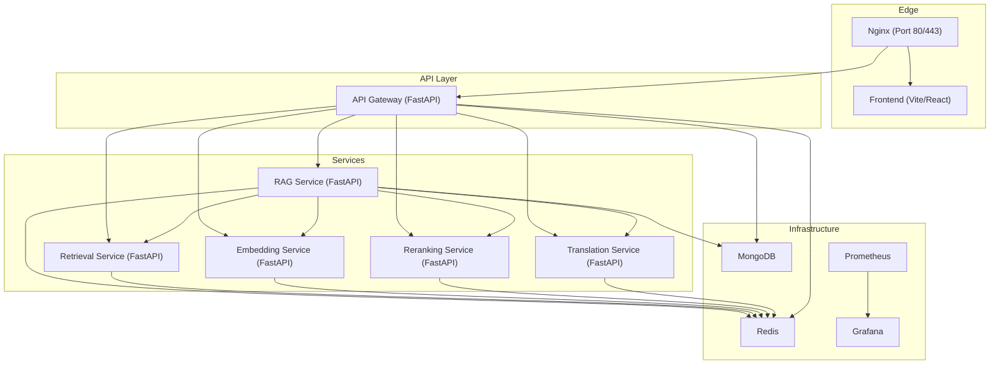
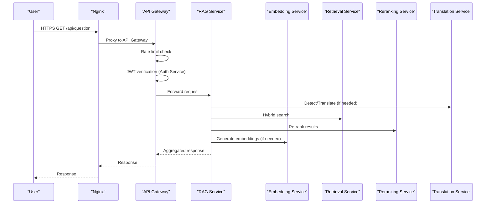
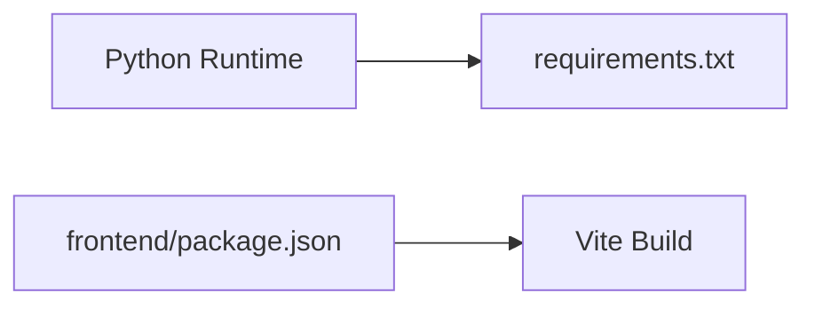

# Deployment & Operations

<cite>
**Referenced Files in This Document**
- [docker-compose.production.yml](file://docker-compose.production.yml)
- [requirements.txt](file://requirements.txt)
- [pytest.ini](file://pytest.ini)
- [config.py](file://config.py)
- [services/api-gateway/main.py](file://services/api-gateway/main.py)
- [services/rag-service/main.py](file://services/rag-service/main.py)
- [services/embedding-service/main.py](file://services/embedding-service/main.py)
- [services/retrieval-service/main.py](file://services/retrieval-service/main.py)
- [backend/main.py](file://backend/main.py)
- [frontend/package.json](file://frontend/package.json)
- [security/README.md](file://security/README.md)
- [enterprise/src/core/config.py](file://enterprise/src/core/config.py)
</cite>

## Table of Contents
1. [Introduction](#introduction)
2. [Project Structure](#project-structure)
3. [Core Components](#core-components)
4. [Architecture Overview](#architecture-overview)
5. [Detailed Component Analysis](#detailed-component-analysis)
6. [Dependency Analysis](#dependency-analysis)
7. [Performance Considerations](#performance-considerations)
8. [Troubleshooting Guide](#troubleshooting-guide)
9. [Conclusion](#conclusion)
10. [Appendices](#appendices)

## Introduction
This document provides comprehensive deployment and operations guidance for MinerAI. It covers CI/CD pipeline configuration, automated testing strategies, deployment workflows, environment management, configuration drift prevention, release procedures, infrastructure provisioning, DNS and SSL/TLS setup, security hardening, backup procedures, database maintenance, system updates, operational runbooks, change management processes, and post-deployment validation. It also includes troubleshooting guides and rollback procedures.

## Project Structure
MinerAI is a microservices-based system orchestrated via Docker Compose. The stack includes:
- Nginx reverse proxy/load balancer
- Frontend built with Vite/React
- API Gateway (FastAPI) with rate limiting and auth integration
- RAG Service (FastAPI) orchestrating the pipeline with Redis caching and Celery workers
- Dedicated services: Embedding, Retrieval (ChromaDB), Reranking, Translation
- Redis for caching and task queues
- MongoDB for persistence
- Prometheus/Grafana for observability

**Diagram sources**
- [docker-compose.production.yml](file://docker-compose.production.yml)
- [services/api-gateway/main.py](file://services/api-gateway/main.py)
- [services/rag-service/main.py](file://services/rag-service/main.py)
- [services/embedding-service/main.py](file://services/embedding-service/main.py)
- [services/retrieval-service/main.py](file://services/retrieval-service/main.py)

**Section sources**
- [docker-compose.production.yml](file://docker-compose.production.yml)

## Core Components
- API Gateway: Centralized routing, authentication verification, rate limiting, health checks, and Prometheus metrics exposure.
- RAG Service: Orchestrates the pipeline, integrates with embedding, retrieval, reranking, and translation services, and manages async tasks via Celery.
- Embedding Service: Generates embeddings with caching and batch processing.
- Retrieval Service: Vector/BM25 hybrid search with reciprocal rank fusion and Redis caching.
- Supporting Infrastructure: Redis, MongoDB, Nginx, Prometheus/Grafana.

Operational highlights:
- Health checks and restart policies are configured in Docker Compose.
- Environment variables drive service URLs and feature toggles.
- Prometheus metrics are exposed by the API Gateway and RAG Service.
- Redis is used for caching and Celery task queues.

**Section sources**
- [services/api-gateway/main.py](file://services/api-gateway/main.py)
- [services/rag-service/main.py](file://services/rag-service/main.py)
- [services/embedding-service/main.py](file://services/embedding-service/main.py)
- [services/retrieval-service/main.py](file://services/retrieval-service/main.py)
- [docker-compose.production.yml](file://docker-compose.production.yml)

## Architecture Overview
The system follows a reverse-proxy-first architecture:
- Nginx terminates TLS and routes traffic to the API Gateway and Frontend.
- API Gateway enforces rate limits, verifies tokens against the Auth Service, and proxies to downstream services.
- RAG Service coordinates specialized services and caches results in Redis.
- Observability is achieved via Prometheus metrics and Grafana dashboards.

**Diagram sources**
- [services/api-gateway/main.py](file://services/api-gateway/main.py)
- [services/rag-service/main.py](file://services/rag-service/main.py)
- [services/retrieval-service/main.py](file://services/retrieval-service/main.py)
- [services/embedding-service/main.py](file://services/embedding-service/main.py)

## Detailed Component Analysis

### API Gateway
Responsibilities:
- CORS configuration
- Rate limiting using Redis
- JWT token verification via Auth Service
- Health check aggregation
- Prometheus metrics exposition

Key behaviors:
- Uses Redis for rate-limit counters and ping checks.
- Proxies requests to RAG Service endpoints (/api/question, /api/summary, /api/quiz).
- Exposes Prometheus metrics and a health endpoint.

Operational notes:
- Configure allowed origins in production.
- Monitor rate limit thresholds and Redis availability.

**Section sources**
- [services/api-gateway/main.py](file://services/api-gateway/main.py)
- [docker-compose.production.yml](file://docker-compose.production.yml)

### RAG Service
Responsibilities:
- Orchestrates the end-to-end RAG pipeline.
- Integrates with Embedding, Retrieval, Reranking, and Translation services.
- Implements Redis caching for queries and embeddings.
- Uses Celery for asynchronous tasks (e.g., quiz generation).

Key behaviors:
- Generates cache keys for queries and embeddings.
- Performs language detection and optional translation.
- Executes hybrid retrieval and optional reranking.
- Returns structured results with citations and response timing.

Operational notes:
- Ensure Redis connectivity and appropriate TTLs.
- Monitor Celery workers and broker health.

**Section sources**
- [services/rag-service/main.py](file://services/rag-service/main.py)
- [docker-compose.production.yml](file://docker-compose.production.yml)

### Embedding Service
Responsibilities:
- Generates embeddings with caching and batching.
- Supports GPU acceleration when available.
- Provides endpoints for batch and single embeddings.

Key behaviors:
- Loads a Sentence Transformers model.
- Applies caching with TTL and batch processing.
- Reports health including model and device info.

Operational notes:
- Tune BATCH_SIZE and USE_GPU according to hardware.
- Monitor Redis connectivity for caching.

**Section sources**
- [services/embedding-service/main.py](file://services/embedding-service/main.py)
- [docker-compose.production.yml](file://docker-compose.production.yml)

### Retrieval Service
Responsibilities:
- Vector search using ChromaDB and BM25 keyword search.
- Hybrid search with Reciprocal Rank Fusion (RRF).
- Redis caching for search results.

Key behaviors:
- Loads persistent ChromaDB collection and BM25 index.
- Supports vector, BM25, and hybrid search modes.
- Normalizes scores and returns top-k documents.

Operational notes:
- Persist ChromaDB directory via volume mounts.
- Ensure BM25 index exists for hybrid search.

**Section sources**
- [services/retrieval-service/main.py](file://services/retrieval-service/main.py)
- [docker-compose.production.yml](file://docker-compose.production.yml)

### Frontend
Build and runtime:
- Built with Vite and served via a static server script.
- Environment variable VITE_API_URL points to the API Gateway.
- Production build outputs to dist and serves via Node.

Operational notes:
- Ensure VITE_API_URL matches the deployed API Gateway URL.
- Use Nginx to serve static assets and proxy API requests.

**Section sources**
- [frontend/package.json](file://frontend/package.json)
- [docker-compose.production.yml](file://docker-compose.production.yml)

### Backend (Legacy/Alternative)
The repository also includes a legacy backend entry point. While the production stack uses microservices, this remains useful for development or alternative deployments.

**Section sources**
- [backend/main.py](file://backend/main.py)

## Dependency Analysis
External dependencies and runtime requirements:
- Python packages pinned in requirements.txt include FastAPI, Uvicorn, LangChain, ChromaDB, Redis, and others.
- Frontend dependencies include React, Vite, Express, and dotenv.

Testing and coverage:
- pytest.ini defines markers for unit, integration, E2E, load, and other categories.
- Coverage thresholds and reports are configured.

**Diagram sources**
- [requirements.txt](file://requirements.txt)
- [frontend/package.json](file://frontend/package.json)

**Section sources**
- [requirements.txt](file://requirements.txt)
- [pytest.ini](file://pytest.ini)
- [frontend/package.json](file://frontend/package.json)

## Performance Considerations
- Resource limits are configured for services in Docker Compose (CPU/memory caps).
- Redis is used extensively for caching and task queuing.
- Batch sizes and concurrency controls are configurable in services.
- Prometheus metrics expose request counts and durations for capacity planning.

Recommendations:
- Monitor Redis memory usage and eviction policies.
- Adjust Celery worker replicas and concurrency based on workload.
- Right-size CPU/memory limits per service based on observed usage.

**Section sources**
- [docker-compose.production.yml](file://docker-compose.production.yml)
- [services/api-gateway/main.py](file://services/api-gateway/main.py)
- [services/rag-service/main.py](file://services/rag-service/main.py)

## Troubleshooting Guide

Common deployment issues and resolutions:
- Health checks failing:
  - Verify service endpoints and internal URLs in Docker Compose.
  - Confirm Redis and MongoDB are reachable and healthy.
- Rate limiting errors:
  - Inspect Redis keys and TTLs; ensure rate limiter is functioning.
- API Gateway 503 responses:
  - Check upstream service health and network connectivity.
- Frontend not loading:
  - Ensure VITE_API_URL points to the correct API Gateway hostname/port.
- Redis connectivity:
  - Validate Redis URL and health checks; confirm persistence volume for data.

Rollback procedures:
- Stop new containers and restart previous versions using tagged images.
- Rollback database migrations if applicable.
- Revert configuration changes incrementally and re-validate health checks.

Post-deployment validation checklist:
- Confirm Nginx responds on ports 80/443.
- Verify API Gateway health endpoint returns healthy status.
- Validate Prometheus metrics scraping and Grafana dashboards.
- Run smoke tests against key endpoints (/api/question, /api/summary).

**Section sources**
- [docker-compose.production.yml](file://docker-compose.production.yml)
- [services/api-gateway/main.py](file://services/api-gateway/main.py)
- [services/rag-service/main.py](file://services/rag-service/main.py)
- [services/retrieval-service/main.py](file://services/retrieval-service/main.py)
- [services/embedding-service/main.py](file://services/embedding-service/main.py)

## Conclusion
MinerAI’s deployment model leverages Docker Compose for orchestration, a reverse proxy for ingress, and microservices for modularity. Robust observability, caching, and rate limiting are integral to operations. By following the outlined CI/CD, environment management, security hardening, and troubleshooting practices, teams can maintain reliable, scalable, and secure deployments.

## Appendices

### CI/CD Pipeline Configuration
- Define stages: build, test, lint, scan, package, deploy.
- Use separate jobs for unit/integration/e2e tests with coverage thresholds.
- Gate deployments with health checks and smoke tests.
- Store secrets in a secrets manager; avoid committing sensitive values to repositories.

### Automated Testing Strategies
- Unit tests: categorize with pytest markers and enforce coverage thresholds.
- Integration tests: validate service interdependencies and shared state.
- Load tests: simulate concurrent users and measure latency/throughput.
- E2E tests: validate end-to-end flows via API Gateway and downstream services.

### Deployment Workflows
- Blue-green or rolling deployments for zero-downtime updates.
- Canary releases for gradual rollout.
- Pre-deploy validation: lint, tests, security scans, dry-run compose.

### Environment Management and Configuration Drift Prevention
- Use environment-specific Compose files and centralized configuration.
- Validate configuration on import and fail early on misconfiguration.
- Maintain immutable infrastructure with versioned images and deterministic builds.

### Release Procedures
- Tag releases and promote artifacts to staging/production.
- Document breaking changes and migration steps.
- Perform pre-release smoke tests and capacity planning.

### Infrastructure Provisioning, DNS, and SSL/TLS
- Provision VMs or containers with Docker Engine and Docker Compose.
- Configure DNS records to point to the load balancer.
- Use a reverse proxy (Nginx) with TLS termination; provision certificates via ACME/Let’s Encrypt.

### Security Hardening
- Enforce HTTPS, strong secrets, and minimal TLS versions.
- Restrict CORS origins and enable security headers.
- Use secrets managers for credentials and rotate regularly.
- Enable firewall rules and network segmentation.

### Backup Procedures, Database Maintenance, and Updates
- Back up Redis snapshots and MongoDB collections regularly.
- Schedule maintenance windows for OS and container updates.
- Validate backups and practice restoration drills.

### Operational Runbooks and Change Management
- Document runbooks for incident response, scaling, and recovery.
- Implement change management with approvals and rollback plans.
- Track changes via version control and runbook updates.

**Section sources**
- [config.py](file://config.py)
- [enterprise/src/core/config.py](file://enterprise/src/core/config.py)
- [security/README.md](file://security/README.md)