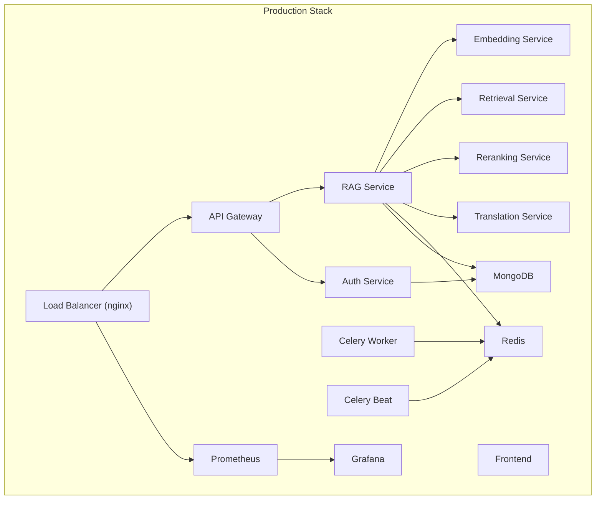
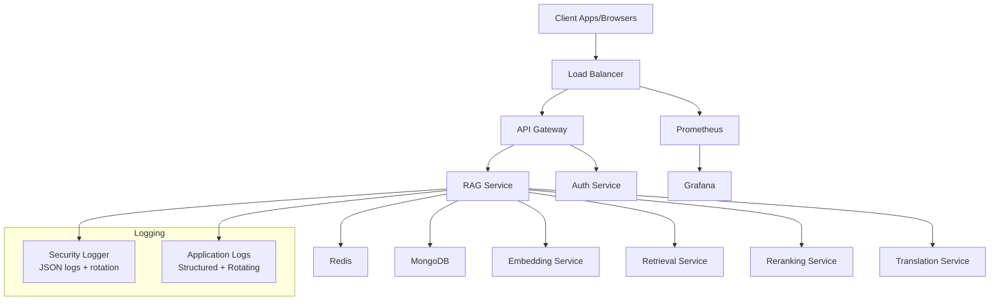
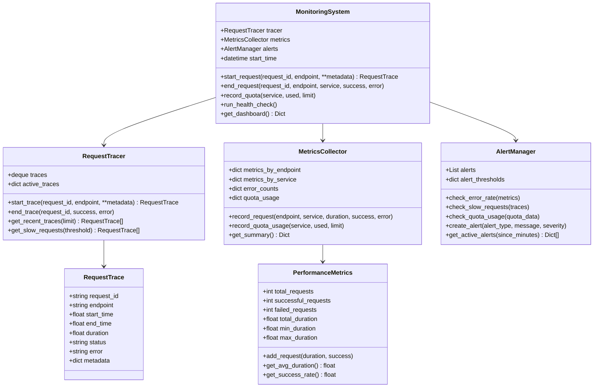
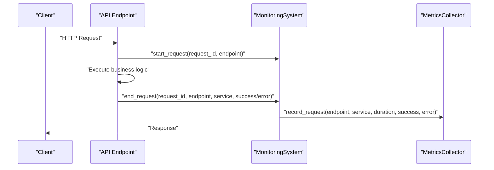
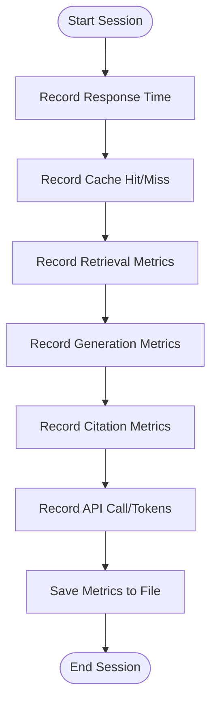
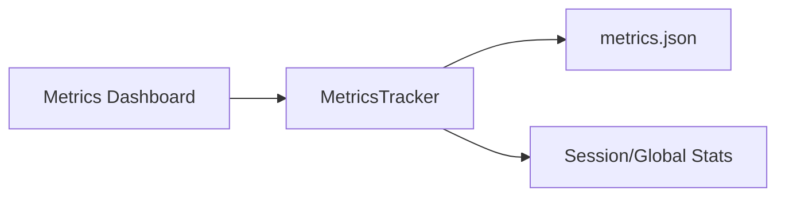
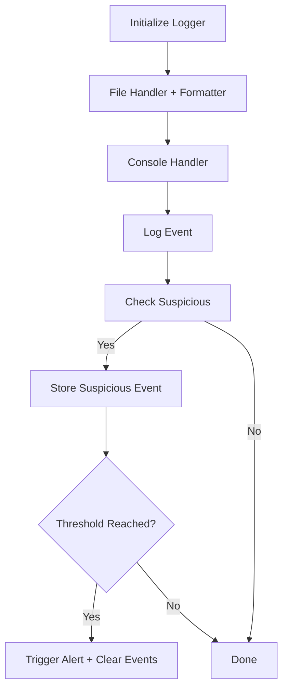
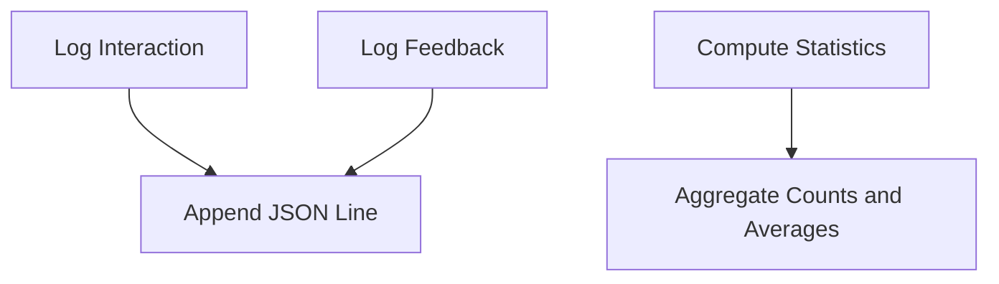
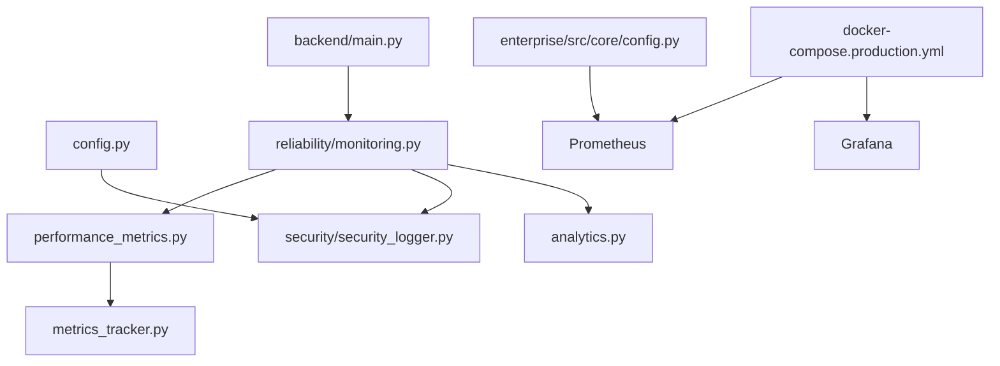

# Monitoring & Logging

<cite>
**Referenced Files in This Document**
- [docker-compose.production.yml](file://docker-compose.production.yml)
- [config.py](file://config.py)
- [backend/main.py](file://backend/main.py)
- [reliability/monitoring.py](file://reliability/monitoring.py)
- [performance_metrics.py](file://performance_metrics.py)
- [metrics_tracker.py](file://metrics_tracker.py)
- [metrics_dashboard.py](file://metrics_dashboard.py)
- [security/security_logger.py](file://security/security_logger.py)
- [analytics.py](file://analytics.py)
- [enterprise/src/core/config.py](file://enterprise/src/core/config.py)
</cite>

## Table of Contents
1. [Introduction](#introduction)
2. [Project Structure](#project-structure)
3. [Core Components](#core-components)
4. [Architecture Overview](#architecture-overview)
5. [Detailed Component Analysis](#detailed-component-analysis)
6. [Dependency Analysis](#dependency-analysis)
7. [Performance Considerations](#performance-considerations)
8. [Troubleshooting Guide](#troubleshooting-guide)
9. [Conclusion](#conclusion)
10. [Appendices](#appendices)

## Introduction
This document provides comprehensive monitoring and logging guidance for MinerAI production systems. It covers:
- Monitoring architecture with request tracing, performance metrics, error tracking, quota monitoring, and alerting
- Logging strategies with structured logging, log rotation, and centralized log management
- System health monitoring, performance tracking, and real-time observability
- Custom metrics implementation, user analytics collection, and compliance-aware log retention

The system integrates Prometheus/Grafana for metrics and dashboards, alongside application-level logging and analytics for operational visibility and compliance.

## Project Structure
MinerAI’s production stack is orchestrated via Docker Compose and includes dedicated services for Prometheus and Grafana. The backend exposes health checks and integrates monitoring decorators around API endpoints. Application-level metrics and analytics are captured through dedicated trackers and loggers.

**Diagram sources**
- [docker-compose.production.yml:1-359](file://docker-compose.production.yml#L1-L359)

**Section sources**
- [docker-compose.production.yml:1-359](file://docker-compose.production.yml#L1-L359)

## Core Components
- Request tracing and metrics collection: Centralized monitoring system with request tracing, performance metrics aggregation, and alerting thresholds
- Application-level performance metrics: Structured logging and persistence for response times, cache hit rates, retrieval and generation quality, API usage, and errors
- Security logging: Structured JSON logs with rotation, suspicious activity detection, and alerting
- Analytics: User interaction and feedback logging for usage statistics and quality evaluation
- Configuration: Centralized logging, rate limiting, and Prometheus/Grafana integration settings

Key implementation references:
- Monitoring system and decorators: [reliability/monitoring.py:1-373](file://reliability/monitoring.py#L1-L373)
- Performance metrics and persistence: [performance_metrics.py:1-424](file://performance_metrics.py#L1-L424)
- Metrics tracker and dashboard: [metrics_tracker.py:1-158](file://metrics_tracker.py#L1-L158), [metrics_dashboard.py:1-179](file://metrics_dashboard.py#L1-L179)
- Security logger and rotation: [security/security_logger.py:1-395](file://security/security_logger.py#L1-L395)
- Analytics and statistics: [analytics.py:1-94](file://analytics.py#L1-L94)
- Configuration and logging settings: [config.py:120-160](file://config.py#L120-L160), [enterprise/src/core/config.py:111-151](file://enterprise/src/core/config.py#L111-L151)

**Section sources**
- [reliability/monitoring.py:1-373](file://reliability/monitoring.py#L1-L373)
- [performance_metrics.py:1-424](file://performance_metrics.py#L1-L424)
- [metrics_tracker.py:1-158](file://metrics_tracker.py#L1-L158)
- [metrics_dashboard.py:1-179](file://metrics_dashboard.py#L1-L179)
- [security/security_logger.py:1-395](file://security/security_logger.py#L1-L395)
- [analytics.py:1-94](file://analytics.py#L1-L94)
- [config.py:120-160](file://config.py#L120-L160)
- [enterprise/src/core/config.py:111-151](file://enterprise/src/core/config.py#L111-L151)

## Architecture Overview
The monitoring and logging architecture combines:
- Prometheus scraping metrics exposed by services
- Grafana dashboards for real-time visualization
- Application-level logging with rotation and structured JSON
- Decorators and middleware to capture request traces and performance metrics
- Security logger for audit trails and anomaly detection
- Analytics logger for user interactions and feedback

**Diagram sources**
- [docker-compose.production.yml:1-359](file://docker-compose.production.yml#L1-L359)
- [reliability/monitoring.py:1-373](file://reliability/monitoring.py#L1-L373)
- [security/security_logger.py:1-395](file://security/security_logger.py#L1-L395)

## Detailed Component Analysis

### Monitoring System
The monitoring system provides request tracing, performance metrics aggregation, and alerting. It captures request lifecycle, computes endpoint/service metrics, tracks errors, and raises alerts based on thresholds.

**Diagram sources**
- [reliability/monitoring.py:22-373](file://reliability/monitoring.py#L22-L373)

**Section sources**
- [reliability/monitoring.py:22-373](file://reliability/monitoring.py#L22-L373)

### Request Tracing and Decorators
The monitoring module provides a decorator to automatically trace requests, compute durations, and record metrics and alerts. It supports both synchronous and asynchronous functions.

**Diagram sources**
- [reliability/monitoring.py:270-291](file://reliability/monitoring.py#L270-L291)

**Section sources**
- [reliability/monitoring.py:335-373](file://reliability/monitoring.py#L335-L373)

### Performance Metrics and Persistence
The performance metrics system records response times, cache hit rates, retrieval and generation quality, citation metrics, API usage, and errors. It persists metrics to JSON and supports summaries and statistics.

**Diagram sources**
- [performance_metrics.py:91-114](file://performance_metrics.py#L91-L114)
- [performance_metrics.py:117-140](file://performance_metrics.py#L117-L140)
- [performance_metrics.py:143-159](file://performance_metrics.py#L143-L159)
- [performance_metrics.py:162-202](file://performance_metrics.py#L162-L202)
- [performance_metrics.py:205-245](file://performance_metrics.py#L205-L245)
- [performance_metrics.py:248-291](file://performance_metrics.py#L248-L291)
- [performance_metrics.py:294-308](file://performance_metrics.py#L294-L308)
- [performance_metrics.py:311-320](file://performance_metrics.py#L311-L320)
- [performance_metrics.py:323-342](file://performance_metrics.py#L323-L342)

**Section sources**
- [performance_metrics.py:1-424](file://performance_metrics.py#L1-L424)

### Metrics Tracker and Dashboard
The metrics tracker writes structured JSON logs for RAG sessions and supports alias methods for compatibility. The dashboard displays performance metrics in a Streamlit UI.

**Diagram sources**
- [metrics_tracker.py:11-117](file://metrics_tracker.py#L11-L117)
- [metrics_tracker.py:118-145](file://metrics_tracker.py#L118-L145)
- [metrics_dashboard.py:8-179](file://metrics_dashboard.py#L8-L179)

**Section sources**
- [metrics_tracker.py:1-158](file://metrics_tracker.py#L1-L158)
- [metrics_dashboard.py:1-179](file://metrics_dashboard.py#L1-L179)

### Security Logger and Rotation
The security logger writes structured JSON logs with rotation, supports multiple severities, detects suspicious activities, and triggers alerts after threshold breaches. It reads recent events from today’s log file.

**Diagram sources**
- [security/security_logger.py:64-93](file://security/security_logger.py#L64-L93)
- [security/security_logger.py:252-292](file://security/security_logger.py#L252-L292)

**Section sources**
- [security/security_logger.py:1-395](file://security/security_logger.py#L1-L395)

### Analytics and User Feedback
The analytics tracker logs user interactions and feedback to a JSON Lines file, enabling statistics on modes, chapters, response times, and ratings.

**Diagram sources**
- [analytics.py:19-54](file://analytics.py#L19-L54)
- [analytics.py:55-87](file://analytics.py#L55-L87)

**Section sources**
- [analytics.py:1-94](file://analytics.py#L1-L94)

### Configuration and Environment
Centralized configuration defines logging levels, formats, and rotation parameters. Enterprise configuration adds Prometheus/Grafana integration flags and structured logging preferences.

- Logging configuration: [config.py:120-160](file://config.py#L120-L160)
- Prometheus/Grafana flags: [enterprise/src/core/config.py:111-123](file://enterprise/src/core/config.py#L111-L123)

**Section sources**
- [config.py:120-160](file://config.py#L120-L160)
- [enterprise/src/core/config.py:111-123](file://enterprise/src/core/config.py#L111-L123)

## Dependency Analysis
The monitoring and logging components depend on:
- Docker Compose orchestration for Prometheus and Grafana exposure
- Backend entrypoint for health checks and startup/shutdown events
- Configuration for logging and Prometheus/Grafana settings

**Diagram sources**
- [docker-compose.production.yml:1-359](file://docker-compose.production.yml#L1-L359)
- [backend/main.py:1-69](file://backend/main.py#L1-L69)
- [reliability/monitoring.py:1-373](file://reliability/monitoring.py#L1-L373)
- [performance_metrics.py:1-424](file://performance_metrics.py#L1-L424)
- [metrics_tracker.py:1-158](file://metrics_tracker.py#L1-L158)
- [security/security_logger.py:1-395](file://security/security_logger.py#L1-L395)
- [analytics.py:1-94](file://analytics.py#L1-L94)
- [config.py:120-160](file://config.py#L120-L160)
- [enterprise/src/core/config.py:111-151](file://enterprise/src/core/config.py#L111-L151)

**Section sources**
- [docker-compose.production.yml:1-359](file://docker-compose.production.yml#L1-L359)
- [backend/main.py:1-69](file://backend/main.py#L1-L69)
- [config.py:120-160](file://config.py#L120-L160)
- [enterprise/src/core/config.py:111-151](file://enterprise/src/core/config.py#L111-L151)

## Performance Considerations
- Use the monitoring decorator to instrument critical endpoints for latency and error tracking
- Persist metrics regularly and keep summaries concise for dashboard rendering
- Apply log rotation to avoid disk pressure; configure appropriate backup counts and sizes
- Monitor cache hit rates and tune batch sizes and concurrency for optimal throughput
- Enable health checks and circuit breakers to prevent cascading failures under load

[No sources needed since this section provides general guidance]

## Troubleshooting Guide
Common issues and remedies:
- High error rate: Inspect recent traces and error counts; adjust retry/backoff and degrade gracefully
- Slow requests: Identify endpoints with elevated average durations; optimize retrieval or generation steps
- Quota exceeded: Review quota usage thresholds and rotate API keys
- Security incidents: Investigate suspicious events and review security logs for repeated failed logins or unauthorized access attempts
- Log volume spikes: Verify rotation configuration and consider increasing backup count or reducing log verbosity

**Section sources**
- [reliability/monitoring.py:183-259](file://reliability/monitoring.py#L183-L259)
- [security/security_logger.py:252-292](file://security/security_logger.py#L252-L292)
- [config.py:120-160](file://config.py#L120-L160)

## Conclusion
MinerAI’s monitoring and logging stack integrates application-level metrics, structured security logs, and user analytics with a production-ready orchestration that supports Prometheus and Grafana. By leveraging decorators, persistent metrics, and robust logging with rotation, the system achieves real-time observability, strong security auditing, and actionable insights for continuous improvement.

[No sources needed since this section summarizes without analyzing specific files]

## Appendices

### Prometheus and Grafana Integration
- Prometheus port and metrics enablement are configurable via enterprise settings
- Grafana URL and API key can be supplied via environment variables for dashboard provisioning

**Section sources**
- [enterprise/src/core/config.py:111-123](file://enterprise/src/core/config.py#L111-L123)

### Health Checks and Observability
- API gateway exposes a health endpoint for load balancer and orchestrator checks
- Prometheus scrapes metrics from the production stack

**Section sources**
- [docker-compose.production.yml:61-66](file://docker-compose.production.yml#L61-L66)
- [docker-compose.production.yml:330-331](file://docker-compose.production.yml#L330-L331)