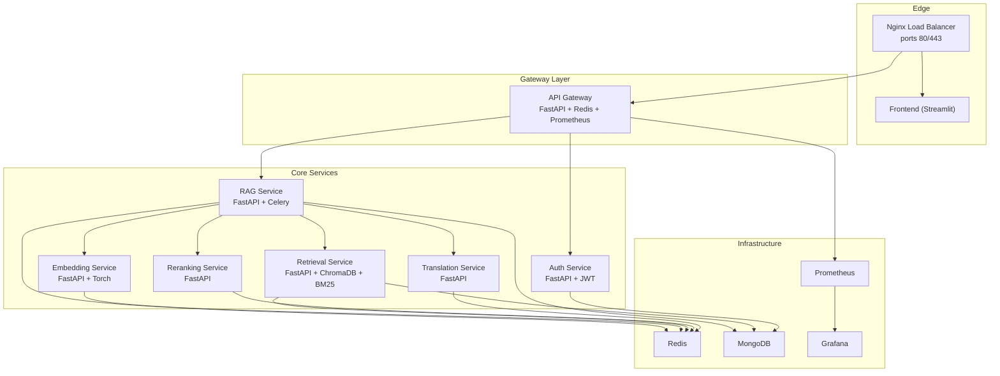
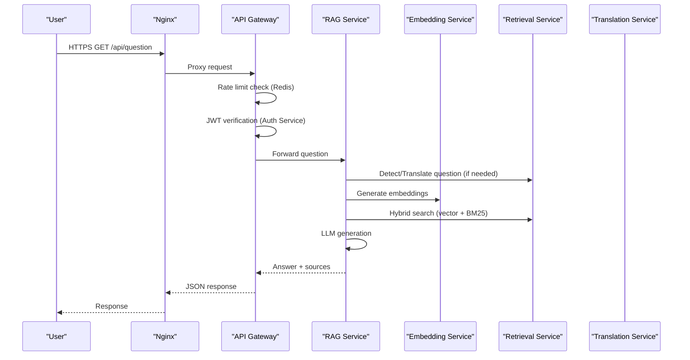
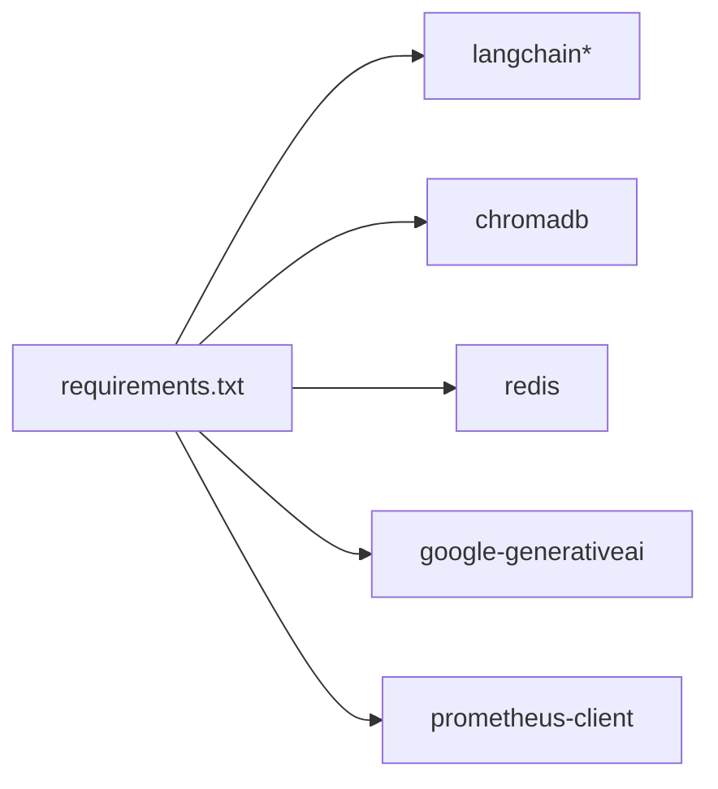

# Production & Deployment

<cite>
**Referenced Files in This Document**
- [docker-compose.production.yml](file://docker-compose.production.yml)
- [config.py](file://config.py)
- [requirements.txt](file://requirements.txt)
- [services/api-gateway/main.py](file://services/api-gateway/main.py)
- [services/rag-service/main.py](file://services/rag-service/main.py)
- [services/embedding-service/main.py](file://services/embedding-service/main.py)
- [services/retrieval-service/main.py](file://services/retrieval-service/main.py)
- [reliability/graceful_degradation.py](file://reliability/graceful_degradation.py)
- [reliability/rate_limiter.py](file://reliability/rate_limiter.py)
- [reliability/monitoring.py](file://reliability/monitoring.py)
- [enterprise/src/core/config.py](file://enterprise/src/core/config.py)
- [backend/main.py](file://backend/main.py)
</cite>

## Table of Contents
1. [Introduction](#introduction)
2. [Project Structure](#project-structure)
3. [Core Components](#core-components)
4. [Architecture Overview](#architecture-overview)
5. [Detailed Component Analysis](#detailed-component-analysis)
6. [Dependency Analysis](#dependency-analysis)
7. [Performance Considerations](#performance-considerations)
8. [Troubleshooting Guide](#troubleshooting-guide)
9. [Conclusion](#conclusion)
10. [Appendices](#appendices)

## Introduction
This document provides comprehensive production and deployment guidance for MinerAI. It covers containerization with Docker Compose, environment configuration, monitoring and logging systems, reliability features such as graceful degradation and rate limiting, deployment best practices, scaling considerations, maintenance procedures, CI/CD pipeline expectations, testing strategies, and quality assurance processes. The goal is to enable safe, scalable, and observable production deployments with robust error handling and performance controls.

## Project Structure
MinerAI follows a microservices architecture with a FastAPI gateway and specialized services for RAG orchestration, embedding, retrieval, reranking, translation, and authentication. Supporting infrastructure includes Redis for caching and queuing, MongoDB for persistence, and optional Prometheus/Grafana for observability. Configuration is centralized via environment variables and validated settings.

**Diagram sources**
- [docker-compose.production.yml](file://docker-compose.production.yml)
- [services/api-gateway/main.py](file://services/api-gateway/main.py)
- [services/rag-service/main.py](file://services/rag-service/main.py)
- [services/embedding-service/main.py](file://services/embedding-service/main.py)
- [services/retrieval-service/main.py](file://services/retrieval-service/main.py)

**Section sources**
- [docker-compose.production.yml](file://docker-compose.production.yml)
- [backend/main.py](file://backend/main.py)

## Core Components
- Containerization: Docker Compose orchestrates services, shared networks, persistent volumes, and resource limits.
- API Gateway: Central proxy with rate limiting, authentication, health checks, and Prometheus metrics.
- RAG Service: Orchestrates the pipeline, integrates with embedding, retrieval, reranking, and translation services, and uses Redis for caching and Celery for async tasks.
- Embedding Service: Generates embeddings with caching, batching, and GPU acceleration.
- Retrieval Service: Vector and keyword search with hybrid fusion and caching.
- Reliability: Graceful degradation, rate limiting, and monitoring with alerting.
- Configuration: Centralized environment-driven settings with validation and environment-specific profiles.

**Section sources**
- [docker-compose.production.yml](file://docker-compose.production.yml)
- [services/api-gateway/main.py](file://services/api-gateway/main.py)
- [services/rag-service/main.py](file://services/rag-service/main.py)
- [services/embedding-service/main.py](file://services/embedding-service/main.py)
- [services/retrieval-service/main.py](file://services/retrieval-service/main.py)
- [reliability/graceful_degradation.py](file://reliability/graceful_degradation.py)
- [reliability/rate_limiter.py](file://reliability/rate_limiter.py)
- [reliability/monitoring.py](file://reliability/monitoring.py)
- [config.py](file://config.py)
- [enterprise/src/core/config.py](file://enterprise/src/core/config.py)

## Architecture Overview
The system is designed for scalability and resilience:
- Edge: Nginx terminates TLS and routes traffic to the API Gateway and Frontend.
- Gateway: Enforces rate limits, authenticates requests, proxies to downstream services, and exposes metrics.
- Services: Specialized microservices communicate via internal Docker networks with Redis for caching and Celery for async workloads.
- Infrastructure: Redis persists caches and queues; MongoDB stores user and session data; optional Prometheus/Grafana for metrics and dashboards.

**Diagram sources**
- [docker-compose.production.yml](file://docker-compose.production.yml)
- [services/api-gateway/main.py](file://services/api-gateway/main.py)
- [services/rag-service/main.py](file://services/rag-service/main.py)
- [services/embedding-service/main.py](file://services/embedding-service/main.py)
- [services/retrieval-service/main.py](file://services/retrieval-service/main.py)

## Detailed Component Analysis

### API Gateway
Responsibilities:
- Authentication: Verifies JWT against the Auth Service.
- Rate limiting: Per-IP sliding window using Redis.
- Routing: Proxies to RAG endpoints (/question, /summary, /quiz).
- Health checks: Aggregates health status of dependent services.
- Observability: Exposes Prometheus metrics.

Operational notes:
- Uses Redis for rate-limit keys and TTL windows.
- On Redis failure, allows requests (fail-open) to preserve availability.
- Health check probes downstream services with short timeouts.

**Section sources**
- [services/api-gateway/main.py](file://services/api-gateway/main.py)
- [docker-compose.production.yml](file://docker-compose.production.yml)

### RAG Service
Responsibilities:
- Orchestrates the RAG pipeline: translation, retrieval, reranking, LLM generation, translation back.
- Caching: Redis-based query result caching with TTL.
- Async tasks: Uses Celery with Redis for long-running operations (e.g., quiz generation).
- Health: Reports status of Redis and downstream service connectivity.

Reliability:
- Integrates with graceful degradation utilities for fallbacks and partial results.
- Applies rate limiting and circuit breaker patterns for external APIs.

**Section sources**
- [services/rag-service/main.py](file://services/rag-service/main.py)
- [reliability/graceful_degradation.py](file://reliability/graceful_degradation.py)
- [reliability/rate_limiter.py](file://reliability/rate_limiter.py)

### Embedding Service
Responsibilities:
- Generates embeddings for lists of texts with caching and batching.
- Supports GPU acceleration when available.
- Provides endpoints for single and batch embedding generation.

Performance:
- Batch size configurable via environment variable.
- Embeddings cached in Redis with extended TTL.

**Section sources**
- [services/embedding-service/main.py](file://services/embedding-service/main.py)

### Retrieval Service
Responsibilities:
- Vector search using ChromaDB persistent storage.
- Keyword search using BM25 index.
- Hybrid search with reciprocal rank fusion (RRF).
- Caching of search results in Redis.

**Section sources**
- [services/retrieval-service/main.py](file://services/retrieval-service/main.py)

### Reliability Modules

#### Graceful Degradation
- Tracks service modes (full, degraded, minimal, offline) and transitions based on success/error counts.
- Provides fallback strategies: simple answer, partial answer, search-only answer.
- Includes timeout handlers and partial result aggregation.

**Section sources**
- [reliability/graceful_degradation.py](file://reliability/graceful_degradation.py)

#### Rate Limiting
- Implements token bucket and sliding window rate limiting.
- Circuit breaker pattern to handle transient failures.
- Decorators for applying rate limits and circuit breaking around service calls.

**Section sources**
- [reliability/rate_limiter.py](file://reliability/rate_limiter.py)

#### Monitoring and Alerting
- Request tracing with performance metrics and error tracking.
- Metrics aggregation by endpoint and service.
- Alert thresholds for error rates, slow requests, and quota usage.
- Dashboard data for operational visibility.

**Section sources**
- [reliability/monitoring.py](file://reliability/monitoring.py)

### Configuration Management
- Centralized configuration with environment variables and validation.
- Logging, rate limiting, and performance tuning knobs.
- Enterprise-grade settings with environment-specific profiles and Pydantic validation.

**Section sources**
- [config.py](file://config.py)
- [enterprise/src/core/config.py](file://enterprise/src/core/config.py)

## Dependency Analysis
External dependencies include LangChain, ChromaDB, Redis, MongoDB, Google Generative AI, and Prometheus client. These are declared in requirements.txt and used across services for data processing, vector storage, caching, and telemetry.

**Diagram sources**
- [requirements.txt](file://requirements.txt)

**Section sources**
- [requirements.txt](file://requirements.txt)

## Performance Considerations
- Resource limits: CPU/memory caps applied to services via Docker Compose deploy sections.
- Caching: Redis caches embeddings, retrieval results, and RAG answers to reduce latency and API costs.
- Batching: Embedding service supports configurable batch sizes to improve throughput.
- Async processing: Celery workers offload long-running tasks; multiple replicas recommended for concurrency.
- GPU acceleration: Embedding service detects CUDA availability and switches to GPU when present.
- Timeouts and retries: Configurable timeouts and retry strategies prevent cascading failures.

**Section sources**
- [docker-compose.production.yml](file://docker-compose.production.yml)
- [services/embedding-service/main.py](file://services/embedding-service/main.py)
- [services/rag-service/main.py](file://services/rag-service/main.py)
- [config.py](file://config.py)

## Troubleshooting Guide
Common scenarios and remedies:
- Rate limit exceeded: Inspect gateway rate limiter and Redis counters; adjust limits or scale horizontally.
- Auth failures: Verify JWT token and Auth Service health; check token verification endpoint.
- Downstream service unresponsive: Use gateway /health to confirm service status; inspect service logs and Redis/Mongo connectivity.
- Slow queries: Review Retrieval Service hybrid search performance and BM25 index completeness; check Redis cache hits.
- Circuit breaker open: Monitor failure counts and recovery timeouts; address root cause before recovery.
- Monitoring gaps: Confirm Prometheus scraping and Grafana dashboards; validate metric endpoints.

Operational checks:
- Health endpoints: /health on gateway and individual services.
- Metrics endpoint: /metrics on gateway for Prometheus scraping.
- Logs: Container logs for each service; ensure log rotation configured.

**Section sources**
- [services/api-gateway/main.py](file://services/api-gateway/main.py)
- [services/rag-service/main.py](file://services/rag-service/main.py)
- [reliability/monitoring.py](file://reliability/monitoring.py)

## Conclusion
MinerAI’s production deployment leverages a microservices architecture with strong reliability and observability built-in. Docker Compose simplifies orchestration, while Redis, MongoDB, and optional Prometheus/Grafana provide essential infrastructure. Centralized configuration and validation ensure consistent behavior across environments. By following the deployment best practices, scaling guidelines, and troubleshooting steps outlined here, teams can operate MinerAI reliably at production scale.

## Appendices

### Deployment Best Practices
- Secrets management: Store API keys and credentials in environment variables managed by your platform secrets store.
- Network isolation: Keep services in dedicated Docker networks; expose only necessary ports externally.
- Health checks: Use Compose healthchecks and service-level /health endpoints for automated monitoring.
- Backup and restore: Regularly back up persistent volumes (Redis data, MongoDB data, ChromaDB).
- Rolling updates: Use replica scaling for stateless services; adopt blue/green or rolling upgrades for critical services.

### Scaling Considerations
- Horizontal scaling: Increase replicas for Celery workers and stateless services.
- Vertical scaling: Adjust CPU/memory limits per service based on workload.
- Caching: Tune Redis TTL and eviction policies to balance memory and hit rates.
- Database: Scale MongoDB and Redis independently; monitor connection pools and throughput.

### Maintenance Procedures
- Patching: Regularly update base images and Python dependencies; validate with integration tests.
- Index rebuilding: Periodically re-index ChromaDB and BM25 to maintain recall and relevance.
- Capacity planning: Monitor quota usage for external APIs and adjust budgets accordingly.

### CI/CD Pipeline Expectations
- Build stages: Separate Docker builds for each service; cache layers for faster builds.
- Test automation: Run unit and integration tests in CI; enforce quality gates.
- Artifact promotion: Tag images with semantic versions; promote through staging to production.
- Rollback: Maintain image tags for last known good versions; automate rollback on failure.

### Testing Strategies and Quality Assurance
- Unit tests: Validate core algorithms and utilities (e.g., chunking, reranking).
- Integration tests: End-to-end pipeline tests across services; mock external APIs where applicable.
- Load tests: Simulate concurrent users with Locust or similar tools; measure latency and saturation points.
- Chaos engineering: Introduce controlled failures (e.g., Redis down) to validate graceful degradation.