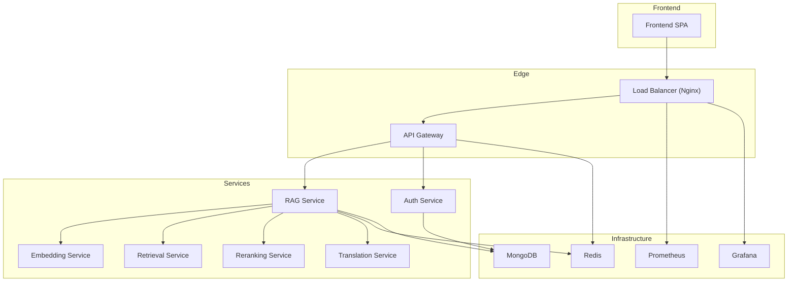
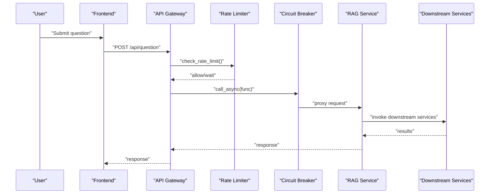
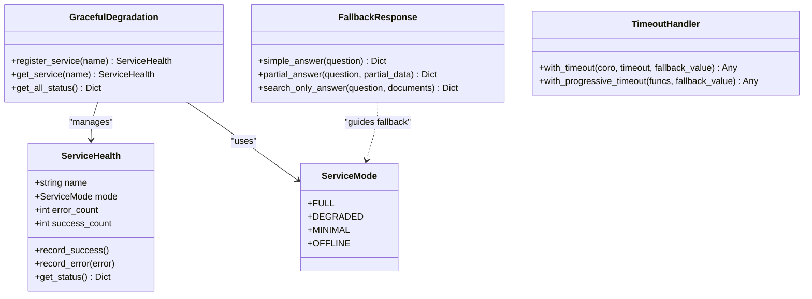
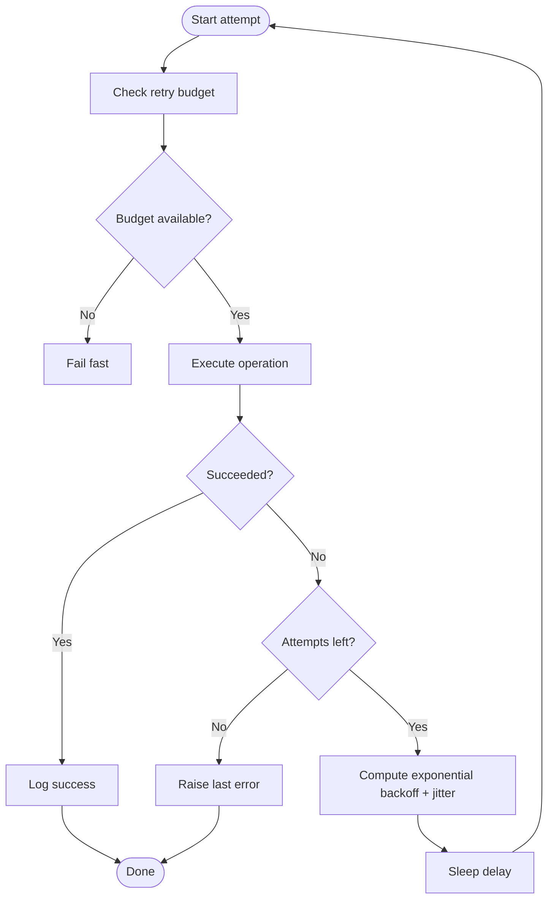
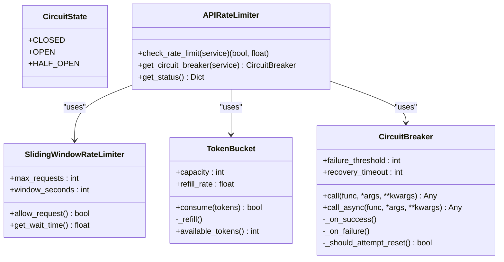
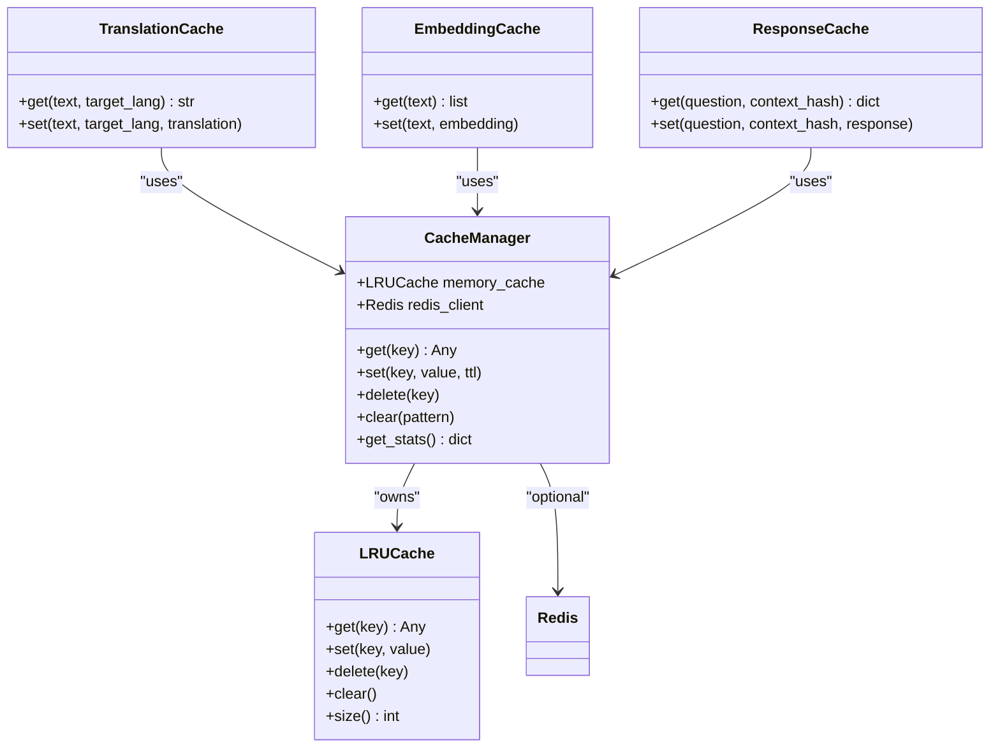
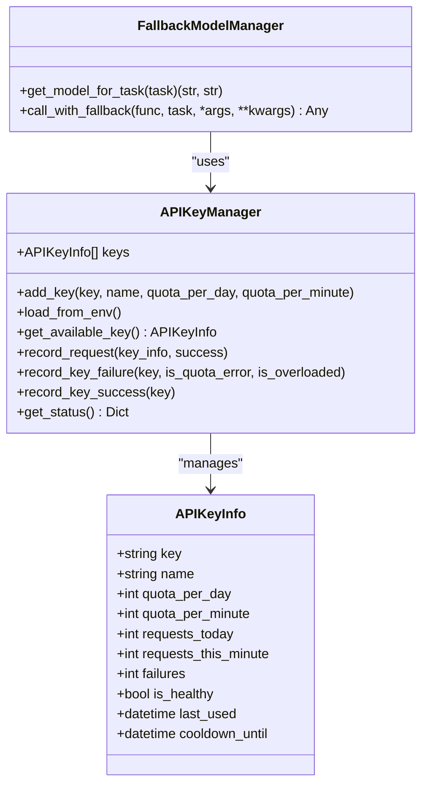
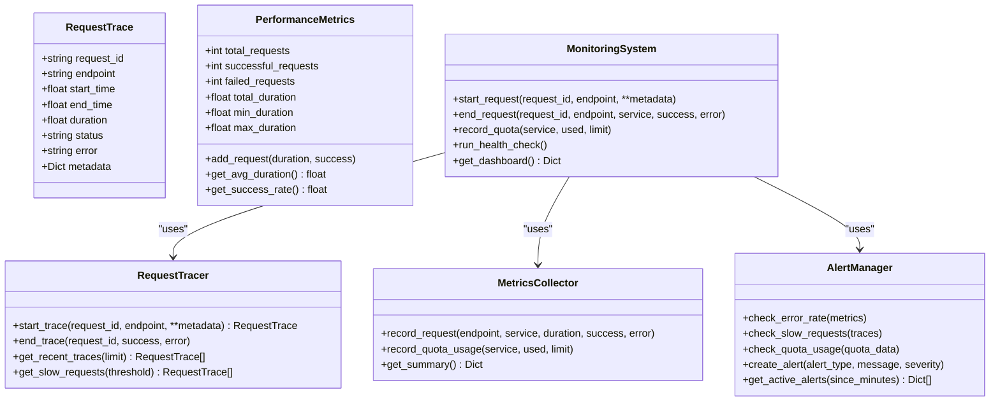
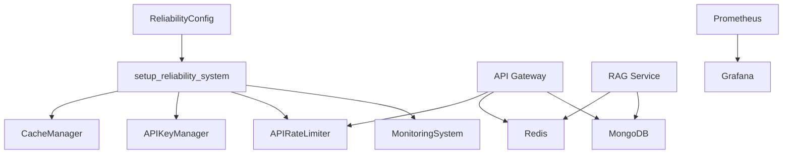

# Production Reliability

<cite>
**Referenced Files in This Document**
- [reliability/__init__.py](file://reliability/__init__.py)
- [reliability/graceful_degradation.py](file://reliability/graceful_degradation.py)
- [reliability/retry_strategy.py](file://reliability/retry_strategy.py)
- [reliability/rate_limiter.py](file://reliability/rate_limiter.py)
- [reliability/cache_manager.py](file://reliability/cache_manager.py)
- [reliability/monitoring.py](file://reliability/monitoring.py)
- [reliability/api_key_manager.py](file://reliability/api_key_manager.py)
- [reliability/config.py](file://reliability/config.py)
- [reliability/setup.py](file://reliability/setup.py)
- [services/api-gateway/main.py](file://services/api-gateway/main.py)
- [services/rag-service/main.py](file://services/rag-service/main.py)
- [docker-compose.production.yml](file://docker-compose.production.yml)
- [requirements.txt](file://requirements.txt)
</cite>

## Table of Contents
1. [Introduction](#introduction)
2. [Project Structure](#project-structure)
3. [Core Components](#core-components)
4. [Architecture Overview](#architecture-overview)
5. [Detailed Component Analysis](#detailed-component-analysis)
6. [Dependency Analysis](#dependency-analysis)
7. [Performance Considerations](#performance-considerations)
8. [Troubleshooting Guide](#troubleshooting-guide)
9. [Conclusion](#conclusion)
10. [Appendices](#appendices)

## Introduction
This document provides production reliability guidance for MinerAI, focusing on graceful degradation, circuit breakers, fault tolerance, rate limiting, retry policies, caching, monitoring, and operational procedures. It synthesizes the reliability subsystems and production-grade infrastructure present in the repository to help operators maintain stability under load, API quota constraints, and transient failures.

## Project Structure
MinerAI’s reliability stack is modular and composed of:
- Reliability engineering modules: graceful degradation, retry, rate limiting, caching, API key management, monitoring, configuration, and initialization.
- Service mesh: API Gateway and RAG service with internal orchestration and Redis-backed caching.
- Infrastructure: Docker Compose multi-service deployment including load balancer, Redis, MongoDB, Prometheus/Grafana, and Celery workers.

**Diagram sources**
- [docker-compose.production.yml:1-359](file://docker-compose.production.yml#L1-L359)
- [services/api-gateway/main.py:1-269](file://services/api-gateway/main.py#L1-L269)
- [services/rag-service/main.py:1-299](file://services/rag-service/main.py#L1-L299)

**Section sources**
- [docker-compose.production.yml:1-359](file://docker-compose.production.yml#L1-L359)
- [services/api-gateway/main.py:1-269](file://services/api-gateway/main.py#L1-L269)
- [services/rag-service/main.py:1-299](file://services/rag-service/main.py#L1-L299)

## Core Components
This section summarizes the reliability subsystems and their roles in production.

- Graceful Degradation
  - Service modes and health tracking, fallback responses, partial results, and timeouts.
  - Provides decorators and helpers to wrap primary and fallback logic with automatic mode transitions.

- Retry Policies
  - Exponential backoff with jitter and retry budgets to avoid thundering herds.
  - Adaptive retry that adjusts max attempts based on observed success rates.

- Rate Limiting and Circuit Breakers
  - Token bucket and sliding window rate limiters.
  - Circuit breaker with closed/open/half-open states and recovery timeouts.

- Caching
  - Multi-tier cache with in-memory LRU and Redis (distributed).
  - Specialized caches for translations, embeddings, and RAG responses.

- API Key Management
  - Multiple key rotation, per-key quota tracking, health cooldowns, and model fallback selection.

- Monitoring and Alerting
  - Request tracing, performance metrics, quota monitoring, and alert thresholds.

- Configuration and Initialization
  - Centralized configuration with environment-driven defaults and validation.
  - Setup routine to initialize cache, API keys, rate limiter, and monitoring.

**Section sources**
- [reliability/__init__.py:1-80](file://reliability/__init__.py#L1-L80)
- [reliability/graceful_degradation.py:1-329](file://reliability/graceful_degradation.py#L1-L329)
- [reliability/retry_strategy.py:1-303](file://reliability/retry_strategy.py#L1-L303)
- [reliability/rate_limiter.py:1-324](file://reliability/rate_limiter.py#L1-L324)
- [reliability/cache_manager.py:1-329](file://reliability/cache_manager.py#L1-L329)
- [reliability/api_key_manager.py:1-357](file://reliability/api_key_manager.py#L1-L357)
- [reliability/monitoring.py:1-373](file://reliability/monitoring.py#L1-L373)
- [reliability/config.py:1-124](file://reliability/config.py#L1-L124)
- [reliability/setup.py:1-88](file://reliability/setup.py#L1-L88)

## Architecture Overview
The production architecture integrates reliability primitives at the edge and within services:

- Edge protections
  - API Gateway enforces rate limiting and proxies to the RAG service.
  - Redis is used for distributed caching and rate-limit counters.
  - Prometheus metrics exposed for observability.

- Service-level resilience
  - RAG service orchestrates downstream services and caches results.
  - Reliability decorators and utilities ensure robustness against transient failures and quota limits.

**Diagram sources**
- [services/api-gateway/main.py:95-121](file://services/api-gateway/main.py#L95-L121)
- [services/api-gateway/main.py:192-238](file://services/api-gateway/main.py#L192-L238)
- [reliability/rate_limiter.py:278-324](file://reliability/rate_limiter.py#L278-L324)
- [reliability/rate_limiter.py:99-181](file://reliability/rate_limiter.py#L99-L181)
- [services/rag-service/main.py:219-228](file://services/rag-service/main.py#L219-L228)

## Detailed Component Analysis

### Graceful Degradation
Graceful Degradation manages service modes and fallback responses:
- Modes: full, degraded, minimal, offline.
- Health tracking records successes and errors to adjust mode automatically.
- Fallback strategies include simple answers, partial results, and search-only responses.
- Timeout handlers support progressive timeouts and race-with-fallback patterns.

**Diagram sources**
- [reliability/graceful_degradation.py:18-71](file://reliability/graceful_degradation.py#L18-L71)
- [reliability/graceful_degradation.py:74-95](file://reliability/graceful_degradation.py#L74-L95)
- [reliability/graceful_degradation.py:102-155](file://reliability/graceful_degradation.py#L102-L155)
- [reliability/graceful_degradation.py:211-257](file://reliability/graceful_degradation.py#L211-L257)

**Section sources**
- [reliability/graceful_degradation.py:1-329](file://reliability/graceful_degradation.py#L1-L329)

### Retry Policies
Retry strategies implement exponential backoff with jitter and adaptive tuning:
- RetryConfig defines max attempts, delays, and retry-on exceptions.
- RetryBudget throttles retry storms.
- ExponentialBackoff computes delays with optional jitter.
- AdaptiveRetry monitors success rate and dynamically selects max attempts.

**Diagram sources**
- [reliability/retry_strategy.py:20-38](file://reliability/retry_strategy.py#L20-L38)
- [reliability/retry_strategy.py:40-62](file://reliability/retry_strategy.py#L40-L62)
- [reliability/retry_strategy.py:64-84](file://reliability/retry_strategy.py#L64-L84)
- [reliability/retry_strategy.py:86-194](file://reliability/retry_strategy.py#L86-L194)
- [reliability/retry_strategy.py:197-236](file://reliability/retry_strategy.py#L197-L236)

**Section sources**
- [reliability/retry_strategy.py:1-303](file://reliability/retry_strategy.py#L1-L303)

### Rate Limiting and Circuit Breakers
The rate limiter combines sliding windows, token buckets, and circuit breakers:
- TokenBucket controls burstiness.
- SlidingWindowRateLimiter enforces per-window quotas.
- CircuitBreaker guards downstream calls with state transitions and recovery checks.
- APIRateLimiter aggregates strategies per service and exposes decorators.

**Diagram sources**
- [reliability/rate_limiter.py:27-63](file://reliability/rate_limiter.py#L27-L63)
- [reliability/rate_limiter.py:65-97](file://reliability/rate_limiter.py#L65-L97)
- [reliability/rate_limiter.py:99-181](file://reliability/rate_limiter.py#L99-L181)
- [reliability/rate_limiter.py:183-272](file://reliability/rate_limiter.py#L183-L272)

**Section sources**
- [reliability/rate_limiter.py:1-324](file://reliability/rate_limiter.py#L1-L324)

### Caching Strategy
The cache manager implements a two-tier system:
- L1: in-memory LRU cache.
- L2: Redis cache with pickle serialization and TTL support.
- Specialized caches for translations, embeddings, and RAG responses.

**Diagram sources**
- [reliability/cache_manager.py:31-74](file://reliability/cache_manager.py#L31-L74)
- [reliability/cache_manager.py:76-191](file://reliability/cache_manager.py#L76-L191)
- [reliability/cache_manager.py:277-329](file://reliability/cache_manager.py#L277-L329)

**Section sources**
- [reliability/cache_manager.py:1-329](file://reliability/cache_manager.py#L1-L329)

### API Key Management and Model Fallback
The API key manager rotates among multiple keys, tracks quotas and health, and supports model fallback:
- Quota resets per minute/day, health cooldowns, and failure tracking.
- Fallback model manager selects alternate models when upstream calls fail.

**Diagram sources**
- [reliability/api_key_manager.py:20-35](file://reliability/api_key_manager.py#L20-L35)
- [reliability/api_key_manager.py:37-246](file://reliability/api_key_manager.py#L37-L246)
- [reliability/api_key_manager.py:248-319](file://reliability/api_key_manager.py#L248-L319)

**Section sources**
- [reliability/api_key_manager.py:1-357](file://reliability/api_key_manager.py#L1-L357)

### Monitoring and Alerting
The monitoring system tracks requests, performance, and quota usage, and raises alerts based on thresholds:
- RequestTracer captures traces with durations and statuses.
- MetricsCollector aggregates endpoint and service metrics.
- AlertManager triggers warnings and critical alerts.
- Dashboard exposes uptime, recent traces, slow requests, and active alerts.

**Diagram sources**
- [reliability/monitoring.py:22-68](file://reliability/monitoring.py#L22-L68)
- [reliability/monitoring.py:70-110](file://reliability/monitoring.py#L70-L110)
- [reliability/monitoring.py:112-181](file://reliability/monitoring.py#L112-L181)
- [reliability/monitoring.py:183-259](file://reliability/monitoring.py#L183-L259)
- [reliability/monitoring.py:261-329](file://reliability/monitoring.py#L261-L329)

**Section sources**
- [reliability/monitoring.py:1-373](file://reliability/monitoring.py#L1-L373)

### Configuration and Initialization
Centralized configuration and setup:
- ReliabilityConfig loads environment variables and validates presence of required keys.
- setup_reliability_system initializes cache, API keys, rate limiter, and monitoring.
- get_system_status aggregates runtime status across components.

**Section sources**
- [reliability/config.py:1-124](file://reliability/config.py#L1-L124)
- [reliability/setup.py:1-88](file://reliability/setup.py#L1-L88)

## Dependency Analysis
The reliability subsystems integrate with services and infrastructure:

- API Gateway
  - Uses Redis for rate limiting and metrics collection.
  - Proxies to RAG service and performs authentication via Auth Service.

- RAG Service
  - Orchestrates downstream services and caches results in Redis.
  - Uses Celery for asynchronous tasks.

- Infrastructure
  - Docker Compose defines multi-service deployment with health checks, resource limits, and monitoring stacks.

**Diagram sources**
- [reliability/config.py:13-124](file://reliability/config.py#L13-L124)
- [reliability/setup.py:16-66](file://reliability/setup.py#L16-L66)
- [services/api-gateway/main.py:95-121](file://services/api-gateway/main.py#L95-L121)
- [services/rag-service/main.py:37-44](file://services/rag-service/main.py#L37-L44)
- [docker-compose.production.yml:1-359](file://docker-compose.production.yml#L1-L359)

**Section sources**
- [reliability/config.py:1-124](file://reliability/config.py#L1-L124)
- [reliability/setup.py:1-88](file://reliability/setup.py#L1-L88)
- [services/api-gateway/main.py:1-269](file://services/api-gateway/main.py#L1-L269)
- [services/rag-service/main.py:1-299](file://services/rag-service/main.py#L1-L299)
- [docker-compose.production.yml:1-359](file://docker-compose.production.yml#L1-L359)

## Performance Considerations
- Caching
  - Enable Redis for distributed caching to reduce latency and downstream load.
  - Use specialized caches for translations, embeddings, and RAG responses to minimize recomputation.

- Rate Limiting
  - Tune sliding window and token bucket parameters to match provider quotas and traffic patterns.
  - Apply circuit breakers to protect downstream services during spikes.

- Retries
  - Prefer exponential backoff with jitter to avoid synchronized retry storms.
  - Use adaptive retry to reduce attempts when success rates drop.

- Timeouts
  - Set conservative timeouts for translation, retrieval, generation, and total request durations.
  - Combine timeouts with graceful degradation to serve partial results when necessary.

- Resource Limits
  - Configure CPU/memory limits for services in Docker Compose to prevent resource contention.
  - Monitor slow requests and error rates to identify bottlenecks.

[No sources needed since this section provides general guidance]

## Troubleshooting Guide
- Redis connectivity
  - If Redis is unavailable, the API Gateway rate limiter fails open; the cache falls back to in-memory only.
  - Verify Redis health checks and configuration in Docker Compose.

- API quota exhaustion
  - APIKeyManager tracks daily and per-minute quotas and marks keys unhealthy on quota errors.
  - Monitor quota usage via the monitoring system and alert thresholds.

- Circuit breaker activation
  - CircuitBreaker transitions to OPEN after exceeding failure threshold; monitor state and recovery timeout.

- Slow requests and timeouts
  - Use RequestTracer and MetricsCollector to identify endpoints with elevated durations.
  - Apply graceful degradation and partial results to mitigate impact.

- Health checks
  - API Gateway and services expose health endpoints; ensure dependent services are reachable.

**Section sources**
- [services/api-gateway/main.py:156-181](file://services/api-gateway/main.py#L156-L181)
- [reliability/api_key_manager.py:178-210](file://reliability/api_key_manager.py#L178-L210)
- [reliability/rate_limiter.py:102-181](file://reliability/rate_limiter.py#L102-L181)
- [reliability/monitoring.py:299-329](file://reliability/monitoring.py#L299-L329)

## Conclusion
MinerAI’s reliability subsystems provide a robust foundation for production operations: graceful degradation, circuit breakers, rate limiting, adaptive retries, multi-tier caching, API key rotation, and comprehensive monitoring. Combined with the production-grade Docker Compose deployment and service orchestration, these components enable resilient, observable, and scalable operations under real-world conditions.

[No sources needed since this section summarizes without analyzing specific files]

## Appendices

### Production Deployment Checklist
- Confirm environment variables for Redis, MongoDB, Google API keys, and JWT secrets.
- Validate Docker Compose health checks and resource limits.
- Enable Prometheus and Grafana dashboards for continuous monitoring.
- Test graceful degradation and circuit breaker behavior under simulated failures.
- Verify cache initialization and Redis connectivity.

**Section sources**
- [docker-compose.production.yml:1-359](file://docker-compose.production.yml#L1-L359)
- [reliability/config.py:1-124](file://reliability/config.py#L1-L124)
- [reliability/setup.py:16-66](file://reliability/setup.py#L16-L66)

### Observability and Metrics
- Expose Prometheus metrics from the API Gateway and services.
- Track error rates, slow requests, and quota usage thresholds.
- Visualize system health and recent traces in Grafana.

**Section sources**
- [services/api-gateway/main.py:29-39](file://services/api-gateway/main.py#L29-L39)
- [reliability/monitoring.py:183-259](file://reliability/monitoring.py#L183-L259)