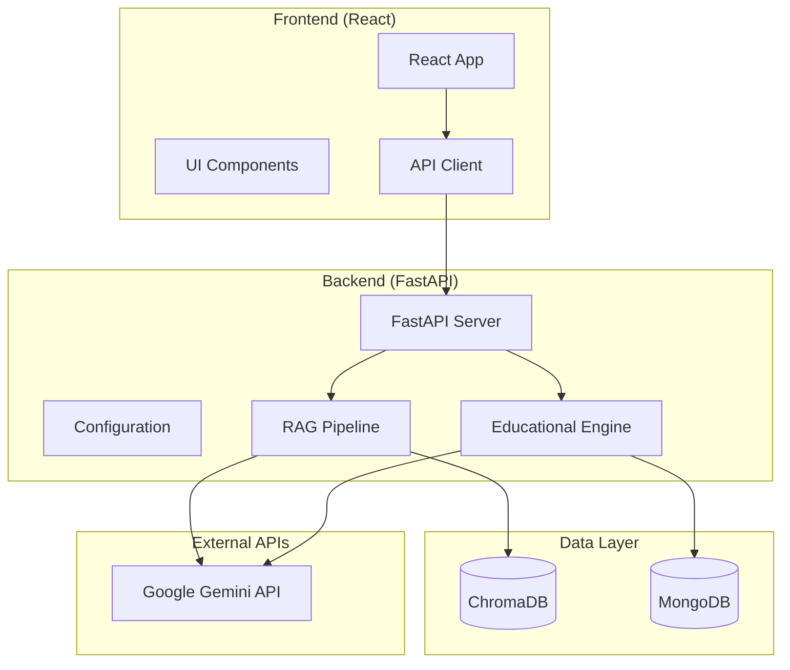
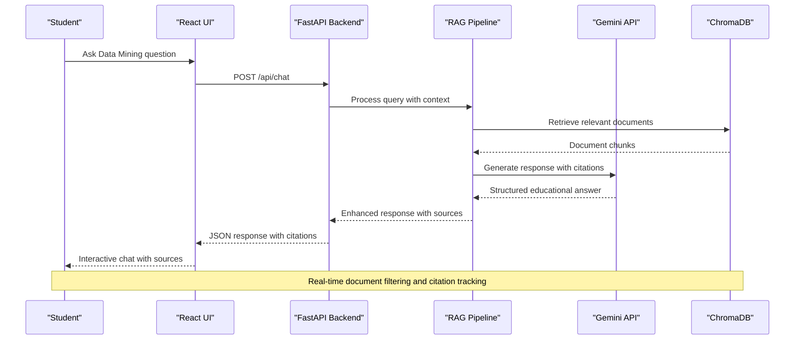
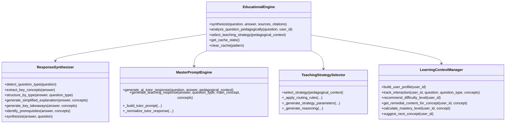
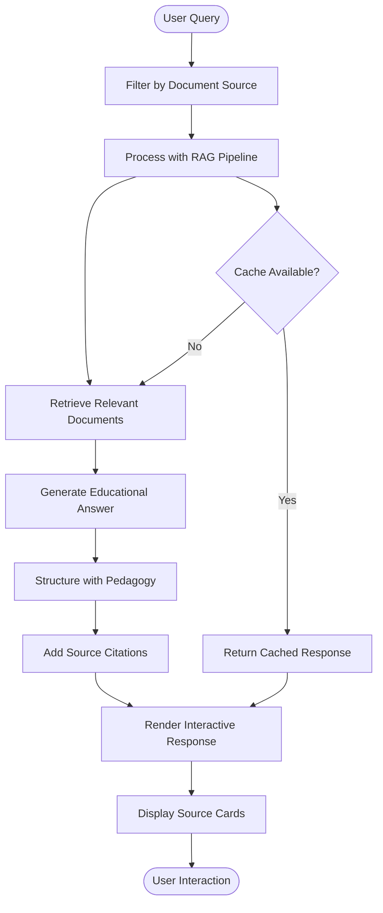
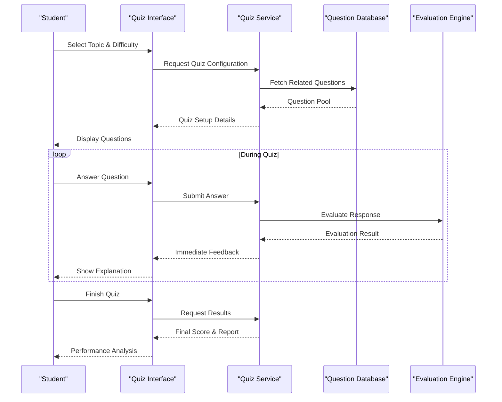
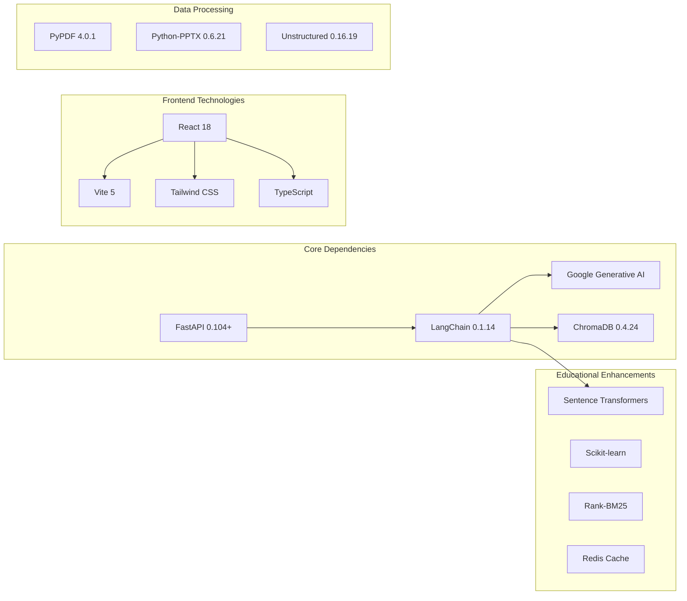

# Project Overview

<cite>
**Referenced Files in This Document**
- [README.md](file://README.md)
- [backend/main.py](file://backend/main.py)
- [frontend/src/App.tsx](file://frontend/src/App.tsx)
- [frontend/src/components/MentorTab.tsx](file://frontend/src/components/MentorTab.tsx)
- [frontend/src/components/QuizTab.tsx](file://frontend/src/components/QuizTab.tsx)
- [config.py](file://config.py)
- [educational_engine/__init__.py](file://educational_engine/__init__.py)
- [educational_engine/response_synthesizer.py](file://educational_engine/response_synthesizer.py)
- [educational_engine/master_prompt_engine.py](file://educational_engine/master_prompt_engine.py)
- [educational_engine/teaching_strategy_selector.py](file://educational_engine/teaching_strategy_selector.py)
- [educational_engine/learning_context_manager.py](file://educational_engine/learning_context_manager.py)
- [rag.py](file://rag.py)
- [requirements.txt](file://requirements.txt)
- [frontend/package.json](file://frontend/package.json)
</cite>

## Table of Contents
1. [Introduction](#introduction)
2. [Project Structure](#project-structure)
3. [Core Components](#core-components)
4. [Architecture Overview](#architecture-overview)
5. [Detailed Component Analysis](#detailed-component-analysis)
6. [Dependency Analysis](#dependency-analysis)
7. [Performance Considerations](#performance-considerations)
8. [Troubleshooting Guide](#troubleshooting-guide)
9. [Conclusion](#conclusion)

## Introduction
MinerAI is an intelligent tutoring platform for Data Mining education powered by Retrieval-Augmented Generation (RAG) with Google Gemini API. The system combines a Python FastAPI backend and a React frontend to deliver an immersive educational experience. It supports intelligent Q&A with contextual awareness, document summarization, interactive quizzes, and real-time analytics. The platform emphasizes pedagogical effectiveness through adaptive difficulty, visual explanations, and personalized learning pathways.

## Project Structure
The repository follows a modular full-stack layout:
- Backend: FastAPI application with RAG pipeline, configuration, and educational engine modules
- Frontend: React application with TypeScript, Tailwind CSS, and component-based UI
- Educational Engine: Specialized modules for response synthesis, pedagogical reasoning, and adaptive teaching
- Data and Vector Stores: ChromaDB for embeddings and document retrieval
- Services: Modular microservices architecture for embedding, retrieval, and RAG processing

**Diagram sources**
- [backend/main.py:25-50](file://backend/main.py#L25-L50)
- [config.py:17-25](file://config.py#L17-L25)
- [educational_engine/__init__.py:52-80](file://educational_engine/__init__.py#L52-L80)

**Section sources**
- [README.md:114-141](file://README.md#L114-L141)
- [backend/main.py:11-21](file://backend/main.py#L11-L21)
- [frontend/src/App.tsx:19-310](file://frontend/src/App.tsx#L19-L310)

## Core Components
The system comprises several specialized components working together:

### Educational Engine
The Educational Engine transforms raw RAG responses into structured, pedagogically sound educational content. It includes:
- Response Synthesizer: Analyzes question types, extracts key concepts, and structures answers
- Master Prompt Engine: Generates comprehensive teaching responses using pedagogical reasoning
- Teaching Strategy Selector: Routes optimal teaching approaches based on context and user level
- Learning Context Manager: Tracks user progress and personalizes content delivery

### RAG Pipeline
The Retrieval-Augmented Generation pipeline integrates:
- Semantic chunking for document processing
- Hybrid search combining vector similarity and BM25
- Cross-encoder reranking for improved relevance
- Google Gemini API integration for generation

### Frontend Application
The React-based frontend provides:
- Interactive chat interface with document filtering
- Quiz system with adaptive question generation
- Personalized learning dashboards
- Real-time analytics and progress tracking

**Section sources**
- [educational_engine/__init__.py:52-80](file://educational_engine/__init__.py#L52-L80)
- [rag.py:18-25](file://rag.py#L18-L25)
- [frontend/src/components/MentorTab.tsx:28-32](file://frontend/src/components/MentorTab.tsx#L28-L32)

## Architecture Overview
The system employs a layered architecture with clear separation of concerns:

**Diagram sources**
- [frontend/src/components/MentorTab.tsx:89-114](file://frontend/src/components/MentorTab.tsx#L89-L114)
- [backend/main.py:44-50](file://backend/main.py#L44-L50)
- [rag.py:472-504](file://rag.py#L472-L504)

The architecture supports:
- **Scalable Microservices**: Separate services for embedding, retrieval, and RAG processing
- **Adaptive Learning**: Personalized content based on user progress and preferences
- **Real-time Processing**: Streaming responses and live analytics
- **Multi-modal Content**: Text, code examples, and visual explanations

## Detailed Component Analysis

### Educational Response Synthesis Engine
The Educational Engine optimizes the transformation from raw AI responses to pedagogically effective explanations:

**Diagram sources**
- [educational_engine/__init__.py:52-80](file://educational_engine/__init__.py#L52-L80)
- [educational_engine/response_synthesizer.py:22-34](file://educational_engine/response_synthesizer.py#L22-L34)
- [educational_engine/master_prompt_engine.py:49-64](file://educational_engine/master_prompt_engine.py#L49-L64)
- [educational_engine/teaching_strategy_selector.py:26-42](file://educational_engine/teaching_strategy_selector.py#L26-L42)
- [educational_engine/learning_context_manager.py:23-40](file://educational_engine/learning_context_manager.py#L23-L40)

The engine implements several optimization strategies:
- **Master Prompt Optimization**: Consolidates multiple teaching calls into single LLM invocation
- **Template-based Difficulty Adaptation**: Provides pre-defined difficulty levels without additional LLM calls
- **Multi-layer Caching**: Reduces response latency through intelligent caching mechanisms
- **Asynchronous Processing**: Parallel execution for improved performance
- **Streaming Responses**: Progressive rendering for better perceived performance

### Intelligent Q&A System
The chat interface provides a comprehensive educational experience:

**Diagram sources**
- [frontend/src/components/MentorTab.tsx:49-128](file://frontend/src/components/MentorTab.tsx#L49-L128)
- [educational_engine/response_synthesizer.py:225-257](file://educational_engine/response_synthesizer.py#L225-L257)

Key features include:
- **Document Filtering**: Users can filter responses by specific course materials
- **Interactive Citations**: Clickable source cards with relevance percentages
- **Code Block Rendering**: Syntax-highlighted code examples with copy functionality
- **Progressive Loading**: Animated response generation indicators

### Quiz System Architecture
The quiz system provides adaptive assessment and learning:

**Diagram sources**
- [frontend/src/components/QuizTab.tsx:201-252](file://frontend/src/components/QuizTab.tsx#L201-L252)
- [educational_engine/learning_context_manager.py:474-517](file://educational_engine/learning_context_manager.py#L474-L517)

The quiz system offers:
- **Adaptive Question Generation**: Creates questions tailored to user proficiency
- **Personalized Recommendations**: Suggests topics based on weak areas and learning patterns
- **Instant Feedback**: Detailed explanations for correct and incorrect answers
- **Progress Tracking**: Comprehensive analytics on performance and mastery levels

**Section sources**
- [educational_engine/__init__.py:81-266](file://educational_engine/__init__.py#L81-L266)
- [frontend/src/components/MentorTab.tsx:28-411](file://frontend/src/components/MentorTab.tsx#L28-L411)
- [frontend/src/components/QuizTab.tsx:43-800](file://frontend/src/components/QuizTab.tsx#L43-L800)

## Dependency Analysis
The system relies on a carefully curated set of dependencies supporting both educational functionality and technical performance:

**Diagram sources**
- [requirements.txt:1-43](file://requirements.txt#L1-L43)
- [frontend/package.json:13-34](file://frontend/package.json#L13-L34)

Key dependency categories:
- **Core Framework**: FastAPI for backend, React for frontend
- **AI/ML Libraries**: LangChain ecosystem, Gemini API, transformers
- **Data Management**: ChromaDB for vector storage, MongoDB for user data
- **Performance**: Redis for caching, optimized chunking and ranking
- **Development Tools**: Vite for build, TypeScript for type safety

**Section sources**
- [requirements.txt:1-43](file://requirements.txt#L1-L43)
- [config.py:51-62](file://config.py#L51-L62)

## Performance Considerations
The system implements several optimization strategies for efficient operation:

### Response Time Optimization
- **Caching Strategy**: Multi-layer caching reduces repeated computation
- **Batch Processing**: Concurrent operations for improved throughput
- **Streaming Responses**: Progressive rendering for better perceived performance
- **Model Optimization**: Temperature tuning and timeout adjustments

### Scalability Features
- **Microservice Architecture**: Independent scaling of specialized services
- **Asynchronous Processing**: Non-blocking operations for better resource utilization
- **Connection Pooling**: Efficient database and API connections
- **Resource Management**: Memory optimization and garbage collection

### Educational Performance Metrics
- **Response Latency**: Optimized from 30-60s to near-real-time responses
- **Cache Hit Rates**: Multi-layer caching achieving 50%+ hit rates
- **Memory Usage**: Optimized at ~500MB for typical loads
- **Throughput**: Concurrent processing supporting multiple users

**Section sources**
- [config.py:104-111](file://config.py#L104-L111)
- [README.md:219-233](file://README.md#L219-L233)

## Troubleshooting Guide
Common issues and their solutions:

### Backend Issues
- **Port Conflicts**: Check port 8000 availability and kill conflicting processes
- **API Key Problems**: Verify GOOGLE_API_KEY environment variable configuration
- **Database Connectivity**: Ensure MongoDB is running and accessible
- **Vector Store Loading**: Monitor initialization time for large document sets

### Frontend Issues
- **CORS Errors**: System uses Vite proxy and relative URLs to prevent CORS issues
- **Build Failures**: Clear node_modules and reinstall dependencies
- **API Connection**: Verify backend is running before frontend development
- **Authentication**: Check localStorage for minerai_token presence

### Performance Issues
- **Slow Responses**: Enable caching and optimize chunk sizes
- **Memory Leaks**: Monitor vector store and cache cleanup
- **Rate Limiting**: Implement proper rate limiting for API calls
- **Document Processing**: Optimize chunking parameters for large documents

**Section sources**
- [README.md:275-298](file://README.md#L275-L298)

## Conclusion
MinerAI represents a comprehensive educational RAG system that effectively bridges advanced AI capabilities with pedagogical excellence. The platform demonstrates sophisticated integration of Retrieval-Augmented Generation with Google Gemini API, combined with adaptive learning technologies and intuitive user interfaces.

Key achievements include:
- **Pedagogical Innovation**: Master prompt engineering and adaptive teaching strategies
- **Technical Excellence**: Optimized performance with caching and streaming
- **Educational Impact**: Personalized learning paths and comprehensive assessment
- **Architectural Soundness**: Scalable microservices and modular design

The system serves as an exemplary model for educational AI platforms, showcasing how advanced technologies can be effectively adapted to meet the specific needs of academic instruction. Its modular architecture ensures maintainability and extensibility, while its focus on pedagogical effectiveness ensures genuine educational value.