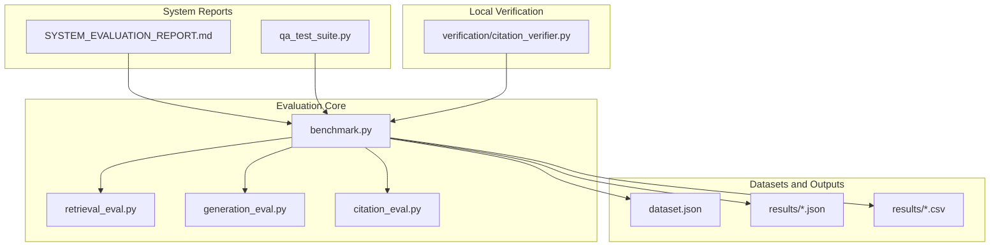
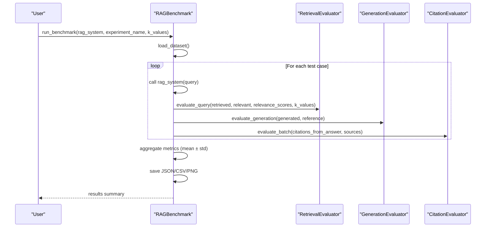
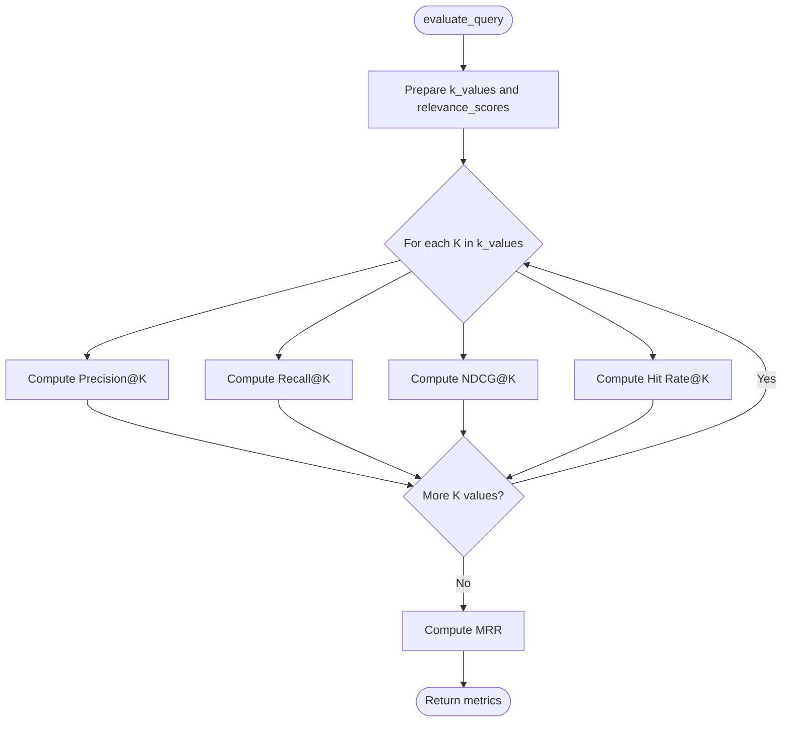
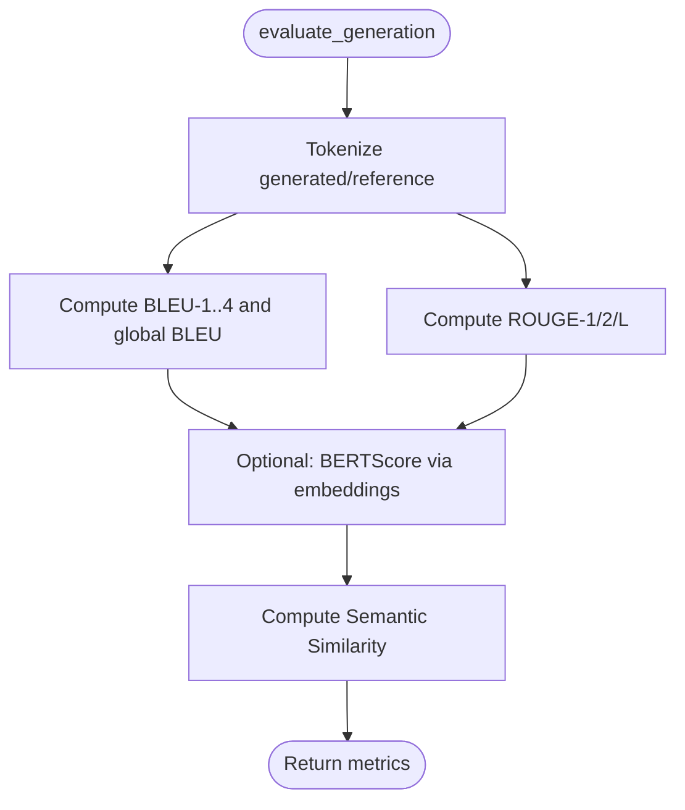
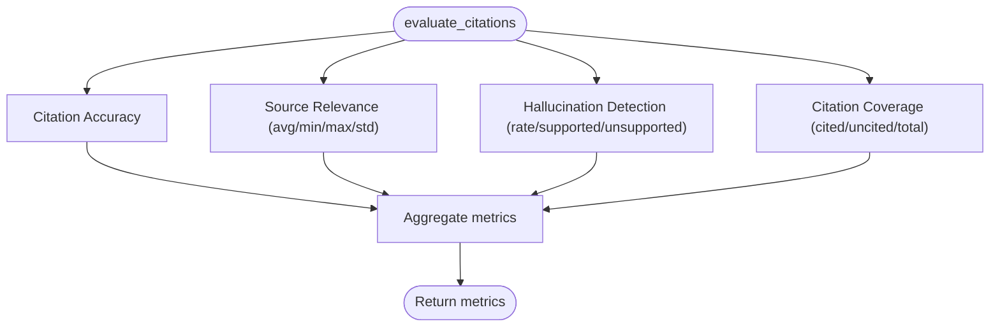
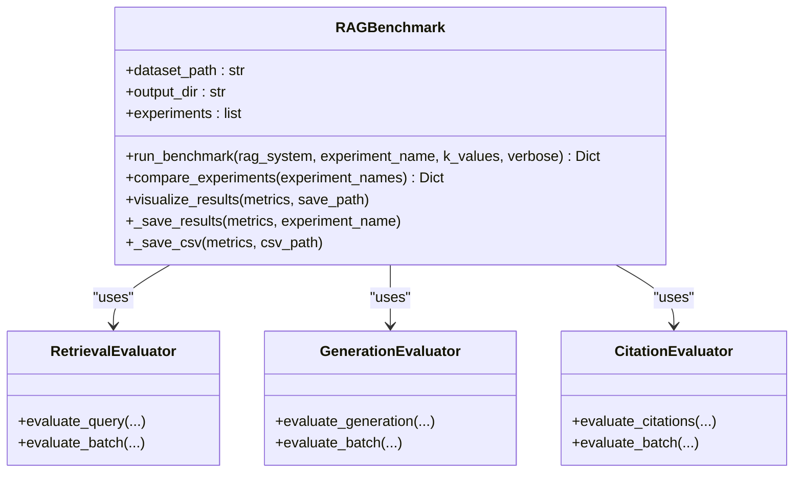
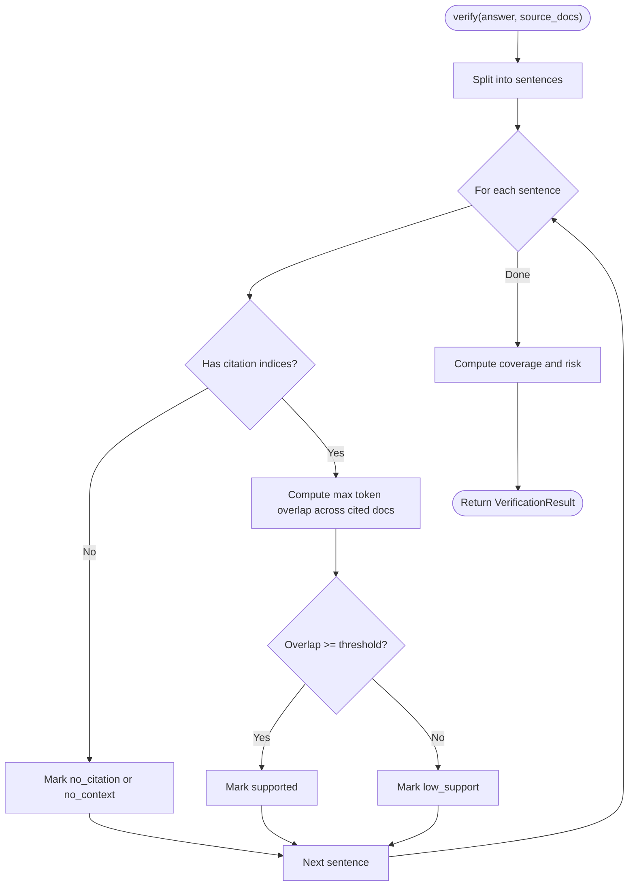
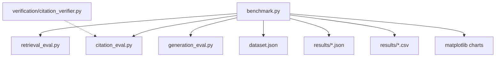

# Evaluation Framework

<cite>
**Referenced Files in This Document**
- [README.md](file://evaluation/README.md)
- [benchmark.py](file://evaluation/benchmark.py)
- [retrieval_eval.py](file://evaluation/retrieval_eval.py)
- [generation_eval.py](file://evaluation/generation_eval.py)
- [citation_eval.py](file://evaluation/citation_eval.py)
- [dataset.json](file://evaluation/dataset.json)
- [test_experiment_20260509_011607.json](file://evaluation/results/test_experiment_20260509_011607.json)
- [test_experiment_20260509_011607.csv](file://evaluation/results/test_experiment_20260509_011607.csv)
- [citation_verifier.py](file://verification/citation_verifier.py)
- [SYSTEM_EVALUATION_REPORT.md](file://SYSTEM_EVALUATION_REPORT.md)
- [qa_test_suite.py](file://evaluation/qa_test_suite.py)
</cite>

## Table of Contents
1. [Introduction](#introduction)
2. [Project Structure](#project-structure)
3. [Core Components](#core-components)
4. [Architecture Overview](#architecture-overview)
5. [Detailed Component Analysis](#detailed-component-analysis)
6. [Dependency Analysis](#dependency-analysis)
7. [Performance Considerations](#performance-considerations)
8. [Troubleshooting Guide](#troubleshooting-guide)
9. [Conclusion](#conclusion)
10. [Appendices](#appendices)

## Introduction
This document describes MinerAI’s comprehensive evaluation framework for quality assessment of its Retrieval-Augmented Generation (RAG) system. It covers methodology, test datasets, assessment criteria, citation evaluation, QA test suites, and system evaluation reports. It also provides examples for evaluating RAG performance, answer quality, and system reliability, along with metrics, statistical analysis, and continuous improvement processes.

## Project Structure
The evaluation system is organized into modular components that compute retrieval, generation, and citation metrics, orchestrate automated benchmarking, and produce standardized reports and visualizations.

**Diagram sources**
- [benchmark.py:27-62](file://evaluation/benchmark.py#L27-L62)
- [retrieval_eval.py:18-26](file://evaluation/retrieval_eval.py#L18-L26)
- [generation_eval.py:18-27](file://evaluation/generation_eval.py#L18-L27)
- [citation_eval.py:18-26](file://evaluation/citation_eval.py#L18-L26)
- [dataset.json:1-83](file://evaluation/dataset.json#L1-L83)
- [test_experiment_20260509_011607.json:1-106](file://evaluation/results/test_experiment_20260509_011607.json#L1-L106)
- [test_experiment_20260509_011607.csv:1-49](file://evaluation/results/test_experiment_20260509_011607.csv#L1-L49)
- [SYSTEM_EVALUATION_REPORT.md:1-93](file://SYSTEM_EVALUATION_REPORT.md#L1-L93)
- [qa_test_suite.py:1-10](file://evaluation/qa_test_suite.py#L1-L10)
- [citation_verifier.py:88-121](file://verification/citation_verifier.py#L88-L121)

**Section sources**
- [README.md:41-56](file://evaluation/README.md#L41-L56)
- [benchmark.py:32-62](file://evaluation/benchmark.py#L32-L62)

## Core Components
- RetrievalEvaluator: Computes Precision@K, Recall@K, NDCG@K, Hit Rate@K, and MRR for ranked retrieval lists.
- GenerationEvaluator: Computes BLEU (n-gram precision), ROUGE (recall-oriented overlaps), BERTScore, and Semantic Similarity.
- CitationEvaluator: Computes Citation Accuracy, Source Relevance, Hallucination Rate, and Citation Coverage.
- RAGBenchmark: Orchestrates end-to-end benchmarking, batching, experiment tracking, exporting, and visualization.
- Dataset: Structured JSON dataset with queries, references, relevant documents, relevance scores, and sources.
- Results: Standardized JSON and CSV exports with means and standard deviations; PNG visualizations.
- Local Citation Verifier: Lightweight local verification of sentence-level support without external API calls.
- QA Test Suite: Manual QA suite with PASS/FAIL/HALLUCINATION outcomes based on ground truth from domain documents.
- System Evaluation Report: High-level system report summarizing architecture, capabilities, strengths, weaknesses, and recommendations.

**Section sources**
- [retrieval_eval.py:18-224](file://evaluation/retrieval_eval.py#L18-L224)
- [generation_eval.py:18-342](file://evaluation/generation_eval.py#L18-L342)
- [citation_eval.py:18-341](file://evaluation/citation_eval.py#L18-L341)
- [benchmark.py:27-182](file://evaluation/benchmark.py#L27-L182)
- [dataset.json:1-83](file://evaluation/dataset.json#L1-L83)
- [test_experiment_20260509_011607.json:1-106](file://evaluation/results/test_experiment_20260509_011607.json#L1-L106)
- [test_experiment_20260509_011607.csv:1-49](file://evaluation/results/test_experiment_20260509_011607.csv#L1-L49)
- [citation_verifier.py:88-198](file://verification/citation_verifier.py#L88-L198)
- [qa_test_suite.py:1-10](file://evaluation/qa_test_suite.py#L1-L10)
- [SYSTEM_EVALUATION_REPORT.md:1-93](file://SYSTEM_EVALUATION_REPORT.md#L1-L93)

## Architecture Overview
The evaluation framework integrates three evaluation modules with a central benchmark orchestrator. The benchmark loads a dataset, runs a user-defined RAG system, computes all metrics, aggregates statistics, persists results, and visualizes outcomes.

**Diagram sources**
- [benchmark.py:76-182](file://evaluation/benchmark.py#L76-L182)
- [retrieval_eval.py:160-191](file://evaluation/retrieval_eval.py#L160-L191)
- [generation_eval.py:281-311](file://evaluation/generation_eval.py#L281-L311)
- [citation_eval.py:310-340](file://evaluation/citation_eval.py#L310-L340)

## Detailed Component Analysis

### Retrieval Metrics
RetrievalEvaluator computes:
- Precision@K: proportion of relevant documents among top-K results
- Recall@K: proportion of relevant documents retrieved in top-K
- NDCG@K: normalized discounted cumulative gain considering graded relevance
- Hit Rate@K: binary indicator if any relevant document appears in top-K
- MRR: mean reciprocal rank of the first relevant document

**Diagram sources**
- [retrieval_eval.py:160-191](file://evaluation/retrieval_eval.py#L160-L191)

**Section sources**
- [retrieval_eval.py:27-159](file://evaluation/retrieval_eval.py#L27-L159)
- [README.md:151-192](file://evaluation/README.md#L151-L192)

### Generation Metrics
GenerationEvaluator computes:
- BLEU: geometric mean of n-gram precisions with brevity penalty
- ROUGE-1/2/L: recall-oriented overlaps capturing unigram, bigram, and longest common subsequence
- BERTScore: semantic similarity via sentence embeddings
- Semantic Similarity: cosine similarity of sentence embeddings

**Diagram sources**
- [generation_eval.py:43-280](file://evaluation/generation_eval.py#L43-L280)

**Section sources**
- [generation_eval.py:43-280](file://evaluation/generation_eval.py#L43-L280)
- [README.md:193-228](file://evaluation/README.md#L193-L228)

### Citation Metrics
CitationEvaluator computes:
- Citation Accuracy: fraction of citations whose claims are supported by cited sources
- Source Relevance: average Jaccard similarity between query and source texts
- Hallucination Rate: fraction of sentences not supported by any source
- Citation Coverage: fraction of substantive sentences that include citations

**Diagram sources**
- [citation_eval.py:50-308](file://evaluation/citation_eval.py#L50-L308)

**Section sources**
- [citation_eval.py:50-308](file://evaluation/citation_eval.py#L50-L308)
- [README.md:229-262](file://evaluation/README.md#L229-L262)

### Benchmark Orchestration and Reporting
RAGBenchmark coordinates:
- Dataset loading and validation
- Iteration over test cases and calling the RAG system
- Aggregation of retrieval, generation, and citation metrics with standard deviations
- Export to JSON and CSV, and optional visualization

**Diagram sources**
- [benchmark.py:27-182](file://evaluation/benchmark.py#L27-L182)
- [retrieval_eval.py:160-224](file://evaluation/retrieval_eval.py#L160-L224)
- [generation_eval.py:281-342](file://evaluation/generation_eval.py#L281-L342)
- [citation_eval.py:310-341](file://evaluation/citation_eval.py#L310-L341)

**Section sources**
- [benchmark.py:76-182](file://evaluation/benchmark.py#L76-L182)
- [README.md:265-308](file://evaluation/README.md#L265-L308)

### Local Citation Verification
The local verifier performs sentence-level checks without external API calls:
- Splits answers into substantive sentences
- Extracts citation indices from bracketed markers
- Computes token overlap between sentence and cited document
- Flags “low_support” vs “no_citation”
- Computes citation coverage and hallucination risk

**Diagram sources**
- [citation_verifier.py:105-198](file://verification/citation_verifier.py#L105-L198)

**Section sources**
- [citation_verifier.py:88-198](file://verification/citation_verifier.py#L88-L198)

### QA Test Suite and System Evaluation Reports
- QA Test Suite: 30 questions derived from real domain documents; outcomes categorized as PASS, FAIL, or HALLUCINATION based on ground truth alignment and citation presence.
- System Evaluation Report: Comprehensive system-level report covering architecture, functional layers, technology stack, strengths, weaknesses, and recommendations.

**Section sources**
- [qa_test_suite.py:1-10](file://evaluation/qa_test_suite.py#L1-L10)
- [SYSTEM_EVALUATION_REPORT.md:1-93](file://SYSTEM_EVALUATION_REPORT.md#L1-L93)

## Dependency Analysis
The evaluation modules are cohesive and loosely coupled. RAGBenchmark depends on the three evaluators and the dataset, while outputs are persisted to JSON/CSV/PNG. Local verification complements the citation metrics by providing sentence-level checks.

**Diagram sources**
- [benchmark.py:22-51](file://evaluation/benchmark.py#L22-L51)
- [citation_verifier.py:88-121](file://verification/citation_verifier.py#L88-L121)

**Section sources**
- [benchmark.py:22-51](file://evaluation/benchmark.py#L22-L51)
- [citation_verifier.py:88-121](file://verification/citation_verifier.py#L88-L121)

## Performance Considerations
- Prefer batch evaluation for scalability across datasets.
- Use standard deviations to assess variability across queries.
- Tune K values to balance precision and recall depending on downstream needs.
- Optimize embedding models and caching to reduce latency during benchmarking.
- Visualizations aid quick comparisons across experiments.

[No sources needed since this section provides general guidance]

## Troubleshooting Guide
- Low Retrieval Metrics: improve embedding quality, adjust hybrid search weights, add reranking, expand corpus.
- Low Generation Metrics: refine prompts, upgrade model, increase context, tune generation parameters.
- High Hallucination Rate: enforce citation requirements, implement fact-checking, use cross-encoder reranking, filter low-relevance sources.
- Slow Benchmarking: reduce dataset size, enable batching, cache embeddings, optimize pipeline.

**Section sources**
- [README.md:467-496](file://evaluation/README.md#L467-L496)

## Conclusion
MinerAI’s evaluation framework provides a production-ready, modular, and extensible system for assessing RAG performance across retrieval, generation, and citation quality. It supports automated benchmarking, experiment tracking, statistical reporting, and visualization, enabling continuous improvement grounded in empirical evidence.

[No sources needed since this section summarizes without analyzing specific files]

## Appendices

### Evaluation Methodology and Criteria
- Dataset preparation: diverse queries, accurate ground truths, graded relevance scores, multiple relevant documents.
- Experiment tracking: descriptive names, multiple runs, configuration logging.
- Metric interpretation: thresholds for practical baselines; use domain-specific targets.
- Optimization focus: balance precision/recall, user-centric outcomes, and hallucination control.

**Section sources**
- [README.md:435-464](file://evaluation/README.md#L435-L464)

### Example: Evaluating RAG Performance, Answer Quality, and System Reliability
- RAG Performance: run benchmark with a RAG system returning answer, retrieved documents, and sources; collect retrieval, generation, and citation metrics.
- Answer Quality: leverage generation metrics (BLEU, ROUGE, BERTScore, Semantic Similarity) and citation coverage.
- System Reliability: monitor hallucination rates and source relevance; use local verification to flag low-support claims.

**Section sources**
- [benchmark.py:76-182](file://evaluation/benchmark.py#L76-L182)
- [generation_eval.py:281-311](file://evaluation/generation_eval.py#L281-L311)
- [citation_eval.py:271-308](file://evaluation/citation_eval.py#L271-L308)
- [citation_verifier.py:105-198](file://verification/citation_verifier.py#L105-L198)

### Statistical Analysis and Continuous Improvement
- Use means and standard deviations exported to CSV for significance analysis.
- Compare experiments via comparison tables and visualizations.
- Iterate improvements guided by metric trends and qualitative feedback.

**Section sources**
- [test_experiment_20260509_011607.json:1-106](file://evaluation/results/test_experiment_20260509_011607.json#L1-L106)
- [test_experiment_20260509_011607.csv:1-49](file://evaluation/results/test_experiment_20260509_011607.csv#L1-L49)
- [benchmark.py:300-365](file://evaluation/benchmark.py#L300-L365)