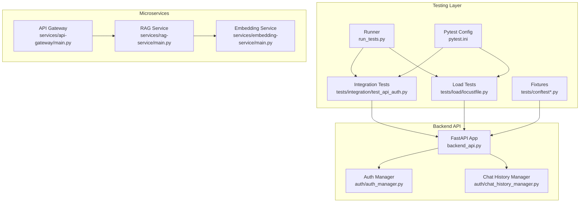
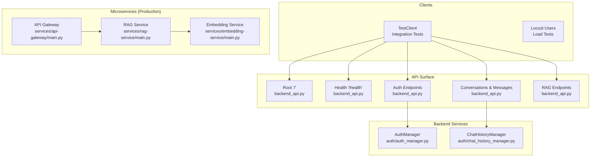
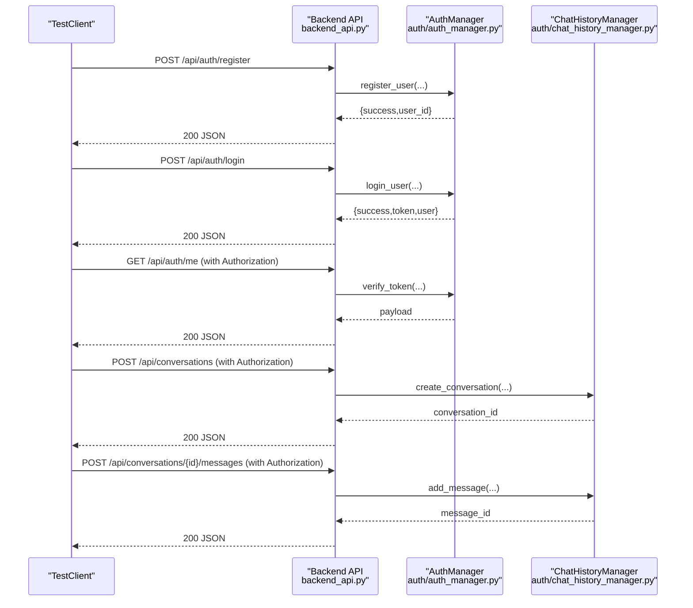
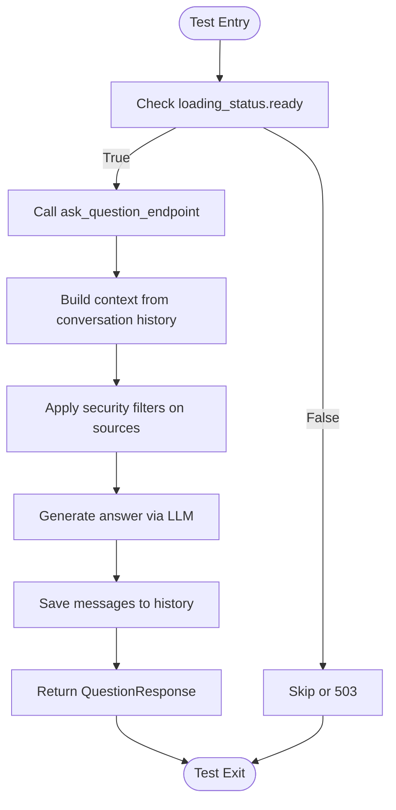
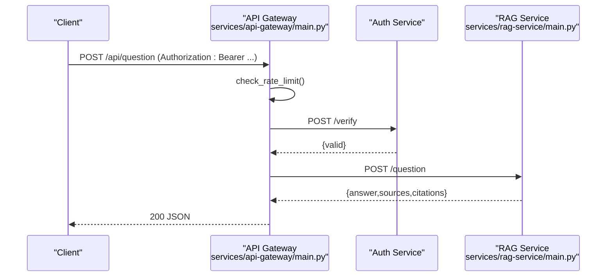
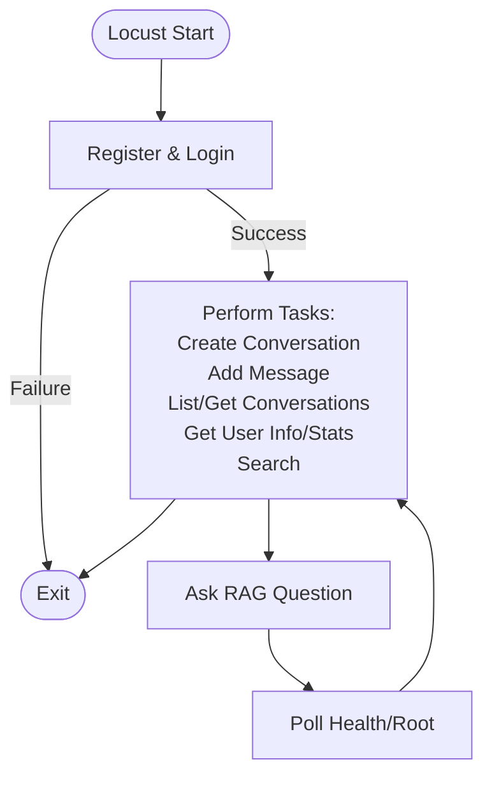
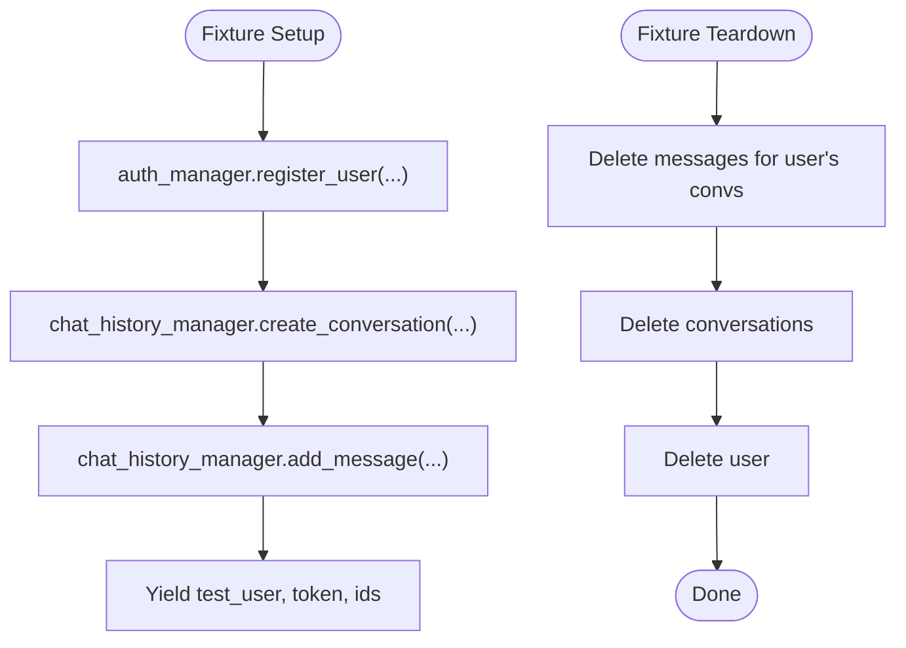
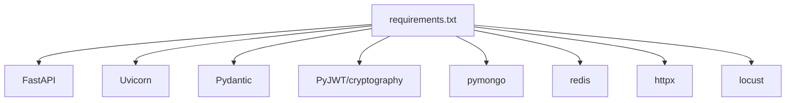

# Integration Testing

<cite>
**Referenced Files in This Document**
- [tests/integration/test_api_auth.py](file://tests/integration/test_api_auth.py)
- [tests/load/locustfile.py](file://tests/load/locustfile.py)
- [tests/conftest.py](file://tests/conftest.py)
- [tests/conftest_simple.py](file://tests/conftest_simple.py)
- [run_tests.py](file://run_tests.py)
- [pytest.ini](file://pytest.ini)
- [backend_api.py](file://backend_api.py)
- [auth/auth_manager.py](file://auth/auth_manager.py)
- [auth/chat_history_manager.py](file://auth/chat_history_manager.py)
- [services/api-gateway/main.py](file://services/api-gateway/main.py)
- [services/rag-service/main.py](file://services/rag-service/main.py)
- [services/embedding-service/main.py](file://services/embedding-service/main.py)
- [requirements.txt](file://requirements.txt)
</cite>

## Table of Contents
1. [Introduction](#introduction)
2. [Project Structure](#project-structure)
3. [Core Components](#core-components)
4. [Architecture Overview](#architecture-overview)
5. [Detailed Component Analysis](#detailed-component-analysis)
6. [Dependency Analysis](#dependency-analysis)
7. [Performance Considerations](#performance-considerations)
8. [Troubleshooting Guide](#troubleshooting-guide)
9. [Conclusion](#conclusion)
10. [Appendices](#appendices)

## Introduction
This document provides comprehensive integration testing guidance for MinerAI’s API endpoints and service interactions. It covers:
- Test setup with Pytest and FastAPI TestClient
- Authentication and authorization flows
- Database connectivity via MongoDB and JSON fallback
- Microservices communication (API Gateway, RAG Service, Embedding Service)
- End-to-end workflows and load testing with Locust
- Environment setup and test data management

The goal is to enable reliable, repeatable integration tests that validate real-world behavior across the backend API, authentication, chat history, and microservices.

## Project Structure
The integration testing surface spans:
- Integration tests under tests/integration
- Load tests under tests/load
- Shared fixtures under tests/
- Backend API entrypoint and routers
- Authentication and chat history managers
- Microservices (API Gateway, RAG Service, Embedding Service)
- Test runner script and pytest configuration

**Diagram sources**
- [tests/integration/test_api_auth.py:1-407](file://tests/integration/test_api_auth.py#L1-L407)
- [tests/load/locustfile.py:1-258](file://tests/load/locustfile.py#L1-L258)
- [tests/conftest.py:1-186](file://tests/conftest.py#L1-L186)
- [tests/conftest_simple.py:1-113](file://tests/conftest_simple.py#L1-L113)
- [run_tests.py:1-105](file://run_tests.py#L1-L105)
- [pytest.ini:1-48](file://pytest.ini#L1-L48)
- [backend_api.py:1-800](file://backend_api.py#L1-L800)
- [auth/auth_manager.py:1-393](file://auth/auth_manager.py#L1-L393)
- [auth/chat_history_manager.py:1-274](file://auth/chat_history_manager.py#L1-L274)
- [services/api-gateway/main.py:1-269](file://services/api-gateway/main.py#L1-L269)
- [services/rag-service/main.py:1-299](file://services/rag-service/main.py#L1-L299)
- [services/embedding-service/main.py:1-204](file://services/embedding-service/main.py#L1-L204)

**Section sources**
- [pytest.ini:1-48](file://pytest.ini#L1-L48)
- [run_tests.py:1-105](file://run_tests.py#L1-L105)

## Core Components
- Integration tests for authentication, conversations, and RAG endpoints
- Load tests with Locust simulating realistic user behavior
- Pytest fixtures managing test users, tokens, conversations, and cleanup
- Backend API exposing endpoints and health checks
- Authentication manager supporting MongoDB and JSON fallback
- Chat history manager for conversations and messages
- Microservices for API Gateway, RAG orchestration, and embeddings

Key capabilities validated by tests:
- Authentication lifecycle: register, login, token verification, change password
- Protected endpoints enforcement
- Conversation CRUD and retrieval
- RAG question answering with readiness checks
- Health and metrics endpoints
- Load simulation and failure reporting

**Section sources**
- [tests/integration/test_api_auth.py:13-407](file://tests/integration/test_api_auth.py#L13-L407)
- [tests/load/locustfile.py:15-258](file://tests/load/locustfile.py#L15-L258)
- [tests/conftest.py:19-186](file://tests/conftest.py#L19-L186)
- [backend_api.py:369-582](file://backend_api.py#L369-L582)
- [auth/auth_manager.py:58-393](file://auth/auth_manager.py#L58-L393)
- [auth/chat_history_manager.py:21-274](file://auth/chat_history_manager.py#L21-L274)
- [services/api-gateway/main.py:69-269](file://services/api-gateway/main.py#L69-L269)
- [services/rag-service/main.py:93-299](file://services/rag-service/main.py#L93-L299)
- [services/embedding-service/main.py:89-204](file://services/embedding-service/main.py#L89-L204)

## Architecture Overview
The integration tests exercise the following production-like architecture:
- Clients call the backend API directly during integration tests
- API Gateway proxies requests to microservices in production deployments
- RAG Service orchestrates retrieval, reranking, translation, and LLM calls
- Embedding Service generates and caches embeddings
- Authentication and chat history rely on MongoDB with JSON fallback

**Diagram sources**
- [backend_api.py:369-582](file://backend_api.py#L369-L582)
- [auth/auth_manager.py:58-393](file://auth/auth_manager.py#L58-L393)
- [auth/chat_history_manager.py:21-274](file://auth/chat_history_manager.py#L21-L274)
- [services/api-gateway/main.py:192-239](file://services/api-gateway/main.py#L192-L239)
- [services/rag-service/main.py:219-253](file://services/rag-service/main.py#L219-L253)
- [services/embedding-service/main.py:99-180](file://services/embedding-service/main.py#L99-L180)

## Detailed Component Analysis

### Integration Test Suite: Authentication and Conversations
This suite validates:
- Registration with duplicate detection
- Login and token issuance
- Protected resource access with proper headers
- Change password flow
- Conversation lifecycle: create, list, get by id, add messages, get messages, update title, delete, search, and user stats

**Diagram sources**
- [tests/integration/test_api_auth.py:16-101](file://tests/integration/test_api_auth.py#L16-L101)
- [tests/integration/test_api_auth.py:107-236](file://tests/integration/test_api_auth.py#L107-L236)
- [backend_api.py:369-582](file://backend_api.py#L369-L582)
- [auth/auth_manager.py:126-218](file://auth/auth_manager.py#L126-L218)
- [auth/chat_history_manager.py:38-111](file://auth/chat_history_manager.py#L38-L111)

**Section sources**
- [tests/integration/test_api_auth.py:13-236](file://tests/integration/test_api_auth.py#L13-L236)
- [tests/conftest.py:80-127](file://tests/conftest.py#L80-L127)

### RAG Endpoints and Health Checks
The RAG suite validates:
- Non-streaming question endpoint with readiness checks
- Streaming question endpoint with SSE framing
- Health and readiness checks for the backend
- Parameterized authentication enforcement for key endpoints

**Diagram sources**
- [tests/integration/test_api_auth.py:242-274](file://tests/integration/test_api_auth.py#L242-L274)
- [backend_api.py:447-504](file://backend_api.py#L447-L504)
- [backend_api.py:585-662](file://backend_api.py#L585-L662)

**Section sources**
- [tests/integration/test_api_auth.py:242-274](file://tests/integration/test_api_auth.py#L242-L274)
- [backend_api.py:408-425](file://backend_api.py#L408-L425)

### API Gateway Routing and Microservice Coordination
The API Gateway:
- Enforces rate limiting via Redis
- Verifies tokens by delegating to the auth service
- Proxies RAG endpoints to the RAG service
- Exposes health and metrics endpoints

**Diagram sources**
- [services/api-gateway/main.py:95-151](file://services/api-gateway/main.py#L95-L151)
- [services/api-gateway/main.py:192-206](file://services/api-gateway/main.py#L192-L206)
- [services/rag-service/main.py:219-228](file://services/rag-service/main.py#L219-L228)

**Section sources**
- [services/api-gateway/main.py:69-269](file://services/api-gateway/main.py#L69-L269)
- [services/rag-service/main.py:93-299](file://services/rag-service/main.py#L93-L299)

### Load Testing with Locust
The Locust suite simulates:
- Authenticated users registering and logging in, then performing conversation and RAG operations
- RAG users asking questions
- Health check users polling health endpoints
- Custom scenarios for quick smoke and stress tests

**Diagram sources**
- [tests/load/locustfile.py:20-150](file://tests/load/locustfile.py#L20-L150)
- [tests/load/locustfile.py:153-190](file://tests/load/locustfile.py#L153-L190)
- [tests/load/locustfile.py:220-258](file://tests/load/locustfile.py#L220-L258)

**Section sources**
- [tests/load/locustfile.py:1-258](file://tests/load/locustfile.py#L1-L258)

### Test Data Management and Cleanup
Shared fixtures manage:
- Test user creation and deletion
- Token generation and Authorization headers
- Conversation creation and message seeding
- Cleanup of test users, conversations, and messages across MongoDB and JSON storage modes

**Diagram sources**
- [tests/conftest.py:80-186](file://tests/conftest.py#L80-L186)
- [auth/auth_manager.py:126-172](file://auth/auth_manager.py#L126-L172)
- [auth/chat_history_manager.py:38-111](file://auth/chat_history_manager.py#L38-L111)

**Section sources**
- [tests/conftest.py:34-78](file://tests/conftest.py#L34-L78)
- [tests/conftest.py:80-186](file://tests/conftest.py#L80-L186)

## Dependency Analysis
External dependencies relevant to integration testing:
- FastAPI and Uvicorn for the API server
- Pydantic for request/response models
- JWT libraries for token handling
- MongoDB driver for persistence
- Redis client for caching and rate limiting
- httpx for inter-service HTTP calls
- Locust for load testing

**Diagram sources**
- [requirements.txt:1-43](file://requirements.txt#L1-L43)

**Section sources**
- [requirements.txt:1-43](file://requirements.txt#L1-L43)

## Performance Considerations
- RAG readiness: Tests skip or expect 503 when the pipeline is not ready
- Streaming responses: SSE framing ensures incremental delivery
- Rate limiting: API Gateway enforces per-IP limits; configure Redis accordingly
- Caching: Embedding and RAG services cache results to reduce latency
- Concurrency: Use Locust workers and appropriate wait times to simulate realistic loads

[No sources needed since this section provides general guidance]

## Troubleshooting Guide
Common issues and resolutions:
- MongoDB connectivity failures: AuthManager falls back to JSON storage; verify MONGODB_URI or run with local mode
- JWT secret unset: Set JWT_SECRET_KEY in environment; otherwise, tests may use an insecure default
- RAG pipeline not ready: Expect 503 in tests; ensure backend finishes loading before running tests
- Redis unavailability: API Gateway may fail health checks; ensure Redis is reachable
- Token verification failures: Ensure Authorization header format and valid token; API Gateway verifies tokens via the auth service

**Section sources**
- [auth/auth_manager.py:21-34](file://auth/auth_manager.py#L21-L34)
- [auth/auth_manager.py:62-87](file://auth/auth_manager.py#L62-L87)
- [backend_api.py:450-460](file://backend_api.py#L450-L460)
- [services/api-gateway/main.py:126-151](file://services/api-gateway/main.py#L126-L151)

## Conclusion
The integration testing framework comprehensively validates MinerAI’s authentication, conversation, and RAG workflows, while also exercising microservices communication and readiness. By leveraging Pytest fixtures, FastAPI TestClient, and Locust, teams can ensure robust end-to-end behavior across development and CI environments. Proper environment configuration and cleanup strategies guarantee repeatability and isolation of test artifacts.

[No sources needed since this section summarizes without analyzing specific files]

## Appendices

### Running Integration and Load Tests
- Use the test runner to execute unit, integration, and coverage reports
- Execute Locust with the provided host and locustfile

**Section sources**
- [run_tests.py:47-105](file://run_tests.py#L47-L105)
- [tests/load/locustfile.py:4-5](file://tests/load/locustfile.py#L4-L5)