# Performance & Benchmarking

<cite>
**Referenced Files in This Document**
- [benchmark.py](file://evaluation/benchmark.py)
- [retrieval_eval.py](file://evaluation/retrieval_eval.py)
- [generation_eval.py](file://evaluation/generation_eval.py)
- [citation_eval.py](file://evaluation/citation_eval.py)
- [locustfile.py](file://tests/load/locustfile.py)
- [performance_metrics.py](file://performance_metrics.py)
- [metrics_tracker.py](file://metrics_tracker.py)
- [monitoring.py](file://reliability/monitoring.py)
- [reranking_benchmark.py](file://reranking_benchmark.py)
- [chunking_benchmark.py](file://chunking_benchmark.py)
- [dataset.json](file://evaluation/dataset.json)
- [README.md](file://README.md)
- [SYSTEM_EVALUATION_REPORT.md](file://SYSTEM_EVALUATION_REPORT.md)
</cite>

## Table of Contents
1. [Introduction](#introduction)
2. [Project Structure](#project-structure)
3. [Core Components](#core-components)
4. [Architecture Overview](#architecture-overview)
5. [Detailed Component Analysis](#detailed-component-analysis)
6. [Dependency Analysis](#dependency-analysis)
7. [Performance Considerations](#performance-considerations)
8. [Troubleshooting Guide](#troubleshooting-guide)
9. [Conclusion](#conclusion)
10. [Appendices](#appendices)

## Introduction
This document provides a comprehensive guide to performance testing and benchmarking in MinerAI. It covers:
- Load testing with Locust
- System performance metrics collection and monitoring
- Evaluation methodologies for RAG pipelines
- Benchmarking tools and performance indicators
- Comparative analysis techniques
- Examples for testing retrieval efficiency and generation quality
- Performance monitoring, bottleneck identification, and optimization strategies

## Project Structure
MinerAI integrates dedicated modules for evaluation, load testing, and monitoring:
- evaluation: Automated benchmarking and metric computation for retrieval, generation, and citations
- tests/load: Locust-based load scenarios simulating authenticated users, RAG question flows, and health checks
- reliability: Production-grade monitoring, alerting, and request tracing
- performance_metrics and metrics_tracker: Lightweight runtime metrics tracking for sessions and queries
- reranking_benchmark and chunking_benchmark: Specialized benchmarks for cross-encoder reranking and chunking strategies

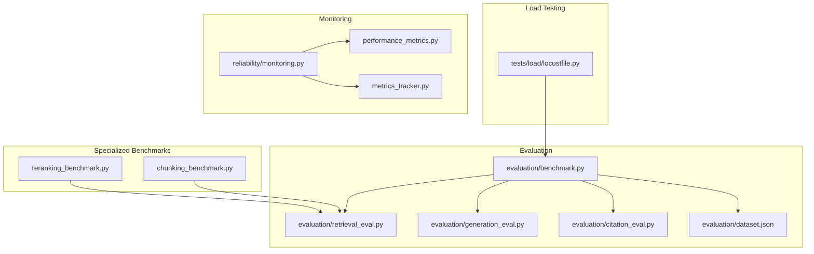

**Diagram sources**
- [benchmark.py:27-182](file://evaluation/benchmark.py#L27-L182)
- [retrieval_eval.py:18-223](file://evaluation/retrieval_eval.py#L18-L223)
- [generation_eval.py:18-341](file://evaluation/generation_eval.py#L18-L341)
- [citation_eval.py:18-340](file://evaluation/citation_eval.py#L18-L340)
- [locustfile.py:15-150](file://tests/load/locustfile.py#L15-L150)
- [monitoring.py:261-328](file://reliability/monitoring.py#L261-L328)
- [performance_metrics.py:35-380](file://performance_metrics.py#L35-L380)
- [metrics_tracker.py:8-95](file://metrics_tracker.py#L8-L95)
- [reranking_benchmark.py:18-89](file://reranking_benchmark.py#L18-L89)
- [chunking_benchmark.py:20-163](file://chunking_benchmark.py#L20-L163)

**Section sources**
- [benchmark.py:1-527](file://evaluation/benchmark.py#L1-L527)
- [locustfile.py:1-258](file://tests/load/locustfile.py#L1-L258)
- [monitoring.py:1-373](file://reliability/monitoring.py#L1-L373)
- [performance_metrics.py:1-424](file://performance_metrics.py#L1-L424)
- [metrics_tracker.py:1-158](file://metrics_tracker.py#L1-L158)
- [reranking_benchmark.py:1-335](file://reranking_benchmark.py#L1-L335)
- [chunking_benchmark.py:1-282](file://chunking_benchmark.py#L1-L282)
- [dataset.json:1-83](file://evaluation/dataset.json#L1-L83)
- [README.md:219-233](file://README.md#L219-L233)
- [SYSTEM_EVALUATION_REPORT.md:1-93](file://SYSTEM_EVALUATION_REPORT.md#L1-L93)

## Core Components
- RAGBenchmark: Orchestrates end-to-end benchmarking across retrieval, generation, and citation metrics; saves results and generates visualizations
- RetrievalEvaluator: Computes Precision@K, Recall@K, NDCG@K, MRR, Hit Rate@K
- GenerationEvaluator: Computes BLEU, ROUGE variants, BERTScore, and Semantic Similarity
- CitationEvaluator: Computes Citation Accuracy, Source Relevance, Hallucination Rate, and Citation Coverage
- Locust load scenarios: Authenticated user flows, RAG question flows, and health checks
- Reliability monitoring: Request tracing, metrics aggregation, alert thresholds, and dashboard
- Runtime metrics trackers: Session-based response time, cache metrics, API usage, and error tracking
- Specialized benchmarks: Cross-encoder reranking impact and chunking strategy comparisons

**Section sources**
- [benchmark.py:27-182](file://evaluation/benchmark.py#L27-L182)
- [retrieval_eval.py:18-223](file://evaluation/retrieval_eval.py#L18-L223)
- [generation_eval.py:18-341](file://evaluation/generation_eval.py#L18-L341)
- [citation_eval.py:18-340](file://evaluation/citation_eval.py#L18-L340)
- [locustfile.py:15-150](file://tests/load/locustfile.py#L15-L150)
- [monitoring.py:261-328](file://reliability/monitoring.py#L261-L328)
- [performance_metrics.py:35-380](file://performance_metrics.py#L35-L380)
- [metrics_tracker.py:8-95](file://metrics_tracker.py#L8-L95)
- [reranking_benchmark.py:18-89](file://reranking_benchmark.py#L18-L89)
- [chunking_benchmark.py:20-163](file://chunking_benchmark.py#L20-L163)

## Architecture Overview
The performance and benchmarking architecture integrates evaluation, load testing, and monitoring across the stack.

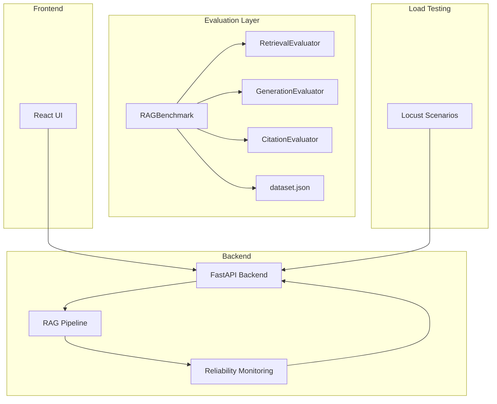

**Diagram sources**
- [benchmark.py:27-182](file://evaluation/benchmark.py#L27-L182)
- [retrieval_eval.py:18-223](file://evaluation/retrieval_eval.py#L18-L223)
- [generation_eval.py:18-341](file://evaluation/generation_eval.py#L18-L341)
- [citation_eval.py:18-340](file://evaluation/citation_eval.py#L18-L340)
- [dataset.json:1-83](file://evaluation/dataset.json#L1-L83)
- [locustfile.py:15-150](file://tests/load/locustfile.py#L15-L150)
- [monitoring.py:261-328](file://reliability/monitoring.py#L261-L328)

## Detailed Component Analysis

### RAG Benchmark System
RAGBenchmark coordinates automated benchmarking:
- Loads a structured dataset
- Executes a pluggable RAG system under test
- Aggregates retrieval, generation, and citation metrics
- Saves results to JSON/CSV and produces visualizations
- Supports experiment comparison and summary printing

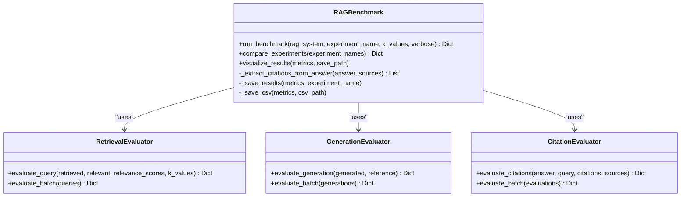

**Diagram sources**
- [benchmark.py:27-182](file://evaluation/benchmark.py#L27-L182)
- [retrieval_eval.py:160-223](file://evaluation/retrieval_eval.py#L160-L223)
- [generation_eval.py:281-341](file://evaluation/generation_eval.py#L281-L341)
- [citation_eval.py:271-340](file://evaluation/citation_eval.py#L271-L340)

**Section sources**
- [benchmark.py:76-182](file://evaluation/benchmark.py#L76-L182)
- [retrieval_eval.py:160-223](file://evaluation/retrieval_eval.py#L160-L223)
- [generation_eval.py:281-341](file://evaluation/generation_eval.py#L281-L341)
- [citation_eval.py:271-340](file://evaluation/citation_eval.py#L271-L340)
- [dataset.json:1-83](file://evaluation/dataset.json#L1-L83)

### Retrieval Metrics
RetrievalEvaluator computes:
- Precision@K, Recall@K, NDCG@K, Hit Rate@K, MRR
- Supports configurable K values and relevance scoring
- Provides batch evaluation with means and standard deviations

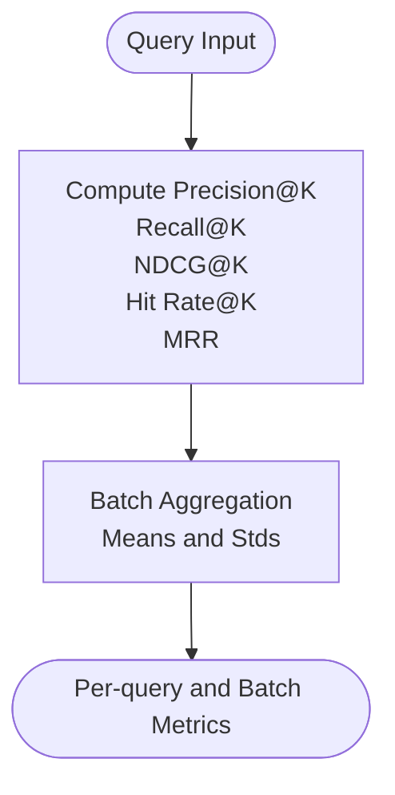

**Diagram sources**
- [retrieval_eval.py:27-191](file://evaluation/retrieval_eval.py#L27-L191)

**Section sources**
- [retrieval_eval.py:18-223](file://evaluation/retrieval_eval.py#L18-L223)

### Generation Metrics
GenerationEvaluator computes:
- BLEU (n-gram precision with brevity penalty)
- ROUGE-1/2/L (F1, precision, recall)
- BERTScore (semantic similarity via sentence-transformers)
- Semantic Similarity (cosine similarity fallback)

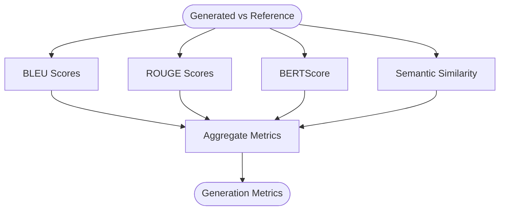

**Diagram sources**
- [generation_eval.py:43-311](file://evaluation/generation_eval.py#L43-L311)

**Section sources**
- [generation_eval.py:18-341](file://evaluation/generation_eval.py#L18-L341)

### Citation Metrics
CitationEvaluator computes:
- Citation Accuracy (claims supported by sources)
- Source Relevance (Jaccard similarity)
- Hallucination Rate (unsupported sentences)
- Citation Coverage (cited sentence ratio)

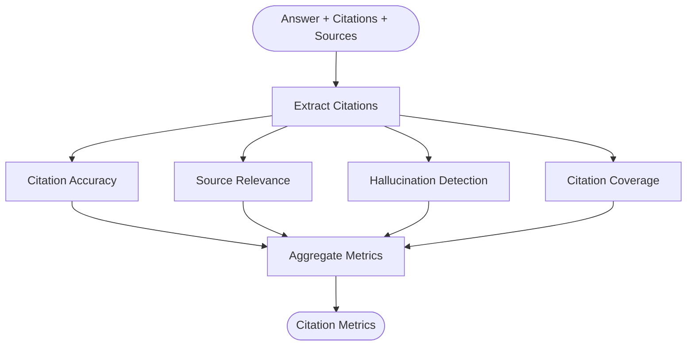

**Diagram sources**
- [citation_eval.py:50-308](file://evaluation/citation_eval.py#L50-L308)

**Section sources**
- [citation_eval.py:18-340](file://evaluation/citation_eval.py#L18-L340)

### Load Testing with Locust
Locust scenarios simulate realistic user behavior:
- AuthenticatedUser: registration, login, conversation CRUD, search, stats
- RAGUser: posting questions to the RAG endpoint
- HealthCheckUser: health and root endpoints
- Events: test start/stop hooks to print aggregated stats

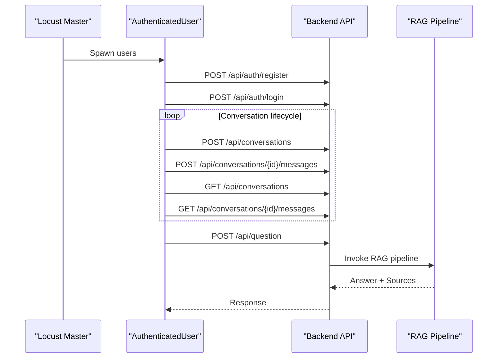

**Diagram sources**
- [locustfile.py:15-174](file://tests/load/locustfile.py#L15-L174)

**Section sources**
- [locustfile.py:15-258](file://tests/load/locustfile.py#L15-L258)

### Reliability Monitoring and Alerting
Reliability.monitoring provides:
- RequestTracer: start/end traces, slow request detection
- MetricsCollector: endpoint/service metrics, error counts, quota usage
- AlertManager: thresholds for error rate, slow requests, quota usage
- MonitoringSystem: dashboard with uptime, recent traces, active alerts

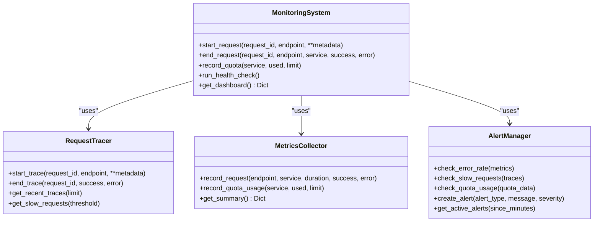

**Diagram sources**
- [monitoring.py:70-328](file://reliability/monitoring.py#L70-L328)

**Section sources**
- [monitoring.py:1-373](file://reliability/monitoring.py#L1-L373)

### Runtime Metrics Tracking
Two complementary trackers capture runtime metrics:
- PerformanceMetrics: persistent metrics with sessions, cache hit rate, API usage, error tracking
- MetricsTracker: lightweight session logs for queries, response times, citation metrics, and error logging

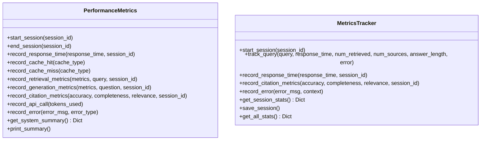

**Diagram sources**
- [performance_metrics.py:35-380](file://performance_metrics.py#L35-L380)
- [metrics_tracker.py:8-145](file://metrics_tracker.py#L8-L145)

**Section sources**
- [performance_metrics.py:1-424](file://performance_metrics.py#L1-L424)
- [metrics_tracker.py:1-158](file://metrics_tracker.py#L1-L158)

### Specialized Benchmarks

#### Cross-Encoder Reranking Impact
RerankingBenchmark evaluates:
- Top-K overlap before/after reranking
- Average relevance scores
- Score distribution statistics
- Threshold impact on pass rate and average score

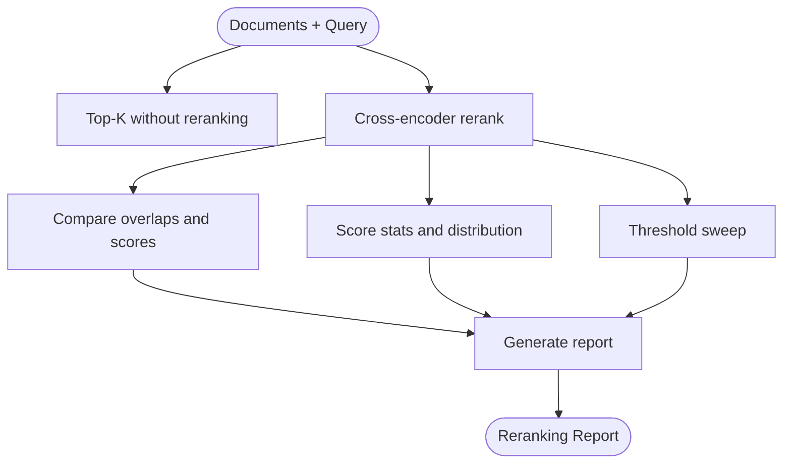

**Diagram sources**
- [reranking_benchmark.py:25-182](file://reranking_benchmark.py#L25-L182)

**Section sources**
- [reranking_benchmark.py:1-335](file://reranking_benchmark.py#L1-L335)

#### Chunking Strategy Benchmark
ChunkingBenchmark compares:
- Recursive character splitting vs semantic chunking
- Speed and throughput
- Quality metrics (length distribution, consistency)
- Boundary preservation (sentence endings)

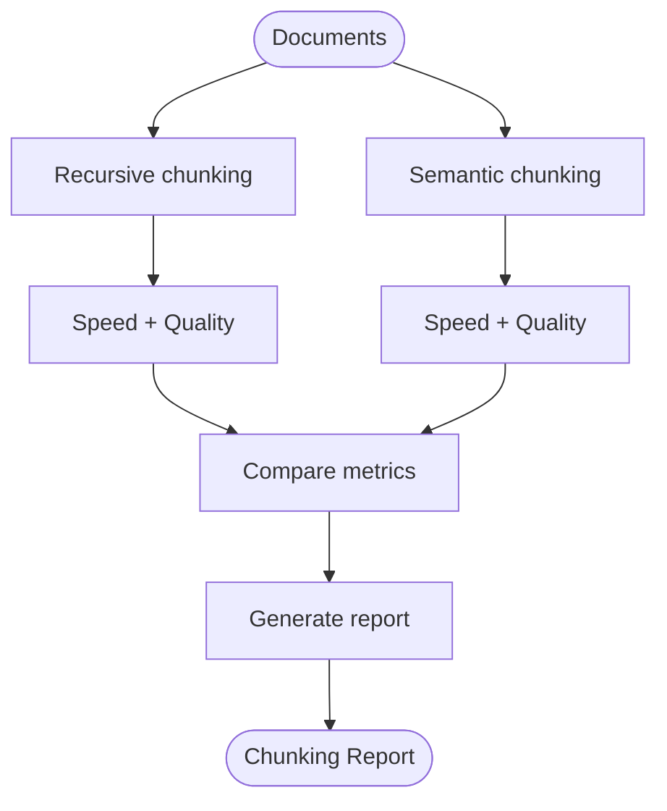

**Diagram sources**
- [chunking_benchmark.py:29-163](file://chunking_benchmark.py#L29-L163)

**Section sources**
- [chunking_benchmark.py:1-282](file://chunking_benchmark.py#L1-L282)

## Dependency Analysis
Key dependencies and relationships:
- RAGBenchmark depends on RetrievalEvaluator, GenerationEvaluator, and CitationEvaluator
- Locust scenarios depend on backend endpoints and authentication flows
- Reliability monitoring decorates endpoints to trace and collect metrics
- Runtime trackers integrate with frontend/backend to log session-level metrics

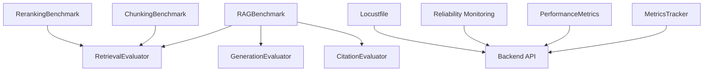

**Diagram sources**
- [benchmark.py:27-182](file://evaluation/benchmark.py#L27-L182)
- [retrieval_eval.py:18-223](file://evaluation/retrieval_eval.py#L18-L223)
- [generation_eval.py:18-341](file://evaluation/generation_eval.py#L18-L341)
- [citation_eval.py:18-340](file://evaluation/citation_eval.py#L18-L340)
- [locustfile.py:15-174](file://tests/load/locustfile.py#L15-L174)
- [monitoring.py:261-328](file://reliability/monitoring.py#L261-L328)
- [performance_metrics.py:35-380](file://performance_metrics.py#L35-L380)
- [metrics_tracker.py:8-95](file://metrics_tracker.py#L8-L95)
- [reranking_benchmark.py:18-89](file://reranking_benchmark.py#L18-L89)
- [chunking_benchmark.py:20-163](file://chunking_benchmark.py#L20-L163)

**Section sources**
- [benchmark.py:27-182](file://evaluation/benchmark.py#L27-L182)
- [locustfile.py:15-174](file://tests/load/locustfile.py#L15-L174)
- [monitoring.py:261-328](file://reliability/monitoring.py#L261-L328)
- [performance_metrics.py:35-380](file://performance_metrics.py#L35-L380)
- [metrics_tracker.py:8-95](file://metrics_tracker.py#L8-L95)
- [reranking_benchmark.py:18-89](file://reranking_benchmark.py#L18-L89)
- [chunking_benchmark.py:20-163](file://chunking_benchmark.py#L20-L163)

## Performance Considerations
- Response time expectations: backend indicates typical question/summary response times and memory footprint
- Monitoring: use Reliability.monitoring for production-grade tracing and alerting
- Metrics persistence: PerformanceMetrics persists metrics to disk for long-term analysis
- Load scenarios: Locust scenarios cover realistic user flows and health endpoints
- Specialized benchmarks: reranking and chunking benchmarks inform tuning decisions

**Section sources**
- [README.md:219-233](file://README.md#L219-L233)
- [monitoring.py:261-328](file://reliability/monitoring.py#L261-L328)
- [performance_metrics.py:64-87](file://performance_metrics.py#L64-L87)
- [locustfile.py:192-217](file://tests/load/locustfile.py#L192-L217)

## Troubleshooting Guide
Common issues and resolutions:
- Low retrieval metrics: improve embedding quality, tune hybrid search weights, add reranking, expand corpus
- Low generation metrics: refine prompts, use better LLM, provide more context, fine-tune generation parameters
- High hallucination rate: enforce citations, implement fact-checking, use cross-encoder reranking, filter low-relevance sources
- Slow benchmarking: reduce dataset size, use batch processing, cache embeddings, optimize pipeline

**Section sources**
- [evaluation/README.md:467-496](file://evaluation/README.md#L467-L496)

## Conclusion
MinerAI provides a robust framework for performance testing and benchmarking:
- Automated evaluation across retrieval, generation, and citation quality
- Realistic load testing with Locust
- Production-grade monitoring and alerting
- Specialized benchmarks for reranking and chunking
- Persistent metrics tracking for continuous improvement

Adopt these tools to identify bottlenecks, validate improvements, and maintain high-quality RAG performance.

## Appendices

### Performance Indicators and Metrics
- Retrieval: Precision@K, Recall@K, NDCG@K, MRR, Hit Rate@K
- Generation: BLEU, ROUGE variants, BERTScore, Semantic Similarity
- Citation: Accuracy, Relevance, Hallucination Rate, Coverage
- System: Response time, cache hit rate, API usage, error rates, quota usage

**Section sources**
- [retrieval_eval.py:18-223](file://evaluation/retrieval_eval.py#L18-L223)
- [generation_eval.py:18-341](file://evaluation/generation_eval.py#L18-L341)
- [citation_eval.py:18-340](file://evaluation/citation_eval.py#L18-L340)
- [performance_metrics.py:35-380](file://performance_metrics.py#L35-L380)
- [monitoring.py:112-180](file://reliability/monitoring.py#L112-L180)

### Comparative Analysis Techniques
- Experiment tracking and comparison across runs
- Visualization of retrieval, generation, and citation metrics
- Statistical reporting with means and standard deviations
- Threshold sweeps for reranking and chunking strategies

**Section sources**
- [benchmark.py:300-365](file://evaluation/benchmark.py#L300-L365)
- [reranking_benchmark.py:141-182](file://reranking_benchmark.py#L141-L182)
- [chunking_benchmark.py:128-163](file://chunking_benchmark.py#L128-L163)