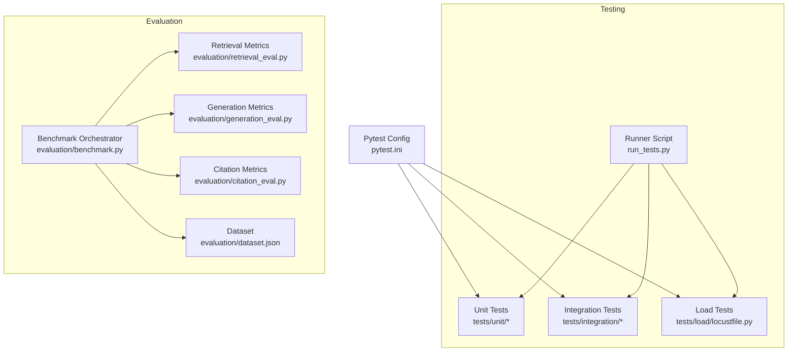
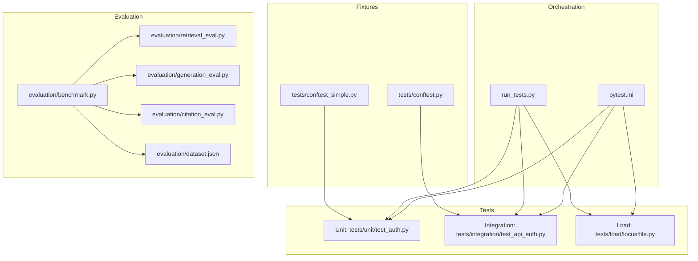
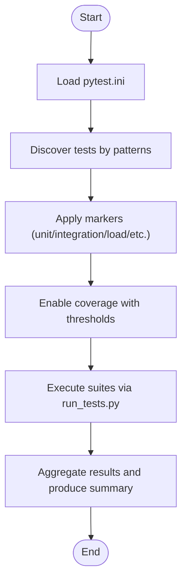
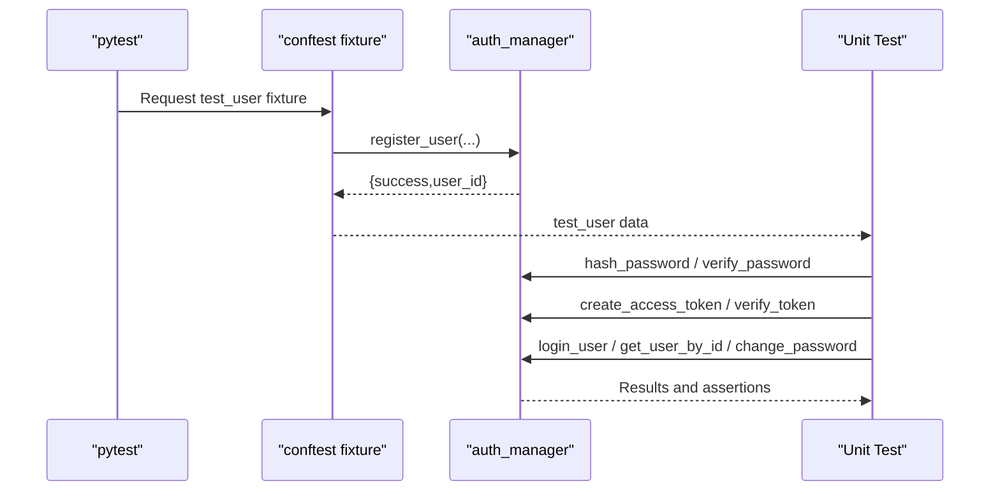
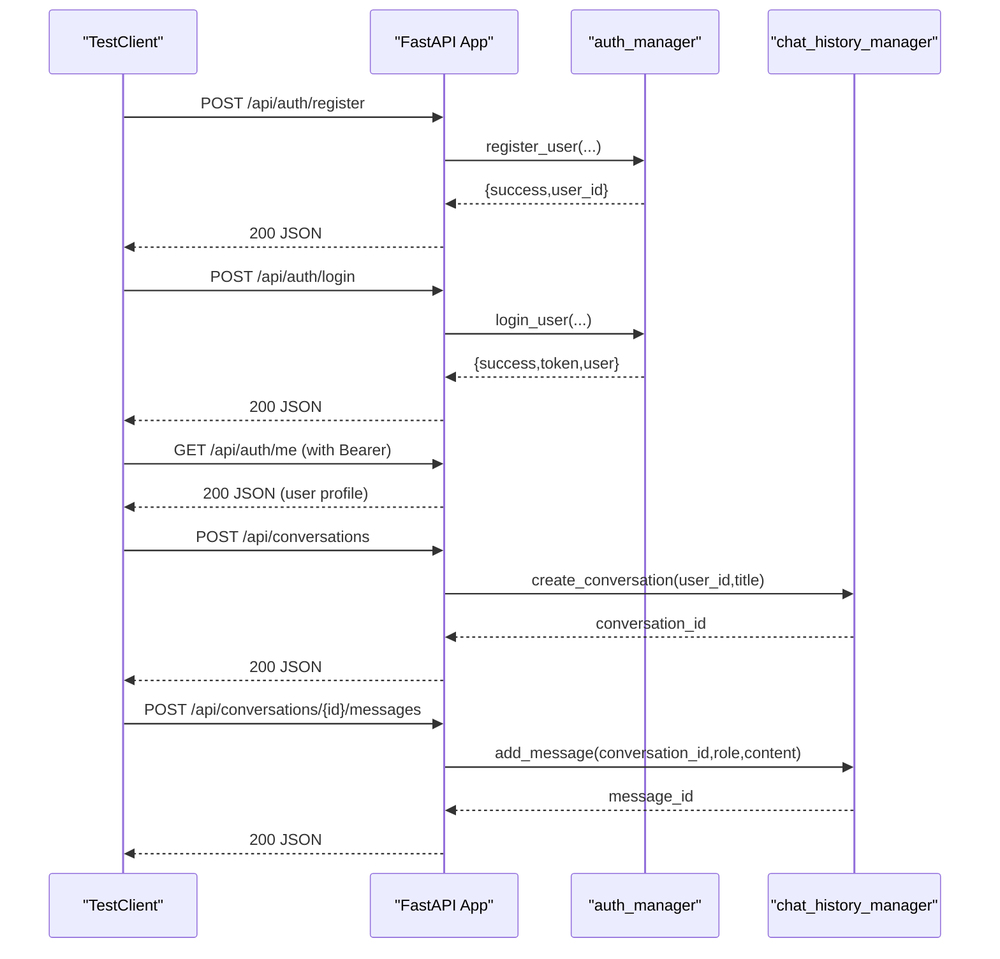
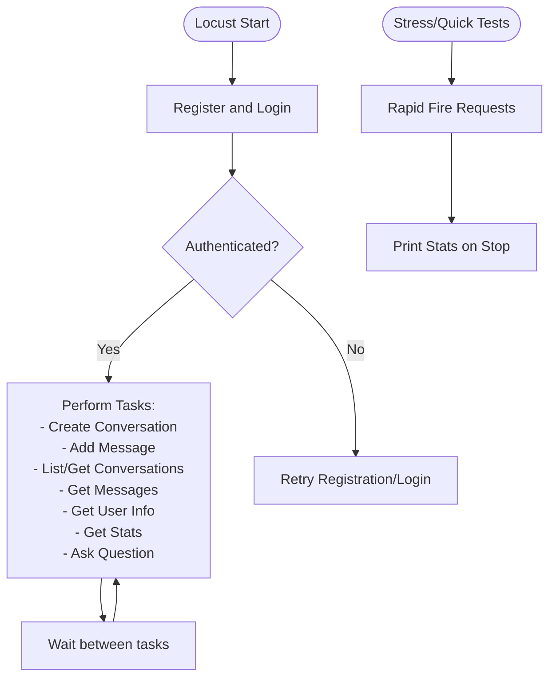
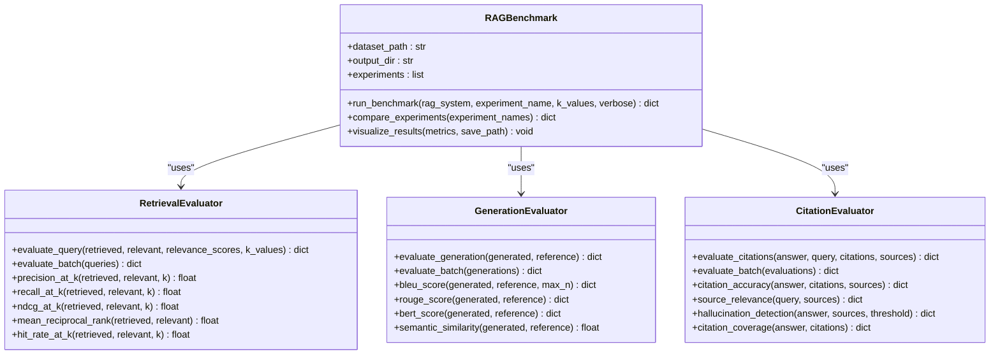
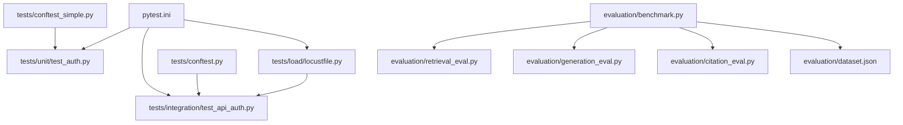

# Testing & Quality Assurance

<cite>
**Referenced Files in This Document**
- [pytest.ini](file://pytest.ini)
- [run_tests.py](file://run_tests.py)
- [tests/conftest.py](file://tests/conftest.py)
- [tests/conftest_simple.py](file://tests/conftest_simple.py)
- [tests/unit/test_auth.py](file://tests/unit/test_auth.py)
- [tests/integration/test_api_auth.py](file://tests/integration/test_api_auth.py)
- [tests/load/locustfile.py](file://tests/load/locustfile.py)
- [evaluation/benchmark.py](file://evaluation/benchmark.py)
- [evaluation/retrieval_eval.py](file://evaluation/retrieval_eval.py)
- [evaluation/generation_eval.py](file://evaluation/generation_eval.py)
- [evaluation/citation_eval.py](file://evaluation/citation_eval.py)
- [evaluation/dataset.json](file://evaluation/dataset.json)
- [evaluation/qa_test_suite.py](file://evaluation/qa_test_suite.py)
</cite>

## Table of Contents
1. [Introduction](#introduction)
2. [Project Structure](#project-structure)
3. [Core Components](#core-components)
4. [Architecture Overview](#architecture-overview)
5. [Detailed Component Analysis](#detailed-component-analysis)
6. [Dependency Analysis](#dependency-analysis)
7. [Performance Considerations](#performance-considerations)
8. [Troubleshooting Guide](#troubleshooting-guide)
9. [Conclusion](#conclusion)
10. [Appendices](#appendices)

## Introduction
This document describes the testing and quality assurance framework for MinerAI. It covers the testing framework setup, unit and integration testing strategies, performance benchmarking, evaluation methodology, system performance metrics, continuous improvement processes, best practices, mock implementations, quality gates, automated workflows, code coverage requirements, and testing tools configuration. The goal is to provide a practical guide for maintaining high-quality standards across development iterations.

## Project Structure
MinerAI organizes tests and quality tools under dedicated directories:
- Unit and integration tests live under tests/, with fixtures configured via conftest.py and conftest_simple.py.
- A comprehensive test runner script orchestrates suites and coverage reporting.
- Performance and evaluation capabilities reside under evaluation/, including benchmarking, retrieval, generation, and citation metrics, plus a structured dataset for evaluation.

**Diagram sources**
- [pytest.ini:1-48](file://pytest.ini#L1-L48)
- [run_tests.py:1-105](file://run_tests.py#L1-L105)
- [tests/conftest.py:1-186](file://tests/conftest.py#L1-L186)
- [tests/conftest_simple.py:1-113](file://tests/conftest_simple.py#L1-L113)
- [tests/load/locustfile.py:1-258](file://tests/load/locustfile.py#L1-L258)
- [evaluation/benchmark.py:1-527](file://evaluation/benchmark.py#L1-L527)
- [evaluation/retrieval_eval.py:1-309](file://evaluation/retrieval_eval.py#L1-L309)
- [evaluation/generation_eval.py:1-418](file://evaluation/generation_eval.py#L1-L418)
- [evaluation/citation_eval.py:1-421](file://evaluation/citation_eval.py#L1-L421)
- [evaluation/dataset.json:1-83](file://evaluation/dataset.json#L1-L83)

**Section sources**
- [pytest.ini:1-48](file://pytest.ini#L1-L48)
- [run_tests.py:1-105](file://run_tests.py#L1-L105)

## Core Components
- Pytest configuration defines test discovery, markers, coverage thresholds, timeouts, and warnings filtering.
- Test fixtures provide reusable setup for FastAPI clients, user registration/login, MongoDB cleanup, and conversation/message scaffolding.
- Unit tests validate authentication logic, JWT handling, password hashing, and user operations.
- Integration tests validate API endpoints, authentication flows, conversation/message CRUD, and health checks.
- Load tests simulate realistic user behavior using Locust to measure throughput and latency.
- Evaluation suite provides a complete benchmarking system with retrieval, generation, and citation metrics, driven by a structured dataset.

**Section sources**
- [pytest.ini:1-48](file://pytest.ini#L1-L48)
- [tests/conftest.py:19-186](file://tests/conftest.py#L19-L186)
- [tests/conftest_simple.py:19-113](file://tests/conftest_simple.py#L19-L113)
- [tests/unit/test_auth.py:1-258](file://tests/unit/test_auth.py#L1-L258)
- [tests/integration/test_api_auth.py:1-407](file://tests/integration/test_api_auth.py#L1-L407)
- [tests/load/locustfile.py:1-258](file://tests/load/locustfile.py#L1-L258)
- [evaluation/benchmark.py:27-182](file://evaluation/benchmark.py#L27-L182)
- [evaluation/dataset.json:1-83](file://evaluation/dataset.json#L1-L83)

## Architecture Overview
The QA architecture integrates multiple layers:
- Test orchestration via pytest and a custom runner.
- Fixtures manage environment setup and teardown for database and authentication.
- API tests validate end-to-end flows and error handling.
- Load tests stress endpoints and simulate concurrent users.
- Evaluation metrics compute retrieval, generation, and citation quality.

**Diagram sources**
- [pytest.ini:1-48](file://pytest.ini#L1-L48)
- [run_tests.py:47-105](file://run_tests.py#L47-L105)
- [tests/conftest.py:19-186](file://tests/conftest.py#L19-L186)
- [tests/conftest_simple.py:19-113](file://tests/conftest_simple.py#L19-L113)
- [tests/unit/test_auth.py:1-258](file://tests/unit/test_auth.py#L1-L258)
- [tests/integration/test_api_auth.py:1-407](file://tests/integration/test_api_auth.py#L1-L407)
- [tests/load/locustfile.py:1-258](file://tests/load/locustfile.py#L1-L258)
- [evaluation/benchmark.py:27-182](file://evaluation/benchmark.py#L27-L182)
- [evaluation/retrieval_eval.py:18-224](file://evaluation/retrieval_eval.py#L18-L224)
- [evaluation/generation_eval.py:18-342](file://evaluation/generation_eval.py#L18-L342)
- [evaluation/citation_eval.py:18-341](file://evaluation/citation_eval.py#L18-L341)
- [evaluation/dataset.json:1-83](file://evaluation/dataset.json#L1-L83)

## Detailed Component Analysis

### Pytest Configuration and Test Runner
- Discovery and markers define unit, integration, E2E, load, and domain-specific categories.
- Coverage thresholds enforce minimum coverage percentages and generate HTML, terminal-missing, and XML reports.
- Timeout and warning filters improve stability and readability during runs.
- The runner script aggregates unit, integration, and coverage steps, printing a consolidated summary.

**Diagram sources**
- [pytest.ini:1-48](file://pytest.ini#L1-L48)
- [run_tests.py:47-105](file://run_tests.py#L47-L105)

**Section sources**
- [pytest.ini:1-48](file://pytest.ini#L1-L48)
- [run_tests.py:19-105](file://run_tests.py#L19-L105)

### Authentication Unit Tests
- Password hashing and verification, JWT creation and expiration handling, and user registration with duplicate checks.
- User operations including retrieval by ID and password change validations.

**Diagram sources**
- [tests/conftest.py:34-110](file://tests/conftest.py#L34-L110)
- [tests/unit/test_auth.py:16-258](file://tests/unit/test_auth.py#L16-L258)

**Section sources**
- [tests/unit/test_auth.py:16-258](file://tests/unit/test_auth.py#L16-L258)
- [tests/conftest.py:34-110](file://tests/conftest.py#L34-L110)

### API Integration Tests
- End-to-end validation of authentication, conversation/message CRUD, stats, and health endpoints.
- Authorization flows and error handling for malformed payloads and missing fields.
- Parameterized tests for endpoint authentication requirements.

**Diagram sources**
- [tests/integration/test_api_auth.py:16-237](file://tests/integration/test_api_auth.py#L16-L237)
- [tests/conftest.py:19-186](file://tests/conftest.py#L19-L186)

**Section sources**
- [tests/integration/test_api_auth.py:13-407](file://tests/integration/test_api_auth.py#L13-L407)
- [tests/conftest.py:19-186](file://tests/conftest.py#L19-L186)

### Load Testing with Locust
- Simulates authenticated users performing typical actions: creating conversations, adding messages, listing/getting conversations/messages, retrieving user info and stats, and asking RAG questions.
- Provides event listeners to print aggregated statistics at the end of a run.

**Diagram sources**
- [tests/load/locustfile.py:15-258](file://tests/load/locustfile.py#L15-L258)

**Section sources**
- [tests/load/locustfile.py:15-258](file://tests/load/locustfile.py#L15-L258)

### Evaluation and Benchmarking System
- RAGBenchmark orchestrates end-to-end evaluation across retrieval, generation, and citation metrics using a dataset of queries and references.
- RetrievalEvaluator computes Precision@K, Recall@K, NDCG@K, MRR, and Hit Rate.
- GenerationEvaluator computes BLEU, ROUGE, BERTScore, and semantic similarity.
- CitationEvaluator computes citation accuracy, source relevance, hallucination rate, and citation coverage.
- Results are saved to JSON and CSV, with optional visualization.

**Diagram sources**
- [evaluation/benchmark.py:27-182](file://evaluation/benchmark.py#L27-L182)
- [evaluation/retrieval_eval.py:18-224](file://evaluation/retrieval_eval.py#L18-L224)
- [evaluation/generation_eval.py:18-342](file://evaluation/generation_eval.py#L18-L342)
- [evaluation/citation_eval.py:18-341](file://evaluation/citation_eval.py#L18-L341)

**Section sources**
- [evaluation/benchmark.py:27-182](file://evaluation/benchmark.py#L27-L182)
- [evaluation/retrieval_eval.py:18-224](file://evaluation/retrieval_eval.py#L18-L224)
- [evaluation/generation_eval.py:18-342](file://evaluation/generation_eval.py#L18-L342)
- [evaluation/citation_eval.py:18-341](file://evaluation/citation_eval.py#L18-L341)
- [evaluation/dataset.json:1-83](file://evaluation/dataset.json#L1-L83)

### QA Test Suite Overview
- A dedicated QA test suite outlines expectations for manual verification against real-world documents, categorizing outcomes as PASS, FAIL, or HALLUCINATION.

**Section sources**
- [evaluation/qa_test_suite.py:1-10](file://evaluation/qa_test_suite.py#L1-L10)

## Dependency Analysis
- Test configuration depends on pytest markers and coverage settings.
- Integration tests depend on FastAPI TestClient and shared fixtures for authentication and chat history.
- Load tests depend on Locust and Faker for synthetic traffic.
- Evaluation components depend on NumPy and optional visualization libraries.

**Diagram sources**
- [pytest.ini:1-48](file://pytest.ini#L1-L48)
- [tests/conftest.py:19-186](file://tests/conftest.py#L19-L186)
- [tests/conftest_simple.py:19-113](file://tests/conftest_simple.py#L19-L113)
- [tests/integration/test_api_auth.py:1-407](file://tests/integration/test_api_auth.py#L1-L407)
- [tests/load/locustfile.py:1-258](file://tests/load/locustfile.py#L1-L258)
- [evaluation/benchmark.py:27-182](file://evaluation/benchmark.py#L27-L182)
- [evaluation/retrieval_eval.py:18-224](file://evaluation/retrieval_eval.py#L18-L224)
- [evaluation/generation_eval.py:18-342](file://evaluation/generation_eval.py#L18-L342)
- [evaluation/citation_eval.py:18-341](file://evaluation/citation_eval.py#L18-L341)
- [evaluation/dataset.json:1-83](file://evaluation/dataset.json#L1-L83)

**Section sources**
- [pytest.ini:1-48](file://pytest.ini#L1-L48)
- [tests/conftest.py:19-186](file://tests/conftest.py#L19-L186)
- [tests/conftest_simple.py:19-113](file://tests/conftest_simple.py#L19-L113)
- [tests/integration/test_api_auth.py:1-407](file://tests/integration/test_api_auth.py#L1-L407)
- [tests/load/locustfile.py:1-258](file://tests/load/locustfile.py#L1-L258)
- [evaluation/benchmark.py:27-182](file://evaluation/benchmark.py#L27-L182)
- [evaluation/retrieval_eval.py:18-224](file://evaluation/retrieval_eval.py#L18-L224)
- [evaluation/generation_eval.py:18-342](file://evaluation/generation_eval.py#L18-L342)
- [evaluation/citation_eval.py:18-341](file://evaluation/citation_eval.py#L18-L341)
- [evaluation/dataset.json:1-83](file://evaluation/dataset.json#L1-L83)

## Performance Considerations
- Use retrieval K values (e.g., 1, 3, 5) to balance precision/recall trade-offs.
- Track execution time and dataset size for reproducibility across experiments.
- Visualizations help identify regressions and highlight weak metrics.
- Load tests inform capacity planning and failure rate monitoring.

[No sources needed since this section provides general guidance]

## Troubleshooting Guide
- Coverage failures: Ensure coverage thresholds are met and reports are generated; review missing branches and lines.
- Fixture cleanup: Database cleanup fixtures remove test users, conversations, and messages; verify cleanup logic if tests leave artifacts.
- Slow tests: Use the slow marker to isolate long-running tests; adjust timeouts accordingly.
- Evaluation errors: Confirm dataset availability and metric dependencies; visualization requires Matplotlib.

**Section sources**
- [pytest.ini:12-22](file://pytest.ini#L12-L22)
- [tests/conftest.py:34-78](file://tests/conftest.py#L34-L78)
- [evaluation/benchmark.py:63-75](file://evaluation/benchmark.py#L63-L75)

## Conclusion
MinerAI’s QA framework combines robust unit and integration tests, comprehensive evaluation metrics, and load testing to ensure reliability and performance. The pytest configuration enforces quality gates, while the evaluation suite provides deep insights into retrieval, generation, and citation quality. Automated workflows streamline test execution and reporting, supporting continuous improvement.

[No sources needed since this section summarizes without analyzing specific files]

## Appendices

### Testing Best Practices
- Prefer small, focused unit tests with deterministic fixtures.
- Use parameterized tests for boundary conditions and error paths.
- Keep integration tests close to production behavior; avoid external service flakiness by mocking when appropriate.
- Maintain a stable dataset for evaluation to enable fair comparisons across versions.

[No sources needed since this section provides general guidance]

### Quality Gates and Coverage Targets
- Unit tests: Target 90%+ coverage for critical modules.
- Integration tests: Cover end-to-end flows and error handling.
- Overall coverage: Enforced via pytest configuration with minimum thresholds and XML/HTML reports.

**Section sources**
- [pytest.ini:12-22](file://pytest.ini#L12-L22)
- [tests/unit/test_auth.py:4-5](file://tests/unit/test_auth.py#L4-L5)

### Automated Testing Workflows
- Use the runner script to execute unit, integration, and coverage steps in sequence.
- Configure CI to run pytest with coverage and enforce minimum thresholds.

**Section sources**
- [run_tests.py:47-105](file://run_tests.py#L47-L105)
- [pytest.ini:12-22](file://pytest.ini#L12-L22)

### Mock Implementations
- For evaluation, use a mock RAG system to validate benchmarking pipelines without requiring a full backend.
- For load tests, simulate user actions with Faker-generated data to avoid reliance on persistent accounts.

**Section sources**
- [evaluation/benchmark.py:491-527](file://evaluation/benchmark.py#L491-L527)
- [tests/load/locustfile.py:20-49](file://tests/load/locustfile.py#L20-L49)