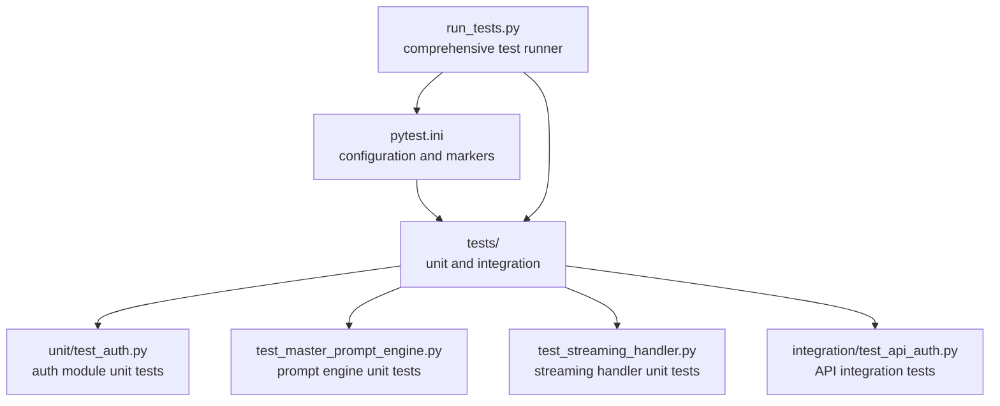
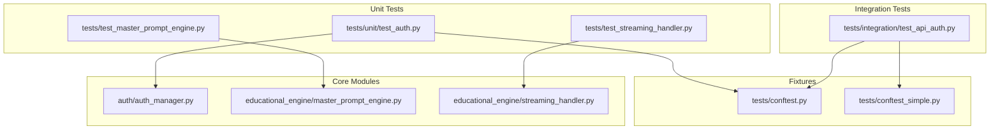
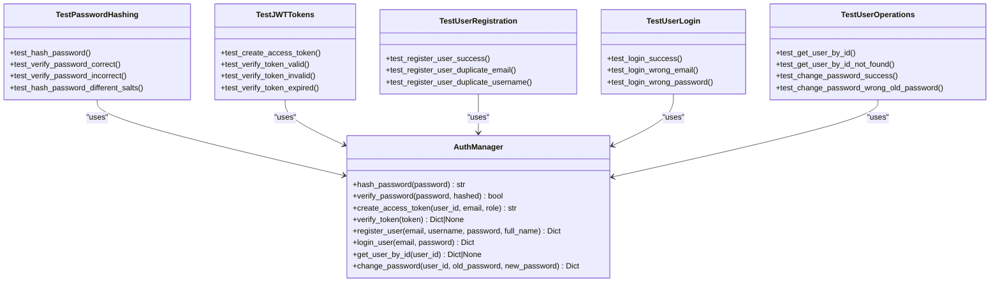
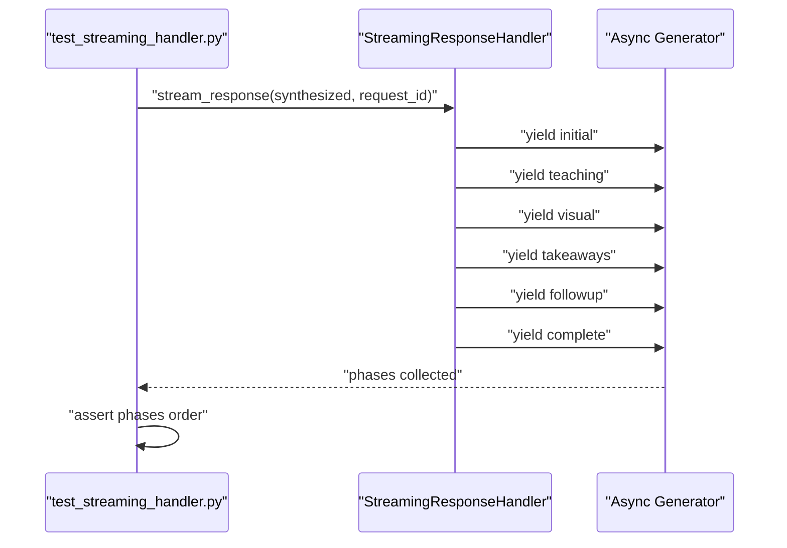
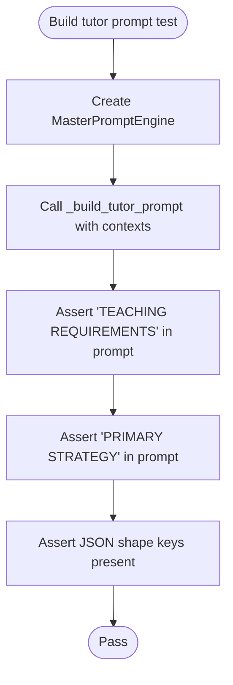
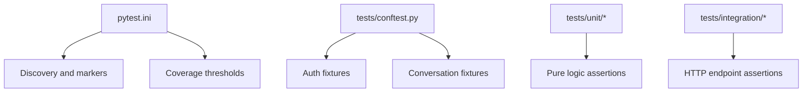
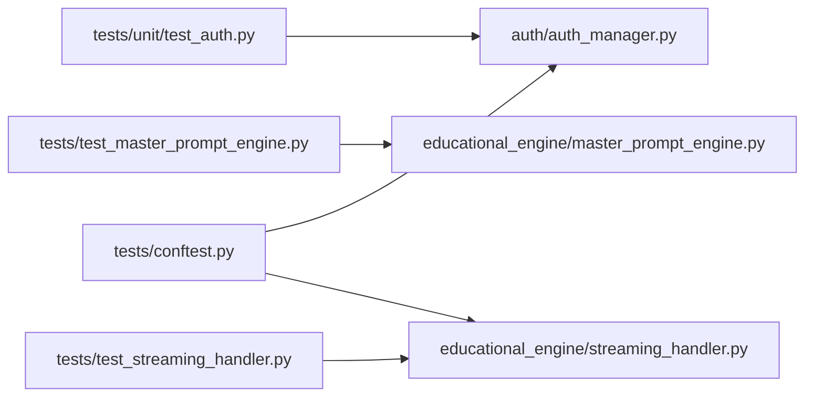

# Unit Testing

<cite>
**Referenced Files in This Document**
- [pytest.ini](file://pytest.ini)
- [run_tests.py](file://run_tests.py)
- [tests/conftest.py](file://tests/conftest.py)
- [tests/conftest_simple.py](file://tests/conftest_simple.py)
- [tests/unit/test_auth.py](file://tests/unit/test_auth.py)
- [tests/test_master_prompt_engine.py](file://tests/test_master_prompt_engine.py)
- [tests/test_streaming_handler.py](file://tests/test_streaming_handler.py)
- [tests/integration/test_api_auth.py](file://tests/integration/test_api_auth.py)
- [auth/auth_manager.py](file://auth/auth_manager.py)
- [educational_engine/master_prompt_engine.py](file://educational_engine/master_prompt_engine.py)
- [educational_engine/streaming_handler.py](file://educational_engine/streaming_handler.py)
</cite>

## Table of Contents
1. [Introduction](#introduction)
2. [Project Structure](#project-structure)
3. [Core Components](#core-components)
4. [Architecture Overview](#architecture-overview)
5. [Detailed Component Analysis](#detailed-component-analysis)
6. [Dependency Analysis](#dependency-analysis)
7. [Performance Considerations](#performance-considerations)
8. [Troubleshooting Guide](#troubleshooting-guide)
9. [Conclusion](#conclusion)
10. [Appendices](#appendices)

## Introduction
This document describes the unit testing implementation in MinerAI. It covers the pytest configuration, test fixtures, isolation strategies, and representative unit tests for authentication, streaming handlers, and the master prompt engine. It also documents coverage targets, assertion patterns, and debugging approaches tailored to the repository’s structure and technologies.

## Project Structure
MinerAI organizes tests under a dedicated tests directory with separate unit and integration suites. The repository defines a pytest configuration that enables async support, markers, coverage thresholds, and strictness. A comprehensive test runner script orchestrates suites and reports.

**Diagram sources**
- [pytest.ini:1-48](file://pytest.ini#L1-L48)
- [run_tests.py:1-105](file://run_tests.py#L1-L105)
- [tests/unit/test_auth.py:1-258](file://tests/unit/test_auth.py#L1-L258)
- [tests/test_master_prompt_engine.py:1-23](file://tests/test_master_prompt_engine.py#L1-L23)
- [tests/test_streaming_handler.py:1-42](file://tests/test_streaming_handler.py#L1-L42)
- [tests/integration/test_api_auth.py:1-407](file://tests/integration/test_api_auth.py#L1-L407)

**Section sources**
- [pytest.ini:1-48](file://pytest.ini#L1-L48)
- [run_tests.py:1-105](file://run_tests.py#L1-L105)

## Core Components
- Pytest configuration and markers define test discovery, async behavior, coverage thresholds, and selective execution via markers.
- Fixtures enable deterministic setup and teardown for authentication and conversation state, ensuring test isolation and repeatability.
- Unit tests validate pure logic components (authentication helpers, prompt synthesis, streaming phases) without external dependencies.
- Integration tests validate FastAPI endpoints and end-to-end flows using a TestClient.

Key configuration highlights:
- Discovery: testpaths, python_* patterns, and markers.
- Async: asyncio_mode and fixture loop scope.
- Coverage: HTML, terminal-missing, XML reports and a minimum threshold.
- Warnings and timeouts are tuned for stability.

**Section sources**
- [pytest.ini:1-48](file://pytest.ini#L1-L48)
- [tests/conftest.py:1-186](file://tests/conftest.py#L1-L186)
- [tests/conftest_simple.py:1-113](file://tests/conftest_simple.py#L1-L113)

## Architecture Overview
The unit testing architecture separates concerns:
- Unit tests focus on internal logic and pure functions.
- Integration tests validate HTTP endpoints and FastAPI wiring.
- Fixtures encapsulate shared setup/teardown logic for database-backed features.

**Diagram sources**
- [tests/unit/test_auth.py:1-258](file://tests/unit/test_auth.py#L1-L258)
- [tests/test_master_prompt_engine.py:1-23](file://tests/test_master_prompt_engine.py#L1-L23)
- [tests/test_streaming_handler.py:1-42](file://tests/test_streaming_handler.py#L1-L42)
- [tests/integration/test_api_auth.py:1-407](file://tests/integration/test_api_auth.py#L1-L407)
- [tests/conftest.py:1-186](file://tests/conftest.py#L1-L186)
- [tests/conftest_simple.py:1-113](file://tests/conftest_simple.py#L1-L113)
- [auth/auth_manager.py:1-393](file://auth/auth_manager.py#L1-L393)
- [educational_engine/master_prompt_engine.py:1-501](file://educational_engine/master_prompt_engine.py#L1-L501)
- [educational_engine/streaming_handler.py:1-193](file://educational_engine/streaming_handler.py#L1-L193)

## Detailed Component Analysis

### Authentication Module Unit Tests
These tests validate password hashing, token creation/verification, and user lifecycle operations. They rely on fixtures to provision test users and tokens, and they assert expected outcomes and error conditions.

**Diagram sources**
- [auth/auth_manager.py:58-393](file://auth/auth_manager.py#L58-L393)
- [tests/unit/test_auth.py:16-237](file://tests/unit/test_auth.py#L16-L237)

Assertion patterns and coverage targets:
- Password hashing produces non-empty strings and verifies correctly.
- Token creation yields long strings; verification extracts claims and handles expiration.
- Registration enforces uniqueness and returns appropriate messages.
- Login validates credentials and returns user info without leaking sensitive fields.
- Password change succeeds only with correct old password.

Isolation and mocking strategies:
- Fixtures create and clean up test users and conversations around each test.
- Database cleanup fixtures remove test users and related data before and after tests.
- Token and headers fixtures encapsulate auth state for downstream tests.

**Section sources**
- [tests/unit/test_auth.py:16-237](file://tests/unit/test_auth.py#L16-L237)
- [tests/conftest.py:34-110](file://tests/conftest.py#L34-L110)
- [auth/auth_manager.py:88-384](file://auth/auth_manager.py#L88-L384)

### Streaming Handler Unit Tests
This test validates the streaming phases produced by the handler. It asserts the order of emitted phases and the presence of expected keys in each chunk.

**Diagram sources**
- [tests/test_streaming_handler.py:7-42](file://tests/test_streaming_handler.py#L7-L42)
- [educational_engine/streaming_handler.py:36-123](file://educational_engine/streaming_handler.py#L36-L123)

Mocking and isolation:
- The test constructs a synthetic response dictionary and iterates the async generator to collect emitted phases.
- No external network calls are involved; the test focuses purely on phase ordering and chunk structure.

**Section sources**
- [tests/test_streaming_handler.py:1-42](file://tests/test_streaming_handler.py#L1-L42)
- [educational_engine/streaming_handler.py:1-193](file://educational_engine/streaming_handler.py#L1-L193)

### Master Prompt Engine Unit Tests
This test ensures the prompt building logic includes required sections and JSON shape keys. It exercises the internal prompt construction method with realistic contexts.

**Diagram sources**
- [tests/test_master_prompt_engine.py:4-23](file://tests/test_master_prompt_engine.py#L4-L23)
- [educational_engine/master_prompt_engine.py:155-244](file://educational_engine/master_prompt_engine.py#L155-L244)

Mocking and isolation:
- The test instantiates the engine and calls the internal prompt builder with controlled inputs.
- Assertions focus on the presence of required instructional sections and JSON structure keys.

**Section sources**
- [tests/test_master_prompt_engine.py:1-23](file://tests/test_master_prompt_engine.py#L1-L23)
- [educational_engine/master_prompt_engine.py:1-501](file://educational_engine/master_prompt_engine.py#L1-L501)

### Conceptual Overview
The repository’s test suite follows a layered approach:
- Unit tests for pure logic and internal components.
- Integration tests for HTTP endpoints and end-to-end flows.
- Fixtures manage test data and state, ensuring isolation and determinism.

[No sources needed since this diagram shows conceptual workflow, not actual code structure]

[No sources needed since this section doesn't analyze specific source files]

## Dependency Analysis
The unit tests depend on:
- Core modules for logic under test.
- Fixtures for setup/teardown and test data.
- Pytest configuration for discovery, markers, and coverage.

**Diagram sources**
- [tests/unit/test_auth.py:1-258](file://tests/unit/test_auth.py#L1-L258)
- [tests/test_master_prompt_engine.py:1-23](file://tests/test_master_prompt_engine.py#L1-L23)
- [tests/test_streaming_handler.py:1-42](file://tests/test_streaming_handler.py#L1-L42)
- [tests/conftest.py:1-186](file://tests/conftest.py#L1-L186)
- [auth/auth_manager.py:1-393](file://auth/auth_manager.py#L1-L393)
- [educational_engine/master_prompt_engine.py:1-501](file://educational_engine/master_prompt_engine.py#L1-L501)
- [educational_engine/streaming_handler.py:1-193](file://educational_engine/streaming_handler.py#L1-L193)

**Section sources**
- [tests/unit/test_auth.py:1-258](file://tests/unit/test_auth.py#L1-L258)
- [tests/test_master_prompt_engine.py:1-23](file://tests/test_master_prompt_engine.py#L1-L23)
- [tests/test_streaming_handler.py:1-42](file://tests/test_streaming_handler.py#L1-L42)
- [tests/conftest.py:1-186](file://tests/conftest.py#L1-L186)
- [auth/auth_manager.py:1-393](file://auth/auth_manager.py#L1-L393)
- [educational_engine/master_prompt_engine.py:1-501](file://educational_engine/master_prompt_engine.py#L1-L501)
- [educational_engine/streaming_handler.py:1-193](file://educational_engine/streaming_handler.py#L1-L193)

## Performance Considerations
- Unit tests avoid external I/O and network calls, keeping them fast and deterministic.
- Streaming handler tests use asyncio to simulate delays without blocking, maintaining responsiveness during assertions.
- Coverage thresholds ensure meaningful test breadth while preserving fast feedback loops.

[No sources needed since this section provides general guidance]

## Troubleshooting Guide
Common issues and remedies:
- Coverage failures: Ensure tests exercise all branches and maintain the configured minimum threshold.
- Fixture-related failures: Confirm that cleanup fixtures run before and after tests and that database state is reset.
- Async test failures: Use proper asyncio event loop handling and avoid mixing sync/async incorrectly.
- Environment variables: Some components rely on environment variables; ensure they are set appropriately for local runs.

Debugging approaches:
- Run specific test groups using markers to isolate failing areas.
- Increase verbosity and use short tracebacks for quicker diagnosis.
- Temporarily disable coverage to focus on logic correctness.

**Section sources**
- [pytest.ini:12-22](file://pytest.ini#L12-L22)
- [tests/conftest.py:34-78](file://tests/conftest.py#L34-L78)
- [run_tests.py:59-76](file://run_tests.py#L59-L76)

## Conclusion
MinerAI’s unit testing setup emphasizes clear separation between unit and integration tests, robust fixtures for isolation, and strong coverage enforcement. The authentication, streaming handler, and master prompt engine unit tests demonstrate targeted assertion patterns and effective isolation strategies. Together, these practices deliver reliable, maintainable tests that scale with the system.

[No sources needed since this section summarizes without analyzing specific files]

## Appendices

### Test Execution and Coverage
- Run unit tests scoped to the auth module and broader coverage using the provided runner.
- Coverage reports are generated in HTML, terminal-missing, and XML formats.

**Section sources**
- [run_tests.py:59-76](file://run_tests.py#L59-L76)
- [pytest.ini:16-21](file://pytest.ini#L16-L21)