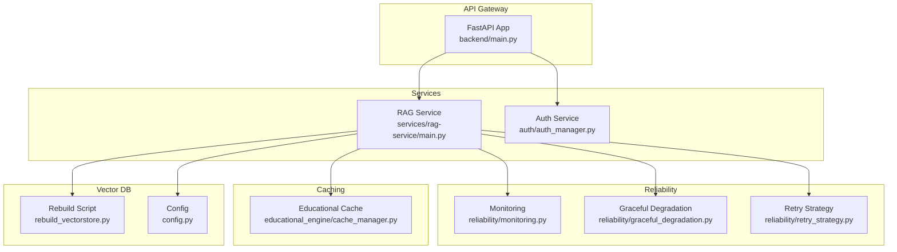
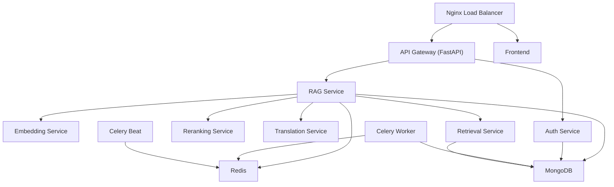
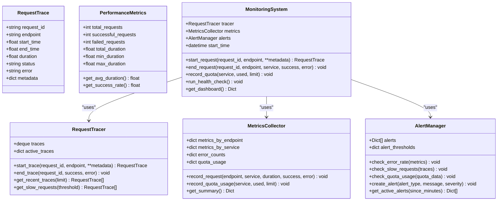
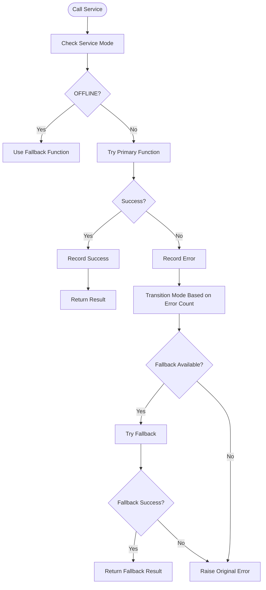
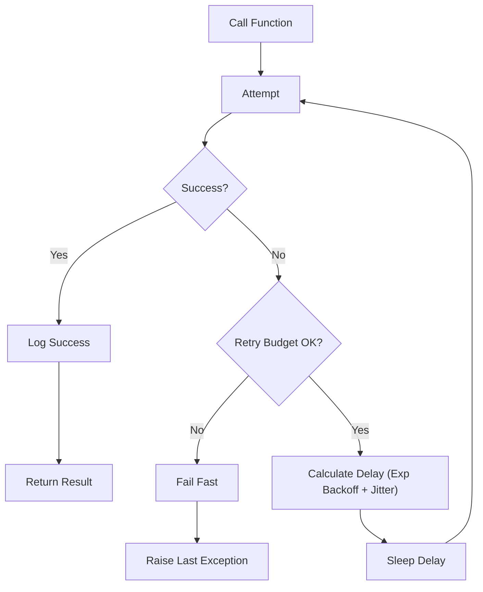
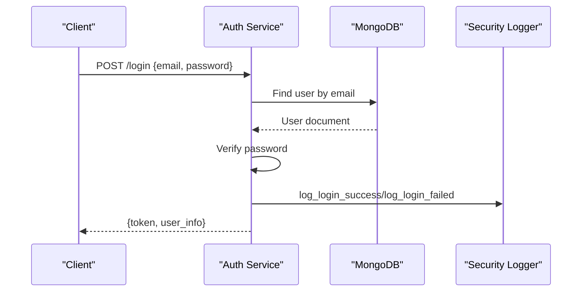
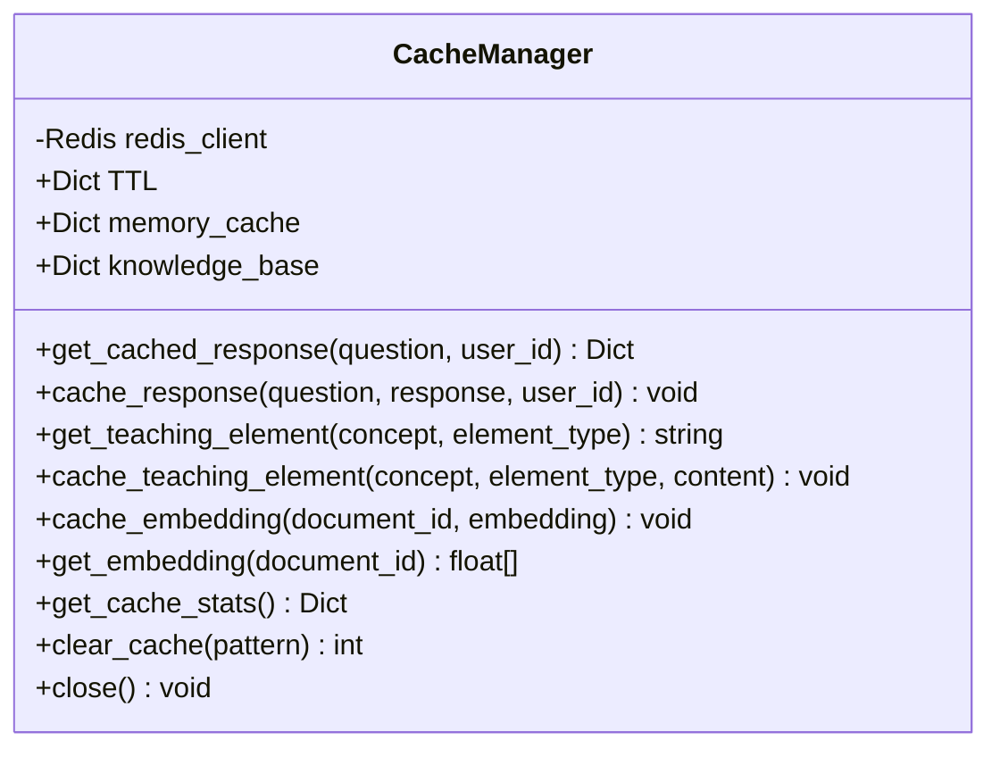
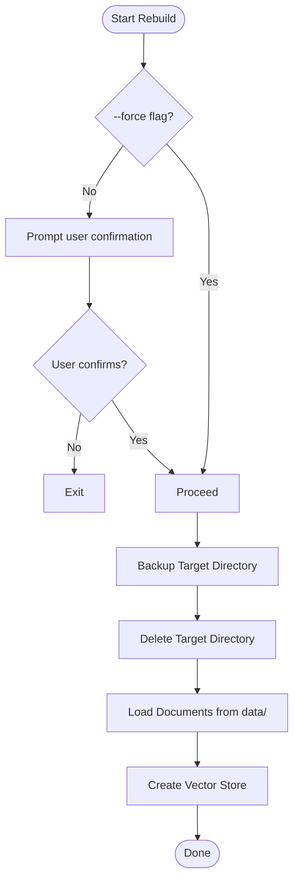
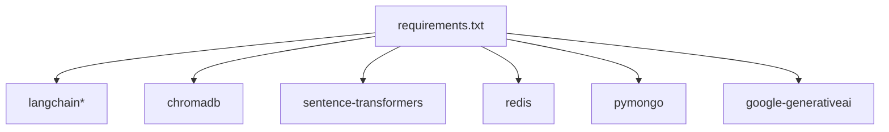

# Troubleshooting & Maintenance

<cite>
**Referenced Files in This Document**
- [backend/main.py](file://backend/main.py)
- [auth/auth_manager.py](file://auth/auth_manager.py)
- [reliability/monitoring.py](file://reliability/monitoring.py)
- [reliability/graceful_degradation.py](file://reliability/graceful_degradation.py)
- [reliability/retry_strategy.py](file://reliability/retry_strategy.py)
- [services/rag-service/main.py](file://services/rag-service/main.py)
- [config.py](file://config.py)
- [rebuild_vectorstore.py](file://rebuild_vectorstore.py)
- [docker-compose.production.yml](file://docker-compose.production.yml)
- [requirements.txt](file://requirements.txt)
- [security/security_logger.py](file://security/security_logger.py)
- [educational_engine/cache_manager.py](file://educational_engine/cache_manager.py)
</cite>

## Table of Contents
1. [Introduction](#introduction)
2. [Project Structure](#project-structure)
3. [Core Components](#core-components)
4. [Architecture Overview](#architecture-overview)
5. [Detailed Component Analysis](#detailed-component-analysis)
6. [Dependency Analysis](#dependency-analysis)
7. [Performance Considerations](#performance-considerations)
8. [Troubleshooting Guide](#troubleshooting-guide)
9. [Maintenance Procedures](#maintenance-procedures)
10. [Conclusion](#conclusion)

## Introduction
This document provides comprehensive troubleshooting and maintenance guidance for MinerAI. It covers common operational issues, diagnostics, monitoring, debugging, and maintenance workflows across the backend, authentication, vector database, and distributed services. It also includes practical steps for connection problems, performance tuning, authentication failures, vector database errors, system updates, backups, and disaster recovery.

## Project Structure
MinerAI is a modular FastAPI-based system with a distributed microservices architecture. Key areas include:
- Backend API gateway and core services
- Authentication and user management
- Reliability subsystems (monitoring, graceful degradation, retry)
- Educational engine caching
- Vector database management and rebuilding
- Production deployment via Docker Compose

**Diagram sources**
- [backend/main.py:1-69](file://backend/main.py#L1-L69)
- [services/rag-service/main.py:1-299](file://services/rag-service/main.py#L1-L299)
- [auth/auth_manager.py:1-393](file://auth/auth_manager.py#L1-L393)
- [reliability/monitoring.py:1-373](file://reliability/monitoring.py#L1-L373)
- [reliability/graceful_degradation.py:1-329](file://reliability/graceful_degradation.py#L1-L329)
- [reliability/retry_strategy.py:1-303](file://reliability/retry_strategy.py#L1-L303)
- [educational_engine/cache_manager.py:1-327](file://educational_engine/cache_manager.py#L1-L327)
- [rebuild_vectorstore.py:1-55](file://rebuild_vectorstore.py#L1-L55)
- [config.py:1-218](file://config.py#L1-L218)

**Section sources**
- [backend/main.py:1-69](file://backend/main.py#L1-L69)
- [services/rag-service/main.py:1-299](file://services/rag-service/main.py#L1-L299)
- [docker-compose.production.yml:1-359](file://docker-compose.production.yml#L1-L359)

## Core Components
- Backend API entrypoint initializes FastAPI, CORS, and routes, and exposes health checks.
- RAG Service orchestrates the pipeline, integrates Redis, external services, and Celery workers.
- Auth Manager supports JWT-based authentication with MongoDB or JSON fallback.
- Monitoring tracks request traces, aggregates metrics, and raises alerts.
- Graceful Degradation manages service modes and fallback responses.
- Retry Strategy implements exponential backoff and adaptive retry.
- Educational Cache Manager provides multi-layer caching for responses and teaching elements.
- Vector DB rebuild script automates safe rebuilding of ChromaDB with backup and rename strategies.
- Config centralizes paths, API keys, model settings, performance toggles, logging, and validation.

**Section sources**
- [backend/main.py:11-69](file://backend/main.py#L11-L69)
- [services/rag-service/main.py:31-299](file://services/rag-service/main.py#L31-L299)
- [auth/auth_manager.py:58-393](file://auth/auth_manager.py#L58-L393)
- [reliability/monitoring.py:261-373](file://reliability/monitoring.py#L261-L373)
- [reliability/graceful_degradation.py:74-329](file://reliability/graceful_degradation.py#L74-L329)
- [reliability/retry_strategy.py:86-303](file://reliability/retry_strategy.py#L86-L303)
- [educational_engine/cache_manager.py:31-327](file://educational_engine/cache_manager.py#L31-L327)
- [rebuild_vectorstore.py:1-55](file://rebuild_vectorstore.py#L1-L55)
- [config.py:138-218](file://config.py#L138-L218)

## Architecture Overview
The system runs as a multi-container Docker Compose stack with Nginx as the load balancer, a FastAPI gateway, microservices for RAG, embedding, retrieval, reranking, translation, and authentication, Redis for caching and Celery workers for async tasks, and MongoDB for persistence.

**Diagram sources**
- [docker-compose.production.yml:7-359](file://docker-compose.production.yml#L7-L359)

**Section sources**
- [docker-compose.production.yml:1-359](file://docker-compose.production.yml#L1-L359)

## Detailed Component Analysis

### Monitoring and Alerting
The monitoring system records request traces, aggregates performance metrics, and triggers alerts for high error rates, slow requests, and quota usage. It exposes a dashboard summarizing uptime, recent traces, slow requests, and active alerts.

**Diagram sources**
- [reliability/monitoring.py:22-373](file://reliability/monitoring.py#L22-L373)

**Section sources**
- [reliability/monitoring.py:261-373](file://reliability/monitoring.py#L261-L373)

### Graceful Degradation and Fallbacks
Graceful Degradation monitors service health and transitions between FULL, DEGRADED, MINIMAL, and OFFLINE modes. It provides fallback responses and timeout-handling strategies to maintain availability under failure conditions.

**Diagram sources**
- [reliability/graceful_degradation.py:158-209](file://reliability/graceful_degradation.py#L158-L209)

**Section sources**
- [reliability/graceful_degradation.py:74-329](file://reliability/graceful_degradation.py#L74-L329)

### Retry Strategy with Exponential Backoff
The retry system implements exponential backoff with jitter, retry budgets, and adaptive retry logic to prevent retry storms and improve resilience.

**Diagram sources**
- [reliability/retry_strategy.py:86-194](file://reliability/retry_strategy.py#L86-L194)

**Section sources**
- [reliability/retry_strategy.py:20-303](file://reliability/retry_strategy.py#L20-L303)

### Authentication and Security Logging
Authentication uses JWT with optional MongoDB-backed user storage and JSON fallback. Security logging captures security events, suspicious activity detection, and audit trails.

**Diagram sources**
- [auth/auth_manager.py:174-218](file://auth/auth_manager.py#L174-L218)
- [security/security_logger.py:138-156](file://security/security_logger.py#L138-L156)

**Section sources**
- [auth/auth_manager.py:58-393](file://auth/auth_manager.py#L58-L393)
- [security/security_logger.py:39-395](file://security/security_logger.py#L39-L395)

### Educational Cache Manager
The cache manager implements a four-layer cache: query responses, knowledge base, embeddings, and fragments, with Redis and in-memory layers and TTL policies.

**Diagram sources**
- [educational_engine/cache_manager.py:31-327](file://educational_engine/cache_manager.py#L31-L327)

**Section sources**
- [educational_engine/cache_manager.py:31-327](file://educational_engine/cache_manager.py#L31-L327)

### Vector Database Rebuild Workflow
The rebuild script safely backs up the target directory, deletes it, and rebuilds the vector store from loaded documents, ensuring minimal downtime and recoverability.

**Diagram sources**
- [rebuild_vectorstore.py:46-55](file://rebuild_vectorstore.py#L46-L55)

**Section sources**
- [rebuild_vectorstore.py:1-55](file://rebuild_vectorstore.py#L1-L55)

## Dependency Analysis
External dependencies include LangChain, ChromaDB, sentence-transformers, Redis, MongoDB, and Google Generative AI. These are declared in requirements and used across services and components.

**Diagram sources**
- [requirements.txt:1-43](file://requirements.txt#L1-L43)

**Section sources**
- [requirements.txt:1-43](file://requirements.txt#L1-L43)

## Performance Considerations
- Enable and tune caches: embedding, BM25, vector DB, and educational cache.
- Adjust concurrency and batch sizes for embedding and vector DB operations.
- Use Redis for query response caching and reduce LLM calls.
- Monitor slow requests and error rates via the monitoring system.
- Apply graceful degradation and fallbacks to maintain responsiveness under load.

[No sources needed since this section provides general guidance]

## Troubleshooting Guide

### Connection Problems
Symptoms:
- Services unreachable or health checks failing.
- Redis/MongoDB connectivity errors.
- Cross-service communication timeouts.

Common causes and fixes:
- Verify service endpoints and environment variables in compose.
- Check Redis and MongoDB health checks and container logs.
- Ensure proper network configuration and port mappings.
- Validate API keys and service URLs in the RAG service.

**Section sources**
- [docker-compose.production.yml:61-66](file://docker-compose.production.yml#L61-L66)
- [docker-compose.production.yml:276-281](file://docker-compose.production.yml#L276-L281)
- [services/rag-service/main.py:21-44](file://services/rag-service/main.py#L21-L44)

### Authentication Failures
Symptoms:
- Login failures, expired tokens, or unauthorized access.
- Missing JWT secret or invalid configuration.

Common causes and fixes:
- Set JWT_SECRET_KEY in environment variables.
- Verify MongoDB URI and collection indices.
- Check password hashing and token verification logic.
- Review security logs for suspicious activity.

**Section sources**
- [auth/auth_manager.py:21-34](file://auth/auth_manager.py#L21-L34)
- [auth/auth_manager.py:62-87](file://auth/auth_manager.py#L62-L87)
- [security/security_logger.py:138-250](file://security/security_logger.py#L138-L250)

### Performance Issues
Symptoms:
- Slow response times, high error rates, or quota exhaustion.

Common causes and fixes:
- Enable and monitor caching layers (Redis, educational cache).
- Tune chunking, hybrid search weights, and reranking thresholds.
- Use monitoring dashboards to identify slow endpoints and traces.
- Apply graceful degradation and retry strategies.

**Section sources**
- [config.py:99-111](file://config.py#L99-L111)
- [config.py:138-160](file://config.py#L138-L160)
- [reliability/monitoring.py:309-328](file://reliability/monitoring.py#L309-L328)
- [reliability/graceful_degradation.py:158-209](file://reliability/graceful_degradation.py#L158-L209)
- [reliability/retry_strategy.py:86-194](file://reliability/retry_strategy.py#L86-L194)

### Vector Database Errors
Symptoms:
- ChromaDB persistence errors, permission issues, or rebuild failures.

Common causes and fixes:
- Run the rebuild script with backup and safe deletion.
- Ensure write permissions for the target directory.
- Validate embedding model and chunking settings.
- Check service health and logs for persistent failures.

**Section sources**
- [rebuild_vectorstore.py:12-32](file://rebuild_vectorstore.py#L12-L32)
- [config.py:138-160](file://config.py#L138-L160)

### Debugging Techniques
- Use monitoring dashboards to inspect recent traces and slow requests.
- Inspect security logs for authentication and access events.
- Enable detailed logging via configuration and review log files.
- Leverage graceful degradation fallbacks to isolate failing components.

**Section sources**
- [reliability/monitoring.py:309-328](file://reliability/monitoring.py#L309-L328)
- [security/security_logger.py:64-93](file://security/security_logger.py#L64-L93)
- [config.py:122-128](file://config.py#L122-L128)

## Maintenance Procedures

### System Updates
- Update dependencies via requirements and rebuild containers.
- Validate configuration changes and run health checks.
- Restart services in order: Redis, MongoDB, then API gateway and services.

**Section sources**
- [requirements.txt:1-43](file://requirements.txt#L1-L43)
- [docker-compose.production.yml:61-66](file://docker-compose.production.yml#L61-L66)

### Backup Procedures
- Backup ChromaDB directories before rebuilds.
- Maintain MongoDB backups according to your retention policy.
- Keep security logs rotated and retained per policy.

**Section sources**
- [rebuild_vectorstore.py:12-18](file://rebuild_vectorstore.py#L12-L18)
- [docker-compose.production.yml:284-359](file://docker-compose.production.yml#L284-L359)
- [security/security_logger.py:72-92](file://security/security_logger.py#L72-L92)

### Disaster Recovery
- Restore from latest backups and redeploy compose stack.
- Validate service health checks and connectivity.
- Gradually restore traffic and monitor metrics.

**Section sources**
- [docker-compose.production.yml:61-66](file://docker-compose.production.yml#L61-L66)
- [docker-compose.production.yml:276-281](file://docker-compose.production.yml#L276-L281)

### Diagnostic Tools and Logging
- Monitoring dashboard for uptime, metrics, recent traces, slow requests, and alerts.
- Security logger for audit trails and suspicious activity detection.
- Application logs configured with rotation and file paths.

**Section sources**
- [reliability/monitoring.py:309-328](file://reliability/monitoring.py#L309-L328)
- [security/security_logger.py:64-93](file://security/security_logger.py#L64-L93)
- [config.py:122-128](file://config.py#L122-L128)

### Performance Optimization Techniques
- Enable caching layers and adjust TTLs.
- Tune chunking and hybrid search weights.
- Use adaptive retry and graceful degradation.
- Monitor and scale Redis and MongoDB capacity.

**Section sources**
- [educational_engine/cache_manager.py:53-59](file://educational_engine/cache_manager.py#L53-L59)
- [config.py:67-87](file://config.py#L67-L87)
- [reliability/retry_strategy.py:197-240](file://reliability/retry_strategy.py#L197-L240)
- [reliability/graceful_degradation.py:18-24](file://reliability/graceful_degradation.py#L18-L24)

## Conclusion
This guide consolidates MinerAI’s operational and maintenance practices. By leveraging monitoring, graceful degradation, retry strategies, robust logging, and structured maintenance workflows—especially around vector database rebuilds—you can sustain reliable performance, quickly diagnose issues, and recover from incidents efficiently.